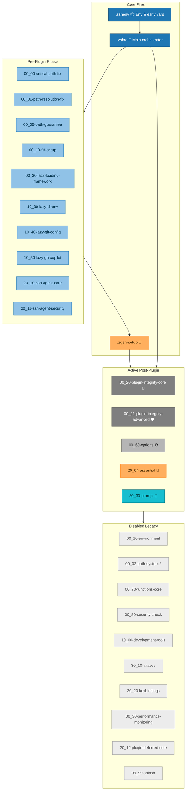
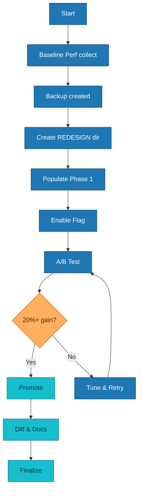
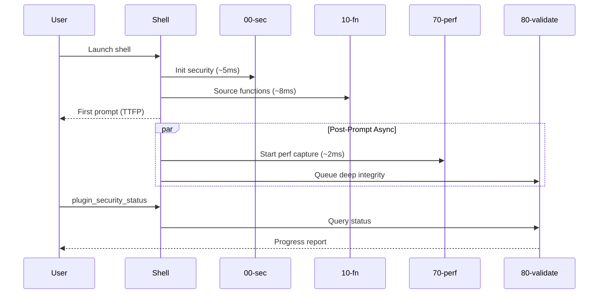
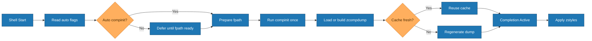
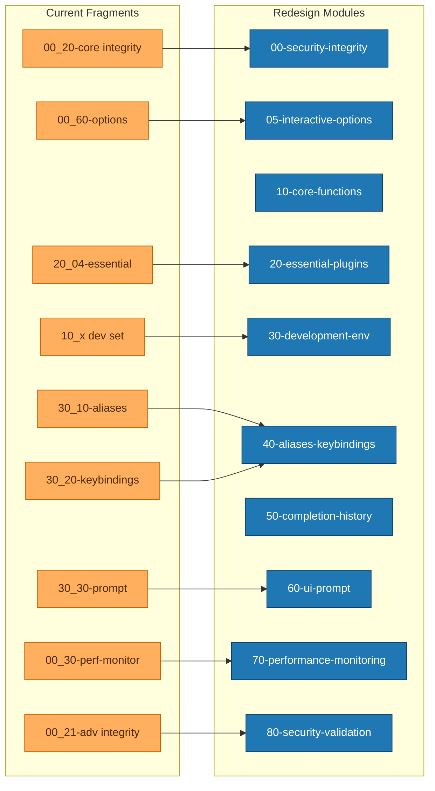
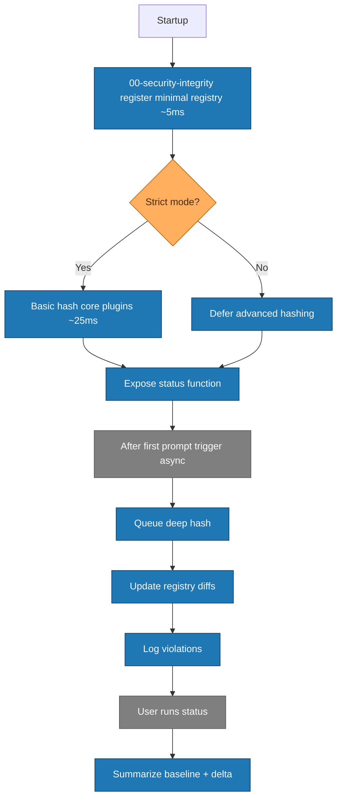
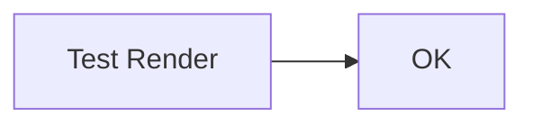

# ZSH Configuration Redesign – Visual Documentation
Date: 2025-08-29
Accessibility: Palette avoids red/green; uses blue (#1f77b4), orange (#ff7f0e), gray (#7f7f7f), accent teal (#17becf). Shapes & emojis reinforce semantics.

---
## 1. Current Configuration Relationships

---
## 2. Proposed Redesign Structure

```mermaid
flowchart LR
    subgraph NEW[.zshrc.d.REDESIGN]
        N00[00-security-integrity 🔐 ~5ms]:::security
        N05[05-interactive-options ⚙️ ~3ms]:::config
        N10[10-core-functions 🧰 ~8ms]:::core
        N20[20-essential-plugins 🧩 guard ~15ms]:::plugin
        N30[30-development-env 🛠️ ~10ms]:::plugin
        N40[40-aliases-keybindings ⌨️ ~5ms]:::config
        N50[50-completion-history 📘 ~12ms]:::config
        N60[60-ui-prompt 🎨 starship/p10k ~40ms]:::ui
        N70[70-performance-monitoring 🧪 defer ~2ms]:::perf
        N80[80-security-validation 🛡️ async ~0ms upfront]:::security
        N90[90-splash ✅ ~2ms]:::ui
    end
    ZRC[.zshrc 🚀]:::core --> N00 --> N05 --> N10 --> N20 --> N30 --> N40 --> N50 --> N60 --> N70 --> N80 --> N90
    classDef core fill:#1f77b4,stroke:#0d3d63,color:#fff
    classDef plugin fill:#ffaf5e,stroke:#ff7f0e,color:#4a2b00
    classDef security fill:#7f7f7f,stroke:#555,color:#fff
    classDef config fill:#b5b5b5,stroke:#555,color:#222
    classDef ui fill:#17becf,stroke:#0e6f78,color:#00363a
    classDef perf fill:#c9d1d9,stroke:#555,color:#222
```

Legend: Approximate synchronous cost; async work excluded.

---
## 3. Migration Flow

---
## 4. Loading Sequence (Simplified Gantt)

```mermaid
gantt
    dateFormat  X
    title Startup Order (Abstract Slots)
    section Core
    .zshenv ~5ms          :done,    a1, 0, 5
    .zshrc bootstrap ~8ms :active,  a2, 5, 5
    section Pre-Plugin
    Pre-plugins ~20ms     :a3, 10, 8
    zgenom init ~120ms    :a4, 18, 10
    section Post-Plugin Core
    00-security ~5ms      :a5, 28, 2
    05-options ~3ms       :a6, 30, 2
    10-functions ~8ms     :a7, 32, 2
    20-essential ~15ms    :a8, 34, 3
    30-dev-env ~10ms      :a9, 37, 3
    40-aliases ~5ms       :a10,40, 2
    50-completion ~12ms   :a11,42, 3
    60-ui-prompt ~40ms    :a12,45, 4
    section Deferred
    70-perf hook ~2ms     :a13,49, 5
    80-security async     :a14,54, 6
    90-splash ~2ms        :a15,60, 1
```

---
## 5. Async & Lazy Interaction

---
## 6. Completion Workflow (Corrected)

---
## 7. Consolidation Diff (Current → Redesign)

---
## 8. Plugin Integrity Phases

---
## 9. Minimal Test Render (Validation Snippet)

---
## 10. Color & Symbol Reference
| Emoji | Meaning |
|-------|---------|
| 🔐 / 🛡️ | Security (lightweight / advanced) |
| ⚙️ | Interactive options / configuration |
| 🧰 | Core reusable functions |
| 🧩 | Plugin management or essential set |
| 🛠️ | Development tooling environment |
| ⌨️ | Aliases & keybindings |
| 📘 | Completion & history styling |
| 🎨 | UI & prompt theming |
| 🧪 | Performance monitoring |
| ✅ | Finalization / splash |
| 📄 | Legacy/archived |

---
Generated as part of redesign planning deliverables.
