# 3. Chinook Database Factories Guide

## 3.1. Overview

This guide provides comprehensive instructions for creating modern Laravel 12 model factories for the Chinook database schema. Factories generate realistic test data that respects database relationships and constraints, while supporting all modern Laravel 12 features including closure table hierarchies, secondary unique keys, slugs, user stamps, and tags.

**Modern Laravel 12 Features Supported:**
- **Closure Table Hierarchies**: Efficient hierarchical category data generation
- **Secondary Unique Keys**: Automatic generation of public_id values (ULID/UUID/Snowflake)
- **Slugs**: Automatic slug generation from public_id
- **User Stamps**: Proper user assignment for created_by/updated_by
- **Tags**: Realistic tag assignment for categorization
- **Enhanced Data**: Rich metadata and business-relevant test data

## 3.2. Single Taxonomy System Strategy

**🎯 IMPORTANT**: The Chinook implementation uses a **single taxonomy system** with direct mapping from original chinook.sql genre data using the `aliziodev/laravel-taxonomy` package.

### 3.2.1. Direct Taxonomy Mapping Approach

```mermaid
graph TD
    A[Original chinook.sql Genres] --> B[Direct Taxonomy Mapping]
    B --> C[25 Genre Taxonomies]
    C --> D[Track → Taxonomy Relationships]
    D --> E[Single System Architecture]
    E --> F[Clean Greenfield Implementation]

    style A fill:#d32f2f,stroke:#fff,color:#fff
    style B fill:#1976d2,stroke:#fff,color:#fff
    style C fill:#388e3c,stroke:#fff,color:#fff
    style D fill:#f57c00,stroke:#fff,color:#fff
```



**Key Principles:**

1. **Single Taxonomy System**: Use only `aliziodev/laravel-taxonomy` package for all categorization
2. **Direct Mapping**: Map original 25 genres directly to taxonomy records without enhancement
3. **Factory Integration**: Factories reference taxonomy records directly for genre relationships
4. **Clean Architecture**: No dual systems or migration complexity - greenfield implementation

### 3.2.2. Factory Implementation Guidelines

```php
<?php
// ✅ CORRECT: Use taxonomy relationships directly
$track->attachTaxonomy(
    Taxonomy::where('type', 'genre')->where('name', 'Rock')->first()->id
);

// ✅ CORRECT: Reference existing taxonomy by original ID
$rockTaxonomy = Taxonomy::where('type', 'genre')
    ->where('meta->original_id', 1)
    ->first();

// ✅ CORRECT: Random genre taxonomy selection
$randomGenreTaxonomy = Taxonomy::where('type', 'genre')
    ->inRandomOrder()
    ->first();

// ❌ INCORRECT: Do not reference Genre model (not used in single taxonomy system)
'genre_id' => Genre::factory(), // Genre model not used

// ❌ INCORRECT: Do not hardcode taxonomy IDs
$track->attachTaxonomy(1); // Fragile - depends on seeding order
```

### 3.2.3. Direct Taxonomy Mapping List

The following 25 genres are mapped directly from chinook.sql to taxonomy records:

1. Rock, 2. Jazz, 3. Metal, 4. Alternative & Punk, 5. Rock And Roll, 6. Blues, 7. Latin, 8. Reggae, 9. Pop, 10. Soundtrack, 11. Bossa Nova, 12. Easy Listening, 13. Heavy Metal, 14. R&B/Soul, 15. Electronica/Dance, 16. World, 17. Hip Hop/Rap, 18. Science Fiction, 19. TV Shows, 20. Sci Fi & Fantasy, 21. Drama, 22. Comedy, 23. Alternative, 24. Classical, 25. Opera

**Factory Usage**: Reference these taxonomies by name or original_id metadata for consistent factory data generation.

## 3.3. Factory Creation Commands

### 3.3.1. Generate All Factories

```bash
# Core music factories (Single taxonomy system - no Genre or Category factories needed)
php artisan make:factory ArtistFactory --model=Artist
php artisan make:factory AlbumFactory --model=Album
php artisan make:factory TrackFactory --model=Track
# NOTE: No GenreFactory or CategoryFactory - use taxonomy system directly
php artisan make:factory MediaTypeFactory --model=MediaType

# Customer and employee factories
php artisan make:factory CustomerFactory --model=Customer
php artisan make:factory EmployeeFactory --model=Employee

# Sales factories
php artisan make:factory InvoiceFactory --model=Invoice
php artisan make:factory InvoiceLineFactory --model=InvoiceLine

# Playlist factory
php artisan make:factory PlaylistFactory --model=Playlist
```

## 3.4. Factory Implementations

### 3.4.1. Artist Factory

```php
<?php

declare(strict_types=1);

namespace Database\Factories;

use App\Models\Artist;
use App\Models\User;
use Illuminate\Database\Eloquent\Factories\Factory;

/**
 * @extends \Illuminate\Database\Eloquent\Factories\Factory<\App\Models\Artist>
 */
class ArtistFactory extends Factory
{
    /**
     * The name of the factory's corresponding model.
     */
    protected $model = Artist::class;

    /**
     * Define the model's default state.
     */
    public function definition(): array
    {
        return [
            'name' => fake()->unique()->randomElement([
                'The Beatles',
                'Led Zeppelin',
                'Pink Floyd',
                'Queen',
                'The Rolling Stones',
                'AC/DC',
                'Metallica',
                'Nirvana',
                'Radiohead',
                'U2',
                'Bob Dylan',
                'The Who',
                'David Bowie',
                'Jimi Hendrix',
                'The Doors',
            ]) ?? fake()->company() . ' Band',

            // Enhanced fields
            'biography' => fake()->optional(0.7)->paragraphs(3, true),
            'website' => fake()->optional(0.5)->url(),
            'social_links' => fake()->optional(0.6)->randomElement([
                [
                    'twitter' => 'https://twitter.com/' . fake()->userName(),
                    'instagram' => 'https://instagram.com/' . fake()->userName(),
                    'facebook' => 'https://facebook.com/' . fake()->userName(),
                ],
                [
                    'spotify' => 'https://open.spotify.com/artist/' . fake()->uuid(),
                    'youtube' => 'https://youtube.com/c/' . fake()->userName(),
                ],
            ]),

            // User stamps (will be set automatically by the trait)
            'created_by' => User::factory(),
            'updated_by' => User::factory(),
        ];
    }

    /**
     * Configure the model factory.
     */
    public function configure(): static
    {
        return $this->afterCreating(function (Artist $artist) {
            // Add realistic tags
            $tags = $this->faker->randomElements([
                'rock', 'classic-rock', 'hard-rock', 'progressive-rock',
                'jazz', 'blues', 'folk', 'country', 'pop', 'alternative',
                'metal', 'heavy-metal', 'punk', 'indie', 'electronic',
                'soul', 'funk', 'reggae', 'hip-hop', 'classical',
            ], $this->faker->numberBetween(1, 4));

            $artist->attachTags($tags);
        });
    }

    /**
     * Create a rock artist.
     */
    public function rock(): static
    {
        return $this->state(fn (array $attributes) => [
            'name' => $this->faker->randomElement([
                'Iron Maiden',
                'Black Sabbath',
                'Deep Purple',
                'Judas Priest',
                'Motorhead',
                'Ozzy Osbourne',
                'Dio',
                'Rainbow',
            ]),
        ])->afterCreating(function (Artist $artist) {
            $artist->syncTags(['rock', 'hard-rock', 'metal']);
        });
    }

    /**
     * Create a jazz artist.
     */
    public function jazz(): static
    {
        return $this->state(fn (array $attributes) => [
            'name' => $this->faker->randomElement([
                'Miles Davis',
                'John Coltrane',
                'Duke Ellington',
                'Charlie Parker',
                'Thelonious Monk',
                'Bill Evans',
                'Herbie Hancock',
                'Wayne Shorter',
            ]),
        ])->afterCreating(function (Artist $artist) {
            $artist->syncTags(['jazz', 'blues', 'instrumental']);
        });
    }

    /**
     * Create a popular artist with enhanced data.
     */
    public function popular(): static
    {
        return $this->state(fn (array $attributes) => [
            'biography' => $this->faker->paragraphs(5, true),
            'website' => $this->faker->url(),
            'social_links' => [
                'twitter' => 'https://twitter.com/' . $this->faker->userName(),
                'instagram' => 'https://instagram.com/' . $this->faker->userName(),
                'facebook' => 'https://facebook.com/' . $this->faker->userName(),
                'spotify' => 'https://open.spotify.com/artist/' . $this->faker->uuid(),
                'youtube' => 'https://youtube.com/c/' . $this->faker->userName(),
                'website' => $this->faker->url(),
            ],
        ]);
    }
}
```

### 3.3.2. Category Factory (Replaces Genre Factory - Closure Table Support)

```php
<?php

declare(strict_types=1);

namespace Database\Factories;

use App\Models\Category;
use App\Models\User;
use App\Enums\CategoryType;
use Illuminate\Database\Eloquent\Factories\Factory;

/**
 * @extends \Illuminate\Database\Eloquent\Factories\Factory<\App\Models\Category>
 */
class CategoryFactory extends Factory
{
    /**
     * The name of the factory's corresponding model.
     */
    protected $model = Category::class;

    /**
     * Define the model's default state.
     */
    public function definition(): array
    {
        $type = $this->faker->randomElement(CategoryType::cases());
        $categoryData = $this->getCategoryDataByType($type);

        return [
            'name' => $categoryData['name'],
            'description' => $categoryData['description'],
            'type' => $type,
            'color' => $categoryData['color'],
            'icon' => $categoryData['icon'],
            'sort_order' => $this->faker->numberBetween(1, 100),
            'is_active' => $this->faker->boolean(90), // 90% chance of being active
            'metadata' => $categoryData['metadata'] ?? null,

            // User stamps
            'created_by' => User::factory(),
            'updated_by' => User::factory(),
        ];
    }

    /**
     * Get category data based on type.
     */
    private function getCategoryDataByType(CategoryType $type): array
    {
        return match($type) {
            CategoryType::GENRE => $this->faker->randomElement([
                ['name' => 'Rock', 'color' => '#FF6B6B', 'icon' => 'fas fa-guitar', 'description' => 'A broad genre of popular music that originated as "rock and roll"'],
                ['name' => 'Jazz', 'color' => '#4ECDC4', 'icon' => 'fas fa-music', 'description' => 'A music genre that originated in the African-American communities'],
                ['name' => 'Metal', 'color' => '#45B7D1', 'icon' => 'fas fa-bolt', 'description' => 'A genre of rock music that developed in the late 1960s and early 1970s'],
                ['name' => 'Classical', 'color' => '#98D8C8', 'icon' => 'fas fa-violin', 'description' => 'Art music produced or rooted in Western musical traditions'],
                ['name' => 'Electronic', 'color' => '#BB8FCE', 'icon' => 'fas fa-microchip', 'description' => 'Music that employs electronic musical instruments'],
            ]),
            CategoryType::MOOD => $this->faker->randomElement([
                ['name' => 'Energetic', 'color' => '#FF6B6B', 'icon' => 'fas fa-bolt', 'description' => 'High energy and motivational music'],
                ['name' => 'Relaxing', 'color' => '#4ECDC4', 'icon' => 'fas fa-leaf', 'description' => 'Calm and peaceful music'],
                ['name' => 'Melancholic', 'color' => '#6C7CE0', 'icon' => 'fas fa-cloud-rain', 'description' => 'Sad and nostalgic music'],
                ['name' => 'Upbeat', 'color' => '#FFD93D', 'icon' => 'fas fa-sun', 'description' => 'Happy and cheerful music'],
            ]),
            CategoryType::THEME => $this->faker->randomElement([
                ['name' => 'Workout', 'color' => '#FF6B6B', 'icon' => 'fas fa-dumbbell', 'description' => 'Music for exercise and fitness'],
                ['name' => 'Study', 'color' => '#4ECDC4', 'icon' => 'fas fa-book', 'description' => 'Music for concentration and focus'],
                ['name' => 'Party', 'color' => '#FFD93D', 'icon' => 'fas fa-glass-cheers', 'description' => 'Music for celebrations and parties'],
                ['name' => 'Romance', 'color' => '#FF69B4', 'icon' => 'fas fa-heart', 'description' => 'Music for romantic moments'],
            ]),
            CategoryType::ERA => $this->faker->randomElement([
                ['name' => '1960s', 'color' => '#8B4513', 'icon' => 'fas fa-clock', 'description' => 'Music from the 1960s'],
                ['name' => '1980s', 'color' => '#FF1493', 'icon' => 'fas fa-clock', 'description' => 'Music from the 1980s'],
                ['name' => '2000s', 'color' => '#00CED1', 'icon' => 'fas fa-clock', 'description' => 'Music from the 2000s'],
                ['name' => '2020s', 'color' => '#32CD32', 'icon' => 'fas fa-clock', 'description' => 'Contemporary music from the 2020s'],
            ]),
            CategoryType::INSTRUMENT => $this->faker->randomElement([
                ['name' => 'Piano', 'color' => '#000000', 'icon' => 'fas fa-piano', 'description' => 'Piano-focused music'],
                ['name' => 'Guitar', 'color' => '#8B4513', 'icon' => 'fas fa-guitar', 'description' => 'Guitar-focused music'],
                ['name' => 'Orchestral', 'color' => '#FFD700', 'icon' => 'fas fa-music', 'description' => 'Orchestral and symphonic music'],
                ['name' => 'Electronic', 'color' => '#00FFFF', 'icon' => 'fas fa-microchip', 'description' => 'Electronic instrument music'],
            ]),
            CategoryType::LANGUAGE => $this->faker->randomElement([
                ['name' => 'English', 'color' => '#FF0000', 'icon' => 'fas fa-flag-usa', 'description' => 'English language music'],
                ['name' => 'Spanish', 'color' => '#FFFF00', 'icon' => 'fas fa-flag', 'description' => 'Spanish language music'],
                ['name' => 'Instrumental', 'color' => '#808080', 'icon' => 'fas fa-music', 'description' => 'Instrumental music without vocals'],
            ]),
            CategoryType::OCCASION => $this->faker->randomElement([
                ['name' => 'Wedding', 'color' => '#FFFFFF', 'icon' => 'fas fa-ring', 'description' => 'Music for wedding ceremonies'],
                ['name' => 'Birthday', 'color' => '#FFB6C1', 'icon' => 'fas fa-birthday-cake', 'description' => 'Music for birthday celebrations'],
                ['name' => 'Holiday', 'color' => '#228B22', 'icon' => 'fas fa-tree', 'description' => 'Music for holidays and festivals'],
            ]),
        };
    }

    /**
     * Configure the model factory.
     */
    public function configure(): static
    {
        return $this->afterCreating(function (Category $category) {
            // Add meta tags based on category type and name
            $baseTags = ['music', 'category', $category->type->value];
            $specificTags = match($category->type) {
                CategoryType::GENRE => match(strtolower($category->name)) {
                    'rock' => ['electric', 'guitar', 'drums'],
                    'jazz' => ['improvisation', 'swing', 'brass'],
                    'metal' => ['heavy', 'distortion', 'aggressive'],
                    'classical' => ['orchestral', 'symphony', 'instrumental'],
                    'electronic' => ['synthesizer', 'digital', 'beats'],
                    default => ['popular', 'mainstream'],
                },
                CategoryType::MOOD => ['emotion', 'feeling', 'atmosphere'],
                CategoryType::THEME => ['purpose', 'activity', 'context'],
                CategoryType::ERA => ['time', 'period', 'decade'],
                CategoryType::INSTRUMENT => ['musical', 'instrument', 'sound'],
                CategoryType::LANGUAGE => ['linguistic', 'vocal', 'cultural'],
                CategoryType::OCCASION => ['event', 'celebration', 'gathering'],
            };

            $category->attachTags(array_merge($baseTags, $specificTags));
        });
    }

    /**
     * Create a category with a specific type.
     */
    public function ofType(CategoryType $type): static
    {
        return $this->state(fn (array $attributes) => [
            'type' => $type,
        ]);
    }

    /**
     * Create an active category.
     */
    public function active(): static
    {
        return $this->state(fn (array $attributes) => [
            'is_active' => true,
        ]);
    }

    /**
     * Create an inactive category.
     */
    public function inactive(): static
    {
        return $this->state(fn (array $attributes) => [
            'is_active' => false,
        ]);
    }

    /**
     * Create a category as a child of another category (closure table).
     */
    public function childOf(Category $parent): static
    {
        return $this->afterCreating(function (Category $category) use ($parent) {
            $category->makeChildOf($parent);
        });
    }

    /**
     * Create a root category (no parents).
     */
    public function root(): static
    {
        return $this->afterCreating(function (Category $category) {
            // Root categories don't need special handling in closure table
            // They simply won't have any parent relationships
        });
    }
}
```

### 3.3.3. MediaType Factory

```php
<?php

declare(strict_types=1);

namespace Database\Factories;

use App\Models\MediaType;
use Illuminate\Database\Eloquent\Factories\Factory;

/**
 * @extends \Illuminate\Database\Eloquent\Factories\Factory<\App\Models\MediaType>
 */
class MediaTypeFactory extends Factory
{
    /**
     * The name of the factory's corresponding model.
     */
    protected $model = MediaType::class;

    /**
     * Define the model's default state.
     */
    public function definition(): array
    {
        return [
            'name' => $this->faker->unique()->randomElement([
                'MPEG audio file',
                'Protected AAC audio file',
                'Protected MPEG-4 video file',
                'Purchased AAC audio file',
                'AAC audio file',
                'FLAC audio file',
                'WAV audio file',
                'OGG audio file',
            ]),
        ];
    }
}
```

### 3.3.4. Album Factory

```php
<?php

declare(strict_types=1);

namespace Database\Factories;

use App\Models\Album;
use App\Models\Artist;
use Illuminate\Database\Eloquent\Factories\Factory;

/**
 * @extends \Illuminate\Database\Eloquent\Factories\Factory<\App\Models\Album>
 */
class AlbumFactory extends Factory
{
    /**
     * The name of the factory's corresponding model.
     */
    protected $model = Album::class;

    /**
     * Define the model's default state.
     */
    public function definition(): array
    {
        return [
            'title' => $this->faker->sentence(rand(1, 4), false),
            'artist_id' => Artist::factory(),
        ];
    }

    /**
     * Create an album for an existing artist.
     */
    public function forArtist(Artist $artist): static
    {
        return $this->state(fn (array $attributes) => [
            'artist_id' => $artist->id,
        ]);
    }

    /**
     * Create a classic rock album.
     */
    public function classicRock(): static
    {
        return $this->state(fn (array $attributes) => [
            'title' => $this->faker->randomElement([
                'Dark Side of the Moon',
                'Led Zeppelin IV',
                'Abbey Road',
                'The Wall',
                'Back in Black',
                'Rumours',
                'Hotel California',
                'Born to Run',
            ]),
        ]);
    }
}
```

### 3.3.5. Employee Factory

```php
<?php

declare(strict_types=1);

namespace Database\Factories;

use App\Models\Employee;
use Illuminate\Database\Eloquent\Factories\Factory;

/**
 * @extends \Illuminate\Database\Eloquent\Factories\Factory<\App\Models\Employee>
 */
class EmployeeFactory extends Factory
{
    /**
     * The name of the factory's corresponding model.
     */
    protected $model = Employee::class;

    /**
     * Define the model's default state.
     */
    public function definition(): array
    {
        return [
            'last_name' => $this->faker->lastName(),
            'first_name' => $this->faker->firstName(),
            'title' => $this->faker->randomElement([
                'General Manager',
                'Sales Manager',
                'Sales Support Agent',
                'IT Manager',
                'IT Staff',
                'Customer Service Representative',
                'Marketing Manager',
                'Accountant',
            ]),
            'reports_to' => null, // Will be set by relationships
            'birth_date' => $this->faker->dateTimeBetween('-65 years', '-25 years'),
            'hire_date' => $this->faker->dateTimeBetween('-20 years', '-1 year'),
            'address' => $this->faker->streetAddress(),
            'city' => $this->faker->city(),
            'state' => $this->faker->stateAbbr(),
            'country' => $this->faker->country(),
            'postal_code' => $this->faker->postcode(),
            'phone' => $this->faker->phoneNumber(),
            'fax' => $this->faker->phoneNumber(),
            'email' => $this->faker->unique()->safeEmail(),
        ];
    }

    /**
     * Create a manager employee.
     */
    public function manager(): static
    {
        return $this->state(fn (array $attributes) => [
            'title' => $this->faker->randomElement([
                'General Manager',
                'Sales Manager',
                'IT Manager',
                'Marketing Manager',
            ]),
        ]);
    }

    /**
     * Create an employee that reports to a manager.
     */
    public function reportsTo(Employee $manager): static
    {
        return $this->state(fn (array $attributes) => [
            'reports_to' => $manager->id,
            'title' => $this->faker->randomElement([
                'Sales Support Agent',
                'IT Staff',
                'Customer Service Representative',
                'Accountant',
            ]),
        ]);
    }
}
```

### 3.3.6. Customer Factory

```php
<?php

declare(strict_types=1);

namespace Database\Factories;

use App\Models\Customer;
use App\Models\Employee;
use Illuminate\Database\Eloquent\Factories\Factory;

/**
 * @extends \Illuminate\Database\Eloquent\Factories\Factory<\App\Models\Customer>
 */
class CustomerFactory extends Factory
{
    /**
     * The name of the factory's corresponding model.
     */
    protected $model = Customer::class;

    /**
     * Define the model's default state.
     */
    public function definition(): array
    {
        return [
            'first_name' => $this->faker->firstName(),
            'last_name' => $this->faker->lastName(),
            'company' => $this->faker->optional(0.3)->company(),
            'address' => $this->faker->streetAddress(),
            'city' => $this->faker->city(),
            'state' => $this->faker->optional(0.7)->stateAbbr(),
            'country' => $this->faker->country(),
            'postal_code' => $this->faker->postcode(),
            'phone' => $this->faker->phoneNumber(),
            'fax' => $this->faker->optional(0.2)->phoneNumber(),
            'email' => $this->faker->unique()->safeEmail(),
            'support_rep_id' => Employee::factory(),
        ];
    }

    /**
     * Create a customer with a specific support representative.
     */
    public function withSupportRep(Employee $employee): static
    {
        return $this->state(fn (array $attributes) => [
            'support_rep_id' => $employee->id,
        ]);
    }
}
```

### 3.3.7. Track Factory

```php
<?php

declare(strict_types=1);

namespace Database\Factories;

use App\Models\Album;
use App\Models\Genre;
use App\Models\MediaType;
use App\Models\Track;
use Illuminate\Database\Eloquent\Factories\Factory;

/**
 * @extends \Illuminate\Database\Eloquent\Factories\Factory<\App\Models\Track>
 */
class TrackFactory extends Factory
{
    /**
     * The name of the factory's corresponding model.
     */
    protected $model = Track::class;

    /**
     * Define the model's default state.
     */
    public function definition(): array
    {
        return [
            'name' => $this->faker->sentence(rand(1, 5), false),
            'album_id' => Album::factory(),
            'media_type_id' => MediaType::factory(),
            'genre_id' => Genre::inRandomOrder()->first()?->id ?? 1, // Use existing genres from chinook.sql
            'composer' => $this->faker->optional(0.7)->name(),
            'milliseconds' => $this->faker->numberBetween(30000, 600000), // 30 seconds to 10 minutes
            'bytes' => $this->faker->numberBetween(1000000, 50000000), // 1MB to 50MB
            'unit_price' => $this->faker->randomElement(['0.99', '1.29', '1.99']),
        ];
    }

    /**
     * Create a track for a specific album.
     */
    public function forAlbum(Album $album): static
    {
        return $this->state(fn (array $attributes) => [
            'album_id' => $album->id,
        ]);
    }

    /**
     * Create a short track (under 3 minutes).
     */
    public function short(): static
    {
        return $this->state(fn (array $attributes) => [
            'milliseconds' => $this->faker->numberBetween(30000, 180000),
        ]);
    }

    /**
     * Create a long track (over 6 minutes).
     */
    public function long(): static
    {
        return $this->state(fn (array $attributes) => [
            'milliseconds' => $this->faker->numberBetween(360000, 1200000),
        ]);
    }
}
```

### 3.3.8. Invoice Factory

```php
<?php

declare(strict_types=1);

namespace Database\Factories;

use App\Models\Customer;
use App\Models\Invoice;
use Illuminate\Database\Eloquent\Factories\Factory;

/**
 * @extends \Illuminate\Database\Eloquent\Factories\Factory<\App\Models\Invoice>
 */
class InvoiceFactory extends Factory
{
    /**
     * The name of the factory's corresponding model.
     */
    protected $model = Invoice::class;

    /**
     * Define the model's default state.
     */
    public function definition(): array
    {
        return [
            'customer_id' => Customer::factory(),
            'invoice_date' => $this->faker->dateTimeBetween('-2 years', 'now'),
            'billing_address' => $this->faker->streetAddress(),
            'billing_city' => $this->faker->city(),
            'billing_state' => $this->faker->optional(0.7)->stateAbbr(),
            'billing_country' => $this->faker->country(),
            'billing_postal_code' => $this->faker->postcode(),
            'total' => $this->faker->randomFloat(2, 0.99, 99.99),
        ];
    }

    /**
     * Create an invoice for a specific customer.
     */
    public function forCustomer(Customer $customer): static
    {
        return $this->state(fn (array $attributes) => [
            'customer_id' => $customer->id,
            'billing_address' => $customer->address,
            'billing_city' => $customer->city,
            'billing_state' => $customer->state,
            'billing_country' => $customer->country,
            'billing_postal_code' => $customer->postal_code,
        ]);
    }
}
```

## 3.4. Factory Relationships

### 3.4.1. Using Factories with Relationships

```php
// Create an artist with albums
$artist = Artist::factory()
    ->has(Album::factory()->count(3))
    ->create();

// Create an album with tracks
$album = Album::factory()
    ->for(Artist::factory())
    ->has(Track::factory()->count(10))
    ->create();

// Create a customer with invoices
$customer = Customer::factory()
    ->for(Employee::factory()->manager(), 'supportRep')
    ->has(Invoice::factory()->count(5))
    ->create();
```

### 3.4.2. Complex Factory Scenarios

```php
// Create a complete music catalog
// Note: Genres are preserved from chinook.sql (25 existing genres)
$genres = Genre::all(); // Use existing genres from chinook.sql
$mediaTypes = MediaType::factory()->count(5)->create();

$artists = Artist::factory()->count(20)->create();

$albums = Album::factory()
    ->count(50)
    ->recycle($artists)
    ->create();

$tracks = Track::factory()
    ->count(500)
    ->recycle($albums)
    ->recycle($genres) // Recycle existing genres from chinook.sql
    ->recycle($mediaTypes)
    ->create();
```

## 3.5. Modern Factory Features

### 3.5.1. Secondary Unique Keys

All factories automatically handle secondary unique keys:

```php
// Public IDs are generated automatically by the HasSecondaryUniqueKey trait
$artist = Artist::factory()->create();
echo $artist->public_id; // ULID/UUID/Snowflake generated automatically
echo $artist->slug; // Generated from public_id automatically
```

### 3.5.2. User Stamps Integration

Factories properly set user stamps:

```php
// Create with specific user
$user = User::factory()->create();
$artist = Artist::factory()->create([
    'created_by' => $user->id,
    'updated_by' => $user->id,
]);

// Or let factory create users automatically
$artist = Artist::factory()->create(); // Users created automatically
```

### 3.5.3. Tags Integration

Factories automatically add realistic tags:

```php
$artist = Artist::factory()->rock()->create();
// Automatically tagged with: rock, hard-rock, metal

// Note: Genres are preserved from chinook.sql - use existing genres
$genre = Genre::where('name', 'Rock')->first() ?? Genre::first();
// Use existing genre from chinook.sql (25 preserved genres)
```

### 3.5.4. Enhanced Data Generation

All factories include rich, realistic data:

```php
$artist = Artist::factory()->popular()->create();
// Includes biography, website, social links, etc.

$employee = Employee::factory()->manager()->create();
// Includes department, salary, emergency contacts, etc.
```

### 3.5.5. Factory Testing Examples

```php
// Test in tinker
php artisan tinker

// Create complete artist with albums and tracks
$artist = Artist::factory()
    ->has(Album::factory()->count(3)
        ->has(Track::factory()->count(10))
    )
    ->create();

// Create customer with purchase history
$customer = Customer::factory()
    ->has(Invoice::factory()->count(5)
        ->has(InvoiceLine::factory()->count(3))
    )
    ->create();

// Create playlist with tracks
$playlist = Playlist::factory()
    ->hasAttached(Track::factory()->count(20))
    ->create();
```

## 3.6. Factory Best Practices

### 3.6.1. State Management

- Use factory states for different scenarios (rock(), jazz(), popular())
- Keep states focused on specific use cases
- Use afterCreating() for complex post-creation logic

### 3.6.2. Relationship Handling

- Use `recycle()` for performance when creating many related records
- Use `for()` and `has()` for explicit relationship creation
- Use `hasAttached()` for many-to-many relationships

### 3.6.3. Data Realism

- Use realistic data that matches business requirements
- Include proper metadata and business fields
- Ensure data relationships make business sense

## Next Steps

After creating these factories, you should:

1. **Create Seeders**: See [Chinook Seeders Guide](040-chinook-seeders-guide.md)
2. **Test Factories**: Run `php artisan tinker` and test factory creation
3. **Use in Tests**: Implement factories in your test suite
4. **Configure Tags**: Ensure Spatie Tags is properly configured
5. **Set Up User Stamps**: Configure user stamps with your User model

---

## Navigation

**← Previous:** [Chinook Migrations Guide](020-chinook-migrations-guide.md)

**Next →** [Chinook Seeders Guide](040-chinook-seeders-guide.md)
