# Chinook Advanced Features Guide

## Table of Contents

- [Overview](#overview)
- [Role-Based Access Control (RBAC) System](#role-based-access-control-rbac-system)
  - [RBAC Authentication & Authorization Flow](#rbac-authentication--authorization-flow)
  - [Role Hierarchy and Permissions](#role-hierarchy-and-permissions)
  - [Permission System Implementation](#permission-system-implementation)
  - [Authorization Policies](#authorization-policies)
- [Hybrid Hierarchical Category Management](#hybrid-hierarchical-category-management)
  - [Category Tree Operations](#category-tree-operations)
  - [Performance Optimization](#performance-optimization)
  - [Advanced Querying Patterns](#advanced-querying-patterns)
- [API Authentication and Authorization](#api-authentication-and-authorization)
  - [Laravel Sanctum Integration](#laravel-sanctum-integration)
  - [Role-Based API Endpoints](#role-based-api-endpoints)
- [Performance Optimization Strategies](#performance-optimization-strategies)
  - [Caching Implementation](#caching-implementation)
  - [Database Optimization](#database-optimization)
  - [Query Performance](#query-performance)
- [Testing Enterprise Features](#testing-enterprise-features)
  - [RBAC Testing](#rbac-testing)
  - [Category System Testing](#category-system-testing)
  - [Performance Testing](#performance-testing)
- [Real-World Implementation Examples](#real-world-implementation-examples)
- [Troubleshooting and Best Practices](#troubleshooting-and-best-practices)
- [Next Steps](#next-steps)
- [Navigation](#navigation)

## Overview

This guide covers the advanced enterprise-level features of the Chinook database implementation using Laravel 12 best practices, including comprehensive role-based access control (RBAC) and hybrid hierarchical category systems. These features transform the basic music store into a sophisticated, multi-tenant, enterprise-ready application.

**Advanced Laravel 12 Features Covered:**

- **Role-Based Access Control**: Hierarchical permission system with granular controls
- **Hybrid Hierarchical Categories**: Efficient hierarchical categorization system using closure table + adjacency list
- **Comments & Reactions System**: Advanced user engagement with moderation and analytics
- **Performance Optimization**: Caching, indexing, and hierarchical query optimization strategies
- **Modern Authorization**: Custom policies and complex business rules using Laravel 12 patterns
- **Category Tree Management**: Hybrid hierarchical data manipulation and UI patterns
- **API Authentication**: Sanctum integration with role-based endpoints
- **Advanced Querying**: Complex hierarchical category and permission-based queries

## Role-Based Access Control (RBAC) System

The following process flow diagram illustrates the complete RBAC authentication and authorization workflow, showing how users authenticate, roles are verified, permissions are checked, and resources are accessed. This diagram uses accessibility-compliant design with clear visual hierarchy and semantic colors.

### RBAC Authentication & Authorization Flow



```mermaid
---
title: RBAC Authentication & Authorization Process Flow
---
flowchart TD
    %% Start and User Actions
    Start([User Requests Access]) --> Auth{Authenticated?}

    %% Authentication Branch
    Auth -->|No| Login[Login Process]
    Login --> Validate[Validate Credentials]
    Validate -->|Invalid| LoginFail[Authentication Failed]
    LoginFail --> End1([Access Denied])
    Validate -->|Valid| CreateToken[Create Auth Token]
    CreateToken --> LoadUser[Load User Profile]

    %% Authenticated Flow
    Auth -->|Yes| LoadUser
    LoadUser --> CheckRoles[Load User Roles]

    %% Role Hierarchy Check
    CheckRoles --> RoleHierarchy{Check Role Hierarchy}
    RoleHierarchy --> SuperAdmin{Super Admin?}
    SuperAdmin -->|Yes| GrantAccess[Grant Full Access]
    SuperAdmin -->|No| Admin{Admin?}
    Admin -->|Yes| CheckAdminPerms[Check Admin Permissions]
    Admin -->|No| Manager{Manager?}
    Manager -->|Yes| CheckManagerPerms[Check Manager Permissions]
    Manager -->|No| Editor{Editor?}
    Editor -->|Yes| CheckEditorPerms[Check Editor Permissions]
    Editor -->|No| Customer{Customer Service?}
    Customer -->|Yes| CheckCustomerPerms[Check Customer Permissions]
    Customer -->|No| User{User?}
    User -->|Yes| CheckUserPerms[Check User Permissions]
    User -->|No| Guest[Guest Permissions Only]

    %% Permission Checking
    CheckAdminPerms --> PermissionCheck[Check Specific Permission]
    CheckManagerPerms --> PermissionCheck
    CheckEditorPerms --> PermissionCheck
    CheckCustomerPerms --> PermissionCheck
    CheckUserPerms --> PermissionCheck
    Guest --> PermissionCheck

    %% Resource Access Decision
    PermissionCheck --> HasPermission{Has Required Permission?}
    HasPermission -->|Yes| ResourceAccess[Access Resource]
    HasPermission -->|No| CheckDirect[Check Direct User Permissions]
    CheckDirect --> DirectPermission{Has Direct Permission?}
    DirectPermission -->|Yes| ResourceAccess
    DirectPermission -->|No| AccessDenied[Access Denied]

    %% Final Outcomes
    GrantAccess --> ResourceAccess
    ResourceAccess --> LogAccess[Log Access Event]
    LogAccess --> Success([Access Granted])
    AccessDenied --> LogDenied[Log Access Denial]
    LogDenied --> End2([Access Denied])

    %% API Token Flow (Parallel)
    Start --> APIRequest{API Request?}
    APIRequest -->|Yes| ValidateToken[Validate Sanctum Token]
    ValidateToken -->|Invalid| TokenFail[Token Invalid]
    TokenFail --> End3([API Access Denied])
    ValidateToken -->|Valid| LoadTokenUser[Load Token User]
    LoadTokenUser --> CheckTokenAbilities[Check Token Abilities]
    CheckTokenAbilities --> TokenPermission{Token Has Ability?}
    TokenPermission -->|Yes| CheckRoles
    TokenPermission -->|No| End4([API Access Denied])
    APIRequest -->|No| Auth

    %% Styling for WCAG 2.1 AA accessibility compliance
    style Start fill:#1976d2,stroke:#0d47a1,stroke-width:2px,color:#ffffff
    style Success fill:#388e3c,stroke:#1b5e20,stroke-width:2px,color:#ffffff
    style End1 fill:#d32f2f,stroke:#b71c1c,stroke-width:2px,color:#ffffff
    style End2 fill:#d32f2f,stroke:#b71c1c,stroke-width:2px,color:#ffffff
    style End3 fill:#d32f2f,stroke:#b71c1c,stroke-width:2px,color:#ffffff
    style End4 fill:#d32f2f,stroke:#b71c1c,stroke-width:2px,color:#ffffff
    style Login fill:#1976d2,stroke:#1976d2,stroke-width:2px,color:#ffffff
    style Validate fill:#1976d2,stroke:#1976d2,stroke-width:2px,color:#ffffff
    style CreateToken fill:#1976d2,stroke:#1976d2,stroke-width:2px,color:#ffffff
    style LoadUser fill:#1976d2,stroke:#1976d2,stroke-width:2px,color:#ffffff
    style CheckRoles fill:#1976d2,stroke:#1976d2,stroke-width:2px,color:#ffffff
    style LoadTokenUser fill:#1976d2,stroke:#1976d2,stroke-width:2px,color:#ffffff
    style CheckTokenAbilities fill:#1976d2,stroke:#1976d2,stroke-width:2px,color:#ffffff
    style CheckAdminPerms fill:#1976d2,stroke:#1976d2,stroke-width:2px,color:#ffffff
    style CheckManagerPerms fill:#1976d2,stroke:#1976d2,stroke-width:2px,color:#ffffff
    style CheckEditorPerms fill:#1976d2,stroke:#1976d2,stroke-width:2px,color:#ffffff
    style CheckCustomerPerms fill:#1976d2,stroke:#1976d2,stroke-width:2px,color:#ffffff
    style CheckUserPerms fill:#1976d2,stroke:#1976d2,stroke-width:2px,color:#ffffff
    style Guest fill:#1976d2,stroke:#1976d2,stroke-width:2px,color:#ffffff
    style PermissionCheck fill:#1976d2,stroke:#1976d2,stroke-width:2px,color:#ffffff
    style CheckDirect fill:#1976d2,stroke:#1976d2,stroke-width:2px,color:#ffffff
    style ResourceAccess fill:#1976d2,stroke:#1976d2,stroke-width:2px,color:#ffffff
    style LogAccess fill:#1976d2,stroke:#1976d2,stroke-width:2px,color:#ffffff
    style LogDenied fill:#1976d2,stroke:#1976d2,stroke-width:2px,color:#ffffff
    style Auth fill:#f57c00,stroke:#e65100,stroke-width:2px,color:#ffffff
    style RoleHierarchy fill:#f57c00,stroke:#e65100,stroke-width:2px,color:#ffffff
    style SuperAdmin fill:#f57c00,stroke:#e65100,stroke-width:2px,color:#ffffff
    style Admin fill:#f57c00,stroke:#e65100,stroke-width:2px,color:#ffffff
    style Manager fill:#f57c00,stroke:#e65100,stroke-width:2px,color:#ffffff
    style Editor fill:#f57c00,stroke:#e65100,stroke-width:2px,color:#ffffff
    style Customer fill:#f57c00,stroke:#e65100,stroke-width:2px,color:#ffffff
    style User fill:#f57c00,stroke:#e65100,stroke-width:2px,color:#ffffff
    style HasPermission fill:#f57c00,stroke:#e65100,stroke-width:2px,color:#ffffff
    style DirectPermission fill:#f57c00,stroke:#e65100,stroke-width:2px,color:#ffffff
    style APIRequest fill:#f57c00,stroke:#e65100,stroke-width:2px,color:#ffffff
    style TokenPermission fill:#f57c00,stroke:#e65100,stroke-width:2px,color:#ffffff
    style GrantAccess fill:#388e3c,stroke:#1b5e20,stroke-width:2px,color:#ffffff
    style LoginFail fill:#d32f2f,stroke:#b71c1c,stroke-width:2px,color:#ffffff
    style AccessDenied fill:#d32f2f,stroke:#b71c1c,stroke-width:2px,color:#ffffff
    style TokenFail fill:#d32f2f,stroke:#b71c1c,stroke-width:2px,color:#ffffff
```

### Permission System Implementation

Implement granular permissions for comprehensive access control:

```php
<?php

namespace App\Models;

use Spatie\Permission\Models\Permission as SpatiePermission;
use App\Traits\HasUserStamps;
use App\Traits\HasSecondaryUniqueKey;

class Permission extends SpatiePermission
{
    use HasUserStamps, HasSecondaryUniqueKey;

    protected $fillable = [
        'name',
        'guard_name',
        'description',
        'category',
        'is_system',
    ];

    protected function cast(): array
    {
        return [
            'is_system' => 'boolean',
            'created_at' => 'datetime',
            'updated_at' => 'datetime',
        ];
    }

    /**
     * Permission categories for organization
     */
    public const CATEGORIES = [
        'artists' => 'Artist Management',
        'albums' => 'Album Management',
        'tracks' => 'Track Management',
        'categories' => 'Category Management',
        'customers' => 'Customer Management',
        'employees' => 'Employee Management',
        'invoices' => 'Invoice Management',
        'playlists' => 'Playlist Management',
        'system' => 'System Administration',
    ];

    /**
     * Get permissions by category
     */
    public static function byCategory(string $category): Collection
    {
        return static::where('category', $category)->get();
    }

    /**
     * Create permission with metadata
     */
    public static function createWithMetadata(array $data): self
    {
        return static::create([
            'name' => $data['name'],
            'guard_name' => $data['guard_name'] ?? 'web',
            'description' => $data['description'] ?? '',
            'category' => $data['category'] ?? 'system',
            'is_system' => $data['is_system'] ?? false,
        ]);
    }
}
```

### Authorization Policies

Implement comprehensive authorization policies for all models:

```php
<?php

namespace App\Policies;

use App\Models\User;
use App\Models\Artist;
use Illuminate\Auth\Access\HandlesAuthorization;

class ArtistPolicy
{
    use HandlesAuthorization;

    /**
     * Determine if user can view any artists
     */
    public function viewAny(User $user): bool
    {
        return $user->can('artists.view');
    }

    /**
     * Determine if user can view specific artist
     */
    public function view(User $user, Artist $artist): bool
    {
        // Basic permission check
        if (!$user->can('artists.view')) {
            return false;
        }

        // Additional business logic
        if ($artist->is_private && !$user->can('artists.view-private')) {
            return false;
        }

        return true;
    }

    /**
     * Determine if user can create artists
     */
    public function create(User $user): bool
    {
        return $user->can('artists.create');
    }

    /**
     * Determine if user can update artist
     */
    public function update(User $user, Artist $artist): bool
    {
        // Check basic permission
        if (!$user->can('artists.update')) {
            return false;
        }

        // Check ownership or admin rights
        if ($artist->created_by === $user->id || $user->hasRole('Admin')) {
            return true;
        }

        return false;
    }

    /**
     * Determine if user can delete artist
     */
    public function delete(User $user, Artist $artist): bool
    {
        if (!$user->can('artists.delete')) {
            return false;
        }

        // Prevent deletion if artist has albums
        if ($artist->albums()->count() > 0 && !$user->can('artists.force-delete')) {
            return false;
        }

        return true;
    }

    /**
     * Determine if user can manage artist categories
     */
    public function manageCategories(User $user, Artist $artist): bool
    {
        return $user->can('artists.manage-categories') &&
               $this->update($user, $artist);
    }
}
```

### RBAC Authentication & Authorization Flow

Complete authentication and authorization workflow:

```php
<?php

namespace App\Http\Middleware;

use Closure;
use Illuminate\Http\Request;
use Illuminate\Auth\Access\AuthorizationException;

class RBACMiddleware
{
    /**
     * Handle RBAC authorization flow
     */
    public function handle(Request $request, Closure $next, string $permission = null): mixed
    {
        // 1. Authentication Check
        if (!$request->user()) {
            return response()->json(['message' => 'Unauthenticated'], 401);
        }

        // 2. Permission Check (if specified)
        if ($permission && !$request->user()->can($permission)) {
            return response()->json([
                'message' => 'Insufficient permissions',
                'required_permission' => $permission,
            ], 403);
        }

        // 3. Context-Specific Authorization
        $this->performContextualAuthorization($request);

        return $next($request);
    }

    /**
     * Perform contextual authorization based on request
     */
    private function performContextualAuthorization(Request $request): void
    {
        $route = $request->route();
        $model = $route->parameter('artist') ?? $route->parameter('album') ?? $route->parameter('track');

        if ($model) {
            // Check model-specific permissions
            $action = $this->getActionFromMethod($request->method());

            if (!$request->user()->can($action, $model)) {
                throw new AuthorizationException('Unauthorized action on this resource');
            }
        }
    }

    /**
     * Map HTTP methods to policy actions
     */
    private function getActionFromMethod(string $method): string
    {
        return match($method) {
            'GET' => 'view',
            'POST' => 'create',
            'PUT', 'PATCH' => 'update',
            'DELETE' => 'delete',
            default => 'view',
        };
    }
}
```

### Role Hierarchy and Permissions

### 5.2.1. Role Hierarchy and Permissions

The Chinook RBAC system implements a hierarchical role structure with granular permissions:

**Role Hierarchy (from highest to lowest access):**

1. **Super Admin** (`super-admin`)
   - Complete system control
   - User impersonation capabilities
   - System configuration access
   - Audit log management
   - All permissions granted

2. **Admin** (`admin`)
   - Full business operations
   - User management (except super admins)
   - All CRUD operations on Chinook models
   - Report generation and analytics
   - Category management

3. **Manager** (`manager`)
   - Department-specific management
   - Limited user management within department
   - Content editing in assigned areas
   - Departmental reporting
   - Limited category editing

4. **Editor** (`editor`)
   - Content creation and management
   - Artist, album, track management
   - Playlist management
   - Category assignment
   - No user management

5. **Customer Service** (`customer-service`)
   - Customer support operations
   - View customer data and purchase history
   - Process refunds and adjustments
   - Manage customer issues
   - Read-only access to content

6. **User** (`user`)
   - Standard customer operations
   - Browse and purchase content
   - Manage personal playlists
   - Update own profile
   - View public categories

7. **Guest** (`guest`)
   - Public content browsing
   - View artist and album information
   - Access public categories
   - No account required

### 5.2.2. Granular Permission Structure

**Model-Based CRUD Permissions:**
```
view-{model}     - View model records
create-{model}   - Create new model records  
edit-{model}     - Update existing model records
delete-{model}   - Soft delete model records
restore-{model}  - Restore soft deleted records
force-delete-{model} - Permanently delete records
```

**Models:** `artists`, `albums`, `tracks`, `customers`, `employees`, `invoices`, `invoice-lines`, `playlists`, `categories`

**Category-Specific Permissions (Closure Table):**
```
view-categories           - View category trees and closure table relationships
create-categories         - Create new categories
edit-categories          - Update category information
delete-categories        - Delete categories and cleanup closure table
manage-category-hierarchy - Modify closure table parent-child relationships
assign-categories        - Assign categories to models via polymorphic relationships
query-category-descendants - Query category descendants using closure table
query-category-ancestors  - Query category ancestors using closure table
```

**Business Process Permissions:**
```
process-payments         - Handle payment processing
manage-refunds          - Process customer refunds
view-reports            - Access business reports
export-data             - Export system data
view-analytics          - Access analytics dashboards
manage-inventory        - Inventory management
```

**Administrative Permissions:**
```
manage-users            - User account management
assign-roles            - Role assignment to users
revoke-roles           - Remove roles from users
system-configuration   - System settings management
view-audit-logs        - Access audit trail
impersonate-users      - User impersonation
```

### 5.2.3. Permission Seeder Implementation

```php
<?php

declare(strict_types=1);

namespace Database\Seeders;

use Illuminate\Database\Seeder;
use Spatie\Permission\Models\Permission;
use Spatie\Permission\Models\Role;

class PermissionSeeder extends Seeder
{
    /**
     * Run the database seeds.
     */
    public function run(): void
    {
        // Reset cached roles and permissions
        app()[\Spatie\Permission\PermissionRegistrar::class]->forgetCachedPermissions();

        // Define all models that need CRUD permissions
        $models = [
            'artists', 'albums', 'tracks', 'customers', 'employees', 
            'invoices', 'invoice-lines', 'playlists', 'categories'
        ];

        // Create CRUD permissions for each model
        foreach ($models as $model) {
            $this->createModelPermissions($model);
        }

        // Create category-specific permissions
        $this->createCategoryPermissions();

        // Create business process permissions
        $this->createBusinessPermissions();

        // Create administrative permissions
        $this->createAdministrativePermissions();

        $this->command->info('Created all permissions successfully');
    }

    /**
     * Create CRUD permissions for a model.
     */
    private function createModelPermissions(string $model): void
    {
        $actions = ['view', 'create', 'edit', 'delete', 'restore', 'force-delete'];
        
        foreach ($actions as $action) {
            Permission::create([
                'name' => "{$action}-{$model}",
                'guard_name' => 'web',
            ]);
        }
    }

    /**
     * Create category-specific permissions.
     */
    private function createCategoryPermissions(): void
    {
        $permissions = [
            'view-categories',
            'create-categories', 
            'edit-categories',
            'delete-categories',
            'manage-category-hierarchy',
            'assign-categories',
        ];

        foreach ($permissions as $permission) {
            Permission::create([
                'name' => $permission,
                'guard_name' => 'web',
            ]);
        }
    }

    /**
     * Create business process permissions.
     */
    private function createBusinessPermissions(): void
    {
        $permissions = [
            'process-payments',
            'manage-refunds',
            'view-reports',
            'export-data',
            'view-analytics',
            'manage-inventory',
        ];

        foreach ($permissions as $permission) {
            Permission::create([
                'name' => $permission,
                'guard_name' => 'web',
            ]);
        }
    }

    /**
     * Create administrative permissions.
     */
    private function createAdministrativePermissions(): void
    {
        $permissions = [
            'manage-users',
            'assign-roles',
            'revoke-roles',
            'system-configuration',
            'view-audit-logs',
            'impersonate-users',
        ];

        foreach ($permissions as $permission) {
            Permission::create([
                'name' => $permission,
                'guard_name' => 'web',
            ]);
        }
    }
}
```

### 5.2.4. Role Seeder Implementation

```php
<?php

declare(strict_types=1);

namespace Database\Seeders;

use Illuminate\Database\Seeder;
use Spatie\Permission\Models\Permission;
use Spatie\Permission\Models\Role;

class RoleSeeder extends Seeder
{
    /**
     * Run the database seeds.
     */
    public function run(): void
    {
        // Create roles with their permission assignments
        $this->createSuperAdminRole();
        $this->createAdminRole();
        $this->createManagerRole();
        $this->createEditorRole();
        $this->createCustomerServiceRole();
        $this->createUserRole();
        $this->createGuestRole();

        $this->command->info('Created all roles with permissions successfully');
    }

    /**
     * Create Super Admin role with all permissions.
     */
    private function createSuperAdminRole(): void
    {
        $role = Role::create(['name' => 'super-admin']);
        
        // Super admin gets ALL permissions
        $role->givePermissionTo(Permission::all());
    }

    /**
     * Create Admin role with business operation permissions.
     */
    private function createAdminRole(): void
    {
        $role = Role::create(['name' => 'admin']);
        
        // All model CRUD permissions except force-delete
        $models = ['artists', 'albums', 'tracks', 'customers', 'employees', 'invoices', 'invoice-lines', 'playlists', 'categories'];
        $actions = ['view', 'create', 'edit', 'delete', 'restore'];
        
        foreach ($models as $model) {
            foreach ($actions as $action) {
                $role->givePermissionTo("{$action}-{$model}");
            }
        }

        // Category permissions
        $role->givePermissionTo([
            'view-categories', 'create-categories', 'edit-categories', 
            'delete-categories', 'manage-category-hierarchy', 'assign-categories'
        ]);

        // Business permissions
        $role->givePermissionTo([
            'process-payments', 'manage-refunds', 'view-reports', 
            'export-data', 'view-analytics', 'manage-inventory'
        ]);

        // Limited admin permissions
        $role->givePermissionTo(['manage-users', 'assign-roles', 'revoke-roles']);
    }

    // Additional role creation methods...
}
```

## 5.3. Closure Table Polymorphic Category System

### 5.3.1. Category Type Implementation

The closure table polymorphic category system replaces the old Genre model with a flexible, efficient hierarchical categorization system supporting multiple category types:

**Category Types:**
- **GENRE**: Music genres (Rock, Jazz, Classical, etc.)
- **MOOD**: Emotional categorization (Energetic, Relaxing, Melancholic, etc.)
- **THEME**: Thematic grouping (Workout, Study, Party, etc.)
- **ERA**: Time periods (1960s, 1970s, 1980s, etc.)
- **INSTRUMENT**: Instrumental focus (Piano, Guitar, Orchestral, etc.)
- **LANGUAGE**: Linguistic categorization (English, Spanish, Instrumental, etc.)
- **OCCASION**: Event-based categorization (Wedding, Birthday, Holiday, etc.)

### 5.3.2. Closure Table Hierarchical Category Management

```php
// Create category hierarchy
$rock = Category::create([
    'name' => 'Rock',
    'type' => CategoryType::GENRE,
    'description' => 'Rock music genre',
    'color' => '#FF6B6B',
    'icon' => 'fas fa-music',
]);

$hardRock = Category::create([
    'name' => 'Hard Rock', 
    'type' => CategoryType::GENRE,
    'description' => 'Hard rock subgenre',
]);

// Establish parent-child relationship using closure table
$hardRock->makeChildOf($rock);

$heavyMetal = Category::create([
    'name' => 'Heavy Metal',
    'type' => CategoryType::GENRE,
    'description' => 'Heavy metal subgenre',
]);

$heavyMetal->makeChildOf($hardRock);

// Efficient closure table queries
echo $heavyMetal->full_name; // "Rock > Hard Rock > Heavy Metal"

// Get all ancestors efficiently using closure table
$ancestors = $heavyMetal->ancestors()->get(); // Uses closure table join

// Get all descendants efficiently using closure table
$descendants = $rock->descendants()->get(); // Uses closure table join

// Get direct children only (depth = 1)
$children = $rock->children()->get(); // Uses closure table with depth = 1

// Get categories at specific depth level
$level2Categories = Category::whereHas('ancestors', function($q) {
    $q->havingRaw('COUNT(*) = 2');
})->get();

// Complex closure table queries
$rockSubgenres = Category::whereHas('ancestors', function($q) use ($rock) {
    $q->where('ancestor_id', $rock->id)->where('depth', '>', 0);
})->get();
```

### 5.3.3. Polymorphic Category Assignment

```php
// Assign categories to different models
$artist = Artist::first();
$album = Album::first();
$track = Track::first();
$playlist = Playlist::first();

// Assign multiple category types to an artist
$artist->categories()->attach([
    $rock->id,           // Genre
    $energetic->id,      // Mood
    $eighties->id,       // Era
    $guitar->id,         // Instrument
]);

// Use helper methods for type-specific assignment
$album->syncCategoriesByType(CategoryType::GENRE, [$rock->id, $pop->id]);
$album->syncCategoriesByType(CategoryType::MOOD, [$energetic->id, $upbeat->id]);
$album->syncCategoriesByType(CategoryType::LANGUAGE, [$english->id]);

// Assign categories with metadata
$track->categories()->attach($workout->id, [
    'metadata' => ['intensity' => 'high', 'bpm' => 140],
    'created_by' => auth()->id(),
]);

// Query by category type
$rockArtists = Artist::byGenre('Rock')->get();
$energeticTracks = Track::byMood('Energetic')->get();
$workoutPlaylists = Playlist::byTheme('Workout')->get();
$eightiesToracks = Track::byEra('1980s')->get();
```

### 5.3.4. Advanced Category Queries

```php
// Find tracks with multiple category criteria
$tracks = Track::whereHas('categories', function ($q) {
    $q->where('type', CategoryType::GENRE)->where('name', 'Rock');
})->whereHas('categories', function ($q) {
    $q->where('type', CategoryType::MOOD)->where('name', 'Energetic');
})->whereHas('categories', function ($q) {
    $q->where('type', CategoryType::ERA)->where('name', '1980s');
})->get();

// Get category statistics
$genreStats = Category::ofType(CategoryType::GENRE)
    ->withCount(['artists', 'albums', 'tracks'])
    ->orderByDesc('tracks_count')
    ->get();

// Find popular categories by purchase data
$popularGenres = Category::ofType(CategoryType::GENRE)
    ->whereHas('tracks.invoiceLines')
    ->withCount('tracks.invoiceLines as purchase_count')
    ->orderByDesc('purchase_count')
    ->limit(10)
    ->get();

// Hierarchical category queries
$rockSubgenres = Category::ofType(CategoryType::GENRE)
    ->where('parent_id', $rock->id)
    ->with('children')
    ->get();

// Get all tracks in a category tree
$allRockTracks = Track::whereHas('categories', function ($q) use ($rock) {
    $q->where('path', 'like', $rock->path . '%');
})->get();
```

## 5.4. Hybrid Hierarchical Data Management

### 5.4.1. Hybrid Architecture Overview

The Chinook implementation uses a hybrid approach combining both closure table and adjacency list patterns for optimal performance across different use cases. This provides the best of both worlds: fast writes from adjacency lists and efficient complex queries from closure tables.

**Architecture Components:**

1. **Adjacency List Structure** (Primary for writes)
   - `parent_id` column for direct parent relationships
   - `depth` column for level tracking
   - `path` column for materialized path optimization

2. **Closure Table Structure** (Primary for complex reads)
   - `category_closure` table for all ancestor-descendant relationships
   - Optimized for complex hierarchical queries
   - Maintained automatically via database triggers

3. **Intelligent Query Routing**
   - Write operations use adjacency list
   - Complex read operations use closure table
   - Simple reads use adjacency list for performance

### 5.4.2. Hybrid Strategy Selection Service

```php
<?php

namespace App\Services;

use App\Models\Category;

class HierarchyStrategyService
{
    /**
     * Select optimal strategy based on operation and context
     */
    public function selectStrategy(string $operation, array $context = []): string
    {
        $rules = config('hierarchy.auto_selection_rules');

        // Check specific operation rules
        if (isset($rules[$operation])) {
            return $rules[$operation];
        }

        // Analyze context for intelligent selection
        return $this->analyzeContext($context);
    }

    private function analyzeContext(array $context): string
    {
        $categoryCount = $context['category_count'] ?? Category::count();
        $maxDepth = $context['max_depth'] ?? Category::max('depth');
        $readWriteRatio = $context['read_write_ratio'] ?? $this->calculateReadWriteRatio();

        // Use decision matrix
        if ($readWriteRatio > 0.9 && $categoryCount > 5000) {
            return 'closure'; // Read-heavy with large dataset
        }

        if ($readWriteRatio < 0.6) {
            return 'adjacency'; // Write-heavy workload
        }

        return 'hybrid'; // Balanced workload
    }

    private function calculateReadWriteRatio(): float
    {
        // Analyze recent operation logs to determine read/write ratio
        $metrics = app(HierarchyPerformanceMonitor::class)
            ->getMetricsForPeriod('1h');

        $reads = collect($metrics)->whereIn('operation', [
            'get_descendants', 'get_ancestors', 'get_tree', 'get_children'
        ])->count();

        $writes = collect($metrics)->whereIn('operation', [
            'create', 'update', 'delete', 'move'
        ])->count();

        return $writes > 0 ? $reads / ($reads + $writes) : 1.0;
    }
}
```

### 5.4.3. Performance Monitoring and Optimization

```php
<?php

namespace App\Services;

use Illuminate\Support\Facades\Cache;
use Illuminate\Support\Facades\DB;

class HierarchyPerformanceMonitor
{
    /**
     * Monitor hierarchy operation performance in real-time
     */
    public function monitorOperation(string $operation, callable $callback): mixed
    {
        $startTime = microtime(true);
        $startMemory = memory_get_usage(true);
        $queryCount = count(DB::getQueryLog());

        try {
            $result = $callback();

            $metrics = [
                'operation' => $operation,
                'execution_time' => (microtime(true) - $startTime) * 1000,
                'memory_delta' => memory_get_usage(true) - $startMemory,
                'query_count' => count(DB::getQueryLog()) - $queryCount,
                'timestamp' => now(),
                'status' => 'success'
            ];

            $this->logMetrics($metrics);
            $this->checkPerformanceThresholds($metrics);

            return $result;

        } catch (Exception $e) {
            $this->logError($operation, $e);
            throw $e;
        }
    }

    /**
     * Check if performance metrics exceed thresholds
     */
    private function checkPerformanceThresholds(array $metrics): void
    {
        $thresholds = config('hierarchy.performance_thresholds', [
            'execution_time' => 1000, // 1 second
            'memory_delta' => 50 * 1024 * 1024, // 50MB
            'query_count' => 20
        ]);

        foreach ($thresholds as $metric => $threshold) {
            if ($metrics[$metric] > $threshold) {
                $this->triggerPerformanceAlert($metric, $metrics[$metric], $threshold);
            }
        }
    }

    /**
     * Generate performance reports
     */
    public function generatePerformanceReport(string $period = '24h'): array
    {
        $metrics = $this->getMetricsForPeriod($period);

        return [
            'summary' => [
                'total_operations' => count($metrics),
                'avg_execution_time' => collect($metrics)->avg('execution_time'),
                'max_execution_time' => collect($metrics)->max('execution_time'),
                'avg_memory_usage' => collect($metrics)->avg('memory_delta'),
                'total_queries' => collect($metrics)->sum('query_count')
            ],
            'by_operation' => collect($metrics)
                ->groupBy('operation')
                ->map(function ($operations) {
                    return [
                        'count' => $operations->count(),
                        'avg_time' => $operations->avg('execution_time'),
                        'max_time' => $operations->max('execution_time'),
                        'success_rate' => $operations->where('status', 'success')->count() / $operations->count() * 100
                    ];
                }),
            'performance_trends' => $this->calculatePerformanceTrends($metrics),
            'recommendations' => $this->generateOptimizationRecommendations($metrics)
        ];
    }
}
```

### 5.4.4. Hybrid Category Management Examples

```php
<?php

// Example: Intelligent category operations using hybrid approach

class CategoryService
{
    public function __construct(
        private HierarchyStrategyService $strategyService,
        private HierarchyPerformanceMonitor $monitor
    ) {}

    /**
     * Create category with optimal strategy
     */
    public function createCategory(array $data): Category
    {
        return $this->monitor->monitorOperation('create', function () use ($data) {
            // Use adjacency list for fast writes
            $category = Category::create($data);

            // Closure table is maintained automatically via triggers
            return $category;
        });
    }

    /**
     * Get category tree with optimal strategy
     */
    public function getCategoryTree(CategoryType $type): Collection
    {
        $strategy = $this->strategyService->selectStrategy('get_tree', [
            'category_count' => Category::where('type', $type)->count()
        ]);

        return $this->monitor->monitorOperation('get_tree', function () use ($type, $strategy) {
            return match($strategy) {
                'adjacency' => Category::where('type', $type)->tree()->get()->toTree(),
                'closure' => $this->buildTreeFromClosure($type),
                'hybrid' => $this->buildOptimalTree($type),
            };
        });
    }

    /**
     * Move category with consistency maintenance
     */
    public function moveCategory(Category $category, ?Category $newParent): bool
    {
        return $this->monitor->monitorOperation('move', function () use ($category, $newParent) {
            // Validate move is allowed
            if (!$category->canBeMovedUnder($newParent)) {
                throw new InvalidArgumentException('Cannot move category: would create circular reference');
            }

            DB::transaction(function () use ($category, $newParent) {
                // Update adjacency list
                $category->parent_id = $newParent?->id;
                $category->save();

                // Closure table is updated automatically via triggers
                // Update materialized path for all descendants
                $this->updateDescendantPaths($category);
            });

            return true;
        });
    }

    private function buildOptimalTree(CategoryType $type): Collection
    {
        // Use closure table for complex tree building
        $categories = Category::where('type', $type)
            ->with(['ancestorsViaClosure', 'descendantsViaClosure'])
            ->get();

        return $this->buildTreeStructure($categories);
    }
}
```

## 5.5. Authorization Patterns and Policies

### 5.4.1. Model Policy Implementation

```php
<?php

declare(strict_types=1);

namespace App\Policies;

use App\Models\Artist;
use App\Models\User;
use Illuminate\Auth\Access\HandlesAuthorization;

class ArtistPolicy
{
    use HandlesAuthorization;

    /**
     * Determine whether the user can view any artists.
     */
    public function viewAny(User $user): bool
    {
        return $user->can('view-artists') || $user->hasRole(['guest', 'user']);
    }

    /**
     * Determine whether the user can view the artist.
     */
    public function view(User $user, Artist $artist): bool
    {
        // Public artists can be viewed by anyone
        if ($artist->is_active) {
            return true;
        }

        // Inactive artists require permission
        return $user->can('view-artists');
    }

    /**
     * Determine whether the user can create artists.
     */
    public function create(User $user): bool
    {
        return $user->can('create-artists');
    }

    /**
     * Determine whether the user can update the artist.
     */
    public function update(User $user, Artist $artist): bool
    {
        // Check basic permission
        if (!$user->can('edit-artists')) {
            return false;
        }

        // Managers can only edit artists they created or in their department
        if ($user->hasRole('manager')) {
            return $artist->created_by === $user->id ||
                   $this->isInSameDepartment($user, $artist);
        }

        return true;
    }

    /**
     * Determine whether the user can delete the artist.
     */
    public function delete(User $user, Artist $artist): bool
    {
        if (!$user->can('delete-artists')) {
            return false;
        }

        // Prevent deletion if artist has albums with sales
        if ($artist->albums()->whereHas('tracks.invoiceLines')->exists()) {
            return $user->hasRole(['admin', 'super-admin']);
        }

        return true;
    }

    /**
     * Determine whether the user can restore the artist.
     */
    public function restore(User $user, Artist $artist): bool
    {
        return $user->can('restore-artists');
    }

    /**
     * Determine whether the user can permanently delete the artist.
     */
    public function forceDelete(User $user, Artist $artist): bool
    {
        return $user->can('force-delete-artists') &&
               $user->hasRole('super-admin');
    }

    /**
     * Determine whether the user can assign categories to the artist.
     */
    public function assignCategories(User $user, Artist $artist): bool
    {
        return $user->can('assign-categories') &&
               $this->update($user, $artist);
    }

    /**
     * Check if user is in the same department as the artist creator.
     */
    private function isInSameDepartment(User $user, Artist $artist): bool
    {
        // Implementation depends on your department structure
        return $user->department === $artist->createdBy->department;
    }
}
```

### 5.4.2. Controller Authorization Examples

```php
<?php

declare(strict_types=1);

namespace App\Http\Controllers;

use App\Models\Artist;
use App\Models\Category;
use App\Enums\CategoryType;
use App\Http\Requests\Chinook\StoreArtistRequest;
use App\Http\Requests\Chinook\UpdateArtistRequest;
use Illuminate\Http\Request;

class ArtistController extends Controller
{
    /**
     * Display a listing of artists.
     */
    public function index(Request $request)
    {
        $this->authorize('viewAny', Artist::class);

        $query = Artist::with(['categories', 'albums']);

        // Apply filters based on user permissions
        if (!auth()->user()->can('view-artists')) {
            $query->where('is_active', true);
        }

        // Category filtering
        if ($request->has('genre')) {
            $query->byGenre($request->genre);
        }

        if ($request->has('era')) {
            $query->byEra($request->era);
        }

        return $query->paginate(20);
    }

    /**
     * Store a newly created artist.
     */
    public function store(StoreArtistRequest $request)
    {
        $this->authorize('create', Artist::class);

        $artist = Artist::create($request->validated());

        // Assign categories if provided
        if ($request->has('categories')) {
            $this->authorize('assignCategories', $artist);
            $this->assignCategoriesToArtist($artist, $request->categories);
        }

        return response()->json($artist->load('categories'), 201);
    }

    /**
     * Update the specified artist.
     */
    public function update(UpdateArtistRequest $request, Artist $artist)
    {
        $this->authorize('update', $artist);

        $artist->update($request->validated());

        // Handle category updates
        if ($request->has('categories')) {
            $this->authorize('assignCategories', $artist);
            $this->assignCategoriesToArtist($artist, $request->categories);
        }

        return response()->json($artist->load('categories'));
    }

    /**
     * Remove the specified artist.
     */
    public function destroy(Artist $artist)
    {
        $this->authorize('delete', $artist);

        $artist->delete();

        return response()->json(['message' => 'Artist deleted successfully']);
    }

    /**
     * Assign categories to artist by type.
     */
    private function assignCategoriesToArtist(Artist $artist, array $categories): void
    {
        foreach ($categories as $type => $categoryIds) {
            $categoryType = CategoryType::from($type);

            // Validate that category type is allowed for artists
            if (!in_array($categoryType, CategoryType::forModel(Artist::class))) {
                continue;
            }

            $artist->syncCategoriesByType($categoryType, $categoryIds);
        }
    }
}
```

## 5.5. Closure Table Performance Optimization Strategies

### 5.5.1. Closure Table Query Optimization

The closure table pattern provides excellent performance for hierarchical queries, but proper indexing and query optimization are essential:

```php
// Efficient closure table queries using proper indexes

// Get all descendants with depth information
$descendants = Category::select('categories.*', 'category_closure.depth')
    ->join('category_closure', 'categories.id', '=', 'category_closure.descendant_id')
    ->where('category_closure.ancestor_id', $parentId)
    ->where('category_closure.depth', '>', 0)
    ->orderBy('category_closure.depth')
    ->orderBy('categories.sort_order')
    ->get();

// Get direct children only (most efficient)
$children = Category::select('categories.*')
    ->join('category_closure', 'categories.id', '=', 'category_closure.descendant_id')
    ->where('category_closure.ancestor_id', $parentId)
    ->where('category_closure.depth', 1)
    ->orderBy('categories.sort_order')
    ->get();

// Get category path efficiently
$path = Category::select('categories.*', 'category_closure.depth')
    ->join('category_closure', 'categories.id', '=', 'category_closure.ancestor_id')
    ->where('category_closure.descendant_id', $categoryId)
    ->orderBy('category_closure.depth')
    ->get();
```

### 5.5.2. Category Tree Caching

```php
<?php

declare(strict_types=1);

namespace App\Services;

use App\Models\Category;
use App\Enums\CategoryType;
use Illuminate\Support\Facades\Cache;

class CategoryCacheService
{
    private const CACHE_TTL = 3600; // 1 hour

    /**
     * Get cached category tree for a specific type.
     */
    public function getCategoryTree(CategoryType $type): array
    {
        $cacheKey = "category_tree_{$type->value}";

        return Cache::remember($cacheKey, self::CACHE_TTL, function () use ($type) {
            return Category::ofType($type)
                ->roots()
                ->with('descendants')
                ->orderBy('sort_order')
                ->get()
                ->toArray();
        });
    }

    /**
     * Get cached popular categories.
     */
    public function getPopularCategories(CategoryType $type, int $limit = 10): array
    {
        $cacheKey = "popular_categories_{$type->value}_{$limit}";

        return Cache::remember($cacheKey, self::CACHE_TTL, function () use ($type, $limit) {
            return Category::ofType($type)
                ->withCount(['tracks', 'albums', 'artists'])
                ->orderByDesc('tracks_count')
                ->limit($limit)
                ->get()
                ->toArray();
        });
    }

    /**
     * Clear category caches.
     */
    public function clearCategoryCache(?CategoryType $type = null): void
    {
        if ($type) {
            Cache::forget("category_tree_{$type->value}");
            Cache::forget("popular_categories_{$type->value}_10");
        } else {
            // Clear all category caches
            foreach (CategoryType::cases() as $categoryType) {
                Cache::forget("category_tree_{$categoryType->value}");
                Cache::forget("popular_categories_{$categoryType->value}_10");
            }
        }
    }
}
```

### 5.5.2. Permission Caching Strategy

```php
<?php

declare(strict_types=1);

namespace App\Services;

use App\Models\User;
use Illuminate\Support\Facades\Cache;
use Spatie\Permission\Models\Permission;
use Spatie\Permission\Models\Role;

class PermissionCacheService
{
    private const CACHE_TTL = 1800; // 30 minutes

    /**
     * Get cached user permissions.
     */
    public function getUserPermissions(User $user): array
    {
        $cacheKey = "user_permissions_{$user->id}";

        return Cache::remember($cacheKey, self::CACHE_TTL, function () use ($user) {
            return $user->getAllPermissions()->pluck('name')->toArray();
        });
    }

    /**
     * Check if user has cached permission.
     */
    public function userHasPermission(User $user, string $permission): bool
    {
        $permissions = $this->getUserPermissions($user);
        return in_array($permission, $permissions);
    }

    /**
     * Clear user permission cache.
     */
    public function clearUserPermissionCache(User $user): void
    {
        Cache::forget("user_permissions_{$user->id}");
    }

    /**
     * Clear all permission caches.
     */
    public function clearAllPermissionCaches(): void
    {
        // This would typically be called after role/permission changes
        Cache::flush(); // Or use more targeted cache clearing
    }
}
```

## 5.6. API Authentication and Authorization

### 5.6.1. Laravel Sanctum Integration

```php
<?php

declare(strict_types=1);

namespace App\Http\Controllers\Api;

use App\Http\Controllers\Controller;
use App\Models\Artist;
use App\Models\User;
use Illuminate\Http\Request;
use Laravel\Sanctum\HasApiTokens;

class ApiArtistController extends Controller
{
    /**
     * Get artists with role-based filtering.
     */
    public function index(Request $request)
    {
        $user = $request->user();

        // Check API permission
        if (!$user || !$user->tokenCan('view-artists')) {
            return response()->json(['error' => 'Insufficient permissions'], 403);
        }

        $query = Artist::with(['categories', 'albums']);

        // Apply role-based filtering
        if (!$user->hasRole(['admin', 'super-admin'])) {
            $query->where('is_active', true);
        }

        // Category filtering
        if ($request->has('genre')) {
            $query->byGenre($request->genre);
        }

        return response()->json($query->paginate(20));
    }

    /**
     * Create artist via API.
     */
    public function store(Request $request)
    {
        $user = $request->user();

        if (!$user || !$user->tokenCan('create-artists')) {
            return response()->json(['error' => 'Insufficient permissions'], 403);
        }

        $this->authorize('create', Artist::class);

        $artist = Artist::create($request->validated());

        return response()->json($artist->load('categories'), 201);
    }
}
```

### 5.6.2. Token Scopes and Permissions

```php
<?php

declare(strict_types=1);

namespace App\Http\Controllers\Auth;

use App\Http\Controllers\Controller;
use App\Models\User;
use Illuminate\Http\Request;
use Illuminate\Support\Facades\Hash;

class ApiTokenController extends Controller
{
    /**
     * Create API token with role-based scopes.
     */
    public function createToken(Request $request)
    {
        $request->validate([
            'email' => 'required|email',
            'password' => 'required',
            'device_name' => 'required',
        ]);

        $user = User::where('email', $request->email)->first();

        if (!$user || !Hash::check($request->password, $user->password)) {
            return response()->json(['error' => 'Invalid credentials'], 401);
        }

        // Generate token with role-based abilities
        $abilities = $this->getTokenAbilities($user);

        $token = $user->createToken($request->device_name, $abilities);

        return response()->json([
            'token' => $token->plainTextToken,
            'abilities' => $abilities,
            'user' => $user->load('roles.permissions'),
        ]);
    }

    /**
     * Get token abilities based on user roles.
     */
    private function getTokenAbilities(User $user): array
    {
        $abilities = [];

        // Base abilities for all authenticated users
        $abilities[] = 'view-artists';
        $abilities[] = 'view-albums';
        $abilities[] = 'view-tracks';
        $abilities[] = 'view-categories';

        // Role-specific abilities
        if ($user->hasRole(['editor', 'admin', 'super-admin'])) {
            $abilities = array_merge($abilities, [
                'create-artists', 'edit-artists', 'delete-artists',
                'create-albums', 'edit-albums', 'delete-albums',
                'create-tracks', 'edit-tracks', 'delete-tracks',
                'assign-categories',
            ]);
        }

        if ($user->hasRole(['admin', 'super-admin'])) {
            $abilities = array_merge($abilities, [
                'view-customers', 'edit-customers',
                'view-invoices', 'process-payments',
                'view-reports', 'export-data',
            ]);
        }

        if ($user->hasRole('super-admin')) {
            $abilities = array_merge($abilities, [
                'manage-users', 'assign-roles',
                'system-configuration', 'view-audit-logs',
            ]);
        }

        return array_unique($abilities);
    }
}
```

## 5.7. Advanced Querying Techniques

### 5.7.1. Complex Category Queries

```php
<?php

declare(strict_types=1);

namespace App\Services;

use App\Models\Track;
use App\Models\Category;
use App\Enums\CategoryType;
use Illuminate\Database\Eloquent\Builder;

class AdvancedQueryService
{
    /**
     * Find tracks matching multiple category criteria.
     */
    public function findTracksByMultipleCategories(array $criteria): Builder
    {
        $query = Track::query();

        foreach ($criteria as $type => $categoryNames) {
            $categoryType = CategoryType::from($type);

            $query->whereHas('categories', function ($q) use ($categoryType, $categoryNames) {
                $q->where('type', $categoryType)
                  ->whereIn('name', (array) $categoryNames);
            });
        }

        return $query;
    }

    /**
     * Get tracks with category hierarchy matching.
     */
    public function findTracksByHierarchy(Category $parentCategory): Builder
    {
        return Track::whereHas('categories', function ($q) use ($parentCategory) {
            $q->where('path', 'like', $parentCategory->path . '%');
        });
    }

    /**
     * Advanced category analytics query.
     */
    public function getCategoryAnalytics(CategoryType $type): array
    {
        $categories = Category::ofType($type)
            ->withCount([
                'tracks',
                'albums',
                'artists',
                'tracks as purchased_tracks' => function ($q) {
                    $q->whereHas('invoiceLines');
                }
            ])
            ->withSum('tracks.invoiceLines', 'unit_price')
            ->get();

        return $categories->map(function ($category) {
            return [
                'id' => $category->id,
                'name' => $category->name,
                'full_name' => $category->full_name,
                'tracks_count' => $category->tracks_count,
                'albums_count' => $category->albums_count,
                'artists_count' => $category->artists_count,
                'purchased_tracks_count' => $category->purchased_tracks_count,
                'total_revenue' => $category->tracks_invoice_lines_sum_unit_price ?? 0,
                'popularity_score' => $this->calculatePopularityScore($category),
            ];
        })->toArray();
    }

    /**
     * Calculate popularity score for a category.
     */
    private function calculatePopularityScore(Category $category): float
    {
        $tracksWeight = 0.3;
        $albumsWeight = 0.2;
        $artistsWeight = 0.2;
        $revenueWeight = 0.3;

        $maxTracks = 1000; // Normalize against expected maximums
        $maxAlbums = 100;
        $maxArtists = 50;
        $maxRevenue = 10000;

        $tracksScore = min($category->tracks_count / $maxTracks, 1) * $tracksWeight;
        $albumsScore = min($category->albums_count / $maxAlbums, 1) * $albumsWeight;
        $artistsScore = min($category->artists_count / $maxArtists, 1) * $artistsWeight;
        $revenueScore = min(($category->tracks_invoice_lines_sum_unit_price ?? 0) / $maxRevenue, 1) * $revenueWeight;

        return round(($tracksScore + $albumsScore + $artistsScore + $revenueScore) * 100, 2);
    }
}
```

## 5.8. Testing Strategies

### 5.8.1. Permission Testing

```php
<?php

declare(strict_types=1);

namespace Tests\Feature;

use App\Models\Artist;use App\Models\User;use Illuminate\Foundation\Testing\RefreshDatabase;use old\TestCase;use Spatie\Permission\Models\Permission;use Spatie\Permission\Models\Role;

class ArtistAuthorizationTest extends TestCase
{
    use RefreshDatabase;

    protected function setUp(): void
    {
        parent::setUp();

        // Create permissions and roles
        $this->createPermissionsAndRoles();
    }

    /** @test */
    public function admin_can_create_artists()
    {
        $admin = User::factory()->create();
        $admin->assignRole('admin');

        $response = $this->actingAs($admin)
            ->postJson('/api/artists', [
                'name' => 'Test Artist',
                'biography' => 'Test biography',
            ]);

        $response->assertStatus(201);
        $this->assertDatabaseHas('artists', ['name' => 'Test Artist']);
    }

    /** @test */
    public function user_cannot_create_artists()
    {
        $user = User::factory()->create();
        $user->assignRole('user');

        $response = $this->actingAs($user)
            ->postJson('/api/artists', [
                'name' => 'Test Artist',
                'biography' => 'Test biography',
            ]);

        $response->assertStatus(403);
    }

    /** @test */
    public function manager_can_only_edit_own_artists()
    {
        $manager = User::factory()->create();
        $manager->assignRole('manager');

        $ownArtist = Artist::factory()->create(['created_by' => $manager->id]);
        $otherArtist = Artist::factory()->create();

        // Can edit own artist
        $response = $this->actingAs($manager)
            ->putJson("/api/artists/{$ownArtist->id}", [
                'name' => 'Updated Name',
            ]);
        $response->assertStatus(200);

        // Cannot edit other's artist
        $response = $this->actingAs($manager)
            ->putJson("/api/artists/{$otherArtist->id}", [
                'name' => 'Updated Name',
            ]);
        $response->assertStatus(403);
    }

    private function createPermissionsAndRoles(): void
    {
        // Create permissions
        Permission::create(['name' => 'view-artists']);
        Permission::create(['name' => 'create-artists']);
        Permission::create(['name' => 'edit-artists']);
        Permission::create(['name' => 'delete-artists']);

        // Create roles
        $adminRole = Role::create(['name' => 'admin']);
        $managerRole = Role::create(['name' => 'manager']);
        $userRole = Role::create(['name' => 'user']);

        // Assign permissions to roles
        $adminRole->givePermissionTo(['view-artists', 'create-artists', 'edit-artists', 'delete-artists']);
        $managerRole->givePermissionTo(['view-artists', 'create-artists', 'edit-artists']);
        $userRole->givePermissionTo(['view-artists']);
    }
}
```

### 5.8.2. Category System Testing

```php
<?php

declare(strict_types=1);

namespace Tests\Feature;

use App\Enums\CategoryType;use App\Models\Artist;use App\Models\Category;use Illuminate\Foundation\Testing\RefreshDatabase;use old\TestCase;

class CategorySystemTest extends TestCase
{
    use RefreshDatabase;

    /** @test */
    public function can_create_hierarchical_categories()
    {
        $rock = Category::factory()->create([
            'name' => 'Rock',
            'type' => CategoryType::GENRE,
        ]);

        $hardRock = Category::factory()->create([
            'name' => 'Hard Rock',
            'type' => CategoryType::GENRE,
        ]);

        $hardRock->makeChildOf($rock);

        $this->assertEquals($rock->id, $hardRock->parent_id);
        $this->assertEquals(1, $hardRock->depth);
        $this->assertTrue($rock->children->contains($hardRock));
    }

    /** @test */
    public function can_assign_categories_to_models()
    {
        $artist = Artist::factory()->create();
        $rockGenre = Category::factory()->create(['type' => CategoryType::GENRE]);
        $energeticMood = Category::factory()->create(['type' => CategoryType::MOOD]);

        $artist->categories()->attach([$rockGenre->id, $energeticMood->id]);

        $this->assertTrue($artist->categories->contains($rockGenre));
        $this->assertTrue($artist->categories->contains($energeticMood));
    }

    /** @test */
    public function can_query_by_category_type()
    {
        $artist = Artist::factory()->create();
        $rockGenre = Category::factory()->create([
            'name' => 'Rock',
            'type' => CategoryType::GENRE,
        ]);

        $artist->categories()->attach($rockGenre->id);

        $rockArtists = Artist::byGenre('Rock')->get();

        $this->assertTrue($rockArtists->contains($artist));
    }
}
```

## 5.8. Advanced Comments & Reactions System

### 5.8.1. Comment System Architecture

The Chinook implementation leverages `spatie/laravel-comments` to provide a comprehensive commenting and reaction system across all music-related models. This system supports hierarchical comments, reactions, moderation, and advanced analytics.

**Key Features:**
- **Polymorphic Comments**: Comments can be attached to any model (Artists, Albums, Tracks, Playlists)
- **Hierarchical Threading**: Support for nested comment replies
- **Reaction System**: Emoji-based reactions with music-themed options
- **Moderation Workflow**: Approval/rejection system with role-based permissions
- **Notification System**: Real-time notifications for comment interactions
- **Analytics Integration**: Comment engagement metrics and reporting

### 5.8.2. Comment Permissions and RBAC Integration

The comment system integrates seamlessly with the RBAC system:

```php
// Comment-specific permissions
'comment-create'     => 'Create comments on any content',
'comment-edit-own'   => 'Edit own comments',
'comment-edit-any'   => 'Edit any comments',
'comment-delete-own' => 'Delete own comments',
'comment-delete-any' => 'Delete any comments',
'comment-moderate'   => 'Approve/reject pending comments',
'comment-view-all'   => 'View all comments including pending',

// Reaction permissions
'reaction-create'    => 'Add reactions to comments',
'reaction-delete'    => 'Remove reactions from comments',

// Advanced moderation
'comment-ban-user'   => 'Ban users from commenting',
'comment-analytics'  => 'View comment analytics and reports',
```

**Role-Based Comment Access:**

```php
// In CommentPolicy.php
class CommentPolicy
{
    public function create(User $user, $commentable): bool
    {
        // Check if user can comment on this type of content
        $modelName = strtolower(class_basename($commentable));

        return $user->can("comment-create") &&
               $user->can("view-{$modelName}") &&
               $commentable->commentsAreEnabled();
    }

    public function update(User $user, Comment $comment): bool
    {
        // Users can edit their own comments, or moderators can edit any
        return $user->id === $comment->commentator_id && $user->can('comment-edit-own') ||
               $user->can('comment-edit-any');
    }

    public function moderate(User $user, Comment $comment): bool
    {
        return $user->can('comment-moderate');
    }
}
```

### 5.8.3. Advanced Comment Queries and Scopes

**Custom Comment Scopes for Music Content:**

```php
// In Comment model or custom trait
class Comment extends SpatieComment
{
    /**
     * Scope to get comments on music content only
     */
    public function scopeOnMusicContent(Builder $query): Builder
    {
        return $query->whereIn('commentable_type', [
            Artist::class,
            Album::class,
            Track::class,
            Playlist::class,
        ]);
    }

    /**
     * Scope to get highly engaged comments
     */
    public function scopeHighlyEngaged(Builder $query, int $minReactions = 5): Builder
    {
        return $query->withCount('reactions')
                    ->having('reactions_count', '>=', $minReactions);
    }

    /**
     * Scope to get comments by music genre
     */
    public function scopeByMusicGenre(Builder $query, string $genre): Builder
    {
        return $query->whereHasMorph('commentable', [Artist::class, Album::class, Track::class],
            function ($q) use ($genre) {
                $q->whereHas('taxonomies', function ($taxonomyQuery) use ($genre) {
                    $taxonomyQuery->where('type', 'genre')
                                 ->where('name', 'like', "%{$genre}%");
                });
            }
        );
    }

    /**
     * Scope to get trending comments (recent with high engagement)
     */
    public function scopeTrending(Builder $query, int $days = 7): Builder
    {
        return $query->where('created_at', '>=', now()->subDays($days))
                    ->withCount('reactions')
                    ->orderByDesc('reactions_count')
                    ->orderByDesc('created_at');
    }
}
```

### 5.8.4. Comment Analytics and Reporting

**Advanced Comment Analytics:**

```php
class CommentAnalyticsService
{
    /**
     * Get comment engagement metrics for a model
     */
    public function getEngagementMetrics($model): array
    {
        $comments = $model->comments()->approved();

        return [
            'total_comments' => $comments->count(),
            'total_reactions' => $comments->withCount('reactions')->sum('reactions_count'),
            'average_reactions_per_comment' => $comments->withCount('reactions')->avg('reactions_count'),
            'top_reactions' => $this->getTopReactions($comments),
            'comment_sentiment' => $this->analyzeSentiment($comments),
            'engagement_trend' => $this->getEngagementTrend($comments),
        ];
    }

    /**
     * Get top reactions across comments
     */
    private function getTopReactions($comments): Collection
    {
        return DB::table('reactions')
            ->whereIn('comment_id', $comments->pluck('id'))
            ->select('reaction', DB::raw('count(*) as count'))
            ->groupBy('reaction')
            ->orderByDesc('count')
            ->limit(10)
            ->get();
    }

    /**
     * Analyze comment sentiment (basic implementation)
     */
    private function analyzeSentiment($comments): array
    {
        $positiveKeywords = ['love', 'amazing', 'great', 'awesome', 'fantastic', 'brilliant'];
        $negativeKeywords = ['hate', 'terrible', 'awful', 'bad', 'worst', 'horrible'];

        $sentiment = ['positive' => 0, 'negative' => 0, 'neutral' => 0];

        foreach ($comments->get() as $comment) {
            $text = strtolower($comment->text);
            $positiveCount = 0;
            $negativeCount = 0;

            foreach ($positiveKeywords as $keyword) {
                $positiveCount += substr_count($text, $keyword);
            }

            foreach ($negativeKeywords as $keyword) {
                $negativeCount += substr_count($text, $keyword);
            }

            if ($positiveCount > $negativeCount) {
                $sentiment['positive']++;
            } elseif ($negativeCount > $positiveCount) {
                $sentiment['negative']++;
            } else {
                $sentiment['neutral']++;
            }
        }

        return $sentiment;
    }

    /**
     * Get engagement trend over time
     */
    private function getEngagementTrend($comments): Collection
    {
        return $comments
            ->selectRaw('DATE(created_at) as date, COUNT(*) as count')
            ->where('created_at', '>=', now()->subDays(30))
            ->groupBy('date')
            ->orderBy('date')
            ->get();
    }
}
```

### 5.8.5. Comment Moderation Workflows

**Advanced Moderation System:**

```php
class CommentModerationService
{
    /**
     * Auto-moderate comments based on content analysis
     */
    public function autoModerate(Comment $comment): string
    {
        // Check for spam patterns
        if ($this->isSpam($comment)) {
            $comment->reject();
            return 'rejected_spam';
        }

        // Check for inappropriate content
        if ($this->hasInappropriateContent($comment)) {
            $comment->markForReview();
            return 'flagged_review';
        }

        // Check user reputation
        if ($this->hasGoodReputation($comment->commentator)) {
            $comment->approve();
            return 'auto_approved';
        }

        return 'pending_review';
    }

    /**
     * Bulk moderation actions
     */
    public function bulkModerate(Collection $comments, string $action, User $moderator): void
    {
        DB::transaction(function () use ($comments, $action, $moderator) {
            foreach ($comments as $comment) {
                switch ($action) {
                    case 'approve':
                        $comment->approve();
                        break;
                    case 'reject':
                        $comment->reject();
                        break;
                    case 'delete':
                        $comment->delete();
                        break;
                }

                // Log moderation action
                activity()
                    ->performedOn($comment)
                    ->causedBy($moderator)
                    ->withProperties(['action' => $action])
                    ->log("Comment {$action}ed by moderator");
            }
        });
    }

    /**
     * Get moderation queue with priority scoring
     */
    public function getModerationQueue(): Collection
    {
        return Comment::pending()
            ->with(['commentator', 'commentable'])
            ->get()
            ->map(function ($comment) {
                $comment->priority_score = $this->calculatePriorityScore($comment);
                return $comment;
            })
            ->sortByDesc('priority_score');
    }

    private function calculatePriorityScore(Comment $comment): int
    {
        $score = 0;

        // Age factor (older comments get higher priority)
        $hoursOld = $comment->created_at->diffInHours(now());
        $score += min($hoursOld, 24); // Max 24 points for age

        // User reputation factor
        $userCommentCount = Comment::where('commentator_id', $comment->commentator_id)
                                  ->approved()
                                  ->count();
        $score += min($userCommentCount, 10); // Max 10 points for reputation

        // Content popularity factor
        if ($comment->commentable instanceof Track) {
            $trackPopularity = $comment->commentable->comments()->approved()->count();
            $score += min($trackPopularity / 10, 5); // Max 5 points for content popularity
        }

        return $score;
    }
}
```

## 5.9. Best Practices and Recommendations

### 5.9.1. Security Best Practices

1. **Always use authorization checks** in controllers and API endpoints
2. **Implement proper input validation** for category assignments
3. **Use middleware for route protection** with role and permission checks
4. **Cache permissions appropriately** but clear cache when roles change
5. **Audit permission changes** and maintain logs of role assignments
6. **Use database transactions** for complex operations involving multiple models
7. **Validate category hierarchy integrity** to prevent circular references

### 5.9.2. Performance Best Practices

1. **Use eager loading** for category relationships to prevent N+1 queries
2. **Implement caching strategies** for frequently accessed category trees
3. **Use materialized paths** for efficient hierarchical queries
4. **Index polymorphic relationship columns** properly
5. **Consider database partitioning** for large category datasets
6. **Use query optimization** for complex category filtering
7. **Monitor query performance** and optimize slow category queries

### 5.9.3. Maintenance Best Practices

1. **Regular cache clearing** after category structure changes
2. **Database integrity checks** for category hierarchies
3. **Permission audit trails** for compliance and security
4. **Category usage analytics** to identify unused categories
5. **Regular cleanup** of orphaned category assignments
6. **Documentation updates** when adding new category types
7. **Testing coverage** for all authorization scenarios

## API Authentication and Authorization

### Laravel Sanctum Integration

Comprehensive API authentication with role-based access:

```php
<?php

namespace App\Http\Controllers\Api;

use App\Models\User;
use Illuminate\Http\Request;
use Illuminate\Http\JsonResponse;
use Illuminate\Support\Facades\Hash;
use Illuminate\Validation\ValidationException;
use Laravel\Sanctum\PersonalAccessToken;

class AuthController extends Controller
{
    /**
     * Authenticate user and create token
     */
    public function login(Request $request): JsonResponse
    {
        $request->validate([
            'email' => 'required|email',
            'password' => 'required',
            'device_name' => 'required|string',
        ]);

        $user = User::where('email', $request->email)->first();

        if (!$user || !Hash::check($request->password, $user->password)) {
            throw ValidationException::withMessages([
                'email' => ['The provided credentials are incorrect.'],
            ]);
        }

        // Create token with abilities based on user roles
        $abilities = $this->getUserAbilities($user);

        $token = $user->createToken($request->device_name, $abilities);

        return response()->json([
            'user' => $user->load('roles.permissions'),
            'token' => $token->plainTextToken,
            'abilities' => $abilities,
            'expires_at' => $token->accessToken->expires_at,
        ]);
    }

    /**
     * Get user abilities based on roles and permissions
     */
    private function getUserAbilities(User $user): array
    {
        $abilities = [];

        // Add role-based abilities
        foreach ($user->roles as $role) {
            foreach ($role->permissions as $permission) {
                $abilities[] = $permission->name;
            }
        }

        // Add direct permissions
        foreach ($user->permissions as $permission) {
            $abilities[] = $permission->name;
        }

        return array_unique($abilities);
    }

    /**
     * Revoke current token
     */
    public function logout(Request $request): JsonResponse
    {
        $request->user()->currentAccessToken()->delete();

        return response()->json(['message' => 'Token revoked successfully']);
    }

    /**
     * Revoke all user tokens
     */
    public function logoutAll(Request $request): JsonResponse
    {
        $request->user()->tokens()->delete();

        return response()->json(['message' => 'All tokens revoked successfully']);
    }
}
```

### Role-Based API Endpoints

Implement role-based API endpoints with granular permissions:

```php
<?php

namespace App\Http\Controllers\Api;

use App\Models\Artist;
use App\Http\Requests\Api\StoreArtistRequest;
use App\Http\Requests\Api\UpdateArtistRequest;
use App\Http\Resources\ArtistResource;
use App\Http\Resources\ArtistCollection;
use Illuminate\Http\Request;
use Illuminate\Http\JsonResponse;

class ArtistController extends Controller
{
    public function __construct()
    {
        $this->middleware('auth:sanctum');
        $this->middleware('throttle:api');
    }

    /**
     * Display a listing of artists
     */
    public function index(Request $request): ArtistCollection
    {
        $this->authorize('viewAny', Artist::class);

        $query = Artist::with(['categories', 'albums'])
            ->withCount(['albums', 'tracks']);

        // Apply role-based filtering
        if (!$request->user()->can('artists.view-all')) {
            $query->where('is_public', true);
        }

        // Apply search and filters
        if ($request->search) {
            $query->where('name', 'like', "%{$request->search}%");
        }

        if ($request->category) {
            $query->whereHas('categories', function ($q) use ($request) {
                $q->where('slug', $request->category);
            });
        }

        $artists = $query->paginate($request->per_page ?? 15);

        return new ArtistCollection($artists);
    }

    /**
     * Store a newly created artist
     */
    public function store(StoreArtistRequest $request): JsonResponse
    {
        $this->authorize('create', Artist::class);

        $artist = Artist::create($request->validated());

        // Assign categories if provided
        if ($request->categories) {
            $artist->categories()->sync($request->categories);
        }

        return response()->json([
            'message' => 'Artist created successfully',
            'data' => new ArtistResource($artist->load('categories')),
        ], 201);
    }

    /**
     * Display the specified artist
     */
    public function show(Artist $artist): ArtistResource
    {
        $this->authorize('view', $artist);

        return new ArtistResource(
            $artist->load(['categories', 'albums.tracks', 'media'])
        );
    }

    /**
     * Update the specified artist
     */
    public function update(UpdateArtistRequest $request, Artist $artist): JsonResponse
    {
        $this->authorize('update', $artist);

        $artist->update($request->validated());

        // Update categories if provided
        if ($request->has('categories')) {
            $artist->categories()->sync($request->categories);
        }

        return response()->json([
            'message' => 'Artist updated successfully',
            'data' => new ArtistResource($artist->fresh(['categories'])),
        ]);
    }

    /**
     * Remove the specified artist
     */
    public function destroy(Artist $artist): JsonResponse
    {
        $this->authorize('delete', $artist);

        // Check for dependencies
        if ($artist->albums()->count() > 0) {
            return response()->json([
                'message' => 'Cannot delete artist with existing albums',
                'error' => 'dependency_exists',
            ], 422);
        }

        $artist->delete();

        return response()->json([
            'message' => 'Artist deleted successfully',
        ]);
    }

    /**
     * Manage artist categories
     */
    public function updateCategories(Request $request, Artist $artist): JsonResponse
    {
        $this->authorize('manageCategories', $artist);

        $request->validate([
            'categories' => 'required|array',
            'categories.*' => 'exists:categories,id',
        ]);

        $artist->categories()->sync($request->categories);

        return response()->json([
            'message' => 'Artist categories updated successfully',
            'data' => new ArtistResource($artist->fresh(['categories'])),
        ]);
    }
}
```

## Hybrid Hierarchical Category Management

### Category Tree Operations

Efficient category tree operations using the hybrid approach:

```php
<?php

namespace App\Services;

use App\Models\Category;
use Illuminate\Support\Collection;
use Illuminate\Support\Facades\DB;

class CategoryTreeService
{
    /**
     * Get category tree with performance optimization
     */
    public function getTree(int $rootId = null, int $maxDepth = null): Collection
    {
        $query = Category::query()
            ->with(['parent', 'children'])
            ->orderBy('name');

        if ($rootId) {
            $query->where('parent_id', $rootId);
        } else {
            $query->whereNull('parent_id');
        }

        if ($maxDepth) {
            $query->whereRaw('depth <= ?', [$maxDepth]);
        }

        return $query->get()->toTree();
    }

    /**
     * Move category to new parent with validation
     */
    public function moveCategory(int $categoryId, int $newParentId = null): bool
    {
        return DB::transaction(function () use ($categoryId, $newParentId) {
            $category = Category::findOrFail($categoryId);

            // Prevent circular references
            if ($newParentId && $this->wouldCreateCircularReference($categoryId, $newParentId)) {
                throw new \InvalidArgumentException('Cannot create circular reference');
            }

            // Update adjacency list
            $category->update(['parent_id' => $newParentId]);

            // Rebuild closure table for affected subtree
            $this->rebuildClosureTable($categoryId);

            return true;
        });
    }

    /**
     * Get category path from root
     */
    public function getCategoryPath(int $categoryId): Collection
    {
        return Category::ancestorsAndSelf($categoryId)
            ->orderBy('depth')
            ->get();
    }

    /**
     * Bulk category operations
     */
    public function bulkMove(array $categoryIds, int $newParentId = null): bool
    {
        return DB::transaction(function () use ($categoryIds, $newParentId) {
            foreach ($categoryIds as $categoryId) {
                $this->moveCategory($categoryId, $newParentId);
            }
            return true;
        });
    }

    /**
     * Check for circular reference
     */
    private function wouldCreateCircularReference(int $categoryId, int $newParentId): bool
    {
        $descendants = Category::descendantsOf($categoryId)->pluck('id');
        return $descendants->contains($newParentId);
    }

    /**
     * Rebuild closure table for category subtree
     */
    private function rebuildClosureTable(int $categoryId): void
    {
        // Implementation depends on closure table structure
        // This is a simplified version
        DB::statement('CALL rebuild_category_closure(?)', [$categoryId]);
    }
}
```

### Performance Optimization

Advanced performance optimization strategies:

```php
<?php

namespace App\Services;

use App\Models\Category;
use Illuminate\Support\Facades\Cache;
use Illuminate\Support\Facades\Redis;

class CategoryPerformanceService
{
    /**
     * Cache category trees with intelligent invalidation
     */
    public function getCachedTree(string $cacheKey = 'category_tree'): Collection
    {
        return Cache::tags(['categories'])->remember($cacheKey, 3600, function () {
            return Category::with(['children' => function ($query) {
                $query->orderBy('sort_order')->orderBy('name');
            }])
            ->whereNull('parent_id')
            ->orderBy('sort_order')
            ->orderBy('name')
            ->get()
            ->toTree();
        });
    }

    /**
     * Preload category relationships for performance
     */
    public function preloadCategoryData(Collection $models): Collection
    {
        $categoryIds = $models->pluck('categories.*.id')->flatten()->unique();

        if ($categoryIds->isNotEmpty()) {
            Category::with(['parent', 'ancestors'])
                ->whereIn('id', $categoryIds)
                ->get()
                ->keyBy('id');
        }

        return $models;
    }

    /**
     * Optimize category queries with closure table
     */
    public function getDescendantsOptimized(int $categoryId, int $maxDepth = null): Collection
    {
        $query = DB::table('category_closure')
            ->join('categories', 'category_closure.descendant_id', '=', 'categories.id')
            ->where('category_closure.ancestor_id', $categoryId)
            ->where('category_closure.depth', '>', 0);

        if ($maxDepth) {
            $query->where('category_closure.depth', '<=', $maxDepth);
        }

        return $query->orderBy('category_closure.depth')
            ->orderBy('categories.name')
            ->get();
    }
}
```

### Advanced Querying Patterns

Complex hierarchical queries with performance optimization:

```php
<?php

namespace App\Repositories;

use App\Models\Category;
use App\Models\Artist;
use Illuminate\Database\Eloquent\Builder;
use Illuminate\Support\Collection;

class CategoryQueryRepository
{
    /**
     * Find artists by category hierarchy
     */
    public function findArtistsByCategory(int $categoryId, bool $includeDescendants = true): Collection
    {
        $query = Artist::query()
            ->with(['categories', 'albums.tracks']);

        if ($includeDescendants) {
            // Use closure table for efficient descendant lookup
            $categoryIds = Category::descendantsAndSelf($categoryId)->pluck('id');
            $query->whereHas('categories', function (Builder $q) use ($categoryIds) {
                $q->whereIn('categories.id', $categoryIds);
            });
        } else {
            $query->whereHas('categories', function (Builder $q) use ($categoryId) {
                $q->where('categories.id', $categoryId);
            });
        }

        return $query->get();
    }

    /**
     * Category analytics with hierarchical aggregation
     */
    public function getCategoryAnalytics(int $categoryId = null): array
    {
        $baseQuery = DB::table('categories as c')
            ->leftJoin('categorizables as cat', 'c.id', '=', 'cat.category_id')
            ->leftJoin('artists as a', function ($join) {
                $join->on('cat.categorizable_id', '=', 'a.id')
                     ->where('cat.categorizable_type', '=', Artist::class);
            });

        if ($categoryId) {
            $descendantIds = Category::descendantsAndSelf($categoryId)->pluck('id');
            $baseQuery->whereIn('c.id', $descendantIds);
        }

        return $baseQuery
            ->select([
                'c.id',
                'c.name',
                'c.parent_id',
                DB::raw('COUNT(DISTINCT a.id) as artist_count'),
                DB::raw('COUNT(DISTINCT cat.categorizable_id) as total_items'),
            ])
            ->groupBy('c.id', 'c.name', 'c.parent_id')
            ->orderBy('c.name')
            ->get()
            ->toArray();
    }

    /**
     * Multi-level category filtering
     */
    public function filterByMultipleCategories(array $categoryIds, string $operator = 'AND'): Builder
    {
        $query = Artist::query();

        if ($operator === 'AND') {
            // Artists must have ALL specified categories
            foreach ($categoryIds as $categoryId) {
                $query->whereHas('categories', function (Builder $q) use ($categoryId) {
                    $q->where('categories.id', $categoryId);
                });
            }
        } else {
            // Artists must have ANY of the specified categories
            $query->whereHas('categories', function (Builder $q) use ($categoryIds) {
                $q->whereIn('categories.id', $categoryIds);
            });
        }

        return $query;
    }
}
```

## Performance Optimization Strategies

### Caching Implementation

Advanced caching strategies for enterprise performance:

```php
<?php

namespace App\Services;

use Illuminate\Support\Facades\Cache;
use Illuminate\Support\Facades\Redis;
use App\Models\Category;
use App\Models\Artist;

class CacheOptimizationService
{
    /**
     * Multi-layer caching strategy
     */
    public function getCachedArtistsByCategory(int $categoryId): Collection
    {
        $cacheKey = "artists.category.{$categoryId}";

        // L1: Application cache (5 minutes)
        return Cache::remember($cacheKey, 300, function () use ($categoryId) {
            // L2: Redis cache (1 hour)
            return Redis::remember("redis.{$cacheKey}", 3600, function () use ($categoryId) {
                return Artist::whereHas('categories', function ($query) use ($categoryId) {
                    $query->where('categories.id', $categoryId);
                })->with(['categories', 'albums'])->get();
            });
        });
    }

    /**
     * Intelligent cache invalidation
     */
    public function invalidateArtistCaches(Artist $artist): void
    {
        // Invalidate direct caches
        Cache::forget("artist.{$artist->id}");

        // Invalidate category-based caches
        foreach ($artist->categories as $category) {
            Cache::forget("artists.category.{$category->id}");

            // Invalidate parent category caches
            $ancestors = $category->ancestors;
            foreach ($ancestors as $ancestor) {
                Cache::forget("artists.category.{$ancestor->id}");
            }
        }

        // Invalidate tag-based caches
        Cache::tags(['artists', "artist.{$artist->id}"])->flush();
    }
}
```

### Database Optimization

Database optimization for hierarchical queries:

```php
<?php

namespace App\Services;

use Illuminate\Support\Facades\DB;
use App\Models\Category;

class DatabaseOptimizationService
{
    /**
     * Optimize category hierarchy queries
     */
    public function optimizeCategoryQueries(): void
    {
        // Create composite indexes for performance
        DB::statement('
            CREATE INDEX IF NOT EXISTS idx_categories_parent_sort
            ON categories(parent_id, sort_order, name)
        ');

        DB::statement('
            CREATE INDEX IF NOT EXISTS idx_category_closure_ancestor_depth
            ON category_closure(ancestor_id, depth)
        ');

        DB::statement('
            CREATE INDEX IF NOT EXISTS idx_categorizables_type_category
            ON categorizables(categorizable_type, category_id)
        ');
    }

    /**
     * Analyze query performance
     */
    public function analyzeQueryPerformance(string $query): array
    {
        $explain = DB::select("EXPLAIN ANALYZE {$query}");

        return [
            'execution_time' => $this->extractExecutionTime($explain),
            'rows_examined' => $this->extractRowsExamined($explain),
            'index_usage' => $this->extractIndexUsage($explain),
            'recommendations' => $this->generateRecommendations($explain),
        ];
    }
}
```

### Query Performance

Advanced query optimization techniques:

```php
<?php

namespace App\Repositories;

use App\Models\Artist;
use Illuminate\Database\Eloquent\Builder;
use Illuminate\Support\Facades\DB;

class OptimizedArtistRepository
{
    /**
     * Optimized artist search with category filtering
     */
    public function searchWithCategories(array $filters): Builder
    {
        $query = Artist::query()
            ->select(['artists.*'])
            ->with(['categories:id,name,slug']);

        // Use EXISTS for better performance than JOIN
        if (!empty($filters['categories'])) {
            $query->whereExists(function ($subquery) use ($filters) {
                $subquery->select(DB::raw(1))
                    ->from('categorizables')
                    ->whereColumn('categorizables.categorizable_id', 'artists.id')
                    ->where('categorizables.categorizable_type', Artist::class)
                    ->whereIn('categorizables.category_id', $filters['categories']);
            });
        }

        // Optimize text search with full-text index
        if (!empty($filters['search'])) {
            $query->whereRaw('MATCH(name, bio) AGAINST(? IN BOOLEAN MODE)', [
                $filters['search']
            ]);
        }

        return $query;
    }

    /**
     * Batch load related data to prevent N+1
     */
    public function loadRelatedData(Collection $artists): Collection
    {
        // Preload all categories in one query
        $categoryIds = $artists->flatMap->categories->pluck('id')->unique();
        $categories = Category::with('parent')->whereIn('id', $categoryIds)->get()->keyBy('id');

        // Attach preloaded data
        $artists->each(function ($artist) use ($categories) {
            $artist->categories->each(function ($category) use ($categories) {
                if ($categories->has($category->id)) {
                    $category->setRelation('parent', $categories[$category->id]->parent);
                }
            });
        });

        return $artists;
    }
}
```

## Testing Enterprise Features

### RBAC Testing

Comprehensive testing for role-based access control:

```php
<?php

namespace Tests\Feature;

use App\Models\Artist;use App\Models\User;use Illuminate\Foundation\Testing\RefreshDatabase;use old\TestCase;use Spatie\Permission\Models\Permission;use Spatie\Permission\Models\Role;

class RBACTest extends TestCase
{
    use RefreshDatabase;

    public function test_admin_can_access_all_artists(): void
    {
        $admin = User::factory()->create();
        $admin->assignRole('Admin');

        $artist = Artist::factory()->create(['is_private' => true]);

        $this->actingAs($admin)
            ->get("/api/artists/{$artist->id}")
            ->assertOk()
            ->assertJsonPath('data.id', $artist->id);
    }

    public function test_user_cannot_access_private_artists(): void
    {
        $user = User::factory()->create();
        $user->assignRole('User');

        $artist = Artist::factory()->create(['is_private' => true]);

        $this->actingAs($user)
            ->get("/api/artists/{$artist->id}")
            ->assertForbidden();
    }

    public function test_permission_inheritance_works(): void
    {
        $permission = Permission::create(['name' => 'artists.view']);
        $role = Role::create(['name' => 'Viewer']);
        $role->givePermissionTo($permission);

        $user = User::factory()->create();
        $user->assignRole($role);

        $this->assertTrue($user->can('artists.view'));
        $this->assertTrue($user->hasPermissionTo('artists.view'));
    }
}
```

### Category System Testing

Test hierarchical category operations:

```php
<?php

namespace Tests\Feature;

use App\Models\Category;use App\Services\CategoryTreeService;use Illuminate\Foundation\Testing\RefreshDatabase;use old\TestCase;

class CategorySystemTest extends TestCase
{
    use RefreshDatabase;

    public function test_category_tree_operations(): void
    {
        $root = Category::factory()->create(['name' => 'Root']);
        $child1 = Category::factory()->create(['name' => 'Child 1', 'parent_id' => $root->id]);
        $child2 = Category::factory()->create(['name' => 'Child 2', 'parent_id' => $root->id]);
        $grandchild = Category::factory()->create(['name' => 'Grandchild', 'parent_id' => $child1->id]);

        $service = new CategoryTreeService();
        $tree = $service->getTree();

        $this->assertCount(1, $tree); // Only root
        $this->assertEquals('Root', $tree->first()->name);
        $this->assertCount(2, $tree->first()->children);
    }

    public function test_circular_reference_prevention(): void
    {
        $parent = Category::factory()->create();
        $child = Category::factory()->create(['parent_id' => $parent->id]);

        $service = new CategoryTreeService();

        $this->expectException(\InvalidArgumentException::class);
        $service->moveCategory($parent->id, $child->id);
    }
}
```

### Performance Testing

Automated performance testing for enterprise features:

```php
<?php

namespace Tests\Performance;

use App\Models\Artist;use App\Models\Category;use Illuminate\Foundation\Testing\RefreshDatabase;use old\TestCase;

class PerformanceTest extends TestCase
{
    use RefreshDatabase;

    public function test_category_query_performance(): void
    {
        // Create test data
        $categories = Category::factory()->count(1000)->create();
        $artists = Artist::factory()->count(5000)->create();

        // Attach random categories
        $artists->each(function ($artist) use ($categories) {
            $artist->categories()->attach(
                $categories->random(rand(1, 5))->pluck('id')
            );
        });

        // Test query performance
        $startTime = microtime(true);

        $result = Artist::with('categories')
            ->whereHas('categories', function ($query) use ($categories) {
                $query->whereIn('categories.id', $categories->take(10)->pluck('id'));
            })
            ->get();

        $executionTime = microtime(true) - $startTime;

        $this->assertLessThan(1.0, $executionTime, 'Query should execute in under 1 second');
        $this->assertGreaterThan(0, $result->count());
    }
}
```

## Real-World Implementation Examples

### Multi-Tenant Music Platform

Complete implementation example for a multi-tenant platform:

```php
<?php

namespace App\Services;

use App\Models\Tenant;
use App\Models\Artist;
use App\Models\User;
use Illuminate\Support\Facades\DB;

class MultiTenantMusicService
{
    /**
     * Create tenant-specific artist with proper isolation
     */
    public function createTenantArtist(Tenant $tenant, array $data, User $user): Artist
    {
        return DB::transaction(function () use ($tenant, $data, $user) {
            // Ensure user has permission for this tenant
            if (!$user->canAccessTenant($tenant)) {
                throw new \UnauthorizedException('Cannot access this tenant');
            }

            $artist = Artist::create([
                'tenant_id' => $tenant->id,
                'name' => $data['name'],
                'bio' => $data['bio'] ?? null,
                'created_by' => $user->id,
            ]);

            // Assign tenant-specific categories
            if (!empty($data['categories'])) {
                $tenantCategories = Category::where('tenant_id', $tenant->id)
                    ->whereIn('id', $data['categories'])
                    ->pluck('id');

                $artist->categories()->attach($tenantCategories);
            }

            // Log activity for audit trail
            activity()
                ->performedOn($artist)
                ->causedBy($user)
                ->withProperties(['tenant_id' => $tenant->id])
                ->log('created');

            return $artist;
        });
    }
}
```

## Troubleshooting and Best Practices

### Common Issues and Solutions

1. **Performance Issues with Large Hierarchies**
   - Use closure table for read-heavy operations
   - Implement proper indexing strategy
   - Cache frequently accessed trees

2. **Permission Conflicts**
   - Use explicit permission checks
   - Implement permission inheritance carefully
   - Regular permission audits

3. **Category Inconsistencies**
   - Validate category assignments
   - Implement data integrity checks
   - Use database constraints

### Best Practices

1. **Security First**
   - Always validate permissions at multiple levels
   - Use policies for complex authorization logic
   - Implement audit trails for sensitive operations

2. **Performance Optimization**
   - Cache category trees and permission checks
   - Use appropriate database indexes
   - Monitor query performance regularly

3. **Maintainability**
   - Keep authorization logic in policies
   - Use service classes for complex operations
   - Implement comprehensive testing

## Next Steps

After implementing advanced features:

1. **Performance Monitoring** - Set up monitoring for query performance
2. **Security Audit** - Regular security reviews and penetration testing
3. **Documentation** - Keep authorization and category documentation updated
4. **Training** - Train team on advanced features and best practices
5. **Optimization** - Continuous performance optimization based on usage patterns

---

## Navigation

**← Previous:** [Chinook Seeders Guide](040-chinook-seeders-guide.md)

**Next →** [Chinook Index](000-chinook-index.md)
