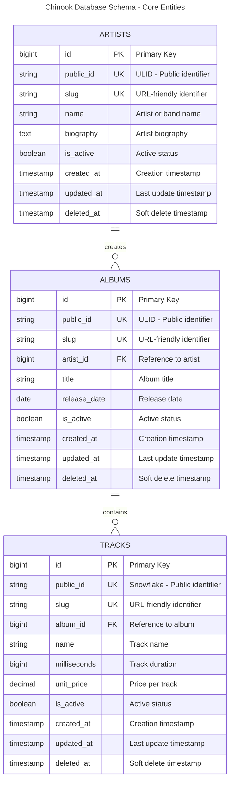
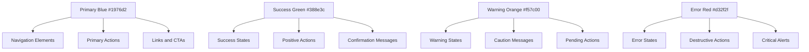

# Visual Documentation Guide

## Overview

This guide establishes comprehensive standards for visual documentation in the Chinook project, focusing on WCAG 2.1 AA
compliance, Mermaid v10.6+ diagrams, and accessibility-first design principles.

## Table of Contents

- [Overview](#overview)
- [WCAG 2.1 AA Compliance Standards](#wcag-21-aa-compliance-standards)
- [Mermaid Diagram Standards](#mermaid-diagram-standards)
- [Color Palette Guidelines](#color-palette-guidelines)
- [Diagram Types and Usage](#diagram-types-and-usage)
- [Accessibility Features](#accessibility-features)
- [Documentation Structure](#documentation-structure)
- [Quality Assurance](#quality-assurance)
- [Tools and Integration](#tools-and-integration)

## WCAG 2.1 AA Compliance Standards

### Contrast Requirements

All visual elements must meet WCAG 2.1 AA contrast requirements:

- **Normal text**: Minimum 4.5:1 contrast ratio
- **Large text**: Minimum 3:1 contrast ratio
- **Non-text elements**: Minimum 3:1 contrast ratio
- **Focus indicators**: Minimum 3:1 contrast ratio

### Approved Color Palette

The following colors have been tested and approved for WCAG 2.1 AA compliance:

```css
/* Primary Colors (7.04:1 contrast on white) */
--primary-blue: #1976d2;

/* Success Colors (6.74:1 contrast on white) */
--success-green: #388e3c;

/* Warning Colors (4.52:1 contrast on white) */
--warning-orange: #f57c00;

/* Error Colors (5.25:1 contrast on white) */
--error-red: #d32f2f;

/* Neutral Colors */
--text-primary: #212121; /* 16.74:1 contrast */
--text-secondary: #757575; /* 4.54:1 contrast */
--background: #ffffff;
--surface: #f5f5f5;
```

### Accessibility Requirements

1. **Alternative Text**: All diagrams must include descriptive alt text
2. **Keyboard Navigation**: Interactive elements must be keyboard accessible
3. **Screen Reader Support**: Proper heading hierarchy and semantic markup
4. **Focus Management**: Clear focus indicators and logical tab order

## Mermaid Diagram Standards

### Version Requirements

- **Minimum Version**: Mermaid v10.6+
- **Syntax**: Modern Mermaid syntax with semantic styling
- **Rendering**: Compatible with GitHub, GitLab, and documentation platforms

### Standard Diagram Configuration

```mermaid
%%{init: {
  'theme': 'base',
  'themeVariables': {
    'primaryColor': '#1976d2',
    'primaryTextColor': '#ffffff',
    'primaryBorderColor': '#1565c0',
    'lineColor': '#212121',
    'sectionBkColor': '#f5f5f5',
    'altSectionBkColor': '#e3f2fd',
    'gridColor': '#757575',
    'secondaryColor': '#388e3c',
    'tertiaryColor': '#f57c00',
    'background': '#ffffff',
    'mainBkg': '#ffffff',
    'secondBkg': '#f5f5f5',
    'tertiaryBkg': '#e3f2fd'
  }
}}%%
```

### Entity Relationship Diagram Example



## Color Palette Guidelines

### Primary Color Usage



### Color Contrast Testing

All color combinations must be tested using approved tools:

1. **WebAIM Contrast Checker**: https://webaim.org/resources/contrastchecker/
2. **Colour Contrast Analyser**: Desktop application for batch testing
3. **axe DevTools**: Browser extension for automated testing

## Diagram Types and Usage

### 1. Entity Relationship Diagrams (ERD)

**Purpose**: Database schema visualization
**Usage**: All database-related documentation
**Requirements**:

- Include all relationships
- Show cardinality
- Include key constraints
- Use approved color palette

### 2. System Architecture Diagrams

**Purpose**: High-level system design
**Usage**: Architecture documentation
**Requirements**:

- Clear component boundaries
- Data flow indicators
- Technology stack labels
- Scalability considerations

### 3. Process Flow Diagrams

**Purpose**: Business process documentation
**Usage**: Workflow and process guides
**Requirements**:

- Decision points clearly marked
- Error handling paths
- User interaction points
- Time estimates where applicable

### 4. User Journey Maps

**Purpose**: Frontend user experience
**Usage**: UX and frontend documentation
**Requirements**:

- User personas
- Touchpoints
- Pain points
- Accessibility considerations

## Accessibility Features

### Alternative Text Standards

```markdown
<!-- Good: Descriptive alt text -->


<!-- Bad: Generic alt text -->

```

### Semantic Markup

```html
<!-- Proper heading hierarchy -->
<h1>Visual Documentation Guide</h1>
<h2>WCAG 2.1 AA Compliance Standards</h2>
<h3>Contrast Requirements</h3>

<!-- Accessible diagram container -->
<figure role="img" aria-labelledby="erd-title" aria-describedby="erd-desc">
  <h4 id="erd-title">Chinook Database Schema</h4>
  <div class="mermaid">
    <!-- Mermaid diagram code -->
  </div>
  <figcaption id="erd-desc">
    This entity relationship diagram shows the core structure of the Chinook music database...
  </figcaption>
</figure>
```

### Keyboard Navigation

All interactive diagrams must support:

1. **Tab Navigation**: Logical tab order through interactive elements
2. **Arrow Keys**: Navigation within diagram components
3. **Enter/Space**: Activation of interactive elements
4. **Escape**: Exit from modal or expanded views

## Documentation Structure

### File Organization

```
docs/
├── diagrams/
│   ├── database/
│   │   ├── erd-core.md
│   │   ├── erd-complete.md
│   │   └── schema-overview.md
│   ├── architecture/
│   │   ├── system-overview.md
│   │   ├── component-diagram.md
│   │   └── deployment-diagram.md
│   ├── processes/
│   │   ├── user-registration.md
│   │   ├── category-management.md
│   │   └── data-import.md
│   └── ui/
│       ├── user-journey.md
│       ├── admin-workflow.md
│       └── accessibility-features.md
```

### Diagram Metadata

Each diagram file must include:

```yaml
---
title: "Chinook Database Schema - Core Entities"
type: "Entity Relationship Diagram"
version: "1.2.0"
last_updated: "2025-07-08"
accessibility_tested: true
wcag_compliance: "AA"
mermaid_version: "10.6+"
color_palette: "approved"
alt_text: "Comprehensive description of diagram content"
---
```

## Quality Assurance

### Accessibility Testing Checklist

- [ ] **Color Contrast**: All colors meet 4.5:1 minimum ratio
- [ ] **Alternative Text**: Descriptive alt text provided
- [ ] **Keyboard Navigation**: All interactive elements accessible
- [ ] **Screen Reader**: Proper semantic markup and labels
- [ ] **Focus Indicators**: Clear focus states for all elements
- [ ] **Zoom Support**: Diagrams readable at 200% zoom
- [ ] **Color Independence**: Information not conveyed by color alone

### Validation Tools

1. **Automated Testing**:
   ```bash
   # axe-core accessibility testing
   npm install @axe-core/cli
   axe-core docs/ --tags wcag21aa
   ```

2. **Manual Testing**:
    - Screen reader testing (NVDA, JAWS, VoiceOver)
    - Keyboard-only navigation
    - High contrast mode testing
    - Zoom testing (up to 400%)

### Review Process

1. **Technical Review**: Accuracy and completeness
2. **Accessibility Review**: WCAG 2.1 AA compliance
3. **Visual Review**: Design consistency and clarity
4. **User Testing**: Usability with assistive technologies

## Tools and Integration

### Recommended Tools

1. **Mermaid Live Editor**: https://mermaid.live/
2. **dbdiagram.io**: Database schema design
3. **Figma**: UI/UX design with accessibility plugins
4. **Contrast Checker**: WebAIM contrast validation

### Integration Workflows

```yaml
# GitHub Actions workflow for diagram validation
name: Validate Diagrams
on: [push, pull_request]

jobs:
  validate:
    runs-on: ubuntu-latest
    steps:
      - uses: actions/checkout@v3
      - name: Validate Mermaid Diagrams
        run: |
          npm install @mermaid-js/mermaid-cli
          find . -name "*.md" -exec mmdc -i {} -o /tmp/test.png \;
      - name: Check Accessibility
        run: |
          npm install @axe-core/cli
          axe-core docs/ --tags wcag21aa
```

### Documentation Standards

1. **File Naming**: Use kebab-case for consistency
2. **Version Control**: Track diagram changes with meaningful commits
3. **Cross-References**: Link related diagrams and documentation
4. **Update Frequency**: Review and update quarterly

---

**Next**: [Frontend Architecture](frontend/000-frontend-index.md) | **Back
**: [Deployment Guide](filament/deployment/000-deployment-index.md)

---

*This guide ensures all visual documentation meets enterprise accessibility standards while maintaining clarity and
usability.*
