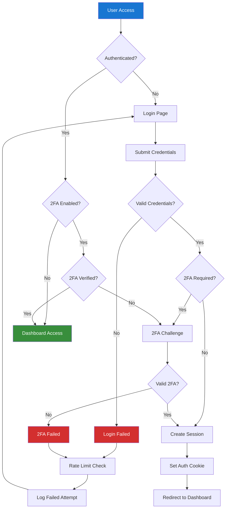
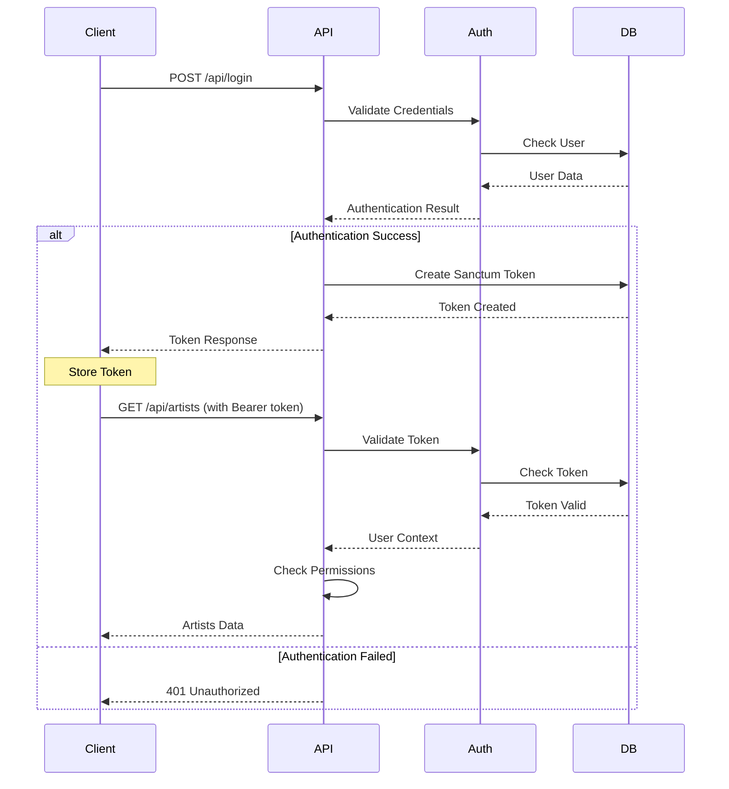

# Chinook Authentication Flow Guide

## Table of Contents

- [1. Overview](#1-overview)
- [2. Authentication Architecture](#2-authentication-architecture)
- [3. Role-Based Access Control](#3-role-based-access-control)
- [4. Authentication Flow Diagrams](#4-authentication-flow-diagrams)
- [5. Implementation Details](#5-implementation-details)
- [6. Security Considerations](#6-security-considerations)
- [7. API Authentication](#7-api-authentication)
- [8. Testing Authentication](#8-testing-authentication)

## 1. Overview

This guide details the comprehensive authentication and authorization system for the Chinook application, implementing enterprise-grade security with role-based access control (RBAC), multi-factor authentication, and API security using Laravel 12 and Filament 4.

### 1.1. Authentication Features

**Core Authentication Features:**
- **Multi-Provider Authentication**: Web, API, and admin panel
- **Role-Based Access Control**: 7-tier hierarchical role system
- **Permission-Based Authorization**: Granular permission management
- **Session Management**: Secure session handling with Redis
- **API Authentication**: Laravel Sanctum with token management
- **Two-Factor Authentication**: TOTP-based 2FA support

### 1.2. Security Standards

- **OWASP Compliance**: Following OWASP security guidelines
- **Laravel Security**: Built-in CSRF, XSS, and SQL injection protection
- **Password Security**: Bcrypt hashing with configurable rounds
- **Rate Limiting**: Throttling for login attempts and API calls
- **Audit Logging**: Complete authentication event tracking

## 2. Authentication Architecture

### 2.1. Authentication Guards

```php
// config/auth.php
'guards' => [
    'web' => [
        'driver' => 'session',
        'provider' => 'users',
    ],
    'api' => [
        'driver' => 'sanctum',
        'provider' => 'users',
    ],
    'filament' => [
        'driver' => 'session',
        'provider' => 'users',
    ],
],
```

### 2.2. User Providers

```php
'providers' => [
    'users' => [
        'driver' => 'eloquent',
        'model' => App\Models\User::class,
    ],
    'employees' => [
        'driver' => 'eloquent',
        'model' => App\Models\Employee::class,
    ],
],
```

### 2.3. Authentication Middleware Stack

```php
// Middleware pipeline
'web' => [
    \App\Http\Middleware\EncryptCookies::class,
    \Illuminate\Cookie\Middleware\AddQueuedCookiesToResponse::class,
    \Illuminate\Session\Middleware\StartSession::class,
    \Illuminate\View\Middleware\ShareErrorsFromSession::class,
    \App\Http\Middleware\VerifyCsrfToken::class,
    \Illuminate\Routing\Middleware\SubstituteBindings::class,
    \App\Http\Middleware\HandleInertiaRequests::class,
    \App\Http\Middleware\TwoFactorAuthentication::class,
],
```

## 3. Role-Based Access Control

### 3.1. Hierarchical Role System

```php
// Role hierarchy (highest to lowest privilege)
enum UserRole: string
{
    case SUPER_ADMIN = 'super-admin';
    case ADMIN = 'admin';
    case MANAGER = 'manager';
    case EDITOR = 'editor';
    case CUSTOMER_SERVICE = 'customer-service';
    case USER = 'user';
    case GUEST = 'guest';
    
    public function getLevel(): int
    {
        return match($this) {
            self::SUPER_ADMIN => 7,
            self::ADMIN => 6,
            self::MANAGER => 5,
            self::EDITOR => 4,
            self::CUSTOMER_SERVICE => 3,
            self::USER => 2,
            self::GUEST => 1,
        };
    }
    
    public function canAccessLevel(int $requiredLevel): bool
    {
        return $this->getLevel() >= $requiredLevel;
    }
}
```

### 3.2. Permission System

```php
// Permission categories
enum PermissionCategory: string
{
    case MUSIC_CATALOG = 'music-catalog';
    case USER_MANAGEMENT = 'user-management';
    case SALES_ANALYTICS = 'sales-analytics';
    case SYSTEM_ADMIN = 'system-admin';
    case CONTENT_MODERATION = 'content-moderation';
}

// Granular permissions
class Permission extends Model
{
    protected function casts(): array
    {
        return [
            'category' => PermissionCategory::class,
            'is_active' => 'boolean',
        ];
    }
    
    // Permission examples:
    // music-catalog.artists.view
    // music-catalog.artists.create
    // music-catalog.artists.update
    // music-catalog.artists.delete
    // user-management.roles.assign
    // sales-analytics.reports.view
}
```

### 3.3. Authorization Policies

```php
// Artist Policy
class ArtistPolicy
{
    public function viewAny(User $user): bool
    {
        return $user->hasPermissionTo('music-catalog.artists.view');
    }
    
    public function view(User $user, Artist $artist): bool
    {
        return $user->hasPermissionTo('music-catalog.artists.view') ||
               $user->id === $artist->created_by;
    }
    
    public function create(User $user): bool
    {
        return $user->hasPermissionTo('music-catalog.artists.create');
    }
    
    public function update(User $user, Artist $artist): bool
    {
        return $user->hasPermissionTo('music-catalog.artists.update') ||
               ($user->hasPermissionTo('music-catalog.artists.update-own') && 
                $user->id === $artist->created_by);
    }
    
    public function delete(User $user, Artist $artist): bool
    {
        return $user->hasPermissionTo('music-catalog.artists.delete') &&
               !$artist->albums()->exists(); // Prevent deletion if has albums
    }
}
```

## 4. Authentication Flow Diagrams

### 4.1. Web Authentication Flow



### 4.2. API Authentication Flow



## 5. Implementation Details

### 5.1. User Model with Authentication

```php
class User extends Authenticatable implements FilamentUser
{
    use HasApiTokens, HasFactory, Notifiable, HasRoles, HasPermissions;
    use HasTags, HasSecondaryUniqueKey, HasSlug, SoftDeletes;
    
    protected function casts(): array
    {
        return [
            'email_verified_at' => 'datetime',
            'password' => 'hashed',
            'two_factor_enabled' => 'boolean',
            'last_login_at' => 'datetime',
        ];
    }
    
    public function canAccessFilament(): bool
    {
        return $this->hasRole(['super-admin', 'admin', 'manager', 'editor']);
    }
    
    public function getFilamentAvatarUrl(): ?string
    {
        return $this->avatar_url ?? "https://ui-avatars.com/api/?name={$this->name}";
    }
    
    public function enable2FA(): void
    {
        $this->update([
            'two_factor_secret' => encrypt(Google2FA::generateSecretKey()),
            'two_factor_enabled' => true,
        ]);
    }
    
    public function verify2FA(string $code): bool
    {
        $secret = decrypt($this->two_factor_secret);
        return Google2FA::verifyKey($secret, $code);
    }
}
```

### 5.2. Authentication Controllers

```php
// Web Authentication Controller
class AuthController extends Controller
{
    public function login(LoginRequest $request): RedirectResponse
    {
        $credentials = $request->validated();
        
        if (Auth::attempt($credentials, $request->boolean('remember'))) {
            $request->session()->regenerate();
            
            $user = Auth::user();
            $user->update(['last_login_at' => now()]);
            
            if ($user->two_factor_enabled) {
                return redirect()->route('2fa.challenge');
            }
            
            return redirect()->intended(route('dashboard'));
        }
        
        RateLimiter::hit($this->throttleKey($request));
        
        return back()->withErrors([
            'email' => 'The provided credentials do not match our records.',
        ])->onlyInput('email');
    }
    
    public function logout(Request $request): RedirectResponse
    {
        Auth::logout();
        $request->session()->invalidate();
        $request->session()->regenerateToken();
        
        return redirect('/');
    }
}

// API Authentication Controller
class ApiAuthController extends Controller
{
    public function login(ApiLoginRequest $request): JsonResponse
    {
        $credentials = $request->validated();
        
        if (!Auth::attempt($credentials)) {
            return response()->json([
                'message' => 'Invalid credentials'
            ], 401);
        }
        
        $user = Auth::user();
        $token = $user->createToken('api-token', ['*'], now()->addDays(30));
        
        return response()->json([
            'token' => $token->plainTextToken,
            'user' => new UserResource($user),
            'expires_at' => $token->accessToken->expires_at,
        ]);
    }
    
    public function logout(Request $request): JsonResponse
    {
        $request->user()->currentAccessToken()->delete();
        
        return response()->json(['message' => 'Logged out successfully']);
    }
}
```

### 5.3. Two-Factor Authentication

```php
class TwoFactorController extends Controller
{
    public function challenge(): View
    {
        return view('auth.2fa-challenge');
    }
    
    public function verify(TwoFactorRequest $request): RedirectResponse
    {
        $user = Auth::user();
        
        if (!$user->verify2FA($request->code)) {
            return back()->withErrors(['code' => 'Invalid 2FA code']);
        }
        
        session(['2fa_verified' => true]);
        
        return redirect()->intended(route('dashboard'));
    }
    
    public function setup(): View
    {
        $user = Auth::user();
        $qrCode = Google2FA::getQRCodeUrl(
            config('app.name'),
            $user->email,
            decrypt($user->two_factor_secret)
        );
        
        return view('auth.2fa-setup', compact('qrCode'));
    }
}
```

## 6. Security Considerations

### 6.1. Password Security

```php
// Password validation rules
class PasswordRules
{
    public static function rules(): array
    {
        return [
            'required',
            'string',
            'min:12',
            'regex:/^(?=.*[a-z])(?=.*[A-Z])(?=.*\d)(?=.*[@$!%*?&])[A-Za-z\d@$!%*?&]/',
            'confirmed',
        ];
    }
}

// Password hashing configuration
'bcrypt' => [
    'rounds' => env('BCRYPT_ROUNDS', 12),
],
```

### 6.2. Rate Limiting

```php
// Login rate limiting
RateLimiter::for('login', function (Request $request) {
    $email = (string) $request->email;
    
    return Limit::perMinute(5)->by($email.$request->ip())
                ->response(function (Request $request, array $headers) {
                    return response('Too many login attempts.', 429, $headers);
                });
});

// API rate limiting
RateLimiter::for('api', function (Request $request) {
    return $request->user()
        ? Limit::perMinute(100)->by($request->user()->id)
        : Limit::perMinute(20)->by($request->ip());
});
```

### 6.3. Session Security

```php
// Session configuration
'lifetime' => env('SESSION_LIFETIME', 120),
'expire_on_close' => true,
'encrypt' => true,
'http_only' => true,
'same_site' => 'strict',
'secure' => env('SESSION_SECURE_COOKIE', true),
```

## 7. API Authentication

### 7.1. Sanctum Configuration

```php
// Sanctum middleware
'api' => [
    \Laravel\Sanctum\Http\Middleware\EnsureFrontendRequestsAreStateful::class,
    'throttle:api',
    \Illuminate\Routing\Middleware\SubstituteBindings::class,
],

// Token abilities
$token = $user->createToken('api-token', [
    'music-catalog:read',
    'music-catalog:write',
    'user-profile:read',
    'user-profile:write',
]);
```

### 7.2. API Resource Protection

```php
// Protected API routes
Route::middleware(['auth:sanctum', 'ability:music-catalog:read'])->group(function () {
    Route::get('/artists', [ArtistController::class, 'index']);
    Route::get('/albums', [AlbumController::class, 'index']);
    Route::get('/tracks', [TrackController::class, 'index']);
});

Route::middleware(['auth:sanctum', 'ability:music-catalog:write'])->group(function () {
    Route::post('/artists', [ArtistController::class, 'store']);
    Route::put('/artists/{artist}', [ArtistController::class, 'update']);
    Route::delete('/artists/{artist}', [ArtistController::class, 'destroy']);
});
```

## 8. Testing Authentication

### 8.1. Authentication Tests

```php
// Web authentication tests
test('user can login with valid credentials', function () {
    $user = User::factory()->create([
        'password' => Hash::make('password123'),
    ]);
    
    $response = $this->post('/login', [
        'email' => $user->email,
        'password' => 'password123',
    ]);
    
    $response->assertRedirect('/dashboard');
    $this->assertAuthenticatedAs($user);
});

test('user cannot login with invalid credentials', function () {
    $user = User::factory()->create();
    
    $response = $this->post('/login', [
        'email' => $user->email,
        'password' => 'wrong-password',
    ]);
    
    $response->assertSessionHasErrors('email');
    $this->assertGuest();
});

// API authentication tests
test('api login returns token for valid credentials', function () {
    $user = User::factory()->create([
        'password' => Hash::make('password123'),
    ]);
    
    $response = $this->postJson('/api/login', [
        'email' => $user->email,
        'password' => 'password123',
    ]);
    
    $response->assertStatus(200)
             ->assertJsonStructure(['token', 'user', 'expires_at']);
});
```

### 8.2. Authorization Tests

```php
test('user with permission can access resource', function () {
    $user = User::factory()->create();
    $user->givePermissionTo('music-catalog.artists.view');
    
    $response = $this->actingAs($user)->get('/artists');
    
    $response->assertStatus(200);
});

test('user without permission cannot access resource', function () {
    $user = User::factory()->create();
    
    $response = $this->actingAs($user)->get('/artists');
    
    $response->assertStatus(403);
});
```

---

**Next Steps:**
- [Filament Panel Setup](filament/setup/010-panel-configuration.md) - Admin panel authentication
- [API Authentication](packages/080-laravel-sanctum-guide.md) - API authentication details
- [Security Configuration](filament/setup/050-security-configuration.md) - Security best practices

**Related Documentation:**
- [User Management](filament/resources/110-users-resource.md) - User administration
- [RBAC Testing](filament/testing/100-rbac-testing.md) - Role and permission management
