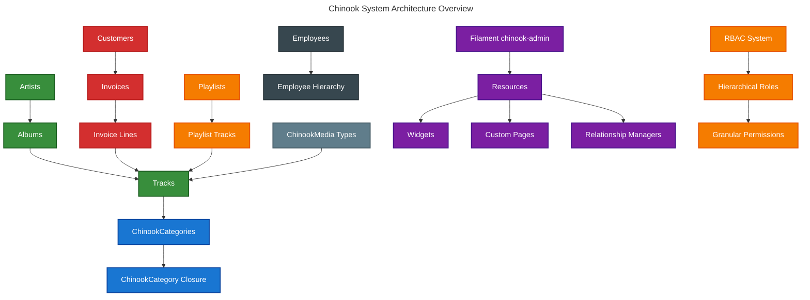

# Chinook Database & Filament 4 Admin Panel Implementation Guide
## ✅ Greenfield Single Taxonomy System Implementation

This directory contains comprehensive documentation for implementing the Chinook music database with modern Laravel 12 features, **single taxonomy system** using `aliziodev/laravel-taxonomy`, enterprise-grade enhancements, and a production-ready Filament 4 admin panel named `chinook-admin`.

**🆕 Latest Update (2025-07-10):** ✅ **Greenfield Implementation** - Single taxonomy system using `aliziodev/laravel-taxonomy` package with Genre compatibility layer for data export/import.

## Table of Contents

- [Quick Navigation](#quick-navigation)
- [Key Features](#key-features)
- [Getting Started](#getting-started)
- [Architecture Overview](#architecture-overview)
- [Documentation Priority Order](#documentation-priority-order)
- [Critical Requirements](#critical-requirements)
- [Implementation Roadmap](#implementation-roadmap)
- [Cross-References](#cross-references)
- [Next Steps](#next-steps)

## Quick Navigation

### 📚 Complete Guide Index

**[Chinook Index Guide](000-chinook-index.md)** - Comprehensive index with detailed descriptions, implementation
checklist, and cross-references

### 🏗️ Core Database Implementation (✅ Greenfield Single Taxonomy)

1. **[Chinook Models Guide](010-chinook-models-guide.md)** - ✅ **Greenfield** Enterprise-grade Laravel Eloquent models with RBAC and
   single taxonomy system
2. **[Chinook Migrations Guide](020-chinook-migrations-guide.md)** - ✅ **Greenfield** Database schema with RBAC and single
   taxonomy integration
3. **[Chinook Factories Guide](030-chinook-factories-guide.md)** - ✅ **Greenfield** Advanced model factories with realistic data
   generation
4. **[Chinook Seeders Guide](040-chinook-seeders-guide.md)** - ✅ **Greenfield** Comprehensive database seeders with single
   taxonomy system
5. **[Chinook Advanced Features Guide](050-chinook-advanced-features-guide.md)** - ✅ **Greenfield** RBAC, performance optimization, and
   enterprise patterns
6. **[Chinook Media Library Guide](060-chinook-media-library-guide.md)** - ✅ **Greenfield** Spatie Media Library integration with
   taxonomy system
7. **[Chinook Hierarchy Comparison Guide](070-chinook-hierarchy-comparison-guide.md)** - ✅ **Greenfield** Single taxonomy
   architecture analysis
8. **[Comprehensive Data Access Guide](130-comprehensive-data-access-guide.md)** - ✅ **Greenfield** CLI, web, and API access patterns

### 🏷️ Single Taxonomy System Documentation (✅ Greenfield Implementation)

**[Aliziodev Laravel Taxonomy Guide](packages/110-aliziodev-laravel-taxonomy-guide.md)** - ✅ **Greenfield** Complete single taxonomy system implementation with Genre compatibility layer

**[Single Taxonomy Architecture](070-chinook-hierarchy-comparison-guide.md)** - ✅ **Greenfield** Visual documentation with WCAG 2.1 AA compliant Mermaid diagrams showing unified taxonomy system

**[DRIP Implementation Plan](.ai/tasks/chinook/2025-07-10/DRIP_tasks_2025-07-10.md)** - Documentation Remediation Implementation Plan with hierarchical task tracking and progress monitoring

### 🎛️ Filament 4 Admin Panel Documentation

8. **[Filament Panel Overview](filament/000-filament-index.md)** - Complete overview of the Filament admin panel implementation
9. **[Panel Setup Guide](filament/setup/000-setup-index.md)** - Complete panel configuration, authentication, and RBAC
   integration
10. **[Model Standards—](filament/models/000-models-index.md)**Laravel 12 model implementations with required traits and
    modern patterns
11. **[Resource Documentation](filament/resources/000-resources-index.md)** - Detailed Filament resource configurations
    for all
    Chinook
    entities
12. **[Advanced Features—](filament/features/000-features-index.md)**Widgets, custom pages, dashboard configuration, and
    advanced
    functionality
13. **[Testing Guide](filament/testing/000-testing-index.md)** - Comprehensive testing strategies and quality assurance
14. **[Deployment Guide—](filament/deployment/000-deployment-index.md)**Production deployment, optimization, and
    monitoring
15. **[Visual Documentation—](filament/diagrams/000-diagrams-index.md)**WCAG 2.1 AA compliant Mermaid ERDs and DBML
    schema
    files

### 🎨 Frontend Development

16. **[Frontend Index](frontend/000-frontend-index.md)** - Complete frontend development guide index
17. **[Frontend Architecture Overview](frontend/100-frontend-architecture-overview.md)** - Modern frontend architecture
    with Livewire/Volt
18. **[Volt Functional Patterns](frontend/110-volt-functional-patterns-guide.md)** - Functional programming patterns
    with Livewire Volt
19. **[Flux Component Integration](frontend/120-flux-component-integration-guide.md)** - Laravel Flux UI component
    integration
20. **[SPA Navigation Guide](frontend/130-spa-navigation-guide.md)** - Single Page Application navigation patterns
21. **[Accessibility WCAG Guide](frontend/140-accessibility-wcag-guide.md)** - WCAG 2.1 AA compliance implementation
22. **[Performance Optimization](frontend/150-performance-optimization-guide.md)** - Frontend performance optimization
    strategies
23. **[Testing Approaches](frontend/160-testing-approaches-guide.md)** - Frontend testing methodologies
24. **[Performance Monitoring](frontend/170-performance-monitoring-guide.md)** - Frontend performance monitoring tools
25. **[API Testing Guide](frontend/180-api-testing-guide.md)** - API testing strategies and patterns
26. **[CI/CD Integration](frontend/190-cicd-integration-guide.md)** - Continuous integration and deployment

### 📦 Laravel Package Integration

27. **[Essential Packages](packages/000-packages-index.md)** - Comprehensive implementation guides for Laravel packages
    (Backup, Pulse,
    Telescope, Octane, Horizon, Data, Fractal, Sanctum)

### 🧪 Testing Documentation

28. **[Testing Guide—](testing/000-testing-index.md)**Comprehensive testing strategies, examples, and best practices

### 📊 Database Schema Resources

- **[DBML Schema](chinook-schema.dbml)** - Complete database schema definition with hybrid hierarchical architecture
- **[SQL Schema](../../database/sqldump/chinook.sql)** - SQL implementation reference for database setup

### 📋 Documentation Audit

- **[Documentation Quality Validation](testing/quality/documentation-quality-validation.md)** - Comprehensive audit of
  all
  documentation with status
  tracking

## Key Features

### Modern Laravel 12 Implementation

- **Hybrid Hierarchical Categories**: Closure table + adjacency list for optimal performance
- **Polymorphic Categorization**: Replaces traditional genre system with flexible categories
- **Role-Based Access Control**: Spatie Laravel Permission with hierarchical roles (Super Admin > Admin > Manager >
  Editor > Customer Service > User > Guest)
- **Modern Eloquent Features**: cast() method, secondary keys, slugs, user stamps
- **Enterprise Patterns**: Soft deletes, timestamps, tags, audit logging

### Production-Ready Filament 4 Admin Panel (`chinook-admin`)

- **Dedicated Panel**: Service provider registration with proper middleware
- **Native Authentication**: Filament's built-in auth with spatie/laravel-permission integration
- **Comprehensive Resources**: All Chinook entities with relationship managers
- **Advanced Widgets**: Real-time analytics, KPI dashboards, Chart.js integration
- **Custom Pages**: Employee hierarchy viewer, sales analytics, music discovery
- **Global Search**: Cross-resource search with weighted results
- **Import/Export**: CSV/Excel with validation and error reporting
- **WCAG 2.1 AA Compliant**: 4.5:1 contrast ratios, screen reader support

### Enhanced Chinook Schema

- **11 Core Tables**: Artists, Albums, Tracks, ChinookCategories, Customers, Employees, Invoices, etc.
- **CategoryType Enum**: 7 classification types (GENRE, MOOD, THEME, ERA, INSTRUMENT, LANGUAGE, OCCASION)
- **Performance Optimized**: Strategic indexing and query optimization
- **Audit Logging**: spatie/laravel-activitylog for sensitive operations

## Getting Started

### Prerequisites

- Laravel 12.x with PHP 8.4+
- Filament 4.x
- Required packages: spatie/laravel-permission, spatie/laravel-tags, wildside/userstamps, glhd/bits

### Database Implementation

1. **Review the Models Guide** to understand the enhanced data structure
2. **Run the Migrations** to create the database schema
3. **Configure RBAC** using the advanced features guide
4. **Seed Test Data** using the provided seeders
5. **Implement Media Library** for file management

### Filament Admin Panel Implementation

1. **Setup Panel Configuration** following the setup guide
2. **Configure Authentication** with RBAC integration
3. **Implement Resources** for all Chinook entities
4. **Add Advanced Features** like widgets and custom pages
5. **Deploy to Production** using the deployment guide

## Architecture Overview

**Accessibility Note:** This system architecture diagram shows the relationships between core Chinook entities including
Artists, Albums, Tracks, ChinookCategories, Customers, Invoices, Playlists, and the Filament admin panel. The diagram uses WCAG
2.1 AA compliant colors with high contrast ratios for optimal accessibility.

## Documentation Priority Order

1. **Core database implementation** (000-070 series guides)
2. **Filament panel setup and authentication** (filament/setup/)
3. **Basic CRUD resource implementations** (filament/resources/)
4. **Relationship managers and advanced filtering** (filament/features/)
5. **Custom pages and dashboard widgets** (filament/features/)
6. **Frontend architecture and components** (frontend/)
7. **Testing strategies and implementation** (testing/)
8. **Package integration and deployment** (packages/, filament/deployment/)

## Critical Requirements

- All code examples use Laravel 12 modern syntax (cast() method, current framework patterns)
- Include required trait implementations (HasTags, HasSecondaryUniqueKey, HasSlug, Categorizable)
- Document spatie/laravel-permission integration with hierarchical role structure
- Provide WCAG 2.1 AA compliant visual documentation with proper contrast ratios
- Include Mermaid v10.6+ syntax for all diagrams
- Document hybrid closure table + adjacency list architecture for hierarchical data
- Ensure all examples follow established architectural preferences for maintainable, scalable solutions

## Implementation Roadmap

### Phase 1: Core Database Foundation (Weeks 1-2)

- **Models & Architecture**: Enterprise-grade Eloquent models with RBAC
- **Database Schema**: Migrations with hybrid hierarchical categories
- **Data Generation**: Advanced factories and comprehensive seeders
- **Testing Foundation**: Basic model and relationship testing

### Phase 2: Advanced Features (Week 3)

- **RBAC Implementation**: Role-based access control with hierarchical permissions
- **Media Integration**: Spatie Media Library with categorization
- **Performance Optimization**: Query optimization and caching strategies
- **Architecture Analysis**: Hybrid hierarchical data management

### Phase 3: Filament Admin Panel (Weeks 4-5)

- **Panel Configuration**: Authentication, RBAC, and security setup
- **Resource Development**: Complete CRUD operations for all entities
- **Advanced Features**: Widgets, custom pages, and analytics
- **Testing & QA**: Comprehensive admin panel testing

### Phase 4: Frontend Development (Week 6)

- **Architecture Setup**: Livewire/Volt functional patterns
- **UI Integration**: Flux UI components and SPA navigation
- **Accessibility**: WCAG 2.1 AA compliance implementation
- **Performance**: Frontend optimization and monitoring

### Phase 5: Production Deployment (Week 7)

- **Environment Setup**: Production configuration and optimization
- **Package Integration**: Essential Laravel packages
- **Monitoring**: Performance and error tracking setup
- **Security Hardening**: Production security configurations

### Phase 6: Documentation & Maintenance (Week 8)

- **Visual Documentation**: Mermaid diagrams and DBML schemas
- **Testing Coverage**: Comprehensive test suite completion
- **Performance Validation**: Load testing and optimization
- **Documentation Review**: Final documentation and cross-reference validation

## Cross-References

### Related Documentation

- **[Main Chinook Index](000-chinook-index.md)** - Comprehensive guide index with detailed descriptions
- **[Filament Panel Overview](filament/000-filament-index.md)** - Complete Filament admin panel documentation
- **[Frontend Development](frontend/000-frontend-index.md)** - Modern frontend patterns with Livewire/Volt
- **[Testing Documentation](testing/000-testing-index.md)** - Comprehensive testing strategies and examples
- **[Package Integration](packages/000-packages-index.md)** - Essential Laravel packages implementation guides

### External Resources

- **[Laravel 12 Documentation](https://laravel.com/docs)** - Official Laravel framework documentation
- **[Filament 4 Documentation](https://filamentphp.com/docs)** - Official Filament admin panel documentation
- **[Spatie Laravel Permission](https://spatie.be/docs/laravel-permission)** - RBAC package documentation
- **[WCAG 2.1 Guidelines](https://www.w3.org/WAI/WCAG21/quickref/)** - Web accessibility standards

## Next Steps

After implementing the core database structure and Filament admin panel:

### Immediate Next Steps

- **API Development**: RESTful APIs with Laravel Sanctum authentication
- **Frontend Integration**: Advanced Livewire/Volt components with Flux UI
- **Performance Monitoring**: Laravel Pulse and Telescope integration
- **Testing Strategy**: Comprehensive test coverage targeting 80%+
- **Production Deployment**: Environment configuration and server optimization

### Long-term Enhancements

- **Mobile Application**: API-driven mobile app development
- **Advanced Analytics**: Business intelligence and reporting features
- **Third-party Integrations**: Music streaming service APIs
- **Scalability Optimization**: Microservices architecture consideration
- **International Support**: Multi-language and localization features

### Maintenance & Support

- **Documentation Updates**: Keep guides current with Laravel and Filament updates
- **Security Audits**: Regular security reviews and updates
- **Performance Monitoring**: Continuous performance optimization
- **Community Contributions**: Open-source contribution guidelines
- **Training Materials**: Developer onboarding and training resources

---

**🚀 Start Here →** [Chinook Index Guide](000-chinook-index.md) | **📖 Quick Start →
** [Models Guide](010-chinook-models-guide.md) | **🎛️ Admin Panel →** [Filament Overview](filament/000-filament-index.md)
