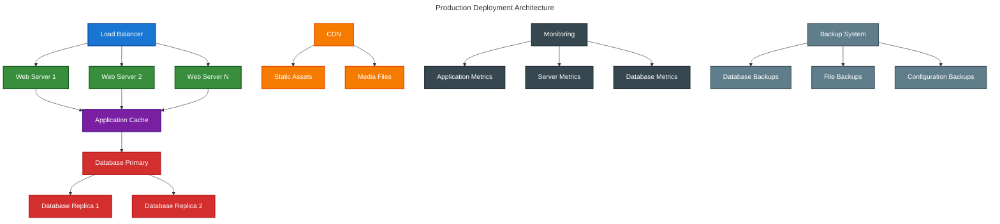

# Filament Deployment Documentation

This directory contains comprehensive deployment guides for the Chinook admin panel, covering production optimization, server configuration, monitoring, and maintenance strategies.

## Documentation Structure

### Production Setup
1. **[Production Environment](010-production-environment.md)** - Server requirements and environment configuration
2. **[Server Configuration](020-server-configuration.md)** - Web server, PHP, and database setup
3. **[Security Hardening](030-security-hardening.md)** - Production security measures and best practices
4. **[SSL Configuration](040-ssl-configuration.md)** - HTTPS setup and certificate management

### Performance Optimization
5. **[Performance Optimization](050-performance-optimization.md)** - Caching, optimization, and tuning
6. **[Database Optimization](060-database-optimization.md)** - Database performance and indexing
7. **[Asset Optimization](070-asset-optimization.md)** - Frontend asset optimization and CDN setup
8. **[Caching Strategy](080-caching-strategy.md)** - Comprehensive caching implementation

### Monitoring & Maintenance
9. **[Monitoring Setup](090-monitoring-setup.md)** - Application and server monitoring
10. **[Logging Configuration](100-logging-configuration.md)** - Centralized logging and error tracking
11. **[Backup Strategy](110-backup-strategy.md)** - Data backup and disaster recovery
12. **[Maintenance Procedures](120-maintenance-procedures.md)** - Regular maintenance and updates

### Deployment Automation
13. **[CI/CD Pipeline](130-cicd-pipeline.md)** - Automated deployment and testing
14. **[Docker Deployment](140-docker-deployment.md)** - Containerized deployment strategies
15. **[Scaling Strategies](160-scaling-strategies.md)** - Horizontal and vertical scaling approaches

## Deployment Architecture

### Production Infrastructure

The Chinook admin panel is designed for scalable production deployment:



### Server Requirements

#### Minimum Requirements
- **PHP**: 8.4+ with required extensions
- **Memory**: 2GB RAM minimum, 4GB recommended
- **Storage**: 20GB SSD minimum, 50GB recommended
- **CPU**: 2 cores minimum, 4 cores recommended
- **Database**: MySQL 8.0+ or PostgreSQL 13+

#### Recommended Production Setup
- **PHP**: 8.4 with OPcache, APCu, and Redis extensions
- **Memory**: 8GB RAM with proper PHP memory limits
- **Storage**: NVMe SSD with automated backups
- **CPU**: 4+ cores with proper load balancing
- **Database**: MySQL 8.0+ with read replicas

### Environment Configuration

#### Production Environment Variables

```bash
# Application Configuration
APP_NAME="Chinook Music Admin"
APP_ENV=production
APP_KEY=base64:your-32-character-secret-key
APP_DEBUG=false
APP_URL=https://admin.chinook-music.com

# Database Configuration
DB_CONNECTION=sqlite
DB_DATABASE=/var/www/chinook-admin/database/production.sqlite
DB_FOREIGN_KEYS=true

# Cache Configuration
CACHE_DRIVER=redis
REDIS_HOST=127.0.0.1
REDIS_PASSWORD=redis_password
REDIS_PORT=6379

# Session Configuration
SESSION_DRIVER=redis
SESSION_LIFETIME=120
SESSION_ENCRYPT=true
SESSION_SECURE_COOKIE=true

# Queue Configuration
QUEUE_CONNECTION=redis
QUEUE_FAILED_DRIVER=database

# Mail Configuration
MAIL_MAILER=smtp
MAIL_HOST=smtp.mailgun.org
MAIL_PORT=587
MAIL_USERNAME=your_username
MAIL_PASSWORD=your_password
MAIL_ENCRYPTION=tls

# File Storage
FILESYSTEM_DISK=s3
AWS_ACCESS_KEY_ID=your_access_key
AWS_SECRET_ACCESS_KEY=your_secret_key
AWS_DEFAULT_REGION=us-east-1
AWS_BUCKET=chinook-media-files

# Monitoring
LOG_CHANNEL=stack
LOG_LEVEL=error
SENTRY_LARAVEL_DSN=your_sentry_dsn

# Performance
OCTANE_SERVER=frankenphp
OCTANE_HTTPS=true
```

## Performance Optimization

### PHP Configuration

#### php.ini Optimization

```ini
; Memory and execution limits
memory_limit = 512M
max_execution_time = 300
max_input_time = 300
post_max_size = 100M
upload_max_filesize = 50M

; OPcache configuration
opcache.enable=1
opcache.enable_cli=1
opcache.memory_consumption=256
opcache.interned_strings_buffer=16
opcache.max_accelerated_files=20000
opcache.validate_timestamps=0
opcache.revalidate_freq=0
opcache.save_comments=1

; APCu configuration
apc.enabled=1
apc.shm_size=128M
apc.ttl=7200
apc.user_ttl=7200

; Session configuration
session.driver=redis
session.lifetime=120
session.encrypt=true
```

### Database Optimization

#### SQLite Configuration

```bash
# SQLite WAL Mode Configuration
# Applied automatically via Laravel configuration

# Database pragmas for optimal performance
PRAGMA journal_mode = WAL;
PRAGMA synchronous = NORMAL;
PRAGMA cache_size = -64000;  # 64MB cache
PRAGMA temp_store = MEMORY;
PRAGMA mmap_size = 268435456;  # 256MB memory mapping
PRAGMA foreign_keys = ON;

# Connection Settings
max_connections = 200
max_connect_errors = 1000000

# Performance Schema
performance_schema = ON
```

#### Database Indexing Strategy

```sql
-- Artists table indexes
CREATE INDEX idx_artists_name ON artists(name);
CREATE INDEX idx_artists_country ON artists(country);
CREATE INDEX idx_artists_active ON artists(is_active);
CREATE INDEX idx_artists_created ON artists(created_at);

-- Albums table indexes
CREATE INDEX idx_albums_artist ON albums(artist_id);
CREATE INDEX idx_albums_release_date ON albums(release_date);
CREATE INDEX idx_albums_title ON albums(title);

-- Tracks table indexes
CREATE INDEX idx_tracks_album ON tracks(album_id);
CREATE INDEX idx_tracks_duration ON tracks(duration_ms);
CREATE INDEX idx_tracks_name ON tracks(name);

-- Invoices table indexes
CREATE INDEX idx_invoices_customer ON invoices(customer_id);
CREATE INDEX idx_invoices_date ON invoices(invoice_date);
CREATE INDEX idx_invoices_total ON invoices(total);

-- Composite indexes for common queries
CREATE INDEX idx_albums_artist_date ON albums(artist_id, release_date);
CREATE INDEX idx_tracks_album_order ON tracks(album_id, track_number);
CREATE INDEX idx_invoices_customer_date ON invoices(customer_id, invoice_date);
```

### Caching Implementation

#### Redis Configuration

```bash
# Redis configuration for production
maxmemory 1gb
maxmemory-policy allkeys-lru
save 900 1
save 300 10
save 60 10000
```

#### Application Caching

```php
// config/cache.php
'stores' => [
    'redis' => [
        'driver' => 'redis',
        'connection' => 'cache',
        'lock_connection' => 'default',
    ],
],

// Cache configuration for Filament
'filament' => [
    'widgets' => [
        'cache_duration' => 300, // 5 minutes
    ],
    'global_search' => [
        'cache_duration' => 600, // 10 minutes
    ],
],
```

## Security Configuration

### Web Server Security

#### Nginx Configuration

```nginx
server {
    listen 443 ssl http2;
    server_name admin.chinook-music.com;
    root /var/www/chinook-admin/public;
    index index.php;

    # SSL Configuration
    ssl_certificate /path/to/certificate.crt;
    ssl_certificate_key /path/to/private.key;
    ssl_protocols TLSv1.2 TLSv1.3;
    ssl_ciphers ECDHE-RSA-AES256-GCM-SHA512:DHE-RSA-AES256-GCM-SHA512;
    ssl_prefer_server_ciphers off;

    # Security Headers
    add_header X-Frame-Options "SAMEORIGIN" always;
    add_header X-Content-Type-Options "nosniff" always;
    add_header X-XSS-Protection "1; mode=block" always;
    add_header Referrer-Policy "no-referrer-when-downgrade" always;
    add_header Content-Security-Policy "default-src 'self' http: https: data: blob: 'unsafe-inline'" always;
    add_header Strict-Transport-Security "max-age=31536000; includeSubDomains" always;

    # Rate Limiting
    limit_req_zone $binary_remote_addr zone=login:10m rate=5r/m;
    limit_req_zone $binary_remote_addr zone=api:10m rate=100r/m;

    location / {
        try_files $uri $uri/ /index.php?$query_string;
    }

    location ~ \.php$ {
        fastcgi_pass unix:/var/run/php/php8.4-fpm.sock;
        fastcgi_param SCRIPT_FILENAME $realpath_root$fastcgi_script_name;
        include fastcgi_params;
    }

    location /chinook-admin/login {
        limit_req zone=login burst=5 nodelay;
        try_files $uri $uri/ /index.php?$query_string;
    }

    location /api/ {
        limit_req zone=api burst=20 nodelay;
        try_files $uri $uri/ /index.php?$query_string;
    }

    # Deny access to sensitive files
    location ~ /\.(?!well-known).* {
        deny all;
    }

    location ~ /(?:\.env|composer\.json|composer\.lock|package\.json|package-lock\.json)$ {
        deny all;
    }
}
```

### Application Security

#### Security Middleware

```php
// app/Http/Middleware/SecurityHeaders.php
<?php

namespace App\Http\Middleware;

use Closure;
use Illuminate\Http\Request;

class SecurityHeaders
{
    public function handle(Request $request, Closure $next)
    {
        $response = $next($request);

        $response->headers->set('X-Frame-Options', 'SAMEORIGIN');
        $response->headers->set('X-Content-Type-Options', 'nosniff');
        $response->headers->set('X-XSS-Protection', '1; mode=block');
        $response->headers->set('Referrer-Policy', 'no-referrer-when-downgrade');
        $response->headers->set('Permissions-Policy', 'geolocation=(), microphone=(), camera=()');

        return $response;
    }
}
```

## Monitoring and Logging

### Application Monitoring

#### Laravel Telescope Configuration

```php
// config/telescope.php
'enabled' => env('TELESCOPE_ENABLED', false),
'domain' => env('TELESCOPE_DOMAIN'),
'path' => env('TELESCOPE_PATH', 'telescope'),
'driver' => env('TELESCOPE_DRIVER', 'database'),

'watchers' => [
    Watchers\CacheWatcher::class => env('TELESCOPE_CACHE_WATCHER', true),
    Watchers\CommandWatcher::class => env('TELESCOPE_COMMAND_WATCHER', true),
    Watchers\DumpWatcher::class => env('TELESCOPE_DUMP_WATCHER', true),
    Watchers\EventWatcher::class => env('TELESCOPE_EVENT_WATCHER', true),
    Watchers\ExceptionWatcher::class => env('TELESCOPE_EXCEPTION_WATCHER', true),
    Watchers\JobWatcher::class => env('TELESCOPE_JOB_WATCHER', true),
    Watchers\LogWatcher::class => env('TELESCOPE_LOG_WATCHER', true),
    Watchers\MailWatcher::class => env('TELESCOPE_MAIL_WATCHER', true),
    Watchers\ModelWatcher::class => env('TELESCOPE_MODEL_WATCHER', true),
    Watchers\NotificationWatcher::class => env('TELESCOPE_NOTIFICATION_WATCHER', true),
    Watchers\QueryWatcher::class => env('TELESCOPE_QUERY_WATCHER', true),
    Watchers\RedisWatcher::class => env('TELESCOPE_REDIS_WATCHER', true),
    Watchers\RequestWatcher::class => env('TELESCOPE_REQUEST_WATCHER', true),
    Watchers\ScheduleWatcher::class => env('TELESCOPE_SCHEDULE_WATCHER', true),
    Watchers\ViewWatcher::class => env('TELESCOPE_VIEW_WATCHER', true),
],
```

### Error Tracking

#### Sentry Integration

```php
// config/sentry.php
'dsn' => env('SENTRY_LARAVEL_DSN'),
'release' => env('SENTRY_RELEASE'),
'environment' => env('SENTRY_ENVIRONMENT', env('APP_ENV')),

'breadcrumbs' => [
    'logs' => true,
    'cache' => true,
    'livewire' => true,
],

'tracing' => [
    'enabled' => true,
    'sample_rate' => env('SENTRY_TRACES_SAMPLE_RATE', 0.1),
],

'profiles' => [
    'sample_rate' => env('SENTRY_PROFILES_SAMPLE_RATE', 0.1),
],
```

## Backup Strategy

### Database Backups

```bash
#!/bin/bash
# SQLite database backup script

BACKUP_DIR="/var/backups/chinook"
DATE=$(date +%Y%m%d_%H%M%S)
DB_PATH="/var/www/chinook-admin/database/production.sqlite"

# Create backup directory
mkdir -p $BACKUP_DIR

# Create SQLite database backup
sqlite3 $DB_PATH ".backup $BACKUP_DIR/db_backup_$DATE.sqlite"

# Compress backup
gzip $BACKUP_DIR/db_backup_$DATE.sqlite

# Upload to S3
aws s3 cp $BACKUP_DIR/db_backup_$DATE.sqlite.gz s3://chinook-backups/database/

# Clean up old local backups (keep 7 days)
find $BACKUP_DIR -name "db_backup_*.sqlite.gz" -mtime +7 -delete

# Clean up old S3 backups (keep 30 days)
aws s3 ls s3://chinook-backups/database/ | while read -r line; do
    createDate=$(echo $line | awk '{print $1" "$2}')
    createDate=$(date -d"$createDate" +%s)
    olderThan=$(date -d"30 days ago" +%s)
    if [[ $createDate -lt $olderThan ]]; then
        fileName=$(echo $line | awk '{print $4}')
        aws s3 rm s3://chinook-backups/database/$fileName
    fi
done
```

### File Backups

```bash
#!/bin/bash
# Application file backup script

APP_DIR="/var/www/chinook-admin"
BACKUP_DIR="/var/backups/chinook"
DATE=$(date +%Y%m%d_%H%M%S)

# Create backup of storage directory
tar -czf $BACKUP_DIR/storage_backup_$DATE.tar.gz -C $APP_DIR storage/

# Upload to S3
aws s3 cp $BACKUP_DIR/storage_backup_$DATE.tar.gz s3://chinook-backups/files/

# Clean up old backups
find $BACKUP_DIR -name "storage_backup_*.tar.gz" -mtime +7 -delete
```

## Deployment Automation

### GitHub Actions Workflow

```yaml
name: Deploy to Production

on:
  push:
    branches: [ main ]

jobs:
  deploy:
    runs-on: ubuntu-latest
    
    steps:
    - uses: actions/checkout@v3
    
    - name: Setup PHP
      uses: shivammathur/setup-php@v2
      with:
        php-version: 8.4
        extensions: dom, curl, libxml, mbstring, zip, pcntl, pdo, mysql
        
    - name: Install dependencies
      run: composer install --no-dev --optimize-autoloader
      
    - name: Build assets
      run: |
        npm ci
        npm run build
        
    - name: Run tests
      run: php artisan test
      
    - name: Deploy to server
      uses: appleboy/ssh-action@v0.1.5
      with:
        host: ${{ secrets.HOST }}
        username: ${{ secrets.USERNAME }}
        key: ${{ secrets.SSH_KEY }}
        script: |
          cd /var/www/chinook-admin
          git pull origin main
          composer install --no-dev --optimize-autoloader
          php artisan migrate --force
          php artisan config:cache
          php artisan route:cache
          php artisan view:cache
          php artisan queue:restart
          sudo systemctl reload nginx
```

## Next Steps

1. **Setup Production Environment** - Configure servers and infrastructure
2. **Implement Security Measures** - Apply security hardening and monitoring
3. **Configure Performance Optimization** - Implement caching and optimization
4. **Setup Monitoring** - Deploy monitoring and alerting systems
5. **Implement Backup Strategy** - Configure automated backups and recovery
6. **Deploy CI/CD Pipeline** - Automate deployment and testing processes

## Related Documentation

- **[Setup Documentation](../setup/)** - Panel configuration and authentication
- **[Resources Documentation](../resources/)** - Resource implementation guides
- **[Features Documentation](../features/)** - Advanced feature implementation
- **[Testing Documentation](../testing/)** - Testing strategies and validation
