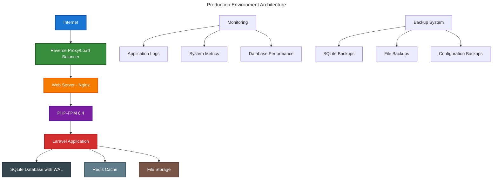

# Production Environment Guide

This guide covers the complete setup and configuration of a production environment for the Chinook admin panel, including server requirements, environment configuration, and deployment best practices.

## Table of Contents

- [Overview](#overview)
- [Server Requirements](#server-requirements)
- [Environment Configuration](#environment-configuration)
- [SQLite Production Setup](#sqlite-production-setup)
- [PHP Configuration](#php-configuration)
- [Web Server Configuration](#web-server-configuration)
- [Security Configuration](#security-configuration)

## Overview

The Chinook admin panel is optimized for production deployment with SQLite as the primary database, providing excellent performance for music store management with proper configuration and optimization.

### Production Architecture



## Server Requirements

### Minimum Production Requirements

```bash
# System Requirements
- OS: Ubuntu 22.04 LTS or CentOS 8+
- CPU: 2 cores (4 cores recommended)
- RAM: 4GB (8GB recommended)
- Storage: 50GB SSD (100GB recommended)
- Network: 1Gbps connection

# Software Requirements
- PHP 8.4+ with required extensions
- Nginx 1.20+ or Apache 2.4+
- Redis 6.0+ for caching
- Node.js 18+ for asset compilation
- Supervisor for queue management
```

### Recommended Production Specifications

```bash
# High-Performance Setup
- CPU: 4+ cores (Intel Xeon or AMD EPYC)
- RAM: 16GB+ with proper allocation
- Storage: NVMe SSD with RAID 1
- Network: 10Gbps with redundancy
- Backup: Automated daily backups

# Software Stack
- PHP 8.4 with OPcache and APCu
- Nginx with HTTP/2 and compression
- Redis Cluster for high availability
- Monitoring with Prometheus/Grafana
```

### PHP Extensions Required

```bash
# Core Extensions
php8.4-cli
php8.4-fpm
php8.4-common
php8.4-curl
php8.4-gd
php8.4-intl
php8.4-mbstring
php8.4-xml
php8.4-zip

# Database Extensions
php8.4-sqlite3
php8.4-pdo

# Caching Extensions
php8.4-redis
php8.4-opcache
php8.4-apcu

# Additional Extensions
php8.4-bcmath
php8.4-json
php8.4-tokenizer
php8.4-fileinfo
```

## Environment Configuration

### Production .env Configuration

```bash
# Application Configuration
APP_NAME="Chinook Music Admin"
APP_ENV=production
APP_KEY=base64:your-generated-app-key-here
APP_DEBUG=false
APP_URL=https://admin.chinookmusic.com

# Database Configuration (SQLite)
DB_CONNECTION=sqlite
DB_DATABASE=/var/www/chinook-admin/database/production.sqlite
DB_FOREIGN_KEYS=true

# Cache Configuration
CACHE_DRIVER=redis
SESSION_DRIVER=redis
QUEUE_CONNECTION=redis

# Redis Configuration
REDIS_HOST=127.0.0.1
REDIS_PASSWORD=your-redis-password
REDIS_PORT=6379
REDIS_DB=0

# Mail Configuration
MAIL_MAILER=smtp
MAIL_HOST=smtp.mailgun.org
MAIL_PORT=587
MAIL_USERNAME=your-mailgun-username
MAIL_PASSWORD=your-mailgun-password
MAIL_ENCRYPTION=tls
MAIL_FROM_ADDRESS=noreply@chinookmusic.com
MAIL_FROM_NAME="Chinook Music Admin"

# Logging Configuration
LOG_CHANNEL=stack
LOG_DEPRECATIONS_CHANNEL=null
LOG_LEVEL=error

# Security Configuration
SESSION_LIFETIME=120
SESSION_ENCRYPT=true
SESSION_HTTP_ONLY=true
SESSION_SAME_SITE=strict

# File Storage
FILESYSTEM_DISK=local
MEDIA_DISK=public

# Performance Configuration
OCTANE_SERVER=swoole
OCTANE_HTTPS=true

# Monitoring
TELESCOPE_ENABLED=false
DEBUGBAR_ENABLED=false

# Backup Configuration
BACKUP_DISK=s3
AWS_ACCESS_KEY_ID=your-aws-access-key
AWS_SECRET_ACCESS_KEY=your-aws-secret-key
AWS_DEFAULT_REGION=us-east-1
AWS_BUCKET=chinook-admin-backups
```

## SQLite Production Setup

### Database File Configuration

```bash
# Create database directory with proper permissions
sudo mkdir -p /var/www/chinook-admin/database
sudo chown -R www-data:www-data /var/www/chinook-admin/database
sudo chmod 755 /var/www/chinook-admin/database

# Create production database
sudo -u www-data touch /var/www/chinook-admin/database/production.sqlite
sudo chmod 664 /var/www/chinook-admin/database/production.sqlite

# Set proper SELinux context (if applicable)
sudo setsebool -P httpd_can_network_connect 1
sudo chcon -R -t httpd_exec_t /var/www/chinook-admin/
```

### SQLite Optimization Configuration

```sql
-- Apply production optimizations
PRAGMA journal_mode = WAL;
PRAGMA synchronous = NORMAL;
PRAGMA cache_size = -64000;  -- 64MB cache
PRAGMA temp_store = MEMORY;
PRAGMA mmap_size = 268435456;  -- 256MB memory mapping
PRAGMA foreign_keys = ON;
PRAGMA busy_timeout = 30000;  -- 30 second timeout
PRAGMA wal_autocheckpoint = 1000;
PRAGMA optimize;
```

### Database Monitoring Script

```bash
#!/bin/bash
# /usr/local/bin/sqlite-monitor.sh

DB_PATH="/var/www/chinook-admin/database/production.sqlite"
WAL_PATH="${DB_PATH}-wal"
SHM_PATH="${DB_PATH}-shm"

# Check database file size
DB_SIZE=$(stat -c%s "$DB_PATH" 2>/dev/null || echo 0)
echo "Database size: $(($DB_SIZE / 1024 / 1024)) MB"

# Check WAL file size
if [ -f "$WAL_PATH" ]; then
    WAL_SIZE=$(stat -c%s "$WAL_PATH")
    echo "WAL file size: $(($WAL_SIZE / 1024 / 1024)) MB"
    
    # Checkpoint if WAL is too large (>100MB)
    if [ $WAL_SIZE -gt 104857600 ]; then
        echo "WAL file too large, checkpointing..."
        sqlite3 "$DB_PATH" "PRAGMA wal_checkpoint(TRUNCATE);"
    fi
fi

# Check database integrity
INTEGRITY=$(sqlite3 "$DB_PATH" "PRAGMA integrity_check;" | head -1)
if [ "$INTEGRITY" != "ok" ]; then
    echo "Database integrity check failed: $INTEGRITY"
    exit 1
fi

echo "Database health check completed successfully"
```

## PHP Configuration

### PHP-FPM Configuration

```ini
; /etc/php/8.4/fpm/pool.d/chinook-admin.conf
[chinook-admin]
user = www-data
group = www-data

listen = /run/php/php8.4-fpm-chinook-admin.sock
listen.owner = www-data
listen.group = www-data
listen.mode = 0660

pm = dynamic
pm.max_children = 50
pm.start_servers = 5
pm.min_spare_servers = 5
pm.max_spare_servers = 35
pm.max_requests = 1000

; Performance tuning
request_terminate_timeout = 300
request_slowlog_timeout = 10
slowlog = /var/log/php8.4-fpm-chinook-admin-slow.log

; Environment variables
env[APP_ENV] = production
env[DB_CONNECTION] = sqlite
env[CACHE_DRIVER] = redis

; Security
php_admin_value[disable_functions] = exec,passthru,shell_exec,system,proc_open,popen
php_admin_value[allow_url_fopen] = off
php_admin_value[allow_url_include] = off
```

### PHP Configuration (php.ini)

```ini
; /etc/php/8.4/fpm/conf.d/99-chinook-admin.ini

; Memory and execution limits
memory_limit = 512M
max_execution_time = 300
max_input_time = 300
max_input_vars = 3000

; File upload limits
upload_max_filesize = 50M
post_max_size = 50M
max_file_uploads = 20

; OPcache configuration
opcache.enable = 1
opcache.enable_cli = 1
opcache.memory_consumption = 256
opcache.interned_strings_buffer = 16
opcache.max_accelerated_files = 20000
opcache.validate_timestamps = 0
opcache.revalidate_freq = 0
opcache.save_comments = 0
opcache.fast_shutdown = 1

; APCu configuration
apc.enabled = 1
apc.shm_size = 128M
apc.ttl = 7200
apc.enable_cli = 1

; Session configuration
session.driver = redis
session.lifetime = 120
session.encrypt = true
session.http_only = true
session.same_site = strict

; Security settings
expose_php = off
display_errors = off
display_startup_errors = off
log_errors = on
error_log = /var/log/php8.4-fpm-chinook-admin-error.log

; SQLite specific
sqlite3.extension_dir = /usr/lib/php/20230831/
```

## Web Server Configuration

### Nginx Configuration

```nginx
# /etc/nginx/sites-available/chinook-admin
server {
    listen 80;
    server_name admin.chinookmusic.com;
    return 301 https://$server_name$request_uri;
}

server {
    listen 443 ssl http2;
    server_name admin.chinookmusic.com;
    root /var/www/chinook-admin/public;
    index index.php;

    # SSL Configuration
    ssl_certificate /etc/letsencrypt/live/admin.chinookmusic.com/fullchain.pem;
    ssl_certificate_key /etc/letsencrypt/live/admin.chinookmusic.com/privkey.pem;
    ssl_protocols TLSv1.2 TLSv1.3;
    ssl_ciphers ECDHE-RSA-AES256-GCM-SHA512:DHE-RSA-AES256-GCM-SHA512:ECDHE-RSA-AES256-GCM-SHA384:DHE-RSA-AES256-GCM-SHA384;
    ssl_prefer_server_ciphers off;
    ssl_session_cache shared:SSL:10m;
    ssl_session_timeout 10m;

    # Security headers
    add_header X-Frame-Options "SAMEORIGIN" always;
    add_header X-Content-Type-Options "nosniff" always;
    add_header X-XSS-Protection "1; mode=block" always;
    add_header Referrer-Policy "strict-origin-when-cross-origin" always;
    add_header Content-Security-Policy "default-src 'self'; script-src 'self' 'unsafe-inline' 'unsafe-eval'; style-src 'self' 'unsafe-inline'; img-src 'self' data: https:; font-src 'self' data:; connect-src 'self';" always;
    add_header Strict-Transport-Security "max-age=31536000; includeSubDomains" always;

    # Gzip compression
    gzip on;
    gzip_vary on;
    gzip_min_length 1024;
    gzip_types text/plain text/css text/xml text/javascript application/javascript application/xml+rss application/json;

    # Rate limiting
    limit_req_zone $binary_remote_addr zone=login:10m rate=5r/m;
    limit_req_zone $binary_remote_addr zone=api:10m rate=100r/m;

    # Main location block
    location / {
        try_files $uri $uri/ /index.php?$query_string;
    }

    # PHP processing
    location ~ \.php$ {
        fastcgi_pass unix:/run/php/php8.4-fpm-chinook-admin.sock;
        fastcgi_param SCRIPT_FILENAME $realpath_root$fastcgi_script_name;
        include fastcgi_params;
        fastcgi_hide_header X-Powered-By;
        
        # Security
        fastcgi_param HTTP_PROXY "";
        fastcgi_param SERVER_NAME $host;
        fastcgi_param HTTPS on;
    }

    # Static assets caching
    location ~* \.(css|js|png|jpg|jpeg|gif|ico|svg|woff|woff2|ttf|eot)$ {
        expires 1y;
        add_header Cache-Control "public, immutable";
        access_log off;
    }

    # Rate limiting for login
    location /login {
        limit_req zone=login burst=3 nodelay;
        try_files $uri $uri/ /index.php?$query_string;
    }

    # API rate limiting
    location /api/ {
        limit_req zone=api burst=20 nodelay;
        try_files $uri $uri/ /index.php?$query_string;
    }

    # Deny access to sensitive files
    location ~ /\. {
        deny all;
        access_log off;
        log_not_found off;
    }

    location ~ /(storage|bootstrap|config|database|resources|routes|tests|vendor)/ {
        deny all;
        access_log off;
        log_not_found off;
    }

    # Logging
    access_log /var/log/nginx/chinook-admin-access.log;
    error_log /var/log/nginx/chinook-admin-error.log;
}
```

## Security Configuration

### File Permissions

```bash
#!/bin/bash
# Set proper file permissions

# Application directory
sudo chown -R www-data:www-data /var/www/chinook-admin
sudo find /var/www/chinook-admin -type f -exec chmod 644 {} \;
sudo find /var/www/chinook-admin -type d -exec chmod 755 {} \;

# Writable directories
sudo chmod -R 775 /var/www/chinook-admin/storage
sudo chmod -R 775 /var/www/chinook-admin/bootstrap/cache
sudo chmod -R 775 /var/www/chinook-admin/database

# Executable files
sudo chmod +x /var/www/chinook-admin/artisan

# Secure sensitive files
sudo chmod 600 /var/www/chinook-admin/.env
sudo chmod 600 /var/www/chinook-admin/database/production.sqlite
```

### Firewall Configuration

```bash
# UFW firewall rules
sudo ufw default deny incoming
sudo ufw default allow outgoing
sudo ufw allow ssh
sudo ufw allow 'Nginx Full'
sudo ufw allow 6379  # Redis (restrict to localhost)
sudo ufw enable

# Fail2ban configuration for additional security
sudo apt install fail2ban
sudo systemctl enable fail2ban
sudo systemctl start fail2ban
```

### Environment Security

```bash
# Secure environment file
sudo chmod 600 /var/www/chinook-admin/.env
sudo chown www-data:www-data /var/www/chinook-admin/.env

# Remove development files in production
rm -f /var/www/chinook-admin/.env.example
rm -f /var/www/chinook-admin/README.md
rm -rf /var/www/chinook-admin/tests
rm -rf /var/www/chinook-admin/.git

# Clear and optimize caches
php artisan config:cache
php artisan route:cache
php artisan view:cache
php artisan event:cache
php artisan optimize
```

## Next Steps

1. **Server Setup** - Configure the production server with required software
2. **Security Hardening** - Implement additional security measures
3. **SSL Configuration** - Setup HTTPS with proper certificates
4. **Monitoring Setup** - Configure application and server monitoring
5. **Backup Strategy** - Implement automated backup procedures
6. **Performance Tuning** - Optimize for production workloads

## Related Documentation

- **[Server Configuration](020-server-configuration.md)** - Detailed server setup
- **[Security Hardening](030-security-hardening.md)** - Advanced security measures
- **[Performance Optimization](050-performance-optimization.md)** - Performance tuning
- **[Monitoring Setup](090-monitoring-setup.md)** - Application monitoring
