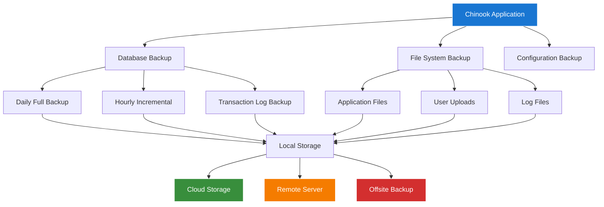

# Filament Backup Strategy Guide

## Overview

This guide covers comprehensive backup strategies for the Chinook Filament admin panel, including database backups, file system backups, automated backup scheduling, and disaster recovery procedures.

## Table of Contents

- [Overview](#overview)
- [Backup Architecture](#backup-architecture)
- [Database Backup Strategy](#database-backup-strategy)
- [File System Backup](#file-system-backup)
- [Laravel Backup Package](#laravel-backup-package)
- [Automated Backup Scheduling](#automated-backup-scheduling)
- [Backup Verification](#backup-verification)
- [Disaster Recovery](#disaster-recovery)
- [Backup Monitoring](#backup-monitoring)
- [Cloud Storage Integration](#cloud-storage-integration)
- [Troubleshooting](#troubleshooting)

## Backup Architecture

### Backup Strategy Overview



### Backup Retention Policy

| Backup Type | Frequency | Retention | Storage Location |
|-------------|-----------|-----------|------------------|
| Full Database | Daily | 30 days | Local + Cloud |
| Incremental DB | Hourly | 7 days | Local |
| Transaction Log | 15 minutes | 24 hours | Local |
| File System | Daily | 30 days | Local + Cloud |
| Configuration | Weekly | 90 days | Local + Cloud |
| Archive | Monthly | 1 year | Cloud + Offsite |

## Database Backup Strategy

### MySQL Backup Configuration

```bash
#!/bin/bash
# scripts/backup-database.sh

set -euo pipefail

# Configuration
DB_HOST="${DB_HOST:-localhost}"
DB_PORT="${DB_PORT:-3306}"
DB_NAME="${DB_DATABASE:-chinook}"
DB_USER="${DB_USERNAME:-root}"
DB_PASS="${DB_PASSWORD}"
BACKUP_DIR="/var/backups/chinook/database"
RETENTION_DAYS=30
DATE=$(date +%Y%m%d_%H%M%S)

# Create backup directory
mkdir -p "$BACKUP_DIR"

# Full backup with compression
mysqldump \
    --host="$DB_HOST" \
    --port="$DB_PORT" \
    --user="$DB_USER" \
    --password="$DB_PASS" \
    --single-transaction \
    --routines \
    --triggers \
    --events \
    --quick \
    --lock-tables=false \
    --compress \
    "$DB_NAME" | gzip > "$BACKUP_DIR/chinook_full_$DATE.sql.gz"

# Verify backup integrity
if gunzip -t "$BACKUP_DIR/chinook_full_$DATE.sql.gz"; then
    echo "Backup created successfully: chinook_full_$DATE.sql.gz"

    # Log backup completion
    echo "$(date): Full backup completed - chinook_full_$DATE.sql.gz" >> "$BACKUP_DIR/backup.log"

    # Upload to cloud storage
    aws s3 cp "$BACKUP_DIR/chinook_full_$DATE.sql.gz" "s3://chinook-backups/database/"

else
    echo "Backup verification failed!" >&2
    exit 1
fi

# Cleanup old backups
find "$BACKUP_DIR" -name "chinook_full_*.sql.gz" -mtime +$RETENTION_DAYS -delete

echo "Database backup completed successfully"
```

### Incremental Backup Script

```bash
#!/bin/bash
# scripts/backup-database-incremental.sh

set -euo pipefail

# Configuration
BACKUP_DIR="/var/backups/chinook/database/incremental"
BINLOG_DIR="/var/lib/mysql"
DATE=$(date +%Y%m%d_%H%M%S)
LAST_BACKUP_FILE="$BACKUP_DIR/.last_backup_position"

# Create backup directory
mkdir -p "$BACKUP_DIR"

# Get current binary log position
CURRENT_LOG=$(mysql -e "SHOW MASTER STATUS\G" | grep File | awk '{print $2}')
CURRENT_POS=$(mysql -e "SHOW MASTER STATUS\G" | grep Position | awk '{print $2}')

# Read last backup position
if [[ -f "$LAST_BACKUP_FILE" ]]; then
    LAST_LOG=$(cat "$LAST_BACKUP_FILE" | cut -d: -f1)
    LAST_POS=$(cat "$LAST_BACKUP_FILE" | cut -d: -f2)
else
    LAST_LOG="$CURRENT_LOG"
    LAST_POS=4
fi

# Create incremental backup
mysqlbinlog \
    --start-position="$LAST_POS" \
    --stop-position="$CURRENT_POS" \
    "$BINLOG_DIR/$LAST_LOG" | gzip > "$BACKUP_DIR/chinook_incr_$DATE.sql.gz"

# Update last backup position
echo "$CURRENT_LOG:$CURRENT_POS" > "$LAST_BACKUP_FILE"

echo "Incremental backup completed: chinook_incr_$DATE.sql.gz"
```

### Database Backup Service

```php
<?php
// app/Services/DatabaseBackupService.php

namespace App\Services;

use Illuminate\Support\Facades\{DB, Storage, Log};
use Illuminate\Support\Process\Process;
use Carbon\Carbon;

class DatabaseBackupService
{
    private string $backupPath;
    private array $config;

    public function __construct()
    {
        $this->backupPath = storage_path('app/backups/database');
        $this->config = config('database.connections.' . config('database.default'));

        if (!is_dir($this->backupPath)) {
            mkdir($this->backupPath, 0755, true);
        }
    }

    public function createFullBackup(): string
    {
        $timestamp = Carbon::now()->format('Y-m-d_H-i-s');
        $filename = "chinook_full_{$timestamp}.sql.gz";
        $filepath = $this->backupPath . '/' . $filename;

        $command = $this->buildMysqldumpCommand($filepath);

        $process = Process::start($command);
        $result = $process->wait();

        if ($result->successful()) {
            $this->verifyBackup($filepath);
            $this->uploadToCloud($filepath, $filename);
            $this->logBackupCompletion('full', $filename, filesize($filepath));

            return $filename;
        }

        throw new \Exception('Database backup failed: ' . $result->errorOutput());
    }

    public function createIncrementalBackup(): string
    {
        $timestamp = Carbon::now()->format('Y-m-d_H-i-s');
        $filename = "chinook_incr_{$timestamp}.sql.gz";
        $filepath = $this->backupPath . '/' . $filename;

        $lastPosition = $this->getLastBackupPosition();
        $currentPosition = $this->getCurrentBinlogPosition();

        $command = $this->buildBinlogCommand($lastPosition, $currentPosition, $filepath);

        $process = Process::start($command);
        $result = $process->wait();

        if ($result->successful()) {
            $this->updateLastBackupPosition($currentPosition);
            $this->logBackupCompletion('incremental', $filename, filesize($filepath));

            return $filename;
        }

        throw new \Exception('Incremental backup failed: ' . $result->errorOutput());
    }

    public function restoreFromBackup(string $backupFile): bool
    {
        $filepath = $this->backupPath . '/' . $backupFile;

        if (!file_exists($filepath)) {
            throw new \Exception("Backup file not found: {$backupFile}");
        }

        // Create restore command
        $command = sprintf(
            'gunzip -c %s | mysql -h%s -P%s -u%s -p%s %s',
            escapeshellarg($filepath),
            escapeshellarg($this->config['host']),
            escapeshellarg($this->config['port']),
            escapeshellarg($this->config['username']),
            escapeshellarg($this->config['password']),
            escapeshellarg($this->config['database'])
        );

        $process = Process::start($command);
        $result = $process->wait();

        if ($result->successful()) {
            Log::info('Database restored successfully', ['backup_file' => $backupFile]);
            return true;
        }

        throw new \Exception('Database restore failed: ' . $result->errorOutput());
    }

    public function listBackups(): array
    {
        $files = glob($this->backupPath . '/chinook_*.sql.gz');
        $backups = [];

        foreach ($files as $file) {
            $filename = basename($file);
            $backups[] = [
                'filename' => $filename,
                'size' => filesize($file),
                'created_at' => Carbon::createFromTimestamp(filemtime($file)),
                'type' => str_contains($filename, '_full_') ? 'full' : 'incremental',
            ];
        }

        usort($backups, fn($a, $b) => $b['created_at']->timestamp <=> $a['created_at']->timestamp);

        return $backups;
    }

    public function cleanupOldBackups(int $retentionDays = 30): int
    {
        $cutoffDate = Carbon::now()->subDays($retentionDays);
        $files = glob($this->backupPath . '/chinook_*.sql.gz');
        $deletedCount = 0;

        foreach ($files as $file) {
            $fileDate = Carbon::createFromTimestamp(filemtime($file));

            if ($fileDate->lt($cutoffDate)) {
                unlink($file);
                $deletedCount++;
                Log::info('Old backup deleted', ['file' => basename($file)]);
            }
        }

        return $deletedCount;
    }

    private function buildMysqldumpCommand(string $outputPath): string
    {
        return sprintf(
            'mysqldump -h%s -P%s -u%s -p%s --single-transaction --routines --triggers --events --quick --lock-tables=false %s | gzip > %s',
            escapeshellarg($this->config['host']),
            escapeshellarg($this->config['port']),
            escapeshellarg($this->config['username']),
            escapeshellarg($this->config['password']),
            escapeshellarg($this->config['database']),
            escapeshellarg($outputPath)
        );
    }

    private function buildBinlogCommand(array $lastPosition, array $currentPosition, string $outputPath): string
    {
        return sprintf(
            'mysqlbinlog --start-position=%s --stop-position=%s %s | gzip > %s',
            $lastPosition['position'],
            $currentPosition['position'],
            escapeshellarg('/var/lib/mysql/' . $lastPosition['file']),
            escapeshellarg($outputPath)
        );
    }

    private function verifyBackup(string $filepath): void
    {
        $process = Process::start("gunzip -t " . escapeshellarg($filepath));
        $result = $process->wait();

        if (!$result->successful()) {
            throw new \Exception('Backup verification failed');
        }
    }

    private function uploadToCloud(string $filepath, string $filename): void
    {
        if (config('filesystems.disks.s3.key')) {
            Storage::disk('s3')->put("database-backups/{$filename}", file_get_contents($filepath));
            Log::info('Backup uploaded to cloud', ['filename' => $filename]);
        }
    }

    private function getLastBackupPosition(): array
    {
        $positionFile = $this->backupPath . '/.last_backup_position';

        if (file_exists($positionFile)) {
            [$file, $position] = explode(':', file_get_contents($positionFile));
            return ['file' => $file, 'position' => (int) $position];
        }

        // Return current position if no previous backup
        return $this->getCurrentBinlogPosition();
    }

    private function getCurrentBinlogPosition(): array
    {
        $result = DB::select('SHOW MASTER STATUS');

        if (empty($result)) {
            throw new \Exception('Unable to get binary log position');
        }

        return [
            'file' => $result[0]->File,
            'position' => $result[0]->Position,
        ];
    }

    private function updateLastBackupPosition(array $position): void
    {
        $positionFile = $this->backupPath . '/.last_backup_position';
        file_put_contents($positionFile, $position['file'] . ':' . $position['position']);
    }

    private function logBackupCompletion(string $type, string $filename, int $size): void
    {
        Log::info('Database backup completed', [
            'type' => $type,
            'filename' => $filename,
            'size_bytes' => $size,
            'size_mb' => round($size / 1024 / 1024, 2),
        ]);
    }
}
```

## File System Backup

### Application Files Backup

```bash
#!/bin/bash
# scripts/backup-files.sh

set -euo pipefail

# Configuration
APP_DIR="/var/www/chinook"
BACKUP_DIR="/var/backups/chinook/files"
DATE=$(date +%Y%m%d_%H%M%S)
RETENTION_DAYS=30

# Create backup directory
mkdir -p "$BACKUP_DIR"

# Create file system backup
tar -czf "$BACKUP_DIR/chinook_files_$DATE.tar.gz" \
    --exclude="$APP_DIR/storage/logs/*" \
    --exclude="$APP_DIR/storage/framework/cache/*" \
    --exclude="$APP_DIR/storage/framework/sessions/*" \
    --exclude="$APP_DIR/storage/framework/views/*" \
    --exclude="$APP_DIR/node_modules" \
    --exclude="$APP_DIR/.git" \
    --exclude="$APP_DIR/vendor" \
    "$APP_DIR"

# Verify backup
if tar -tzf "$BACKUP_DIR/chinook_files_$DATE.tar.gz" > /dev/null; then
    echo "File backup created successfully: chinook_files_$DATE.tar.gz"

    # Upload to cloud
    aws s3 cp "$BACKUP_DIR/chinook_files_$DATE.tar.gz" "s3://chinook-backups/files/"

    # Cleanup old backups
    find "$BACKUP_DIR" -name "chinook_files_*.tar.gz" -mtime +$RETENTION_DAYS -delete

else
    echo "File backup verification failed!" >&2
    exit 1
fi

echo "File system backup completed successfully"
```

### User Uploads Backup

```bash
#!/bin/bash
# scripts/backup-uploads.sh

set -euo pipefail

# Configuration
UPLOADS_DIR="/var/www/chinook/storage/app/public"
BACKUP_DIR="/var/backups/chinook/uploads"
DATE=$(date +%Y%m%d_%H%M%S)

# Create backup directory
mkdir -p "$BACKUP_DIR"

# Sync uploads to backup location
rsync -av --delete "$UPLOADS_DIR/" "$BACKUP_DIR/current/"

# Create timestamped archive
tar -czf "$BACKUP_DIR/chinook_uploads_$DATE.tar.gz" -C "$BACKUP_DIR" current/

# Upload to cloud storage
aws s3 sync "$UPLOADS_DIR/" "s3://chinook-backups/uploads/" --delete

echo "Uploads backup completed successfully"
```

## Laravel Backup Package

### Package Configuration

```php
<?php
// config/backup.php

return [
    'backup' => [
        'name' => env('APP_NAME', 'chinook'),

        'source' => [
            'files' => [
                'include' => [
                    base_path(),
                ],
                'exclude' => [
                    base_path('vendor'),
                    base_path('node_modules'),
                    base_path('.git'),
                    base_path('storage/framework/cache'),
                    base_path('storage/framework/sessions'),
                    base_path('storage/framework/views'),
                    base_path('storage/logs'),
                ],
                'follow_links' => false,
                'ignore_unreadable_directories' => false,
                'relative_path' => null,
            ],

            'databases' => [
                'mysql',
            ],
        ],

        'database_dump_compressor' => Spatie\DbDumper\Compressors\GzipCompressor::class,

        'database_dump_file_extension' => '',

        'destination' => [
            'filename_prefix' => '',
            'disks' => [
                'local',
                's3',
            ],
        ],

        'temporary_directory' => storage_path('app/backup-temp'),

        'password' => env('BACKUP_ARCHIVE_PASSWORD'),

        'encryption' => 'default',
    ],

    'notifications' => [
        'notifications' => [
            \Spatie\Backup\Notifications\Notifications\BackupHasFailed::class => ['mail', 'slack'],
            \Spatie\Backup\Notifications\Notifications\UnhealthyBackupWasFound::class => ['mail', 'slack'],
            \Spatie\Backup\Notifications\Notifications\CleanupHasFailed::class => ['mail', 'slack'],
            \Spatie\Backup\Notifications\Notifications\BackupWasSuccessful::class => ['mail'],
            \Spatie\Backup\Notifications\Notifications\HealthyBackupWasFound::class => [],
            \Spatie\Backup\Notifications\Notifications\CleanupWasSuccessful::class => [],
        ],

        'notifiable' => \Spatie\Backup\Notifications\Notifiable::class,

        'mail' => [
            'to' => env('BACKUP_MAIL_TO', 'admin@chinook.local'),
            'from' => [
                'address' => env('MAIL_FROM_ADDRESS', 'backup@chinook.local'),
                'name' => env('MAIL_FROM_NAME', 'Chinook Backup'),
            ],
        ],

        'slack' => [
            'webhook_url' => env('BACKUP_SLACK_WEBHOOK_URL'),
            'channel' => env('BACKUP_SLACK_CHANNEL', '#backups'),
            'username' => env('BACKUP_SLACK_USERNAME', 'Chinook Backup'),
            'icon' => env('BACKUP_SLACK_ICON', ':floppy_disk:'),
        ],
    ],

    'monitor_backups' => [
        [
            'name' => env('APP_NAME', 'chinook'),
            'disks' => ['local', 's3'],
            'health_checks' => [
                \Spatie\Backup\Tasks\Monitor\HealthChecks\MaximumAgeInDays::class => 1,
                \Spatie\Backup\Tasks\Monitor\HealthChecks\MaximumStorageInMegabytes::class => 5000,
            ],
        ],
    ],

    'cleanup' => [
        'strategy' => \Spatie\Backup\Tasks\Cleanup\Strategies\DefaultStrategy::class,

        'default_strategy' => [
            'keep_all_backups_for_days' => 7,
            'keep_daily_backups_for_days' => 16,
            'keep_weekly_backups_for_weeks' => 8,
            'keep_monthly_backups_for_months' => 4,
            'keep_yearly_backups_for_years' => 2,
            'delete_oldest_backups_when_using_more_megabytes_than' => 5000,
        ],
    ],
];
```

## Automated Backup Scheduling

### Cron Configuration

```bash
# /etc/cron.d/chinook-backup

# Database backups
0 2 * * * www-data /var/www/chinook/scripts/backup-database.sh >> /var/log/chinook-backup.log 2>&1
0 */1 * * * www-data /var/www/chinook/scripts/backup-database-incremental.sh >> /var/log/chinook-backup.log 2>&1

# File system backups
30 2 * * * www-data /var/www/chinook/scripts/backup-files.sh >> /var/log/chinook-backup.log 2>&1
0 */6 * * * www-data /var/www/chinook/scripts/backup-uploads.sh >> /var/log/chinook-backup.log 2>&1

# Laravel backup package
0 3 * * * www-data cd /var/www/chinook && php artisan backup:run >> /var/log/chinook-backup.log 2>&1
0 4 * * * www-data cd /var/www/chinook && php artisan backup:clean >> /var/log/chinook-backup.log 2>&1
0 5 * * * www-data cd /var/www/chinook && php artisan backup:monitor >> /var/log/chinook-backup.log 2>&1

# Cleanup old logs
0 6 * * 0 www-data find /var/log -name "*backup*" -mtime +30 -delete
```

### Laravel Scheduler Integration

```php
<?php
// app/Console/Kernel.php

namespace App\Console;

use Illuminate\Console\Scheduling\Schedule;
use Illuminate\Foundation\Console\Kernel as ConsoleKernel;

class Kernel extends ConsoleKernel
{
    protected function schedule(Schedule $schedule): void
    {
        // Database backups
        $schedule->command('backup:database --type=full')
            ->dailyAt('02:00')
            ->environments(['production'])
            ->onFailure(function () {
                // Send alert
            });

        $schedule->command('backup:database --type=incremental')
            ->hourly()
            ->environments(['production']);

        // Laravel backup package
        $schedule->command('backup:run')
            ->dailyAt('03:00')
            ->environments(['production']);

        $schedule->command('backup:clean')
            ->dailyAt('04:00')
            ->environments(['production']);

        $schedule->command('backup:monitor')
            ->dailyAt('05:00')
            ->environments(['production']);

        // Cleanup old backups
        $schedule->command('backup:cleanup')
            ->weekly()
            ->sundays()
            ->at('06:00')
            ->environments(['production']);
    }
}
```

## Backup Verification

### Backup Integrity Checker

```php
<?php
// app/Console/Commands/VerifyBackups.php

namespace App\Console\Commands;

use Illuminate\Console\Command;
use Illuminate\Support\Facades\{Storage, Log};
use Carbon\Carbon;

class VerifyBackups extends Command
{
    protected $signature = 'backup:verify {--type=all : Type of backup to verify}';
    protected $description = 'Verify backup integrity and completeness';

    public function handle(): void
    {
        $type = $this->option('type');

        match ($type) {
            'database' => $this->verifyDatabaseBackups(),
            'files' => $this->verifyFileBackups(),
            'all' => $this->verifyAllBackups(),
            default => $this->error('Invalid backup type'),
        };
    }

    private function verifyDatabaseBackups(): void
    {
        $this->info('Verifying database backups...');

        $backupPath = storage_path('app/backups/database');
        $backups = glob($backupPath . '/chinook_*.sql.gz');

        foreach ($backups as $backup) {
            $filename = basename($backup);

            // Check file integrity
            if ($this->verifyGzipFile($backup)) {
                $this->line("✓ {$filename} - Integrity OK");
            } else {
                $this->error("✗ {$filename} - Integrity FAILED");
                Log::error('Backup integrity check failed', ['file' => $filename]);
            }

            // Check file age
            $age = Carbon::createFromTimestamp(filemtime($backup))->diffInHours();
            if ($age > 25) { // Daily backups should be less than 25 hours old
                $this->warn("⚠ {$filename} - File is {$age} hours old");
            }
        }
    }

    private function verifyFileBackups(): void
    {
        $this->info('Verifying file backups...');

        $backupPath = storage_path('app/backups/files');
        $backups = glob($backupPath . '/chinook_files_*.tar.gz');

        foreach ($backups as $backup) {
            $filename = basename($backup);

            // Check tar file integrity
            if ($this->verifyTarFile($backup)) {
                $this->line("✓ {$filename} - Integrity OK");
            } else {
                $this->error("✗ {$filename} - Integrity FAILED");
                Log::error('File backup integrity check failed', ['file' => $filename]);
            }
        }
    }

    private function verifyAllBackups(): void
    {
        $this->verifyDatabaseBackups();
        $this->line('');
        $this->verifyFileBackups();
        $this->line('');
        $this->verifyCloudBackups();
    }

    private function verifyCloudBackups(): void
    {
        $this->info('Verifying cloud backups...');

        if (!Storage::disk('s3')->exists('database-backups/')) {
            $this->error('Cloud database backup directory not found');
            return;
        }

        $cloudFiles = Storage::disk('s3')->files('database-backups/');
        $localFiles = glob(storage_path('app/backups/database/chinook_*.sql.gz'));

        $this->line("Cloud files: " . count($cloudFiles));
        $this->line("Local files: " . count($localFiles));

        // Check if recent backups are in cloud
        $recentLocal = array_slice($localFiles, -3); // Last 3 backups

        foreach ($recentLocal as $localFile) {
            $filename = basename($localFile);
            $cloudPath = "database-backups/{$filename}";

            if (Storage::disk('s3')->exists($cloudPath)) {
                $this->line("✓ {$filename} - Found in cloud");
            } else {
                $this->error("✗ {$filename} - Missing from cloud");
            }
        }
    }

    private function verifyGzipFile(string $filepath): bool
    {
        $command = "gunzip -t " . escapeshellarg($filepath) . " 2>/dev/null";
        exec($command, $output, $returnCode);
        return $returnCode === 0;
    }

    private function verifyTarFile(string $filepath): bool
    {
        $command = "tar -tzf " . escapeshellarg($filepath) . " >/dev/null 2>&1";
        exec($command, $output, $returnCode);
        return $returnCode === 0;
    }
}
```

## Disaster Recovery

### Recovery Procedures

```bash
#!/bin/bash
# scripts/disaster-recovery.sh

set -euo pipefail

RECOVERY_TYPE="${1:-full}"
BACKUP_DATE="${2:-latest}"

case "$RECOVERY_TYPE" in
    "database")
        echo "Starting database recovery..."
        ./scripts/restore-database.sh "$BACKUP_DATE"
        ;;
    "files")
        echo "Starting file system recovery..."
        ./scripts/restore-files.sh "$BACKUP_DATE"
        ;;
    "full")
        echo "Starting full system recovery..."
        ./scripts/restore-database.sh "$BACKUP_DATE"
        ./scripts/restore-files.sh "$BACKUP_DATE"
        ./scripts/restore-configuration.sh
        ;;
    *)
        echo "Usage: $0 {database|files|full} [backup_date]"
        exit 1
        ;;
esac

echo "Recovery completed successfully"
```

### Database Restore Script

```bash
#!/bin/bash
# scripts/restore-database.sh

set -euo pipefail

BACKUP_DATE="${1:-latest}"
BACKUP_DIR="/var/backups/chinook/database"

# Find backup file
if [[ "$BACKUP_DATE" == "latest" ]]; then
    BACKUP_FILE=$(ls -t "$BACKUP_DIR"/chinook_full_*.sql.gz | head -1)
else
    BACKUP_FILE=$(find "$BACKUP_DIR" -name "*$BACKUP_DATE*.sql.gz" | head -1)
fi

if [[ ! -f "$BACKUP_FILE" ]]; then
    echo "Backup file not found for date: $BACKUP_DATE" >&2
    exit 1
fi

echo "Restoring from: $(basename "$BACKUP_FILE")"

# Create database backup before restore
mysqldump chinook | gzip > "$BACKUP_DIR/pre_restore_$(date +%Y%m%d_%H%M%S).sql.gz"

# Restore database
gunzip -c "$BACKUP_FILE" | mysql chinook

echo "Database restored successfully"
```

## Backup Monitoring

### Backup Status Dashboard

```php
<?php
// app/Filament/Widgets/BackupStatusWidget.php

namespace App\Filament\Widgets;

use Filament\Widgets\Widget;
use Illuminate\Support\Facades\{Storage, Cache};
use Carbon\Carbon;

class BackupStatusWidget extends Widget
{
    protected static string $view = 'filament.widgets.backup-status';
    protected static ?int $sort = 3;

    protected function getViewData(): array
    {
        return [
            'database_backups' => $this->getDatabaseBackupStatus(),
            'file_backups' => $this->getFileBackupStatus(),
            'cloud_backups' => $this->getCloudBackupStatus(),
            'last_verification' => $this->getLastVerification(),
        ];
    }

    private function getDatabaseBackupStatus(): array
    {
        $backupPath = storage_path('app/backups/database');
        $backups = glob($backupPath . '/chinook_full_*.sql.gz');

        if (empty($backups)) {
            return ['status' => 'error', 'message' => 'No backups found'];
        }

        $latest = max(array_map('filemtime', $backups));
        $age = Carbon::createFromTimestamp($latest)->diffInHours();

        if ($age > 25) {
            return ['status' => 'warning', 'message' => "Last backup {$age} hours ago"];
        }

        return ['status' => 'success', 'message' => 'Backups up to date'];
    }

    private function getFileBackupStatus(): array
    {
        $backupPath = storage_path('app/backups/files');
        $backups = glob($backupPath . '/chinook_files_*.tar.gz');

        if (empty($backups)) {
            return ['status' => 'error', 'message' => 'No file backups found'];
        }

        $latest = max(array_map('filemtime', $backups));
        $age = Carbon::createFromTimestamp($latest)->diffInHours();

        if ($age > 25) {
            return ['status' => 'warning', 'message' => "Last backup {$age} hours ago"];
        }

        return ['status' => 'success', 'message' => 'File backups up to date'];
    }

    private function getCloudBackupStatus(): array
    {
        try {
            $files = Storage::disk('s3')->files('database-backups/');

            if (empty($files)) {
                return ['status' => 'error', 'message' => 'No cloud backups found'];
            }

            return ['status' => 'success', 'message' => count($files) . ' files in cloud'];

        } catch (\Exception $e) {
            return ['status' => 'error', 'message' => 'Cloud storage unavailable'];
        }
    }

    private function getLastVerification(): array
    {
        $lastVerification = Cache::get('last_backup_verification');

        if (!$lastVerification) {
            return ['status' => 'warning', 'message' => 'No verification run'];
        }

        $age = Carbon::parse($lastVerification)->diffInHours();

        if ($age > 24) {
            return ['status' => 'warning', 'message' => "Last verified {$age} hours ago"];
        }

        return ['status' => 'success', 'message' => 'Recently verified'];
    }
}
```

## Cloud Storage Integration

### S3 Configuration

```php
<?php
// config/filesystems.php (S3 disk configuration)

's3' => [
    'driver' => 's3',
    'key' => env('AWS_ACCESS_KEY_ID'),
    'secret' => env('AWS_SECRET_ACCESS_KEY'),
    'region' => env('AWS_DEFAULT_REGION'),
    'bucket' => env('AWS_BUCKET'),
    'url' => env('AWS_URL'),
    'endpoint' => env('AWS_ENDPOINT'),
    'use_path_style_endpoint' => env('AWS_USE_PATH_STYLE_ENDPOINT', false),
    'throw' => false,
    'options' => [
        'ServerSideEncryption' => 'AES256',
        'StorageClass' => 'STANDARD_IA',
    ],
],
```

### Multi-Cloud Backup Strategy

```php
<?php
// app/Services/MultiCloudBackupService.php

namespace App\Services;

use Illuminate\Support\Facades\Storage;

class MultiCloudBackupService
{
    private array $cloudProviders = ['s3', 'gcs', 'azure'];

    public function uploadToAllClouds(string $localPath, string $remotePath): array
    {
        $results = [];

        foreach ($this->cloudProviders as $provider) {
            try {
                if (config("filesystems.disks.{$provider}.key")) {
                    Storage::disk($provider)->put($remotePath, file_get_contents($localPath));
                    $results[$provider] = 'success';
                }
            } catch (\Exception $e) {
                $results[$provider] = 'failed: ' . $e->getMessage();
            }
        }

        return $results;
    }
}
```

## Troubleshooting

### Common Backup Issues

1. **Backup Fails with Permission Errors**
   ```bash
   # Fix file permissions
   sudo chown -R www-data:www-data /var/backups/chinook
   sudo chmod -R 755 /var/backups/chinook
   ```

2. **Database Backup Timeout**
   ```bash
   # Increase MySQL timeout
   mysql -e "SET GLOBAL net_read_timeout=600;"
   mysql -e "SET GLOBAL net_write_timeout=600;"
   ```

3. **Cloud Upload Failures**
   ```bash
   # Test AWS credentials
   aws s3 ls s3://chinook-backups/

   # Check network connectivity
   curl -I https://s3.amazonaws.com
   ```

4. **Backup Verification Failures**
   ```bash
   # Test gzip file
   gunzip -t backup_file.sql.gz

   # Test tar file
   tar -tzf backup_file.tar.gz
   ```

### Monitoring Commands

```bash
# Check backup status
php artisan backup:list
php artisan backup:monitor

# Verify backups
php artisan backup:verify

# Check disk space
df -h /var/backups

# Monitor backup processes
ps aux | grep backup
```

---

**Next Steps:**
- [Maintenance Procedures](120-maintenance-procedures.md)
- [CI/CD Pipeline](130-cicd-pipeline.md)
- [Docker Deployment](140-docker-deployment.md)
