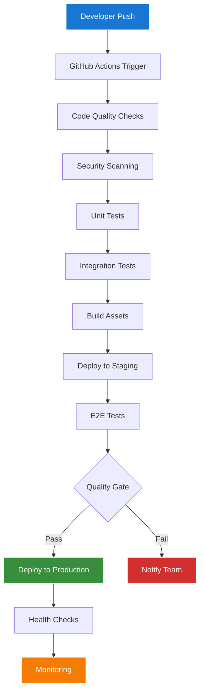

# Filament CI/CD Pipeline Guide

## Overview

This guide covers comprehensive CI/CD pipeline setup for the Chinook Filament admin panel, including automated testing, deployment strategies, quality gates, and monitoring integration.

## Table of Contents

- [Overview](#overview)
- [Pipeline Architecture](#pipeline-architecture)
- [GitHub Actions Workflow](#github-actions-workflow)
- [Testing Pipeline](#testing-pipeline)
- [Build & Deployment](#build--deployment)
- [Quality Gates](#quality-gates)
- [Environment Management](#environment-management)
- [Security Scanning](#security-scanning)
- [Monitoring Integration](#monitoring-integration)
- [Rollback Procedures](#rollback-procedures)
- [Troubleshooting](#troubleshooting)

## Pipeline Architecture

### CI/CD Flow Overview



### Pipeline Stages

| Stage | Purpose | Duration | Failure Action |
|-------|---------|----------|----------------|
| Code Quality | Lint, format, static analysis | 2-3 min | Block deployment |
| Security Scan | Vulnerability detection | 3-5 min | Block deployment |
| Unit Tests | Component testing | 5-10 min | Block deployment |
| Integration Tests | Feature testing | 10-15 min | Block deployment |
| Build | Asset compilation | 3-5 min | Block deployment |
| Staging Deploy | Pre-production testing | 2-3 min | Block production |
| E2E Tests | Full system testing | 15-20 min | Block production |
| Production Deploy | Live deployment | 5-10 min | Auto-rollback |

## GitHub Actions Workflow

### Main Workflow Configuration

```yaml
# .github/workflows/ci-cd.yml
name: CI/CD Pipeline

on:
  push:
    branches: [main, develop]
  pull_request:
    branches: [main]

env:
  PHP_VERSION: '8.3'
  NODE_VERSION: '20'
  COMPOSER_CACHE_DIR: ~/.composer/cache

jobs:
  code-quality:
    name: Code Quality Checks
    runs-on: ubuntu-latest
    
    steps:
      - name: Checkout code
        uses: actions/checkout@v4
        
      - name: Setup PHP
        uses: shivammathur/setup-php@v2
        with:
          php-version: ${{ env.PHP_VERSION }}
          extensions: dom, curl, libxml, mbstring, zip, pcntl, pdo, sqlite, pdo_sqlite, bcmath, soap, intl, gd, exif, iconv
          coverage: xdebug
          
      - name: Cache Composer dependencies
        uses: actions/cache@v3
        with:
          path: ${{ env.COMPOSER_CACHE_DIR }}
          key: ${{ runner.os }}-composer-${{ hashFiles('**/composer.lock') }}
          restore-keys: ${{ runner.os }}-composer-
          
      - name: Install Composer dependencies
        run: composer install --no-progress --prefer-dist --optimize-autoloader
        
      - name: Setup Node.js
        uses: actions/setup-node@v4
        with:
          node-version: ${{ env.NODE_VERSION }}
          cache: 'npm'
          
      - name: Install NPM dependencies
        run: npm ci
        
      - name: Run PHP CS Fixer
        run: vendor/bin/php-cs-fixer fix --dry-run --diff --verbose
        
      - name: Run PHPStan
        run: vendor/bin/phpstan analyse --memory-limit=2G
        
      - name: Run ESLint
        run: npm run lint
        
      - name: Run Prettier
        run: npm run format:check

  security-scan:
    name: Security Scanning
    runs-on: ubuntu-latest
    needs: code-quality
    
    steps:
      - name: Checkout code
        uses: actions/checkout@v4
        
      - name: Setup PHP
        uses: shivammathur/setup-php@v2
        with:
          php-version: ${{ env.PHP_VERSION }}
          
      - name: Install Composer dependencies
        run: composer install --no-progress --prefer-dist --optimize-autoloader
        
      - name: Run Composer Audit
        run: composer audit
        
      - name: Setup Node.js
        uses: actions/setup-node@v4
        with:
          node-version: ${{ env.NODE_VERSION }}
          cache: 'npm'
          
      - name: Install NPM dependencies
        run: npm ci
        
      - name: Run NPM Audit
        run: npm audit --audit-level=moderate
        
      - name: Run Snyk Security Scan
        uses: snyk/actions/php@master
        env:
          SNYK_TOKEN: ${{ secrets.SNYK_TOKEN }}
        with:
          args: --severity-threshold=high

  test:
    name: Run Tests
    runs-on: ubuntu-latest
    needs: security-scan
    
    services:
      mysql:
        image: mysql:8.0
        env:
          MYSQL_ROOT_PASSWORD: password
          MYSQL_DATABASE: chinook_test
        ports:
          - 3306:3306
        options: --health-cmd="mysqladmin ping" --health-interval=10s --health-timeout=5s --health-retries=3
        
      redis:
        image: redis:7-alpine
        ports:
          - 6379:6379
        options: --health-cmd="redis-cli ping" --health-interval=10s --health-timeout=5s --health-retries=3
    
    steps:
      - name: Checkout code
        uses: actions/checkout@v4
        
      - name: Setup PHP
        uses: shivammathur/setup-php@v2
        with:
          php-version: ${{ env.PHP_VERSION }}
          extensions: dom, curl, libxml, mbstring, zip, pcntl, pdo, sqlite, pdo_sqlite, bcmath, soap, intl, gd, exif, iconv
          coverage: xdebug
          
      - name: Cache Composer dependencies
        uses: actions/cache@v3
        with:
          path: ${{ env.COMPOSER_CACHE_DIR }}
          key: ${{ runner.os }}-composer-${{ hashFiles('**/composer.lock') }}
          restore-keys: ${{ runner.os }}-composer-
          
      - name: Install Composer dependencies
        run: composer install --no-progress --prefer-dist --optimize-autoloader
        
      - name: Setup Node.js
        uses: actions/setup-node@v4
        with:
          node-version: ${{ env.NODE_VERSION }}
          cache: 'npm'
          
      - name: Install NPM dependencies
        run: npm ci
        
      - name: Build assets
        run: npm run build
        
      - name: Copy environment file
        run: cp .env.ci .env
        
      - name: Generate application key
        run: php artisan key:generate
        
      - name: Run database migrations
        run: php artisan migrate --force
        
      - name: Seed database
        run: php artisan db:seed --force
        
      - name: Run unit tests
        run: vendor/bin/pest --coverage --min=80
        
      - name: Run feature tests
        run: vendor/bin/pest --testsuite=Feature
        
      - name: Upload coverage reports
        uses: codecov/codecov-action@v3
        with:
          file: ./coverage.xml
          flags: unittests
          name: codecov-umbrella

  build:
    name: Build Assets
    runs-on: ubuntu-latest
    needs: test
    if: github.ref == 'refs/heads/main'
    
    steps:
      - name: Checkout code
        uses: actions/checkout@v4
        
      - name: Setup Node.js
        uses: actions/setup-node@v4
        with:
          node-version: ${{ env.NODE_VERSION }}
          cache: 'npm'
          
      - name: Install NPM dependencies
        run: npm ci
        
      - name: Build production assets
        run: npm run build
        
      - name: Upload build artifacts
        uses: actions/upload-artifact@v3
        with:
          name: build-assets
          path: public/build/
          retention-days: 7

  deploy-staging:
    name: Deploy to Staging
    runs-on: ubuntu-latest
    needs: build
    if: github.ref == 'refs/heads/main'
    environment: staging
    
    steps:
      - name: Checkout code
        uses: actions/checkout@v4
        
      - name: Download build artifacts
        uses: actions/download-artifact@v3
        with:
          name: build-assets
          path: public/build/
          
      - name: Deploy to staging server
        uses: appleboy/ssh-action@v1.0.0
        with:
          host: ${{ secrets.STAGING_HOST }}
          username: ${{ secrets.STAGING_USER }}
          key: ${{ secrets.STAGING_SSH_KEY }}
          script: |
            cd /var/www/chinook-staging
            git pull origin main
            composer install --no-dev --optimize-autoloader
            php artisan migrate --force
            php artisan config:cache
            php artisan route:cache
            php artisan view:cache
            php artisan queue:restart
            sudo systemctl reload nginx

  e2e-tests:
    name: End-to-End Tests
    runs-on: ubuntu-latest
    needs: deploy-staging
    
    steps:
      - name: Checkout code
        uses: actions/checkout@v4
        
      - name: Setup Node.js
        uses: actions/setup-node@v4
        with:
          node-version: ${{ env.NODE_VERSION }}
          cache: 'npm'
          
      - name: Install dependencies
        run: npm ci
        
      - name: Install Playwright
        run: npx playwright install --with-deps
        
      - name: Run E2E tests
        run: npx playwright test
        env:
          PLAYWRIGHT_BASE_URL: ${{ secrets.STAGING_URL }}
          
      - name: Upload test results
        uses: actions/upload-artifact@v3
        if: failure()
        with:
          name: playwright-report
          path: playwright-report/
          retention-days: 7

  deploy-production:
    name: Deploy to Production
    runs-on: ubuntu-latest
    needs: e2e-tests
    if: github.ref == 'refs/heads/main'
    environment: production
    
    steps:
      - name: Checkout code
        uses: actions/checkout@v4
        
      - name: Download build artifacts
        uses: actions/download-artifact@v3
        with:
          name: build-assets
          path: public/build/
          
      - name: Create deployment backup
        uses: appleboy/ssh-action@v1.0.0
        with:
          host: ${{ secrets.PRODUCTION_HOST }}
          username: ${{ secrets.PRODUCTION_USER }}
          key: ${{ secrets.PRODUCTION_SSH_KEY }}
          script: |
            cd /var/www/chinook
            php artisan backup:run --only-db
            
      - name: Deploy to production
        uses: appleboy/ssh-action@v1.0.0
        with:
          host: ${{ secrets.PRODUCTION_HOST }}
          username: ${{ secrets.PRODUCTION_USER }}
          key: ${{ secrets.PRODUCTION_SSH_KEY }}
          script: |
            cd /var/www/chinook
            git pull origin main
            composer install --no-dev --optimize-autoloader
            php artisan migrate --force
            php artisan config:cache
            php artisan route:cache
            php artisan view:cache
            php artisan queue:restart
            sudo systemctl reload nginx
            
      - name: Health check
        run: |
          sleep 30
          curl -f ${{ secrets.PRODUCTION_URL }}/health || exit 1
          
      - name: Notify deployment success
        uses: 8398a7/action-slack@v3
        with:
          status: success
          text: 'Production deployment successful! 🚀'
        env:
          SLACK_WEBHOOK_URL: ${{ secrets.SLACK_WEBHOOK_URL }}

  notify-failure:
    name: Notify on Failure
    runs-on: ubuntu-latest
    needs: [code-quality, security-scan, test, deploy-staging, e2e-tests, deploy-production]
    if: failure()
    
    steps:
      - name: Notify team of failure
        uses: 8398a7/action-slack@v3
        with:
          status: failure
          text: 'CI/CD Pipeline failed! 🚨'
        env:
          SLACK_WEBHOOK_URL: ${{ secrets.SLACK_WEBHOOK_URL }}
```

## Testing Pipeline

### Test Configuration

```php
<?php
// tests/TestCase.php

namespace Tests;

use Illuminate\Foundation\Testing\TestCase as BaseTestCase;
use Illuminate\Foundation\Testing\RefreshDatabase;

abstract class TestCase extends BaseTestCase
{
    use CreatesApplication, RefreshDatabase;
    
    protected function setUp(): void
    {
        parent::setUp();
        
        // Seed test data
        $this->artisan('db:seed', ['--class' => 'TestSeeder']);
        
        // Set up test user
        $this->actingAs($this->createTestUser());
    }
    
    protected function createTestUser(): User
    {
        return User::factory()->create([
            'email' => 'test@chinook.local',
            'password' => bcrypt('password'),
        ]);
    }
}
```

### Pest Configuration

```php
<?php
// tests/Pest.php

use Illuminate\Foundation\Testing\RefreshDatabase;use old\TestCase;

uses(TestCase::class, RefreshDatabase::class)->in('Feature');
uses(TestCase::class)->in('Unit');

expect()->extend('toBeValidUrl', function () {
    return $this->toMatch('/^https?:\/\/.+/');
});

expect()->extend('toHaveValidJson', function () {
    json_decode($this->value);
    return expect(json_last_error())->toBe(JSON_ERROR_NONE);
});
```

### Feature Test Example

```php
<?php
// tests/Feature/Filament/ArtistResourceTest.php

use App\Models\{User, Artist};
use Filament\Actions\DeleteAction;

it('can render artist index page', function () {
    $this->get('/admin/artists')
        ->assertSuccessful();
});

it('can create artist', function () {
    $artistData = [
        'name' => 'Test Artist',
        'bio' => 'Test biography',
        'website' => 'https://testartist.com',
    ];
    
    $this->post('/admin/artists', $artistData)
        ->assertRedirect();
        
    $this->assertDatabaseHas('artists', $artistData);
});

it('can update artist', function () {
    $artist = Artist::factory()->create();
    
    $updatedData = [
        'name' => 'Updated Artist Name',
        'bio' => 'Updated biography',
    ];
    
    $this->put("/admin/artists/{$artist->id}", $updatedData)
        ->assertRedirect();
        
    $this->assertDatabaseHas('artists', $updatedData);
});

it('can delete artist', function () {
    $artist = Artist::factory()->create();
    
    $this->delete("/admin/artists/{$artist->id}")
        ->assertRedirect();
        
    $this->assertSoftDeleted('artists', ['id' => $artist->id]);
});
```

## Build & Deployment

### Deployment Script

```bash
#!/bin/bash
# scripts/deploy.sh

set -euo pipefail

ENVIRONMENT="${1:-staging}"
BRANCH="${2:-main}"

echo "Deploying to $ENVIRONMENT from $BRANCH branch..."

# Configuration
case "$ENVIRONMENT" in
    "staging")
        SERVER_HOST="$STAGING_HOST"
        SERVER_USER="$STAGING_USER"
        APP_PATH="/var/www/chinook-staging"
        ;;
    "production")
        SERVER_HOST="$PRODUCTION_HOST"
        SERVER_USER="$PRODUCTION_USER"
        APP_PATH="/var/www/chinook"
        ;;
    *)
        echo "Invalid environment: $ENVIRONMENT"
        exit 1
        ;;
esac

# Pre-deployment checks
echo "Running pre-deployment checks..."
ssh "$SERVER_USER@$SERVER_HOST" "
    cd $APP_PATH
    php artisan down --retry=60
    php artisan backup:run --only-db
"

# Deploy application
echo "Deploying application..."
ssh "$SERVER_USER@$SERVER_HOST" "
    cd $APP_PATH
    git fetch origin
    git checkout $BRANCH
    git pull origin $BRANCH
    
    composer install --no-dev --optimize-autoloader
    npm ci
    npm run build
    
    php artisan migrate --force
    php artisan config:cache
    php artisan route:cache
    php artisan view:cache
    php artisan event:cache
    
    php artisan queue:restart
    php artisan up
"

# Post-deployment verification
echo "Running post-deployment checks..."
sleep 10

if curl -f "https://$SERVER_HOST/health"; then
    echo "Deployment successful!"
else
    echo "Health check failed, rolling back..."
    ssh "$SERVER_USER@$SERVER_HOST" "
        cd $APP_PATH
        git checkout HEAD~1
        composer install --no-dev --optimize-autoloader
        php artisan migrate:rollback --force
        php artisan config:cache
        php artisan up
    "
    exit 1
fi

echo "Deployment to $ENVIRONMENT completed successfully"
```

## Quality Gates

### Quality Gate Configuration

```yaml
# .github/workflows/quality-gate.yml
name: Quality Gate

on:
  pull_request:
    branches: [main]

jobs:
  quality-gate:
    name: Quality Gate Checks
    runs-on: ubuntu-latest
    
    steps:
      - name: Checkout code
        uses: actions/checkout@v4
        
      - name: Setup PHP
        uses: shivammathur/setup-php@v2
        with:
          php-version: '8.3'
          coverage: xdebug
          
      - name: Install dependencies
        run: composer install --prefer-dist --no-progress
        
      - name: Run tests with coverage
        run: vendor/bin/pest --coverage --min=80
        
      - name: Check code coverage
        run: |
          COVERAGE=$(vendor/bin/pest --coverage --min=80 | grep -o '[0-9]*\.[0-9]*%' | head -1 | sed 's/%//')
          if (( $(echo "$COVERAGE < 80" | bc -l) )); then
            echo "Code coverage $COVERAGE% is below 80% threshold"
            exit 1
          fi
          
      - name: Check for TODO comments
        run: |
          if grep -r "TODO\|FIXME\|HACK" app/ --exclude-dir=vendor; then
            echo "Found TODO/FIXME/HACK comments in code"
            exit 1
          fi
          
      - name: Check for debug statements
        run: |
          if grep -r "dd(\|dump(\|var_dump\|print_r" app/ --exclude-dir=vendor; then
            echo "Found debug statements in code"
            exit 1
          fi
```

## Environment Management

### Environment Configuration

```bash
# .env.staging
APP_NAME="Chinook Staging"
APP_ENV=staging
APP_DEBUG=false
APP_URL=https://staging.chinook.local

DB_CONNECTION=mysql
DB_HOST=staging-db.chinook.local
DB_PORT=3306
DB_DATABASE=chinook_staging
DB_USERNAME=chinook_staging
DB_PASSWORD=${STAGING_DB_PASSWORD}

CACHE_DRIVER=redis
QUEUE_CONNECTION=redis
SESSION_DRIVER=redis

REDIS_HOST=staging-redis.chinook.local
REDIS_PASSWORD=${STAGING_REDIS_PASSWORD}
REDIS_PORT=6379

MAIL_MAILER=smtp
MAIL_HOST=smtp.mailtrap.io
MAIL_PORT=2525
MAIL_USERNAME=${STAGING_MAIL_USERNAME}
MAIL_PASSWORD=${STAGING_MAIL_PASSWORD}

LOG_CHANNEL=stack
LOG_LEVEL=info

BACKUP_SLACK_WEBHOOK_URL=${STAGING_SLACK_WEBHOOK}
```

```bash
# .env.production
APP_NAME="Chinook"
APP_ENV=production
APP_DEBUG=false
APP_URL=https://chinook.local

DB_CONNECTION=mysql
DB_HOST=prod-db.chinook.local
DB_PORT=3306
DB_DATABASE=chinook
DB_USERNAME=chinook
DB_PASSWORD=${PRODUCTION_DB_PASSWORD}

CACHE_DRIVER=redis
QUEUE_CONNECTION=redis
SESSION_DRIVER=redis

REDIS_HOST=prod-redis.chinook.local
REDIS_PASSWORD=${PRODUCTION_REDIS_PASSWORD}
REDIS_PORT=6379

MAIL_MAILER=smtp
MAIL_HOST=smtp.mailgun.org
MAIL_PORT=587
MAIL_USERNAME=${PRODUCTION_MAIL_USERNAME}
MAIL_PASSWORD=${PRODUCTION_MAIL_PASSWORD}

LOG_CHANNEL=stack
LOG_LEVEL=warning

BACKUP_SLACK_WEBHOOK_URL=${PRODUCTION_SLACK_WEBHOOK}
```

## Security Scanning

### Security Pipeline

```yaml
# .github/workflows/security.yml
name: Security Scan

on:
  schedule:
    - cron: '0 2 * * *'  # Daily at 2 AM
  workflow_dispatch:

jobs:
  security-scan:
    name: Security Vulnerability Scan
    runs-on: ubuntu-latest
    
    steps:
      - name: Checkout code
        uses: actions/checkout@v4
        
      - name: Run Trivy vulnerability scanner
        uses: aquasecurity/trivy-action@master
        with:
          scan-type: 'fs'
          scan-ref: '.'
          format: 'sarif'
          output: 'trivy-results.sarif'
          
      - name: Upload Trivy scan results
        uses: github/codeql-action/upload-sarif@v2
        with:
          sarif_file: 'trivy-results.sarif'
          
      - name: Run OWASP Dependency Check
        uses: dependency-check/Dependency-Check_Action@main
        with:
          project: 'chinook'
          path: '.'
          format: 'ALL'
          
      - name: Upload dependency check results
        uses: actions/upload-artifact@v3
        with:
          name: dependency-check-report
          path: reports/
```

## Monitoring Integration

### Deployment Monitoring

```php
<?php
// app/Console/Commands/MonitorDeployment.php

namespace App\Console\Commands;

use Illuminate\Console\Command;
use Illuminate\Support\Facades\{Http, Log};

class MonitorDeployment extends Command
{
    protected $signature = 'deployment:monitor {--duration=300 : Monitor duration in seconds}';
    protected $description = 'Monitor application health after deployment';

    public function handle(): void
    {
        $duration = (int) $this->option('duration');
        $endTime = time() + $duration;
        
        $this->info("Monitoring deployment for {$duration} seconds...");
        
        while (time() < $endTime) {
            $health = $this->checkHealth();
            
            if (!$health['healthy']) {
                $this->error('Health check failed: ' . $health['message']);
                Log::error('Deployment health check failed', $health);
                return 1;
            }
            
            $this->line('✓ Health check passed');
            sleep(30);
        }
        
        $this->info('Deployment monitoring completed successfully');
        return 0;
    }
    
    private function checkHealth(): array
    {
        try {
            $response = Http::timeout(10)->get(config('app.url') . '/health');
            
            if ($response->successful()) {
                return ['healthy' => true, 'message' => 'OK'];
            }
            
            return [
                'healthy' => false,
                'message' => "HTTP {$response->status()}: {$response->body()}"
            ];
            
        } catch (\Exception $e) {
            return [
                'healthy' => false,
                'message' => $e->getMessage()
            ];
        }
    }
}
```

## Rollback Procedures

### Automated Rollback

```bash
#!/bin/bash
# scripts/rollback.sh

set -euo pipefail

ENVIRONMENT="${1:-production}"
ROLLBACK_STEPS="${2:-1}"

echo "Rolling back $ROLLBACK_STEPS commits in $ENVIRONMENT..."

# Configuration
case "$ENVIRONMENT" in
    "staging")
        SERVER_HOST="$STAGING_HOST"
        SERVER_USER="$STAGING_USER"
        APP_PATH="/var/www/chinook-staging"
        ;;
    "production")
        SERVER_HOST="$PRODUCTION_HOST"
        SERVER_USER="$PRODUCTION_USER"
        APP_PATH="/var/www/chinook"
        ;;
    *)
        echo "Invalid environment: $ENVIRONMENT"
        exit 1
        ;;
esac

# Perform rollback
ssh "$SERVER_USER@$SERVER_HOST" "
    cd $APP_PATH
    php artisan down --retry=60
    
    # Rollback code
    git checkout HEAD~$ROLLBACK_STEPS
    
    # Rollback database
    php artisan migrate:rollback --step=$ROLLBACK_STEPS --force
    
    # Rebuild caches
    composer install --no-dev --optimize-autoloader
    php artisan config:cache
    php artisan route:cache
    php artisan view:cache
    
    # Restart services
    php artisan queue:restart
    php artisan up
"

echo "Rollback completed successfully"
```

## Troubleshooting

### Common CI/CD Issues

1. **Test Failures**
   ```bash
   # Debug test failures
   vendor/bin/pest --verbose
   vendor/bin/pest --coverage --html=coverage
   ```

2. **Build Failures**
   ```bash
   # Check build logs
   npm run build -- --verbose
   composer install --verbose
   ```

3. **Deployment Failures**
   ```bash
   # Check deployment logs
   tail -f /var/log/nginx/error.log
   tail -f storage/logs/laravel.log
   ```

4. **Health Check Failures**
   ```bash
   # Manual health check
   curl -v https://chinook.local/health
   php artisan health:check
   ```

### Pipeline Debugging

```bash
# Local pipeline testing
act -j test  # Run GitHub Actions locally

# Check pipeline status
gh run list
gh run view <run-id>

# Re-run failed jobs
gh run rerun <run-id>
```

---

**Next Steps:**
- [Docker Deployment](140-docker-deployment.md)
- [Scaling Strategies](160-scaling-strategies.md)
- [Monitoring Setup](090-monitoring-setup.md)
