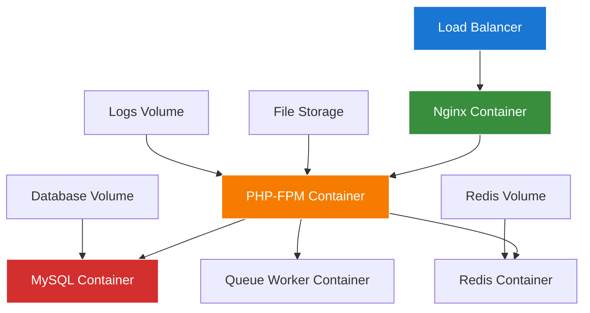

# Filament Docker Deployment Guide

## Overview

This guide covers comprehensive Docker deployment strategies for the Chinook Filament admin panel, including containerization, orchestration, scaling, and production-ready configurations.

## Table of Contents

- [Overview](#overview)
- [Docker Architecture](#docker-architecture)
- [Dockerfile Configuration](#dockerfile-configuration)
- [Docker Compose Setup](#docker-compose-setup)
- [Multi-Stage Builds](#multi-stage-builds)
- [Production Configuration](#production-configuration)
- [Kubernetes Deployment](#kubernetes-deployment)
- [Container Orchestration](#container-orchestration)
- [Monitoring & Logging](#monitoring--logging)
- [Security Considerations](#security-considerations)
- [Troubleshooting](#troubleshooting)

## Docker Architecture

### Container Architecture Overview



### Service Components

| Service | Purpose | Replicas | Resources |
|---------|---------|----------|-----------|
| nginx | Web server & reverse proxy | 2-3 | 256MB RAM |
| php-fpm | Application server | 3-5 | 512MB RAM |
| mysql | Database server | 1 | 2GB RAM |
| redis | Cache & sessions | 1 | 256MB RAM |
| queue-worker | Background jobs | 2-3 | 256MB RAM |
| scheduler | Cron jobs | 1 | 128MB RAM |

## Dockerfile Configuration

### Multi-Stage PHP Dockerfile

```dockerfile
# Dockerfile
FROM php:8.3-fpm-alpine AS base

# Install system dependencies
RUN apk add --no-cache \
    git \
    curl \
    libpng-dev \
    libxml2-dev \
    zip \
    unzip \
    oniguruma-dev \
    icu-dev \
    freetype-dev \
    libjpeg-turbo-dev \
    libzip-dev \
    mysql-client \
    supervisor \
    nginx

# Install PHP extensions
RUN docker-php-ext-configure gd --with-freetype --with-jpeg \
    && docker-php-ext-install \
        pdo_mysql \
        mbstring \
        exif \
        pcntl \
        bcmath \
        gd \
        zip \
        intl \
        opcache

# Install Redis extension
RUN pecl install redis && docker-php-ext-enable redis

# Install Composer
COPY --from=composer:latest /usr/bin/composer /usr/bin/composer

# Create application user
RUN addgroup -g 1000 -S www && \
    adduser -u 1000 -S www -G www

# Set working directory
WORKDIR /var/www/html

# Copy composer files
COPY composer.json composer.lock ./

# Install PHP dependencies
RUN composer install --no-dev --no-scripts --no-autoloader --prefer-dist

# Development stage
FROM base AS development

# Install development dependencies
RUN composer install --prefer-dist

# Copy application code
COPY . .

# Set permissions
RUN chown -R www:www /var/www/html \
    && chmod -R 755 /var/www/html/storage

# Generate autoloader
RUN composer dump-autoload --optimize

EXPOSE 9000

CMD ["php-fpm"]

# Production stage
FROM base AS production

# Copy application code
COPY . .

# Install production dependencies
RUN composer install --no-dev --optimize-autoloader --no-interaction

# Build frontend assets
FROM node:20-alpine AS assets

WORKDIR /app

COPY package*.json ./
RUN npm ci

COPY . .
RUN npm run build

# Final production image
FROM base AS final

# Copy application code
COPY --from=production /var/www/html /var/www/html

# Copy built assets
COPY --from=assets /app/public/build /var/www/html/public/build

# Copy configuration files
COPY docker/php/php.ini /usr/local/etc/php/conf.d/99-custom.ini
COPY docker/php/opcache.ini /usr/local/etc/php/conf.d/opcache.ini
COPY docker/nginx/nginx.conf /etc/nginx/nginx.conf
COPY docker/nginx/default.conf /etc/nginx/conf.d/default.conf
COPY docker/supervisor/supervisord.conf /etc/supervisor/conf.d/supervisord.conf

# Set permissions
RUN chown -R www:www /var/www/html \
    && chmod -R 755 /var/www/html/storage \
    && chmod -R 755 /var/www/html/bootstrap/cache

# Create required directories
RUN mkdir -p /var/log/supervisor \
    && mkdir -p /var/run/nginx \
    && mkdir -p /var/cache/nginx

EXPOSE 80

CMD ["/usr/bin/supervisord", "-c", "/etc/supervisor/conf.d/supervisord.conf"]
```

### Nginx Configuration

```nginx
# docker/nginx/nginx.conf
user www;
worker_processes auto;
error_log /var/log/nginx/error.log warn;
pid /var/run/nginx.pid;

events {
    worker_connections 1024;
    use epoll;
    multi_accept on;
}

http {
    include /etc/nginx/mime.types;
    default_type application/octet-stream;

    log_format main '$remote_addr - $remote_user [$time_local] "$request" '
                    '$status $body_bytes_sent "$http_referer" '
                    '"$http_user_agent" "$http_x_forwarded_for"';

    access_log /var/log/nginx/access.log main;

    sendfile on;
    tcp_nopush on;
    tcp_nodelay on;
    keepalive_timeout 65;
    types_hash_max_size 2048;
    client_max_body_size 100M;

    gzip on;
    gzip_vary on;
    gzip_proxied any;
    gzip_comp_level 6;
    gzip_types
        text/plain
        text/css
        text/xml
        text/javascript
        application/json
        application/javascript
        application/xml+rss
        application/atom+xml
        image/svg+xml;

    include /etc/nginx/conf.d/*.conf;
}
```

```nginx
# docker/nginx/default.conf
server {
    listen 80;
    server_name _;
    root /var/www/html/public;
    index index.php index.html;

    # Security headers
    add_header X-Frame-Options "SAMEORIGIN" always;
    add_header X-Content-Type-Options "nosniff" always;
    add_header X-XSS-Protection "1; mode=block" always;
    add_header Referrer-Policy "strict-origin-when-cross-origin" always;
    add_header Content-Security-Policy "default-src 'self'; script-src 'self' 'unsafe-inline' 'unsafe-eval'; style-src 'self' 'unsafe-inline'; img-src 'self' data: https:; font-src 'self' data:; connect-src 'self'; frame-ancestors 'self';" always;

    # Gzip compression
    gzip on;
    gzip_vary on;
    gzip_min_length 1024;
    gzip_types text/plain text/css text/xml text/javascript application/javascript application/xml+rss application/json;

    # Cache static assets
    location ~* \.(jpg|jpeg|png|gif|ico|css|js|woff|woff2|ttf|svg)$ {
        expires 1y;
        add_header Cache-Control "public, immutable";
        access_log off;
    }

    # Handle Laravel routes
    location / {
        try_files $uri $uri/ /index.php?$query_string;
    }

    # PHP-FPM configuration
    location ~ \.php$ {
        fastcgi_pass 127.0.0.1:9000;
        fastcgi_index index.php;
        fastcgi_param SCRIPT_FILENAME $realpath_root$fastcgi_script_name;
        include fastcgi_params;

        # Security
        fastcgi_hide_header X-Powered-By;

        # Timeouts
        fastcgi_connect_timeout 60s;
        fastcgi_send_timeout 60s;
        fastcgi_read_timeout 60s;

        # Buffer sizes
        fastcgi_buffer_size 128k;
        fastcgi_buffers 4 256k;
        fastcgi_busy_buffers_size 256k;
    }

    # Deny access to sensitive files
    location ~ /\. {
        deny all;
        access_log off;
        log_not_found off;
    }

    location ~ /(vendor|storage|bootstrap|config|database|resources|routes|tests)/ {
        deny all;
        access_log off;
        log_not_found off;
    }

    # Health check endpoint
    location /health {
        access_log off;
        return 200 "healthy\n";
        add_header Content-Type text/plain;
    }
}
```

### PHP Configuration

```ini
; docker/php/php.ini
[PHP]
engine = On
short_open_tag = Off
precision = 14
output_buffering = 4096
zlib.output_compression = Off
implicit_flush = Off
unserialize_callback_func =
serialize_precision = -1
disable_functions =
disable_classes =
zend.enable_gc = On
zend.exception_ignore_args = On

expose_php = Off
max_execution_time = 60
max_input_time = 60
memory_limit = 256M
error_reporting = E_ALL & ~E_DEPRECATED & ~E_STRICT
display_errors = Off
display_startup_errors = Off
log_errors = On
log_errors_max_len = 1024
ignore_repeated_errors = Off
ignore_repeated_source = Off
report_memleaks = On

post_max_size = 100M
upload_max_filesize = 100M
max_file_uploads = 20

date.timezone = UTC

[Session]
session.save_handler = redis
session.save_path = "tcp://redis:6379"
session.use_strict_mode = 1
session.use_cookies = 1
session.use_only_cookies = 1
session.name = PHPSESSID
session.auto_start = 0
session.cookie_lifetime = 0
session.cookie_path = /
session.cookie_domain =
session.cookie_httponly = 1
session.cookie_secure = 1
session.cookie_samesite = Lax
```

```ini
; docker/php/opcache.ini
[opcache]
opcache.enable = 1
opcache.enable_cli = 1
opcache.memory_consumption = 128
opcache.interned_strings_buffer = 8
opcache.max_accelerated_files = 4000
opcache.revalidate_freq = 2
opcache.fast_shutdown = 1
opcache.validate_timestamps = 0
opcache.save_comments = 1
opcache.preload = /var/www/html/config/opcache.php
opcache.preload_user = www
```

### Supervisor Configuration

```ini
; docker/supervisor/supervisord.conf
[supervisord]
nodaemon=true
user=root
logfile=/var/log/supervisor/supervisord.log
pidfile=/var/run/supervisord.pid

[program:nginx]
command=nginx -g "daemon off;"
autostart=true
autorestart=true
stderr_logfile=/var/log/supervisor/nginx.err.log
stdout_logfile=/var/log/supervisor/nginx.out.log

[program:php-fpm]
command=php-fpm -F
autostart=true
autorestart=true
stderr_logfile=/var/log/supervisor/php-fpm.err.log
stdout_logfile=/var/log/supervisor/php-fpm.out.log

[program:laravel-worker]
process_name=%(program_name)s_%(process_num)02d
command=php /var/www/html/artisan queue:work redis --sleep=3 --tries=3 --max-time=3600
autostart=true
autorestart=true
stopasgroup=true
killasgroup=true
user=www
numprocs=2
redirect_stderr=true
stdout_logfile=/var/log/supervisor/worker.log
stopwaitsecs=3600

[program:laravel-scheduler]
command=php /var/www/html/artisan schedule:work
autostart=true
autorestart=true
user=www
redirect_stderr=true
stdout_logfile=/var/log/supervisor/scheduler.log
```

## Docker Compose Setup

### Development Environment

```yaml
# docker-compose.yml
version: '3.8'

services:
  app:
    build:
      context: .
      target: development
    container_name: chinook-app
    restart: unless-stopped
    working_dir: /var/www/html
    volumes:
      - ./:/var/www/html
      - ./docker/php/php.ini:/usr/local/etc/php/conf.d/99-custom.ini
    networks:
      - chinook
    depends_on:
      - mysql
      - redis

  nginx:
    image: nginx:alpine
    container_name: chinook-nginx
    restart: unless-stopped
    ports:
      - "80:80"
      - "443:443"
    volumes:
      - ./:/var/www/html
      - ./docker/nginx/nginx.conf:/etc/nginx/nginx.conf
      - ./docker/nginx/default.conf:/etc/nginx/conf.d/default.conf
      - ./docker/ssl:/etc/nginx/ssl
    networks:
      - chinook
    depends_on:
      - app

  mysql:
    image: mysql:8.0
    container_name: chinook-mysql
    restart: unless-stopped
    environment:
      MYSQL_DATABASE: chinook
      MYSQL_ROOT_PASSWORD: password
      MYSQL_USER: chinook
      MYSQL_PASSWORD: password
    volumes:
      - mysql_data:/var/lib/mysql
      - ./docker/mysql/my.cnf:/etc/mysql/conf.d/my.cnf
    ports:
      - "3306:3306"
    networks:
      - chinook

  redis:
    image: redis:7-alpine
    container_name: chinook-redis
    restart: unless-stopped
    command: redis-server --appendonly yes --requirepass password
    volumes:
      - redis_data:/data
    ports:
      - "6379:6379"
    networks:
      - chinook

  mailhog:
    image: mailhog/mailhog
    container_name: chinook-mailhog
    restart: unless-stopped
    ports:
      - "1025:1025"
      - "8025:8025"
    networks:
      - chinook

volumes:
  mysql_data:
  redis_data:

networks:
  chinook:
    driver: bridge
```

### Production Environment

```yaml
# docker-compose.prod.yml
version: '3.8'

services:
  app:
    build:
      context: .
      target: final
    container_name: chinook-app
    restart: unless-stopped
    environment:
      - APP_ENV=production
      - APP_DEBUG=false
    volumes:
      - storage_data:/var/www/html/storage/app
      - logs_data:/var/www/html/storage/logs
    networks:
      - chinook
    depends_on:
      - mysql
      - redis
    deploy:
      replicas: 3
      resources:
        limits:
          memory: 512M
        reservations:
          memory: 256M

  nginx:
    image: nginx:alpine
    container_name: chinook-nginx
    restart: unless-stopped
    ports:
      - "80:80"
      - "443:443"
    volumes:
      - ./docker/nginx/nginx.conf:/etc/nginx/nginx.conf
      - ./docker/nginx/default.conf:/etc/nginx/conf.d/default.conf
      - ./docker/ssl:/etc/nginx/ssl
      - logs_data:/var/log/nginx
    networks:
      - chinook
    depends_on:
      - app
    deploy:
      replicas: 2
      resources:
        limits:
          memory: 256M
        reservations:
          memory: 128M

  mysql:
    image: mysql:8.0
    container_name: chinook-mysql
    restart: unless-stopped
    environment:
      MYSQL_DATABASE: ${DB_DATABASE}
      MYSQL_ROOT_PASSWORD: ${DB_ROOT_PASSWORD}
      MYSQL_USER: ${DB_USERNAME}
      MYSQL_PASSWORD: ${DB_PASSWORD}
    volumes:
      - mysql_data:/var/lib/mysql
      - ./docker/mysql/my.cnf:/etc/mysql/conf.d/my.cnf
      - ./backups:/backups
    networks:
      - chinook
    deploy:
      resources:
        limits:
          memory: 2G
        reservations:
          memory: 1G

  redis:
    image: redis:7-alpine
    container_name: chinook-redis
    restart: unless-stopped
    command: redis-server --appendonly yes --requirepass ${REDIS_PASSWORD}
    volumes:
      - redis_data:/data
    networks:
      - chinook
    deploy:
      resources:
        limits:
          memory: 256M
        reservations:
          memory: 128M

  queue-worker:
    build:
      context: .
      target: final
    container_name: chinook-queue
    restart: unless-stopped
    command: php artisan queue:work redis --sleep=3 --tries=3 --max-time=3600
    environment:
      - APP_ENV=production
    volumes:
      - storage_data:/var/www/html/storage/app
      - logs_data:/var/www/html/storage/logs
    networks:
      - chinook
    depends_on:
      - mysql
      - redis
    deploy:
      replicas: 2
      resources:
        limits:
          memory: 256M
        reservations:
          memory: 128M

  scheduler:
    build:
      context: .
      target: final
    container_name: chinook-scheduler
    restart: unless-stopped
    command: php artisan schedule:work
    environment:
      - APP_ENV=production
    volumes:
      - storage_data:/var/www/html/storage/app
      - logs_data:/var/www/html/storage/logs
    networks:
      - chinook
    depends_on:
      - mysql
      - redis
    deploy:
      resources:
        limits:
          memory: 128M
        reservations:
          memory: 64M

volumes:
  mysql_data:
  redis_data:
  storage_data:
  logs_data:

networks:
  chinook:
    driver: bridge
```

## Multi-Stage Builds

### Optimized Multi-Stage Dockerfile

Create efficient Docker images using multi-stage builds:

```dockerfile
# Build stage
FROM node:18-alpine AS node-builder
WORKDIR /app
COPY package*.json ./
RUN npm ci --only=production

COPY resources/js ./resources/js
COPY resources/css ./resources/css
COPY vite.config.js ./
RUN npm run build

# PHP dependencies stage
FROM composer:2 AS composer-builder
WORKDIR /app
COPY composer.json composer.lock ./
RUN composer install --no-dev --optimize-autoloader --no-scripts

# Production stage
FROM php:8.2-fpm-alpine AS production

# Install system dependencies
RUN apk add --no-cache \
    nginx \
    supervisor \
    mysql-client \
    redis \
    && docker-php-ext-install pdo_mysql

# Copy application files
WORKDIR /var/www/html
COPY --from=composer-builder /app/vendor ./vendor
COPY --from=node-builder /app/public/build ./public/build
COPY . .

# Set permissions
RUN chown -R www-data:www-data /var/www/html \
    && chmod -R 755 /var/www/html/storage

EXPOSE 80
CMD ["supervisord", "-c", "/etc/supervisor/conf.d/supervisord.conf"]
```

### Build Optimization Strategies

Optimize Docker builds for faster deployment:

```bash
# Use BuildKit for improved performance
export DOCKER_BUILDKIT=1

# Build with cache optimization
docker build \
  --cache-from chinook:latest \
  --tag chinook:$(git rev-parse --short HEAD) \
  --tag chinook:latest \
  .

# Multi-platform builds
docker buildx build \
  --platform linux/amd64,linux/arm64 \
  --tag chinook:latest \
  --push \
  .
```

## Production Configuration

### Production Environment Setup

Configure Docker for production deployment:

```yaml
# docker-compose.prod.yml
version: '3.8'

services:
  app:
    image: chinook:latest
    environment:
      - APP_ENV=production
      - APP_DEBUG=false
      - LOG_LEVEL=warning
    deploy:
      replicas: 3
      resources:
        limits:
          memory: 512M
          cpus: '0.5'
        reservations:
          memory: 256M
          cpus: '0.25'
      restart_policy:
        condition: on-failure
        delay: 5s
        max_attempts: 3
    healthcheck:
      test: ["CMD", "curl", "-f", "http://localhost/health"]
      interval: 30s
      timeout: 10s
      retries: 3
      start_period: 40s
```

### Environment Configuration

Secure environment variable management:

```bash
# Use Docker secrets for sensitive data
echo "db_password_here" | docker secret create db_password -
echo "app_key_here" | docker secret create app_key -

# Reference secrets in compose file
services:
  app:
    secrets:
      - db_password
      - app_key
    environment:
      - DB_PASSWORD_FILE=/run/secrets/db_password
      - APP_KEY_FILE=/run/secrets/app_key
```

## Kubernetes Deployment

### Kubernetes Manifests

Deploy to Kubernetes with comprehensive manifests:

```yaml
# deployment.yaml
apiVersion: apps/v1
kind: Deployment
metadata:
  name: chinook-app
  labels:
    app: chinook
spec:
  replicas: 3
  selector:
    matchLabels:
      app: chinook
  template:
    metadata:
      labels:
        app: chinook
    spec:
      containers:
      - name: chinook
        image: chinook:latest
        ports:
        - containerPort: 80
        env:
        - name: APP_ENV
          value: "production"
        - name: DB_HOST
          value: "mysql-service"
        resources:
          requests:
            memory: "256Mi"
            cpu: "250m"
          limits:
            memory: "512Mi"
            cpu: "500m"
        livenessProbe:
          httpGet:
            path: /health
            port: 80
          initialDelaySeconds: 30
          periodSeconds: 10
        readinessProbe:
          httpGet:
            path: /ready
            port: 80
          initialDelaySeconds: 5
          periodSeconds: 5
```

### Service and Ingress Configuration

```yaml
# service.yaml
apiVersion: v1
kind: Service
metadata:
  name: chinook-service
spec:
  selector:
    app: chinook
  ports:
  - port: 80
    targetPort: 80
  type: ClusterIP

---
# ingress.yaml
apiVersion: networking.k8s.io/v1
kind: Ingress
metadata:
  name: chinook-ingress
  annotations:
    kubernetes.io/ingress.class: nginx
    cert-manager.io/cluster-issuer: letsencrypt-prod
spec:
  tls:
  - hosts:
    - chinook.example.com
    secretName: chinook-tls
  rules:
  - host: chinook.example.com
    http:
      paths:
      - path: /
        pathType: Prefix
        backend:
          service:
            name: chinook-service
            port:
              number: 80
```

## Container Orchestration

### Docker Swarm Configuration

Set up Docker Swarm for container orchestration:

```bash
# Initialize swarm
docker swarm init

# Deploy stack
docker stack deploy -c docker-compose.prod.yml chinook

# Scale services
docker service scale chinook_app=5

# Update services with zero downtime
docker service update --image chinook:v2.0 chinook_app
```

### Health Checks and Service Discovery

Implement comprehensive health monitoring:

```php
<?php

// routes/web.php
Route::get('/health', function () {
    $checks = [
        'database' => DB::connection()->getPdo() !== null,
        'cache' => Cache::store('redis')->get('health_check') !== null,
        'storage' => Storage::disk('local')->exists('health_check.txt'),
    ];

    $healthy = array_reduce($checks, fn($carry, $check) => $carry && $check, true);

    return response()->json([
        'status' => $healthy ? 'healthy' : 'unhealthy',
        'checks' => $checks,
        'timestamp' => now()->toISOString(),
    ], $healthy ? 200 : 503);
});
```

## Monitoring & Logging

### Container Monitoring Setup

Implement comprehensive container monitoring:

```yaml
# monitoring.yml
version: '3.8'

services:
  prometheus:
    image: prom/prometheus:latest
    ports:
      - "9090:9090"
    volumes:
      - ./prometheus.yml:/etc/prometheus/prometheus.yml
    command:
      - '--config.file=/etc/prometheus/prometheus.yml'
      - '--storage.tsdb.path=/prometheus'
      - '--web.console.libraries=/etc/prometheus/console_libraries'
      - '--web.console.templates=/etc/prometheus/consoles'

  grafana:
    image: grafana/grafana:latest
    ports:
      - "3000:3000"
    environment:
      - GF_SECURITY_ADMIN_PASSWORD=admin
    volumes:
      - grafana_data:/var/lib/grafana

  node-exporter:
    image: prom/node-exporter:latest
    ports:
      - "9100:9100"
```

### Centralized Logging

Set up centralized logging with ELK stack:

```yaml
# logging.yml
version: '3.8'

services:
  elasticsearch:
    image: docker.elastic.co/elasticsearch/elasticsearch:8.5.0
    environment:
      - discovery.type=single-node
      - "ES_JAVA_OPTS=-Xms512m -Xmx512m"
    ports:
      - "9200:9200"

  logstash:
    image: docker.elastic.co/logstash/logstash:8.5.0
    volumes:
      - ./logstash.conf:/usr/share/logstash/pipeline/logstash.conf
    ports:
      - "5044:5044"

  kibana:
    image: docker.elastic.co/kibana/kibana:8.5.0
    ports:
      - "5601:5601"
    environment:
      - ELASTICSEARCH_HOSTS=http://elasticsearch:9200
```

## Security Considerations

### Container Security Best Practices

Implement security hardening for containers:

```dockerfile
# Security-hardened Dockerfile
FROM php:8.2-fpm-alpine

# Create non-root user
RUN addgroup -g 1001 -S appuser && \
    adduser -u 1001 -S appuser -G appuser

# Install security updates
RUN apk update && apk upgrade

# Remove unnecessary packages
RUN apk del --purge wget curl

# Set secure file permissions
COPY --chown=appuser:appuser . /var/www/html
RUN chmod -R 755 /var/www/html && \
    chmod -R 644 /var/www/html/storage

# Switch to non-root user
USER appuser

# Health check
HEALTHCHECK --interval=30s --timeout=3s --start-period=5s --retries=3 \
  CMD php artisan health:check || exit 1
```

### Network Security

Configure secure networking:

```yaml
# Secure network configuration
networks:
  frontend:
    driver: bridge
    ipam:
      config:
        - subnet: 172.20.0.0/16
  backend:
    driver: bridge
    internal: true
    ipam:
      config:
        - subnet: 172.21.0.0/16

services:
  nginx:
    networks:
      - frontend
  app:
    networks:
      - frontend
      - backend
  mysql:
    networks:
      - backend
```

## Troubleshooting

### Common Docker Issues

#### Container Startup Problems
```bash
# Check container logs
docker logs chinook_app_1

# Inspect container configuration
docker inspect chinook_app_1

# Debug container interactively
docker exec -it chinook_app_1 /bin/sh
```

#### Performance Issues
```bash
# Monitor container resources
docker stats

# Check container processes
docker exec chinook_app_1 ps aux

# Analyze container performance
docker exec chinook_app_1 top
```

#### Network Connectivity
```bash
# Test network connectivity
docker exec chinook_app_1 ping mysql

# Check network configuration
docker network ls
docker network inspect chinook_default
```

### Debugging Tools

```bash
# Container debugging toolkit
docker run --rm -it \
  --network container:chinook_app_1 \
  nicolaka/netshoot

# Performance profiling
docker run --rm -it \
  --pid container:chinook_app_1 \
  --cap-add SYS_PTRACE \
  brendangregg/perf-tools
```
