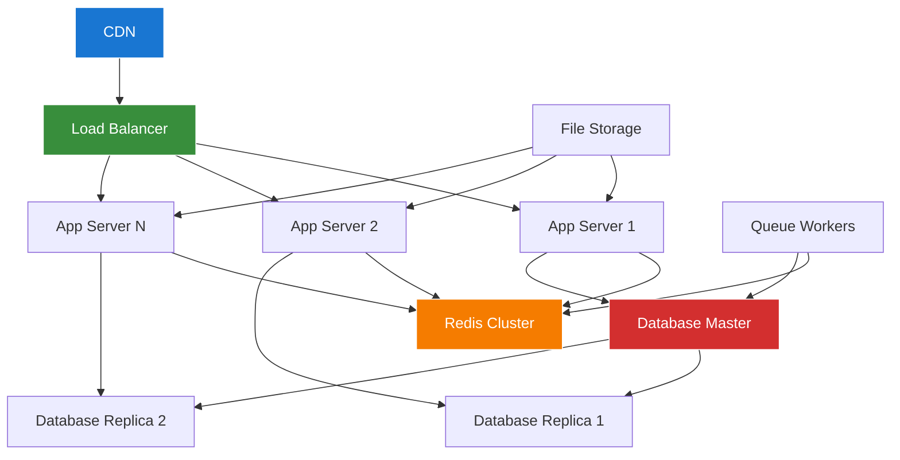

# Filament Scaling Strategies Guide

## Overview

This guide covers comprehensive scaling strategies for the Chinook Filament admin panel, including horizontal and vertical scaling, load balancing, database optimization, caching strategies, and performance monitoring.

## Table of Contents

- [Overview](#overview)
- [Scaling Architecture](#scaling-architecture)
- [Horizontal Scaling](#horizontal-scaling)
- [Vertical Scaling](#vertical-scaling)
- [Load Balancing](#load-balancing)
- [Database Scaling](#database-scaling)
- [Caching Strategies](#caching-strategies)
- [Queue Scaling](#queue-scaling)
- [CDN Integration](#cdn-integration)
- [Performance Monitoring](#performance-monitoring)
- [Auto-Scaling](#auto-scaling)
- [Troubleshooting](#troubleshooting)

## Scaling Architecture

### Scalable Architecture Overview



### Scaling Tiers

| Tier | Users | App Servers | DB Config | Cache | Queue Workers |
|------|-------|-------------|-----------|-------|---------------|
| Small | <1K | 1-2 | Single MySQL | Redis | 1-2 |
| Medium | 1K-10K | 3-5 | Master + 1 Replica | Redis Cluster | 3-5 |
| Large | 10K-100K | 5-10 | Master + 2 Replicas | Redis Cluster | 5-10 |
| Enterprise | >100K | 10+ | Sharded/Clustered | Redis Cluster | 10+ |

## Horizontal Scaling

### Application Server Scaling

```yaml
# docker-compose.scale.yml
version: '3.8'

services:
  app:
    build:
      context: .
      target: production
    deploy:
      replicas: 5
      resources:
        limits:
          memory: 512M
          cpus: '0.5'
        reservations:
          memory: 256M
          cpus: '0.25'
      restart_policy:
        condition: on-failure
        delay: 5s
        max_attempts: 3
    environment:
      - APP_ENV=production
      - DB_READ_HOST=mysql-replica
      - DB_WRITE_HOST=mysql-master
    networks:
      - chinook

  nginx:
    image: nginx:alpine
    deploy:
      replicas: 3
      resources:
        limits:
          memory: 256M
          cpus: '0.25'
    volumes:
      - ./docker/nginx/nginx.conf:/etc/nginx/nginx.conf
      - ./docker/nginx/upstream.conf:/etc/nginx/conf.d/upstream.conf
    ports:
      - "80:80"
      - "443:443"
    networks:
      - chinook

networks:
  chinook:
    driver: overlay
    attachable: true
```

### Kubernetes Deployment

```yaml
# k8s/deployment.yml
apiVersion: apps/v1
kind: Deployment
metadata:
  name: chinook-app
  labels:
    app: chinook
spec:
  replicas: 5
  selector:
    matchLabels:
      app: chinook
  template:
    metadata:
      labels:
        app: chinook
    spec:
      containers:
      - name: chinook
        image: chinook:latest
        ports:
        - containerPort: 80
        env:
        - name: APP_ENV
          value: "production"
        - name: DB_HOST
          valueFrom:
            secretKeyRef:
              name: chinook-secrets
              key: db-host
        - name: DB_PASSWORD
          valueFrom:
            secretKeyRef:
              name: chinook-secrets
              key: db-password
        resources:
          requests:
            memory: "256Mi"
            cpu: "250m"
          limits:
            memory: "512Mi"
            cpu: "500m"
        livenessProbe:
          httpGet:
            path: /health
            port: 80
          initialDelaySeconds: 30
          periodSeconds: 10
        readinessProbe:
          httpGet:
            path: /health
            port: 80
          initialDelaySeconds: 5
          periodSeconds: 5

---
apiVersion: v1
kind: Service
metadata:
  name: chinook-service
spec:
  selector:
    app: chinook
  ports:
  - protocol: TCP
    port: 80
    targetPort: 80
  type: LoadBalancer

---
apiVersion: autoscaling/v2
kind: HorizontalPodAutoscaler
metadata:
  name: chinook-hpa
spec:
  scaleTargetRef:
    apiVersion: apps/v1
    kind: Deployment
    name: chinook-app
  minReplicas: 3
  maxReplicas: 20
  metrics:
  - type: Resource
    resource:
      name: cpu
      target:
        type: Utilization
        averageUtilization: 70
  - type: Resource
    resource:
      name: memory
      target:
        type: Utilization
        averageUtilization: 80
```

### Container Orchestration

```bash
#!/bin/bash
# scripts/scale-containers.sh

set -euo pipefail

SCALE_TYPE="${1:-up}"
REPLICAS="${2:-3}"

case "$SCALE_TYPE" in
    "up")
        echo "Scaling up to $REPLICAS replicas..."
        docker-compose -f docker-compose.prod.yml up -d --scale app=$REPLICAS
        ;;
    "down")
        echo "Scaling down to $REPLICAS replicas..."
        docker-compose -f docker-compose.prod.yml up -d --scale app=$REPLICAS
        ;;
    "auto")
        echo "Enabling auto-scaling..."
        # Monitor CPU and memory usage
        while true; do
            CPU_USAGE=$(docker stats --no-stream --format "table {{.CPUPerc}}" | tail -n +2 | sed 's/%//' | awk '{sum+=$1} END {print sum/NR}')
            MEMORY_USAGE=$(docker stats --no-stream --format "table {{.MemPerc}}" | tail -n +2 | sed 's/%//' | awk '{sum+=$1} END {print sum/NR}')

            if (( $(echo "$CPU_USAGE > 80" | bc -l) )) || (( $(echo "$MEMORY_USAGE > 80" | bc -l) )); then
                CURRENT_REPLICAS=$(docker-compose -f docker-compose.prod.yml ps -q app | wc -l)
                NEW_REPLICAS=$((CURRENT_REPLICAS + 1))

                if [ $NEW_REPLICAS -le 10 ]; then
                    echo "High resource usage detected. Scaling up to $NEW_REPLICAS replicas..."
                    docker-compose -f docker-compose.prod.yml up -d --scale app=$NEW_REPLICAS
                fi
            elif (( $(echo "$CPU_USAGE < 30" | bc -l) )) && (( $(echo "$MEMORY_USAGE < 30" | bc -l) )); then
                CURRENT_REPLICAS=$(docker-compose -f docker-compose.prod.yml ps -q app | wc -l)
                NEW_REPLICAS=$((CURRENT_REPLICAS - 1))

                if [ $NEW_REPLICAS -ge 2 ]; then
                    echo "Low resource usage detected. Scaling down to $NEW_REPLICAS replicas..."
                    docker-compose -f docker-compose.prod.yml up -d --scale app=$NEW_REPLICAS
                fi
            fi

            sleep 60
        done
        ;;
    *)
        echo "Usage: $0 {up|down|auto} [replicas]"
        exit 1
        ;;
esac

echo "Scaling operation completed"
```

## Vertical Scaling

### Resource Optimization

```php
<?php
// config/scaling.php

return [
    'resources' => [
        'small' => [
            'memory_limit' => '256M',
            'max_execution_time' => 30,
            'opcache_memory' => 64,
            'upload_max_filesize' => '10M',
        ],

        'medium' => [
            'memory_limit' => '512M',
            'max_execution_time' => 60,
            'opcache_memory' => 128,
            'upload_max_filesize' => '50M',
        ],

        'large' => [
            'memory_limit' => '1G',
            'max_execution_time' => 120,
            'opcache_memory' => 256,
            'upload_max_filesize' => '100M',
        ],

        'enterprise' => [
            'memory_limit' => '2G',
            'max_execution_time' => 300,
            'opcache_memory' => 512,
            'upload_max_filesize' => '500M',
        ],
    ],

    'database' => [
        'small' => [
            'max_connections' => 100,
            'innodb_buffer_pool_size' => '256M',
            'query_cache_size' => '64M',
        ],

        'medium' => [
            'max_connections' => 200,
            'innodb_buffer_pool_size' => '512M',
            'query_cache_size' => '128M',
        ],

        'large' => [
            'max_connections' => 500,
            'innodb_buffer_pool_size' => '1G',
            'query_cache_size' => '256M',
        ],

        'enterprise' => [
            'max_connections' => 1000,
            'innodb_buffer_pool_size' => '4G',
            'query_cache_size' => '512M',
        ],
    ],
];
```

### Dynamic Resource Allocation

```php
<?php
// app/Services/ResourceScalingService.php

namespace App\Services;

use Illuminate\Support\Facades\{Cache, Log};

class ResourceScalingService
{
    private array $config;

    public function __construct()
    {
        $this->config = config('scaling');
    }

    public function optimizeForLoad(int $concurrentUsers): void
    {
        $tier = $this->determineTier($concurrentUsers);
        $resources = $this->config['resources'][$tier];

        $this->adjustPhpSettings($resources);
        $this->adjustDatabaseSettings($tier);
        $this->adjustCacheSettings($tier);

        Log::info('Resources optimized for load', [
            'concurrent_users' => $concurrentUsers,
            'tier' => $tier,
            'resources' => $resources
        ]);
    }

    private function determineTier(int $users): string
    {
        return match (true) {
            $users < 100 => 'small',
            $users < 1000 => 'medium',
            $users < 10000 => 'large',
            default => 'enterprise',
        };
    }

    private function adjustPhpSettings(array $resources): void
    {
        ini_set('memory_limit', $resources['memory_limit']);
        ini_set('max_execution_time', $resources['max_execution_time']);
        ini_set('upload_max_filesize', $resources['upload_max_filesize']);
        ini_set('post_max_size', $resources['upload_max_filesize']);
    }

    private function adjustDatabaseSettings(string $tier): void
    {
        $dbConfig = $this->config['database'][$tier];

        // These would typically be applied at the database server level
        Cache::put('db_optimization_tier', $tier, 3600);
        Cache::put('db_max_connections', $dbConfig['max_connections'], 3600);
    }

    private function adjustCacheSettings(string $tier): void
    {
        $cacheSize = match ($tier) {
            'small' => 64,
            'medium' => 128,
            'large' => 256,
            'enterprise' => 512,
        };

        Cache::put('cache_size_mb', $cacheSize, 3600);
    }
}
```

## Load Balancing

### Nginx Load Balancer Configuration

```nginx
# docker/nginx/upstream.conf
upstream chinook_backend {
    least_conn;

    server app1:80 max_fails=3 fail_timeout=30s;
    server app2:80 max_fails=3 fail_timeout=30s;
    server app3:80 max_fails=3 fail_timeout=30s;
    server app4:80 max_fails=3 fail_timeout=30s backup;
    server app5:80 max_fails=3 fail_timeout=30s backup;

    keepalive 32;
}

server {
    listen 80;
    server_name chinook.local;

    # Health check endpoint
    location /health {
        access_log off;
        return 200 "healthy\n";
        add_header Content-Type text/plain;
    }

    # Load balancer status
    location /nginx_status {
        stub_status on;
        access_log off;
        allow 127.0.0.1;
        allow 10.0.0.0/8;
        deny all;
    }

    # Main application
    location / {
        proxy_pass http://chinook_backend;
        proxy_set_header Host $host;
        proxy_set_header X-Real-IP $remote_addr;
        proxy_set_header X-Forwarded-For $proxy_add_x_forwarded_for;
        proxy_set_header X-Forwarded-Proto $scheme;

        # Connection settings
        proxy_connect_timeout 5s;
        proxy_send_timeout 60s;
        proxy_read_timeout 60s;

        # Buffer settings
        proxy_buffering on;
        proxy_buffer_size 128k;
        proxy_buffers 4 256k;
        proxy_busy_buffers_size 256k;

        # Keep-alive
        proxy_http_version 1.1;
        proxy_set_header Connection "";
    }

    # Static files (bypass load balancer)
    location ~* \.(css|js|png|jpg|jpeg|gif|ico|svg|woff|woff2|ttf)$ {
        expires 1y;
        add_header Cache-Control "public, immutable";
        access_log off;

        # Try local files first, then proxy
        try_files $uri @backend;
    }

    location @backend {
        proxy_pass http://chinook_backend;
    }
}
```

### HAProxy Configuration

```
# haproxy.cfg
global
    daemon
    maxconn 4096
    log stdout local0

defaults
    mode http
    timeout connect 5000ms
    timeout client 50000ms
    timeout server 50000ms
    option httplog
    option dontlognull
    option redispatch
    retries 3

frontend chinook_frontend
    bind *:80
    bind *:443 ssl crt /etc/ssl/certs/chinook.pem
    redirect scheme https if !{ ssl_fc }

    # Health check
    acl health_check path_beg /health
    use_backend health_backend if health_check

    # API requests
    acl api_request path_beg /api
    use_backend api_backend if api_request

    # Admin panel
    acl admin_request path_beg /admin
    use_backend admin_backend if admin_request

    default_backend web_backend

backend health_backend
    option httpchk GET /health
    server health1 127.0.0.1:8080 check

backend web_backend
    balance roundrobin
    option httpchk GET /health

    server web1 app1:80 check maxconn 100
    server web2 app2:80 check maxconn 100
    server web3 app3:80 check maxconn 100
    server web4 app4:80 check maxconn 100 backup
    server web5 app5:80 check maxconn 100 backup

backend api_backend
    balance leastconn
    option httpchk GET /api/health

    server api1 app1:80 check maxconn 50
    server api2 app2:80 check maxconn 50
    server api3 app3:80 check maxconn 50

backend admin_backend
    balance source
    option httpchk GET /admin/health

    server admin1 app1:80 check maxconn 25
    server admin2 app2:80 check maxconn 25

listen stats
    bind *:8404
    stats enable
    stats uri /stats
    stats refresh 30s
    stats admin if TRUE
```

## Database Scaling

### Master-Slave Replication

```php
<?php
// config/database.php

return [
    'default' => env('DB_CONNECTION', 'mysql'),

    'connections' => [
        'mysql' => [
            'read' => [
                'host' => [
                    env('DB_READ_HOST_1', '127.0.0.1'),
                    env('DB_READ_HOST_2', '127.0.0.1'),
                ],
            ],
            'write' => [
                'host' => env('DB_WRITE_HOST', '127.0.0.1'),
            ],
            'sticky' => true,
            'driver' => 'mysql',
            'port' => env('DB_PORT', '3306'),
            'database' => env('DB_DATABASE', 'chinook'),
            'username' => env('DB_USERNAME', 'root'),
            'password' => env('DB_PASSWORD', ''),
            'charset' => 'utf8mb4',
            'collation' => 'utf8mb4_unicode_ci',
            'prefix' => '',
            'prefix_indexes' => true,
            'strict' => true,
            'engine' => null,
            'options' => extension_loaded('pdo_mysql') ? array_filter([
                PDO::MYSQL_ATTR_SSL_CA => env('MYSQL_ATTR_SSL_CA'),
            ]) : [],
        ],

        'mysql_analytics' => [
            'driver' => 'mysql',
            'host' => env('DB_ANALYTICS_HOST', '127.0.0.1'),
            'port' => env('DB_ANALYTICS_PORT', '3306'),
            'database' => env('DB_ANALYTICS_DATABASE', 'chinook_analytics'),
            'username' => env('DB_ANALYTICS_USERNAME', 'root'),
            'password' => env('DB_ANALYTICS_PASSWORD', ''),
            'charset' => 'utf8mb4',
            'collation' => 'utf8mb4_unicode_ci',
        ],
    ],
];
```

### Database Connection Management

```php
<?php
// app/Services/DatabaseScalingService.php

namespace App\Services;

use Illuminate\Support\Facades\{DB, Cache, Log};

class DatabaseScalingService
{
    public function optimizeConnections(): void
    {
        $this->configureConnectionPool();
        $this->enableQueryCaching();
        $this->optimizeSlowQueries();
    }

    public function routeQuery(string $query): string
    {
        // Route read queries to replicas
        if ($this->isReadQuery($query)) {
            return 'mysql::read';
        }

        // Route analytics queries to dedicated server
        if ($this->isAnalyticsQuery($query)) {
            return 'mysql_analytics';
        }

        // Route write queries to master
        return 'mysql::write';
    }

    private function isReadQuery(string $query): bool
    {
        $readPatterns = ['/^SELECT/i', '/^SHOW/i', '/^DESCRIBE/i', '/^EXPLAIN/i'];

        foreach ($readPatterns as $pattern) {
            if (preg_match($pattern, trim($query))) {
                return true;
            }
        }

        return false;
    }

    private function isAnalyticsQuery(string $query): bool
    {
        $analyticsPatterns = [
            '/COUNT\(/i',
            '/SUM\(/i',
            '/AVG\(/i',
            '/GROUP BY/i',
            '/ORDER BY.*LIMIT.*OFFSET/i',
        ];

        foreach ($analyticsPatterns as $pattern) {
            if (preg_match($pattern, $query)) {
                return true;
            }
        }

        return false;
    }

    private function configureConnectionPool(): void
    {
        $maxConnections = $this->calculateOptimalConnections();

        config(['database.connections.mysql.options' => [
            PDO::ATTR_PERSISTENT => true,
            PDO::ATTR_TIMEOUT => 30,
            PDO::MYSQL_ATTR_USE_BUFFERED_QUERY => true,
        ]]);

        Cache::put('db_max_connections', $maxConnections, 3600);
    }

    private function calculateOptimalConnections(): int
    {
        $serverMemory = $this->getServerMemory();
        $connectionMemory = 4; // MB per connection

        return min(
            floor($serverMemory * 0.8 / $connectionMemory),
            500 // Maximum connections
        );
    }

    private function getServerMemory(): int
    {
        // Get server memory in MB
        $meminfo = file_get_contents('/proc/meminfo');
        preg_match('/MemTotal:\s+(\d+)/', $meminfo, $matches);

        return isset($matches[1]) ? intval($matches[1]) / 1024 : 1024;
    }

    private function enableQueryCaching(): void
    {
        DB::statement('SET SESSION query_cache_type = ON');
        DB::statement('SET SESSION query_cache_size = 268435456'); // 256MB
    }

    private function optimizeSlowQueries(): void
    {
        $slowQueries = DB::select("
            SELECT sql_text, exec_count, avg_timer_wait/1000000000 as avg_time_sec
            FROM performance_schema.events_statements_summary_by_digest
            WHERE avg_timer_wait > 1000000000
            ORDER BY avg_timer_wait DESC
            LIMIT 10
        ");

        foreach ($slowQueries as $query) {
            Log::warning('Slow query detected', [
                'sql' => substr($query->sql_text, 0, 200),
                'avg_time' => $query->avg_time_sec,
                'exec_count' => $query->exec_count
            ]);
        }
    }
}
```

## Caching Strategies

### Multi-Layer Caching Architecture

Implement comprehensive caching strategies for optimal performance:

```php
<?php

namespace App\Services;

use Illuminate\Support\Facades\Cache;
use Illuminate\Support\Facades\Redis;

class CachingService
{
    public function setupMultiLayerCaching(): void
    {
        // Application-level caching
        Cache::store('redis')->put('app_config', $this->getAppConfig(), 3600);

        // Database query caching
        Cache::store('database')->remember('popular_tracks', 1800, function () {
            return Track::with('album.artist')
                ->orderBy('play_count', 'desc')
                ->limit(100)
                ->get();
        });

        // Session caching
        Cache::store('sessions')->put('user_preferences', $preferences, 7200);
    }
}
```

### CDN and Asset Caching

Configure content delivery networks for static assets:

```yaml
# CloudFlare configuration
cache_rules:
  - pattern: "*.css"
    ttl: 31536000  # 1 year
  - pattern: "*.js"
    ttl: 31536000  # 1 year
  - pattern: "*.png|*.jpg|*.gif"
    ttl: 2592000   # 30 days
```

## Queue Scaling

### Horizontal Queue Scaling

Scale queue processing across multiple workers:

```php
<?php

namespace App\Console\Commands;

use Illuminate\Console\Command;

class ScaleQueues extends Command
{
    protected $signature = 'queue:scale {--workers=auto}';

    public function handle(): void
    {
        $workers = $this->option('workers');

        if ($workers === 'auto') {
            $workers = $this->calculateOptimalWorkers();
        }

        $this->scaleQueueWorkers($workers);
    }

    private function calculateOptimalWorkers(): int
    {
        $queueSize = Queue::size();
        $cpuCores = $this->getCpuCores();

        return min(max($queueSize / 10, 1), $cpuCores * 2);
    }
}
```

### Queue Monitoring and Auto-Scaling

Implement automatic queue scaling based on load:

```php
<?php

class QueueAutoScaler
{
    public function autoScale(): void
    {
        $metrics = $this->getQueueMetrics();

        if ($metrics['avg_wait_time'] > 30) {
            $this->scaleUp();
        } elseif ($metrics['avg_wait_time'] < 5 && $metrics['worker_count'] > 1) {
            $this->scaleDown();
        }
    }
}
```

## CDN Integration

### CloudFlare Integration

Configure CloudFlare for global content delivery:

```php
<?php

namespace App\Services;

class CDNService
{
    public function configureCDN(): void
    {
        // Configure asset URLs
        config(['app.asset_url' => 'https://cdn.chinook.example.com']);

        // Set up cache headers
        $this->setCacheHeaders();

        // Configure image optimization
        $this->configureImageOptimization();
    }
}
```

## Performance Monitoring

### Real-Time Performance Monitoring

Implement comprehensive performance monitoring:

```php
<?php

namespace App\Services;

class PerformanceMonitor
{
    public function monitorPerformance(): array
    {
        return [
            'response_time' => $this->getAverageResponseTime(),
            'memory_usage' => memory_get_peak_usage(true),
            'cpu_usage' => sys_getloadavg()[0],
            'database_connections' => $this->getDatabaseConnections(),
            'cache_hit_ratio' => $this->getCacheHitRatio(),
            'queue_size' => Queue::size(),
        ];
    }
}
```

### Performance Alerting

Set up automated performance alerts:

```php
<?php

class PerformanceAlerting
{
    public function checkThresholds(): void
    {
        $metrics = app(PerformanceMonitor::class)->monitorPerformance();

        if ($metrics['response_time'] > 2000) {
            $this->sendAlert('High response time detected');
        }

        if ($metrics['memory_usage'] > 0.9 * $this->getMemoryLimit()) {
            $this->sendAlert('High memory usage detected');
        }
    }
}
```

## Auto-Scaling

### Kubernetes Auto-Scaling

Configure automatic scaling with Kubernetes:

```yaml
apiVersion: autoscaling/v2
kind: HorizontalPodAutoscaler
metadata:
  name: chinook-hpa
spec:
  scaleTargetRef:
    apiVersion: apps/v1
    kind: Deployment
    name: chinook-app
  minReplicas: 2
  maxReplicas: 10
  metrics:
  - type: Resource
    resource:
      name: cpu
      target:
        type: Utilization
        averageUtilization: 70
  - type: Resource
    resource:
      name: memory
      target:
        type: Utilization
        averageUtilization: 80
```

### Application-Level Auto-Scaling

Implement application-level scaling logic:

```php
<?php

class AutoScaler
{
    public function evaluateScaling(): void
    {
        $metrics = $this->getCurrentMetrics();

        if ($this->shouldScaleUp($metrics)) {
            $this->scaleUp();
        } elseif ($this->shouldScaleDown($metrics)) {
            $this->scaleDown();
        }
    }
}
```

## Troubleshooting

### Common Scaling Issues

#### High Memory Usage
- Monitor memory leaks in long-running processes
- Optimize database queries to reduce memory consumption
- Implement proper garbage collection

#### Database Connection Limits
- Configure connection pooling
- Monitor connection usage patterns
- Implement connection retry logic

#### Cache Invalidation Issues
- Implement proper cache tagging
- Monitor cache hit ratios
- Set up cache warming strategies

### Performance Debugging

```php
<?php

class PerformanceDebugger
{
    public function debugPerformanceIssues(): array
    {
        return [
            'slow_queries' => $this->getSlowQueries(),
            'memory_leaks' => $this->detectMemoryLeaks(),
            'cache_misses' => $this->analyzeCacheMisses(),
            'bottlenecks' => $this->identifyBottlenecks(),
        ];
    }
}
```
