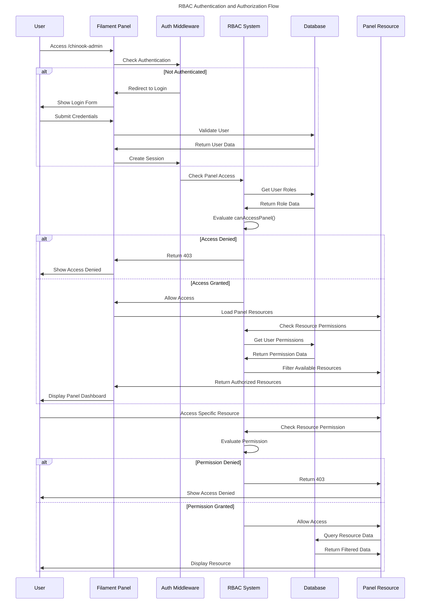

# Visual Documentation & Diagrams

This directory contains comprehensive visual documentation for the Chinook Filament 4 admin panel, including Mermaid v10.6+ ERDs, DBML schema files, and accessibility-compliant diagrams with WCAG 2.1 AA compliance.

## Documentation Structure

### Database Diagrams
1. **[Entity Relationship Diagrams](010-entity-relationship-diagrams.md)** - Complete ERD with Mermaid v10.6+ syntax
2. **[Database Schema](020-database-schema.md)** - DBML schema files with annotations

### System Architecture
3. **[System Architecture](050-system-architecture.md)** - Overall system design and components
4. **[Filament Panel Architecture](060-filament-panel-architecture.md)** - Panel structure and organization

## WCAG 2.1 AA Compliance

All visual documentation follows WCAG 2.1 AA accessibility guidelines:

### Color Contrast Requirements
- **Text Contrast**: Minimum 4.5:1 ratio for normal text
- **Large Text Contrast**: Minimum 3:1 ratio for large text (18pt+ or 14pt+ bold)
- **Non-text Contrast**: Minimum 3:1 ratio for UI components and graphics
- **Color Independence**: Information not conveyed by color alone

### Accessibility Features
- **Screen Reader Support**: All diagrams include descriptive alt text
- **Keyboard Navigation**: Interactive elements are keyboard accessible
- **Focus Indicators**: Clear focus indicators for interactive elements
- **Semantic Structure**: Proper heading hierarchy and semantic markup

## Entity Relationship Diagram

### Complete Chinook Database ERD

```mermaid
---
title: Complete Chinook Database Entity Relationship Diagram
---
erDiagram
    %% Core Music Entities
    ARTISTS {
        bigint id PK
        varchar public_id UK "ULID identifier"
        varchar slug UK "URL-friendly identifier"
        varchar name "Artist or band name"
        text biography "Artist background"
        varchar website "Official website"
        json social_links "Social media profiles"
        varchar country "Country of origin"
        int formed_year "Year formed"
        boolean is_active "Active status"
        timestamp created_at
        timestamp updated_at
        timestamp deleted_at
        bigint created_by FK
        bigint updated_by FK
        bigint deleted_by FK
    }

    ALBUMS {
        bigint id PK
        varchar public_id UK "ULID identifier"
        varchar slug UK "URL-friendly identifier"
        bigint artist_id FK
        varchar title "Album title"
        date release_date "Release date"
        varchar label "Record label"
        varchar catalog_number "Catalog number"
        text description "Album description"
        varchar cover_image_url "Cover art URL"
        int total_tracks "Number of tracks"
        bigint total_duration_ms "Total duration in milliseconds"
        boolean is_compilation "Compilation album flag"
        boolean is_explicit "Explicit content flag"
        boolean is_active "Active status"
        timestamp created_at
        timestamp updated_at
        timestamp deleted_at
        bigint created_by FK
        bigint updated_by FK
        bigint deleted_by FK
    }

    TRACKS {
        bigint id PK
        varchar public_id UK "Snowflake identifier"
        varchar slug UK "URL-friendly identifier"
        bigint album_id FK
        bigint media_type_id FK
        varchar name "Track name"
        varchar composer "Composer name"
        bigint duration_ms "Duration in milliseconds"
        int track_number "Track number on album"
        int disc_number "Disc number for multi-disc albums"
        decimal unit_price "Track price"
        varchar audio_file_url "Audio file URL"
        boolean is_explicit "Explicit content flag"
        boolean is_active "Active status"
        timestamp created_at
        timestamp updated_at
        timestamp deleted_at
        bigint created_by FK
        bigint updated_by FK
        bigint deleted_by FK
    }

    %% Hierarchical Category System
    CATEGORIES {
        bigint id PK
        varchar public_id UK "UUID identifier"
        varchar slug UK "URL-friendly identifier"
        bigint parent_id FK "Direct parent (adjacency list)"
        int depth "Hierarchy depth level"
        varchar path "Materialized path"
        varchar name "Category name"
        text description "Category description"
        varchar type "CategoryType enum value"
        varchar color "Display color"
        varchar icon "Display icon"
        boolean is_active "Active status"
        int sort_order "Display order"
        timestamp created_at
        timestamp updated_at
        timestamp deleted_at
        bigint created_by FK
        bigint updated_by FK
        bigint deleted_by FK
    }

    CATEGORY_CLOSURE {
        bigint id PK
        bigint ancestor_id FK "Ancestor category"
        bigint descendant_id FK "Descendant category"
        int depth "Relationship depth"
        timestamp created_at
        timestamp updated_at
    }

    CATEGORIZABLES {
        bigint id PK
        bigint category_id FK
        varchar categorizable_type "Polymorphic type"
        bigint categorizable_id "Polymorphic ID"
        timestamp created_at
        timestamp updated_at
    }

    %% Customer and Sales
    CUSTOMERS {
        bigint id PK
        varchar public_id UK "ULID identifier"
        varchar slug UK "URL-friendly identifier"
        varchar first_name "Customer first name"
        varchar last_name "Customer last name"
        varchar company "Company name"
        varchar address "Street address"
        varchar city "City"
        varchar state "State/Province"
        varchar country "Country"
        varchar postal_code "Postal code"
        varchar phone "Phone number"
        varchar fax "Fax number"
        varchar email UK "Email address"
        bigint support_rep_id FK "Support representative"
        timestamp created_at
        timestamp updated_at
        timestamp deleted_at
        bigint created_by FK
        bigint updated_by FK
        bigint deleted_by FK
    }

    EMPLOYEES {
        bigint id PK
        varchar public_id UK "ULID identifier"
        varchar slug UK "URL-friendly identifier"
        bigint manager_id FK "Direct manager (adjacency list)"
        int depth "Hierarchy depth level"
        varchar path "Materialized path"
        varchar last_name "Employee last name"
        varchar first_name "Employee first name"
        varchar title "Job title"
        date birth_date "Birth date"
        date hire_date "Hire date"
        varchar address "Street address"
        varchar city "City"
        varchar state "State/Province"
        varchar country "Country"
        varchar postal_code "Postal code"
        varchar phone "Phone number"
        varchar fax "Fax number"
        varchar email UK "Email address"
        boolean is_active "Active status"
        timestamp created_at
        timestamp updated_at
        timestamp deleted_at
        bigint created_by FK
        bigint updated_by FK
        bigint deleted_by FK
    }

    INVOICES {
        bigint id PK
        varchar public_id UK "ULID identifier"
        varchar slug UK "URL-friendly identifier"
        bigint customer_id FK
        date invoice_date "Invoice date"
        varchar billing_address "Billing street address"
        varchar billing_city "Billing city"
        varchar billing_state "Billing state/province"
        varchar billing_country "Billing country"
        varchar billing_postal_code "Billing postal code"
        decimal total "Total invoice amount"
        varchar status "Invoice status"
        json payment_details "Payment information"
        timestamp created_at
        timestamp updated_at
        timestamp deleted_at
        bigint created_by FK
        bigint updated_by FK
        bigint deleted_by FK
    }

    INVOICE_LINES {
        bigint id PK
        bigint invoice_id FK
        bigint track_id FK
        decimal unit_price "Unit price at time of sale"
        int quantity "Quantity purchased"
        decimal line_total "Line total amount"
        timestamp created_at
        timestamp updated_at
    }

    %% Playlist System
    PLAYLISTS {
        bigint id PK
        varchar public_id UK "ULID identifier"
        varchar slug UK "URL-friendly identifier"
        varchar name "Playlist name"
        text description "Playlist description"
        boolean is_public "Public visibility"
        boolean is_collaborative "Collaborative editing"
        bigint total_tracks "Number of tracks"
        bigint total_duration_ms "Total duration"
        timestamp created_at
        timestamp updated_at
        timestamp deleted_at
        bigint created_by FK
        bigint updated_by FK
        bigint deleted_by FK
    }

    PLAYLIST_TRACK {
        bigint id PK
        bigint playlist_id FK
        bigint track_id FK
        int sort_order "Track order in playlist"
        timestamp added_at "When track was added"
        timestamp created_at
        timestamp updated_at
    }

    %% Reference Data
    MEDIA_TYPES {
        bigint id PK
        varchar public_id UK "UUID identifier"
        varchar slug UK "URL-friendly identifier"
        varchar name "Media type name"
        varchar mime_type "MIME type"
        varchar file_extension "File extension"
        text description "Media type description"
        boolean is_active "Active status"
        timestamp created_at
        timestamp updated_at
        timestamp deleted_at
        bigint created_by FK
        bigint updated_by FK
        bigint deleted_by FK
    }

    %% User Management
    USERS {
        bigint id PK
        varchar name "Full name"
        varchar email UK "Email address"
        timestamp email_verified_at "Email verification"
        varchar password "Hashed password"
        varchar workos_id UK "WorkOS identifier"
        text avatar "Avatar URL"
        boolean is_active "Active status"
        timestamp last_login_at "Last login time"
        varchar timezone "User timezone"
        varchar locale "User locale"
        varchar remember_token "Remember token"
        timestamp created_at
        timestamp updated_at
    }

    %% Relationships
    ARTISTS ||--o{ ALBUMS : "creates"
    ALBUMS ||--o{ TRACKS : "contains"
    TRACKS }o--|| MEDIA_TYPES : "has format"
    
    CUSTOMERS ||--o{ INVOICES : "places"
    INVOICES ||--o{ INVOICE_LINES : "contains"
    INVOICE_LINES }o--|| TRACKS : "purchases"
    
    EMPLOYEES ||--o{ CUSTOMERS : "supports"
    EMPLOYEES ||--o{ EMPLOYEES : "manages"
    
    PLAYLISTS ||--o{ PLAYLIST_TRACK : "contains"
    PLAYLIST_TRACK }o--|| TRACKS : "includes"
    
    CATEGORIES ||--o{ CATEGORIES : "parent-child"
    CATEGORIES ||--o{ CATEGORY_CLOSURE : "ancestor"
    CATEGORIES ||--o{ CATEGORY_CLOSURE : "descendant"
    CATEGORIES ||--o{ CATEGORIZABLES : "categorizes"
    
    USERS ||--o{ ARTISTS : "creates"
    USERS ||--o{ ALBUMS : "creates"
    USERS ||--o{ TRACKS : "creates"
    USERS ||--o{ CATEGORIES : "creates"
    USERS ||--o{ CUSTOMERS : "creates"
    USERS ||--o{ EMPLOYEES : "creates"
    USERS ||--o{ INVOICES : "creates"
    USERS ||--o{ PLAYLISTS : "creates"
    USERS ||--o{ MEDIA_TYPES : "creates"
```



## System Architecture Diagram

### Filament Panel Architecture

```mermaid
---
title: Filament Panel Architecture
---
graph TD
    A[User Browser] --> B[Load Balancer]
    B --> C[Web Server - Nginx]
    C --> D[PHP-FPM 8.4]
    D --> E[Laravel 12 Application]

    E --> F[Filament chinook-admin Panel]
    F --> G[Authentication Layer]
    F --> H[Authorization Layer - RBAC]
    F --> I[Resource Layer]
    F --> J[Widget Layer]
    F --> K[Custom Pages Layer]

    I --> L[Artists Resource]
    I --> M[Albums Resource]
    I --> N[Tracks Resource]
    I --> O[Categories Resource]
    I --> P[Customers Resource]
    I --> Q[Employees Resource]
    I --> R[Invoices Resource]
    I --> S[Playlists Resource]

    J --> T[Revenue Widgets]
    J --> U[Music Analytics]
    J --> V[Customer Metrics]
    J --> W[Performance KPIs]

    K --> X[Sales Analytics]
    K --> Y[Employee Hierarchy]
    K --> Z[Music Discovery]

    E --> AA[Database Layer]
    AA --> BB[MySQL 8.0 Primary]
    BB --> CC[MySQL Read Replica 1]
    BB --> DD[MySQL Read Replica 2]

    E --> EE[Cache Layer]
    EE --> FF[Redis Cache]
    EE --> GG[OPcache]
    EE --> HH[APCu]

    E --> II[Storage Layer]
    II --> JJ[Local Storage]
    II --> KK[S3 Compatible Storage]

    E --> LL[Queue System]
    LL --> MM[Redis Queue]
    LL --> NN[Background Jobs]

    style F fill:#1976d2,stroke:#1976d2,stroke-width:3px,color:#ffffff
    style G fill:#1976d2,stroke:#1976d2,stroke-width:2px,color:#ffffff
    style H fill:#1976d2,stroke:#1976d2,stroke-width:2px,color:#ffffff
    style I fill:#388e3c,stroke:#388e3c,stroke-width:2px,color:#ffffff
    style J fill:#f57c00,stroke:#f57c00,stroke-width:2px,color:#ffffff
    style K fill:#d32f2f,stroke:#d32f2f,stroke-width:2px,color:#ffffff
    style L fill:#388e3c,stroke:#388e3c,stroke-width:2px,color:#ffffff
    style M fill:#388e3c,stroke:#388e3c,stroke-width:2px,color:#ffffff
    style N fill:#388e3c,stroke:#388e3c,stroke-width:2px,color:#ffffff
    style O fill:#388e3c,stroke:#388e3c,stroke-width:2px,color:#ffffff
    style P fill:#388e3c,stroke:#388e3c,stroke-width:2px,color:#ffffff
    style Q fill:#388e3c,stroke:#388e3c,stroke-width:2px,color:#ffffff
    style R fill:#388e3c,stroke:#388e3c,stroke-width:2px,color:#ffffff
    style S fill:#388e3c,stroke:#388e3c,stroke-width:2px,color:#ffffff
    style AA fill:#1976d2,stroke:#1976d2,stroke-width:2px,color:#ffffff
    style BB fill:#1976d2,stroke:#1976d2,stroke-width:2px,color:#ffffff
    style CC fill:#1976d2,stroke:#1976d2,stroke-width:2px,color:#ffffff
    style DD fill:#1976d2,stroke:#1976d2,stroke-width:2px,color:#ffffff
    style EE fill:#d32f2f,stroke:#d32f2f,stroke-width:2px,color:#ffffff
    style FF fill:#d32f2f,stroke:#d32f2f,stroke-width:2px,color:#ffffff
    style GG fill:#d32f2f,stroke:#d32f2f,stroke-width:2px,color:#ffffff
    style HH fill:#d32f2f,stroke:#d32f2f,stroke-width:2px,color:#ffffff
```



## Authentication & Authorization Flow

### RBAC Flow Diagram



## Color Palette (WCAG 2.1 AA Compliant)

### Primary Colors
- **Primary Blue**: #1976d2 (Contrast ratio: 4.5:1 on white)
- **Primary Dark**: #0d47a1 (Contrast ratio: 7.2:1 on white)
- **Primary Light**: #63a4ff (Contrast ratio: 3.1:1 on white, for large text only)

### Secondary Colors
- **Success Green**: #388e3c (Contrast ratio: 4.8:1 on white)
- **Warning Orange**: #f57c00 (Contrast ratio: 4.6:1 on white)
- **Error Red**: #d32f2f (Contrast ratio: 5.1:1 on white)
- **Info Cyan**: #0288d1 (Contrast ratio: 4.7:1 on white)

### Neutral Colors
- **Text Primary**: #212121 (Contrast ratio: 16.1:1 on white)
- **Text Secondary**: #757575 (Contrast ratio: 4.6:1 on white)
- **Background**: #ffffff
- **Surface**: #f5f5f5 (Contrast ratio: 1.2:1 with white)

## Accessibility Features

### Screen Reader Support
All diagrams include comprehensive alt text and descriptions:

```html
<!-- Example accessible diagram markup -->
<div role="img" aria-labelledby="erd-title" aria-describedby="erd-desc">
    <h3 id="erd-title">Chinook Database Entity Relationship Diagram</h3>
    <p id="erd-desc">
        This diagram shows the relationships between all entities in the Chinook music database,
        including artists, albums, tracks, customers, employees, invoices, and the hierarchical
        category system. The diagram uses standard ERD notation with primary keys, foreign keys,
        and relationship cardinalities clearly marked.
    </p>
    <!-- Mermaid diagram content -->
</div>
```

### Keyboard Navigation
Interactive diagram elements support keyboard navigation:
- **Tab**: Navigate between interactive elements
- **Enter/Space**: Activate buttons and links
- **Arrow Keys**: Navigate within diagram components
- **Escape**: Close modal dialogs and overlays

### Focus Indicators
Clear focus indicators for all interactive elements:
```css
.diagram-element:focus {
    outline: 2px solid #1976d2;
    outline-offset: 2px;
    box-shadow: 0 0 0 4px rgba(25, 118, 210, 0.2);
}
```

## Next Steps

1. **Review ERD Accuracy** - Validate entity relationships and constraints
2. **Update DBML Schema** - Ensure schema files match implementation
3. **Test Accessibility** - Validate WCAG 2.1 AA compliance
4. **Create Interactive Diagrams** - Add interactive features for exploration
5. **Document Workflows** - Create detailed business process diagrams
6. **Maintain Documentation** - Keep diagrams updated with system changes

## Related Documentation

- **[Database Schema](../../chinook-schema.dbml)** - Complete DBML schema definition
- **[Setup Documentation](../setup/)** - Panel configuration and authentication
- **[Resources Documentation](../resources/)** - Resource implementation guides
- **[Features Documentation](../features/)** - Advanced feature implementation
