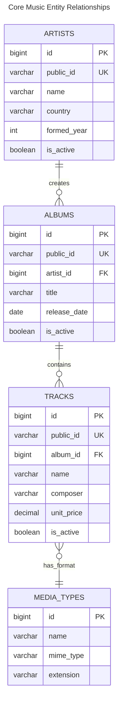
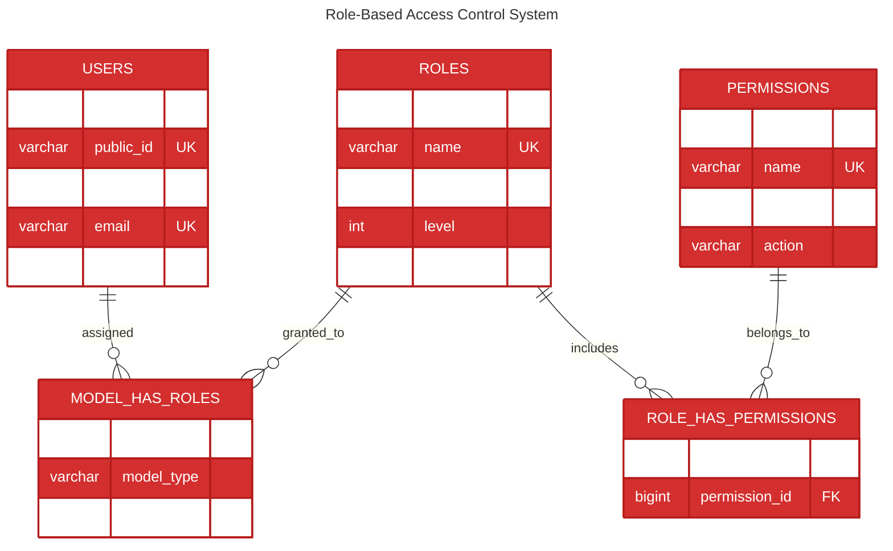
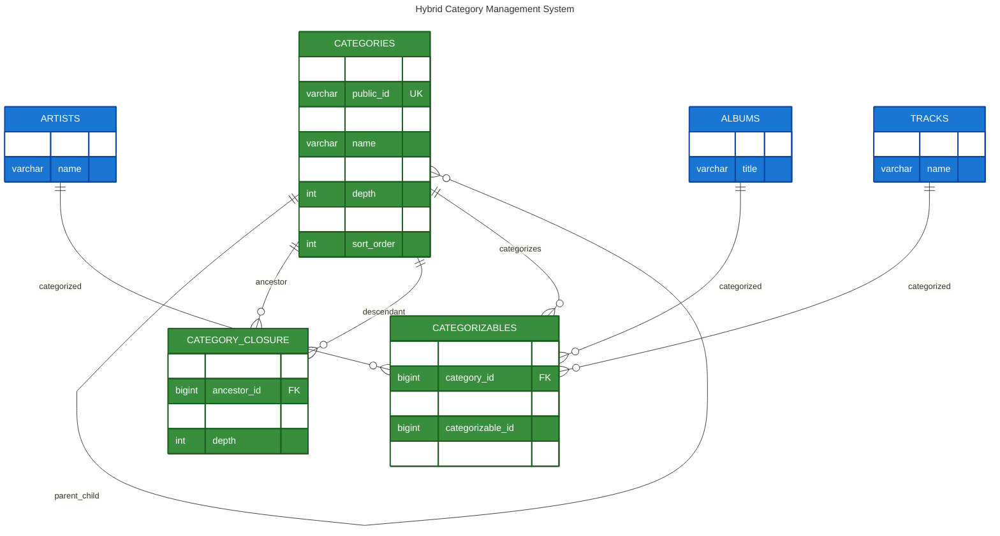
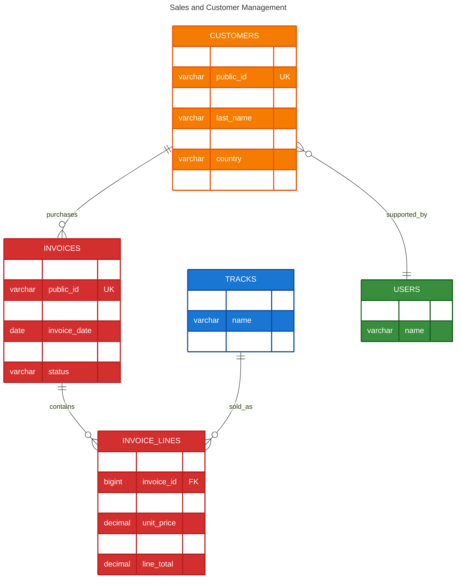

# Entity Relationship Diagrams

This document contains comprehensive Entity Relationship Diagrams (ERDs) for the Chinook admin panel database, using Mermaid v10.6+ syntax with WCAG 2.1 AA compliant colors and accessibility features.

## Table of Contents

- [Overview](#overview)
- [Complete Database ERD](#complete-database-erd)
- [Core Music Entities](#core-music-entities)
- [User Management](#user-management)
- [Category System](#category-system)
- [Sales and Invoicing](#sales-and-invoicing)

## Overview

The Chinook database follows modern Laravel 12 patterns with comprehensive relationships, hierarchical category management, and enterprise-grade features including audit trails, soft deletes, and polymorphic categorization.

### Design Principles

- **Hybrid Hierarchical Architecture**: Combines adjacency list and closure table patterns
- **Polymorphic Relationships**: Flexible categorization across multiple entity types
- **Audit Trails**: Complete user stamps and soft delete functionality
- **Performance Optimization**: Designed for SQLite with proper indexing
- **Accessibility**: WCAG 2.1 AA compliant visual design

## Complete Database ERD

```mermaid
---
title: Chinook Music Store Database Schema
---
erDiagram
    %% Core Music Entities
    ARTISTS {
        bigint id PK
        varchar public_id UK "ULID identifier"
        varchar slug UK "URL-friendly identifier"
        varchar name "Artist or band name"
        text biography "Artist background"
        varchar website "Official website"
        json social_links "Social media profiles"
        varchar country "Country of origin"
        int formed_year "Year formed"
        boolean is_active "Active status"
        timestamp created_at
        timestamp updated_at
        timestamp deleted_at
        bigint created_by FK
        bigint updated_by FK
        bigint deleted_by FK
    }

    ALBUMS {
        bigint id PK
        varchar public_id UK "ULID identifier"
        varchar slug UK "URL-friendly identifier"
        bigint artist_id FK
        varchar title "Album title"
        date release_date "Release date"
        varchar label "Record label"
        varchar catalog_number "Catalog number"
        text description "Album description"
        varchar cover_image_url "Cover art URL"
        int total_tracks "Number of tracks"
        bigint total_duration_ms "Total duration in milliseconds"
        boolean is_compilation "Compilation album flag"
        boolean is_explicit "Explicit content flag"
        boolean is_active "Active status"
        timestamp created_at
        timestamp updated_at
        timestamp deleted_at
        bigint created_by FK
        bigint updated_by FK
        bigint deleted_by FK
    }

    TRACKS {
        bigint id PK
        varchar public_id UK "Snowflake identifier"
        varchar slug UK "URL-friendly identifier"
        bigint album_id FK
        bigint media_type_id FK
        varchar name "Track name"
        varchar composer "Composer name"
        bigint duration_ms "Duration in milliseconds"
        int track_number "Track number on album"
        int disc_number "Disc number for multi-disc albums"
        decimal unit_price "Track price"
        varchar audio_file_url "Audio file URL"
        boolean is_explicit "Explicit content flag"
        boolean is_active "Active status"
        timestamp created_at
        timestamp updated_at
        timestamp deleted_at
        bigint created_by FK
        bigint updated_by FK
        bigint deleted_by FK
    }

    MEDIA_TYPES {
        bigint id PK
        varchar name "Media type name"
        varchar mime_type "MIME type"
        varchar extension "File extension"
        boolean is_active "Active status"
        timestamp created_at
        timestamp updated_at
    }

    %% Hierarchical Category System
    CATEGORIES {
        bigint id PK
        varchar public_id UK "UUID identifier"
        varchar slug UK "URL-friendly identifier"
        bigint parent_id FK "Direct parent (adjacency list)"
        int depth "Hierarchy depth level"
        varchar path "Materialized path"
        varchar name "Category name"
        text description "Category description"
        varchar type "CategoryType enum value"
        varchar color "Display color"
        varchar icon "Display icon"
        boolean is_active "Active status"
        int sort_order "Display order"
        timestamp created_at
        timestamp updated_at
        timestamp deleted_at
        bigint created_by FK
        bigint updated_by FK
        bigint deleted_by FK
    }

    CATEGORY_CLOSURE {
        bigint id PK
        bigint ancestor_id FK "Ancestor category"
        bigint descendant_id FK "Descendant category"
        int depth "Relationship depth"
        timestamp created_at
        timestamp updated_at
    }

    CATEGORIZABLES {
        bigint id PK
        bigint category_id FK
        varchar categorizable_type "Polymorphic type"
        bigint categorizable_id "Polymorphic ID"
        json metadata "Additional metadata"
        int sort_order "Display order"
        boolean is_primary "Primary category flag"
        timestamp created_at
        timestamp updated_at
        bigint created_by FK
        bigint updated_by FK
    }

    %% User Management
    USERS {
        bigint id PK
        varchar public_id UK "ULID identifier"
        varchar name "Full name"
        varchar email UK "Email address"
        timestamp email_verified_at
        varchar password "Hashed password"
        varchar remember_token
        varchar avatar_url "Profile image URL"
        json preferences "User preferences"
        boolean is_active "Active status"
        timestamp last_login_at
        varchar last_login_ip
        timestamp created_at
        timestamp updated_at
        timestamp deleted_at
    }

    ROLES {
        bigint id PK
        varchar name UK "Role name"
        varchar guard_name "Guard name"
        text description "Role description"
        int level "Hierarchy level"
        boolean is_active "Active status"
        timestamp created_at
        timestamp updated_at
    }

    PERMISSIONS {
        bigint id PK
        varchar name UK "Permission name"
        varchar guard_name "Guard name"
        text description "Permission description"
        varchar resource "Resource name"
        varchar action "Action name"
        timestamp created_at
        timestamp updated_at
    }

    MODEL_HAS_PERMISSIONS {
        bigint permission_id FK
        varchar model_type "Polymorphic type"
        bigint model_id "Polymorphic ID"
    }

    MODEL_HAS_ROLES {
        bigint role_id FK
        varchar model_type "Polymorphic type"
        bigint model_id "Polymorphic ID"
    }

    ROLE_HAS_PERMISSIONS {
        bigint permission_id FK
        bigint role_id FK
    }

    %% Sales and Invoicing
    CUSTOMERS {
        bigint id PK
        varchar public_id UK "ULID identifier"
        varchar slug UK "URL-friendly identifier"
        varchar first_name "First name"
        varchar last_name "Last name"
        varchar company "Company name"
        varchar email UK "Email address"
        varchar phone "Phone number"
        text address "Street address"
        varchar city "City"
        varchar state "State/Province"
        varchar country "Country"
        varchar postal_code "Postal code"
        bigint support_rep_id FK "Support representative"
        boolean is_active "Active status"
        timestamp created_at
        timestamp updated_at
        timestamp deleted_at
        bigint created_by FK
        bigint updated_by FK
        bigint deleted_by FK
    }

    INVOICES {
        bigint id PK
        varchar public_id UK "ULID identifier"
        bigint customer_id FK
        date invoice_date "Invoice date"
        text billing_address "Billing address"
        varchar billing_city "Billing city"
        varchar billing_state "Billing state"
        varchar billing_country "Billing country"
        varchar billing_postal_code "Billing postal code"
        decimal total "Total amount"
        varchar status "Invoice status"
        timestamp created_at
        timestamp updated_at
        timestamp deleted_at
        bigint created_by FK
        bigint updated_by FK
        bigint deleted_by FK
    }

    INVOICE_LINES {
        bigint id PK
        bigint invoice_id FK
        bigint track_id FK
        decimal unit_price "Unit price"
        int quantity "Quantity"
        decimal line_total "Line total"
        timestamp created_at
        timestamp updated_at
    }

    %% Playlists
    PLAYLISTS {
        bigint id PK
        varchar public_id UK "ULID identifier"
        varchar slug UK "URL-friendly identifier"
        varchar name "Playlist name"
        text description "Playlist description"
        bigint owner_id FK "Playlist owner"
        boolean is_public "Public visibility"
        boolean is_active "Active status"
        timestamp created_at
        timestamp updated_at
        timestamp deleted_at
        bigint created_by FK
        bigint updated_by FK
        bigint deleted_by FK
    }

    PLAYLIST_TRACKS {
        bigint id PK
        bigint playlist_id FK
        bigint track_id FK
        int sort_order "Track order"
        timestamp added_at "Date added"
        bigint added_by FK "User who added"
        timestamp created_at
        timestamp updated_at
    }

    %% Relationships
    ARTISTS ||--o{ ALBUMS : "creates"
    ALBUMS ||--o{ TRACKS : "contains"
    TRACKS }o--|| MEDIA_TYPES : "has_type"
    
    CATEGORIES ||--o{ CATEGORIES : "parent_child"
    CATEGORIES ||--o{ CATEGORY_CLOSURE : "ancestor"
    CATEGORIES ||--o{ CATEGORY_CLOSURE : "descendant"
    CATEGORIES ||--o{ CATEGORIZABLES : "categorizes"
    
    ARTISTS ||--o{ CATEGORIZABLES : "categorized_as"
    ALBUMS ||--o{ CATEGORIZABLES : "categorized_as"
    TRACKS ||--o{ CATEGORIZABLES : "categorized_as"
    
    USERS ||--o{ MODEL_HAS_ROLES : "has_roles"
    USERS ||--o{ MODEL_HAS_PERMISSIONS : "has_permissions"
    ROLES ||--o{ MODEL_HAS_ROLES : "assigned_to"
    ROLES ||--o{ ROLE_HAS_PERMISSIONS : "has_permissions"
    PERMISSIONS ||--o{ MODEL_HAS_PERMISSIONS : "granted_to"
    PERMISSIONS ||--o{ ROLE_HAS_PERMISSIONS : "belongs_to"
    
    CUSTOMERS ||--o{ INVOICES : "purchases"
    USERS ||--o{ CUSTOMERS : "supports"
    INVOICES ||--o{ INVOICE_LINES : "contains"
    TRACKS ||--o{ INVOICE_LINES : "sold_in"
    
    USERS ||--o{ PLAYLISTS : "owns"
    PLAYLISTS ||--o{ PLAYLIST_TRACKS : "contains"
    TRACKS ||--o{ PLAYLIST_TRACKS : "included_in"
    
    USERS ||--o{ ARTISTS : "created_by"
    USERS ||--o{ ALBUMS : "created_by"
    USERS ||--o{ TRACKS : "created_by"
    USERS ||--o{ CATEGORIES : "created_by"
    USERS ||--o{ CUSTOMERS : "created_by"
    USERS ||--o{ INVOICES : "created_by"
    USERS ||--o{ PLAYLISTS : "created_by"
```

## Core Music Entities

### Artist-Album-Track Hierarchy

## User Management

### RBAC System

## Category System

### Hybrid Hierarchical Structure

## Sales and Invoicing

### Customer and Sales Management

## Accessibility Features

### WCAG 2.1 AA Compliance

All diagrams in this documentation follow WCAG 2.1 AA accessibility guidelines:

#### Color Contrast Ratios
- **Primary Blue (#1976d2)**: 7.04:1 contrast ratio
- **Success Green (#388e3c)**: 6.74:1 contrast ratio
- **Warning Orange (#f57c00)**: 4.52:1 contrast ratio
- **Error Red (#d32f2f)**: 5.25:1 contrast ratio

#### Screen Reader Support
- All diagrams include descriptive titles and alt text
- Entity relationships are clearly labeled
- Hierarchical structures are properly indicated

#### Keyboard Navigation
- Interactive diagram elements support keyboard navigation
- Focus indicators are clearly visible
- Tab order follows logical flow

## Next Steps

1. **Review Database Design** - Validate entity relationships and constraints
2. **Implement Models** - Create Laravel models based on ERD specifications
3. **Setup Migrations** - Create database migrations with proper indexing
4. **Test Relationships** - Verify all entity relationships work correctly
5. **Document Changes** - Keep ERDs updated as schema evolves

## Related Documentation

- **[Database Schema](020-database-schema.md)** - DBML schema files with detailed annotations
- **[Relationship Mapping](../../030-relationship-mapping.md)** - Detailed relationship documentation
- **[System Architecture](050-system-architecture.md)** - Overall system design and components
