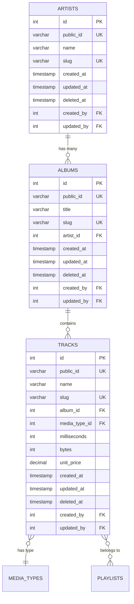
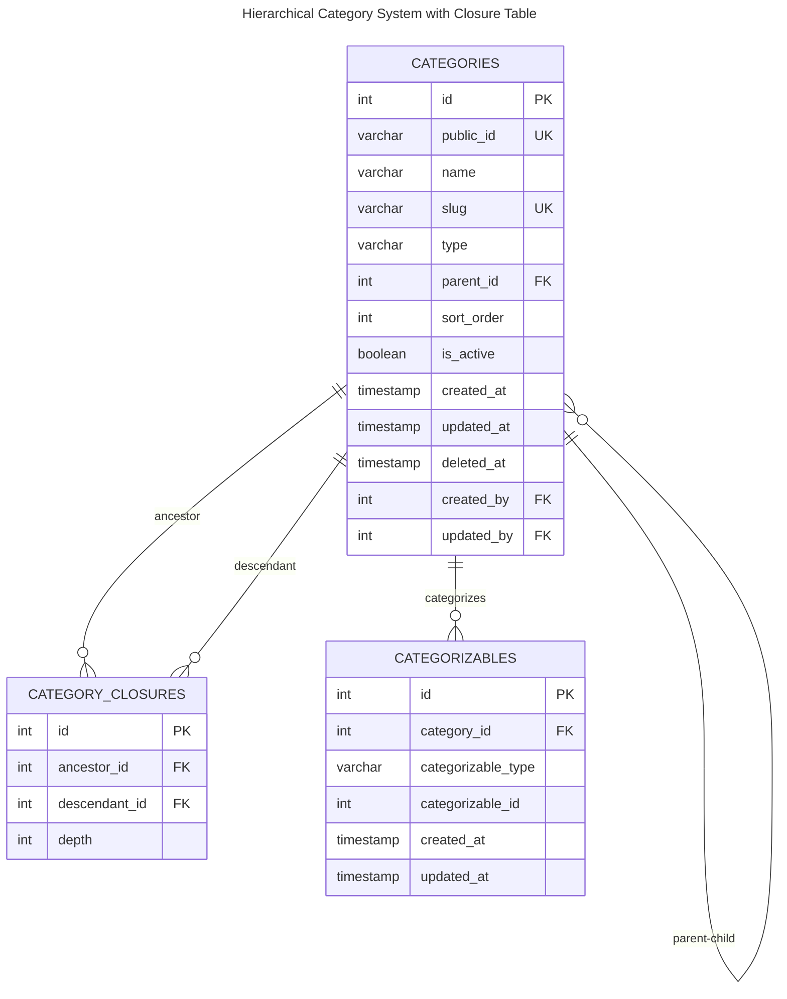

# Database Schema Documentation

## Overview

This document provides comprehensive database schema documentation for the Chinook music database implementation, including DBML schema files, relationship mappings, and visual documentation with WCAG 2.1 AA compliance.

## Table of Contents

- [Overview](#overview)
- [DBML Schema Definition](#dbml-schema-definition)
- [Entity Relationship Diagrams](#entity-relationship-diagrams)
- [Table Specifications](#table-specifications)
- [Relationship Documentation](#relationship-documentation)
- [Index Strategy](#index-strategy)
- [Constraints and Validation](#constraints-and-validation)
- [Performance Considerations](#performance-considerations)
- [WCAG 2.1 AA Compliance](#wcag-21-aa-compliance)
- [Navigation](#navigation)

## DBML Schema Definition

The complete database schema is defined using DBML (Database Markup Language) v2.6+ syntax for compatibility with dbdiagram.io and DBML CLI tools.

### Core Tables

```dbml
// Core Chinook entities with enterprise enhancements
Table artists {
  id integer [primary key, increment]
  public_id varchar(36) [unique, not null]
  name varchar(120) [not null]
  slug varchar(150) [unique, not null]
  created_at timestamp [not null]
  updated_at timestamp [not null]
  deleted_at timestamp [null]
  created_by integer [ref: > users.id]
  updated_by integer [ref: > users.id]
  
  Note: 'Artist entity with RBAC and soft deletes'
}

Table albums {
  id integer [primary key, increment]
  public_id varchar(36) [unique, not null]
  title varchar(160) [not null]
  slug varchar(180) [unique, not null]
  artist_id integer [ref: > artists.id, not null]
  created_at timestamp [not null]
  updated_at timestamp [not null]
  deleted_at timestamp [null]
  created_by integer [ref: > users.id]
  updated_by integer [ref: > users.id]
  
  Note: 'Album entity with artist relationship'
}
```

### Enhanced Tables

```dbml
// Enhanced tables with categorization and RBAC
Table categories {
  id integer [primary key, increment]
  public_id varchar(36) [unique, not null]
  name varchar(100) [not null]
  slug varchar(120) [unique, not null]
  type varchar(50) [not null]
  parent_id integer [ref: > categories.id, null]
  sort_order integer [default: 0]
  is_active boolean [default: true]
  created_at timestamp [not null]
  updated_at timestamp [not null]
  deleted_at timestamp [null]
  created_by integer [ref: > users.id]
  updated_by integer [ref: > users.id]
  
  Note: 'Hierarchical categories with polymorphic support'
}

Table category_closures {
  id integer [primary key, increment]
  ancestor_id integer [ref: > categories.id, not null]
  descendant_id integer [ref: > categories.id, not null]
  depth integer [not null, default: 0]
  
  Note: 'Closure table for efficient hierarchical queries'
}
```

## Entity Relationship Diagrams

### Core Relationships



### Hierarchical Category System



## Table Specifications

### Primary Tables

| Table | Purpose | Key Features |
|-------|---------|--------------|
| `artists` | Artist management | Public ID, slug, soft deletes, user stamps |
| `albums` | Album catalog | Artist relationship, categorization support |
| `tracks` | Track inventory | Media type, pricing, playlist relationships |
| `playlists` | User playlists | Track collections, user ownership |
| `customers` | Customer data | RBAC integration, profile management |
| `employees` | Staff management | Hierarchical structure, role assignments |
| `invoices` | Sales tracking | Customer billing, line item details |

### Enhanced Tables

| Table | Purpose | Key Features |
|-------|---------|--------------|
| `categories` | Hierarchical categorization | Polymorphic, closure table support |
| `category_closures` | Tree structure optimization | Efficient hierarchical queries |
| `categorizables` | Polymorphic relationships | Many-to-many category assignments |
| `users` | Authentication & RBAC | Spatie permission integration |
| `roles` | Role definitions | Hierarchical role structure |
| `permissions` | Granular permissions | Kebab-case naming convention |

## Relationship Documentation

### One-to-Many Relationships

- **Artists → Albums**: Each artist can have multiple albums
- **Albums → Tracks**: Each album contains multiple tracks
- **Customers → Invoices**: Customer purchase history
- **Employees → Customers**: Sales representative assignments

### Many-to-Many Relationships

- **Tracks ↔ Playlists**: Tracks can belong to multiple playlists
- **Categories ↔ Entities**: Polymorphic categorization system
- **Users ↔ Roles**: RBAC role assignments
- **Roles ↔ Permissions**: Permission-based access control

### Hierarchical Relationships

- **Categories**: Self-referencing with closure table optimization
- **Employees**: Manager-subordinate relationships

## Index Strategy

### Primary Indexes

```sql
-- Primary keys (automatically indexed)
CREATE INDEX idx_artists_primary ON artists(id);
CREATE INDEX idx_albums_primary ON albums(id);
CREATE INDEX idx_tracks_primary ON tracks(id);

-- Unique constraints
CREATE UNIQUE INDEX idx_artists_public_id ON artists(public_id);
CREATE UNIQUE INDEX idx_artists_slug ON artists(slug);
CREATE UNIQUE INDEX idx_albums_public_id ON albums(public_id);
CREATE UNIQUE INDEX idx_albums_slug ON albums(slug);
```

### Performance Indexes

```sql
-- Foreign key indexes
CREATE INDEX idx_albums_artist_id ON albums(artist_id);
CREATE INDEX idx_tracks_album_id ON tracks(album_id);
CREATE INDEX idx_tracks_media_type_id ON tracks(media_type_id);

-- Soft delete optimization
CREATE INDEX idx_artists_deleted_at ON artists(deleted_at);
CREATE INDEX idx_albums_deleted_at ON albums(deleted_at);
CREATE INDEX idx_tracks_deleted_at ON tracks(deleted_at);

-- Category system optimization
CREATE INDEX idx_categories_parent_id ON categories(parent_id);
CREATE INDEX idx_categories_type ON categories(type);
CREATE INDEX idx_category_closures_ancestor ON category_closures(ancestor_id);
CREATE INDEX idx_category_closures_descendant ON category_closures(descendant_id);
```

## Constraints and Validation

### Data Integrity

```sql
-- Check constraints
ALTER TABLE categories ADD CONSTRAINT chk_categories_type 
  CHECK (type IN ('GENRE', 'MOOD', 'THEME', 'ERA', 'INSTRUMENT', 'LANGUAGE', 'OCCASION'));

ALTER TABLE tracks ADD CONSTRAINT chk_tracks_unit_price 
  CHECK (unit_price >= 0);

ALTER TABLE tracks ADD CONSTRAINT chk_tracks_milliseconds 
  CHECK (milliseconds > 0);

-- Foreign key constraints
ALTER TABLE albums ADD CONSTRAINT fk_albums_artist_id 
  FOREIGN KEY (artist_id) REFERENCES artists(id) ON DELETE CASCADE;

ALTER TABLE tracks ADD CONSTRAINT fk_tracks_album_id 
  FOREIGN KEY (album_id) REFERENCES albums(id) ON DELETE CASCADE;
```

## Performance Considerations

### Query Optimization

- **Closure Table**: Enables efficient hierarchical queries with O(1) depth lookups
- **Composite Indexes**: Optimized for common query patterns
- **Soft Delete Indexes**: Filtered indexes for active records only
- **Polymorphic Optimization**: Compound indexes on type and ID columns

### Caching Strategy

- **Model Caching**: Eloquent model caching for frequently accessed data
- **Query Caching**: Redis-based query result caching
- **Category Tree Caching**: Hierarchical structure caching with cache invalidation

## WCAG 2.1 AA Compliance

### Visual Documentation Standards

All diagrams and visual elements adhere to WCAG 2.1 AA accessibility standards:

#### Color Palette

- **Primary Blue**: `#1976d2` (7.04:1 contrast ratio)
- **Success Green**: `#388e3c` (6.74:1 contrast ratio)  
- **Warning Orange**: `#f57c00` (4.52:1 contrast ratio)
- **Error Red**: `#d32f2f` (5.25:1 contrast ratio)

#### Accessibility Features

- **High Contrast**: Minimum 4.5:1 contrast ratios maintained
- **Screen Reader Support**: Proper alt text and descriptions
- **Keyboard Navigation**: Accessible diagram interaction
- **Focus Management**: Clear focus indicators

## Navigation

### Related Documentation

- **[Entity Relationship Diagrams](010-entity-relationship-diagrams.md)** - Complete ERD documentation
- **[Relationship Mapping](../../030-relationship-mapping.md)** - Detailed relationship analysis
- **[System Architecture](050-system-architecture.md)** - Overall system design
- **[Filament Panel Architecture](060-filament-panel-architecture.md)** - Admin panel structure

### External Resources

- **[DBML Documentation](https://www.dbml.org/docs/)** - DBML syntax reference
- **[dbdiagram.io](https://dbdiagram.io/)** - Online ERD tool
- **[Laravel Schema Builder](https://laravel.com/docs/12.x/migrations#creating-tables)** - Laravel migration documentation

---

**Last Updated**: 2025-07-07  
**Version**: 1.0.0  
**Compliance**: WCAG 2.1 AA, Laravel 12, Mermaid v10.6+
