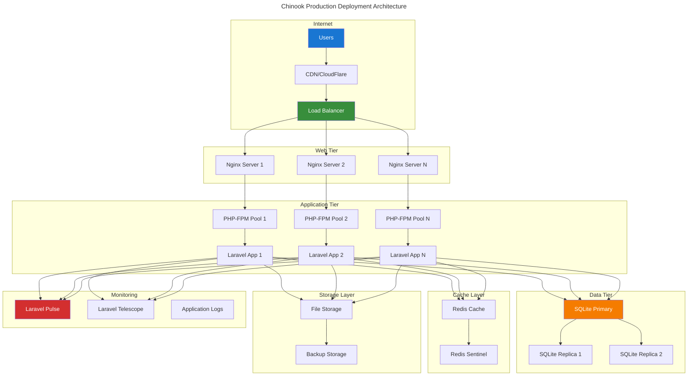
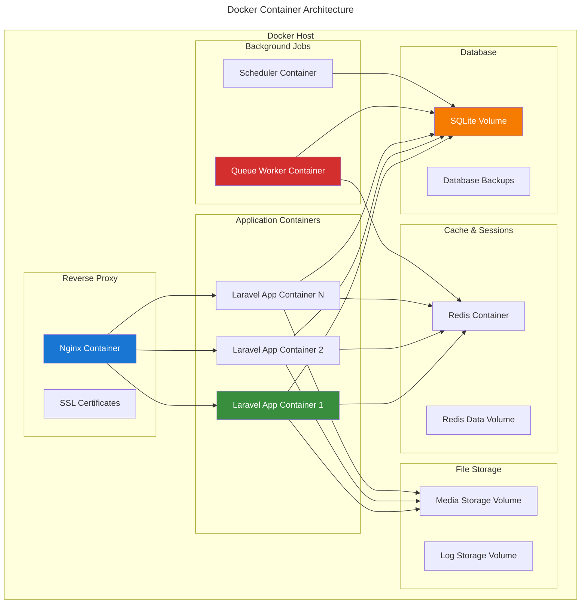
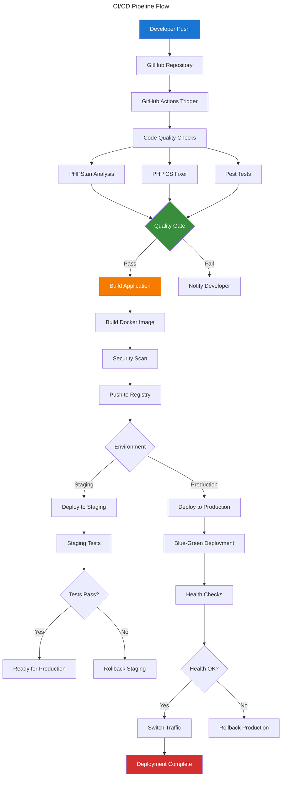
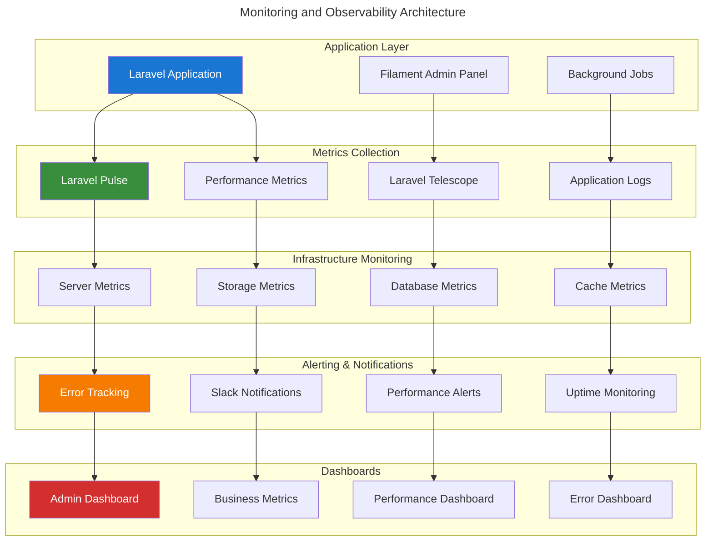
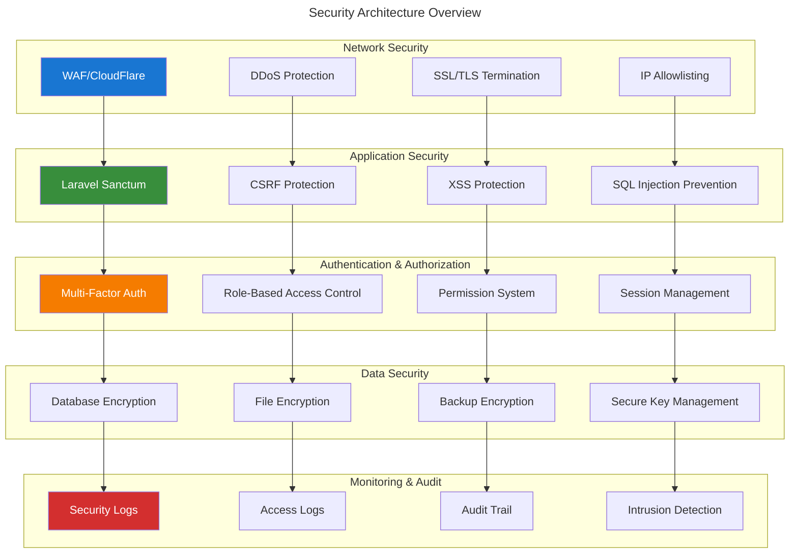
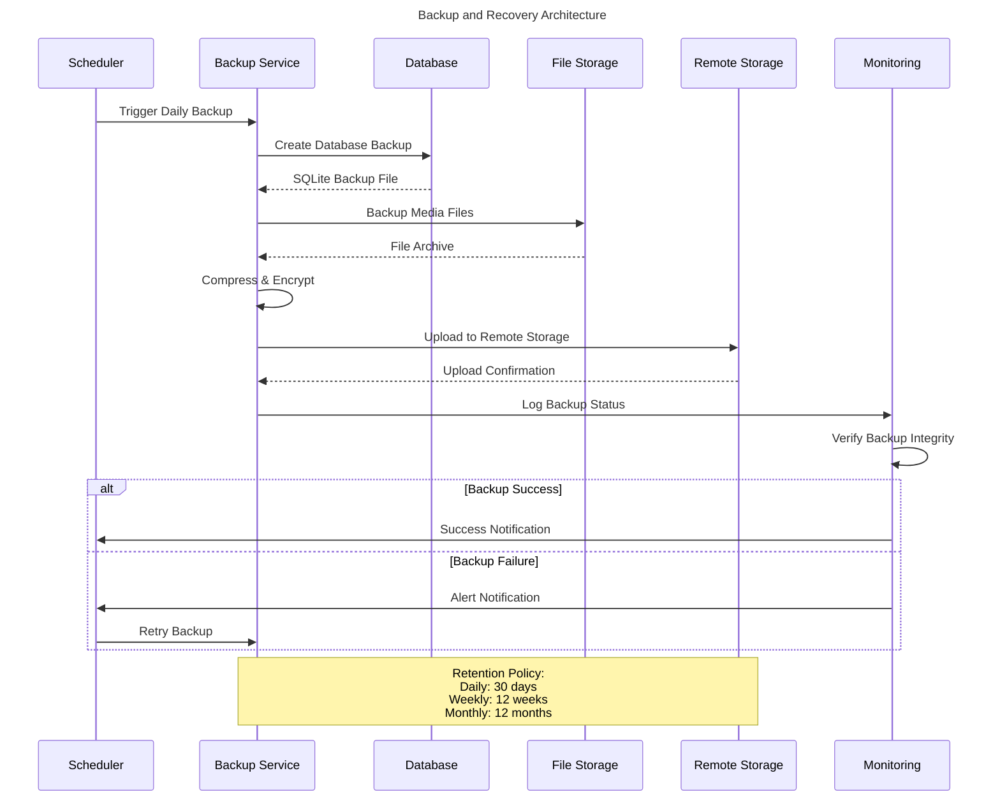

# Deployment Architecture Diagrams

## Table of Contents

- [Overview](#overview)
- [Production Deployment Architecture](#production-deployment-architecture)
- [Development Environment Setup](#development-environment-setup)
- [CI/CD Pipeline Architecture](#cicd-pipeline-architecture)
- [Monitoring & Observability](#monitoring--observability)
- [Security Architecture](#security-architecture)
- [Backup & Recovery Flow](#backup--recovery-flow)

## Overview

This document provides comprehensive deployment architecture diagrams for the Chinook Filament 4 admin panel using Mermaid v10.6+ with WCAG 2.1 AA compliant color palette.

**Accessibility Note:** All diagrams use high-contrast colors meeting WCAG 2.1 AA standards: #1976d2 (blue), #388e3c (green), #f57c00 (orange), #d32f2f (red). Each diagram includes descriptive titles and semantic structure for screen reader compatibility.

## Production Deployment Architecture

### High-Level Infrastructure Overview



### Container Deployment with Docker



## Development Environment Setup

### Local Development Architecture

```mermaid
---
title: Local Development Environment
---
graph TB
    subgraph "Developer Machine"
        A[Laravel Herd]
        B[PHP 8.4]
        C[Composer]
        D[Node.js & NPM]
    end
    
    subgraph "Development Tools"
        E[VS Code / PhpStorm]
        F[Laravel Debugbar]
        G[Laravel Telescope]
        H[Pest Testing]
    end
    
    subgraph "Local Services"
        I[SQLite Database]
        J[Redis (Optional)]
        K[Mailpit]
        L[Minio (S3 Compatible)]
    end
    
    subgraph "Build Tools"
        M[Vite]
        N[Tailwind CSS]
        O[Alpine.js]
        P[Livewire]
    end
    
    A --> B
    B --> C
    A --> D
    
    E --> F
    E --> G
    E --> H
    
    A --> I
    A --> J
    A --> K
    A --> L
    
    D --> M
    M --> N
    M --> O
    M --> P
    
    style A fill:#1976d2,color:#fff
    style E fill:#388e3c,color:#fff
    style I fill:#f57c00,color:#fff
    style M fill:#d32f2f,color:#fff
```

## CI/CD Pipeline Architecture

### Automated Deployment Pipeline



## Monitoring & Observability

### Application Monitoring Stack



## Security Architecture

### Security Layers and Controls



## Backup & Recovery Flow

### Automated Backup Strategy


