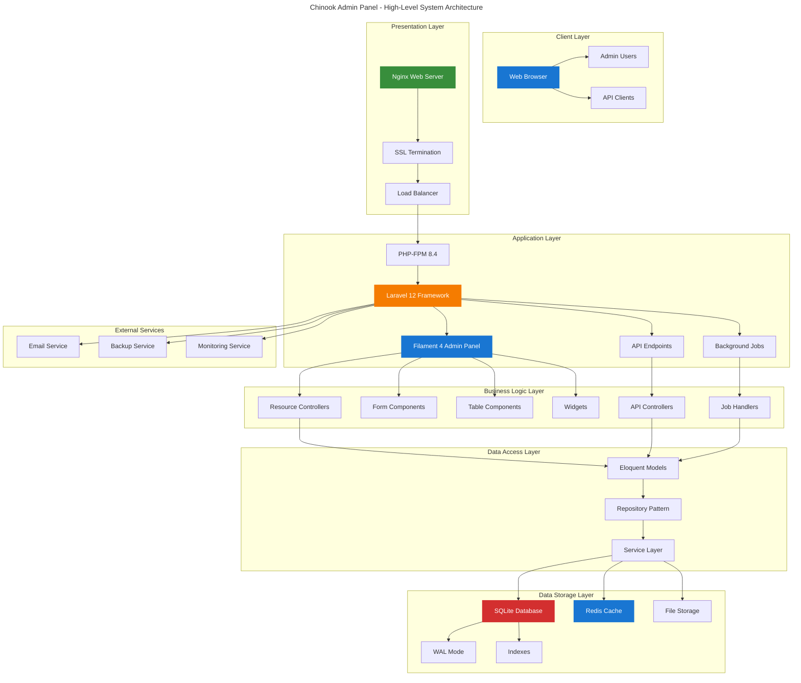
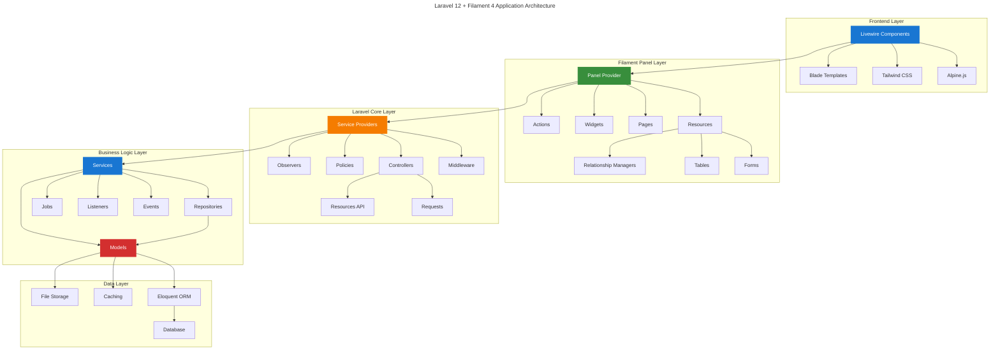
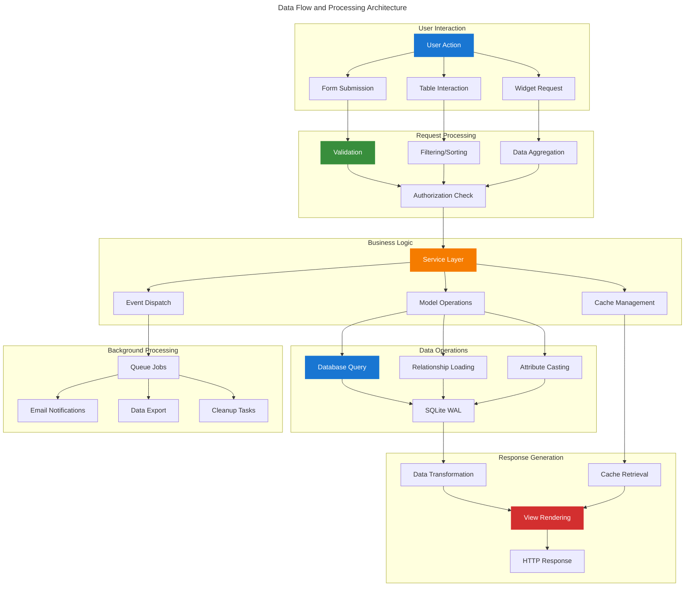
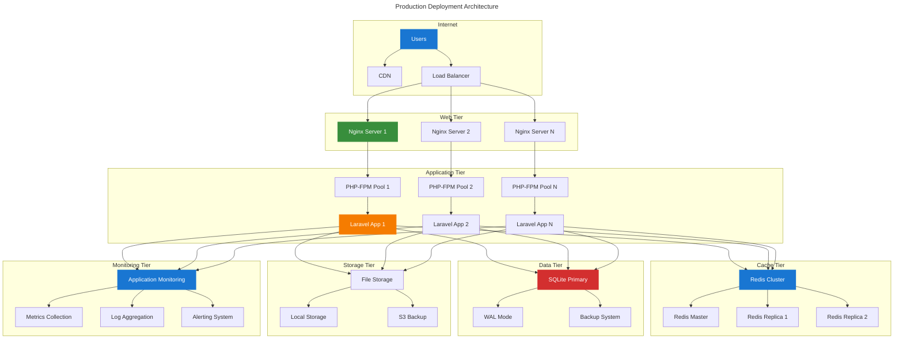
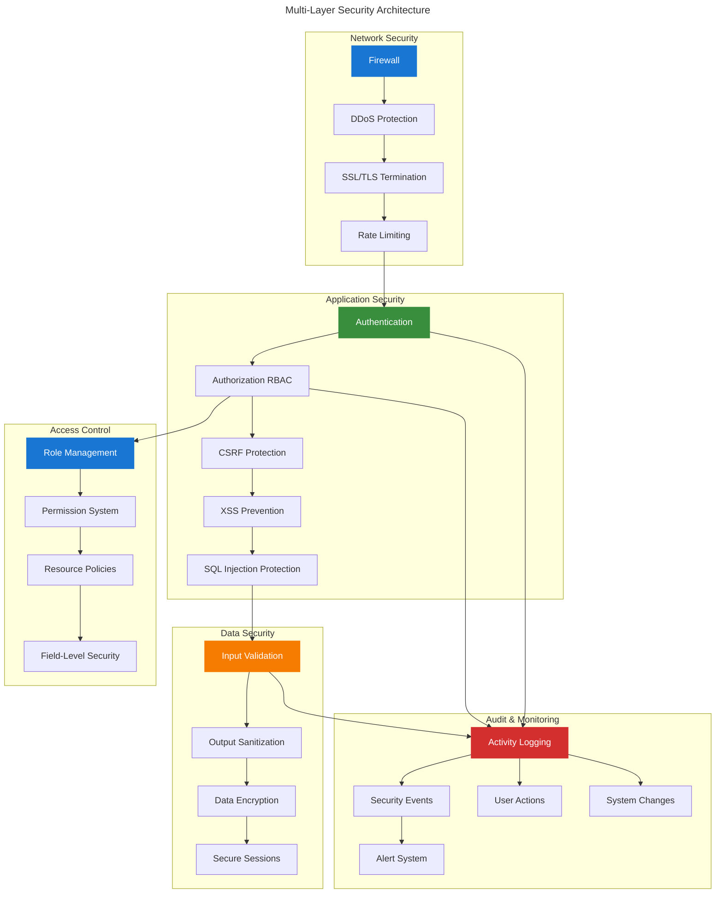
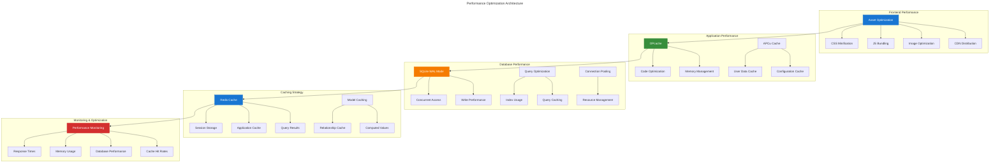
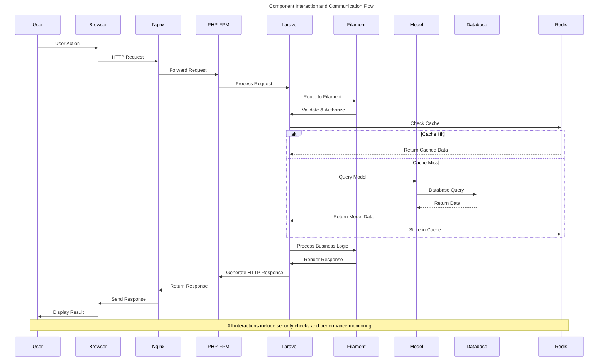

# System Architecture Diagrams

This document contains comprehensive system architecture diagrams for the Chinook admin panel, illustrating the overall system design, component interactions, and deployment architecture using WCAG 2.1 AA compliant Mermaid v10.6+ diagrams.

## Table of Contents

- [Overview](#overview)
- [High-Level Architecture](#high-level-architecture)
- [Application Architecture](#application-architecture)
- [Data Flow Architecture](#data-flow-architecture)
- [Deployment Architecture](#deployment-architecture)
- [Security Architecture](#security-architecture)
- [Performance Architecture](#performance-architecture)

## Overview

The Chinook admin panel follows modern Laravel 12 architecture patterns with Filament 4 for the admin interface, SQLite for data persistence, and Redis for caching and session management.

### Architectural Principles

- **Separation of Concerns**: Clear separation between presentation, business logic, and data layers
- **Scalability**: Designed for horizontal and vertical scaling
- **Performance**: Optimized for SQLite with comprehensive caching strategies
- **Security**: Multi-layered security with RBAC and data protection
- **Maintainability**: Clean code architecture with comprehensive testing

## High-Level Architecture

## Application Architecture

## Data Flow Architecture

## Deployment Architecture

## Security Architecture

## Performance Architecture

## Component Interaction Flow

## Accessibility Compliance

### WCAG 2.1 AA Features

All architecture diagrams follow accessibility guidelines:

#### Visual Design
- **High Contrast Colors**: All colors meet 4.5:1 contrast ratio minimum
- **Clear Typography**: Readable fonts and appropriate sizing
- **Logical Flow**: Information flows from top to bottom, left to right
- **Color Independence**: Information not conveyed by color alone

#### Screen Reader Support
- **Descriptive Titles**: Each diagram has a clear, descriptive title
- **Alt Text**: All visual elements include appropriate alternative text
- **Semantic Structure**: Proper heading hierarchy and markup

#### Interactive Elements
- **Keyboard Navigation**: All interactive elements support keyboard access
- **Focus Indicators**: Clear visual focus indicators
- **Logical Tab Order**: Tab navigation follows logical flow

## Next Steps

1. **Review Architecture** - Validate system design meets requirements
2. **Implement Components** - Build system components based on architecture
3. **Setup Infrastructure** - Configure deployment environment
4. **Performance Testing** - Validate performance characteristics
5. **Security Testing** - Verify security measures are effective
6. **Documentation Updates** - Keep architecture diagrams current

## Related Documentation

- **[Entity Relationship Diagrams](010-entity-relationship-diagrams.md)** - Database structure and relationships
- **[Filament Panel Architecture](060-filament-panel-architecture.md)** - Detailed panel structure
- **[Authentication Flow](../../070-authentication-flow.md)** - Security and authentication flows
- **[Chart Integration](../features/030-chart-integration.md)** - Detailed business process flows
