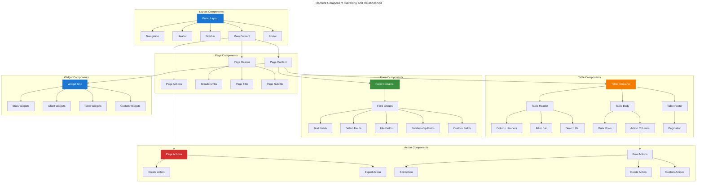
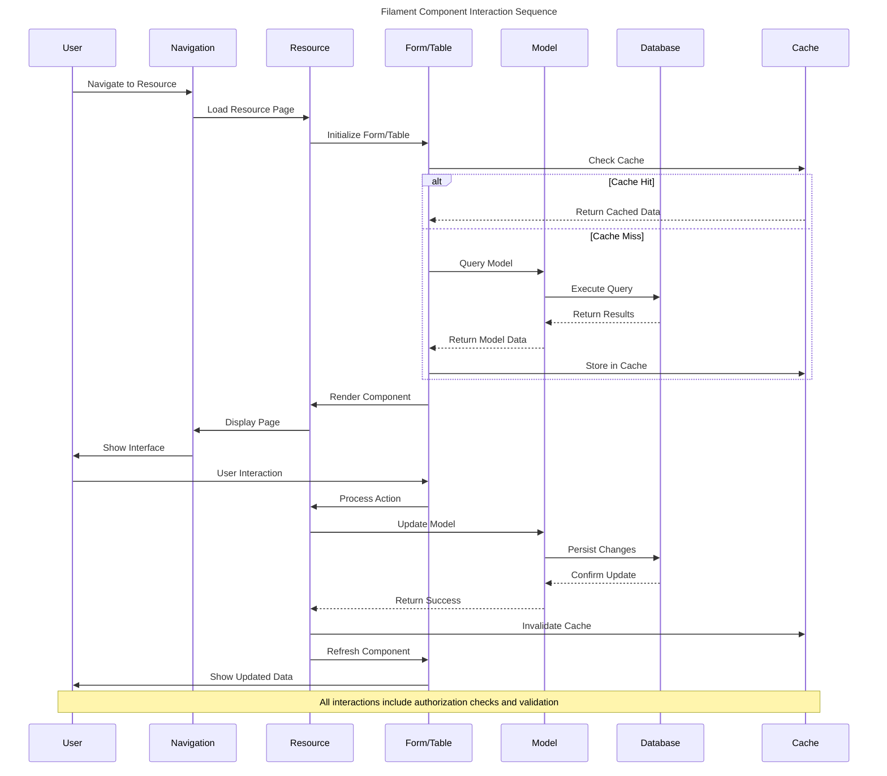
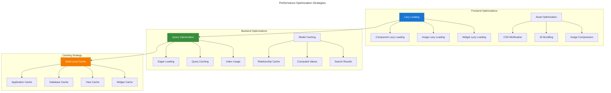

# Filament Panel Architecture

This document provides detailed architectural diagrams for the Chinook Filament 4 admin panel, illustrating panel structure, component organization, and interaction patterns using WCAG 2.1 AA compliant Mermaid v10.6+ diagrams.

## Table of Contents

- [Overview](#overview)
- [Panel Structure](#panel-structure)
- [Resource Architecture](#resource-architecture)
- [Component Hierarchy](#component-hierarchy)
- [Navigation Architecture](#navigation-architecture)
- [Widget System](#widget-system)
- [Form and Table Architecture](#form-and-table-architecture)

## Overview

The Chinook admin panel leverages Filament 4's powerful architecture to provide a comprehensive music store management interface with role-based access control, real-time updates, and optimized performance.

### Architectural Goals

- **Modular Design**: Clear separation of concerns with reusable components
- **Scalable Structure**: Easy to extend with new resources and features
- **Performance Optimized**: Efficient data loading and caching strategies
- **User Experience**: Intuitive navigation and responsive design
- **Accessibility**: WCAG 2.1 AA compliant interface design

## Panel Structure

**Accessibility Note:** This diagram illustrates the hierarchical structure of the Filament admin panel, showing how the Panel Provider configures authentication, navigation, themes, and plugins, which then connect to core resources (Artists, Albums, Tracks, Categories) and their associated forms, tables, and relationship managers. The diagram uses WCAG 2.1 AA compliant colors for optimal accessibility.

```mermaid
---
title: Filament Panel Structure and Organization
---
graph TD
    subgraph "Panel Provider"
        A[ChinookAdminPanelProvider] --> B[Panel Configuration]
        B --> C[Authentication Setup]
        B --> D[Navigation Configuration]
        B --> E[Theme Configuration]
        B --> F[Plugin Registration]
    end

    subgraph "Core Resources"
        G[ArtistResource] --> H[Artist Forms]
        G --> I[Artist Tables]
        G --> J[Artist Relations]
        
        K[AlbumResource] --> L[Album Forms]
        K --> M[Album Tables]
        K --> N[Album Relations]
        
        O[TrackResource] --> P[Track Forms]
        O --> Q[Track Tables]
        O --> R[Track Relations]
        
        S[CategoryResource] --> T[Category Forms]
        S --> U[Category Tables]
        S --> V[Category Hierarchy]
    end

    subgraph "Management Resources"
        W[CustomerResource] --> X[Customer Forms]
        W --> Y[Customer Tables]
        W --> Z[Customer Relations]
        
        AA[InvoiceResource] --> BB[Invoice Forms]
        AA --> CC[Invoice Tables]
        AA --> DD[Invoice Lines]
        
        EE[PlaylistResource] --> FF[Playlist Forms]
        EE --> GG[Playlist Tables]
        EE --> HH[Playlist Tracks]
    end

    subgraph "System Resources"
        II[UserResource] --> JJ[User Management]
        II --> KK[Role Assignment]
        II --> LL[Permission Control]
        
        MM[RoleResource] --> NN[Role Management]
        MM --> OO[Permission Assignment]
        
        PP[PermissionResource] --> QQ[Permission Management]
    end

    subgraph "Dashboard & Widgets"
        RR[Dashboard] --> SS[Revenue Widgets]
        RR --> TT[Analytics Widgets]
        RR --> UU[System Widgets]
        RR --> VV[Quick Actions]
    end

    A --> G
    A --> K
    A --> O
    A --> S
    A --> W
    A --> AA
    A --> EE
    A --> II
    A --> MM
    A --> PP
    A --> RR

    style A fill:#1976d2,stroke:#1976d2,stroke-width:2px,color:#ffffff
    style G fill:#388e3c,stroke:#388e3c,stroke-width:2px,color:#ffffff
    style W fill:#f57c00,stroke:#f57c00,stroke-width:2px,color:#ffffff
    style II fill:#1976d2,stroke:#1976d2,stroke-width:2px,color:#ffffff
    style RR fill:#d32f2f,stroke:#d32f2f,stroke-width:2px,color:#ffffff
```

## Resource Architecture

```mermaid
---
title: Filament Resource Architecture Pattern
---
graph TD
    subgraph "Resource Base"
        A[Resource Class] --> B[Model Binding]
        A --> C[Authorization]
        A --> D[Navigation]
        A --> E[Global Search]
    end

    subgraph "CRUD Operations"
        F[Create Page] --> G[Create Form]
        H[Edit Page] --> I[Edit Form]
        J[View Page] --> K[View Infolist]
        L[List Page] --> M[Data Table]
    end

    subgraph "Form Components"
        G --> N[Text Inputs]
        G --> O[Select Fields]
        G --> P[File Uploads]
        G --> Q[Repeaters]
        G --> R[Custom Components]
        I --> N
        I --> O
        I --> P
        I --> Q
        I --> R
    end

    subgraph "Table Components"
        M --> S[Columns]
        M --> T[Filters]
        M --> U[Actions]
        M --> V[Bulk Actions]
        M --> W[Search]
    end

    subgraph "Relationship Managers"
        X[HasMany Manager] --> Y[Related Table]
        X --> Z[Attach/Detach]
        AA[BelongsToMany Manager] --> BB[Pivot Table]
        AA --> CC[Sync Operations]
    end

    subgraph "Custom Pages"
        DD[Custom Page 1] --> EE[Custom Logic]
        FF[Custom Page 2] --> GG[Special Views]
        HH[Reports Page] --> II[Analytics]
    end

    A --> F
    A --> H
    A --> J
    A --> L
    A --> X
    A --> AA
    A --> DD
    A --> FF
    A --> HH

    style A fill:#1976d2,stroke:#0d47a1,stroke-width:2px,color:#ffffff
    style F fill:#388e3c,stroke:#1b5e20,stroke-width:2px,color:#ffffff
    style G fill:#f57c00,stroke:#e65100,stroke-width:2px,color:#ffffff
    style M fill:#1976d2,stroke:#0d47a1,stroke-width:2px,color:#ffffff
    style X fill:#d32f2f,stroke:#b71c1c,stroke-width:2px,color:#ffffff
```

## Component Hierarchy

## Navigation Architecture

```mermaid
---
title: Navigation Structure and Organization
---
graph TD
    subgraph "Main Navigation"
        A[Navigation Menu] --> B[Dashboard]
        A --> C[Music Management]
        A --> D[Customer Management]
        A --> E[System Management]
        A --> F[Reports & Analytics]
    end

    subgraph "Music Management"
        C --> G[Artists]
        C --> H[Albums]
        C --> I[Tracks]
        C --> J[Categories]
        C --> K[Playlists]
        C --> L[Media Types]
    end

    subgraph "Customer Management"
        D --> M[Customers]
        D --> N[Invoices]
        D --> O[Sales Reports]
        D --> P[Customer Analytics]
    end

    subgraph "System Management"
        E --> Q[Users]
        E --> R[Roles]
        E --> S[Permissions]
        E --> T[Settings]
        E --> U[System Health]
    end

    subgraph "Reports & Analytics"
        F --> V[Revenue Reports]
        F --> W[Sales Analytics]
        F --> X[Customer Insights]
        F --> Y[Music Trends]
        F --> Z[System Performance]
    end

    subgraph "User Context Menu"
        AA[User Menu] --> BB[Profile]
        AA --> CC[Preferences]
        AA --> DD[Security]
        AA --> EE[Logout]
    end

    subgraph "Quick Actions"
        FF[Quick Actions] --> GG[Add Artist]
        FF --> HH[Add Album]
        FF --> II[Add Track]
        FF --> JJ[Create Invoice]
    end

    A --> AA
    A --> FF

    style A fill:#1976d2,stroke:#0d47a1,stroke-width:2px,color:#ffffff
    style C fill:#388e3c,stroke:#1b5e20,stroke-width:2px,color:#ffffff
    style D fill:#f57c00,stroke:#e65100,stroke-width:2px,color:#ffffff
    style E fill:#d32f2f,stroke:#b71c1c,stroke-width:2px,color:#ffffff
    style F fill:#1976d2,stroke:#0d47a1,stroke-width:2px,color:#ffffff
```

## Widget System

```mermaid
---
title: Dashboard Widget System Architecture
---
graph TD
    subgraph "Widget Framework"
        A[Widget Manager] --> B[Widget Registry]
        A --> C[Widget Renderer]
        A --> D[Widget Cache]
        A --> E[Widget Permissions]
    end

    subgraph "Stats Widgets"
        F[Revenue Overview] --> G[Total Revenue]
        F --> H[Monthly Growth]
        F --> I[Average Order]
        
        J[Customer Metrics] --> K[Total Customers]
        J --> L[New Customers]
        J --> M[Active Customers]
        
        N[Music Statistics] --> O[Total Artists]
        N --> P[Total Albums]
        N --> Q[Total Tracks]
    end

    subgraph "Chart Widgets"
        R[Sales Trend Chart] --> S[Line Chart]
        R --> T[Time Series Data]
        
        U[Genre Distribution] --> V[Pie Chart]
        U --> W[Category Data]
        
        X[Top Artists Chart] --> Y[Bar Chart]
        X --> Z[Performance Data]
    end

    subgraph "Table Widgets"
        AA[Top Tracks Table] --> BB[Track Data]
        AA --> CC[Sales Metrics]
        
        DD[Recent Orders] --> EE[Order Data]
        DD --> FF[Customer Info]
        
        GG[Popular Artists] --> HH[Artist Data]
        GG --> II[Popularity Metrics]
    end

    subgraph "Custom Widgets"
        JJ[System Health] --> KK[Database Status]
        JJ --> LL[Cache Status]
        JJ --> MM[Performance Metrics]
        
        NN[Quick Actions] --> OO[Create Buttons]
        NN --> PP[Shortcut Links]
        
        QQ[Activity Feed] --> RR[Recent Actions]
        QQ --> SS[User Activity]
    end

    A --> F
    A --> J
    A --> N
    A --> R
    A --> U
    A --> X
    A --> AA
    A --> DD
    A --> GG
    A --> JJ
    A --> NN
    A --> QQ

    style A fill:#1976d2,stroke:#1976d2,stroke-width:2px,color:#ffffff
    style F fill:#388e3c,stroke:#388e3c,stroke-width:2px,color:#ffffff
    style R fill:#f57c00,stroke:#f57c00,stroke-width:2px,color:#ffffff
    style AA fill:#1976d2,stroke:#1976d2,stroke-width:2px,color:#ffffff
    style JJ fill:#d32f2f,stroke:#d32f2f,stroke-width:2px,color:#ffffff
```

## Form and Table Architecture

```mermaid
---
title: Form and Table Component Architecture
---
graph TD
    subgraph "Form Architecture"
        A[Form Builder] --> B[Schema Definition]
        A --> C[Validation Rules]
        A --> D[Field Components]
        A --> E[Layout Components]
        
        D --> F[Text Input]
        D --> G[Select Field]
        D --> H[File Upload]
        D --> I[Repeater]
        D --> J[Relationship Select]
        D --> K[Custom Components]
        
        E --> L[Sections]
        E --> M[Tabs]
        E --> N[Columns]
        E --> O[Grid Layout]
    end

    subgraph "Table Architecture"
        P[Table Builder] --> Q[Column Definition]
        P --> R[Filter System]
        P --> S[Action System]
        P --> T[Search System]
        
        Q --> U[Text Column]
        Q --> V[Image Column]
        Q --> W[Badge Column]
        Q --> X[Boolean Column]
        Q --> Y[Custom Column]
        
        R --> Z[Text Filter]
        R --> AA[Select Filter]
        R --> BB[Date Filter]
        R --> CC[Custom Filter]
        
        S --> DD[Edit Action]
        S --> EE[Delete Action]
        S --> FF[View Action]
        S --> GG[Custom Action]
    end

    subgraph "Data Processing"
        HH[Data Pipeline] --> II[Model Loading]
        HH --> JJ[Relationship Eager Loading]
        HH --> KK[Attribute Casting]
        HH --> LL[Permission Filtering]
        
        MM[Caching Layer] --> NN[Query Cache]
        MM --> OO[Model Cache]
        MM --> PP[Result Cache]
    end

    subgraph "Validation System"
        QQ[Validation Engine] --> RR[Field Validation]
        QQ --> SS[Form Validation]
        QQ --> TT[Custom Rules]
        QQ --> UU[Authorization Rules]
    end

    A --> HH
    P --> HH
    HH --> MM
    A --> QQ
    P --> QQ

    style A fill:#1976d2,stroke:#0d47a1,stroke-width:2px,color:#ffffff
    style P fill:#388e3c,stroke:#1b5e20,stroke-width:2px,color:#ffffff
    style HH fill:#f57c00,stroke:#e65100,stroke-width:2px,color:#ffffff
    style MM fill:#d32f2f,stroke:#b71c1c,stroke-width:2px,color:#ffffff
    style QQ fill:#1976d2,stroke:#0d47a1,stroke-width:2px,color:#ffffff
```

## Component Interaction Flow

## Accessibility Features

### WCAG 2.1 AA Compliance

The Filament panel architecture incorporates comprehensive accessibility features:

#### Visual Design
- **High Contrast**: All interface elements meet 4.5:1 contrast ratio
- **Scalable Text**: Text can be scaled up to 200% without loss of functionality
- **Color Independence**: Information is not conveyed by color alone
- **Focus Indicators**: Clear visual focus indicators for all interactive elements

#### Keyboard Navigation
- **Tab Order**: Logical tab order throughout the interface
- **Keyboard Shortcuts**: Comprehensive keyboard shortcuts for common actions
- **Skip Links**: Skip navigation links for screen reader users
- **Modal Management**: Proper focus management in modals and overlays

#### Screen Reader Support
- **Semantic HTML**: Proper use of semantic HTML elements
- **ARIA Labels**: Comprehensive ARIA labeling for complex components
- **Live Regions**: Dynamic content updates announced to screen readers
- **Form Labels**: All form fields have proper labels and descriptions

## Performance Optimizations

### Component-Level Optimizations

## Next Steps

1. **Implement Panel Structure** - Set up the basic panel architecture
2. **Create Core Resources** - Build the essential music management resources
3. **Develop Widgets** - Create dashboard widgets for analytics
4. **Setup Navigation** - Configure the navigation structure
5. **Test Accessibility** - Verify WCAG 2.1 AA compliance
6. **Optimize Performance** - Implement caching and optimization strategies

## Related Documentation

- **[System Architecture](050-system-architecture.md)** - Overall system design
- **[Authentication Flow](../../070-authentication-flow.md)** - Security and access control
- **[Navigation Configuration](../setup/040-navigation-configuration.md)** - Detailed navigation design
- **[Dashboard Configuration](../features/010-dashboard-configuration.md)** - User interaction flows
