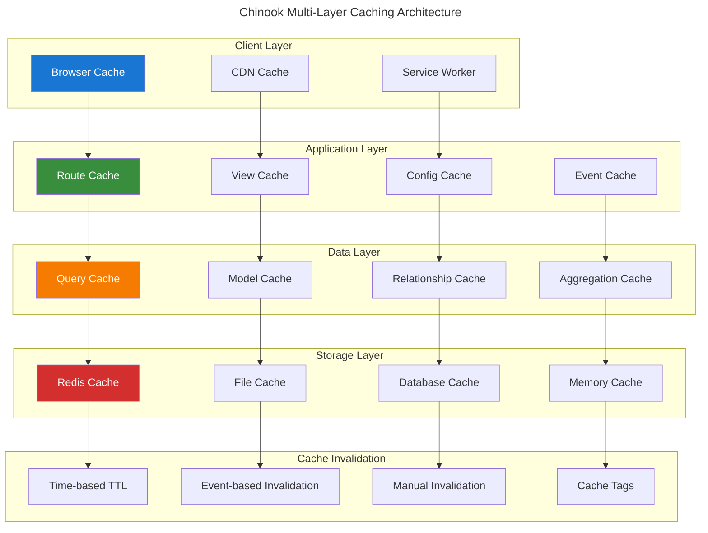
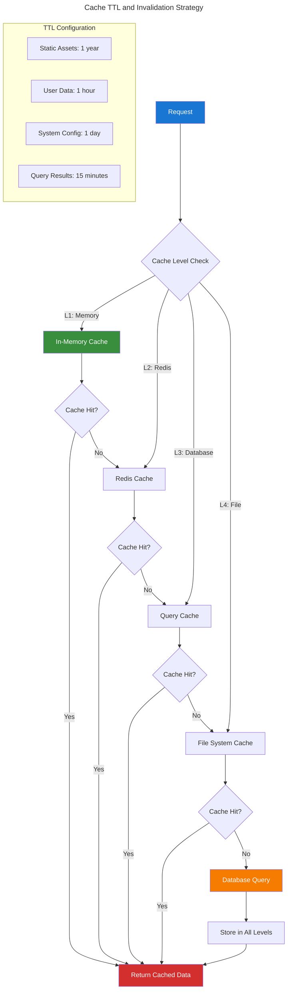
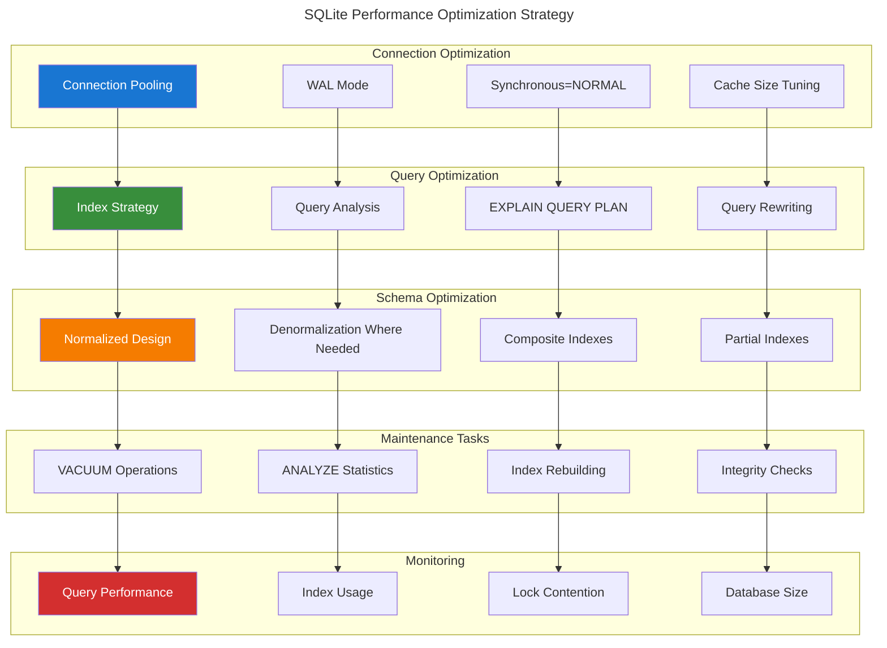
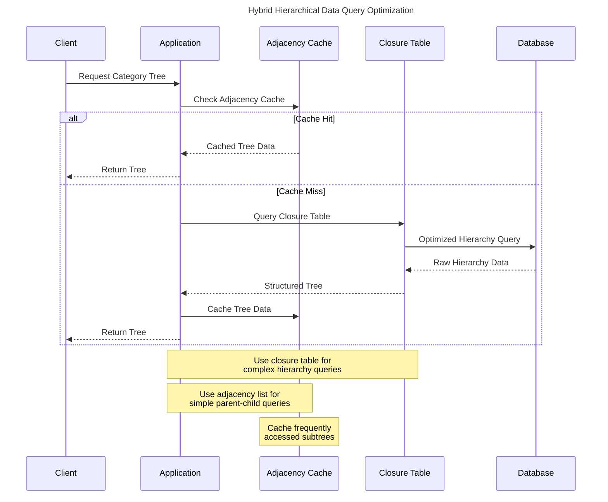
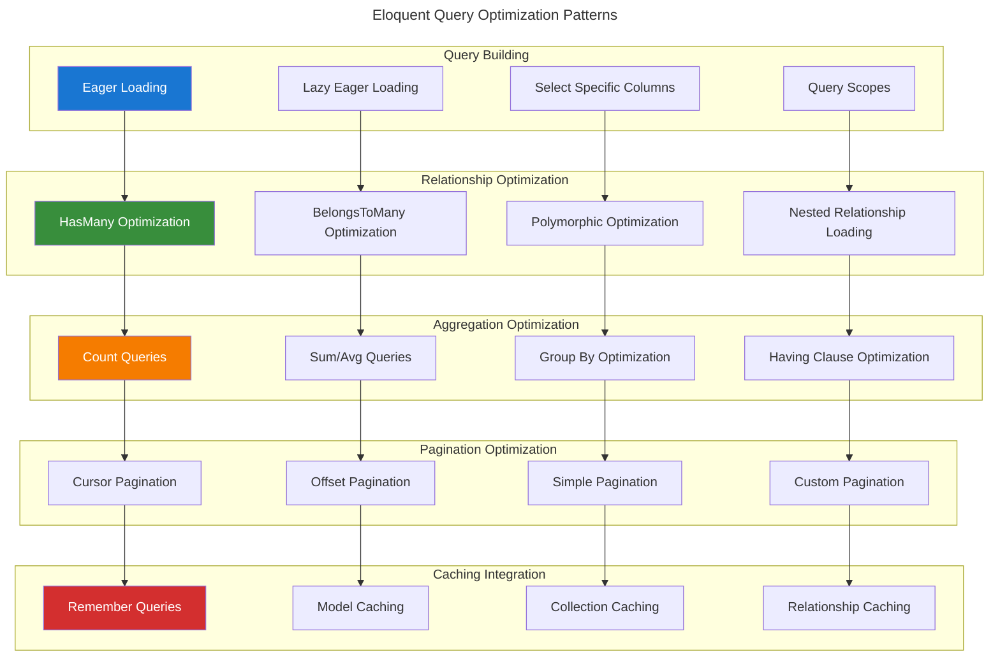
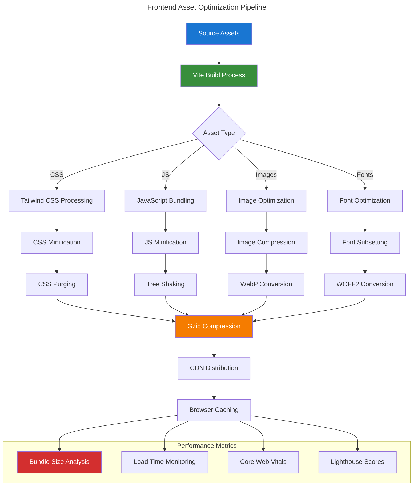
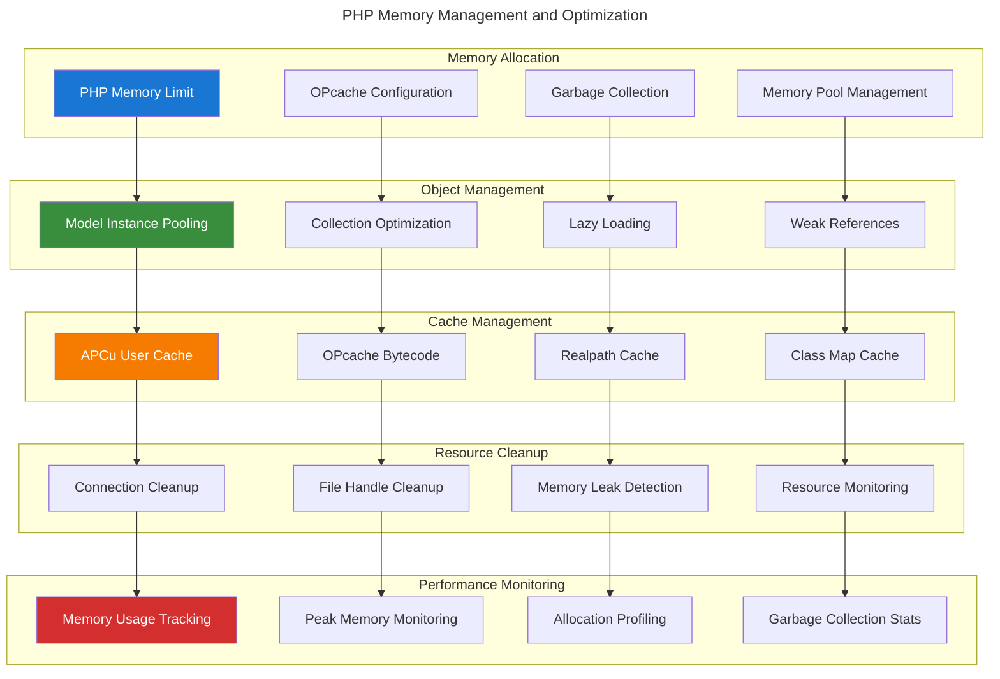
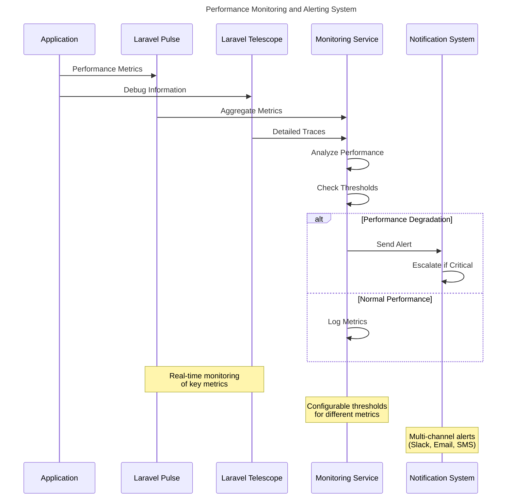

# Performance Optimization Architecture Diagrams

## Table of Contents

- [Overview](#overview)
- [Caching Strategy Architecture](#caching-strategy-architecture)
- [Database Optimization Flow](#database-optimization-flow)
- [Query Optimization Patterns](#query-optimization-patterns)
- [Asset Optimization Pipeline](#asset-optimization-pipeline)
- [Memory Management Architecture](#memory-management-architecture)
- [Performance Monitoring Flow](#performance-monitoring-flow)

## Overview

This document provides comprehensive performance optimization architecture diagrams for the Chinook Filament 4 admin panel using Mermaid v10.6+ with WCAG 2.1 AA compliant color palette.

**Accessibility Note:** All diagrams use high-contrast colors meeting WCAG 2.1 AA standards: #1976d2 (blue), #388e3c (green), #f57c00 (orange), #d32f2f (red). Each diagram includes descriptive titles and semantic structure for screen reader compatibility.

## Caching Strategy Architecture

### Multi-Layer Caching System

### Cache Hierarchy and TTL Strategy

## Database Optimization Flow

### SQLite Performance Optimization

### Hierarchical Data Query Optimization

## Query Optimization Patterns

### Eloquent Query Optimization

## Asset Optimization Pipeline

### Frontend Asset Optimization

## Memory Management Architecture

### PHP Memory Optimization

## Performance Monitoring Flow

### Real-time Performance Monitoring

