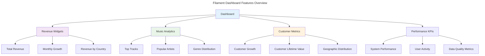

# Filament Advanced Features Documentation

This directory contains comprehensive documentation for implementing advanced Filament 4 features in the Chinook admin panel, including widgets, custom pages, actions, and specialized functionality.

## Documentation Structure

### Dashboard & Widgets
1. **[Dashboard Configuration](010-dashboard-configuration.md)** - Main dashboard setup and layout
2. **[Widget Development](020-widget-development.md)** - Custom widgets and KPI cards
3. **[Chart Integration](030-chart-integration.md)** - Chart.js integration and data visualization
4. **[Real-time Updates](040-real-time-updates.md)** - Live data updates and notifications

### Advanced Functionality
5. **[Global Search](090-global-search.md)** - Cross-resource search implementation

### Form & Table Enhancements
6. **[Advanced Forms](../resources/120-form-components.md)** - Complex form components and validation
7. **[Table Features](../resources/130-table-features.md)** - Advanced table functionality and filtering
8. **[Bulk Operations](../resources/140-bulk-operations.md)** - Mass operations and batch processing
9. **[Relationship Management](../resources/120-relationship-managers.md)** - Complex relationship handling

### Integration Features
10. **[Media Library](../../060-chinook-media-library-guide.md)** - File management and media handling
11. **[Activity Logging](../../packages/120-spatie-activitylog-guide.md)** - Audit trails and user activity tracking

## Feature Architecture

### Widget System

The Chinook admin panel implements a comprehensive widget system for real-time analytics and KPI monitoring:



### Custom Page Types

#### Analytics Pages
- **Sales Analytics**: Revenue trends, top-selling tracks, customer analysis
- **Music Analytics**: Genre popularity, artist performance, track statistics
- **Customer Analytics**: Customer behavior, geographic distribution, lifetime value
- **Performance Analytics**: System performance, user activity, data quality

#### Management Pages
- **Employee Hierarchy**: Organizational chart with interactive tree visualization
- **Music Discovery**: Recommendation engine and content discovery tools
- **Inventory Management**: Stock levels, media type distribution, availability tracking
- **System Administration**: Configuration, maintenance, and monitoring tools

### Advanced Form Features

#### Dynamic Form Components
- **Conditional Fields**: Show/hide fields based on other field values
- **Repeater Sections**: Dynamic form sections for complex data structures
- **File Upload Management**: Advanced file handling with validation and processing
- **Relationship Selectors**: Efficient relationship selection with search and filtering

#### Real-time Validation
- **Live Validation**: Immediate feedback on field changes
- **Custom Rules**: Business-specific validation rules
- **Cross-field Validation**: Validation that depends on multiple field values
- **Async Validation**: Server-side validation for complex business rules

### Table Enhancement Features

#### Advanced Filtering
- **Date Range Filters**: Flexible date range selection with presets
- **Relationship Filters**: Filter by related model attributes
- **Custom Filter Components**: Specialized filters for business logic
- **Saved Filter Sets**: User-defined filter combinations

#### Bulk Operations
- **Mass Updates**: Update multiple records simultaneously
- **Batch Processing**: Background processing for large operations
- **Custom Bulk Actions**: Business-specific mass operations
- **Progress Tracking**: Real-time progress for long-running operations

## Key Implementation Patterns

### Widget Development Pattern

```php
<?php

namespace App\Filament\ChinookAdmin\Widgets;

use Filament\Widgets\ChartWidget;
use Illuminate\Support\Carbon;

class RevenueChart extends ChartWidget
{
    protected static ?string $heading = 'Revenue Trend';
    
    protected static ?int $sort = 1;
    
    protected int | string | array $columnSpan = 'full';

    protected function getData(): array
    {
        $data = $this->getRevenueData();
        
        return [
            'datasets' => [
                [
                    'label' => 'Revenue',
                    'data' => $data['values'],
                    'backgroundColor' => 'rgba(59, 130, 246, 0.1)',
                    'borderColor' => 'rgb(59, 130, 246)',
                ],
            ],
            'labels' => $data['labels'],
        ];
    }

    protected function getType(): string
    {
        return 'line';
    }

    private function getRevenueData(): array
    {
        // Implementation for revenue data collection
        return [
            'labels' => ['Jan', 'Feb', 'Mar', 'Apr', 'May', 'Jun'],
            'values' => [1200, 1900, 3000, 5000, 2000, 3000],
        ];
    }
}
```

### Custom Page Pattern

```php
<?php

namespace App\Filament\ChinookAdmin\Pages;

use Filament\Pages\Page;
use Filament\Actions\Action;

class SalesAnalytics extends Page
{
    protected static ?string $navigationIcon = 'heroicon-o-chart-bar';
    
    protected static ?string $navigationGroup = 'Analytics & Reports';
    
    protected static string $view = 'filament.chinook-admin.pages.sales-analytics';

    protected function getHeaderActions(): array
    {
        return [
            Action::make('export')
                ->label('Export Report')
                ->icon('heroicon-o-arrow-down-tray')
                ->action('exportReport'),
                
            Action::make('refresh')
                ->label('Refresh Data')
                ->icon('heroicon-o-arrow-path')
                ->action('refreshData'),
        ];
    }

    public function exportReport(): void
    {
        // Implementation for report export
    }

    public function refreshData(): void
    {
        // Implementation for data refresh
    }
}
```

### Global Search Implementation

```php
// In each resource
public static function getGlobalSearchEloquentQuery(): Builder
{
    return parent::getGlobalSearchEloquentQuery()
        ->with(['albums', 'categories']);
}

public static function getGloballySearchableAttributes(): array
{
    return [
        'name',
        'biography', 
        'albums.title',
        'categories.name'
    ];
}

public static function getGlobalSearchResultDetails(Model $record): array
{
    return [
        'Type' => 'Artist',
        'Albums' => $record->albums_count,
        'Country' => $record->country,
    ];
}
```

## Business Logic Integration

### Music Industry Workflows

#### Album Release Workflow
1. **Artist Creation**: Register new artists with complete metadata
2. **Album Planning**: Create album with release information
3. **Track Management**: Add tracks with proper categorization
4. **Media Upload**: Handle audio files and artwork
5. **Release Coordination**: Manage release dates and distribution

#### Sales Management Workflow
1. **Customer Registration**: Onboard new customers
2. **Order Processing**: Handle purchase transactions
3. **Invoice Generation**: Create and manage invoices
4. **Payment Processing**: Handle payment workflows
5. **Fulfillment**: Track order completion and delivery

#### Analytics and Reporting
1. **Data Collection**: Gather metrics from all system components
2. **Processing**: Calculate KPIs and performance metrics
3. **Visualization**: Present data through charts and dashboards
4. **Reporting**: Generate comprehensive reports
5. **Decision Support**: Provide insights for business decisions

### Performance Optimization

#### Caching Strategy
- **Query Caching**: Cache expensive database queries
- **Widget Caching**: Cache widget data with appropriate TTL
- **View Caching**: Cache rendered views for static content
- **API Response Caching**: Cache external API responses

#### Database Optimization
- **Eager Loading**: Prevent N+1 queries with proper relationship loading
- **Index Optimization**: Strategic database indexing for common queries
- **Query Optimization**: Efficient query patterns and database design
- **Connection Pooling**: Optimize database connection management

## Security Considerations

### Access Control
- **Role-Based Access**: Implement proper RBAC for all features
- **Feature-Level Permissions**: Control access to specific functionality
- **Data Filtering**: Ensure users only see authorized data
- **Audit Logging**: Track all user actions and system changes

### Data Protection
- **Input Validation**: Comprehensive validation for all user inputs
- **Output Sanitization**: Proper data sanitization for display
- **File Upload Security**: Secure file handling and validation
- **SQL Injection Prevention**: Use proper query builders and parameterization

## Testing Strategy

### Feature Testing
- **Widget Testing**: Test widget data accuracy and rendering
- **Page Testing**: Test custom page functionality and access control
- **Action Testing**: Test custom actions and workflows
- **Integration Testing**: Test feature interactions and dependencies

### Performance Testing
- **Load Testing**: Test system performance under load
- **Widget Performance**: Test widget rendering and data loading
- **Search Performance**: Test global search efficiency
- **Bulk Operation Testing**: Test mass operation performance

## Next Steps

1. **Implement Core Widgets** - Start with revenue and music analytics widgets
2. **Create Custom Pages** - Build sales analytics and employee hierarchy pages
3. **Add Advanced Features** - Implement global search and import/export
4. **Integrate Business Logic** - Add industry-specific workflows
5. **Optimize Performance** - Apply caching and optimization strategies
6. **Test Thoroughly** - Implement comprehensive testing strategy

## Related Documentation

- **[Setup Documentation](../setup/)** - Panel configuration and authentication
- **[Resources Documentation](../resources/)** - Resource implementation guides
- **[Testing Documentation](../testing/)** - Testing strategies and examples
- **[Deployment Documentation](../deployment/)** - Production deployment guide
