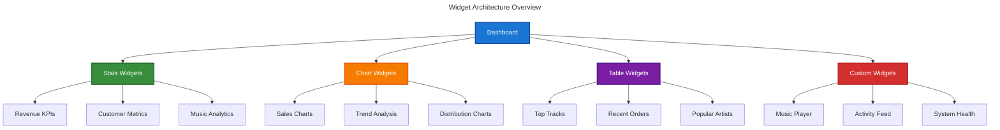

# Widget Development Guide

This guide covers the development of custom widgets for the Chinook admin panel, including KPI cards, charts, tables, and interactive components with real-time data updates.

## Table of Contents

- [Overview](#overview)
- [Widget Types](#widget-types)
- [Stats Widgets](#stats-widgets)
- [Chart Widgets](#chart-widgets)
- [Table Widgets](#table-widgets)
- [Custom Widgets](#custom-widgets)
- [Real-time Updates](#real-time-updates)
- [Performance Optimization](#performance-optimization)

## Overview

Filament widgets provide powerful components for displaying data and analytics in the Chinook admin panel. This guide covers creating various widget types optimized for music store analytics and management.

### Widget Architecture



## Widget Types

### Available Widget Base Classes

- **StatsOverviewWidget**: For displaying key performance indicators
- **ChartWidget**: For data visualization with Chart.js integration
- **TableWidget**: For displaying tabular data with sorting and filtering
- **Widget**: Base class for completely custom widgets

## Stats Widgets

### Revenue Overview Widget

Create a comprehensive revenue statistics widget:

```php
<?php

namespace App\Filament\ChinookAdmin\Widgets;

use App\Models\Invoice;
use Filament\Widgets\StatsOverviewWidget as BaseWidget;
use Filament\Widgets\StatsOverviewWidget\Stat;
use Illuminate\Support\Facades\Cache;

class RevenueOverview extends BaseWidget
{
    protected static ?string $pollingInterval = '30s';
    
    protected static bool $isLazy = true;

    protected function getStats(): array
    {
        return Cache::remember('widgets.revenue.overview', 300, function () {
            $totalRevenue = Invoice::sum('total');
            $monthlyRevenue = Invoice::whereMonth('created_at', now()->month)->sum('total');
            $previousMonthRevenue = Invoice::whereMonth('created_at', now()->subMonth()->month)->sum('total');
            
            $growthRate = $previousMonthRevenue > 0 
                ? (($monthlyRevenue - $previousMonthRevenue) / $previousMonthRevenue) * 100 
                : 0;

            return [
                Stat::make('Total Revenue', '$' . number_format($totalRevenue, 2))
                    ->description('All-time revenue')
                    ->descriptionIcon('heroicon-m-currency-dollar')
                    ->color('success'),

                Stat::make('Monthly Revenue', '$' . number_format($monthlyRevenue, 2))
                    ->description(($growthRate >= 0 ? '+' : '') . number_format($growthRate, 1) . '% from last month')
                    ->descriptionIcon($growthRate >= 0 ? 'heroicon-m-arrow-trending-up' : 'heroicon-m-arrow-trending-down')
                    ->color($growthRate >= 0 ? 'success' : 'danger')
                    ->chart($this->getMonthlyRevenueChart()),

                Stat::make('Average Order Value', '$' . number_format($totalRevenue / max(Invoice::count(), 1), 2))
                    ->description('Per invoice average')
                    ->descriptionIcon('heroicon-m-calculator')
                    ->color('info'),
            ];
        });
    }

    private function getMonthlyRevenueChart(): array
    {
        return Invoice::selectRaw('DATE(created_at) as date, SUM(total) as revenue')
            ->whereMonth('created_at', now()->month)
            ->groupBy('date')
            ->orderBy('date')
            ->pluck('revenue')
            ->toArray();
    }
}
```

### Customer Metrics Widget

Track customer-related KPIs:

```php
<?php

namespace App\Filament\ChinookAdmin\Widgets;

use App\Models\Customer;
use App\Models\Invoice;
use Filament\Widgets\StatsOverviewWidget as BaseWidget;
use Filament\Widgets\StatsOverviewWidget\Stat;

class CustomerMetrics extends BaseWidget
{
    protected static ?string $pollingInterval = '60s';

    protected function getStats(): array
    {
        $totalCustomers = Customer::count();
        $newCustomersThisMonth = Customer::whereMonth('created_at', now()->month)->count();
        $activeCustomers = Customer::whereHas('invoices', function ($query) {
            $query->where('created_at', '>=', now()->subDays(30));
        })->count();

        $averageLifetimeValue = Invoice::avg('total');

        return [
            Stat::make('Total Customers', number_format($totalCustomers))
                ->description('Registered customers')
                ->descriptionIcon('heroicon-m-users')
                ->color('primary'),

            Stat::make('New This Month', number_format($newCustomersThisMonth))
                ->description('New customer registrations')
                ->descriptionIcon('heroicon-m-user-plus')
                ->color('success'),

            Stat::make('Active Customers', number_format($activeCustomers))
                ->description('Purchased in last 30 days')
                ->descriptionIcon('heroicon-m-heart')
                ->color('warning'),

            Stat::make('Avg. Lifetime Value', '$' . number_format($averageLifetimeValue, 2))
                ->description('Per customer revenue')
                ->descriptionIcon('heroicon-m-banknotes')
                ->color('info'),
        ];
    }
}
```

## Chart Widgets

### Sales Trend Chart

Create an interactive sales trend visualization:

```php
<?php

namespace App\Filament\ChinookAdmin\Widgets;

use App\Models\Invoice;
use Filament\Widgets\ChartWidget;
use Illuminate\Support\Carbon;

class SalesTrendChart extends ChartWidget
{
    protected static ?string $heading = 'Sales Trend';
    
    protected static ?int $sort = 2;
    
    protected int | string | array $columnSpan = 'full';
    
    protected static ?string $maxHeight = '400px';

    public ?string $filter = '30days';

    protected function getData(): array
    {
        $period = match ($this->filter) {
            '7days' => 7,
            '30days' => 30,
            '90days' => 90,
            '365days' => 365,
            default => 30,
        };

        $data = Invoice::selectRaw('DATE(created_at) as date, SUM(total) as revenue, COUNT(*) as orders')
            ->where('created_at', '>=', now()->subDays($period))
            ->groupBy('date')
            ->orderBy('date')
            ->get();

        return [
            'datasets' => [
                [
                    'label' => 'Revenue',
                    'data' => $data->pluck('revenue')->toArray(),
                    'backgroundColor' => 'rgba(59, 130, 246, 0.1)',
                    'borderColor' => 'rgb(59, 130, 246)',
                    'borderWidth' => 2,
                    'fill' => true,
                    'tension' => 0.4,
                    'yAxisID' => 'y',
                ],
                [
                    'label' => 'Orders',
                    'data' => $data->pluck('orders')->toArray(),
                    'backgroundColor' => 'rgba(16, 185, 129, 0.1)',
                    'borderColor' => 'rgb(16, 185, 129)',
                    'borderWidth' => 2,
                    'fill' => true,
                    'tension' => 0.4,
                    'yAxisID' => 'y1',
                ],
            ],
            'labels' => $data->pluck('date')->map(fn ($date) => Carbon::parse($date)->format('M j'))->toArray(),
        ];
    }

    protected function getType(): string
    {
        return 'line';
    }

    protected function getOptions(): array
    {
        return [
            'responsive' => true,
            'maintainAspectRatio' => false,
            'interaction' => [
                'intersect' => false,
                'mode' => 'index',
            ],
            'scales' => [
                'y' => [
                    'type' => 'linear',
                    'display' => true,
                    'position' => 'left',
                    'title' => [
                        'display' => true,
                        'text' => 'Revenue ($)',
                    ],
                ],
                'y1' => [
                    'type' => 'linear',
                    'display' => true,
                    'position' => 'right',
                    'title' => [
                        'display' => true,
                        'text' => 'Orders',
                    ],
                    'grid' => [
                        'drawOnChartArea' => false,
                    ],
                ],
            ],
            'plugins' => [
                'legend' => [
                    'display' => true,
                    'position' => 'top',
                ],
                'tooltip' => [
                    'mode' => 'index',
                    'intersect' => false,
                ],
            ],
        ];
    }

    protected function getFilters(): ?array
    {
        return [
            '7days' => 'Last 7 days',
            '30days' => 'Last 30 days',
            '90days' => 'Last 90 days',
            '365days' => 'Last year',
        ];
    }
}
```

### Genre Distribution Chart

Visualize music genre popularity:

```php
<?php

namespace App\Filament\ChinookAdmin\Widgets;

use App\Models\Category;
use App\Models\Track;
use App\Enums\CategoryType;
use Filament\Widgets\ChartWidget;

class GenreDistributionChart extends ChartWidget
{
    protected static ?string $heading = 'Music Genre Distribution';
    
    protected int | string | array $columnSpan = [
        'md' => 2,
        'xl' => 1,
    ];

    protected function getData(): array
    {
        $genres = Category::where('type', CategoryType::GENRE)
            ->withCount(['tracks' => function ($query) {
                $query->whereHas('invoiceLines');
            }])
            ->having('tracks_count', '>', 0)
            ->orderByDesc('tracks_count')
            ->limit(8)
            ->get();

        $colors = [
            '#3B82F6', '#10B981', '#F59E0B', '#EF4444',
            '#8B5CF6', '#06B6D4', '#84CC16', '#F97316',
        ];

        return [
            'datasets' => [
                [
                    'data' => $genres->pluck('tracks_count')->toArray(),
                    'backgroundColor' => array_slice($colors, 0, $genres->count()),
                    'borderWidth' => 2,
                    'borderColor' => '#ffffff',
                ],
            ],
            'labels' => $genres->pluck('name')->toArray(),
        ];
    }

    protected function getType(): string
    {
        return 'doughnut';
    }

    protected function getOptions(): array
    {
        return [
            'responsive' => true,
            'maintainAspectRatio' => false,
            'plugins' => [
                'legend' => [
                    'display' => true,
                    'position' => 'bottom',
                ],
                'tooltip' => [
                    'callbacks' => [
                        'label' => 'function(context) {
                            const total = context.dataset.data.reduce((a, b) => a + b, 0);
                            const percentage = ((context.parsed / total) * 100).toFixed(1);
                            return context.label + ": " + context.parsed + " (" + percentage + "%)";
                        }',
                    ],
                ],
            ],
        ];
    }
}
```

## Table Widgets

### Top Tracks Widget

Display best-performing tracks in a table format:

```php
<?php

namespace App\Filament\ChinookAdmin\Widgets;

use App\Models\Track;
use Filament\Tables;
use Filament\Tables\Table;
use Filament\Widgets\TableWidget as BaseWidget;
use Illuminate\Database\Eloquent\Builder;

class TopTracksWidget extends BaseWidget
{
    protected static ?string $heading = 'Top Performing Tracks';
    
    protected int | string | array $columnSpan = 'full';
    
    protected static ?int $sort = 3;

    public function table(Table $table): Table
    {
        return $table
            ->query($this->getTableQuery())
            ->columns([
                Tables\Columns\TextColumn::make('name')
                    ->label('Track')
                    ->searchable()
                    ->sortable()
                    ->limit(30),
                    
                Tables\Columns\TextColumn::make('album.artist.name')
                    ->label('Artist')
                    ->searchable()
                    ->sortable(),
                    
                Tables\Columns\TextColumn::make('album.title')
                    ->label('Album')
                    ->searchable()
                    ->sortable()
                    ->limit(25),
                    
                Tables\Columns\TextColumn::make('total_sold')
                    ->label('Units Sold')
                    ->sortable()
                    ->alignEnd()
                    ->badge()
                    ->color('success'),
                    
                Tables\Columns\TextColumn::make('total_revenue')
                    ->label('Revenue')
                    ->sortable()
                    ->alignEnd()
                    ->money('USD')
                    ->color('primary'),
                    
                Tables\Columns\TextColumn::make('unit_price')
                    ->label('Price')
                    ->money('USD')
                    ->alignEnd(),
            ])
            ->defaultSort('total_sold', 'desc')
            ->paginated([10, 25, 50])
            ->poll('60s');
    }

    protected function getTableQuery(): Builder
    {
        return Track::query()
            ->select([
                'tracks.*',
                \DB::raw('COALESCE(SUM(invoice_lines.quantity), 0) as total_sold'),
                \DB::raw('COALESCE(SUM(invoice_lines.quantity * invoice_lines.unit_price), 0) as total_revenue'),
            ])
            ->leftJoin('invoice_lines', 'tracks.id', '=', 'invoice_lines.track_id')
            ->with(['album.artist'])
            ->groupBy('tracks.id')
            ->having('total_sold', '>', 0);
    }
}
```

## Custom Widgets

### System Health Widget

Create a custom widget for monitoring system health:

```php
<?php

namespace App\Filament\ChinookAdmin\Widgets;

use Filament\Widgets\Widget;
use Illuminate\Support\Facades\DB;
use Illuminate\Support\Facades\Cache;

class SystemHealthWidget extends Widget
{
    protected static string $view = 'filament.chinook-admin.widgets.system-health';
    
    protected static ?int $sort = 10;
    
    protected static ?string $pollingInterval = '30s';

    public function getViewData(): array
    {
        return Cache::remember('widgets.system.health', 60, function () {
            return [
                'database_status' => $this->getDatabaseStatus(),
                'cache_status' => $this->getCacheStatus(),
                'storage_usage' => $this->getStorageUsage(),
                'response_time' => $this->getAverageResponseTime(),
            ];
        });
    }

    private function getDatabaseStatus(): array
    {
        try {
            $start = microtime(true);
            DB::connection()->getPdo();
            $connectionTime = (microtime(true) - $start) * 1000;
            
            return [
                'status' => 'healthy',
                'connection_time' => round($connectionTime, 2),
                'message' => 'Database connection successful',
            ];
        } catch (\Exception $e) {
            return [
                'status' => 'error',
                'connection_time' => null,
                'message' => 'Database connection failed',
            ];
        }
    }

    private function getCacheStatus(): array
    {
        try {
            Cache::put('health_check', 'test', 10);
            $value = Cache::get('health_check');
            
            return [
                'status' => $value === 'test' ? 'healthy' : 'warning',
                'message' => $value === 'test' ? 'Cache working properly' : 'Cache not responding',
            ];
        } catch (\Exception $e) {
            return [
                'status' => 'error',
                'message' => 'Cache system error',
            ];
        }
    }

    private function getStorageUsage(): array
    {
        $databasePath = database_path('chinook_admin.sqlite');
        
        if (file_exists($databasePath)) {
            $size = filesize($databasePath);
            $sizeInMB = round($size / 1024 / 1024, 2);
            
            return [
                'size_mb' => $sizeInMB,
                'status' => $sizeInMB < 1000 ? 'healthy' : 'warning',
                'message' => "Database size: {$sizeInMB} MB",
            ];
        }
        
        return [
            'size_mb' => 0,
            'status' => 'error',
            'message' => 'Database file not found',
        ];
    }

    private function getAverageResponseTime(): array
    {
        // This would typically come from application monitoring
        return [
            'avg_time' => 45,
            'status' => 'healthy',
            'message' => 'Average response time: 45ms',
        ];
    }
}
```

### System Health Widget View

Create the corresponding Blade view:

```blade
{{-- resources/views/filament/chinook-admin/widgets/system-health.blade.php --}}
<x-filament-widgets::widget>
    <x-filament::section>
        <x-slot name="heading">
            System Health Monitor
        </x-slot>

        <div class="space-y-4">
            {{-- Database Status --}}
            <div class="flex items-center justify-between p-3 rounded-lg border {{ $this->getStatusColor($database_status['status']) }}">
                <div class="flex items-center space-x-3">
                    <x-heroicon-o-circle-stack class="w-5 h-5" />
                    <div>
                        <p class="font-medium">Database</p>
                        <p class="text-sm text-gray-600 dark:text-gray-400">{{ $database_status['message'] }}</p>
                    </div>
                </div>
                <div class="text-right">
                    @if($database_status['connection_time'])
                        <p class="text-sm font-medium">{{ $database_status['connection_time'] }}ms</p>
                    @endif
                    <x-filament::badge :color="$this->getStatusBadgeColor($database_status['status'])">
                        {{ ucfirst($database_status['status']) }}
                    </x-filament::badge>
                </div>
            </div>

            {{-- Cache Status --}}
            <div class="flex items-center justify-between p-3 rounded-lg border {{ $this->getStatusColor($cache_status['status']) }}">
                <div class="flex items-center space-x-3">
                    <x-heroicon-o-bolt class="w-5 h-5" />
                    <div>
                        <p class="font-medium">Cache System</p>
                        <p class="text-sm text-gray-600 dark:text-gray-400">{{ $cache_status['message'] }}</p>
                    </div>
                </div>
                <x-filament::badge :color="$this->getStatusBadgeColor($cache_status['status'])">
                    {{ ucfirst($cache_status['status']) }}
                </x-filament::badge>
            </div>

            {{-- Storage Usage --}}
            <div class="flex items-center justify-between p-3 rounded-lg border {{ $this->getStatusColor($storage_usage['status']) }}">
                <div class="flex items-center space-x-3">
                    <x-heroicon-o-server class="w-5 h-5" />
                    <div>
                        <p class="font-medium">Storage</p>
                        <p class="text-sm text-gray-600 dark:text-gray-400">{{ $storage_usage['message'] }}</p>
                    </div>
                </div>
                <x-filament::badge :color="$this->getStatusBadgeColor($storage_usage['status'])">
                    {{ ucfirst($storage_usage['status']) }}
                </x-filament::badge>
            </div>

            {{-- Response Time --}}
            <div class="flex items-center justify-between p-3 rounded-lg border {{ $this->getStatusColor($response_time['status']) }}">
                <div class="flex items-center space-x-3">
                    <x-heroicon-o-clock class="w-5 h-5" />
                    <div>
                        <p class="font-medium">Performance</p>
                        <p class="text-sm text-gray-600 dark:text-gray-400">{{ $response_time['message'] }}</p>
                    </div>
                </div>
                <x-filament::badge :color="$this->getStatusBadgeColor($response_time['status'])">
                    {{ ucfirst($response_time['status']) }}
                </x-filament::badge>
            </div>
        </div>
    </x-filament::section>
</x-filament-widgets::widget>

@script
<script>
    // Auto-refresh every 30 seconds
    setInterval(() => {
        $wire.$refresh();
    }, 30000);
</script>
@endscript
```

## Real-time Updates

### Polling Configuration

Configure automatic data refresh for widgets:

```php
// Refresh every 30 seconds
protected static ?string $pollingInterval = '30s';

// Refresh every 2 minutes
protected static ?string $pollingInterval = '2m';

// Disable polling
protected static ?string $pollingInterval = null;
```

### Manual Refresh Actions

Add manual refresh capabilities:

```php
public function refresh(): void
{
    Cache::forget('widgets.revenue.overview');
    $this->dispatch('$refresh');
}
```

## Performance Optimization

### Caching Strategies

Implement efficient caching for widget data:

```php
protected function getData(): array
{
    $cacheKey = 'widget.' . static::class . '.' . auth()->id();
    
    return Cache::remember($cacheKey, 300, function () {
        return $this->fetchData();
    });
}
```

### Lazy Loading

Enable lazy loading for non-critical widgets:

```php
protected static bool $isLazy = true;

protected function getViewData(): array
{
    if (!$this->hasBeenLoaded) {
        return ['loading' => true];
    }
    
    return parent::getViewData();
}
```

## Next Steps

1. **Create Core Widgets** - Implement the essential widgets for your dashboard
2. **Optimize Performance** - Apply caching and lazy loading strategies
3. **Add Interactivity** - Implement click-through and drill-down functionality
4. **Customize Styling** - Apply custom CSS and themes
5. **Test Responsiveness** - Ensure widgets work across all device sizes

## Related Documentation

- **[Dashboard Configuration](010-dashboard-configuration.md)** - Setting up the main dashboard
- **[Chart Integration](030-chart-integration.md)** - Advanced chart configuration
- **[Real-time Updates](040-real-time-updates.md)** - Live data updates and notifications
