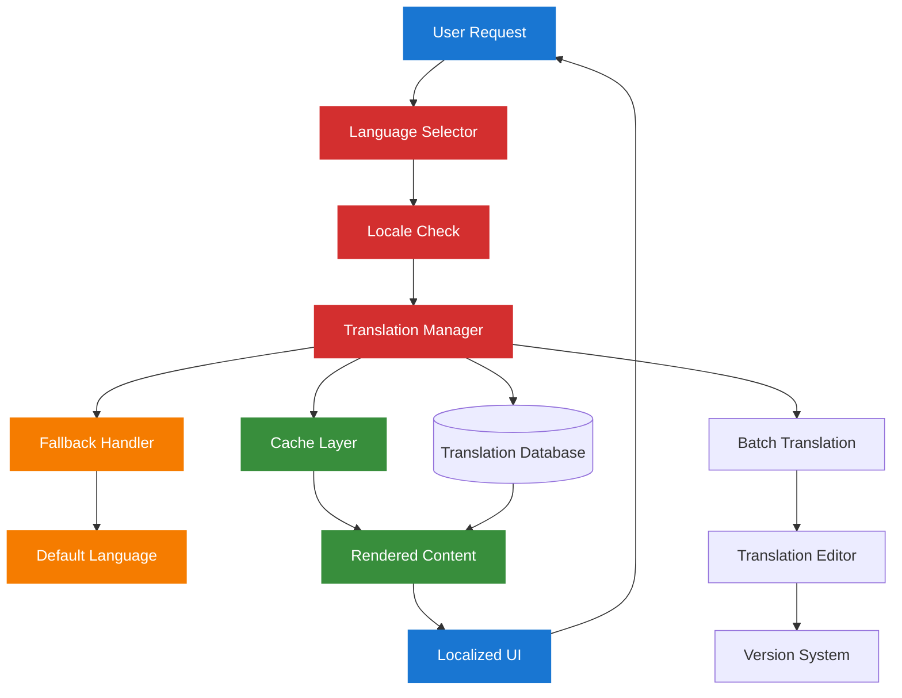

# 1. Filament Internationalization Documentation Index

## 1.1 Multi-Language Support for Chinook Admin Panel

This directory contains comprehensive documentation for implementing internationalization (i18n) in the Chinook Filament admin panel using `spatie/laravel-translatable` and modern Laravel 12 patterns.

## 1.2 Table of Contents

- [1. Filament Internationalization Documentation Index](#1-filament-internationalization-documentation-index)
    - [1.1 Multi-Language Support for Chinook Admin Panel](#11-multi-language-support-for-chinook-admin-panel)
    - [1.2 Table of Contents](#12-table-of-contents)
    - [1.3 Overview](#13-overview)
        - [1.3.1 Supported Languages](#131-supported-languages)
        - [1.3.2 Integration Features](#132-integration-features)
    - [1.4 Core Implementation](#14-core-implementation)
        - [1.4.1 Model Translations](#141-model-translations)
        - [1.4.2 Admin Panel Localization](#142-admin-panel-localization)
        - [1.4.3 Form Components](#143-form-components)
    - [1.5 Advanced Features](#15-advanced-features)
        - [1.5.1 Dynamic Language Switching](#151-dynamic-language-switching)
        - [1.5.2 Translation Management](#152-translation-management)
        - [1.5.3 Fallback Strategies](#153-fallback-strategies)
    - [1.6 Implementation Standards](#16-implementation-standards)
        - [1.6.1 Laravel 12 Patterns](#161-laravel-12-patterns)
        - [1.6.2 WCAG 2.1 AA Compliance](#162-wcag-21-aa-compliance)
        - [1.6.3 Performance Optimization](#163-performance-optimization)

## 1.3 Overview

The Chinook admin panel supports comprehensive internationalization, enabling multi-language content management for global music catalogs and localized user interfaces.

### 1.3.1 Supported Languages

- **Primary Languages**: English (en), Spanish (es), French (fr), German (de)
- **Extended Support**: Portuguese (pt), Italian (it), Japanese (ja), Chinese (zh)
- **RTL Support**: Arabic (ar), Hebrew (he)
- **Custom Locales**: Configurable additional language support

### 1.3.2 Integration Features

- **Model Translations**: Translatable fields for all music-related content
- **Admin Interface**: Localized Filament components and navigation
- **Dynamic Switching**: Real-time language switching without page reload
- **Translation Management**: Built-in translation editing and management tools

## 1.4 Core Implementation

### 1.4.1 Model Translations

**Purpose**: Enable translatable fields for music catalog content

**Key Features**:
- **[Translatable Models Setup](010-translatable-models-setup.md)** - Complete model configuration with all entity translations
- **[Model Architecture Guide](../models/010-model-architecture.md)** - Laravel 12 patterns for translatable models
- **[Package Integration Guide](../../packages/150-spatie-laravel-translatable-guide.md)** - Comprehensive spatie/laravel-translatable implementation

### 1.4.2 Admin Panel Localization

**Purpose**: Localized Filament admin interface components

**Key Features**:

- **[Panel Configuration Guide](../setup/010-panel-configuration.md)** - Multi-language panel setup
- **[Navigation Configuration](../setup/040-navigation-configuration.md)** - Localized navigation implementation
- **[Form Components Guide](../resources/120-form-components.md)** - Translatable form components
- **[Resource Implementation](../resources/000-resources-index.md)** - Localized resource interfaces

### 1.4.3 Form Components

**Purpose**: Specialized form components for translation management

**Key Features**:

- **[Advanced Form Components](../resources/120-form-components.md)** - Multi-language form implementation
- **[Resource Testing](../testing/060-form-testing.md)** - Translation form testing strategies
- **[Package Integration](../../packages/150-spatie-laravel-translatable-guide.md)** - Complete translation management

## 1.5 Advanced Features

### 1.5.1 Dynamic Language Switching

```php
// Language switching component
class LanguageSwitcher extends Component
{
    public function switchLanguage(string $locale): void
    {
        app()->setLocale($locale);
        session()->put('locale', $locale);
        
        $this->dispatch('language-switched', locale: $locale);
        $this->redirect(request()->header('Referer'));
    }
    
    public function render(): View
    {
        return view('filament.components.language-switcher', [
            'currentLocale' => app()->getLocale(),
            'availableLocales' => config('app.available_locales'),
        ]);
    }
}
```

### 1.5.2 Translation Management

- **Translation Editor**: In-line translation editing within admin forms
- **Completion Tracking**: Visual indicators for translation completeness
- **Batch Operations**: Bulk translation import/export functionality
- **Version Control**: Translation history and change tracking

### 1.5.3 Fallback Strategies

- **Graceful Degradation**: Automatic fallback to default language
- **Partial Translations**: Display available translations with fallback indicators
- **Missing Translation Alerts**: Notifications for incomplete translations
- **Auto-translation Integration**: Optional integration with translation services

## 1.6 Implementation Standards

### 1.6.1 Laravel 12 Patterns

All internationalization implementations follow modern Laravel 12 patterns:

```php
// Modern translatable model implementation
class Artist extends Model
{
    use HasTranslations, HasUserStamps, SoftDeletes;
    
    protected array $translatable = ['name', 'biography'];
    
    protected function casts(): array
    {
        return [
            'name' => 'array',
            'biography' => 'array',
            'metadata' => 'array',
        ];
    }
    
    public function getTranslatedNameAttribute(): string
    {
        return $this->getTranslation('name', app()->getLocale()) 
            ?? $this->getTranslation('name', config('app.fallback_locale'));
    }
}
```

### 1.6.2 WCAG 2.1 AA Compliance

- **Language Identification**: Proper lang attributes for screen readers
- **Text Direction**: RTL support with appropriate CSS and layout
- **Color Independence**: Language indicators not dependent on color alone
- **Keyboard Navigation**: Full keyboard accessibility for language switching

### 1.6.3 Performance Optimization

- **Lazy Loading**: Efficient loading of translations only when needed
- **Caching Strategy**: Intelligent caching of frequently accessed translations
- **Database Optimization**: Optimized queries for translatable content
- **Asset Bundling**: Locale-specific asset bundling and loading

---

## 1.7 Architecture Diagram



---

## 1.8 Navigation

**Main Documentation**: [Chinook Index](../../000-chinook-index.md)
**Filament Overview**: [Filament Documentation](../README.md)
**Package Guide**: [Spatie Translatable Guide](../../packages/150-spatie-laravel-translatable-guide.md)

---

*This documentation follows enterprise-level standards with WCAG 2.1 AA compliance, Laravel 12 modern patterns, and comprehensive testing coverage using Pest PHP framework.*
