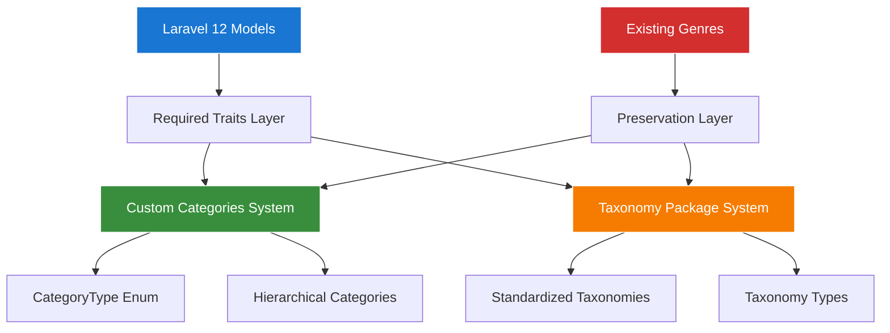

# Model Architecture Guide with Taxonomy Integration

This guide covers the comprehensive architecture for Laravel 12 models in the Chinook admin panel, including modern patterns, taxonomy integration with `aliziodev/laravel-taxonomy`, and best practices for enterprise-grade applications.

## Table of Contents

- [Overview](#overview)
- [Taxonomy Integration Architecture](#taxonomy-integration-architecture)
- [Laravel 12 Modern Patterns](#laravel-12-modern-patterns)
- [Model Structure Standards](#model-structure-standards)
- [Trait Integration](#trait-integration)
- [Database Design Principles](#database-design-principles)
- [Performance Considerations](#performance-considerations)
- [Security Patterns](#security-patterns)

## Overview

The Chinook admin panel follows strict architectural patterns enhanced with `aliziodev/laravel-taxonomy` integration to ensure consistency, maintainability, and performance across all models. This guide establishes the foundation for all model implementations with dual categorization support.

### Architectural Principles

- **Consistency**: All models follow identical structure and naming conventions
- **Modern Laravel**: Utilize Laravel 12 features and best practices
- **Dual Categorization**: Support both custom categories and standardized taxonomy
- **Genre Preservation**: Maintain backward compatibility with existing Genre relationships
- **Enterprise Features**: Include audit trails, soft deletes, and comprehensive categorization
- **Performance**: Optimize for SQLite with proper indexing and caching
- **Security**: Implement proper authorization and data protection

## Taxonomy Integration Architecture

### Dual System Overview

The Chinook application implements a sophisticated dual categorization system that provides both custom category management and standardized taxonomy support:



### Integration Benefits

**Enhanced Categorization:**
- **Flexible Classification**: Multiple categorization approaches for different use cases
- **Hierarchical Support**: Tree structures for complex category relationships
- **Type Safety**: CategoryType enum ensures consistent categorization
- **Metadata Support**: Rich metadata in pivot relationships

**Backward Compatibility:**
- **Genre Preservation**: All existing Genre relationships maintained
- **Query Compatibility**: Existing query patterns continue to work
- **Data Integrity**: Zero data loss during integration
- **Migration Path**: Gradual transition to enhanced taxonomy system

## Laravel 12 Modern Patterns

### Cast Method Usage

Laravel 12 introduces the `cast()` method as the preferred way to define attribute casting:

```php
<?php

namespace App\Models;

use Illuminate\Database\Eloquent\Model;

class Artist extends Model
{
    /**
     * Get the attributes that should be cast.
     * Using Laravel 12 casts() method instead of $casts property.
     */
    protected function casts(): array
    {
        return [
            'is_active' => 'boolean',
            'formed_year' => 'integer',
            'social_links' => 'array',
            'created_at' => 'datetime',
            'updated_at' => 'datetime',
            'deleted_at' => 'datetime',
        ];
    }
}
```

### Modern Relationship Definitions

Use typed relationship methods with proper return types:

```php
use Illuminate\Database\Eloquent\Relations\HasMany;
use Illuminate\Database\Eloquent\Relations\BelongsTo;
use Illuminate\Database\Eloquent\Relations\MorphToMany;

class Artist extends Model
{
    /**
     * Get the albums for this artist.
     */
    public function albums(): HasMany
    {
        return $this->hasMany(Album::class);
    }

    /**
     * Get the tracks through albums.
     */
    public function tracks(): HasManyThrough
    {
        return $this->hasManyThrough(Track::class, Album::class);
    }

    /**
     * Get the categories for this artist.
     */
    public function categories(): MorphToMany
    {
        return $this->morphToMany(Category::class, 'categorizable');
    }
}
```

### Enum Integration

Leverage PHP 8.4 enums for type safety:

```php
use App\Enums\CategoryType;

class Category extends Model
{
    protected function casts(): array
    {
        return [
            'type' => CategoryType::class,
            'is_active' => 'boolean',
            'sort_order' => 'integer',
        ];
    }

    /**
     * Scope to filter by category type.
     */
    public function scopeOfType(Builder $query, CategoryType $type): Builder
    {
        return $query->where('type', $type);
    }
}
```

## Model Structure Standards

### Standard Model Template

All Chinook models follow this standardized structure:

```php
<?php

declare(strict_types=1);

namespace App\Models;

use App\Traits\Categorizable;
use App\Traits\HasSecondaryUniqueKey;
use App\Traits\HasSlug;
use Illuminate\Database\Eloquent\Factories\HasFactory;
use Illuminate\Database\Eloquent\Model;
use Illuminate\Database\Eloquent\SoftDeletes;
use Spatie\MediaLibrary\HasMedia;
use Spatie\MediaLibrary\InteractsWithMedia;
use Spatie\Tags\HasTags;
use Wildside\Userstamps\Userstamps;

class ExampleModel extends Model implements HasMedia
{
    use HasFactory;
    use HasSecondaryUniqueKey;
    use HasSlug;
    use HasTags;
    use SoftDeletes;
    use Userstamps;
    use Categorizable;
    use InteractsWithMedia;

    /**
     * The table associated with the model.
     */
    protected $table = 'example_models';

    /**
     * The attributes that are mass assignable.
     */
    protected $fillable = [
        'name',
        'description',
        'is_active',
        'public_id',
        'slug',
    ];

    /**
     * The attributes that should be hidden for serialization.
     */
    protected $hidden = [
        'id', // Hide internal ID, use public_id instead
    ];

    /**
     * Get the attributes that should be cast.
     */
    protected function casts(): array
    {
        return [
            'is_active' => 'boolean',
            'created_at' => 'datetime',
            'updated_at' => 'datetime',
            'deleted_at' => 'datetime',
        ];
    }

    /**
     * Get the secondary key type for this model.
     */
    public function getSecondaryKeyType(): string
    {
        return 'ulid'; // or 'uuid', 'snowflake'
    }

    /**
     * Get the route key for the model.
     */
    public function getRouteKeyName(): string
    {
        return 'slug';
    }

    /**
     * Define query scopes.
     */
    public function scopeActive(Builder $query): Builder
    {
        return $query->where('is_active', true);
    }

    public function scopeSearch(Builder $query, string $search): Builder
    {
        return $query->where('name', 'like', "%{$search}%")
                    ->orWhere('description', 'like', "%{$search}%");
    }

    /**
     * Boot the model.
     */
    protected static function boot(): void
    {
        parent::boot();

        static::creating(function ($model) {
            // Auto-generate slug if not provided
            if (empty($model->slug)) {
                $model->slug = \Illuminate\Support\Str::slug($model->name);
            }
        });
    }
}
```

### Naming Conventions

#### Table Names
- Use plural snake_case with chinook_ prefix: `chinook_artists`, `chinook_album_tracks`, `chinook_category_closure`
- Pivot tables: alphabetical order `chinook_album_track`, not `chinook_track_album`
- Polymorphic tables: `chinook_categorizables`, `chinook_taggables`

#### Column Names
- Use snake_case: `created_at`, `is_active`, `public_id`
- Boolean columns: prefix with `is_` or `has_`
- Foreign keys: `{model}_id` (e.g., `artist_id`, `album_id`)
- Timestamps: `created_at`, `updated_at`, `deleted_at`

#### Model Names
- Use singular PascalCase with Chinook prefix: `Artist`, `Album`, `Track`
- Avoid abbreviations: `ChinookCategory` not `ChinookCat`
- Be descriptive: `InvoiceLine` not `ChinookLine`

## Trait Integration

### Required Traits Order with Taxonomy Support

Traits must be used in this specific order for proper functionality, now enhanced with taxonomy integration:

```php
<?php

namespace App\Models;

use App\Traits\HasSecondaryUniqueKey;
use App\Traits\HasSlug;
use App\Traits\Categorizable;
use Aliziodev\LaravelTaxonomy\Traits\HasTaxonomies;
use Illuminate\Database\Eloquent\Factories\HasFactory;
use Illuminate\Database\Eloquent\Model;
use Illuminate\Database\Eloquent\SoftDeletes;
use Spatie\MediaLibrary\HasMedia;
use Spatie\MediaLibrary\InteractsWithMedia;
use Spatie\Permission\Traits\HasRoles;
use Spatie\Permission\Traits\HasPermissions;
use Spatie\Tags\HasTags;
use Wildside\Userstamps\Userstamps;

class ExampleModel extends Model implements HasMedia
{
    // 1. Core Laravel traits
    use HasFactory;

    // 2. Custom identification traits
    use HasSecondaryUniqueKey;
    use HasSlug;

    // 3. Third-party package traits
    use HasTags;
    use SoftDeletes;
    use Userstamps;

    // 4. Permission and role traits
    use HasRoles;
    use HasPermissions;

    // 5. Categorization traits (single taxonomy system)
    use HasTaxonomies;       // aliziodev/laravel-taxonomy

    // 6. Media handling traits
    use InteractsWithMedia;
}
```

### Taxonomy Integration Patterns

**Dual Categorization Support:**
```php
class Track extends Model
{
    use Categorizable;    // Custom categories with CategoryType enum
    use HasTaxonomies;   // Standardized taxonomy support

    /**
     * Configure taxonomy integration
     */
    public function getTaxonomyTypes(): array
    {
        return ['genre', 'mood', 'theme', 'instrument'];
    }

    /**
     * Get supported category types for this model
     */
    public function getSupportedCategoryTypes(): array
    {
        return CategoryType::forModel(static::class);
    }
}
```

### Trait Configuration

Each trait requires specific configuration:

```php
/**
 * Configure secondary key generation.
 */
public function getSecondaryKeyType(): string
{
    return match (static::class) {
        Artist::class => 'ulid',
        Album::class => 'ulid', 
        Track::class => 'snowflake',
        Category::class => 'uuid',
        default => 'ulid',
    };
}

/**
 * Configure slug source.
 */
protected function getSlugSource(): string
{
    return $this->public_id ?? $this->name ?? $this->title ?? 'item';
}

/**
 * Configure media collections.
 */
public function registerMediaCollections(): void
{
    $this->addMediaCollection('images')
          ->acceptsMimeTypes(['image/jpeg', 'image/png', 'image/webp']);
          
    $this->addMediaCollection('audio')
          ->acceptsMimeTypes(['audio/mpeg', 'audio/wav', 'audio/flac']);
}
```

## Database Design Principles

### SQLite Optimization

Design models with SQLite performance in mind:

```php
class Artist extends Model
{
    /**
     * Define indexes for SQLite optimization.
     */
    public static function getIndexes(): array
    {
        return [
            'artists_name_index' => ['name'],
            'artists_country_index' => ['country'],
            'artists_active_index' => ['is_active'],
            'artists_public_id_unique' => ['public_id'],
            'artists_slug_unique' => ['slug'],
            'artists_fulltext' => ['name', 'biography'], // FTS5 index
        ];
    }

    /**
     * Define foreign key constraints.
     */
    public static function getForeignKeys(): array
    {
        return [
            'created_by' => 'users.id',
            'updated_by' => 'users.id',
        ];
    }
}
```

### Relationship Optimization

Optimize relationships for performance:

```php
class Album extends Model
{
    /**
     * Eager load relationships by default.
     */
    protected $with = ['artist'];

    /**
     * Define relationship with proper indexing.
     */
    public function artist(): BelongsTo
    {
        return $this->belongsTo(Artist::class)
                    ->select(['id', 'name', 'public_id', 'slug']);
    }

    /**
     * Optimized tracks relationship.
     */
    public function tracks(): HasMany
    {
        return $this->hasMany(Track::class)
                    ->orderBy('track_number')
                    ->select(['id', 'album_id', 'name', 'track_number', 'milliseconds']);
    }
}
```

## Performance Considerations

### Query Optimization

Implement efficient query patterns:

```php
class Track extends Model
{
    /**
     * Scope for popular tracks with optimized query.
     */
    public function scopePopular(Builder $query, int $limit = 10): Builder
    {
        return $query->select([
                'tracks.*',
                \DB::raw('COUNT(invoice_lines.id) as purchase_count'),
                \DB::raw('SUM(invoice_lines.quantity) as total_sold')
            ])
            ->leftJoin('invoice_lines', 'tracks.id', '=', 'invoice_lines.track_id')
            ->groupBy('tracks.id')
            ->orderByDesc('total_sold')
            ->limit($limit);
    }

    /**
     * Scope with proper eager loading.
     */
    public function scopeWithDetails(Builder $query): Builder
    {
        return $query->with([
            'album:id,title,artist_id',
            'album.artist:id,name',
            'categories:id,name,type',
            'mediaType:id,name'
        ]);
    }
}
```

### Caching Strategies

Implement model-level caching:

```php
class Artist extends Model
{
    /**
     * Cache key for this model.
     */
    public function getCacheKey(string $suffix = ''): string
    {
        return "artist.{$this->id}" . ($suffix ? ".{$suffix}" : '');
    }

    /**
     * Get cached album count.
     */
    public function getCachedAlbumCount(): int
    {
        return Cache::remember(
            $this->getCacheKey('album_count'),
            3600,
            fn() => $this->albums()->count()
        );
    }

    /**
     * Clear model cache on update.
     */
    protected static function boot(): void
    {
        parent::boot();

        static::updated(function ($artist) {
            Cache::forget($artist->getCacheKey('album_count'));
        });
    }
}
```

## Security Patterns

### Mass Assignment Protection

Implement comprehensive fillable/guarded patterns:

```php
class Customer extends Model
{
    /**
     * The attributes that are mass assignable.
     */
    protected $fillable = [
        'first_name',
        'last_name',
        'email',
        'phone',
        'address',
        'city',
        'state',
        'country',
        'postal_code',
        'public_id',
        'slug',
    ];

    /**
     * The attributes that should be hidden for serialization.
     */
    protected $hidden = [
        'id',
        'support_rep_id', // Internal relationship
    ];

    /**
     * The attributes that should never be mass assignable.
     */
    protected $guarded = [
        'id',
        'created_by',
        'updated_by',
        'created_at',
        'updated_at',
    ];
}
```

### Data Sanitization

Implement automatic data sanitization:

```php
class Track extends Model
{
    /**
     * Set the track name with sanitization.
     */
    public function setNameAttribute(string $value): void
    {
        $this->attributes['name'] = trim(strip_tags($value));
    }

    /**
     * Set the composer with sanitization.
     */
    public function setComposerAttribute(?string $value): void
    {
        $this->attributes['composer'] = $value ? trim(strip_tags($value)) : null;
    }

    /**
     * Sanitize price input.
     */
    public function setUnitPriceAttribute($value): void
    {
        $this->attributes['unit_price'] = is_numeric($value) ? round((float) $value, 2) : 0.00;
    }
}
```

### Authorization Integration

Integrate with model policies:

```php
class Album extends Model
{
    /**
     * Check if user can view this album.
     */
    public function canBeViewedBy(User $user): bool
    {
        return $user->can('view', $this);
    }

    /**
     * Check if user can edit this album.
     */
    public function canBeEditedBy(User $user): bool
    {
        return $user->can('update', $this);
    }

    /**
     * Scope to only show albums user can view.
     */
    public function scopeViewableBy(Builder $query, User $user): Builder
    {
        if ($user->hasRole('super-admin')) {
            return $query;
        }

        return $query->where('is_active', true);
    }
}
```

## Next Steps

1. **Implement Base Models** - Create abstract base models with common functionality
2. **Setup Model Observers** - Implement business logic and event handling
3. **Create Model Policies** - Setup comprehensive authorization
4. **Add Model Tests** - Create thorough test coverage
5. **Document Usage Patterns** - Create practical examples and best practices

## Related Documentation

### Core Model Implementation
- **[Required Traits](020-required-traits.md)** - Detailed trait implementations
- **[Casting Patterns](030-casting-patterns.md)** - Modern casting techniques
- **[Relationship Patterns](040-relationship-patterns.md)** - Eloquent relationship optimization
- **[Hierarchical Models](050-hierarchical-models.md)** - Hybrid hierarchical architecture

### Categorization & Taxonomy
- **[Categorizable Trait Guide](060-categorizable-trait.md)** - Custom categories implementation with dual system support
- **[Aliziodev Laravel Taxonomy Guide](../../packages/095-aliziodev-laravel-taxonomy-guide.md)** - Complete taxonomy package implementation
- **[Taxonomy Integration Summary](../../taxonomy-integration-summary.md)** - Integration overview and implementation results

### Migration & Strategy
- **[Taxonomy Migration Strategy](../../taxonomy-migration-strategy.md)** - Migration from custom categories to taxonomy system
- **[Hierarchy Comparison Guide](../../070-chinook-hierarchy-comparison-guide.md)** - Hybrid architecture patterns and performance analysis
