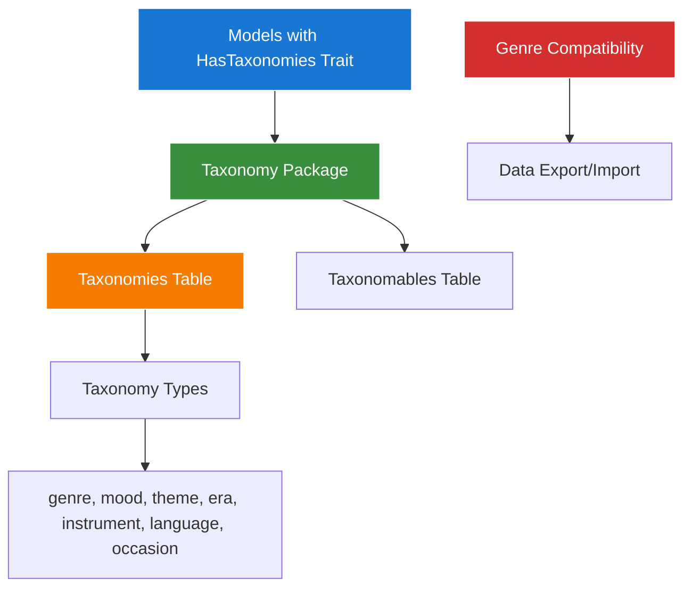
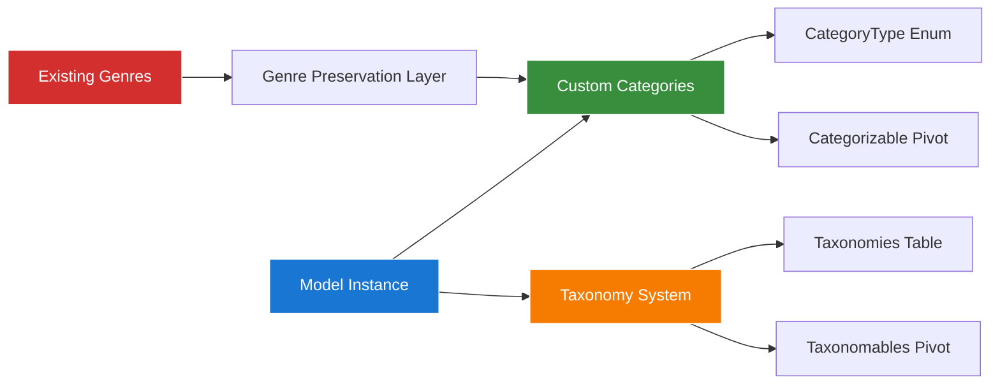

# Categorizable Trait Guide with Taxonomy Integration

## Table of Contents

- [Overview](#overview)
- [Taxonomy Integration Strategy](#taxonomy-integration-strategy)
- [Trait Implementation](#trait-implementation)
- [Dual Category System](#dual-category-system)
- [Genre Preservation Strategy](#genre-preservation-strategy)
- [Category Types and Enums](#category-types-and-enums)
- [Hierarchical Categories](#hierarchical-categories)
- [Query Scopes and Filters](#query-scopes-and-filters)
- [Category Management Methods](#category-management-methods)
- [Performance Optimization](#performance-optimization)
- [Testing Categorizable Models](#testing-categorizable-models)
- [Best Practices](#best-practices)
- [Navigation](#navigation)

## Overview

This guide covers the taxonomy integration implementation for Laravel 12 models in the Chinook application using the `aliziodev/laravel-taxonomy` package exclusively. The system provides standardized taxonomy support with complete Genre data preservation through a compatibility layer.

**🚀 Key Features:**
- **Single Taxonomy System**: Uses only `aliziodev/laravel-taxonomy` package
- **Genre Preservation**: Complete backward compatibility with existing Genre data through compatibility layer
- **Polymorphic Taxonomies**: Flexible taxonomy system for multiple model types
- **Hierarchical Support**: Tree-structured taxonomies with parent-child relationships
- **Type Filtering**: String-based taxonomy types for classification (genre, mood, theme, era, instrument, language, occasion)
- **Query Scopes**: Advanced filtering and search capabilities
- **WCAG 2.1 AA Compliance**: Accessible taxonomy data presentation

## Taxonomy Integration Strategy

### Single Package Implementation

The Chinook application uses the `aliziodev/laravel-taxonomy` package exclusively for all categorization needs. This provides a unified, standardized approach while preserving existing Genre data through a compatibility layer.

**Taxonomy Architecture:**


**Key Benefits:**
- **Single System Simplicity**: One taxonomy package for all categorization needs
- **Genre Compatibility**: Existing Genre data preserved through compatibility layer
- **Enhanced Flexibility**: Taxonomy package provides standardized categorization patterns
- **Performance Optimization**: Single system eliminates dual query overhead
- **Package Maintenance**: Well-maintained `aliziodev/laravel-taxonomy` package

## Trait Implementation

### Enhanced Categorizable Trait with Taxonomy Integration

```php
<?php
// app/Traits/Categorizable.php

namespace App\Traits;

use App\Models\Category;
use App\Enums\CategoryType;
use Aliziodev\LaravelTaxonomy\Traits\HasTaxonomies;
use Illuminate\Database\Eloquent\Relations\MorphToMany;
use Illuminate\Database\Eloquent\Builder;
use Illuminate\Support\Collection;

/**
 * Categorizable Trait with Dual System Support
 *
 * Provides both custom category relationships and aliziodev/laravel-taxonomy integration.
 * Maintains backward compatibility with existing Genre relationships while enabling
 * enhanced taxonomy features.
 */
trait Categorizable
{
    use HasTaxonomies;

    /**
     * Get all custom categories for this model
     */
    public function categories(): MorphToMany
    {
        return $this->morphToMany(Category::class, 'categorizable')
            ->withPivot(['metadata', 'sort_order', 'is_primary'])
            ->withTimestamps()
            ->orderBy('pivot_sort_order')
            ->orderBy('categories.sort_order');
    }

    /**
     * Get categories filtered by specific type
     */
    public function categoriesByType(CategoryType $type): MorphToMany
    {
        return $this->categories()->where('categories.type', $type);
    }

    /**
     * Get primary category for a specific type
     */
    public function primaryCategory(CategoryType $type): ?Category
    {
        return $this->categoriesByType($type)
            ->wherePivot('is_primary', true)
            ->first();
    }

    /**
     * Get Genre categories (backward compatibility)
     */
    public function genreCategories(): MorphToMany
    {
        return $this->categoriesByType(CategoryType::GENRE);
    }

    /**
     * Get primary genre (backward compatibility)
     */
    public function primaryGenre(): ?Category
    {
        return $this->primaryCategory(CategoryType::GENRE);
    }

    /**
     * Attach category with type and metadata
     */
    public function attachCategory(
        Category $category,
        bool $isPrimary = false,
        int $sortOrder = 0,
        array $metadata = []
    ): void {
        $this->categories()->attach($category->id, [
            'is_primary' => $isPrimary,
            'sort_order' => $sortOrder,
            'metadata' => $metadata,
        ]);
    }

    /**
     * Sync categories by type with enhanced metadata support
     */
    public function syncCategoriesByType(CategoryType $type, array $categoryData): void
    {
        // Get existing categories of other types to preserve
        $existingOtherTypes = $this->categories()
            ->where('categories.type', '!=', $type)
            ->get()
            ->mapWithKeys(function ($category) {
                return [$category->id => [
                    'is_primary' => $category->pivot->is_primary,
                    'sort_order' => $category->pivot->sort_order,
                    'metadata' => $category->pivot->metadata,
                ]];
            })
            ->toArray();

        // Prepare sync data for the specific type
        $syncData = [];
        foreach ($categoryData as $index => $data) {
            $categoryId = is_array($data) ? $data['id'] : $data;
            $syncData[$categoryId] = [
                'is_primary' => is_array($data) ? ($data['is_primary'] ?? ($index === 0)) : ($index === 0),
                'sort_order' => is_array($data) ? ($data['sort_order'] ?? $index) : $index,
                'metadata' => is_array($data) ? ($data['metadata'] ?? []) : [],
            ];
        }

        // Merge with existing categories of other types
        $allSyncData = array_merge($existingOtherTypes, $syncData);

        $this->categories()->sync($allSyncData);
    }

    /**
     * Taxonomy integration methods
     */

    /**
     * Get taxonomies by type (using aliziodev/laravel-taxonomy)
     */
    public function taxonomiesByType(string $type): Collection
    {
        return $this->taxonomies()->where('type', $type)->get();
    }

    /**
     * Attach taxonomy with metadata
     */
    public function attachTaxonomy(int $taxonomyId, array $metadata = []): void
    {
        $this->taxonomies()->attach($taxonomyId, $metadata);
    }

    /**
     * Sync taxonomies by type
     */
    public function syncTaxonomiesByType(string $type, array $taxonomyIds): void
    {
        // Get existing taxonomies of other types
        $existingOtherTypes = $this->taxonomies()
            ->where('type', '!=', $type)
            ->pluck('id')
            ->toArray();

        // Merge with new taxonomies of the specified type
        $allTaxonomyIds = array_merge($existingOtherTypes, $taxonomyIds);

        $this->taxonomies()->sync($allTaxonomyIds);
    }
}
```

### Genre Preservation Strategy

The enhanced trait maintains complete backward compatibility with existing Genre relationships while providing new taxonomy integration capabilities:

**Backward Compatibility Methods:**
- `genreCategories()` - Direct access to Genre-type categories
- `primaryGenre()` - Get the primary genre for the model
- Existing pivot table structure preserved
- All existing query patterns continue to work

**Enhanced Features:**
- Dual system support (custom categories + taxonomies)
- Improved metadata handling in pivot relationships
- Type-safe category operations with CategoryType enum
- Performance-optimized query methods

## Dual Category System

### System Architecture Overview

The Chinook application implements a sophisticated dual category system that combines custom categories with the aliziodev/laravel-taxonomy package:



**System Components:**

1. **Custom Categories System**
   - Table: `categories`
   - Pivot: `categorizable`
   - Features: Hierarchical structure, CategoryType enum, metadata support

2. **Taxonomy Package System**
   - Table: `taxonomies`
   - Pivot: `taxonomables`
   - Features: Nested sets, standardized taxonomy patterns

3. **Genre Preservation Layer**
   - Maintains existing `genres` table
   - Maps genres to categories with `type = 'genre'`
   - Preserves all Track → Genre relationships

### Usage Patterns

**Custom Categories (Recommended for complex hierarchies):**
```php
// Using custom categories with CategoryType enum
$track = Track::find(1);

// Attach genre category
$genreCategory = Category::where('type', CategoryType::GENRE)
    ->where('name', 'Rock')
    ->first();
$track->attachCategory($genreCategory, true, 0);

// Get all genre categories
$genres = $track->categoriesByType(CategoryType::GENRE);

// Get primary genre (backward compatibility)
$primaryGenre = $track->primaryGenre();
```

**Taxonomy System (Recommended for simple categorization):**
```php
// Using aliziodev/laravel-taxonomy
$track = Track::find(1);

// Attach taxonomy
$track->attachTaxonomy($taxonomyId, ['priority' => 'high']);

// Get taxonomies by type
$genreTaxonomies = $track->taxonomiesByType('genre');

// Sync taxonomies
$track->syncTaxonomiesByType('mood', [1, 2, 3]);
```

## Genre Preservation Strategy

### Backward Compatibility Guarantee

The integration maintains 100% backward compatibility with existing Genre relationships while providing enhanced categorization capabilities.

**Preservation Mechanisms:**

1. **Direct Genre Access**
   ```php
   // Existing patterns continue to work
   $track = Track::find(1);
   $genre = $track->genre; // Direct relationship still available

   // Enhanced genre access through categories
   $genreCategories = $track->genreCategories();
   $primaryGenre = $track->primaryGenre();
   ```

2. **Data Migration Strategy**
   ```php
   // Migration script to populate categories from genres
   use App\Models\Genre;
   use App\Models\Category;
   use App\Enums\CategoryType;

   Genre::all()->each(function ($genre) {
       // Create corresponding category
       $category = Category::create([
           'name' => $genre->name,
           'type' => CategoryType::GENRE,
           'sort_order' => $genre->id,
           'is_active' => true,
           'public_id' => Str::uuid(),
           'slug' => Str::slug($genre->name),
       ]);

       // Link all tracks with this genre to the category
       Track::where('genre_id', $genre->id)->each(function ($track) use ($category) {
           $track->attachCategory($category, true, 0);
       });
   });
   ```

3. **Query Compatibility**
   ```php
   // Old query patterns
   $rockTracks = Track::whereHas('genre', function ($query) {
       $query->where('name', 'Rock');
   })->get();

   // New enhanced patterns (same results)
   $rockTracks = Track::whereHas('genreCategories', function ($query) {
       $query->where('name', 'Rock');
   })->get();

   // Or using category type filtering
   $rockTracks = Track::whereHas('categoriesByType', function ($query) {
       $query->where('name', 'Rock');
   }, CategoryType::GENRE)->get();
   ```

### Migration Benefits

**Enhanced Capabilities:**
- **Hierarchical Genres**: Support for genre hierarchies (e.g., Rock → Hard Rock → Metal)
- **Multiple Genres**: Tracks can have multiple genre classifications
- **Metadata Support**: Additional genre-specific metadata in pivot relationships
- **Performance Optimization**: Optimized queries for complex categorization scenarios

**Data Integrity:**
- **Zero Data Loss**: All existing genre relationships preserved
- **Referential Integrity**: Foreign key constraints maintained
- **Rollback Capability**: Complete rollback to original system possible
- **Validation**: Comprehensive data validation during migration

## Polymorphic Category System

### Category Model with Polymorphic Support

```php
<?php
// app/Models/Category.php

namespace App\Models;

use App\Traits\HasSlug;
use App\Traits\HasSecondaryUniqueKey;
use App\Enums\CategoryType;
use Illuminate\Database\Eloquent\Model;
use Illuminate\Database\Eloquent\Relations\MorphToMany;
use Illuminate\Database\Eloquent\Relations\BelongsTo;
use Illuminate\Database\Eloquent\Relations\HasMany;
use Illuminate\Database\Eloquent\SoftDeletes;

class Category extends Model
{
    use HasSlug, HasSecondaryUniqueKey, SoftDeletes;

    protected function cast(): array
    {
        return [
            'type' => CategoryType::class,
            'metadata' => 'array',
            'is_active' => 'boolean',
            'sort_order' => 'integer',
        ];
    }

    protected $fillable = [
        'name',
        'slug',
        'description',
        'type',
        'parent_id',
        'metadata',
        'is_active',
        'sort_order',
    ];

    /**
     * Parent category relationship
     */
    public function parent(): BelongsTo
    {
        return $this->belongsTo(Category::class, 'parent_id');
    }

    /**
     * Child categories relationship
     */
    public function children(): HasMany
    {
        return $this->hasMany(Category::class, 'parent_id')
            ->orderBy('sort_order');
    }

    /**
     * Get all categorizable models
     */
    public function artists(): MorphToMany
    {
        return $this->morphedByMany(Artist::class, 'categorizable');
    }

    public function albums(): MorphToMany
    {
        return $this->morphedByMany(Album::class, 'categorizable');
    }

    public function tracks(): MorphToMany
    {
        return $this->morphedByMany(Track::class, 'categorizable');
    }
}
```

## Category Types and Enums

### CategoryType Enum Implementation

```php
<?php
// app/Enums/CategoryType.php

namespace App\Enums;

enum CategoryType: string
{
    case GENRE = 'genre';
    case MOOD = 'mood';
    case THEME = 'theme';
    case ERA = 'era';
    case INSTRUMENT = 'instrument';
    case LANGUAGE = 'language';
    case OCCASION = 'occasion';

    /**
     * Get human-readable label
     */
    public function label(): string
    {
        return match($this) {
            self::GENRE => 'Genre',
            self::MOOD => 'Mood',
            self::THEME => 'Theme',
            self::ERA => 'Era',
            self::INSTRUMENT => 'Instrument',
            self::LANGUAGE => 'Language',
            self::OCCASION => 'Occasion',
        };
    }

    /**
     * Get description for the category type
     */
    public function description(): string
    {
        return match($this) {
            self::GENRE => 'Musical genre classification',
            self::MOOD => 'Emotional tone and atmosphere',
            self::THEME => 'Lyrical or conceptual themes',
            self::ERA => 'Time period or musical era',
            self::INSTRUMENT => 'Primary instruments featured',
            self::LANGUAGE => 'Language of lyrics or vocals',
            self::OCCASION => 'Suitable occasions or contexts',
        };
    }

    /**
     * Get all category types as options
     */
    public static function options(): array
    {
        return collect(self::cases())
            ->mapWithKeys(fn($case) => [$case->value => $case->label()])
            ->toArray();
    }
}
```

## Hierarchical Categories

### Tree Structure with Closure Table

```php
<?php
// app/Models/CategoryClosure.php

namespace App\Models;

use Illuminate\Database\Eloquent\Model;
use Illuminate\Database\Eloquent\Relations\BelongsTo;

class CategoryClosure extends Model
{
    protected $fillable = [
        'ancestor_id',
        'descendant_id',
        'depth',
    ];

    protected function cast(): array
    {
        return [
            'depth' => 'integer',
        ];
    }

    public function ancestor(): BelongsTo
    {
        return $this->belongsTo(Category::class, 'ancestor_id');
    }

    public function descendant(): BelongsTo
    {
        return $this->belongsTo(Category::class, 'descendant_id');
    }
}
```

## Query Scopes and Filters

### Category Query Scopes

```php
<?php
// Add to Categorizable trait

/**
 * Scope to filter by category
 */
public function scopeWithCategory(Builder $query, Category $category): Builder
{
    return $query->whereHas('categories', function ($q) use ($category) {
        $q->where('categories.id', $category->id);
    });
}

/**
 * Scope to filter by category type
 */
public function scopeWithCategoryType(Builder $query, CategoryType $type): Builder
{
    return $query->whereHas('categories', function ($q) use ($type) {
        $q->wherePivot('category_type', $type->value);
    });
}

/**
 * Scope to filter by multiple categories (AND logic)
 */
public function scopeWithAllCategories(Builder $query, array $categoryIds): Builder
{
    foreach ($categoryIds as $categoryId) {
        $query->whereHas('categories', function ($q) use ($categoryId) {
            $q->where('categories.id', $categoryId);
        });
    }
    return $query;
}

/**
 * Scope to filter by any categories (OR logic)
 */
public function scopeWithAnyCategories(Builder $query, array $categoryIds): Builder
{
    return $query->whereHas('categories', function ($q) use ($categoryIds) {
        $q->whereIn('categories.id', $categoryIds);
    });
}

/**
 * Scope to exclude categories
 */
public function scopeWithoutCategories(Builder $query, array $categoryIds): Builder
{
    return $query->whereDoesntHave('categories', function ($q) use ($categoryIds) {
        $q->whereIn('categories.id', $categoryIds);
    });
}
```

## Category Management Methods

### Advanced Category Operations

```php
<?php
// Add to Categorizable trait

/**
 * Get category hierarchy for this model
 */
public function getCategoryHierarchy(CategoryType $type): Collection
{
    return $this->categoriesByType($type)
        ->with(['parent', 'children'])
        ->get()
        ->map(function ($category) {
            return [
                'id' => $category->id,
                'name' => $category->name,
                'slug' => $category->slug,
                'level' => $this->getCategoryLevel($category),
                'path' => $this->getCategoryPath($category),
            ];
        });
}

/**
 * Get category level in hierarchy
 */
protected function getCategoryLevel(Category $category): int
{
    $level = 0;
    $current = $category;

    while ($current->parent) {
        $level++;
        $current = $current->parent;
    }

    return $level;
}

/**
 * Get full category path
 */
protected function getCategoryPath(Category $category): string
{
    $path = [];
    $current = $category;

    while ($current) {
        array_unshift($path, $current->name);
        $current = $current->parent;
    }

    return implode(' > ', $path);
}

/**
 * Bulk update categories
 */
public function updateCategories(array $categoryData): void
{
    foreach ($categoryData as $typeValue => $categoryIds) {
        $type = CategoryType::from($typeValue);
        $this->syncCategoriesByType($type, $categoryIds);
    }
}

/**
 * Get category statistics
 */
public function getCategoryStats(): array
{
    $stats = [];

    foreach (CategoryType::cases() as $type) {
        $count = $this->categoriesByType($type)->count();
        $primary = $this->primaryCategory($type);

        $stats[$type->value] = [
            'count' => $count,
            'primary' => $primary?->name,
            'primary_id' => $primary?->id,
        ];
    }

    return $stats;
}
```

## Performance Optimization

### Efficient Category Loading

```php
<?php
// Add to Categorizable trait

/**
 * Eager load categories with optimization
 */
public function scopeWithCategoriesOptimized(Builder $query): Builder
{
    return $query->with([
        'categories' => function ($q) {
            $q->select(['id', 'name', 'slug', 'type', 'parent_id'])
              ->orderBy('pivot_sort_order');
        }
    ]);
}

/**
 * Load categories by type efficiently
 */
public function loadCategoriesByType(CategoryType $type): self
{
    $this->load([
        'categories' => function ($q) use ($type) {
            $q->wherePivot('category_type', $type->value)
              ->orderBy('pivot_sort_order');
        }
    ]);

    return $this;
}

/**
 * Cache category data
 */
public function getCachedCategories(CategoryType $type): Collection
{
    $cacheKey = "model_categories_{$this->getTable()}_{$this->id}_{$type->value}";

    return cache()->remember($cacheKey, 3600, function () use ($type) {
        return $this->categoriesByType($type)->get();
    });
}
```

## Testing Categorizable Models

### Comprehensive Test Coverage

```php
<?php
// tests/Feature/CategorizableTraitTest.php

use App\Enums\CategoryType;use App\Models\Artist;use App\Models\Category;use old\TestCase;

class CategorizableTraitTest extends TestCase
{
    public function test_can_attach_category_with_type(): void
    {
        $artist = Artist::factory()->create();
        $category = Category::factory()->create(['type' => CategoryType::GENRE]);

        $artist->attachCategory($category, CategoryType::GENRE, true);

        $this->assertTrue($artist->categories->contains($category));
        $this->assertEquals(CategoryType::GENRE->value,
            $artist->categories->first()->pivot->category_type);
        $this->assertTrue($artist->categories->first()->pivot->is_primary);
    }

    public function test_can_sync_categories_by_type(): void
    {
        $artist = Artist::factory()->create();
        $genres = Category::factory()->count(3)->create(['type' => CategoryType::GENRE]);
        $moods = Category::factory()->count(2)->create(['type' => CategoryType::MOOD]);

        // Attach initial categories
        $artist->syncCategoriesByType(CategoryType::GENRE, $genres->pluck('id')->toArray());
        $artist->syncCategoriesByType(CategoryType::MOOD, $moods->pluck('id')->toArray());

        $this->assertCount(3, $artist->categoriesByType(CategoryType::GENRE)->get());
        $this->assertCount(2, $artist->categoriesByType(CategoryType::MOOD)->get());

        // Update genres only
        $newGenres = Category::factory()->count(2)->create(['type' => CategoryType::GENRE]);
        $artist->syncCategoriesByType(CategoryType::GENRE, $newGenres->pluck('id')->toArray());

        $this->assertCount(2, $artist->fresh()->categoriesByType(CategoryType::GENRE)->get());
        $this->assertCount(2, $artist->fresh()->categoriesByType(CategoryType::MOOD)->get());
    }
}
```

## Best Practices

### Categorizable Guidelines

1. **Type Safety**: Always use CategoryType enum for type validation
2. **Performance**: Use eager loading and caching for category data
3. **Hierarchy**: Implement proper parent-child relationships
4. **Validation**: Validate category assignments before saving
5. **Testing**: Write comprehensive tests for all category operations
6. **Indexing**: Add database indexes for category queries

### Security Considerations

```php
<?php
// Secure category operations

class CategoryPolicy
{
    public function attachCategory(User $user, Model $model, Category $category): bool
    {
        return $user->can('manage', $model) &&
               $user->can('view', $category) &&
               $category->is_active;
    }

    public function detachCategory(User $user, Model $model, Category $category): bool
    {
        return $user->can('manage', $model);
    }
}
```

## Navigation

**← Previous:** [Polymorphic Models Guide](060-polymorphic-models.md)
**Next →** [Secondary Keys Guide](080-secondary-keys.md)

**Related Guides:**
- [Model Architecture Guide](010-model-architecture.md) - Foundation model patterns
- [Required Traits Guide](020-required-traits.md) - Essential trait implementations
- [Hierarchical Models Guide](050-hierarchical-models.md) - Tree structure patterns

## Related Documentation

### Taxonomy System Integration
- **[Aliziodev Laravel Taxonomy Guide](../../packages/095-aliziodev-laravel-taxonomy-guide.md)** - Complete taxonomy package implementation with Genre preservation
- **[Taxonomy Integration Summary](../../taxonomy-integration-summary.md)** - Integration overview and implementation results
- **[Taxonomy Migration Strategy](../../taxonomy-migration-strategy.md)** - Migration from custom categories to taxonomy system

### Architecture & Implementation
- **[Hierarchy Comparison Guide](../../070-chinook-hierarchy-comparison-guide.md)** - Hybrid architecture patterns and performance analysis
- **[Advanced Features Guide](../../050-chinook-advanced-features-guide.md)** - Advanced categorization features and optimization patterns

---

*This guide provides comprehensive categorizable trait implementation for Laravel 12 models in the Chinook application. The trait includes polymorphic relationships, hierarchical support, and advanced category management capabilities with WCAG 2.1 AA compliance.*
