# Filament Resources Documentation

This directory contains comprehensive documentation for implementing all Filament 4 resources for the Chinook music
database, including advanced features, relationship managers, and business logic.

## Documentation Structure

### Core Music Resources

1. **[Artists Resource](010-artists-resource.md)** - Artist management with albums relationship manager
2. **[Albums Resource](020-albums-resource.md)** - Album management with tracks relationship manager
3. **[Tracks Resource](030-tracks-resource.md)** - Track management with complex relationships
4. **[Categories Resource](040-categories-resource.md)** - Hierarchical category management
5. **[Playlists Resource](050-playlists-resource.md)** - Playlist management with track relationships
6. **[Media Types Resource](060-media-types-resource.md)** - Media type management with usage statistics

### Customer & Sales Resources

1. **[Customers Resource](070-customers-resource.md)** - Customer management with invoices relationship
2. **[Invoices Resource](080-invoices-resource.md)** - Invoice management with payment workflows
3. **[Invoice Lines Resource](090-invoice-lines-resource.md)** - Invoice line items management

### Administration Resources

1. **[Employees Resource](100-employees-resource.md)** - Employee management with hierarchy visualization
2. **[Users Resource](110-users-resource.md)** - User management with RBAC integration

### Advanced Features

1. **[Relationship Managers](120-relationship-managers.md)** - Advanced relationship management patterns
2. **[Form Components](120-form-components.md)** - Custom form components and validation
3. **[Table Features](130-table-features.md)** - Advanced table features and filtering
4. **[Bulk Operations](140-bulk-operations.md)** - Bulk actions and operations

## Resource Architecture

### Standard Resource Structure

Each Filament resource follows a consistent structure:

```php
<?php

namespace App\Filament\ChinookAdmin\Resources;

use App\Models\{Model};
use Filament\Forms;
use Filament\Forms\Form;
use Filament\Resources\Resource;
use Filament\Tables;
use Filament\Tables\Table;
use Illuminate\Database\Eloquent\Builder;
use Illuminate\Database\Eloquent\SoftDeletingScope;

class {Model}Resource extends Resource
{
    protected static ?string $model = {Model}::class;
    
    protected static ?string $navigationIcon = 'heroicon-o-{icon}';
    
    protected static ?string $navigationGroup = '{Group}';
    
    protected static ?int $navigationSort = {order};

    public static function form(Form $form): Form
    {
        return $form->schema([
            // Form components
        ]);
    }

    public static function table(Table $table): Table
    {
        return $table
            ->columns([
                // Table columns
            ])
            ->filters([
                // Table filters
            ])
            ->actions([
                // Row actions
            ])
            ->bulkActions([
                // Bulk actions
            ]);
    }

    public static function getRelations(): array
    {
        return [
            // Relationship managers
        ];
    }

    public static function getPages(): array
    {
        return [
            'index' => Pages\List{Model}s::route('/'),
            'create' => Pages\Create{Model}::route('/create'),
            'view' => Pages\View{Model}::route('/{record}'),
            'edit' => Pages\Edit{Model}::route('/{record}/edit'),
        ];
    }
}
```

### Navigation Groups

Resources are organized into logical navigation groups:

```mermaid
---
title: Resource Navigation Groups
---
graph TD
    A[Music Management] --> B[Artists Resource]
    A --> C[Albums Resource]
    A --> D[Tracks Resource]
    A --> E[Categories Resource]
    A --> F[Playlists Resource]
    A --> G[Media Types Resource]

    H[Customer Management] --> I[Customers Resource]
    H --> J[Invoices Resource]
    H --> K[Invoice Lines Resource]

    L[Administration] --> M[Employees Resource]
    L --> N[Users Resource]
    L --> O[Roles & Permissions]

    style A fill:#1976d2,stroke:#0d47a1,stroke-width:2px,color:#ffffff
    style H fill:#7b1fa2,stroke:#4a148c,stroke-width:2px,color:#ffffff
    style L fill:#f57c00,stroke:#e65100,stroke-width:2px,color:#ffffff
    style B fill:#388e3c,stroke:#1b5e20,stroke-width:2px,color:#ffffff
    style C fill:#388e3c,stroke:#1b5e20,stroke-width:2px,color:#ffffff
    style D fill:#388e3c,stroke:#1b5e20,stroke-width:2px,color:#ffffff
    style E fill:#388e3c,stroke:#1b5e20,stroke-width:2px,color:#ffffff
    style F fill:#388e3c,stroke:#1b5e20,stroke-width:2px,color:#ffffff
    style G fill:#388e3c,stroke:#1b5e20,stroke-width:2px,color:#ffffff
    style I fill:#d32f2f,stroke:#b71c1c,stroke-width:2px,color:#ffffff
    style J fill:#d32f2f,stroke:#b71c1c,stroke-width:2px,color:#ffffff
    style K fill:#d32f2f,stroke:#b71c1c,stroke-width:2px,color:#ffffff
    style M fill:#37474f,stroke:#263238,stroke-width:2px,color:#ffffff
    style N fill:#37474f,stroke:#263238,stroke-width:2px,color:#ffffff
    style O fill:#37474f,stroke:#263238,stroke-width:2px,color:#ffffff
```



### Authorization Integration

All resources implement comprehensive authorization:

```php
// Standard authorization methods
public static function canViewAny(): bool
{
    return auth()->user()->can('view-{resource}');
}

public static function canCreate(): bool
{
    return auth()->user()->can('create-{resource}');
}

public static function canEdit($record): bool
{
    return auth()->user()->can('edit-{resource}');
}

public static function canDelete($record): bool
{
    return auth()->user()->can('delete-{resource}');
}

// Navigation visibility
protected static function shouldRegisterNavigation(): bool
{
    return auth()->user()->can('view-{resource}');
}
```

## Key Features

### Form Components

#### Standard Form Fields

- **TextInput**: Name, title, description fields with validation
- **Textarea**: Long text content with rich text editing
- **Select**: Relationship selections with search functionality
- **DatePicker**: Date fields with proper formatting
- **FileUpload**: Image and file uploads with validation
- **Toggle**: Boolean fields with proper styling
- **Repeater**: Dynamic form sections for complex data

#### Advanced Form Features

- **Conditional Visibility**: Fields that show/hide based on other field values
- **Real-time Validation**: Immediate feedback on field changes
- **Custom Components**: Specialized components for business logic
- **Relationship Handling**: Efficient relationship field management

### Table Features

#### Standard Table Columns

- **TextColumn**: Display text data with formatting
- **ImageColumn**: Display images with proper sizing
- **BadgeColumn**: Status indicators with color coding
- **BooleanColumn**: Toggle states with icons
- **DateColumn**: Formatted date display
- **SelectColumn**: Inline editing for select fields

#### Advanced Table Features

- **Global Search**: Cross-column search functionality
- **Advanced Filtering**: Date ranges, relationship filters, custom filters
- **Sorting**: Multi-column sorting with persistence
- **Bulk Actions**: Mass operations on selected records
- **Export Actions**: CSV/Excel export with customization
- **Pagination**: Efficient pagination with customizable page sizes

### Relationship Managers

#### Standard Relationship Types

- **HasMany**: One-to-many relationships (Artist → Albums)
- **BelongsToMany**: Many-to-many relationships (Playlist → Tracks)
- **MorphMany**: Polymorphic relationships (Model → Categories)

#### Advanced Relationship Features

- **Attach/Detach**: Manage many-to-many relationships
- **Pivot Data**: Handle additional pivot table data
- **Inline Editing**: Edit related records without navigation
- **Bulk Operations**: Mass operations on related records

## Business Logic Implementation

### Music Catalog Management

#### Artist Management

- **Album Relationship**: Manage artist's albums with inline editing
- **Genre Assignment**: Polymorphic category relationships
- **Image Management**: Artist photos with media library integration
- **Search Optimization**: Full-text search across artist data

#### Album Management

- **Track Listing**: Complete track management with ordering
- **Release Information**: Comprehensive release metadata
- **Cover Art**: Album artwork with validation and optimization
- **Sales Analytics**: Integration with invoice data for sales metrics

#### Track Management

- **Complex Relationships**: Artist, album, media type, and category relationships
- **Duration Handling**: Proper time formatting and validation
- **File Management**: Audio file uploads with MIME type validation
- **Playlist Integration**: Track assignment to playlists with ordering

### Customer & Sales Management

#### Customer Management

- **Invoice History**: Complete invoice relationship management
- **Geographic Filtering**: Location-based customer segmentation
- **Analytics Integration**: Customer lifetime value and purchase patterns
- **Communication Tracking**: Customer service interaction history

#### Invoice Management

- **Line Item Management**: Inline invoice line editing
- **Payment Processing**: Payment workflow with status tracking
- **PDF Generation**: Invoice PDF generation and email delivery
- **Tax Calculation**: Automatic tax calculation based on customer location

### Administrative Features

#### Employee Management

- **Hierarchical Structure**: Manager-employee relationships with tree visualization
- **Role Assignment**: RBAC integration with role management
- **Performance Tracking**: Employee metrics and reporting
- **Organizational Chart**: Visual hierarchy representation

#### User Management

- **Role Assignment**: Comprehensive role and permission management
- **Activity Tracking**: User activity logging and audit trails
- **Profile Management**: User profile editing with avatar support
- **Security Features**: Password management and session control

## Performance Optimization

### Query Optimization

- **Eager Loading**: Prevent N+1 queries with proper relationship loading
- **Query Scoping**: Efficient data filtering at the database level
- **Index Usage**: Proper database indexing for common queries
- **Caching**: Strategic caching for frequently accessed data

### UI Performance

- **Lazy Loading**: Defer loading of non-critical components
- **Pagination**: Efficient pagination for large datasets
- **Search Optimization**: Debounced search with minimum character requirements
- **Asset Optimization**: Optimized images and file handling

## Testing Strategy

### Resource Testing

- **CRUD Operations**: Test all create, read, update, delete operations
- **Authorization**: Verify proper permission enforcement
- **Validation**: Test form validation rules and error handling
- **Relationships**: Test relationship management functionality

### Integration Testing

- **Workflow Testing**: Test complete business workflows
- **Performance Testing**: Verify performance under load
- **Security Testing**: Test authorization and access control
- **User Experience**: Test UI interactions and usability

## Next Steps

1. **Implement Core Resources** - Start with Artists, Albums, and Tracks
2. **Add Relationship Managers** - Implement relationship management
3. **Configure Advanced Features** - Add filtering, search, and bulk operations
4. **Implement Business Logic** - Add custom business rules and workflows
5. **Test Thoroughly** - Implement comprehensive testing strategy
6. **Optimize Performance** - Apply performance optimizations

## Related Documentation

- **[Resource Index](000-resources-index.md)** - Complete resource documentation index
- **[Form Components Guide](120-form-components.md)** - Comprehensive form component patterns
- **[Table Features Guide](130-table-features.md)** - Advanced table configuration and features
- **[Bulk Operations Guide](140-bulk-operations.md)** - Bulk actions and operations
