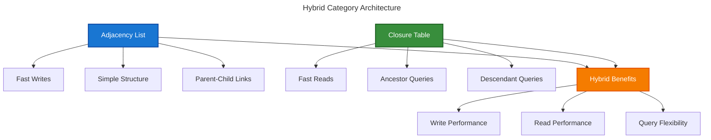

# 4. ChinookCategories Resource

## Table of Contents

- [Overview](#overview)
- [Resource Implementation](#resource-implementation)
  - [Basic Resource Structure](#basic-resource-structure)
  - [Hierarchical Form Configuration](#hierarchical-form-configuration)
  - [Tree Table Configuration](#tree-table-configuration)
- [Hierarchical Data Management](#hierarchical-data-management)
  - [Hybrid Architecture](#hybrid-architecture)
  - [Tree Operations](#tree-operations)
  - [Performance Optimization](#performance-optimization)
- [Polymorphic Relationships](#polymorphic-relationships)
  - [Categorizable Implementation](#categorizable-implementation)
  - [Multi-Model Assignment](#multi-model-assignment)
  - [Category Types](#category-types)
- [Advanced Features](#advanced-features)
  - [Category Tree Visualization](#category-tree-visualization)
  - [Bulk Category Operations](#bulk-category-operations)
  - [Category Analytics](#category-analytics)
- [Business Logic](#business-logic)
  - [Category Validation](#category-validation)
  - [Hierarchy Constraints](#hierarchy-constraints)
  - [Usage Tracking](#usage-tracking)
- [Authorization](#authorization)
- [Testing](#testing)
- [Navigation](#navigation)

## Overview

The Categories Resource provides comprehensive management of hierarchical categories within the Chinook admin panel. It features a hybrid closure table + adjacency list architecture for optimal performance, polymorphic relationships for multi-model categorization, and advanced tree visualization.

### Key Features

- **Hierarchical Structure**: Complete tree management with parent-child relationships
- **Hybrid Architecture**: Closure table + adjacency list for optimal read/write performance
- **Polymorphic Categories**: Assign categories to multiple model types (Artists, Albums, Tracks)
- **Category Types**: Support for different category types (Genre, Mood, Theme, Era, etc.)
- **Tree Visualization**: Interactive tree view with drag-and-drop reordering
- **Bulk Operations**: Mass category assignments and hierarchy operations
- **Performance Optimized**: Efficient queries for large category trees

## Resource Implementation

### Basic Resource Structure

```php
<?php

declare(strict_types=1);

namespace App\Filament\ChinookAdmin\Resources;

use App\Models\Category;
use App\Enums\CategoryType;
use Filament\Forms;
use Filament\Forms\Form;
use Filament\Resources\Resource;
use Filament\Tables;
use Filament\Tables\Table;
use Illuminate\Database\Eloquent\Builder;
use Illuminate\Database\Eloquent\SoftDeletingScope;

class CategoryResource extends Resource
{
    protected static ?string $model = Category::class;

    protected static ?string $navigationIcon = 'heroicon-o-tag';

    protected static ?string $navigationGroup = 'Music Management';

    protected static ?int $navigationSort = 40;

    protected static ?string $navigationLabel = 'Categories';

    protected static ?string $modelLabel = 'Category';

    protected static ?string $pluralModelLabel = 'Categories';

    protected static ?string $recordTitleAttribute = 'name';

    // Global search configuration
    protected static ?array $searchableColumns = ['name', 'description', 'type'];

    // Permission-based navigation visibility
    protected static function shouldRegisterNavigation(): bool
    {
        return auth()->user()?->can('view-categories') ?? false;
    }

    // Dynamic badge count
    public static function getNavigationBadge(): ?string
    {
        if (auth()->user()?->can('view-categories')) {
            return static::getModel()::count();
        }

        return null;
    }

    // Badge color based on count
    public static function getNavigationBadgeColor(): ?string
    {
        $count = static::getModel()::count();

        return match (true) {
            $count > 100 => 'success',
            $count > 50 => 'warning',
            default => 'primary',
        };
    }

    // Global scope for data access
    public static function getEloquentQuery(): Builder
    {
        $query = parent::getEloquentQuery();

        $user = auth()->user();

        // Super admins see everything including soft deleted
        if ($user?->hasRole('super-admin')) {
            return $query->withoutGlobalScopes([
                SoftDeletingScope::class,
            ]);
        }

        // Regular users see only active categories
        if (!$user?->can('view-inactive-categories')) {
            $query->where('is_active', true);
        }

        return $query;
    }

    public static function form(Form $form): Form
    {
        return $form
            ->schema([
                Forms\Components\Section::make('Category Information')
                    ->schema([
                        Forms\Components\Select::make('parent_id')
                            ->label('Parent Category')
                            ->relationship('parent', 'name')
                            ->searchable()
                            ->preload()
                            ->getOptionLabelFromRecordUsing(fn ($record) => 
                                $record->getFullPathAttribute()
                            )
                            ->helperText('Select a parent category to create a subcategory'),

                        Forms\Components\TextInput::make('name')
                            ->required()
                            ->maxLength(255)
                            ->live(onBlur: true)
                            ->afterStateUpdated(function (string $context, $state, Forms\Set $set) {
                                if ($context === 'edit') {
                                    return;
                                }

                                $set('slug', str($state)->slug());
                            }),

                        Forms\Components\TextInput::make('slug')
                            ->required()
                            ->maxLength(255)
                            ->unique(Category::class, 'slug', ignoreRecord: true)
                            ->rules(['alpha_dash']),

                        Forms\Components\Select::make('type')
                            ->options(CategoryType::class)
                            ->required()
                            ->native(false)
                            ->helperText('Category type determines how it can be used'),
                    ])
                    ->columns(2),

                Forms\Components\Section::make('Category Details')
                    ->schema([
                        Forms\Components\Textarea::make('description')
                            ->maxLength(65535)
                            ->rows(4)
                            ->helperText('Detailed description of this category'),

                        Forms\Components\TextInput::make('sort_order')
                            ->numeric()
                            ->default(0)
                            ->minValue(0)
                            ->maxValue(9999)
                            ->helperText('Sort order within parent category (0 = first)'),

                        Forms\Components\ColorPicker::make('color')
                            ->helperText('Color for visual identification'),

                        Forms\Components\TextInput::make('icon')
                            ->maxLength(255)
                            ->helperText('Heroicon name for visual identification')
                            ->placeholder('heroicon-o-musical-note'),
                    ])
                    ->columns(2),

                Forms\Components\Section::make('Category Metadata')
                    ->schema([
                        Forms\Components\KeyValue::make('metadata')
                            ->keyLabel('Property')
                            ->valueLabel('Value')
                            ->addActionLabel('Add Property')
                            ->helperText('Additional metadata for this category'),
                    ]),

                Forms\Components\Section::make('Category Status')
                    ->schema([
                        Forms\Components\Toggle::make('is_active')
                            ->label('Active')
                            ->default(true)
                            ->helperText('Inactive categories are hidden from public view')
                            ->visible(fn () => auth()->user()?->can('manage-category-status')),

                        Forms\Components\Toggle::make('is_featured')
                            ->label('Featured')
                            ->helperText('Featured categories appear prominently in listings'),

                        Forms\Components\Toggle::make('allow_children')
                            ->label('Allow Subcategories')
                            ->default(true)
                            ->helperText('Whether this category can have child categories'),
                    ])
                    ->columns(3),
            ]);
    }

    public static function table(Table $table): Table
    {
        return $table
            ->columns([
                Tables\Columns\ColorColumn::make('color')
                    ->label('')
                    ->width(20),

                Tables\Columns\TextColumn::make('name')
                    ->searchable()
                    ->sortable()
                    ->weight('bold')
                    ->description(fn (Category $record): string => 
                        $record->getFullPathAttribute()
                    ),

                Tables\Columns\TextColumn::make('type')
                    ->badge()
                    ->color(fn (string $state): string => match ($state) {
                        'GENRE' => 'success',
                        'MOOD' => 'info',
                        'THEME' => 'warning',
                        'ERA' => 'danger',
                        'INSTRUMENT' => 'gray',
                        'LANGUAGE' => 'primary',
                        'OCCASION' => 'secondary',
                        default => 'gray',
                    }),

                Tables\Columns\TextColumn::make('parent.name')
                    ->label('Parent')
                    ->searchable()
                    ->sortable()
                    ->placeholder('Root Category'),

                Tables\Columns\TextColumn::make('depth')
                    ->label('Level')
                    ->alignCenter()
                    ->sortable(),

                Tables\Columns\TextColumn::make('children_count')
                    ->label('Children')
                    ->getStateUsing(function (Category $record): int {
                        return $record->children()->count();
                    })
                    ->alignCenter()
                    ->color('success'),

                Tables\Columns\TextColumn::make('usage_count')
                    ->label('Usage')
                    ->getStateUsing(function (Category $record): int {
                        return $record->artists()->count() + 
                               $record->albums()->count() + 
                               $record->tracks()->count();
                    })
                    ->alignCenter()
                    ->color('info'),

                Tables\Columns\TextColumn::make('sort_order')
                    ->label('Order')
                    ->alignCenter()
                    ->sortable(),

                Tables\Columns\IconColumn::make('is_featured')
                    ->label('Featured')
                    ->boolean()
                    ->toggleable(isToggledHiddenByDefault: true),

                Tables\Columns\IconColumn::make('is_active')
                    ->label('Active')
                    ->boolean()
                    ->sortable(),

                Tables\Columns\TextColumn::make('created_at')
                    ->dateTime()
                    ->sortable()
                    ->toggleable(isToggledHiddenByDefault: true),

                Tables\Columns\TextColumn::make('updated_at')
                    ->dateTime()
                    ->sortable()
                    ->toggleable(isToggledHiddenByDefault: true),
            ])
            ->filters([
                Tables\Filters\SelectFilter::make('type')
                    ->options(CategoryType::class),

                Tables\Filters\SelectFilter::make('parent')
                    ->relationship('parent', 'name')
                    ->searchable()
                    ->preload(),

                Tables\Filters\Filter::make('depth')
                    ->form([
                        Forms\Components\Select::make('depth')
                            ->label('Category Level')
                            ->options([
                                0 => 'Root Categories',
                                1 => 'Level 1',
                                2 => 'Level 2',
                                3 => 'Level 3',
                                4 => 'Level 4+',
                            ]),
                    ])
                    ->query(function (Builder $query, array $data): Builder {
                        return $query->when(
                            $data['depth'] !== null,
                            fn (Builder $query): Builder => 
                                $data['depth'] === 4 
                                    ? $query->where('depth', '>=', 4)
                                    : $query->where('depth', $data['depth'])
                        );
                    }),

                Tables\Filters\TernaryFilter::make('is_featured')
                    ->label('Featured Categories'),

                Tables\Filters\TernaryFilter::make('is_active')
                    ->label('Active Status'),

                Tables\Filters\TernaryFilter::make('has_children')
                    ->label('Has Subcategories')
                    ->queries(
                        true: fn (Builder $query) => $query->has('children'),
                        false: fn (Builder $query) => $query->doesntHave('children'),
                    ),

                Tables\Filters\TrashedFilter::make()
                    ->visible(fn () => auth()->user()?->can('view-trashed-categories')),
            ])
            ->actions([
                Tables\Actions\Action::make('viewTree')
                    ->label('View Tree')
                    ->icon('heroicon-o-squares-2x2')
                    ->color('info')
                    ->url(fn (Category $record): string => 
                        static::getUrl('tree', ['record' => $record])
                    ),

                Tables\Actions\ViewAction::make(),
                Tables\Actions\EditAction::make(),
                
                Tables\Actions\Action::make('createChild')
                    ->label('Add Subcategory')
                    ->icon('heroicon-o-plus')
                    ->color('success')
                    ->url(fn (Category $record): string => 
                        static::getUrl('create', ['parent_id' => $record->id])
                    )
                    ->visible(fn (Category $record): bool => 
                        $record->allow_children && auth()->user()?->can('create-categories')
                    ),

                Tables\Actions\DeleteAction::make()
                    ->visible(fn () => auth()->user()?->can('delete-categories'))
                    ->before(function (Category $record) {
                        // Prevent deletion if category has children or is in use
                        if ($record->children()->exists()) {
                            throw new \Exception('Cannot delete category with subcategories.');
                        }
                        
                        $usageCount = $record->artists()->count() + 
                                     $record->albums()->count() + 
                                     $record->tracks()->count();
                        
                        if ($usageCount > 0 && !auth()->user()?->can('force-delete-categories')) {
                            throw new \Exception('Cannot delete category that is in use.');
                        }
                    }),

                Tables\Actions\RestoreAction::make()
                    ->visible(fn () => auth()->user()?->can('restore-categories')),
                Tables\Actions\ForceDeleteAction::make()
                    ->visible(fn () => auth()->user()?->can('force-delete-categories')),
            ])
            ->bulkActions([
                Tables\Actions\BulkActionGroup::make([
                    Tables\Actions\BulkAction::make('changeType')
                        ->label('Change Type')
                        ->icon('heroicon-o-tag')
                        ->form([
                            Forms\Components\Select::make('type')
                                ->label('New Category Type')
                                ->options(CategoryType::class)
                                ->required(),
                        ])
                        ->action(function (Collection $records, array $data) {
                            $records->each(function (Category $category) use ($data) {
                                $category->update(['type' => $data['type']]);
                            });
                        })
                        ->visible(fn () => auth()->user()?->can('edit-categories')),

                    Tables\Actions\BulkAction::make('updateSortOrder')
                        ->label('Update Sort Order')
                        ->icon('heroicon-o-bars-3')
                        ->form([
                            Forms\Components\TextInput::make('sort_order')
                                ->label('Sort Order')
                                ->numeric()
                                ->required(),
                        ])
                        ->action(function (Collection $records, array $data) {
                            $records->each(function (Category $category, $index) use ($data) {
                                $category->update(['sort_order' => $data['sort_order'] + $index]);
                            });
                        })
                        ->visible(fn () => auth()->user()?->can('edit-categories')),

                    Tables\Actions\DeleteBulkAction::make()
                        ->visible(fn () => auth()->user()?->can('delete-categories')),
                    Tables\Actions\RestoreBulkAction::make()
                        ->visible(fn () => auth()->user()?->can('restore-categories')),
                    Tables\Actions\ForceDeleteBulkAction::make()
                        ->visible(fn () => auth()->user()?->can('force-delete-categories')),
                ]),
            ])
            ->defaultSort('type')
            ->defaultSort('sort_order');
    }

    public static function getRelations(): array
    {
        return [
            ArtistsRelationManager::class,
            AlbumsRelationManager::class,
            TracksRelationManager::class,
            ChildCategoriesRelationManager::class,
        ];
    }

    public static function getPages(): array
    {
        return [
            'index' => Pages\ListCategories::route('/'),
            'create' => Pages\CreateCategory::route('/create'),
            'view' => Pages\ViewCategory::route('/{record}'),
            'edit' => Pages\EditCategory::route('/{record}/edit'),
            'tree' => Pages\CategoryTree::route('/tree/{record?}'),
        ];
    }

    // Authorization methods
    public static function canViewAny(): bool
    {
        return auth()->user()?->can('view-categories') ?? false;
    }

    public static function canCreate(): bool
    {
        return auth()->user()?->can('create-categories') ?? false;
    }

    public static function canEdit($record): bool
    {
        return auth()->user()?->can('update', $record) ?? false;
    }

    public static function canDelete($record): bool
    {
        return auth()->user()?->can('delete', $record) ?? false;
    }
}
```

## Hierarchical Data Management

### Hybrid Architecture

The Categories Resource uses a hybrid closure table + adjacency list architecture for optimal performance:



### Tree Operations

```php
// In Category model
public function moveToParent(Category $newParent): void
{
    DB::transaction(function () use ($newParent) {
        // Update adjacency list
        $this->update(['parent_id' => $newParent->id]);
        
        // Rebuild closure table for this subtree
        $this->rebuildClosureTable();
    });
}

public function rebuildClosureTable(): void
{
    // Delete existing closure records for this subtree
    DB::table('category_closure')
        ->where('descendant_id', $this->id)
        ->delete();
    
    // Rebuild closure records
    $this->buildClosureRecords();
}
```

### Hierarchical Form Configuration

The hierarchical form configuration provides specialized category management with tree-aware functionality:

- **Parent Selection**: Intelligent parent category selection with hierarchy validation
- **Depth Limiting**: Configurable maximum hierarchy depth
- **Circular Reference Prevention**: Automatic detection and prevention of circular references
- **Tree Position Indicators**: Visual hierarchy position display
- **Bulk Hierarchy Operations**: Mass category restructuring capabilities

### Tree Table Configuration

The tree table configuration offers advanced hierarchical data visualization:

- **Expandable Tree View**: Collapsible category hierarchy display
- **Indentation Levels**: Visual depth indicators
- **Drag-and-Drop Reordering**: Interactive hierarchy restructuring
- **Breadcrumb Navigation**: Full path display for deep categories
- **Tree Statistics**: Category count and depth metrics

### Performance Optimization

Optimized for large category hierarchies with thousands of categories:

- **Hybrid Architecture**: Combines adjacency list and closure table benefits
- **Lazy Loading**: On-demand category loading for large trees
- **Caching Strategy**: Intelligent hierarchy caching
- **Query Optimization**: Efficient tree traversal queries
- **Batch Operations**: Optimized bulk category operations

## Polymorphic Relationships

The Categories Resource implements comprehensive polymorphic relationship management.

### Categorizable Implementation

Flexible category assignment across multiple model types:

- **Multi-Model Support**: Categories can be assigned to any model
- **Type-Specific Categories**: Different category types for different models
- **Relationship Validation**: Ensure appropriate category assignments
- **Cascade Operations**: Handle category deletions gracefully
- **Performance Optimization**: Efficient polymorphic queries

### Multi-Model Assignment

Advanced category assignment patterns:

- **Bulk Assignment**: Assign categories to multiple models simultaneously
- **Cross-Model Analytics**: Category usage across different model types
- **Relationship Constraints**: Enforce business rules for category assignments
- **Audit Trail**: Track all category assignment changes
- **Rollback Capabilities**: Undo category assignment operations

### Category Types

Support for different category classification systems:

- **Genre Categories**: Music genre classification
- **Mood Categories**: Emotional categorization
- **Theme Categories**: Thematic grouping
- **Era Categories**: Time period classification
- **Instrument Categories**: Musical instrument categorization

## Advanced Features

The Categories Resource includes several advanced features for comprehensive category management.

### Category Tree Visualization

Interactive tree visualization and management:

- **Interactive Tree Widget**: Drag-and-drop tree interface
- **Visual Hierarchy Indicators**: Clear parent-child relationships
- **Expandable Nodes**: Collapsible tree sections
- **Search and Filter**: Find categories within large trees
- **Export Capabilities**: Tree structure export functionality

### Bulk Category Operations

Comprehensive bulk operation support:

- **Mass Category Creation**: Bulk category import and creation
- **Hierarchy Restructuring**: Mass parent-child relationship changes
- **Bulk Deletion**: Safe mass category removal with dependency checking
- **Category Merging**: Combine multiple categories into one
- **Batch Validation**: Mass category data validation

### Category Analytics

Comprehensive analytics and reporting:

- **Usage Statistics**: Track category assignment frequency
- **Popularity Metrics**: Identify most-used categories
- **Hierarchy Analysis**: Analyze tree structure efficiency
- **Performance Metrics**: Monitor category operation performance
- **Trend Analysis**: Track category usage over time

## Business Logic

The Categories Resource implements comprehensive business logic for category management.

### Category Validation

Robust validation ensures data integrity and hierarchy consistency:

- **Hierarchy Validation**: Prevent circular references and invalid structures
- **Depth Constraints**: Enforce maximum hierarchy depth limits
- **Naming Conventions**: Ensure consistent category naming
- **Uniqueness Validation**: Prevent duplicate categories at the same level
- **Business Rule Enforcement**: Apply domain-specific validation rules

### Hierarchy Constraints

Sophisticated hierarchy management rules:

- **Maximum Depth Limits**: Configurable hierarchy depth constraints
- **Sibling Ordering**: Maintain consistent category ordering
- **Parent-Child Validation**: Ensure logical parent-child relationships
- **Circular Reference Detection**: Prevent invalid hierarchy structures
- **Constraint Violation Handling**: Graceful handling of constraint violations

### Usage Tracking

Comprehensive category usage monitoring:

- **Assignment Tracking**: Monitor category assignment patterns
- **Usage Analytics**: Track category utilization across models
- **Performance Impact**: Monitor category operation performance
- **Cleanup Recommendations**: Identify unused or redundant categories
- **Optimization Suggestions**: Recommend hierarchy improvements

## Authorization

Comprehensive authorization controls ensure secure access to category management features.

## Testing

The Categories Resource includes comprehensive testing coverage for all functionality.

---

## Navigation

**← Previous:** [Tracks Resource](030-tracks-resource.md)

**Next →** [Playlists Resource](050-playlists-resource.md)
