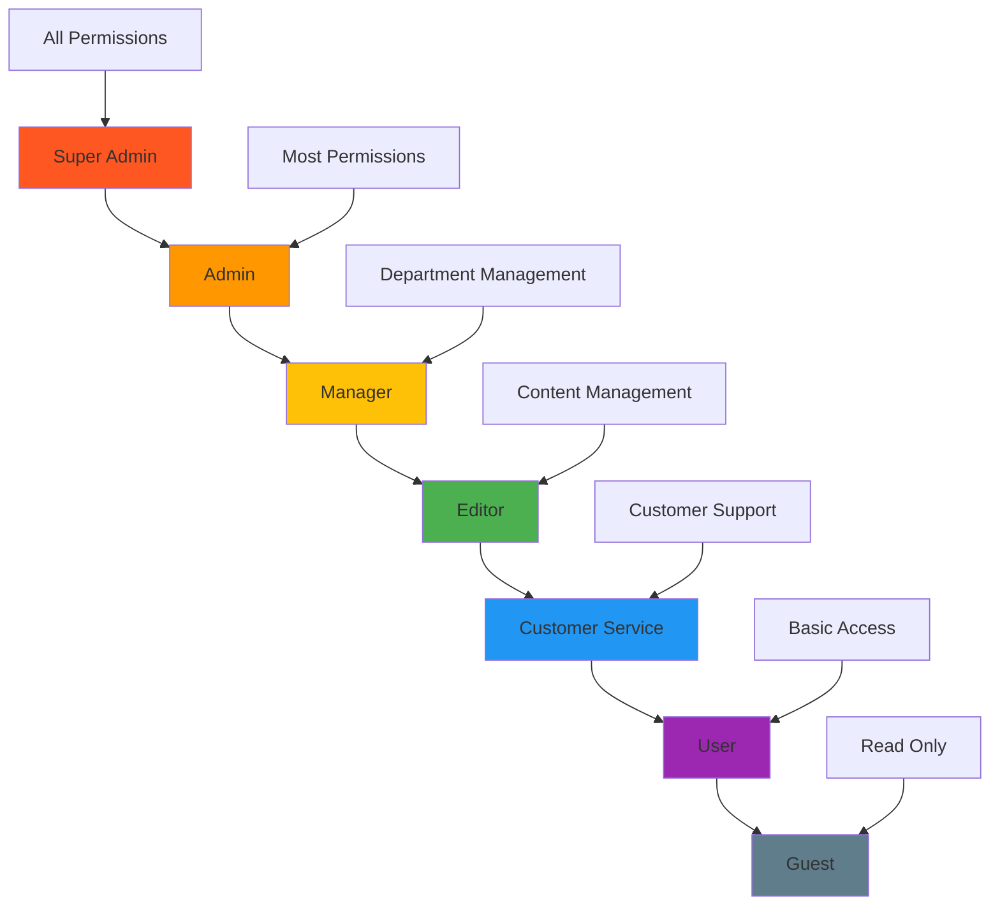

# Filament 4 Panel Setup Guide

This directory contains comprehensive documentation for setting up the `chinook-admin` Filament 4 panel with authentication, RBAC, and security configurations.

## Documentation Structure

### Core Setup Files
1. **[Panel Configuration](010-panel-configuration.md)** - Service provider setup and panel registration
2. **[Authentication Setup](020-authentication-setup.md)** - Filament native auth with Laravel integration
3. **[RBAC Integration](030-rbac-integration.md)** - spatie/laravel-permission with hierarchical roles
4. **[Navigation Configuration](040-navigation-configuration.md)** - Menu organization and access control
5. **[Security Configuration](050-security-configuration.md)** - Middleware, guards, and access patterns
6. **[Environment Setup](060-environment-setup.md)** - Development and production configurations
7. **[SQLite Optimization](070-sqlite-optimization.md)** - WAL mode configuration and performance tuning

## Quick Start

### Prerequisites
Ensure these packages are installed:

```bash
# Core Filament packages
composer require filament/filament:"^4.0"
composer require filament/forms:"^4.0"
composer require filament/tables:"^4.0"
composer require filament/notifications:"^4.0"
composer require filament/actions:"^4.0"
composer require filament/infolist:"^4.0"
composer require filament/widgets:"^4.0"

# RBAC and security
composer require spatie/laravel-permission:"^6.20"
composer require bezhansalleh/filament-shield:"^3.0"

# Additional Filament plugins
composer require filament/spatie-laravel-media-library-plugin:"^4.0"
composer require filament/spatie-laravel-tags-plugin:"^4.0"
composer require filament/spatie-laravel-activitylog-plugin:"^4.0"
```

### Basic Setup Steps

1. **Install Filament**: `php artisan filament:install --panels`
2. **Create Admin Panel**: `php artisan make:filament-panel chinook-admin`
3. **Configure RBAC**: Follow the RBAC integration guide
4. **Setup Navigation**: Configure menu groups and access control
5. **Configure Security**: Apply middleware and access patterns

## Panel Architecture

The `chinook-admin` panel follows these architectural principles:

### Dedicated Panel Approach
- **Separate Panel**: Isolated from default admin panel
- **Custom Service Provider**: `ChinookAdminPanelProvider`
- **Dedicated Routes**: `/chinook-admin` path prefix
- **Independent Configuration**: Separate middleware, auth, and navigation

### Authentication Strategy
- **Filament Native Auth**: No custom login implementation required
- **Laravel Integration**: Seamless User model integration
- **RBAC Integration**: spatie/laravel-permission for role-based access
- **Session Management**: Proper session handling and security

### Security Configuration
- **Middleware Stack**: CSRF, authentication, authorization
- **Access Control**: Role-based resource access
- **Guard Configuration**: Proper guard setup for panel isolation
- **Rate Limiting**: Protection against abuse

## Hierarchical Role Structure

The panel implements a 7-tier hierarchical role system:



### Role Capabilities

- **Super Admin**: Full system access, user management, system configuration
- **Admin**: Most administrative functions, user management within scope
- **Manager**: Department management, reporting, team oversight
- **Editor**: Content creation and editing, limited administrative access
- **Customer Service**: Customer support, order management, limited editing
- **User**: Basic authenticated access, personal data management
- **Guest**: Read-only access to public information

## Granular Permission System

Permissions follow kebab-case naming convention:

### Core Entity Permissions
```php
// Artists
'view-artists', 'create-artists', 'edit-artists', 'delete-artists', 'restore-artists', 'force-delete-artists'

// Albums
'view-albums', 'create-albums', 'edit-albums', 'delete-albums', 'restore-albums', 'force-delete-albums'

// Tracks
'view-tracks', 'create-tracks', 'edit-tracks', 'delete-tracks', 'restore-tracks', 'force-delete-tracks'

// Categories
'view-categories', 'create-categories', 'edit-categories', 'delete-categories', 'manage-category-hierarchy'

// Customers
'view-customers', 'create-customers', 'edit-customers', 'delete-customers', 'export-customers'

// Employees
'view-employees', 'create-employees', 'edit-employees', 'delete-employees', 'manage-employee-hierarchy'

// Invoices
'view-invoices', 'create-invoices', 'edit-invoices', 'delete-invoices', 'process-payments', 'refund-invoices'

// Playlists
'view-playlists', 'create-playlists', 'edit-playlists', 'delete-playlists', 'manage-playlist-tracks'
```

### Administrative Permissions
```php
// System Administration
'access-admin-panel', 'view-admin-dashboard', 'manage-system-settings'

// User Management
'view-users', 'create-users', 'edit-users', 'delete-users', 'assign-roles', 'manage-permissions'

// Analytics and Reporting
'view-analytics', 'export-reports', 'view-sales-data', 'view-customer-analytics'

// Media Management
'upload-media', 'delete-media', 'manage-media-library'

// Import/Export
'import-data', 'export-data', 'bulk-operations'
```

## Navigation Groups

The panel organizes resources into logical navigation groups:

### Music Management
- Artists Resource
- Albums Resource
- Tracks Resource
- Categories Resource
- Media Types Resource
- Playlists Resource

### Customer Management
- Customers Resource
- Invoices Resource
- Invoice Lines Resource (as relationship manager)

### Administration
- Employees Resource
- Users Resource (if accessible)
- Roles & Permissions Management

### Analytics & Reports
- Sales Dashboard
- Customer Analytics
- Music Discovery
- Performance Metrics

### System
- Activity Log
- Media Library
- System Settings
- Import/Export Tools

## Next Steps

1. **Follow Panel Configuration Guide** to set up the basic panel structure
2. **Configure Authentication** using the authentication setup guide
3. **Implement RBAC** following the RBAC integration guide
4. **Setup Navigation** using the navigation configuration guide
5. **Apply Security Measures** using the security configuration guide
6. **Configure Environment** for development and production

## Related Documentation

- **[Resource Documentation](../resources/)** - Implementing Filament resources
- **[Features Documentation](../features/)** - Advanced features and widgets
- **[Testing Documentation](../testing/)** - Testing strategies for the panel
- **[Deployment Documentation](../deployment/)** - Production deployment guide
