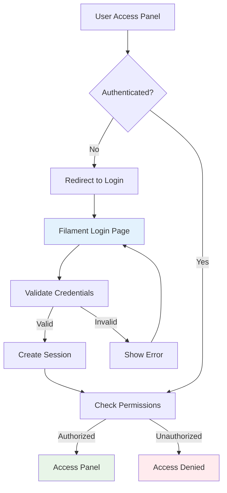

# Authentication Setup Guide

This guide covers the complete authentication setup for the `chinook-admin` Filament 4 panel, including native Filament authentication, Laravel integration, and session management.

## Table of Contents

- [Authentication Strategy](#authentication-strategy)
- [User Model Configuration](#user-model-configuration)
- [Filament Authentication Setup](#filament-authentication-setup)
- [Custom Authentication Pages](#custom-authentication-pages)
- [Session Management](#session-management)
- [Security Configuration](#security-configuration)
- [Multi-Guard Setup](#multi-guard-setup)

## Authentication Strategy

The `chinook-admin` panel uses Filament's native authentication system with seamless Laravel integration:

### Key Features
- **Native Filament Auth**: No custom login implementation required
- **Laravel User Model**: Direct integration with existing User model
- **Session Management**: Proper session handling and security
- **Multi-Guard Support**: Isolated authentication for the admin panel
- **Password Reset**: Built-in password reset functionality
- **Email Verification**: Optional email verification workflow

### Authentication Flow



## User Model Configuration

### Enhanced User Model for Chinook Admin

```php
<?php

declare(strict_types=1);

namespace App\Models;

use Filament\Models\Contracts\FilamentUser;
use Filament\Panel;
use Illuminate\Database\Eloquent\Factories\HasFactory;
use Illuminate\Foundation\Auth\User as Authenticatable;
use Illuminate\Notifications\Notifiable;
use Laravel\Sanctum\HasApiTokens;
use Spatie\Permission\Traits\HasRoles;
use Wildside\Userstamps\Userstamps;

class User extends Authenticatable implements FilamentUser
{
    use HasApiTokens;
    use HasFactory;
    use HasRoles;
    use Notifiable;
    use Userstamps;

    /**
     * The attributes that are mass assignable.
     */
    protected $fillable = [
        'name',
        'email',
        'password',
        'email_verified_at',
        'avatar',
        'workos_id',
        'is_active',
        'last_login_at',
        'timezone',
        'locale',
    ];

    /**
     * The attributes that should be hidden for serialization.
     */
    protected $hidden = [
        'password',
        'remember_token',
    ];

    /**
     * Get the attributes that should be cast.
     */
    protected function casts(): array
    {
        return [
            'email_verified_at' => 'datetime',
            'last_login_at' => 'datetime',
            'is_active' => 'boolean',
            'password' => 'hashed',
        ];
    }

    /**
     * Determine if the user can access the Chinook admin panel.
     */
    public function canAccessPanel(Panel $panel): bool
    {
        // Only allow access to chinook-admin panel for users with admin roles
        if ($panel->getId() === 'chinook-admin') {
            return $this->hasAnyRole([
                'Super Admin',
                'Admin', 
                'Manager',
                'Editor',
                'Customer Service'
            ]) && $this->is_active;
        }

        return false;
    }

    /**
     * Get the user's display name for Filament.
     */
    public function getFilamentName(): string
    {
        return $this->name;
    }

    /**
     * Get the user's avatar URL for Filament.
     */
    public function getFilamentAvatarUrl(): ?string
    {
        return $this->avatar;
    }

    /**
     * Scope to get active users only.
     */
    public function scopeActive($query)
    {
        return $query->where('is_active', true);
    }

    /**
     * Scope to get admin users only.
     */
    public function scopeAdmins($query)
    {
        return $query->whereHas('roles', function ($q) {
            $q->whereIn('name', [
                'Super Admin',
                'Admin',
                'Manager',
                'Editor',
                'Customer Service'
            ]);
        });
    }
}
```

### User Migration Enhancement

```php
<?php

use Illuminate\Database\Migrations\Migration;
use Illuminate\Database\Schema\Blueprint;
use Illuminate\Support\Facades\Schema;

return new class extends Migration
{
    public function up(): void
    {
        Schema::table('users', function (Blueprint $table) {
            // Add admin-specific fields
            $table->boolean('is_active')->default(true)->after('avatar');
            $table->timestamp('last_login_at')->nullable()->after('is_active');
            $table->string('timezone')->default('UTC')->after('last_login_at');
            $table->string('locale')->default('en')->after('timezone');
            
            // Add indexes for performance
            $table->index('is_active');
            $table->index('last_login_at');
        });
    }

    public function down(): void
    {
        Schema::table('users', function (Blueprint $table) {
            $table->dropColumn([
                'is_active',
                'last_login_at', 
                'timezone',
                'locale'
            ]);
        });
    }
};
```

## Filament Authentication Setup

### Panel Authentication Configuration

In `ChinookAdminPanelProvider.php`:

```php
public function panel(Panel $panel): Panel
{
    return $panel
        ->id('chinook-admin')
        ->path('chinook-admin')
        
        // Authentication features
        ->login()                    // Enable login page
        ->registration(false)        // Disable public registration
        ->passwordReset()           // Enable password reset
        ->emailVerification()       // Enable email verification
        ->profile()                 // Enable profile management
        
        // Authentication guard
        ->authGuard('web')          // Use web guard
        ->authPasswordBroker('users') // Use users password broker
        
        // Session configuration
        ->sessionLifetime(120)      // 2 hours session lifetime
        ->rememberMeEnabled()       // Enable "remember me"
        
        // Security features
        ->strictAuthorization()     // Enforce authorization
        ->authMiddleware([
            Authenticate::class,
        ]);
}
```

### Custom Login Page (Optional)

If you need custom login styling or functionality:

```php
// app/Filament/ChinookAdmin/Pages/Auth/Login.php
<?php

namespace App\Filament\ChinookAdmin\Pages\Auth;

use Filament\Forms\Components\Component;
use Filament\Forms\Components\TextInput;
use Filament\Forms\Form;
use Filament\Pages\Auth\Login as BaseLogin;

class Login extends BaseLogin
{
    public function form(Form $form): Form
    {
        return $form
            ->schema([
                $this->getEmailFormComponent()
                    ->label('Email Address')
                    ->placeholder('Enter your email address'),
                $this->getPasswordFormComponent()
                    ->label('Password')
                    ->placeholder('Enter your password'),
                $this->getRememberFormComponent(),
            ])
            ->statePath('data');
    }

    protected function getEmailFormComponent(): Component
    {
        return TextInput::make('email')
            ->label(__('filament-panels::pages/auth/login.form.email.label'))
            ->email()
            ->required()
            ->autocomplete()
            ->autofocus()
            ->extraInputAttributes(['tabindex' => 1]);
    }

    protected function getCredentialsFromFormData(array $data): array
    {
        return [
            'email' => $data['email'],
            'password' => $data['password'],
            'is_active' => true, // Only allow active users
        ];
    }
}
```

Register the custom login page:

```php
// In ChinookAdminPanelProvider.php
->login(Login::class)
```

## Custom Authentication Pages

### Custom Login Page

Create a custom login page for enhanced branding:

```php
<?php

namespace App\Filament\Pages\Auth;

use Filament\Forms\Components\Component;
use Filament\Forms\Components\TextInput;
use Filament\Forms\Form;
use Filament\Pages\Auth\Login as BaseLogin;
use Illuminate\Validation\ValidationException;

class Login extends BaseLogin
{
    public function form(Form $form): Form
    {
        return $form
            ->schema([
                $this->getEmailFormComponent()
                    ->label('Email Address')
                    ->placeholder('Enter your email address'),
                $this->getPasswordFormComponent()
                    ->label('Password')
                    ->placeholder('Enter your password'),
                $this->getRememberFormComponent(),
            ])
            ->statePath('data');
    }

    protected function getEmailFormComponent(): Component
    {
        return TextInput::make('email')
            ->label(__('filament-panels::pages/auth/login.form.email.label'))
            ->email()
            ->required()
            ->autocomplete()
            ->autofocus()
            ->extraInputAttributes(['tabindex' => 1]);
    }

    protected function getPasswordFormComponent(): Component
    {
        return TextInput::make('password')
            ->label(__('filament-panels::pages/auth/login.form.password.label'))
            ->password()
            ->required()
            ->extraInputAttributes(['tabindex' => 2]);
    }

    protected function throwFailureValidationException(): never
    {
        throw ValidationException::withMessages([
            'data.email' => __('filament-panels::pages/auth/login.messages.failed'),
        ]);
    }

    public function getTitle(): string
    {
        return 'Chinook Admin Login';
    }

    public function getHeading(): string
    {
        return 'Welcome to Chinook Admin';
    }

    public function getSubheading(): ?string
    {
        return 'Sign in to access the music database administration panel';
    }
}
```

### Custom Registration Page

If registration is enabled:

```php
<?php

namespace App\Filament\Pages\Auth;

use App\Models\User;
use Filament\Forms\Components\Component;
use Filament\Forms\Components\TextInput;
use Filament\Forms\Form;
use Filament\Pages\Auth\Register as BaseRegister;
use Illuminate\Database\Eloquent\Model;

class Register extends BaseRegister
{
    public function form(Form $form): Form
    {
        return $form
            ->schema([
                $this->getNameFormComponent(),
                $this->getEmailFormComponent(),
                $this->getPasswordFormComponent(),
                $this->getPasswordConfirmationFormComponent(),
            ]);
    }

    protected function getNameFormComponent(): Component
    {
        return TextInput::make('name')
            ->label('Full Name')
            ->required()
            ->maxLength(255)
            ->autofocus();
    }

    protected function handleRegistration(array $data): Model
    {
        $user = User::create($data);

        // Assign default role
        $user->assignRole('User');

        return $user;
    }

    public function getTitle(): string
    {
        return 'Create Account';
    }

    public function getHeading(): string
    {
        return 'Join Chinook Admin';
    }
}
```

### Password Reset Pages

Custom password reset functionality:

```php
<?php

namespace App\Filament\Pages\Auth;

use Filament\Forms\Components\Component;
use Filament\Forms\Components\TextInput;
use Filament\Forms\Form;
use Filament\Pages\Auth\PasswordReset\RequestPasswordReset as BaseRequestPasswordReset;

class RequestPasswordReset extends BaseRequestPasswordReset
{
    public function form(Form $form): Form
    {
        return $form
            ->schema([
                $this->getEmailFormComponent(),
            ]);
    }

    protected function getEmailFormComponent(): Component
    {
        return TextInput::make('email')
            ->label('Email Address')
            ->email()
            ->required()
            ->autocomplete()
            ->autofocus();
    }

    public function getTitle(): string
    {
        return 'Reset Password';
    }

    public function getHeading(): string
    {
        return 'Forgot your password?';
    }

    public function getSubheading(): ?string
    {
        return 'Enter your email address and we\'ll send you a password reset link.';
    }
}
```

## Session Management

### Session Configuration

Configure session settings in `config/session.php`:

```php
// Session configuration for admin panel
'lifetime' => env('SESSION_LIFETIME', 120), // 2 hours
'expire_on_close' => false,
'encrypt' => true,
'files' => storage_path('framework/sessions'),
'connection' => env('SESSION_CONNECTION'),
'table' => 'sessions',
'store' => env('SESSION_STORE'),
'lottery' => [2, 100],
'cookie' => env('SESSION_COOKIE', 'chinook_admin_session'),
'path' => '/chinook-admin',
'domain' => env('SESSION_DOMAIN'),
'secure' => env('SESSION_SECURE_COOKIE', true),
'http_only' => true,
'same_site' => 'lax',
'partitioned' => false,
```

### Session Middleware

Ensure proper session middleware in the panel:

```php
->middleware([
    EncryptCookies::class,
    AddQueuedCookiesToResponse::class,
    StartSession::class,
    AuthenticateSession::class,  // Important for session security
    ShareErrorsFromSession::class,
    VerifyCsrfToken::class,
    SubstituteBindings::class,
    DisableBladeIconComponents::class,
    DispatchServingFilamentEvent::class,
])
```

## Security Configuration

### Authentication Events

Track authentication events for security:

```php
// app/Listeners/LoginListener.php
<?php

namespace App\Listeners;

use Illuminate\Auth\Events\Login;
use Illuminate\Auth\Events\Logout;
use Illuminate\Auth\Events\Failed;

class LoginListener
{
    public function handleLogin(Login $event): void
    {
        $event->user->update([
            'last_login_at' => now(),
        ]);
        
        activity()
            ->causedBy($event->user)
            ->log('User logged in to Chinook Admin');
    }

    public function handleLogout(Logout $event): void
    {
        if ($event->user) {
            activity()
                ->causedBy($event->user)
                ->log('User logged out of Chinook Admin');
        }
    }

    public function handleFailed(Failed $event): void
    {
        activity()
            ->withProperties([
                'email' => $event->credentials['email'] ?? 'unknown',
                'ip' => request()->ip(),
            ])
            ->log('Failed login attempt to Chinook Admin');
    }
}
```

Register the listener in `EventServiceProvider`:

```php
protected $listen = [
    Login::class => [LoginListener::class . '@handleLogin'],
    Logout::class => [LoginListener::class . '@handleLogout'],
    Failed::class => [LoginListener::class . '@handleFailed'],
];
```

### Rate Limiting

Add rate limiting to prevent brute force attacks:

```php
// app/Http/Middleware/ThrottleLogins.php
<?php

namespace App\Http\Middleware;

use Closure;
use Illuminate\Http\Request;
use Illuminate\Support\Facades\RateLimiter;

class ThrottleLogins
{
    public function handle(Request $request, Closure $next)
    {
        $key = $request->ip();
        
        if (RateLimiter::tooManyAttempts($key, 5)) {
            return response()->json([
                'message' => 'Too many login attempts. Please try again later.'
            ], 429);
        }
        
        return $next($request);
    }
}
```

## Multi-Guard Setup

### Custom Guard Configuration

If you need a separate guard for the admin panel:

```php
// config/auth.php
'guards' => [
    'web' => [
        'driver' => 'session',
        'provider' => 'users',
    ],
    
    'chinook-admin' => [
        'driver' => 'session',
        'provider' => 'admin-users',
    ],
],

'providers' => [
    'users' => [
        'driver' => 'eloquent',
        'model' => App\Models\User::class,
    ],
    
    'admin-users' => [
        'driver' => 'eloquent',
        'model' => App\Models\User::class,
        'table' => 'users',
    ],
],
```

### Panel Guard Configuration

```php
// In ChinookAdminPanelProvider.php
->authGuard('chinook-admin')
->authPasswordBroker('admin-users')
```

## Testing Authentication

### Feature Tests

```php
// tests/Feature/ChinookAdmin/AuthenticationTest.php
<?php

namespace Tests\Feature\ChinookAdmin;

use App\Models\User;use Illuminate\Foundation\Testing\RefreshDatabase;use old\TestCase;

class AuthenticationTest extends TestCase
{
    use RefreshDatabase;

    public function test_admin_can_access_panel(): void
    {
        $admin = User::factory()->create();
        $admin->assignRole('Admin');

        $response = $this->actingAs($admin)
            ->get('/chinook-admin');

        $response->assertStatus(200);
    }

    public function test_regular_user_cannot_access_panel(): void
    {
        $user = User::factory()->create();
        $user->assignRole('User');

        $response = $this->actingAs($user)
            ->get('/chinook-admin');

        $response->assertStatus(403);
    }

    public function test_inactive_user_cannot_access_panel(): void
    {
        $admin = User::factory()->create(['is_active' => false]);
        $admin->assignRole('Admin');

        $response = $this->actingAs($admin)
            ->get('/chinook-admin');

        $response->assertStatus(403);
    }
}
```

## Next Steps

1. **Configure RBAC** - Set up role-based access control with spatie/laravel-permission
2. **Setup Navigation** - Configure menu structure and access control
3. **Apply Security** - Implement additional security measures
4. **Create Resources** - Build Filament resources with proper authorization
5. **Test Authentication** - Implement comprehensive authentication tests

## Related Documentation

- **[RBAC Integration](030-rbac-integration.md)** - Role-based access control setup
- **[Navigation Configuration](040-navigation-configuration.md)** - Menu and navigation setup
- **[Security Configuration](050-security-configuration.md)** - Advanced security measures
