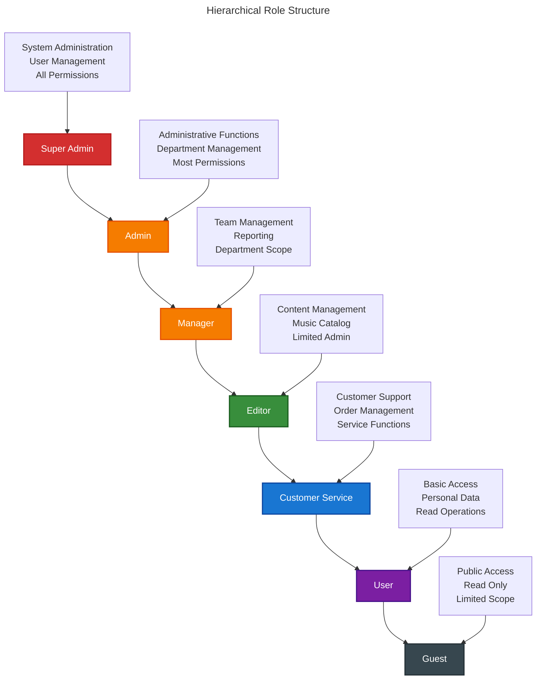

# RBAC Integration Guide

This guide covers the complete integration of spatie/laravel-permission with the `chinook-admin` Filament 4 panel, including hierarchical roles, granular permissions, and resource-level authorization.

## Table of Contents

- [RBAC Architecture](#rbac-architecture)
- [Package Installation](#package-installation)
- [Role Hierarchy Setup](#role-hierarchy-setup)
- [Permission System](#permission-system)
- [Filament Shield Integration](#filament-shield-integration)
- [Resource Authorization](#resource-authorization)
- [Custom Authorization Logic](#custom-authorization-logic)

## RBAC Architecture

The Chinook admin panel implements a 7-tier hierarchical role system with granular permissions:

### Hierarchical Role Structure



### Permission Categories

1. **Entity Permissions**: CRUD operations on specific models
2. **Administrative Permissions**: System management and configuration
3. **Functional Permissions**: Specific business operations
4. **Access Permissions**: Panel and feature access control

## Package Installation

### Install Required Packages

```bash
# Core RBAC package
composer require spatie/laravel-permission:"^6.20"

# Filament Shield for UI integration
composer require bezhansalleh/filament-shield:"^3.0"

# Activity logging for audit trail
composer require spatie/laravel-activitylog:"^4.10"
```

### Publish and Run Migrations

```bash
# Publish permission migrations
php artisan vendor:publish --provider="Spatie\Permission\PermissionServiceProvider"

# Publish Shield resources
php artisan vendor:publish --tag="filament-shield-config"

# Run migrations
php artisan migrate

# Generate Shield resources
php artisan shield:generate --all
```

## Role Hierarchy Setup

### Create Role Seeder

```php
<?php

namespace Database\Seeders;

use Illuminate\Database\Seeder;
use Spatie\Permission\Models\Role;
use Spatie\Permission\Models\Permission;

class RolePermissionSeeder extends Seeder
{
    public function run(): void
    {
        // Reset cached roles and permissions
        app()[\Spatie\Permission\PermissionRegistrar::class]->forgetCachedPermissions();

        // Create roles in hierarchical order
        $roles = [
            'Super Admin' => [
                'description' => 'Full system access with all permissions',
                'level' => 1,
                'color' => '#ff5722'
            ],
            'Admin' => [
                'description' => 'Administrative access with most permissions',
                'level' => 2,
                'color' => '#ff9800'
            ],
            'Manager' => [
                'description' => 'Department management and team oversight',
                'level' => 3,
                'color' => '#ffc107'
            ],
            'Editor' => [
                'description' => 'Content management and music catalog',
                'level' => 4,
                'color' => '#4caf50'
            ],
            'Customer Service' => [
                'description' => 'Customer support and order management',
                'level' => 5,
                'color' => '#2196f3'
            ],
            'User' => [
                'description' => 'Basic authenticated user access',
                'level' => 6,
                'color' => '#9c27b0'
            ],
            'Guest' => [
                'description' => 'Limited read-only access',
                'level' => 7,
                'color' => '#607d8b'
            ],
        ];

        foreach ($roles as $name => $attributes) {
            Role::create([
                'name' => $name,
                'guard_name' => 'web',
                'description' => $attributes['description'],
                'level' => $attributes['level'],
                'color' => $attributes['color'],
            ]);
        }

        $this->createPermissions();
        $this->assignPermissionsToRoles();
    }

    private function createPermissions(): void
    {
        $permissions = [
            // Panel Access
            'access-admin-panel',
            'view-admin-dashboard',
            
            // Artists
            'view-artists', 'create-artists', 'edit-artists', 'delete-artists',
            'restore-artists', 'force-delete-artists', 'export-artists',
            
            // Albums  
            'view-albums', 'create-albums', 'edit-albums', 'delete-albums',
            'restore-albums', 'force-delete-albums', 'export-albums',
            
            // Tracks
            'view-tracks', 'create-tracks', 'edit-tracks', 'delete-tracks',
            'restore-tracks', 'force-delete-tracks', 'export-tracks',
            
            // Categories
            'view-categories', 'create-categories', 'edit-categories', 'delete-categories',
            'manage-category-hierarchy', 'export-categories',
            
            // Customers
            'view-customers', 'create-customers', 'edit-customers', 'delete-customers',
            'export-customers', 'view-customer-analytics',
            
            // Employees
            'view-employees', 'create-employees', 'edit-employees', 'delete-employees',
            'manage-employee-hierarchy', 'export-employees',
            
            // Invoices
            'view-invoices', 'create-invoices', 'edit-invoices', 'delete-invoices',
            'process-payments', 'refund-invoices', 'export-invoices',
            
            // Playlists
            'view-playlists', 'create-playlists', 'edit-playlists', 'delete-playlists',
            'manage-playlist-tracks', 'export-playlists',
            
            // Media Types
            'view-media-types', 'create-media-types', 'edit-media-types', 'delete-media-types',
            
            // User Management
            'view-users', 'create-users', 'edit-users', 'delete-users',
            'assign-roles', 'manage-permissions',
            
            // Analytics and Reporting
            'view-analytics', 'export-reports', 'view-sales-data',
            'view-customer-analytics', 'view-performance-metrics',
            
            // Media Management
            'upload-media', 'delete-media', 'manage-media-library',
            
            // Import/Export
            'import-data', 'export-data', 'bulk-operations',
            
            // System Administration
            'manage-system-settings', 'view-activity-log', 'manage-backups',
        ];

        foreach ($permissions as $permission) {
            Permission::create([
                'name' => $permission,
                'guard_name' => 'web',
            ]);
        }
    }

    private function assignPermissionsToRoles(): void
    {
        // Super Admin gets all permissions
        $superAdmin = Role::findByName('Super Admin');
        $superAdmin->givePermissionTo(Permission::all());

        // Admin gets most permissions (exclude system administration)
        $admin = Role::findByName('Admin');
        $adminPermissions = Permission::whereNotIn('name', [
            'manage-system-settings',
            'manage-backups',
        ])->get();
        $admin->givePermissionTo($adminPermissions);

        // Manager gets department management permissions
        $manager = Role::findByName('Manager');
        $managerPermissions = [
            'access-admin-panel', 'view-admin-dashboard',
            'view-artists', 'edit-artists', 'create-artists',
            'view-albums', 'edit-albums', 'create-albums',
            'view-tracks', 'edit-tracks', 'create-tracks',
            'view-categories', 'edit-categories', 'create-categories',
            'view-customers', 'edit-customers',
            'view-employees', 'edit-employees', 'manage-employee-hierarchy',
            'view-invoices', 'edit-invoices', 'process-payments',
            'view-playlists', 'edit-playlists',
            'view-analytics', 'export-reports',
            'upload-media', 'export-data',
        ];
        $manager->givePermissionTo($managerPermissions);

        // Editor gets content management permissions
        $editor = Role::findByName('Editor');
        $editorPermissions = [
            'access-admin-panel', 'view-admin-dashboard',
            'view-artists', 'edit-artists', 'create-artists',
            'view-albums', 'edit-albums', 'create-albums',
            'view-tracks', 'edit-tracks', 'create-tracks',
            'view-categories', 'edit-categories', 'create-categories',
            'view-playlists', 'edit-playlists', 'create-playlists',
            'upload-media', 'view-analytics',
        ];
        $editor->givePermissionTo($editorPermissions);

        // Customer Service gets customer-focused permissions
        $customerService = Role::findByName('Customer Service');
        $customerServicePermissions = [
            'access-admin-panel', 'view-admin-dashboard',
            'view-customers', 'edit-customers',
            'view-invoices', 'edit-invoices', 'process-payments',
            'view-artists', 'view-albums', 'view-tracks',
            'view-playlists',
        ];
        $customerService->givePermissionTo($customerServicePermissions);

        // User gets basic access
        $user = Role::findByName('User');
        $userPermissions = [
            'view-artists', 'view-albums', 'view-tracks',
            'view-playlists',
        ];
        $user->givePermissionTo($userPermissions);

        // Guest gets read-only access
        $guest = Role::findByName('Guest');
        $guestPermissions = [
            'view-artists', 'view-albums', 'view-tracks',
        ];
        $guest->givePermissionTo($guestPermissions);
    }
}
```

## Permission System

### Granular Permission Structure

Permissions follow a consistent naming pattern: `{action}-{resource}` in kebab-case.

#### Core CRUD Permissions
```php
// Standard CRUD operations for each entity
'view-{resource}'        // Read access
'create-{resource}'      // Create new records
'edit-{resource}'        // Update existing records
'delete-{resource}'      // Soft delete records
'restore-{resource}'     // Restore soft-deleted records
'force-delete-{resource}' // Permanently delete records
'export-{resource}'      // Export data
```

#### Specialized Permissions
```php
// Hierarchical management
'manage-category-hierarchy'
'manage-employee-hierarchy'

// Business operations
'process-payments'
'refund-invoices'
'manage-playlist-tracks'

// System functions
'bulk-operations'
'import-data'
'manage-system-settings'
```

### Permission Groups

Organize permissions into logical groups for easier management:

```php
// config/filament-shield.php
return [
    'permission_prefixes' => [
        'resource' => [
            'view',
            'view_any', 
            'create',
            'update',
            'restore',
            'restore_any',
            'replicate',
            'reorder',
            'delete',
            'delete_any',
            'force_delete',
            'force_delete_any',
        ],
        'page' => 'page',
        'widget' => 'widget',
    ],
    
    'entities' => [
        'pages' => true,
        'widgets' => true,
        'resources' => true,
        'custom_permissions' => true,
    ],
];
```

## Filament Shield Integration

### Configure Shield Plugin

In `ChinookAdminPanelProvider.php`:

```php
->plugins([
    \BezhanSalleh\FilamentShield\FilamentShieldPlugin::make()
        ->gridColumns([
            'default' => 1,
            'sm' => 2,
            'lg' => 3
        ])
        ->sectionColumnSpan(1)
        ->checkboxListColumns([
            'default' => 1,
            'sm' => 2,
            'lg' => 4,
        ])
        ->resourceCheckboxListColumns([
            'default' => 1,
            'sm' => 2,
        ]),
])
```

### Generate Shield Resources

```bash
# Generate all Shield resources
php artisan shield:generate --all

# Generate specific resources
php artisan shield:generate --resource=ArtistResource
php artisan shield:generate --resource=AlbumResource

# Generate role resource
php artisan shield:generate --role

# Generate permission resource  
php artisan shield:generate --permission
```

## Resource Authorization

### Implement Authorization in Resources

```php
<?php

namespace App\Filament\ChinookAdmin\Resources;

use App\Models\Artist;
use Filament\Resources\Resource;
use Illuminate\Database\Eloquent\Builder;

class ArtistResource extends Resource
{
    protected static ?string $model = Artist::class;
    
    protected static ?string $navigationGroup = 'Music Management';
    
    protected static ?string $navigationIcon = 'heroicon-o-microphone';

    // Authorization methods
    public static function canViewAny(): bool
    {
        return auth()->user()->can('view-artists');
    }

    public static function canCreate(): bool
    {
        return auth()->user()->can('create-artists');
    }

    public static function canEdit($record): bool
    {
        return auth()->user()->can('edit-artists');
    }

    public static function canDelete($record): bool
    {
        return auth()->user()->can('delete-artists');
    }

    public static function canDeleteAny(): bool
    {
        return auth()->user()->can('delete-artists');
    }

    public static function canForceDelete($record): bool
    {
        return auth()->user()->can('force-delete-artists');
    }

    public static function canRestore($record): bool
    {
        return auth()->user()->can('restore-artists');
    }

    // Scope records based on user permissions
    public static function getEloquentQuery(): Builder
    {
        $query = parent::getEloquentQuery();
        
        // Managers can only see artists from their region
        if (auth()->user()->hasRole('Manager')) {
            $query->whereHas('albums.tracks.invoiceLines.invoice.customer', function ($q) {
                $q->where('country', auth()->user()->region);
            });
        }
        
        return $query;
    }
}
```

### Navigation Authorization

Control navigation visibility based on permissions:

```php
// In resource classes
protected static function shouldRegisterNavigation(): bool
{
    return auth()->user()->can('view-artists');
}

// In page classes
public static function shouldRegisterNavigation(): bool
{
    return auth()->user()->can('view-analytics');
}
```

## Custom Authorization Logic

### Role-Based Resource Access

```php
<?php

namespace App\Policies;

use App\Models\User;
use App\Models\Artist;
use Illuminate\Auth\Access\HandlesAuthorization;

class ArtistPolicy
{
    use HandlesAuthorization;

    public function viewAny(User $user): bool
    {
        return $user->can('view-artists');
    }

    public function view(User $user, Artist $artist): bool
    {
        if ($user->can('view-artists')) {
            // Managers can only view artists from their region
            if ($user->hasRole('Manager')) {
                return $this->isInUserRegion($user, $artist);
            }
            return true;
        }
        return false;
    }

    public function create(User $user): bool
    {
        return $user->can('create-artists');
    }

    public function update(User $user, Artist $artist): bool
    {
        if ($user->can('edit-artists')) {
            // Editors can only edit artists they created
            if ($user->hasRole('Editor')) {
                return $artist->created_by === $user->id;
            }
            return true;
        }
        return false;
    }

    public function delete(User $user, Artist $artist): bool
    {
        return $user->can('delete-artists') && 
               !$artist->albums()->exists(); // Prevent deletion if has albums
    }

    private function isInUserRegion(User $user, Artist $artist): bool
    {
        return $artist->country === $user->region;
    }
}
```

### Register Policies

```php
// app/Providers/AuthServiceProvider.php
protected $policies = [
    Artist::class => ArtistPolicy::class,
    Album::class => AlbumPolicy::class,
    Track::class => TrackPolicy::class,
    Category::class => CategoryPolicy::class,
    Customer::class => CustomerPolicy::class,
    Employee::class => EmployeePolicy::class,
    Invoice::class => InvoicePolicy::class,
    Playlist::class => PlaylistPolicy::class,
];
```

## Testing RBAC

### Feature Tests

```php
<?php

namespace Tests\Feature\ChinookAdmin;

use App\Models\Artist;use App\Models\User;use Illuminate\Foundation\Testing\RefreshDatabase;use old\TestCase;

class RBACTest extends TestCase
{
    use RefreshDatabase;

    public function test_super_admin_can_access_all_resources(): void
    {
        $user = User::factory()->create();
        $user->assignRole('Super Admin');

        $this->actingAs($user)
            ->get('/chinook-admin/artists')
            ->assertStatus(200);
    }

    public function test_editor_cannot_delete_artists(): void
    {
        $user = User::factory()->create();
        $user->assignRole('Editor');
        
        $artist = Artist::factory()->create();

        $this->actingAs($user)
            ->delete("/chinook-admin/artists/{$artist->id}")
            ->assertStatus(403);
    }

    public function test_customer_service_can_view_invoices(): void
    {
        $user = User::factory()->create();
        $user->assignRole('Customer Service');

        $this->actingAs($user)
            ->get('/chinook-admin/invoices')
            ->assertStatus(200);
    }
}
```

## Next Steps

1. **Configure Navigation** - Set up menu structure with role-based visibility
2. **Apply Security** - Implement additional security measures
3. **Create Resources** - Build Filament resources with proper authorization
4. **Test Permissions** - Implement comprehensive permission tests
5. **Monitor Access** - Set up activity logging and audit trails

## Related Documentation

- **[Navigation Configuration](040-navigation-configuration.md)** - Menu and navigation setup
- **[Security Configuration](050-security-configuration.md)** - Advanced security measures
- **[Resource Documentation](../resources/)** - Implementing authorized resources
