# 4. Navigation Configuration

## Table of Contents

- [Overview](#overview)
- [Navigation Architecture](#navigation-architecture)
  - [Navigation Groups](#navigation-groups)
  - [Resource Organization](#resource-organization)
  - [Access Control Integration](#access-control-integration)
- [Implementation](#implementation)
  - [Panel Provider Configuration](#panel-provider-configuration)
  - [Resource Navigation Setup](#resource-navigation-setup)
  - [Custom Navigation Items](#custom-navigation-items)
- [Navigation Groups](#navigation-groups)
  - [Music Management](#music-management)
  - [Customer Management](#customer-management)
  - [Administration](#administration)
  - [Analytics & Reports](#analytics--reports)
- [Access Control](#access-control)
  - [Permission-Based Visibility](#permission-based-visibility)
  - [Role-Based Navigation](#role-based-navigation)
  - [Dynamic Menu Generation](#dynamic-menu-generation)
- [Customization](#customization)
  - [Icons and Styling](#icons-and-styling)
  - [Sorting and Ordering](#sorting-and-ordering)
  - [Conditional Navigation](#conditional-navigation)
- [Best Practices](#best-practices)
- [Troubleshooting](#troubleshooting)
- [Navigation](#navigation)

## Overview

This guide covers the complete configuration of navigation for the Chinook admin panel, including navigation groups, resource organization, access control integration, and customization options. The navigation system provides an intuitive, role-based interface that adapts to user permissions.

### Key Features

- **Hierarchical Navigation Groups**: Logical organization of resources into functional areas
- **Permission-Based Visibility**: Dynamic navigation based on user roles and permissions
- **Accessibility Compliance**: WCAG 2.1 AA compliant navigation with proper contrast and keyboard support
- **Responsive Design**: Mobile-friendly navigation with collapsible groups
- **Custom Icons**: Heroicon integration with semantic icon selection

## Navigation Architecture

### Navigation Groups

The Chinook admin panel organizes resources into four primary navigation groups:

```mermaid
---
title: Navigation Group Architecture
---
graph TD
    A[Chinook Admin Navigation] --> B[Music Management]
    A --> C[Customer Management]
    A --> D[Administration]
    A --> E[Analytics & Reports]
    
    B --> B1[Artists Resource]
    B --> B2[Albums Resource]
    B --> B3[Tracks Resource]
    B --> B4[Categories Resource]
    B --> B5[Playlists Resource]
    B --> B6[Media Types Resource]
    
    C --> C1[Customers Resource]
    C --> C2[Invoices Resource]
    C --> C3[Invoice Lines Resource]
    
    D --> D1[Employees Resource]
    D --> D2[Users Resource]
    D --> D3[Roles & Permissions]
    D --> D4[Activity Log]
    
    E --> E1[Sales Dashboard]
    E --> E2[Customer Analytics]
    E --> E3[Music Discovery]
    E --> E4[Performance Metrics]
    
    style A fill:#1976d2,stroke:#0d47a1,stroke-width:2px,color:#ffffff
    style B fill:#388e3c,stroke:#1b5e20,stroke-width:2px,color:#ffffff
    style C fill:#f57c00,stroke:#e65100,stroke-width:2px,color:#ffffff
    style D fill:#7b1fa2,stroke:#4a148c,stroke-width:2px,color:#ffffff
    style E fill:#d32f2f,stroke:#b71c1c,stroke-width:2px,color:#ffffff
```



### Resource Organization

Resources are organized by functional area with logical grouping:

- **Music Management**: Core music catalog functionality
- **Customer Management**: Customer and sales operations
- **Administration**: User and system management
- **Analytics & Reports**: Business intelligence and reporting

### Access Control Integration

Navigation visibility is controlled by:

- **Resource Permissions**: Users see only resources they can access
- **Role-Based Filtering**: Navigation adapts to user role hierarchy
- **Dynamic Generation**: Menu items appear/disappear based on permissions

## Implementation

### Panel Provider Configuration

Configure navigation in the `ChinookAdminPanelProvider`:

```php
<?php

declare(strict_types=1);

namespace App\Providers\Filament;

use Filament\Http\Middleware\Authenticate;
use Filament\Http\Middleware\DisableBladeIconComponents;
use Filament\Http\Middleware\DispatchServingFilamentEvent;
use Filament\Navigation\NavigationGroup;
use Filament\Panel;
use Filament\PanelProvider;
use Filament\Support\Colors\Color;
use Illuminate\Cookie\Middleware\AddQueuedCookiesToResponse;
use Illuminate\Cookie\Middleware\EncryptCookies;
use Illuminate\Foundation\Http\Middleware\VerifyCsrfToken;
use Illuminate\Routing\Middleware\SubstituteBindings;
use Illuminate\Session\Middleware\AuthenticateSession;
use Illuminate\Session\Middleware\StartSession;
use Illuminate\View\Middleware\ShareErrorsFromSession;

class ChinookAdminPanelProvider extends PanelProvider
{
    public function panel(Panel $panel): Panel
    {
        return $panel
            ->id('chinook-admin')
            ->path('chinook-admin')
            ->login()
            ->colors([
                'primary' => Color::Blue,
            ])
            ->discoverResources(in: app_path('Filament/ChinookAdmin/Resources'), for: 'App\\Filament\\ChinookAdmin\\Resources')
            ->discoverPages(in: app_path('Filament/ChinookAdmin/Pages'), for: 'App\\Filament\\ChinookAdmin\\Pages')
            ->pages([
                // Custom pages
            ])
            ->discoverWidgets(in: app_path('Filament/ChinookAdmin/Widgets'), for: 'App\\Filament\\ChinookAdmin\\Widgets')
            ->widgets([
                // Custom widgets
            ])
            ->navigationGroups([
                NavigationGroup::make('Music Management')
                    ->icon('heroicon-o-musical-note')
                    ->collapsed(false),
                NavigationGroup::make('Customer Management')
                    ->icon('heroicon-o-users')
                    ->collapsed(false),
                NavigationGroup::make('Administration')
                    ->icon('heroicon-o-cog-6-tooth')
                    ->collapsed(true),
                NavigationGroup::make('Analytics & Reports')
                    ->icon('heroicon-o-chart-bar')
                    ->collapsed(true),
            ])
            ->middleware([
                EncryptCookies::class,
                AddQueuedCookiesToResponse::class,
                StartSession::class,
                AuthenticateSession::class,
                ShareErrorsFromSession::class,
                VerifyCsrfToken::class,
                SubstituteBindings::class,
                DisableBladeIconComponents::class,
                DispatchServingFilamentEvent::class,
            ])
            ->authMiddleware([
                Authenticate::class,
            ]);
    }
}
```

### Resource Navigation Setup

Configure navigation properties in each resource:

```php
<?php

declare(strict_types=1);

namespace App\Filament\ChinookAdmin\Resources;

use App\Models\Artist;
use Filament\Resources\Resource;

class ArtistResource extends Resource
{
    protected static ?string $model = Artist::class;
    
    // Navigation configuration
    protected static ?string $navigationIcon = 'heroicon-o-microphone';
    
    protected static ?string $navigationGroup = 'Music Management';
    
    protected static ?int $navigationSort = 10;
    
    protected static ?string $navigationLabel = 'Artists';
    
    protected static ?string $navigationBadgeTooltip = 'Total number of artists';
    
    // Permission-based navigation visibility
    protected static function shouldRegisterNavigation(): bool
    {
        return auth()->user()?->can('view-artists') ?? false;
    }
    
    // Dynamic badge count
    public static function getNavigationBadge(): ?string
    {
        if (auth()->user()?->can('view-artists')) {
            return static::getModel()::count();
        }
        
        return null;
    }
    
    // Badge color based on count
    public static function getNavigationBadgeColor(): ?string
    {
        $count = static::getModel()::count();
        
        return match (true) {
            $count > 100 => 'success',
            $count > 50 => 'warning',
            default => 'primary',
        };
    }
}
```

### Custom Navigation Items

Add custom navigation items for non-resource pages:

```php
// In ChinookAdminPanelProvider
->navigationItems([
    NavigationItem::make('System Settings')
        ->icon('heroicon-o-cog-6-tooth')
        ->group('Administration')
        ->sort(100)
        ->url(fn (): string => route('filament.chinook-admin.pages.settings'))
        ->visible(fn (): bool => auth()->user()?->can('manage-system-settings') ?? false),
        
    NavigationItem::make('Import Data')
        ->icon('heroicon-o-arrow-down-tray')
        ->group('Administration')
        ->sort(110)
        ->url(fn (): string => route('filament.chinook-admin.pages.import'))
        ->visible(fn (): bool => auth()->user()?->can('import-data') ?? false),
        
    NavigationItem::make('Export Data')
        ->icon('heroicon-o-arrow-up-tray')
        ->group('Administration')
        ->sort(120)
        ->url(fn (): string => route('filament.chinook-admin.pages.export'))
        ->visible(fn (): bool => auth()->user()?->can('export-data') ?? false),
])
```

## Navigation Groups

### Music Management

**Purpose**: Core music catalog management
**Icon**: `heroicon-o-musical-note`
**Collapsed**: `false` (always expanded)

**Resources**:
1. **Artists** (`sort: 10`) - Artist management with albums relationship
2. **Albums** (`sort: 20`) - Album management with tracks relationship
3. **Tracks** (`sort: 30`) - Track management with complex relationships
4. **Categories** (`sort: 40`) - Hierarchical category management
5. **Playlists** (`sort: 50`) - Playlist management with track relationships
6. **Media Types** (`sort: 60`) - Media type management with usage statistics

### Customer Management

**Purpose**: Customer and sales operations
**Icon**: `heroicon-o-users`
**Collapsed**: `false` (always expanded)

**Resources**:
1. **Customers** (`sort: 10`) - Customer management with invoices relationship
2. **Invoices** (`sort: 20`) - Invoice management with payment workflows
3. **Invoice Lines** (`sort: 30`) - Invoice line items management (if accessible)

### Administration

**Purpose**: User and system management
**Icon**: `heroicon-o-cog-6-tooth`
**Collapsed**: `true` (collapsed by default)

**Resources**:
1. **Employees** (`sort: 10`) - Employee management with hierarchy visualization
2. **Users** (`sort: 20`) - User management with RBAC integration
3. **Roles & Permissions** (`sort: 30`) - Role and permission management
4. **Activity Log** (`sort: 40`) - System activity and audit trails

**Custom Items**:
- **System Settings** (`sort: 100`) - System configuration
- **Import Data** (`sort: 110`) - Data import functionality
- **Export Data** (`sort: 120`) - Data export functionality

### Analytics & Reports

**Purpose**: Business intelligence and reporting
**Icon**: `heroicon-o-chart-bar`
**Collapsed**: `true` (collapsed by default)

**Custom Items**:
- **Sales Dashboard** (`sort: 10`) - Sales analytics and metrics
- **Customer Analytics** (`sort: 20`) - Customer behavior analysis
- **Music Discovery** (`sort: 30`) - Music catalog insights
- **Performance Metrics** (`sort: 40`) - System performance monitoring

## Access Control

### Permission-Based Visibility

Each navigation item checks appropriate permissions:

```php
// Resource-level permission check
protected static function shouldRegisterNavigation(): bool
{
    return auth()->user()?->can('view-{resource}') ?? false;
}

// Custom navigation item permission check
NavigationItem::make('System Settings')
    ->visible(fn (): bool => auth()->user()?->can('manage-system-settings') ?? false)
```

### Role-Based Navigation

Navigation adapts to user roles:

- **Super Admin**: All navigation items visible
- **Admin**: Most items visible, limited system settings
- **Manager**: Department-specific items, reporting access
- **Editor**: Content management items only
- **Customer Service**: Customer and order management
- **User**: Basic access items only
- **Guest**: Read-only items only

### Dynamic Menu Generation

Navigation is generated dynamically based on:

1. **User Authentication**: Only authenticated users see navigation
2. **Permission Checks**: Items appear only if user has required permissions
3. **Resource Availability**: Items hidden if underlying resources are unavailable
4. **Business Rules**: Custom logic for conditional navigation

## Customization

### Icons and Styling

Use Heroicons for consistent iconography:

```php
// Resource icons
protected static ?string $navigationIcon = 'heroicon-o-microphone'; // Artists
protected static ?string $navigationIcon = 'heroicon-o-musical-note'; // Albums
protected static ?string $navigationIcon = 'heroicon-o-play'; // Tracks
protected static ?string $navigationIcon = 'heroicon-o-tag'; // Categories
protected static ?string $navigationIcon = 'heroicon-o-queue-list'; // Playlists
protected static ?string $navigationIcon = 'heroicon-o-document'; // Media Types
protected static ?string $navigationIcon = 'heroicon-o-users'; // Customers
protected static ?string $navigationIcon = 'heroicon-o-document-text'; // Invoices
protected static ?string $navigationIcon = 'heroicon-o-user-group'; // Employees
```

### Sorting and Ordering

Control navigation order with sort values:

```php
// Primary resources (10-60)
protected static ?int $navigationSort = 10; // Artists
protected static ?int $navigationSort = 20; // Albums
protected static ?int $navigationSort = 30; // Tracks

// Secondary resources (70-90)
protected static ?int $navigationSort = 70; // Categories
protected static ?int $navigationSort = 80; // Playlists

// Administrative items (100+)
protected static ?int $navigationSort = 100; // System Settings
protected static ?int $navigationSort = 110; // Import/Export
```

### Conditional Navigation

Implement conditional navigation based on business logic:

```php
// Show invoice lines only if user can manage invoices
protected static function shouldRegisterNavigation(): bool
{
    return auth()->user()?->can('view-invoices') && 
           auth()->user()?->can('edit-invoices');
}

// Show analytics only during business hours
NavigationItem::make('Real-time Analytics')
    ->visible(fn (): bool => 
        auth()->user()?->can('view-analytics') && 
        now()->between('08:00', '18:00')
    )
```

## Best Practices

### Navigation Organization

1. **Logical Grouping**: Group related resources together
2. **Consistent Sorting**: Use consistent sort increments (10, 20, 30)
3. **Meaningful Icons**: Choose icons that clearly represent functionality
4. **Permission Alignment**: Ensure navigation permissions match resource permissions

### Performance Optimization

1. **Efficient Permission Checks**: Cache permission results where possible
2. **Lazy Loading**: Defer loading of navigation badges and counts
3. **Minimal Queries**: Avoid N+1 queries in navigation badge generation
4. **Caching**: Cache navigation structure for better performance

### Accessibility

1. **Semantic Icons**: Use descriptive icons with proper alt text
2. **Keyboard Navigation**: Ensure full keyboard accessibility
3. **Screen Reader Support**: Provide proper ARIA labels
4. **Color Contrast**: Maintain WCAG 2.1 AA contrast ratios

### User Experience

1. **Intuitive Organization**: Group items logically by function
2. **Consistent Labeling**: Use clear, descriptive labels
3. **Visual Hierarchy**: Use proper spacing and grouping
4. **Responsive Design**: Ensure navigation works on all devices

## Troubleshooting

### Common Issues

1. **Navigation Items Not Appearing**:
   - Check permission configuration
   - Verify resource registration
   - Confirm user authentication

2. **Incorrect Sorting**:
   - Review sort values
   - Check for duplicate sort numbers
   - Verify group assignment

3. **Permission Errors**:
   - Validate permission names
   - Check role assignments
   - Verify permission seeding

4. **Icon Display Issues**:
   - Confirm Heroicon name spelling
   - Check icon availability
   - Verify icon syntax

### Debugging Navigation

```php
// Debug navigation visibility
protected static function shouldRegisterNavigation(): bool
{
    $user = auth()->user();
    $canView = $user?->can('view-artists');
    
    logger('Navigation Debug', [
        'user_id' => $user?->id,
        'can_view_artists' => $canView,
        'permissions' => $user?->getAllPermissions()->pluck('name'),
    ]);
    
    return $canView ?? false;
}
```

---

## Navigation

**← Previous:** [RBAC Integration](030-rbac-integration.md)

**Next →** [Security Configuration](050-security-configuration.md)
