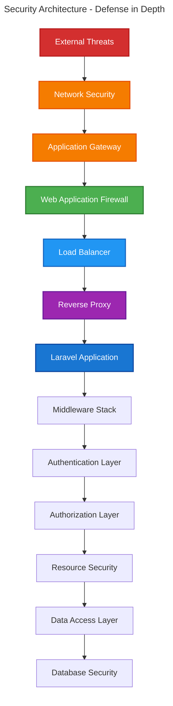

# 5. Security Configuration

## Table of Contents

- [Overview](#overview)
- [Security Architecture](#security-architecture)
  - [Defense in Depth](#defense-in-depth)
  - [Security Layers](#security-layers)
  - [Threat Model](#threat-model)
- [Middleware Configuration](#middleware-configuration)
  - [Core Security Middleware](#core-security-middleware)
  - [Authentication Middleware](#authentication-middleware)
  - [Authorization Middleware](#authorization-middleware)
- [Authentication Security](#authentication-security)
  - [Session Management](#session-management)
  - [Password Policies](#password-policies)
  - [Multi-Factor Authentication](#multi-factor-authentication)
- [Authorization Security](#authorization-security)
  - [Permission Validation](#permission-validation)
  - [Resource-Level Security](#resource-level-security)
  - [Field-Level Security](#field-level-security)
- [Input Validation](#input-validation)
  - [Form Validation](#form-validation)
  - [File Upload Security](#file-upload-security)
  - [SQL Injection Prevention](#sql-injection-prevention)
- [CSRF Protection](#csrf-protection)
- [Rate Limiting](#rate-limiting)
- [Security Headers](#security-headers)
- [Logging and Monitoring](#logging-and-monitoring)
- [Best Practices](#best-practices)
- [Security Testing](#security-testing)
- [Navigation](#navigation)

## Overview

This guide covers comprehensive security configuration for the Chinook admin panel, implementing defense-in-depth strategies to protect against common web application vulnerabilities. The security model follows Laravel 12 best practices and industry standards.

### Security Objectives

- **Confidentiality**: Protect sensitive data from unauthorized access
- **Integrity**: Ensure data accuracy and prevent unauthorized modifications
- **Availability**: Maintain system availability and prevent denial of service
- **Accountability**: Track and audit all user actions
- **Non-repudiation**: Ensure actions cannot be denied

## Security Architecture

### Defense in Depth

The security architecture implements multiple layers of protection:



### Security Layers

1. **Network Security**: Firewall, DDoS protection, SSL/TLS
2. **Application Security**: WAF, rate limiting, input validation
3. **Authentication Security**: Multi-factor auth, session management
4. **Authorization Security**: RBAC, permission validation
5. **Data Security**: Encryption, access controls, audit logging

### Threat Model

**Primary Threats**:
- **Unauthorized Access**: Brute force, credential stuffing
- **Privilege Escalation**: Role manipulation, permission bypass
- **Data Injection**: SQL injection, XSS, CSRF
- **Data Exfiltration**: Unauthorized data access and export
- **Denial of Service**: Resource exhaustion, application flooding

## Middleware Configuration

### Core Security Middleware

Configure the complete middleware stack in `ChinookAdminPanelProvider`:

```php
<?php

declare(strict_types=1);

namespace App\Providers\Filament;

use App\Http\Middleware\ChinookAdminSecurity;
use App\Http\Middleware\LogAdminActivity;
use App\Http\Middleware\ValidateAdminAccess;
use Filament\Http\Middleware\Authenticate;
use Filament\Http\Middleware\DisableBladeIconComponents;
use Filament\Http\Middleware\DispatchServingFilamentEvent;
use Filament\Panel;
use Filament\PanelProvider;
use Illuminate\Cookie\Middleware\AddQueuedCookiesToResponse;
use Illuminate\Cookie\Middleware\EncryptCookies;
use Illuminate\Foundation\Http\Middleware\VerifyCsrfToken;
use Illuminate\Http\Middleware\TrustProxies;
use Illuminate\Routing\Middleware\SubstituteBindings;
use Illuminate\Session\Middleware\AuthenticateSession;
use Illuminate\Session\Middleware\StartSession;
use Illuminate\View\Middleware\ShareErrorsFromSession;

class ChinookAdminPanelProvider extends PanelProvider
{
    public function panel(Panel $panel): Panel
    {
        return $panel
            ->id('chinook-admin')
            ->path('chinook-admin')
            ->middleware([
                // Core Laravel middleware
                TrustProxies::class,
                EncryptCookies::class,
                AddQueuedCookiesToResponse::class,
                StartSession::class,
                ShareErrorsFromSession::class,
                VerifyCsrfToken::class,
                SubstituteBindings::class,
                
                // Filament middleware
                DisableBladeIconComponents::class,
                DispatchServingFilamentEvent::class,
                
                // Custom security middleware
                ChinookAdminSecurity::class,
                LogAdminActivity::class,
            ])
            ->authMiddleware([
                Authenticate::class,
                AuthenticateSession::class,
                ValidateAdminAccess::class,
            ]);
    }
}
```

### Authentication Middleware

Create custom authentication middleware for enhanced security:

```php
<?php

declare(strict_types=1);

namespace App\Http\Middleware;

use Closure;
use Illuminate\Http\Request;
use Illuminate\Support\Facades\Auth;
use Illuminate\Support\Facades\Log;
use Symfony\Component\HttpFoundation\Response;

class ValidateAdminAccess
{
    public function handle(Request $request, Closure $next): Response
    {
        $user = Auth::user();
        
        // Ensure user exists and is active
        if (!$user || !$user->is_active) {
            Log::warning('Inactive user attempted admin access', [
                'user_id' => $user?->id,
                'ip' => $request->ip(),
                'user_agent' => $request->userAgent(),
            ]);
            
            Auth::logout();
            return redirect()->route('filament.chinook-admin.auth.login');
        }
        
        // Verify user has admin panel access
        if (!$user->can('access-admin-panel')) {
            Log::warning('Unauthorized admin panel access attempt', [
                'user_id' => $user->id,
                'ip' => $request->ip(),
                'user_agent' => $request->userAgent(),
            ]);
            
            abort(403, 'Access denied to admin panel');
        }
        
        // Check for suspicious activity
        if ($this->detectSuspiciousActivity($request, $user)) {
            Log::alert('Suspicious admin activity detected', [
                'user_id' => $user->id,
                'ip' => $request->ip(),
                'user_agent' => $request->userAgent(),
                'url' => $request->fullUrl(),
            ]);
            
            // Optional: Force logout or additional verification
        }
        
        return $next($request);
    }
    
    private function detectSuspiciousActivity(Request $request, $user): bool
    {
        // Implement suspicious activity detection logic
        // - Multiple IP addresses
        // - Unusual user agent patterns
        // - Rapid successive requests
        // - Access from blocked countries
        
        return false; // Placeholder
    }
}
```

### Authorization Middleware

Implement resource-level authorization middleware:

```php
<?php

declare(strict_types=1);

namespace App\Http\Middleware;

use Closure;
use Illuminate\Http\Request;
use Illuminate\Support\Facades\Auth;
use Illuminate\Support\Facades\Log;
use Symfony\Component\HttpFoundation\Response;

class ChinookAdminSecurity
{
    public function handle(Request $request, Closure $next): Response
    {
        // Security headers
        $response = $next($request);
        
        $response->headers->set('X-Frame-Options', 'DENY');
        $response->headers->set('X-Content-Type-Options', 'nosniff');
        $response->headers->set('X-XSS-Protection', '1; mode=block');
        $response->headers->set('Referrer-Policy', 'strict-origin-when-cross-origin');
        $response->headers->set('Permissions-Policy', 'geolocation=(), microphone=(), camera=()');
        
        // Content Security Policy
        $csp = "default-src 'self'; " .
               "script-src 'self' 'unsafe-inline' 'unsafe-eval'; " .
               "style-src 'self' 'unsafe-inline'; " .
               "img-src 'self' data: https:; " .
               "font-src 'self' data:; " .
               "connect-src 'self'; " .
               "frame-ancestors 'none';";
        
        $response->headers->set('Content-Security-Policy', $csp);
        
        return $response;
    }
}
```

## Authentication Security

### Session Management

Configure secure session handling:

```php
// config/session.php
return [
    'driver' => env('SESSION_DRIVER', 'database'),
    'lifetime' => env('SESSION_LIFETIME', 120), // 2 hours
    'expire_on_close' => true,
    'encrypt' => true,
    'files' => storage_path('framework/sessions'),
    'connection' => env('SESSION_CONNECTION'),
    'table' => 'sessions',
    'store' => env('SESSION_STORE'),
    'lottery' => [2, 100],
    'cookie' => env('SESSION_COOKIE', 'chinook_admin_session'),
    'path' => '/chinook-admin',
    'domain' => env('SESSION_DOMAIN'),
    'secure' => env('SESSION_SECURE_COOKIE', true),
    'http_only' => true,
    'same_site' => 'strict',
    'partitioned' => false,
];
```

### Password Policies

Implement strong password requirements:

```php
<?php

declare(strict_types=1);

namespace App\Rules;

use Closure;
use Illuminate\Contracts\Validation\ValidationRule;

class StrongPassword implements ValidationRule
{
    public function validate(string $attribute, mixed $value, Closure $fail): void
    {
        if (!is_string($value)) {
            $fail('The :attribute must be a string.');
            return;
        }
        
        // Minimum length
        if (strlen($value) < 12) {
            $fail('The :attribute must be at least 12 characters long.');
        }
        
        // Must contain uppercase letter
        if (!preg_match('/[A-Z]/', $value)) {
            $fail('The :attribute must contain at least one uppercase letter.');
        }
        
        // Must contain lowercase letter
        if (!preg_match('/[a-z]/', $value)) {
            $fail('The :attribute must contain at least one lowercase letter.');
        }
        
        // Must contain number
        if (!preg_match('/[0-9]/', $value)) {
            $fail('The :attribute must contain at least one number.');
        }
        
        // Must contain special character
        if (!preg_match('/[^A-Za-z0-9]/', $value)) {
            $fail('The :attribute must contain at least one special character.');
        }
        
        // Check against common passwords
        if ($this->isCommonPassword($value)) {
            $fail('The :attribute is too common. Please choose a more secure password.');
        }
    }
    
    private function isCommonPassword(string $password): bool
    {
        $commonPasswords = [
            'password123',
            'admin123456',
            'administrator',
            'welcome123',
            // Add more common passwords
        ];
        
        return in_array(strtolower($password), $commonPasswords, true);
    }
}
```

### Multi-Factor Authentication

Configure optional 2FA for enhanced security:

```php
// In User model
use Laravel\Fortify\TwoFactorAuthenticatable;

class User extends Authenticatable
{
    use TwoFactorAuthenticatable;
    
    // Force 2FA for admin roles
    public function requiresTwoFactorAuthentication(): bool
    {
        return $this->hasRole(['super-admin', 'admin']);
    }
    
    // Check if 2FA is properly configured
    public function hasTwoFactorEnabled(): bool
    {
        return !is_null($this->two_factor_secret);
    }
}
```

## Authorization Security

### Permission Validation

Implement comprehensive permission checking:

```php
<?php

declare(strict_types=1);

namespace App\Policies;

use App\Models\User;
use App\Models\Artist;
use Illuminate\Auth\Access\HandlesAuthorization;

class ArtistPolicy
{
    use HandlesAuthorization;
    
    public function viewAny(User $user): bool
    {
        return $user->can('view-artists');
    }
    
    public function view(User $user, Artist $artist): bool
    {
        // Basic permission check
        if (!$user->can('view-artists')) {
            return false;
        }
        
        // Additional business logic
        if ($artist->is_private && !$user->can('view-private-artists')) {
            return false;
        }
        
        return true;
    }
    
    public function create(User $user): bool
    {
        return $user->can('create-artists');
    }
    
    public function update(User $user, Artist $artist): bool
    {
        if (!$user->can('edit-artists')) {
            return false;
        }
        
        // Prevent editing of system artists
        if ($artist->is_system && !$user->can('edit-system-artists')) {
            return false;
        }
        
        return true;
    }
    
    public function delete(User $user, Artist $artist): bool
    {
        if (!$user->can('delete-artists')) {
            return false;
        }
        
        // Prevent deletion of artists with active sales
        if ($artist->hasActiveSales() && !$user->can('force-delete-artists')) {
            return false;
        }
        
        return true;
    }
}
```

### Resource-Level Security

Implement security at the resource level:

```php
<?php

declare(strict_types=1);

namespace App\Filament\ChinookAdmin\Resources;

use App\Models\Artist;
use Filament\Resources\Resource;
use Illuminate\Database\Eloquent\Builder;

class ArtistResource extends Resource
{
    protected static ?string $model = Artist::class;
    
    // Global scope for data access
    public static function getEloquentQuery(): Builder
    {
        $query = parent::getEloquentQuery();
        
        $user = auth()->user();
        
        // Super admins see everything
        if ($user->hasRole('super-admin')) {
            return $query;
        }
        
        // Regular users see only active artists
        $query->where('is_active', true);
        
        // Apply additional filters based on user role
        if (!$user->can('view-private-artists')) {
            $query->where('is_private', false);
        }
        
        return $query;
    }
    
    // Authorization methods
    public static function canViewAny(): bool
    {
        return auth()->user()?->can('view-artists') ?? false;
    }
    
    public static function canCreate(): bool
    {
        return auth()->user()?->can('create-artists') ?? false;
    }
    
    public static function canEdit($record): bool
    {
        return auth()->user()?->can('update', $record) ?? false;
    }
    
    public static function canDelete($record): bool
    {
        return auth()->user()?->can('delete', $record) ?? false;
    }
}
```

### Field-Level Security

Implement conditional field visibility and editing:

```php
use Filament\Forms\Components\TextInput;
use Filament\Forms\Components\Toggle;

// In resource form method
public static function form(Form $form): Form
{
    return $form
        ->schema([
            TextInput::make('name')
                ->required()
                ->maxLength(255),
                
            TextInput::make('biography')
                ->visible(fn () => auth()->user()?->can('edit-artist-biography'))
                ->disabled(fn () => !auth()->user()?->can('edit-artist-biography')),
                
            Toggle::make('is_active')
                ->visible(fn () => auth()->user()?->can('manage-artist-status'))
                ->disabled(fn () => !auth()->user()?->can('manage-artist-status')),
                
            Toggle::make('is_private')
                ->visible(fn () => auth()->user()?->can('manage-artist-privacy'))
                ->disabled(fn () => !auth()->user()?->can('manage-artist-privacy')),
        ]);
}
```

## Input Validation

### Form Validation

Implement comprehensive form validation:

```php
use App\Rules\StrongPassword;
use App\Rules\SafeHtml;
use Filament\Forms\Components\TextInput;

TextInput::make('name')
    ->required()
    ->maxLength(255)
    ->rules([
        'string',
        'max:255',
        new SafeHtml(),
    ])
    ->validationMessages([
        'required' => 'Artist name is required.',
        'max' => 'Artist name cannot exceed 255 characters.',
    ]),

TextInput::make('password')
    ->password()
    ->required()
    ->rules([
        'confirmed',
        new StrongPassword(),
    ])
    ->validationMessages([
        'confirmed' => 'Password confirmation does not match.',
    ]),
```

### File Upload Security

Secure file upload configuration:

```php
use Filament\Forms\Components\FileUpload;

FileUpload::make('avatar')
    ->image()
    ->maxSize(2048) // 2MB
    ->acceptedFileTypes(['image/jpeg', 'image/png', 'image/webp'])
    ->directory('avatars')
    ->visibility('private')
    ->rules([
        'image',
        'max:2048',
        'mimes:jpeg,png,webp',
        'dimensions:min_width=100,min_height=100,max_width=2000,max_height=2000',
    ])
    ->validationMessages([
        'image' => 'File must be a valid image.',
        'max' => 'Image size cannot exceed 2MB.',
        'mimes' => 'Only JPEG, PNG, and WebP images are allowed.',
        'dimensions' => 'Image dimensions must be between 100x100 and 2000x2000 pixels.',
    ]),
```

### SQL Injection Prevention

Use Eloquent ORM and parameterized queries:

```php
// SECURE: Using Eloquent ORM
$artists = Artist::where('name', 'like', '%' . $search . '%')
    ->where('is_active', true)
    ->get();

// SECURE: Using Query Builder with bindings
$artists = DB::table('artists')
    ->where('name', 'like', '%' . $search . '%')
    ->where('is_active', true)
    ->get();

// AVOID: Raw SQL with user input
// $artists = DB::select("SELECT * FROM artists WHERE name LIKE '%{$search}%'");
```

## CSRF Protection

CSRF protection is automatically enabled through Laravel's middleware stack. Ensure all forms include CSRF tokens:

```php
// Automatically handled by Filament forms
// Manual forms should include:
@csrf
```

## Rate Limiting

Configure rate limiting for admin panel:

```php
// config/rate-limiting.php
use Illuminate\Cache\RateLimiting\Limit;
use Illuminate\Http\Request;
use Illuminate\Support\Facades\RateLimiter;

// Admin panel login attempts
RateLimiter::for('admin-login', function (Request $request) {
    return Limit::perMinute(5)->by($request->ip());
});

// Admin panel API requests
RateLimiter::for('admin-api', function (Request $request) {
    return $request->user()
        ? Limit::perMinute(100)->by($request->user()->id)
        : Limit::perMinute(10)->by($request->ip());
});

// File uploads
RateLimiter::for('admin-uploads', function (Request $request) {
    return Limit::perMinute(10)->by($request->user()->id);
});
```

## Security Headers

Implement comprehensive security headers:

```php
// In ChinookAdminSecurity middleware
private function setSecurityHeaders(Response $response): void
{
    $headers = [
        'X-Frame-Options' => 'DENY',
        'X-Content-Type-Options' => 'nosniff',
        'X-XSS-Protection' => '1; mode=block',
        'Referrer-Policy' => 'strict-origin-when-cross-origin',
        'Permissions-Policy' => 'geolocation=(), microphone=(), camera=()',
        'Strict-Transport-Security' => 'max-age=31536000; includeSubDomains; preload',
    ];
    
    foreach ($headers as $name => $value) {
        $response->headers->set($name, $value);
    }
}
```

## Logging and Monitoring

### Security Event Logging

```php
<?php

declare(strict_types=1);

namespace App\Http\Middleware;

use Closure;
use Illuminate\Http\Request;
use Illuminate\Support\Facades\Log;
use Symfony\Component\HttpFoundation\Response;

class LogAdminActivity
{
    public function handle(Request $request, Closure $next): Response
    {
        $user = auth()->user();
        
        // Log admin access
        Log::channel('admin')->info('Admin panel access', [
            'user_id' => $user?->id,
            'ip' => $request->ip(),
            'user_agent' => $request->userAgent(),
            'url' => $request->fullUrl(),
            'method' => $request->method(),
        ]);
        
        $response = $next($request);
        
        // Log response status
        if ($response->getStatusCode() >= 400) {
            Log::channel('admin')->warning('Admin panel error', [
                'user_id' => $user?->id,
                'status_code' => $response->getStatusCode(),
                'url' => $request->fullUrl(),
            ]);
        }
        
        return $response;
    }
}
```

### Security Monitoring

```php
// config/logging.php
'channels' => [
    'admin' => [
        'driver' => 'daily',
        'path' => storage_path('logs/admin.log'),
        'level' => env('LOG_LEVEL', 'debug'),
        'days' => 90,
    ],
    
    'security' => [
        'driver' => 'daily',
        'path' => storage_path('logs/security.log'),
        'level' => 'warning',
        'days' => 365,
    ],
],
```

## Best Practices

### Security Checklist

- [ ] **Authentication**: Strong passwords, session security, optional 2FA
- [ ] **Authorization**: RBAC implementation, permission validation
- [ ] **Input Validation**: Comprehensive form validation, file upload security
- [ ] **Output Encoding**: XSS prevention, safe HTML rendering
- [ ] **CSRF Protection**: Token validation on all forms
- [ ] **Rate Limiting**: Protection against brute force and DoS
- [ ] **Security Headers**: Comprehensive header configuration
- [ ] **Logging**: Security event logging and monitoring
- [ ] **Error Handling**: Secure error messages, no information disclosure
- [ ] **Data Protection**: Encryption at rest and in transit

### Development Security

1. **Secure Coding**: Follow OWASP guidelines
2. **Code Review**: Security-focused code reviews
3. **Testing**: Security testing and vulnerability scanning
4. **Dependencies**: Regular security updates
5. **Configuration**: Secure default configurations

### Production Security

1. **Environment**: Secure production environment
2. **Monitoring**: Real-time security monitoring
3. **Incident Response**: Security incident procedures
4. **Backup**: Secure backup and recovery
5. **Compliance**: Regulatory compliance requirements

## Security Testing

### Automated Testing

```php
<?php

declare(strict_types=1);

namespace Tests\Feature\Security;

use App\Models\User;use old\TestCase;

class AdminSecurityTest extends TestCase
{
    public function test_unauthorized_access_blocked(): void
    {
        $response = $this->get('/chinook-admin');
        
        $response->assertRedirect('/chinook-admin/login');
    }
    
    public function test_csrf_protection_enabled(): void
    {
        $user = User::factory()->create();
        
        $response = $this->actingAs($user)
            ->post('/chinook-admin/artists', [
                'name' => 'Test Artist',
                // Missing CSRF token
            ]);
        
        $response->assertStatus(419); // CSRF token mismatch
    }
    
    public function test_rate_limiting_enforced(): void
    {
        for ($i = 0; $i < 10; $i++) {
            $this->post('/chinook-admin/login', [
                'email' => 'test@example.com',
                'password' => 'wrong-password',
            ]);
        }
        
        $response = $this->post('/chinook-admin/login', [
            'email' => 'test@example.com',
            'password' => 'wrong-password',
        ]);
        
        $response->assertStatus(429); // Too many requests
    }
}
```

### Manual Security Testing

1. **Authentication Testing**: Test login, logout, session management
2. **Authorization Testing**: Test role and permission enforcement
3. **Input Validation Testing**: Test form validation and file uploads
4. **XSS Testing**: Test for cross-site scripting vulnerabilities
5. **CSRF Testing**: Test CSRF protection mechanisms
6. **SQL Injection Testing**: Test database query security

---

## Navigation

**← Previous:** [Navigation Configuration](040-navigation-configuration.md)

**Next →** [Environment Setup](060-environment-setup.md)
