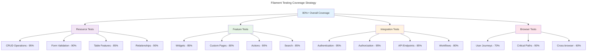

# Filament Testing Documentation

This directory contains comprehensive testing strategies and examples for the Chinook admin panel, covering all aspects of Filament 4 functionality with a target of 80%+ test coverage.

## Documentation Structure

### Testing Fundamentals
1. **[Testing Strategy](010-testing-strategy.md)** - Overall testing approach and methodology
2. **[Test Environment Setup](020-test-environment-setup.md)** - Configuration and test database setup
3. **[Test Data Management](030-test-data-management.md)** - Test data factories and seeding strategies
4. **[CI Integration](040-ci-integration.md)** - Continuous integration and automated testing

### Resource Testing
5. **[Resource Testing](050-resource-testing.md)** - Testing Filament resources and CRUD operations
6. **[Form Testing](060-form-testing.md)** - Form validation and component testing
7. **[Table Testing](070-table-testing.md)** - Table functionality and filtering tests
8. **[Action Testing](080-action-testing.md)** - Custom actions and bulk operations testing

### Authentication & Authorization
9. **[Authentication Testing](090-auth-testing.md)** - User authentication and session testing
10. **[RBAC Testing](100-rbac-testing.md)** - Role-based access control testing
11. **[API Testing](110-api-testing.md)** - API endpoint and authentication testing

### Performance & Quality
12. **[Database Testing](120-database-testing.md)** - Database operations and query testing
13. **[Performance Testing](130-performance-testing.md)** - Load testing and optimization validation
14. **[Browser Testing](140-browser-testing.md)** - End-to-end browser testing with Laravel Dusk

### Specialized Testing
15. **[Accessibility Testing](150-accessibility-testing.md)** - WCAG 2.1 AA compliance testing
16. **[Security Testing](160-security-testing.md)** - Security vulnerability and penetration testing

## Testing Architecture

### Test Coverage Goals

The Chinook admin panel aims for comprehensive test coverage:



### Testing Pyramid

The testing strategy follows the testing pyramid principle:

#### Unit Tests (60% of tests)
- **Model Tests**: Test model methods, relationships, and business logic
- **Component Tests**: Test individual form components and table columns
- **Helper Tests**: Test utility functions and helper methods
- **Validation Tests**: Test form validation rules and custom validators

#### Integration Tests (30% of tests)
- **Resource Tests**: Test complete resource functionality
- **Feature Tests**: Test feature interactions and workflows
- **API Tests**: Test API endpoints and responses
- **Database Tests**: Test database interactions and migrations

#### End-to-End Tests (10% of tests)
- **Browser Tests**: Test complete user journeys
- **Workflow Tests**: Test business process workflows
- **Performance Tests**: Test system performance under load
- **Security Tests**: Test security measures and access controls

## Core Testing Patterns

### Resource Testing Pattern

```php
<?php

namespace Tests\Feature\ChinookAdmin\Resources;

use App\Models\Artist;use App\Models\User;use Illuminate\Foundation\Testing\RefreshDatabase;use old\TestCase;

class ArtistResourceTest extends TestCase
{
    use RefreshDatabase;

    protected User $adminUser;
    protected User $editorUser;
    protected User $guestUser;

    protected function setUp(): void
    {
        parent::setUp();
        
        $this->adminUser = User::factory()->create();
        $this->adminUser->assignRole('Admin');
        
        $this->editorUser = User::factory()->create();
        $this->editorUser->assignRole('Editor');
        
        $this->guestUser = User::factory()->create();
        $this->guestUser->assignRole('Guest');
    }

    public function test_admin_can_view_artists_index(): void
    {
        Artist::factory()->count(3)->create();

        $this->actingAs($this->adminUser)
            ->get('/chinook-admin/artists')
            ->assertStatus(200)
            ->assertSee('Artists')
            ->assertSee('Create');
    }

    public function test_admin_can_create_artist(): void
    {
        $artistData = [
            'name' => 'Test Artist',
            'country' => 'US',
            'formed_year' => 2020,
            'is_active' => true,
        ];

        $this->actingAs($this->adminUser)
            ->post('/chinook-admin/artists', $artistData)
            ->assertRedirect();

        $this->assertDatabaseHas('artists', [
            'name' => 'Test Artist',
            'country' => 'US',
        ]);
    }

    public function test_editor_cannot_delete_artist(): void
    {
        $artist = Artist::factory()->create();

        $this->actingAs($this->editorUser)
            ->delete("/chinook-admin/artists/{$artist->id}")
            ->assertStatus(403);

        $this->assertDatabaseHas('artists', ['id' => $artist->id]);
    }

    public function test_guest_cannot_access_artists(): void
    {
        $this->actingAs($this->guestUser)
            ->get('/chinook-admin/artists')
            ->assertStatus(403);
    }
}
```

### Form Testing Pattern

```php
<?php

namespace Tests\Feature\ChinookAdmin\Forms;

use App\Models\Artist;use App\Models\User;use Illuminate\Foundation\Testing\RefreshDatabase;use Illuminate\Http\UploadedFile;use Illuminate\Support\Facades\Storage;use old\TestCase;

class ArtistFormTest extends TestCase
{
    use RefreshDatabase;

    protected User $user;

    protected function setUp(): void
    {
        parent::setUp();
        
        $this->user = User::factory()->create();
        $this->user->assignRole('Admin');
    }

    public function test_artist_form_validation_rules(): void
    {
        $this->actingAs($this->user)
            ->post('/chinook-admin/artists', [])
            ->assertSessionHasErrors(['name']);

        $this->actingAs($this->user)
            ->post('/chinook-admin/artists', [
                'name' => str_repeat('a', 256), // Too long
                'website' => 'invalid-url',
                'formed_year' => 1800, // Too early
            ])
            ->assertSessionHasErrors(['name', 'website', 'formed_year']);
    }

    public function test_artist_form_accepts_valid_data(): void
    {
        Storage::fake('public');
        
        $file = UploadedFile::fake()->image('artist.jpg');

        $this->actingAs($this->user)
            ->post('/chinook-admin/artists', [
                'name' => 'Valid Artist',
                'country' => 'US',
                'website' => 'https://example.com',
                'formed_year' => 2020,
                'is_active' => true,
                'biography' => 'Artist biography',
                'photos' => $file,
            ])
            ->assertRedirect();

        $artist = Artist::where('name', 'Valid Artist')->first();
        $this->assertNotNull($artist);
        $this->assertTrue($artist->hasMedia('photos'));
    }

    public function test_social_links_repeater_validation(): void
    {
        $this->actingAs($this->user)
            ->post('/chinook-admin/artists', [
                'name' => 'Test Artist',
                'social_links' => [
                    ['platform' => 'facebook', 'url' => 'invalid-url'],
                    ['platform' => '', 'url' => 'https://example.com'],
                ],
            ])
            ->assertSessionHasErrors([
                'social_links.0.url',
                'social_links.1.platform'
            ]);
    }
}
```

### Widget Testing Pattern

```php
<?php

namespace Tests\Feature\ChinookAdmin\Widgets;

use App\Filament\ChinookAdmin\Widgets\RevenueChart;use App\Models\Invoice;use App\Models\User;use Illuminate\Foundation\Testing\RefreshDatabase;use old\TestCase;

class RevenueChartTest extends TestCase
{
    use RefreshDatabase;

    protected User $user;

    protected function setUp(): void
    {
        parent::setUp();
        
        $this->user = User::factory()->create();
        $this->user->assignRole('Admin');
    }

    public function test_revenue_chart_displays_correct_data(): void
    {
        // Create test invoices
        Invoice::factory()->create(['total' => 100, 'created_at' => now()->subMonth()]);
        Invoice::factory()->create(['total' => 200, 'created_at' => now()]);

        $widget = new RevenueChart();
        $data = $widget->getData();

        $this->assertArrayHasKey('datasets', $data);
        $this->assertArrayHasKey('labels', $data);
        $this->assertNotEmpty($data['datasets']);
    }

    public function test_revenue_chart_handles_empty_data(): void
    {
        $widget = new RevenueChart();
        $data = $widget->getData();

        $this->assertArrayHasKey('datasets', $data);
        $this->assertArrayHasKey('labels', $data);
    }

    public function test_revenue_chart_authorization(): void
    {
        $guestUser = User::factory()->create();
        $guestUser->assignRole('Guest');

        $this->actingAs($guestUser)
            ->get('/chinook-admin')
            ->assertDontSee('Revenue Trend');
    }
}
```

## Testing Utilities

### Custom Test Traits

```php
<?php

namespace Tests\Traits;

use App\Models\User;
use Illuminate\Database\Eloquent\Model;

trait FilamentTestHelpers
{
    protected function createAdminUser(): User
    {
        $user = User::factory()->create();
        $user->assignRole('Admin');
        return $user;
    }

    protected function createEditorUser(): User
    {
        $user = User::factory()->create();
        $user->assignRole('Editor');
        return $user;
    }

    protected function assertCanAccessResource(User $user, string $resource): void
    {
        $this->actingAs($user)
            ->get("/chinook-admin/{$resource}")
            ->assertStatus(200);
    }

    protected function assertCannotAccessResource(User $user, string $resource): void
    {
        $this->actingAs($user)
            ->get("/chinook-admin/{$resource}")
            ->assertStatus(403);
    }

    protected function assertCanCreateRecord(User $user, string $resource, array $data): void
    {
        $this->actingAs($user)
            ->post("/chinook-admin/{$resource}", $data)
            ->assertRedirect();
    }

    protected function assertCannotCreateRecord(User $user, string $resource, array $data): void
    {
        $this->actingAs($user)
            ->post("/chinook-admin/{$resource}", $data)
            ->assertStatus(403);
    }

    protected function assertCanEditRecord(User $user, string $resource, Model $record, array $data): void
    {
        $this->actingAs($user)
            ->put("/chinook-admin/{$resource}/{$record->id}", $data)
            ->assertRedirect();
    }

    protected function assertCanDeleteRecord(User $user, string $resource, Model $record): void
    {
        $this->actingAs($user)
            ->delete("/chinook-admin/{$resource}/{$record->id}")
            ->assertRedirect();

        $this->assertSoftDeleted($record);
    }
}
```

### Test Data Factories

```php
<?php

namespace Database\Factories;

use App\Models\Artist;
use Illuminate\Database\Eloquent\Factories\Factory;

class ArtistFactory extends Factory
{
    protected $model = Artist::class;

    public function definition(): array
    {
        return [
            'name' => $this->faker->name(),
            'biography' => $this->faker->paragraphs(3, true),
            'website' => $this->faker->url(),
            'country' => $this->faker->countryCode(),
            'formed_year' => $this->faker->numberBetween(1950, 2023),
            'is_active' => $this->faker->boolean(80),
            'social_links' => [
                [
                    'platform' => 'facebook',
                    'url' => 'https://facebook.com/' . $this->faker->userName(),
                ],
                [
                    'platform' => 'twitter',
                    'url' => 'https://twitter.com/' . $this->faker->userName(),
                ],
            ],
        ];
    }

    public function active(): static
    {
        return $this->state(fn (array $attributes) => [
            'is_active' => true,
        ]);
    }

    public function inactive(): static
    {
        return $this->state(fn (array $attributes) => [
            'is_active' => false,
        ]);
    }

    public function withAlbums(int $count = 3): static
    {
        return $this->afterCreating(function (Artist $artist) use ($count) {
            Album::factory()->count($count)->create([
                'artist_id' => $artist->id,
            ]);
        });
    }
}
```

## Performance Testing

### Load Testing Example

```php
<?php

namespace Tests\Performance;

use App\Models\Artist;use App\Models\User;use Illuminate\Foundation\Testing\RefreshDatabase;use old\TestCase;

class ArtistResourcePerformanceTest extends TestCase
{
    use RefreshDatabase;

    public function test_artists_index_performance_with_large_dataset(): void
    {
        $user = User::factory()->create();
        $user->assignRole('Admin');

        // Create large dataset
        Artist::factory()->count(1000)->create();

        $startTime = microtime(true);

        $this->actingAs($user)
            ->get('/chinook-admin/artists')
            ->assertStatus(200);

        $endTime = microtime(true);
        $executionTime = $endTime - $startTime;

        // Assert response time is under 2 seconds
        $this->assertLessThan(2.0, $executionTime, 
            "Artists index took {$executionTime} seconds, which exceeds the 2-second limit");
    }

    public function test_global_search_performance(): void
    {
        $user = User::factory()->create();
        $user->assignRole('Admin');

        Artist::factory()->count(500)->create();

        $startTime = microtime(true);

        $this->actingAs($user)
            ->get('/chinook-admin/search?query=test')
            ->assertStatus(200);

        $endTime = microtime(true);
        $executionTime = $endTime - $startTime;

        // Assert search response time is under 1 second
        $this->assertLessThan(1.0, $executionTime,
            "Global search took {$executionTime} seconds, which exceeds the 1-second limit");
    }
}
```

## Test Configuration

### PHPUnit Configuration

```xml
<?xml version="1.0" encoding="UTF-8"?>
<phpunit xmlns:xsi="http://www.w3.org/2001/XMLSchema-instance"
         xsi:noNamespaceSchemaLocation="vendor/phpunit/phpunit/phpunit.xsd"
         bootstrap="vendor/autoload.php"
         colors="true">
    <testsuites>
        <testsuite name="Unit">
            <directory>tests/Unit</directory>
        </testsuite>
        <testsuite name="Feature">
            <directory>tests/Feature</directory>
        </testsuite>
        <testsuite name="ChinookAdmin">
            <directory>tests/Feature/ChinookAdmin</directory>
        </testsuite>
    </testsuites>
    <source>
        <include>
            <directory>app</directory>
        </include>
        <exclude>
            <directory>app/Console</directory>
            <file>app/Http/Kernel.php</file>
        </exclude>
    </source>
    <php>
        <env name="APP_ENV" value="testing"/>
        <env name="BCRYPT_ROUNDS" value="4"/>
        <env name="CACHE_DRIVER" value="array"/>
        <env name="DB_CONNECTION" value="sqlite"/>
        <env name="DB_DATABASE" value=":memory:"/>
        <env name="MAIL_MAILER" value="array"/>
        <env name="QUEUE_CONNECTION" value="sync"/>
        <env name="SESSION_DRIVER" value="array"/>
        <env name="TELESCOPE_ENABLED" value="false"/>
    </php>
</phpunit>
```

## Continuous Integration

### GitHub Actions Workflow

```yaml
name: Tests

on:
  push:
    branches: [ main, develop ]
  pull_request:
    branches: [ main ]

jobs:
  test:
    runs-on: ubuntu-latest
    
    strategy:
      matrix:
        php-version: [8.4]
        
    steps:
    - uses: actions/checkout@v3
    
    - name: Setup PHP
      uses: shivammathur/setup-php@v2
      with:
        php-version: ${{ matrix.php-version }}
        extensions: dom, curl, libxml, mbstring, zip, pcntl, pdo, sqlite, pdo_sqlite
        coverage: xdebug
        
    - name: Install dependencies
      run: composer install --prefer-dist --no-progress
      
    - name: Copy environment file
      run: cp .env.testing .env
      
    - name: Generate application key
      run: php artisan key:generate
      
    - name: Run migrations
      run: php artisan migrate
      
    - name: Run tests
      run: php artisan test --coverage --min=80
      
    - name: Upload coverage to Codecov
      uses: codecov/codecov-action@v3
```

## Next Steps

1. **Implement Core Tests** - Start with resource and form testing
2. **Add Integration Tests** - Test feature interactions and workflows
3. **Create Performance Tests** - Validate system performance under load
4. **Setup CI/CD** - Implement continuous integration and deployment
5. **Monitor Coverage** - Track test coverage and improve weak areas
6. **Document Test Cases** - Maintain comprehensive test documentation

## Related Documentation

- **[Setup Documentation](../setup/README.md)** - Panel configuration for testing
- **[Resources Documentation](../resources/README.md)** - Resource implementation guides
- **[Features Documentation](../features/README.md)** - Advanced feature testing
- **[Deployment Documentation](../deployment/README.md)** - Production testing strategies
