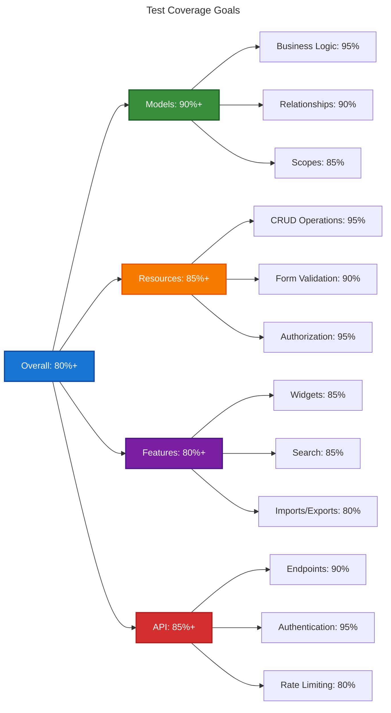

# Testing Strategy Guide

This guide outlines the comprehensive testing strategy for the Chinook admin panel, covering testing methodologies, coverage goals, and quality assurance practices for Filament 4 applications.

## Table of Contents

- [Overview](#overview)
- [Testing Philosophy](#testing-philosophy)
- [Testing Pyramid](#testing-pyramid)
- [Coverage Goals](#coverage-goals)
- [Testing Types](#testing-types)
- [Quality Gates](#quality-gates)
- [Continuous Testing](#continuous-testing)

## Overview

The Chinook admin panel testing strategy ensures high-quality, reliable software through comprehensive automated testing. Our approach balances thorough coverage with maintainable test suites and fast feedback loops.

### Strategic Objectives

- **Quality Assurance**: Maintain 80%+ test coverage across all application layers
- **Regression Prevention**: Catch breaking changes before they reach production
- **Documentation**: Tests serve as living documentation of system behavior
- **Confidence**: Enable safe refactoring and feature development
- **Performance**: Validate system performance under various load conditions

## Testing Philosophy

### Test-Driven Development (TDD)

We follow TDD principles for critical business logic:

```php
// 1. Write failing test
public function test_artist_can_be_created_with_valid_data(): void
{
    $artistData = [
        'name' => 'Test Artist',
        'country' => 'US',
        'formed_year' => 2020,
    ];

    $artist = Artist::create($artistData);

    $this->assertInstanceOf(Artist::class, $artist);
    $this->assertEquals('Test Artist', $artist->name);
    $this->assertNotNull($artist->public_id);
    $this->assertNotNull($artist->slug);
}

// 2. Write minimal code to pass
// 3. Refactor and improve
```

### Behavior-Driven Development (BDD)

For complex user workflows, we use BDD with descriptive test names:

```php
public function test_admin_can_create_artist_with_albums_and_tracks(): void
{
    // Given an admin user
    $admin = User::factory()->create();
    $admin->assignRole('Admin');

    // When they create an artist with albums
    $this->actingAs($admin)
        ->post('/chinook-admin/artists', [
            'name' => 'New Artist',
            'albums' => [
                ['title' => 'First Album', 'release_year' => 2023],
            ],
        ]);

    // Then the artist and album should be created
    $this->assertDatabaseHas('artists', ['name' => 'New Artist']);
    $this->assertDatabaseHas('albums', ['title' => 'First Album']);
}
```

### FIRST Principles

All tests follow FIRST principles:

- **Fast**: Tests run quickly (< 1 second per test)
- **Independent**: Tests don't depend on other tests
- **Repeatable**: Tests produce consistent results
- **Self-Validating**: Tests have clear pass/fail outcomes
- **Timely**: Tests are written close to the code they test

## Testing Pyramid

### Unit Tests (60% of test suite)

Focus on individual components and business logic:

```php
// Model unit tests
class ArtistTest extends TestCase
{
    public function test_artist_generates_slug_from_public_id(): void
    {
        $artist = new Artist(['name' => 'Test Artist']);
        $artist->public_id = '01HKQR8X9VQZJY2K3M4N5P6Q7R';
        
        $artist->save();
        
        $this->assertEquals('01hkqr8x9vqzjy2k3m4n5p6q7r', $artist->slug);
    }

    public function test_artist_can_have_multiple_genres(): void
    {
        $artist = Artist::factory()->create();
        $genres = Category::factory()->count(3)->create(['type' => 'genre']);
        
        $artist->attachCategories($genres->pluck('id')->toArray());
        
        $this->assertCount(3, $artist->genres);
    }
}

// Component unit tests
class FormComponentTest extends TestCase
{
    public function test_social_links_repeater_validates_urls(): void
    {
        $component = SocialLinksRepeater::make('social_links');
        
        $validData = [
            ['platform' => 'facebook', 'url' => 'https://facebook.com/artist'],
            ['platform' => 'twitter', 'url' => 'https://twitter.com/artist'],
        ];
        
        $this->assertTrue($component->validate($validData));
    }
}
```

### Integration Tests (30% of test suite)

Test component interactions and workflows:

```php
// Resource integration tests
class ArtistResourceIntegrationTest extends TestCase
{
    public function test_artist_creation_workflow(): void
    {
        $admin = User::factory()->create();
        $admin->assignRole('Admin');

        // Test complete creation workflow
        $response = $this->actingAs($admin)
            ->post('/chinook-admin/artists', [
                'name' => 'Integration Test Artist',
                'country' => 'US',
                'biography' => 'Test biography',
                'social_links' => [
                    ['platform' => 'website', 'url' => 'https://example.com'],
                ],
            ]);

        $response->assertRedirect();
        
        $artist = Artist::where('name', 'Integration Test Artist')->first();
        $this->assertNotNull($artist);
        $this->assertNotNull($artist->public_id);
        $this->assertNotNull($artist->slug);
        $this->assertEquals('US', $artist->country);
    }

    public function test_artist_search_functionality(): void
    {
        Artist::factory()->create(['name' => 'Searchable Artist']);
        Artist::factory()->create(['name' => 'Another Artist']);

        $admin = User::factory()->create();
        $admin->assignRole('Admin');

        $response = $this->actingAs($admin)
            ->get('/chinook-admin/artists?search=Searchable');

        $response->assertSee('Searchable Artist');
        $response->assertDontSee('Another Artist');
    }
}
```

### End-to-End Tests (10% of test suite)

Test complete user journeys:

```php
// Browser tests with Laravel Dusk
class ArtistManagementE2ETest extends DuskTestCase
{
    public function test_complete_artist_management_workflow(): void
    {
        $admin = User::factory()->create();
        $admin->assignRole('Admin');

        $this->browse(function (Browser $browser) use ($admin) {
            $browser->loginAs($admin)
                    ->visit('/chinook-admin')
                    ->clickLink('Artists')
                    ->assertSee('Artists')
                    ->clickLink('Create')
                    ->type('name', 'E2E Test Artist')
                    ->select('country', 'US')
                    ->type('biography', 'End-to-end test biography')
                    ->press('Create')
                    ->assertSee('Artist created successfully')
                    ->assertSee('E2E Test Artist');
        });
    }
}
```

## Coverage Goals

### Overall Coverage Targets



### Critical Path Coverage

Ensure 95%+ coverage for:

- **Authentication & Authorization**: Login, logout, role-based access
- **Data Integrity**: CRUD operations, validation, relationships
- **Business Logic**: Category management, hierarchical data
- **Security**: Permission checks, data sanitization
- **Performance**: Query optimization, caching

## Testing Types

### Functional Testing

Test what the system does:

```php
class ArtistFunctionalTest extends TestCase
{
    public function test_artist_can_be_soft_deleted(): void
    {
        $artist = Artist::factory()->create();
        
        $artist->delete();
        
        $this->assertSoftDeleted($artist);
        $this->assertFalse($artist->is_active);
    }

    public function test_artist_can_be_restored(): void
    {
        $artist = Artist::factory()->create();
        $artist->delete();
        
        $artist->restore();
        
        $this->assertNotSoftDeleted($artist);
        $this->assertTrue($artist->is_active);
    }
}
```

### Non-Functional Testing

Test how the system performs:

```php
class PerformanceTest extends TestCase
{
    public function test_artist_index_loads_within_time_limit(): void
    {
        Artist::factory()->count(1000)->create();
        $admin = User::factory()->create();
        $admin->assignRole('Admin');

        $startTime = microtime(true);
        
        $this->actingAs($admin)
            ->get('/chinook-admin/artists')
            ->assertStatus(200);
            
        $executionTime = microtime(true) - $startTime;
        
        $this->assertLessThan(2.0, $executionTime);
    }
}
```

### Security Testing

Test security measures:

```php
class SecurityTest extends TestCase
{
    public function test_guest_cannot_access_admin_panel(): void
    {
        $this->get('/chinook-admin')
            ->assertRedirect('/login');
    }

    public function test_user_cannot_access_unauthorized_resources(): void
    {
        $user = User::factory()->create();
        $user->assignRole('Guest');

        $this->actingAs($user)
            ->get('/chinook-admin/artists')
            ->assertStatus(403);
    }

    public function test_sql_injection_protection(): void
    {
        $admin = User::factory()->create();
        $admin->assignRole('Admin');

        $maliciousInput = "'; DROP TABLE artists; --";

        $this->actingAs($admin)
            ->get("/chinook-admin/artists?search={$maliciousInput}")
            ->assertStatus(200);

        // Verify table still exists
        $this->assertDatabaseHas('artists', []);
    }
}
```

## Quality Gates

### Pre-commit Checks

```bash
#!/bin/bash
# .git/hooks/pre-commit

# Run tests
php artisan test --stop-on-failure

# Check code style
./vendor/bin/pint --test

# Run static analysis
./vendor/bin/phpstan analyse

# Check test coverage
php artisan test --coverage --min=80
```

### Pull Request Requirements

- All tests must pass
- Code coverage must not decrease
- New features must include tests
- Critical paths must have 95%+ coverage

### Deployment Gates

```yaml
# .github/workflows/deploy.yml
- name: Run test suite
  run: php artisan test --coverage --min=80

- name: Run security checks
  run: ./vendor/bin/security-checker security:check

- name: Performance testing
  run: php artisan test --group=performance
```

## Continuous Testing

### Test Automation

```yaml
# .github/workflows/tests.yml
name: Tests

on: [push, pull_request]

jobs:
  test:
    runs-on: ubuntu-latest
    
    steps:
    - uses: actions/checkout@v3
    
    - name: Setup PHP
      uses: shivammathur/setup-php@v2
      with:
        php-version: 8.4
        extensions: sqlite, pdo_sqlite
        coverage: xdebug
        
    - name: Install dependencies
      run: composer install
      
    - name: Run tests
      run: php artisan test --coverage --min=80
      
    - name: Upload coverage
      uses: codecov/codecov-action@v3
```

### Test Data Management

```php
// Database seeder for testing
class TestDataSeeder extends Seeder
{
    public function run(): void
    {
        // Create test users with roles
        $admin = User::factory()->create(['email' => 'admin@test.com']);
        $admin->assignRole('Admin');

        $editor = User::factory()->create(['email' => 'editor@test.com']);
        $editor->assignRole('Editor');

        // Create test data
        Artist::factory()->count(10)->create();
        Album::factory()->count(20)->create();
        Track::factory()->count(100)->create();
        Category::factory()->count(15)->create();
    }
}
```

### Test Environment Management

```php
// config/database.php - Testing configuration
'testing' => [
    'driver' => 'sqlite',
    'database' => ':memory:',
    'prefix' => '',
    'foreign_key_constraints' => true,
],

// TestCase.php
abstract class TestCase extends BaseTestCase
{
    use CreatesApplication, RefreshDatabase;

    protected function setUp(): void
    {
        parent::setUp();
        
        // Seed roles and permissions
        $this->artisan('db:seed', ['--class' => 'RoleSeeder']);
        
        // Disable events that might interfere with testing
        Event::fake([
            ArtistCreated::class,
            AlbumUpdated::class,
        ]);
    }
}
```

## Next Steps

1. **Implement Core Tests** - Start with model and resource tests
2. **Setup CI/CD Pipeline** - Automate test execution and coverage reporting
3. **Create Test Data** - Build comprehensive test factories and seeders
4. **Add Performance Tests** - Validate system performance under load
5. **Monitor Coverage** - Track and improve test coverage over time
6. **Document Test Cases** - Maintain clear test documentation

## Related Documentation

- **[Test Environment Setup](020-test-environment-setup.md)** - Configuration and setup
- **[Resource Testing](050-resource-testing.md)** - Testing Filament resources
- **[Performance Testing](130-performance-testing.md)** - Load and performance validation
- **[Browser Testing](140-browser-testing.md)** - End-to-end testing with Dusk
