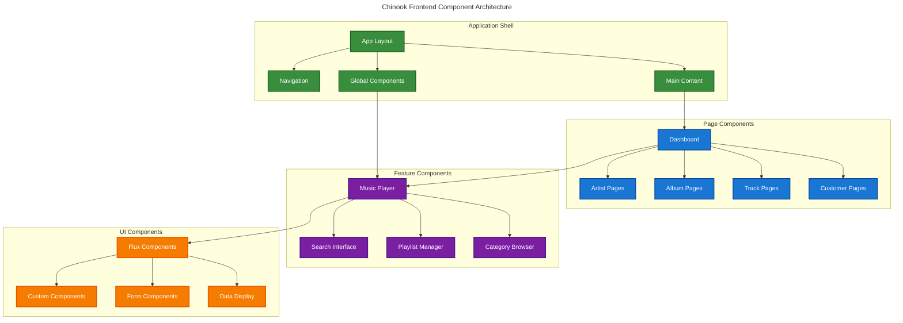

# Chinook Frontend Implementation Guide

## Table of Contents

- [Overview](#overview)
- [Guide Structure](#guide-structure)
- [Implementation Workflow](#implementation-workflow)
- [Key Technologies](#key-technologies)
- [Architecture Principles](#architecture-principles)
- [Component Hierarchy](#component-hierarchy)
- [Best Practices Summary](#best-practices-summary)
- [Getting Started](#getting-started)
- [Support and Resources](#support-and-resources)
- [Navigation](#navigation)

## Overview

This comprehensive guide series provides detailed documentation for implementing modern frontend pages using Laravel/Livewire patterns in the Chinook music application. The guides cover everything from architecture design to testing strategies, ensuring a robust, accessible, and performant user interface.

## Guide Structure

### 🏗️ [Frontend Architecture Overview](100-frontend-architecture-overview.md)
**Foundation guide covering the overall frontend architecture**

- Technology stack and component hierarchy
- SPA navigation patterns with Livewire Navigate
- Integration architecture between Livewire/Volt and Flux components
- Data flow patterns and performance considerations
- Accessibility foundation and development workflow

### ⚡ [Volt Functional Component Patterns](110-volt-functional-patterns-guide.md)
**Comprehensive patterns for Livewire/Volt functional components**

- Component structure and state management
- Action patterns and lifecycle hooks
- Form handling and event communication
- Computed properties and URL synchronization
- Component composition and performance optimization

### 🎨 [Flux/Flux-Pro Component Integration](120-flux-component-integration-guide.md)
**Integration patterns for Flux and Flux-Pro UI components**

- Essential UI components (buttons, inputs, modals)
- Advanced components (data tables, charts, calendars)
- Form components and data display patterns
- Navigation and layout components
- Interactive components and accessibility integration

### 🚀 [SPA Navigation Implementation](130-spa-navigation-guide.md)
**Single Page Application navigation with Livewire Navigate**

- Livewire Navigate setup and configuration
- Route configuration and navigation patterns
- State management and page transitions
- URL synchronization and history management
- Error handling and performance optimization

### ♿ [Accessibility and WCAG Compliance](140-accessibility-wcag-guide.md)
**WCAG 2.1 AA compliance strategies and accessible UI patterns**

- Semantic HTML structure and keyboard navigation
- Screen reader support and ARIA implementation
- Color contrast and focus management
- Form accessibility and interactive components
- Testing strategies and accessibility tools

### ⚡ [Performance Optimization](150-performance-optimization-guide.md)
**Performance optimization strategies for Livewire components**

- Efficient component design and state optimization
- Lazy loading strategies and caching mechanisms
- Database optimization and asset optimization
- Memory management and network optimization
- Monitoring, profiling, and performance testing

### 🧪 [Testing Approaches](160-testing-approaches-guide.md)
**Comprehensive testing strategies for frontend components**

- Unit testing Volt components and feature testing
- Browser testing and accessibility testing
- Performance testing and visual regression testing
- API testing and test data management
- Continuous integration and best practices

### 📊 [Performance Monitoring](170-performance-monitoring-guide.md)
**Comprehensive performance monitoring and alerting systems**

- Monitoring stack setup with Prometheus and Grafana
- Application and database performance tracking
- Frontend performance monitoring with Web Vitals
- Music streaming metrics and quality monitoring
- Alerting systems and dashboard configuration

### 🔗 [API Testing](180-api-testing-guide.md)
**Comprehensive API testing patterns and methodologies**

- Music platform endpoint testing strategies
- Authentication and authorization testing
- Streaming API and search functionality testing
- Performance and security testing approaches
- Test automation and CI/CD integration

### 🚀 [CI/CD Integration](190-cicd-integration-guide.md)
**Detailed CI/CD workflows and deployment strategies**

- GitHub Actions workflow configuration
- Automated testing and quality checks
- Environment management and deployment
- Security and secrets management
- Rollback strategies and monitoring

## Implementation Workflow

### Phase 1: Foundation Setup
1. Review [Frontend Architecture Overview](100-frontend-architecture-overview.md)
2. Set up development environment with Laravel 12, Livewire 3.5+, and Flux
3. Configure SPA navigation following [SPA Navigation Guide](130-spa-navigation-guide.md)
4. Implement accessibility foundation from [WCAG Compliance Guide](140-accessibility-wcag-guide.md)

### Phase 2: Component Development
1. Study [Volt Functional Patterns](110-volt-functional-patterns-guide.md)
2. Implement core components using [Flux Integration Guide](120-flux-component-integration-guide.md)
3. Apply performance optimizations from [Performance Guide](150-performance-optimization-guide.md)
4. Set up testing framework following [Testing Guide](160-testing-approaches-guide.md)

### Phase 3: Feature Implementation
1. Build page components using established patterns
2. Implement navigation and routing
3. Add interactive features and real-time updates
4. Optimize performance and accessibility

### Phase 4: Testing and Deployment
1. Write comprehensive tests for all components
2. Perform accessibility audits
3. Conduct performance testing
4. Deploy with monitoring and analytics

## Key Technologies

### Core Stack
- **Laravel 12**: Modern PHP framework with latest features
- **Livewire 3.5+**: Full-stack framework for dynamic interfaces
- **Volt**: Functional API for Livewire components
- **Flux/Flux-Pro**: Comprehensive UI component library
- **Tailwind CSS 4.0+**: Utility-first CSS framework
- **Alpine.js**: Lightweight JavaScript framework

### Development Tools
- **Pest/PHPUnit**: Testing framework
- **Laravel Dusk**: Browser testing
- **Playwright**: End-to-end testing
- **Vite**: Asset bundling and development server

## Architecture Principles

### 🎯 Design Principles
- **Functional-First**: Utilize Volt functional API for clean component logic
- **Component Composition**: Build complex UIs through reusable components
- **SPA Experience**: Seamless navigation without full page reloads
- **Accessibility First**: WCAG 2.1 AA compliance built into every component
- **Performance Optimized**: Lazy loading, caching, and efficient data handling

### 🏗️ Technical Patterns
- **Hybrid Hierarchical Data**: Efficient category and navigation management
- **Polymorphic Relationships**: Flexible data associations
- **RBAC Integration**: Role-based access control throughout the UI
- **Real-time Updates**: Live data synchronization with Livewire
- **Progressive Enhancement**: Works without JavaScript, enhanced with it

## Component Hierarchy

## Best Practices Summary

### Development Guidelines
1. **Component Design**: Single responsibility, consistent naming, type safety
2. **Performance**: Minimize state, use computed properties, implement caching
3. **Accessibility**: Semantic HTML, ARIA labels, keyboard navigation
4. **Testing**: Comprehensive test coverage, automated accessibility testing
5. **Code Quality**: Laravel conventions, inline documentation, error handling

### Security Considerations
1. **Input Validation**: Always validate user input with Laravel validation
2. **Authorization**: Check permissions before executing actions
3. **CSRF Protection**: Leverage Laravel's built-in CSRF protection
4. **XSS Prevention**: Use Blade's automatic escaping and sanitization

### Performance Guidelines
1. **Lazy Loading**: Load components and data on demand
2. **Caching**: Implement multi-level caching strategies
3. **Database**: Optimize queries with eager loading and indexing
4. **Assets**: Optimize images, minimize bundles, use CDNs

## Getting Started

1. **Read the Architecture Overview**: Start with [Frontend Architecture Overview](100-frontend-architecture-overview.md)
2. **Choose Your Path**: 
   - New to Livewire? Begin with [Volt Functional Patterns](110-volt-functional-patterns-guide.md)
   - Need UI components? Jump to [Flux Integration Guide](120-flux-component-integration-guide.md)
   - Building navigation? See [SPA Navigation Guide](130-spa-navigation-guide.md)
3. **Follow the Implementation Workflow**: Use the phased approach outlined above
4. **Reference as Needed**: Each guide is self-contained but cross-referenced

## Support and Resources

### Documentation Links
- [Laravel 12 Documentation](https://laravel.com/docs)
- [Livewire 3 Documentation](https://livewire.laravel.com)
- [Flux UI Documentation](https://fluxui.dev)
- [Tailwind CSS Documentation](https://tailwindcss.com)

### Community Resources
- Laravel Community Forums
- Livewire Discord Server
- GitHub Discussions
- Stack Overflow

## Navigation

**Previous**: [Chinook Index](../000-chinook-index.md) | **Next**: [Frontend Architecture Overview](100-frontend-architecture-overview.md)

**Related Guides**:
- [Filament Admin Panel](../filament/000-filament-index.md) - Admin interface implementation
- [Package Integration](../packages/000-packages-index.md) - Laravel package guides
- [Testing Strategies](../testing/000-testing-index.md) - Comprehensive testing approaches

---

*This guide series provides everything needed to implement a modern, accessible, and performant frontend for the Chinook music application. Each guide builds upon the previous ones while remaining useful as standalone references.*
