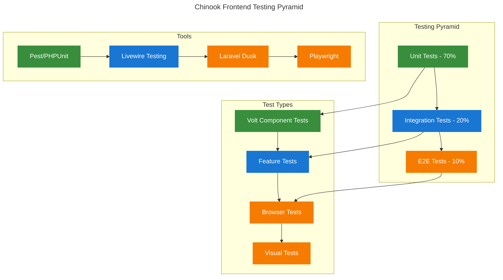

# Testing Approaches Guide

## Table of Contents

- [Overview](#overview)
- [Testing Strategy](#testing-strategy)
- [Unit Testing Volt Components](#unit-testing-volt-components)
- [Feature Testing](#feature-testing)
- [Browser Testing](#browser-testing)
- [Accessibility Testing](#accessibility-testing)
- [Performance Testing](#performance-testing)
- [Visual Regression Testing](#visual-regression-testing)
- [Test Data Management](#test-data-management)
- [Best Practices](#best-practices)
- [Navigation](#navigation)

## Overview

This guide provides comprehensive testing strategies for the Chinook application's frontend components built with Livewire/Volt. Testing ensures reliability, performance, and accessibility while maintaining code quality and preventing regressions.

## Testing Strategy

### Testing Pyramid



### Test Categories

1. **Unit Tests**: Individual component logic and computed properties
2. **Feature Tests**: Component interactions and data flow
3. **Browser Tests**: Full user workflows and JavaScript interactions
4. **Accessibility Tests**: WCAG compliance and screen reader compatibility
5. **Performance Tests**: Load times and resource usage
6. **Visual Tests**: UI consistency and responsive design

## Unit Testing Volt Components

### Basic Component Testing

```php
// tests/Feature/Livewire/ArtistCardTest.php
<?php

use Livewire\Volt\Volt;
use App\Models\Artist;
use App\Models\Album;

it('displays artist information correctly', function () {
    $artist = Artist::factory()->create([
        'name' => 'Test Artist',
        'country' => 'United States'
    ]);
    
    Volt::test('artists.artist-card', ['artist' => $artist])
        ->assertSee('Test Artist')
        ->assertSee('United States')
        ->assertViewHas('artist', $artist);
});

it('shows album count', function () {
    $artist = Artist::factory()
        ->has(Album::factory()->count(3))
        ->create();
    
    Volt::test('artists.artist-card', ['artist' => $artist])
        ->assertSee('3 albums');
});

it('toggles details when button is clicked', function () {
    $artist = Artist::factory()->create(['biography' => 'Test biography']);
    
    Volt::test('artists.artist-card', ['artist' => $artist])
        ->assertDontSee('Test biography')
        ->call('toggleDetails')
        ->assertSee('Test biography')
        ->assertSet('showDetails', true);
});

it('handles play action correctly', function () {
    $artist = Artist::factory()->create();
    
    Volt::test('artists.artist-card', ['artist' => $artist])
        ->call('playArtist')
        ->assertSet('isPlaying', true)
        ->assertDispatched('play-artist', artistId: $artist->id);
});
```

### Testing Computed Properties

```php
// tests/Feature/Livewire/MusicPlayerTest.php
<?php

use Livewire\Volt\Volt;
use App\Models\Track;

it('calculates playback status correctly', function () {
    $track = Track::factory()->create(['name' => 'Test Track']);
    
    $component = Volt::test('music-player')
        ->set('currentTrack', $track)
        ->set('isPlaying', true);
    
    expect($component->get('playbackStatus'))
        ->toContain('Playing Test Track');
});

it('computes progress percentage accurately', function () {
    Volt::test('music-player')
        ->set('position', 150)
        ->set('duration', 300)
        ->assertSet('progressPercentage', 50);
});

it('handles empty state gracefully', function () {
    $component = Volt::test('music-player')
        ->set('currentTrack', null);
    
    expect($component->get('playbackStatus'))
        ->toBe('No track selected');
});
```

### Testing Form Components

```php
// tests/Feature/Livewire/AlbumFormTest.php
<?php

use Livewire\Volt\Volt;
use App\Models\Artist;

it('validates required fields', function () {
    Volt::test('albums.create-form')
        ->set('form.title', '')
        ->set('form.artist_id', null)
        ->call('submit')
        ->assertHasErrors(['form.title', 'form.artist_id']);
});

it('creates album with valid data', function () {
    $artist = Artist::factory()->create();
    
    Volt::test('albums.create-form')
        ->set('form.title', 'Test Album')
        ->set('form.artist_id', $artist->id)
        ->set('form.release_date', '2024-01-01')
        ->call('submit')
        ->assertHasNoErrors()
        ->assertRedirect();
    
    expect(Album::where('title', 'Test Album')->exists())->toBeTrue();
});

it('handles multi-step form navigation', function () {
    Volt::test('albums.create-form')
        ->assertSet('currentStep', 1)
        ->set('form.title', 'Test Album')
        ->set('form.artist_id', Artist::factory()->create()->id)
        ->call('nextStep')
        ->assertSet('currentStep', 2)
        ->call('previousStep')
        ->assertSet('currentStep', 1);
});
```

## Feature Testing

### Component Integration Tests

```php
// tests/Feature/ArtistManagementTest.php
<?php

use App\Models\Artist;
use App\Models\User;

it('allows authenticated users to view artist listing', function () {
    $user = User::factory()->create();
    $artists = Artist::factory()->count(5)->create();
    
    $this->actingAs($user)
        ->get(route('artists.index'))
        ->assertOk()
        ->assertSee($artists->first()->name);
});

it('filters artists by search term', function () {
    $user = User::factory()->create();
    $matchingArtist = Artist::factory()->create(['name' => 'Matching Artist']);
    $otherArtist = Artist::factory()->create(['name' => 'Other Artist']);
    
    $this->actingAs($user)
        ->get(route('artists.index', ['search' => 'Matching']))
        ->assertSee($matchingArtist->name)
        ->assertDontSee($otherArtist->name);
});

it('handles pagination correctly', function () {
    $user = User::factory()->create();
    Artist::factory()->count(25)->create();
    
    $response = $this->actingAs($user)
        ->get(route('artists.index'))
        ->assertOk();
    
    // Should show pagination links
    $response->assertSee('Next');
});
```

### Navigation Testing

```php
// tests/Feature/NavigationTest.php
<?php

use App\Models\Artist;
use App\Models\User;

it('navigates between pages with SPA behavior', function () {
    $user = User::factory()->create();
    $artist = Artist::factory()->create();
    
    // Test navigation to artist page
    $this->actingAs($user)
        ->get(route('artists.index'))
        ->assertOk()
        ->assertSee('Artists');
    
    // Test navigation to specific artist
    $this->get(route('artists.show', $artist->slug))
        ->assertOk()
        ->assertSee($artist->name);
});

it('preserves state during navigation', function () {
    $user = User::factory()->create();
    
    // Set search state
    $this->actingAs($user)
        ->get(route('artists.index', ['search' => 'test']))
        ->assertOk();
    
    // Navigate and return - state should be preserved
    $this->get(route('dashboard'))
        ->assertOk();
    
    $this->get(route('artists.index'))
        ->assertOk();
});
```

## Browser Testing

### End-to-End User Workflows

```php
// tests/Browser/ArtistManagementTest.php
<?php

use Laravel\Dusk\Browser;
use App\Models\User;
use App\Models\Artist;

it('allows users to search and view artists', function () {
    $user = User::factory()->create();
    $artist = Artist::factory()->create(['name' => 'Searchable Artist']);
    
    $this->browse(function (Browser $browser) use ($user, $artist) {
        $browser->loginAs($user)
            ->visit('/artists')
            ->assertSee('Artists')
            ->type('search', 'Searchable')
            ->pause(1000) // Wait for debounced search
            ->assertSee($artist->name)
            ->click('@artist-card-' . $artist->id)
            ->assertPathIs('/artists/' . $artist->slug)
            ->assertSee($artist->name);
    });
});

it('handles music player interactions', function () {
    $user = User::factory()->create();
    $track = Track::factory()->create();
    
    $this->browse(function (Browser $browser) use ($user, $track) {
        $browser->loginAs($user)
            ->visit('/tracks')
            ->click('@play-button-' . $track->id)
            ->waitFor('@music-player')
            ->assertSee($track->name)
            ->click('@pause-button')
            ->assertMissing('@playing-indicator');
    });
});
```

### JavaScript Interaction Testing

```php
// tests/Browser/InteractiveComponentsTest.php
<?php

use Laravel\Dusk\Browser;
use App\Models\User;

it('handles modal interactions correctly', function () {
    $user = User::factory()->create();
    
    $this->browse(function (Browser $browser) use ($user) {
        $browser->loginAs($user)
            ->visit('/artists')
            ->click('@create-artist-button')
            ->waitFor('@artist-modal')
            ->assertVisible('@artist-modal')
            ->type('name', 'New Artist')
            ->click('@save-button')
            ->waitUntilMissing('@artist-modal')
            ->assertSee('New Artist');
    });
});

it('supports keyboard navigation', function () {
    $user = User::factory()->create();
    
    $this->browse(function (Browser $browser) use ($user) {
        $browser->loginAs($user)
            ->visit('/artists')
            ->keys('body', '{tab}') // Tab to first focusable element
            ->keys('body', '{enter}') // Activate element
            ->pause(500)
            ->assertFocused('@first-artist-link');
    });
});
```

## Accessibility Testing

### WCAG Compliance Testing

```php
// tests/Feature/AccessibilityTest.php
<?php

use App\Models\User;

it('has proper heading hierarchy', function () {
    $user = User::factory()->create();
    
    $response = $this->actingAs($user)
        ->get(route('artists.index'));
    
    $content = $response->getContent();
    
    // Check for h1 tag
    expect($content)->toContain('<h1');
    
    // Ensure no h3 without h2
    $h2Count = substr_count($content, '<h2');
    $h3Count = substr_count($content, '<h3');
    
    if ($h3Count > 0) {
        expect($h2Count)->toBeGreaterThan(0);
    }
});

it('has proper ARIA labels', function () {
    $user = User::factory()->create();
    
    $this->actingAs($user)
        ->get(route('artists.index'))
        ->assertSee('aria-label=', false)
        ->assertSee('role=', false);
});

it('provides keyboard navigation support', function () {
    $user = User::factory()->create();
    
    $response = $this->actingAs($user)
        ->get(route('artists.index'));
    
    $content = $response->getContent();
    
    // Check for tabindex attributes
    expect($content)->toContain('tabindex');
    
    // Check for aria-current on navigation
    expect($content)->toContain('aria-current');
});
```

### Screen Reader Testing

```php
// tests/Browser/ScreenReaderTest.php
<?php

use Laravel\Dusk\Browser;
use App\Models\User;

it('announces dynamic content changes', function () {
    $user = User::factory()->create();
    
    $this->browse(function (Browser $browser) use ($user) {
        $browser->loginAs($user)
            ->visit('/artists')
            ->assertAttribute('@search-input', 'aria-describedby', 'search-help')
            ->type('@search-input', 'test')
            ->pause(1000)
            ->assertPresent('[aria-live="polite"]');
    });
});

it('provides proper form labels', function () {
    $user = User::factory()->create();
    
    $this->browse(function (Browser $browser) use ($user) {
        $browser->loginAs($user)
            ->visit('/artists/create')
            ->assertAttribute('@name-input', 'aria-required', 'true')
            ->assertAttribute('@name-input', 'aria-describedby', 'name-help')
            ->assertPresent('label[for="name-input"]');
    });
});
```

## Performance Testing

### Load Time Testing

```php
// tests/Feature/PerformanceTest.php
<?php

use App\Models\User;
use App\Models\Artist;

it('loads artist listing within acceptable time', function () {
    $user = User::factory()->create();
    Artist::factory()->count(100)->create();
    
    $startTime = microtime(true);
    
    $this->actingAs($user)
        ->get(route('artists.index'))
        ->assertOk();
    
    $loadTime = microtime(true) - $startTime;
    
    expect($loadTime)->toBeLessThan(2.0); // 2 seconds max
});

it('handles large datasets efficiently', function () {
    $user = User::factory()->create();
    Artist::factory()->count(1000)->create();
    
    $this->actingAs($user)
        ->get(route('artists.index'))
        ->assertOk();
    
    // Check memory usage
    $memoryUsage = memory_get_peak_usage(true);
    expect($memoryUsage)->toBeLessThan(128 * 1024 * 1024); // 128MB max
});
```

### Database Query Testing

```php
// tests/Feature/QueryPerformanceTest.php
<?php

use Illuminate\Support\Facades\DB;
use App\Models\User;
use App\Models\Artist;

it('uses efficient queries for artist listing', function () {
    $user = User::factory()->create();
    Artist::factory()->count(50)->create();
    
    DB::enableQueryLog();
    
    $this->actingAs($user)
        ->get(route('artists.index'));
    
    $queries = DB::getQueryLog();
    
    // Should not have N+1 queries
    expect(count($queries))->toBeLessThan(5);
    
    // Check for eager loading
    $hasEagerLoading = collect($queries)->contains(function ($query) {
        return str_contains($query['query'], 'albums');
    });
    
    expect($hasEagerLoading)->toBeTrue();
});
```

## Visual Regression Testing

### Screenshot Comparison

```php
// tests/Browser/VisualRegressionTest.php
<?php

use Laravel\Dusk\Browser;
use App\Models\User;
use App\Models\Artist;

it('maintains consistent artist card layout', function () {
    $user = User::factory()->create();
    $artist = Artist::factory()->create();
    
    $this->browse(function (Browser $browser) use ($user, $artist) {
        $browser->loginAs($user)
            ->visit('/artists')
            ->screenshot('artist-listing-baseline');
    });
});

it('handles responsive design correctly', function () {
    $user = User::factory()->create();
    
    $this->browse(function (Browser $browser) use ($user) {
        $browser->loginAs($user)
            ->visit('/artists')
            ->resize(1200, 800)
            ->screenshot('desktop-layout')
            ->resize(768, 1024)
            ->screenshot('tablet-layout')
            ->resize(375, 667)
            ->screenshot('mobile-layout');
    });
});
```

## Test Data Management

### Factory Patterns

```php
// database/factories/ArtistFactory.php
<?php

use App\Models\Artist;
use Illuminate\Database\Eloquent\Factories\Factory;

class ArtistFactory extends Factory
{
    protected $model = Artist::class;
    
    public function definition(): array
    {
        return [
            'public_id' => $this->faker->uuid(),
            'slug' => $this->faker->slug(),
            'name' => $this->faker->name(),
            'country' => $this->faker->country(),
            'biography' => $this->faker->paragraph(),
            'formed_year' => $this->faker->year(),
            'is_active' => true,
        ];
    }
    
    public function inactive(): static
    {
        return $this->state(['is_active' => false]);
    }
    
    public function withAlbums(int $count = 3): static
    {
        return $this->has(Album::factory()->count($count));
    }
    
    public function popular(): static
    {
        return $this->withAlbums(5)
            ->has(Track::factory()->count(20));
    }
}
```

### Test Helpers

```php
// tests/TestCase.php
<?php

use App\Models\User;
use App\Models\Artist;
use App\Models\Album;
use App\Models\Track;

abstract class TestCase extends \Illuminate\Foundation\Testing\TestCase
{
    use CreatesApplication;

    protected function createUserWithRole(string $role): User
    {
        $user = User::factory()->create();
        $user->assignRole($role);
        return $user;
    }
    
    protected function createMusicLibrary(): array
    {
        $artist = Artist::factory()->create();
        $album = Album::factory()->for($artist)->create();
        $tracks = Track::factory()->count(10)->for($album)->create();
        
        return compact('artist', 'album', 'tracks');
    }
    
    protected function assertComponentRendered(string $component, array $data = []): void
    {
        $response = Volt::test($component, $data);
        $this->assertNotNull($response);
    }
}
```

## Best Practices

### Testing Guidelines

1. **Test Structure**
   - Follow AAA pattern (Arrange, Act, Assert)
   - Use descriptive test names
   - Keep tests focused and isolated
   - Use factories for test data

2. **Component Testing**
   - Test public methods and computed properties
   - Verify event dispatching
   - Test state changes
   - Mock external dependencies

3. **Browser Testing**
   - Test critical user workflows
   - Verify JavaScript interactions
   - Test responsive behavior
   - Use page objects for complex interactions

4. **Performance Testing**
   - Set acceptable performance thresholds
   - Monitor database queries
   - Test with realistic data volumes
   - Profile memory usage

5. **Accessibility Testing**
   - Verify WCAG compliance
   - Test keyboard navigation
   - Check screen reader compatibility
   - Validate semantic HTML

## Navigation

**← Previous** [Performance Optimization Guide](150-performance-optimization-guide.md)  
**← Back to** [Frontend Architecture Overview](100-frontend-architecture-overview.md)

---

*This guide provides comprehensive testing strategies for Livewire/Volt components. Use these patterns to ensure reliability, performance, and accessibility in your frontend implementation.*
