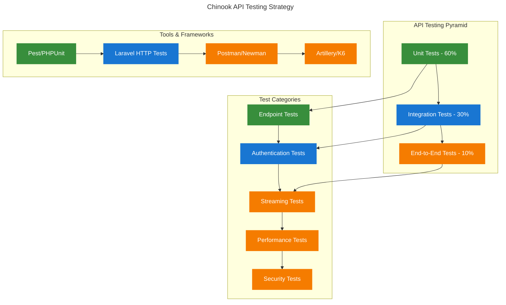

# API Testing Guide

## Table of Contents

- [Overview](#overview)
- [API Testing Strategy](#api-testing-strategy)
- [Music Platform Endpoints](#music-platform-endpoints)
- [Authentication Testing](#authentication-testing)
- [Streaming API Testing](#streaming-api-testing)
- [Performance Testing](#performance-testing)
- [Security Testing](#security-testing)
- [Best Practices](#best-practices)
- [Navigation](#navigation)

## Overview

This guide provides comprehensive API testing strategies specifically designed for the Chinook music platform. It covers testing methodologies for music streaming, search functionality, user management, analytics, and performance optimization with practical examples and automated testing approaches.

## API Testing Strategy

### Testing Pyramid for Music Platform APIs



### Core Testing Principles

1. **Comprehensive Coverage**: Test all CRUD operations for each resource
2. **Authentication & Authorization**: Verify proper access controls
3. **Data Validation**: Test input validation and error handling
4. **Performance**: Ensure APIs meet response time requirements
5. **Security**: Test for common vulnerabilities and data protection

## Music Platform Endpoints

### Artist Management API Testing

```php
<?php
// tests/Feature/Api/ArtistApiTest.php

use App\Models\Artist;
use App\Models\User;
use Laravel\Sanctum\Sanctum;

it('can list artists with pagination', function () {
    Artist::factory()->count(25)->create();
    
    $response = $this->getJson('/api/artists');
    
    $response->assertOk()
        ->assertJsonStructure([
            'data' => [
                '*' => [
                    'id',
                    'public_id',
                    'name',
                    'country',
                    'formed_year',
                    'is_active',
                    'albums_count',
                    'tracks_count',
                    'created_at',
                    'updated_at',
                ]
            ],
            'links',
            'meta' => [
                'current_page',
                'per_page',
                'total',
                'last_page',
            ]
        ])
        ->assertJsonCount(20, 'data'); // Default pagination
});

it('can filter artists by country', function () {
    Artist::factory()->create(['country' => 'United States']);
    Artist::factory()->create(['country' => 'United Kingdom']);
    Artist::factory()->create(['country' => 'Canada']);
    
    $response = $this->getJson('/api/artists?country=United States');
    
    $response->assertOk()
        ->assertJsonCount(1, 'data')
        ->assertJsonPath('data.0.country', 'United States');
});

it('can search artists by name', function () {
    Artist::factory()->create(['name' => 'The Beatles']);
    Artist::factory()->create(['name' => 'Led Zeppelin']);
    Artist::factory()->create(['name' => 'Pink Floyd']);
    
    $response = $this->getJson('/api/artists?search=beatles');
    
    $response->assertOk()
        ->assertJsonCount(1, 'data')
        ->assertJsonPath('data.0.name', 'The Beatles');
});

it('can create artist with proper authentication', function () {
    $user = User::factory()->create();
    Sanctum::actingAs($user, ['create-artists']);
    
    $artistData = [
        'name' => 'New Artist',
        'country' => 'United States',
        'formed_year' => 2020,
        'biography' => 'A new artist biography',
        'is_active' => true,
    ];
    
    $response = $this->postJson('/api/artists', $artistData);
    
    $response->assertCreated()
        ->assertJsonStructure([
            'data' => [
                'id',
                'public_id',
                'name',
                'country',
                'formed_year',
                'biography',
                'is_active',
                'slug',
                'created_at',
                'updated_at',
            ]
        ]);
        
    $this->assertDatabaseHas('artists', [
        'name' => 'New Artist',
        'country' => 'United States',
        'formed_year' => 2020,
    ]);
});

it('validates required fields when creating artist', function () {
    $user = User::factory()->create();
    Sanctum::actingAs($user, ['create-artists']);
    
    $response = $this->postJson('/api/artists', []);
    
    $response->assertUnprocessable()
        ->assertJsonValidationErrors(['name', 'country']);
});

it('prevents unauthorized artist creation', function () {
    $response = $this->postJson('/api/artists', [
        'name' => 'Unauthorized Artist',
        'country' => 'United States',
    ]);
    
    $response->assertUnauthorized();
});

it('can update artist with proper permissions', function () {
    $user = User::factory()->create();
    Sanctum::actingAs($user, ['edit-artists']);
    
    $artist = Artist::factory()->create(['name' => 'Original Name']);
    
    $response = $this->putJson("/api/artists/{$artist->public_id}", [
        'name' => 'Updated Name',
        'country' => $artist->country,
    ]);
    
    $response->assertOk()
        ->assertJsonPath('data.name', 'Updated Name');
        
    $this->assertDatabaseHas('artists', [
        'id' => $artist->id,
        'name' => 'Updated Name',
    ]);
});

it('can soft delete artist', function () {
    $user = User::factory()->create();
    Sanctum::actingAs($user, ['delete-artists']);
    
    $artist = Artist::factory()->create();
    
    $response = $this->deleteJson("/api/artists/{$artist->public_id}");
    
    $response->assertNoContent();
    
    $this->assertSoftDeleted('artists', ['id' => $artist->id]);
});
```

### Track and Album API Testing

```php
<?php
// tests/Feature/Api/TrackApiTest.php

use App\Models\Track;
use App\Models\Album;
use App\Models\Artist;

it('can list tracks with relationships', function () {
    $artist = Artist::factory()->create();
    $album = Album::factory()->for($artist)->create();
    Track::factory()->for($album)->for($artist)->count(5)->create();
    
    $response = $this->getJson('/api/tracks?include=artist,album');
    
    $response->assertOk()
        ->assertJsonStructure([
            'data' => [
                '*' => [
                    'id',
                    'public_id',
                    'name',
                    'duration_formatted',
                    'file_size_formatted',
                    'unit_price',
                    'artist' => [
                        'id',
                        'name',
                        'public_id',
                    ],
                    'album' => [
                        'id',
                        'title',
                        'public_id',
                    ],
                ]
            ]
        ]);
});

it('can filter tracks by genre category', function () {
    $rockTracks = Track::factory()->count(3)->create();
    $jazzTracks = Track::factory()->count(2)->create();
    
    // Assign categories (assuming Categorizable trait)
    foreach ($rockTracks as $track) {
        $track->attachCategory('Rock', 'GENRE');
    }
    
    foreach ($jazzTracks as $track) {
        $track->attachCategory('Jazz', 'GENRE');
    }
    
    $response = $this->getJson('/api/tracks?genre=Rock');
    
    $response->assertOk()
        ->assertJsonCount(3, 'data');
});

it('can get track streaming URL with authentication', function () {
    $user = User::factory()->create();
    Sanctum::actingAs($user, ['stream-tracks']);
    
    $track = Track::factory()->create();
    
    $response = $this->postJson("/api/tracks/{$track->public_id}/stream", [
        'quality' => 'high',
        'device_type' => 'web',
    ]);
    
    $response->assertOk()
        ->assertJsonStructure([
            'streaming_url',
            'expires_at',
            'quality',
            'duration',
            'file_size',
        ]);
        
    // Verify URL is accessible
    $streamingUrl = $response->json('streaming_url');
    expect($streamingUrl)->toBeString()->toContain('http');
});

it('records play analytics when streaming', function () {
    $user = User::factory()->create();
    Sanctum::actingAs($user);
    
    $track = Track::factory()->create();
    
    $response = $this->postJson("/api/tracks/{$track->public_id}/play", [
        'duration_listened' => 180000, // 3 minutes
        'quality' => 'medium',
        'device_type' => 'mobile',
    ]);
    
    $response->assertOk();
    
    $this->assertDatabaseHas('play_events', [
        'track_id' => $track->id,
        'user_id' => $user->id,
        'duration_listened' => 180000,
        'quality' => 'medium',
        'device_type' => 'mobile',
    ]);
});
```

## Authentication Testing

### Token-Based Authentication Testing

```php
<?php
// tests/Feature/Api/AuthenticationTest.php

use App\Models\User;
use Laravel\Sanctum\Sanctum;

it('can authenticate user with valid credentials', function () {
    $user = User::factory()->create([
        'email' => 'test@example.com',
        'password' => bcrypt('password123'),
    ]);

    $response = $this->postJson('/api/auth/login', [
        'email' => 'test@example.com',
        'password' => 'password123',
        'device_name' => 'Test Device',
    ]);

    $response->assertOk()
        ->assertJsonStructure([
            'access_token',
            'token_type',
            'expires_in',
            'user' => [
                'id',
                'name',
                'email',
                'roles',
                'permissions',
            ]
        ]);

    expect($response->json('token_type'))->toBe('Bearer');
    expect($response->json('access_token'))->toBeString();
});

it('rejects invalid credentials', function () {
    $user = User::factory()->create([
        'email' => 'test@example.com',
        'password' => bcrypt('password123'),
    ]);

    $response = $this->postJson('/api/auth/login', [
        'email' => 'test@example.com',
        'password' => 'wrongpassword',
        'device_name' => 'Test Device',
    ]);

    $response->assertUnauthorized()
        ->assertJson([
            'message' => 'Invalid credentials',
        ]);
});

it('enforces rate limiting on login attempts', function () {
    $user = User::factory()->create([
        'email' => 'test@example.com',
        'password' => bcrypt('password123'),
    ]);

    // Make multiple failed login attempts
    for ($i = 0; $i < 6; $i++) {
        $this->postJson('/api/auth/login', [
            'email' => 'test@example.com',
            'password' => 'wrongpassword',
            'device_name' => 'Test Device',
        ]);
    }

    // Next attempt should be rate limited
    $response = $this->postJson('/api/auth/login', [
        'email' => 'test@example.com',
        'password' => 'password123',
        'device_name' => 'Test Device',
    ]);

    $response->assertStatus(429); // Too Many Requests
});
```

## Streaming API Testing

### Audio Streaming and Quality Testing

```php
<?php
// tests/Feature/Api/StreamingApiTest.php

use App\Models\Track;
use App\Models\User;

it('provides different quality streams based on user preference', function () {
    $user = User::factory()->create(['preferred_audio_quality' => 'high']);
    Sanctum::actingAs($user);

    $track = Track::factory()->create();

    $response = $this->postJson("/api/tracks/{$track->public_id}/stream");

    $response->assertOk()
        ->assertJsonPath('quality', 'high');
});

it('adapts quality based on connection speed', function () {
    $user = User::factory()->create();
    Sanctum::actingAs($user);

    $track = Track::factory()->create();

    // Simulate slow connection
    $response = $this->withHeaders([
        'Save-Data' => 'on',
        'Network-Information-Effective-Type' => '2g',
    ])->postJson("/api/tracks/{$track->public_id}/stream");

    $response->assertOk()
        ->assertJsonPath('quality', 'low');
});

it('provides preload URLs for next tracks', function () {
    $user = User::factory()->create();
    Sanctum::actingAs($user);

    $tracks = Track::factory()->count(5)->create();
    $currentTrack = $tracks->first();

    $response = $this->postJson('/api/player/preload', [
        'current_track' => $currentTrack->public_id,
        'quality' => 'medium',
        'count' => 3,
    ]);

    $response->assertOk()
        ->assertJsonStructure([
            'tracks' => [
                '*' => [
                    'track_id',
                    'url',
                    'quality',
                    'expires_at',
                ]
            ]
        ])
        ->assertJsonCount(3, 'tracks');
});

it('enforces streaming permissions', function () {
    $user = User::factory()->create();
    // Don't assign streaming permissions
    Sanctum::actingAs($user, ['view-tracks']); // Only view permission

    $track = Track::factory()->create();

    $response = $this->postJson("/api/tracks/{$track->public_id}/stream");

    $response->assertForbidden()
        ->assertJson([
            'message' => 'Insufficient permissions to stream tracks',
        ]);
});
```

## Performance Testing

### Load Testing with Artillery

```yaml
# artillery-config.yml
config:
  target: 'http://localhost:8000'
  phases:
    - duration: 60
      arrivalRate: 10
      name: "Warm up"
    - duration: 120
      arrivalRate: 50
      name: "Load test"
    - duration: 60
      arrivalRate: 100
      name: "Stress test"
  defaults:
    headers:
      Content-Type: 'application/json'
      Accept: 'application/json'

scenarios:
  - name: "Artist API Load Test"
    weight: 30
    flow:
      - get:
          url: "/api/artists"
          capture:
            - json: "$.data[0].public_id"
              as: "artist_id"
      - get:
          url: "/api/artists/{{ artist_id }}"
      - get:
          url: "/api/artists/{{ artist_id }}/albums"

  - name: "Search API Load Test"
    weight: 40
    flow:
      - get:
          url: "/api/search"
          qs:
            q: "{{ $randomString() }}"
      - get:
          url: "/api/search/suggestions"
          qs:
            q: "{{ $randomString().substring(0, 3) }}"

  - name: "Streaming API Load Test"
    weight: 30
    flow:
      - post:
          url: "/api/auth/login"
          json:
            email: "test@example.com"
            password: "password123"
            device_name: "Load Test"
          capture:
            - json: "$.access_token"
              as: "token"
      - get:
          url: "/api/tracks"
          headers:
            Authorization: "Bearer {{ token }}"
          capture:
            - json: "$.data[0].public_id"
              as: "track_id"
      - post:
          url: "/api/tracks/{{ track_id }}/stream"
          headers:
            Authorization: "Bearer {{ token }}"
          json:
            quality: "medium"
            device_type: "web"
```

### Performance Test Implementation

```php
<?php
// tests/Performance/ApiPerformanceTest.php

use App\Models\Artist;
use App\Models\Track;
use App\Models\User;

it('artist listing API responds within acceptable time', function () {
    Artist::factory()->count(100)->create();

    $startTime = microtime(true);

    $response = $this->getJson('/api/artists');

    $endTime = microtime(true);
    $responseTime = ($endTime - $startTime) * 1000; // Convert to milliseconds

    $response->assertOk();
    expect($responseTime)->toBeLessThan(500); // Should respond within 500ms
});

it('search API handles concurrent requests efficiently', function () {
    Artist::factory()->count(50)->create();
    Track::factory()->count(200)->create();

    $promises = [];

    // Simulate 10 concurrent search requests
    for ($i = 0; $i < 10; $i++) {
        $promises[] = $this->getJson("/api/search?q=test{$i}");
    }

    // All requests should complete successfully
    foreach ($promises as $response) {
        $response->assertOk();
    }
});

it('streaming API maintains performance under load', function () {
    $user = User::factory()->create();
    Sanctum::actingAs($user, ['stream-tracks']);

    $tracks = Track::factory()->count(10)->create();

    $totalTime = 0;
    $requestCount = 10;

    foreach ($tracks as $track) {
        $startTime = microtime(true);

        $response = $this->postJson("/api/tracks/{$track->public_id}/stream", [
            'quality' => 'medium',
            'device_type' => 'web',
        ]);

        $endTime = microtime(true);
        $totalTime += ($endTime - $startTime) * 1000;

        $response->assertOk();
    }

    $averageTime = $totalTime / $requestCount;
    expect($averageTime)->toBeLessThan(200); // Average should be under 200ms
});
```

## Security Testing

### API Security Validation

```php
<?php
// tests/Security/ApiSecurityTest.php

use App\Models\User;
use App\Models\Artist;

it('prevents SQL injection in search parameters', function () {
    $maliciousQuery = "'; DROP TABLE artists; --";

    $response = $this->getJson("/api/search?q=" . urlencode($maliciousQuery));

    $response->assertOk(); // Should not cause server error

    // Verify artists table still exists
    expect(Artist::count())->toBeGreaterThanOrEqual(0);
});

it('validates input to prevent XSS attacks', function () {
    $user = User::factory()->create();
    Sanctum::actingAs($user, ['create-artists']);

    $xssPayload = '<script>alert("XSS")</script>';

    $response = $this->postJson('/api/artists', [
        'name' => $xssPayload,
        'country' => 'United States',
    ]);

    if ($response->status() === 201) {
        $artist = Artist::where('name', $xssPayload)->first();
        expect($artist->name)->not->toContain('<script>');
    } else {
        $response->assertUnprocessable();
    }
});

it('enforces proper CORS headers', function () {
    $response = $this->options('/api/artists');

    $response->assertHeader('Access-Control-Allow-Origin')
        ->assertHeader('Access-Control-Allow-Methods')
        ->assertHeader('Access-Control-Allow-Headers');
});

it('prevents unauthorized access to sensitive endpoints', function () {
    $response = $this->getJson('/api/admin/users');

    $response->assertUnauthorized();
});

it('validates file uploads for security', function () {
    $user = User::factory()->create();
    Sanctum::actingAs($user, ['upload-media']);

    // Try to upload a PHP file disguised as an image
    $maliciousFile = UploadedFile::fake()->create('malicious.php.jpg', 100);

    $response = $this->postJson('/api/media/upload', [
        'file' => $maliciousFile,
        'type' => 'avatar',
    ]);

    $response->assertUnprocessable()
        ->assertJsonValidationErrors(['file']);
});
```

## Best Practices

### API Testing Best Practices

1. **Test Structure**
   - Use descriptive test names that explain the scenario
   - Group related tests in logical test classes
   - Use factories for consistent test data
   - Clean up test data after each test

2. **Authentication Testing**
   - Test all authentication flows (login, logout, refresh)
   - Verify proper token expiration handling
   - Test rate limiting and security measures
   - Validate permission-based access control

3. **Data Validation**
   - Test both valid and invalid input scenarios
   - Verify proper error messages and status codes
   - Test edge cases and boundary conditions
   - Validate data transformation and formatting

4. **Performance Considerations**
   - Set realistic response time expectations
   - Test with representative data volumes
   - Monitor database query counts (N+1 problems)
   - Validate caching effectiveness

5. **Security Testing**
   - Test for common vulnerabilities (SQL injection, XSS)
   - Validate input sanitization and output encoding
   - Test file upload security
   - Verify proper CORS configuration

### Continuous Integration Setup

```yaml
# .github/workflows/api-tests.yml
name: API Tests

on:
  push:
    branches: [ main, develop ]
  pull_request:
    branches: [ main ]

jobs:
  api-tests:
    runs-on: ubuntu-latest

    services:
      mysql:
        image: mysql:8.0
        env:
          MYSQL_ROOT_PASSWORD: password
          MYSQL_DATABASE: chinook_test
        options: >-
          --health-cmd="mysqladmin ping"
          --health-interval=10s
          --health-timeout=5s
          --health-retries=3

      redis:
        image: redis:alpine
        options: >-
          --health-cmd="redis-cli ping"
          --health-interval=10s
          --health-timeout=5s
          --health-retries=3

    steps:
    - uses: actions/checkout@v3

    - name: Setup PHP
      uses: shivammathur/setup-php@v2
      with:
        php-version: '8.2'
        extensions: mbstring, xml, ctype, iconv, intl, pdo_mysql, dom, filter, gd, iconv, json, mbstring, redis

    - name: Install dependencies
      run: composer install --prefer-dist --no-progress

    - name: Copy environment file
      run: cp .env.testing .env

    - name: Generate application key
      run: php artisan key:generate

    - name: Run migrations
      run: php artisan migrate --force

    - name: Run API tests
      run: php artisan test --testsuite=Feature --filter=Api

    - name: Run performance tests
      run: php artisan test --testsuite=Performance

    - name: Run security tests
      run: php artisan test --testsuite=Security
```

## Navigation

**← Previous** [Performance Monitoring Guide](170-performance-monitoring-guide.md)
**Next →** [CI/CD Integration Guide](190-cicd-integration-guide.md)

---

*This guide provides comprehensive API testing strategies for the Chinook music platform. Continue with the CI/CD integration guide for deployment workflows.*
