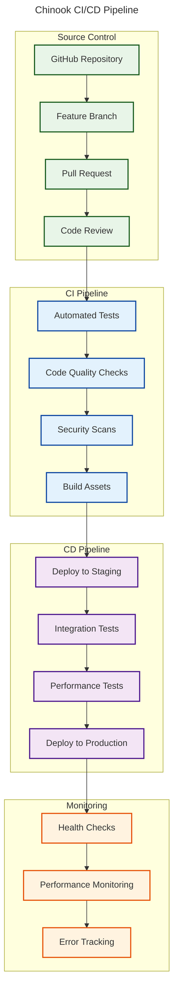

# CI/CD Integration Guide

## Table of Contents

- [Overview](#overview)
- [CI/CD Strategy](#cicd-strategy)
- [GitHub Actions Workflows](#github-actions-workflows)
- [Testing Pipeline](#testing-pipeline)
- [Build and Deployment](#build-and-deployment)
- [Environment Management](#environment-management)
- [Security and Secrets](#security-and-secrets)
- [Best Practices](#best-practices)
- [Rollback Strategies](#rollback-strategies)
- [Navigation](#navigation)

## Overview

This guide provides comprehensive CI/CD integration workflows and deployment strategies specifically designed for the Chinook music platform. It covers automated testing, building, deployment, and monitoring processes that ensure reliable and efficient software delivery.

## CI/CD Strategy

### Deployment Pipeline Overview



### Branching Strategy

- **main**: Production-ready code
- **develop**: Integration branch for features
- **feature/***: Individual feature development
- **hotfix/***: Critical production fixes
- **release/***: Release preparation branches

## GitHub Actions Workflows

### Main CI/CD Workflow

```yaml
# .github/workflows/ci-cd.yml
name: Chinook CI/CD Pipeline

on:
  push:
    branches: [ main, develop ]
  pull_request:
    branches: [ main, develop ]
  release:
    types: [ published ]

env:
  PHP_VERSION: '8.2'
  NODE_VERSION: '20'
  COMPOSER_CACHE_DIR: ~/.composer/cache

jobs:
  # Code Quality and Testing
  test:
    name: Run Tests
    runs-on: ubuntu-latest
    
    services:
      mysql:
        image: mysql:8.0
        env:
          MYSQL_ROOT_PASSWORD: password
          MYSQL_DATABASE: chinook_test
        ports:
          - 3306:3306
        options: >-
          --health-cmd="mysqladmin ping"
          --health-interval=10s
          --health-timeout=5s
          --health-retries=3
      
      redis:
        image: redis:alpine
        ports:
          - 6379:6379
        options: >-
          --health-cmd="redis-cli ping"
          --health-interval=10s
          --health-timeout=5s
          --health-retries=3

    steps:
    - name: Checkout code
      uses: actions/checkout@v4
      
    - name: Setup PHP
      uses: shivammathur/setup-php@v2
      with:
        php-version: ${{ env.PHP_VERSION }}
        extensions: mbstring, xml, ctype, iconv, intl, pdo_mysql, dom, filter, gd, redis
        coverage: xdebug
        
    - name: Setup Node.js
      uses: actions/setup-node@v4
      with:
        node-version: ${{ env.NODE_VERSION }}
        cache: 'npm'
        
    - name: Cache Composer dependencies
      uses: actions/cache@v3
      with:
        path: ${{ env.COMPOSER_CACHE_DIR }}
        key: ${{ runner.os }}-composer-${{ hashFiles('**/composer.lock') }}
        restore-keys: ${{ runner.os }}-composer-
        
    - name: Install PHP dependencies
      run: composer install --prefer-dist --no-progress --no-suggest --optimize-autoloader
      
    - name: Install Node dependencies
      run: npm ci
      
    - name: Copy environment file
      run: cp .env.testing .env
      
    - name: Generate application key
      run: php artisan key:generate
      
    - name: Create storage directories
      run: |
        mkdir -p storage/logs
        mkdir -p storage/framework/cache
        mkdir -p storage/framework/sessions
        mkdir -p storage/framework/views
        
    - name: Set permissions
      run: chmod -R 775 storage bootstrap/cache
      
    - name: Run database migrations
      run: php artisan migrate --force
      
    - name: Seed test data
      run: php artisan db:seed --class=TestSeeder
      
    - name: Build frontend assets
      run: npm run build
      
    - name: Run PHP tests with coverage
      run: php artisan test --coverage --min=80
      
    - name: Run frontend tests
      run: npm run test
      
    - name: Upload coverage reports
      uses: codecov/codecov-action@v3
      with:
        file: ./coverage.xml
        flags: backend
        
    - name: Upload frontend coverage
      uses: codecov/codecov-action@v3
      with:
        file: ./coverage/lcov.info
        flags: frontend

  # Code Quality Checks
  quality:
    name: Code Quality
    runs-on: ubuntu-latest
    
    steps:
    - name: Checkout code
      uses: actions/checkout@v4
      
    - name: Setup PHP
      uses: shivammathur/setup-php@v2
      with:
        php-version: ${{ env.PHP_VERSION }}
        tools: phpstan, psalm, php-cs-fixer
        
    - name: Install dependencies
      run: composer install --prefer-dist --no-progress
      
    - name: Run PHP CS Fixer
      run: vendor/bin/php-cs-fixer fix --dry-run --diff --verbose
      
    - name: Run PHPStan
      run: vendor/bin/phpstan analyse
      
    - name: Run Psalm
      run: vendor/bin/psalm --output-format=github
      
    - name: Setup Node.js
      uses: actions/setup-node@v4
      with:
        node-version: ${{ env.NODE_VERSION }}
        cache: 'npm'
        
    - name: Install Node dependencies
      run: npm ci
      
    - name: Run ESLint
      run: npm run lint
      
    - name: Run Prettier check
      run: npm run format:check

  # Security Scanning
  security:
    name: Security Scan
    runs-on: ubuntu-latest
    
    steps:
    - name: Checkout code
      uses: actions/checkout@v4
      
    - name: Run Composer security audit
      run: composer audit
      
    - name: Run npm security audit
      run: npm audit --audit-level=moderate
      
    - name: Initialize CodeQL
      uses: github/codeql-action/init@v2
      with:
        languages: php, javascript
        
    - name: Perform CodeQL Analysis
      uses: github/codeql-action/analyze@v2

  # Build and Deploy to Staging
  deploy-staging:
    name: Deploy to Staging
    runs-on: ubuntu-latest
    needs: [test, quality, security]
    if: github.ref == 'refs/heads/develop'
    
    environment:
      name: staging
      url: https://staging.chinook.example.com
    
    steps:
    - name: Checkout code
      uses: actions/checkout@v4
      
    - name: Setup PHP
      uses: shivammathur/setup-php@v2
      with:
        php-version: ${{ env.PHP_VERSION }}
        
    - name: Setup Node.js
      uses: actions/setup-node@v4
      with:
        node-version: ${{ env.NODE_VERSION }}
        cache: 'npm'
        
    - name: Install dependencies
      run: |
        composer install --no-dev --optimize-autoloader
        npm ci
        
    - name: Build production assets
      run: npm run build
      
    - name: Deploy to staging
      uses: deployphp/action@v1
      with:
        private-key: ${{ secrets.DEPLOY_PRIVATE_KEY }}
        dep: deploy staging
        
    - name: Run post-deployment tests
      run: |
        sleep 30 # Wait for deployment to complete
        curl -f https://staging.chinook.example.com/health || exit 1

  # Deploy to Production
  deploy-production:
    name: Deploy to Production
    runs-on: ubuntu-latest
    needs: [test, quality, security]
    if: github.event_name == 'release'
    
    environment:
      name: production
      url: https://chinook.example.com
    
    steps:
    - name: Checkout code
      uses: actions/checkout@v4
      
    - name: Setup PHP
      uses: shivammathur/setup-php@v2
      with:
        php-version: ${{ env.PHP_VERSION }}
        
    - name: Setup Node.js
      uses: actions/setup-node@v4
      with:
        node-version: ${{ env.NODE_VERSION }}
        cache: 'npm'
        
    - name: Install dependencies
      run: |
        composer install --no-dev --optimize-autoloader
        npm ci
        
    - name: Build production assets
      run: npm run build
      
    - name: Deploy to production
      uses: deployphp/action@v1
      with:
        private-key: ${{ secrets.DEPLOY_PRIVATE_KEY }}
        dep: deploy production
        
    - name: Run smoke tests
      run: |
        sleep 60 # Wait for deployment to complete
        curl -f https://chinook.example.com/health || exit 1
        curl -f https://chinook.example.com/api/health || exit 1
        
    - name: Notify deployment success
      uses: 8398a7/action-slack@v3
      with:
        status: success
        text: "🚀 Chinook production deployment successful!"
      env:
        SLACK_WEBHOOK_URL: ${{ secrets.SLACK_WEBHOOK_URL }}
```

## Testing Pipeline

### Automated Testing Strategy

```yaml
# .github/workflows/testing.yml
name: Comprehensive Testing

on:
  pull_request:
    branches: [ main, develop ]
  schedule:
    - cron: '0 2 * * *' # Daily at 2 AM

jobs:
  unit-tests:
    name: Unit Tests
    runs-on: ubuntu-latest

    strategy:
      matrix:
        php-version: ['8.1', '8.2', '8.3']

    steps:
    - name: Checkout code
      uses: actions/checkout@v4

    - name: Setup PHP ${{ matrix.php-version }}
      uses: shivammathur/setup-php@v2
      with:
        php-version: ${{ matrix.php-version }}
        extensions: mbstring, xml, ctype, iconv, intl, pdo_mysql

    - name: Install dependencies
      run: composer install --prefer-dist --no-progress

    - name: Run unit tests
      run: php artisan test --testsuite=Unit --parallel

  integration-tests:
    name: Integration Tests
    runs-on: ubuntu-latest

    services:
      mysql:
        image: mysql:8.0
        env:
          MYSQL_ROOT_PASSWORD: password
          MYSQL_DATABASE: chinook_test
        ports:
          - 3306:3306
        options: >-
          --health-cmd="mysqladmin ping"
          --health-interval=10s
          --health-timeout=5s
          --health-retries=3

    steps:
    - name: Checkout code
      uses: actions/checkout@v4

    - name: Setup PHP
      uses: shivammathur/setup-php@v2
      with:
        php-version: '8.2'
        extensions: mbstring, xml, ctype, iconv, intl, pdo_mysql

    - name: Install dependencies
      run: composer install --prefer-dist --no-progress

    - name: Setup environment
      run: |
        cp .env.testing .env
        php artisan key:generate
        php artisan migrate --force

    - name: Run integration tests
      run: php artisan test --testsuite=Feature --parallel

  browser-tests:
    name: Browser Tests
    runs-on: ubuntu-latest

    steps:
    - name: Checkout code
      uses: actions/checkout@v4

    - name: Setup PHP
      uses: shivammathur/setup-php@v2
      with:
        php-version: '8.2'

    - name: Setup Node.js
      uses: actions/setup-node@v4
      with:
        node-version: '20'
        cache: 'npm'

    - name: Install dependencies
      run: |
        composer install --prefer-dist --no-progress
        npm ci

    - name: Build assets
      run: npm run build

    - name: Start Laravel server
      run: |
        php artisan serve &
        sleep 5

    - name: Run Dusk tests
      run: php artisan dusk

    - name: Upload Dusk screenshots
      uses: actions/upload-artifact@v3
      if: failure()
      with:
        name: dusk-screenshots
        path: tests/Browser/screenshots

  performance-tests:
    name: Performance Tests
    runs-on: ubuntu-latest

    steps:
    - name: Checkout code
      uses: actions/checkout@v4

    - name: Setup Node.js
      uses: actions/setup-node@v4
      with:
        node-version: '20'

    - name: Install Artillery
      run: npm install -g artillery

    - name: Setup test environment
      run: |
        # Deploy to test environment or use staging
        echo "Setting up performance test environment"

    - name: Run load tests
      run: |
        artillery run tests/Performance/load-test.yml
        artillery run tests/Performance/stress-test.yml

    - name: Upload performance reports
      uses: actions/upload-artifact@v3
      with:
        name: performance-reports
        path: reports/
```

## Build and Deployment

### Deployment Configuration

```php
<?php
// deploy.php - Deployer configuration

namespace Deployer;

require 'recipe/laravel.php';
require 'recipe/rsync.php';

// Configuration
set('application', 'chinook');
set('repository', 'git@github.com:your-org/chinook.git');
set('git_tty', true);
set('ssh_multiplexing', true);
set('keep_releases', 5);

// Shared files/dirs between deploys
add('shared_files', [
    '.env',
    'storage/oauth-private.key',
    'storage/oauth-public.key',
]);

add('shared_dirs', [
    'storage',
    'node_modules',
]);

// Writable dirs by web server
add('writable_dirs', [
    'bootstrap/cache',
    'storage',
    'storage/app',
    'storage/app/public',
    'storage/framework',
    'storage/framework/cache',
    'storage/framework/sessions',
    'storage/framework/views',
    'storage/logs',
]);

// Hosts
host('staging')
    ->setHostname('staging.chinook.example.com')
    ->setRemoteUser('deploy')
    ->setDeployPath('/var/www/chinook-staging')
    ->set('branch', 'develop')
    ->set('url', 'https://staging.chinook.example.com');

host('production')
    ->setHostname('chinook.example.com')
    ->setRemoteUser('deploy')
    ->setDeployPath('/var/www/chinook')
    ->set('branch', 'main')
    ->set('url', 'https://chinook.example.com');

// Tasks
task('build:assets', function () {
    runLocally('npm ci');
    runLocally('npm run build');
    upload('public/build/', '{{release_path}}/public/build/');
});

task('artisan:storage:link', function () {
    run('{{bin/php}} {{release_path}}/artisan storage:link');
});

task('artisan:config:cache', function () {
    run('{{bin/php}} {{release_path}}/artisan config:cache');
});

task('artisan:route:cache', function () {
    run('{{bin/php}} {{release_path}}/artisan route:cache');
});

task('artisan:view:cache', function () {
    run('{{bin/php}} {{release_path}}/artisan view:cache');
});

task('artisan:queue:restart', function () {
    run('{{bin/php}} {{release_path}}/artisan queue:restart');
});

task('artisan:migrate', function () {
    run('{{bin/php}} {{release_path}}/artisan migrate --force');
});

task('opcache:reset', function () {
    run('{{bin/php}} {{release_path}}/artisan opcache:reset');
})->desc('Reset OPCache');

// Custom deployment flow
task('deploy', [
    'deploy:prepare',
    'deploy:vendors',
    'build:assets',
    'artisan:storage:link',
    'artisan:config:cache',
    'artisan:route:cache',
    'artisan:view:cache',
    'artisan:migrate',
    'deploy:publish',
    'artisan:queue:restart',
    'opcache:reset',
    'deploy:cleanup',
]);

// Rollback task
task('rollback', [
    'rollback',
    'artisan:queue:restart',
    'opcache:reset',
]);

// Health check after deployment
after('deploy', 'deploy:health-check');

task('deploy:health-check', function () {
    $url = get('url');
    $response = runLocally("curl -s -o /dev/null -w '%{http_code}' $url/health");

    if ($response !== '200') {
        throw new \Exception("Health check failed. HTTP status: $response");
    }

    writeln("<info>✓ Health check passed</info>");
});

// Failed deployment cleanup
fail('deploy', 'deploy:unlock');
```

## Environment Management

### Environment Configuration

```bash
# scripts/setup-environment.sh
#!/bin/bash

set -e

ENVIRONMENT=${1:-staging}
echo "Setting up $ENVIRONMENT environment..."

# Create environment-specific configuration
case $ENVIRONMENT in
  "staging")
    DB_HOST="staging-db.chinook.internal"
    REDIS_HOST="staging-redis.chinook.internal"
    APP_URL="https://staging.chinook.example.com"
    APP_DEBUG=true
    LOG_LEVEL="debug"
    ;;
  "production")
    DB_HOST="prod-db.chinook.internal"
    REDIS_HOST="prod-redis.chinook.internal"
    APP_URL="https://chinook.example.com"
    APP_DEBUG=false
    LOG_LEVEL="error"
    ;;
  *)
    echo "Unknown environment: $ENVIRONMENT"
    exit 1
    ;;
esac

# Generate .env file
cat > .env << EOF
APP_NAME="Chinook Music Platform"
APP_ENV=$ENVIRONMENT
APP_KEY=
APP_DEBUG=$APP_DEBUG
APP_URL=$APP_URL

LOG_CHANNEL=stack
LOG_DEPRECATIONS_CHANNEL=null
LOG_LEVEL=$LOG_LEVEL

DB_CONNECTION=mysql
DB_HOST=$DB_HOST
DB_PORT=3306
DB_DATABASE=chinook
DB_USERNAME=chinook_user
DB_PASSWORD=\${DB_PASSWORD}

BROADCAST_DRIVER=redis
CACHE_DRIVER=redis
FILESYSTEM_DISK=s3
QUEUE_CONNECTION=redis
SESSION_DRIVER=redis
SESSION_LIFETIME=120

REDIS_HOST=$REDIS_HOST
REDIS_PASSWORD=\${REDIS_PASSWORD}
REDIS_PORT=6379

# AWS Configuration
AWS_ACCESS_KEY_ID=\${AWS_ACCESS_KEY_ID}
AWS_SECRET_ACCESS_KEY=\${AWS_SECRET_ACCESS_KEY}
AWS_DEFAULT_REGION=us-east-1
AWS_BUCKET=chinook-$ENVIRONMENT
AWS_USE_PATH_STYLE_ENDPOINT=false

# CDN Configuration
AWS_AUDIO_BUCKET=chinook-audio-$ENVIRONMENT
AWS_IMAGE_BUCKET=chinook-images-$ENVIRONMENT
AWS_AUDIO_CDN_URL=https://audio-cdn.chinook.example.com
AWS_IMAGE_CDN_URL=https://images-cdn.chinook.example.com

# Monitoring
SENTRY_LARAVEL_DSN=\${SENTRY_DSN}
PROMETHEUS_NAMESPACE=chinook_$ENVIRONMENT

# External Services
SPOTIFY_CLIENT_ID=\${SPOTIFY_CLIENT_ID}
SPOTIFY_CLIENT_SECRET=\${SPOTIFY_CLIENT_SECRET}
LASTFM_API_KEY=\${LASTFM_API_KEY}
EOF

echo "Environment configuration created for $ENVIRONMENT"

# Set appropriate permissions
chmod 600 .env

# Generate application key if not exists
if ! grep -q "APP_KEY=base64:" .env; then
    php artisan key:generate
fi

echo "✓ Environment setup complete"
```

### Docker Configuration

```dockerfile
# Dockerfile
FROM php:8.2-fpm-alpine

# Install system dependencies
RUN apk add --no-cache \
    git \
    curl \
    libpng-dev \
    libxml2-dev \
    zip \
    unzip \
    nodejs \
    npm \
    supervisor

# Install PHP extensions
RUN docker-php-ext-install pdo pdo_mysql mbstring exif pcntl bcmath gd

# Install Redis extension
RUN pecl install redis && docker-php-ext-enable redis

# Install Composer
COPY --from=composer:latest /usr/bin/composer /usr/bin/composer

# Set working directory
WORKDIR /var/www

# Copy application files
COPY . .

# Install PHP dependencies
RUN composer install --no-dev --optimize-autoloader

# Install Node dependencies and build assets
RUN npm ci && npm run build && npm prune --production

# Set permissions
RUN chown -R www-data:www-data /var/www \
    && chmod -R 755 /var/www/storage \
    && chmod -R 755 /var/www/bootstrap/cache

# Copy supervisor configuration
COPY docker/supervisord.conf /etc/supervisor/conf.d/supervisord.conf

# Expose port 9000
EXPOSE 9000

# Start supervisor
CMD ["/usr/bin/supervisord", "-c", "/etc/supervisor/conf.d/supervisord.conf"]
```

```yaml
# docker-compose.yml
version: '3.8'

services:
  app:
    build:
      context: .
      dockerfile: Dockerfile
    container_name: chinook_app
    restart: unless-stopped
    working_dir: /var/www
    volumes:
      - ./:/var/www
      - ./docker/php/local.ini:/usr/local/etc/php/conf.d/local.ini
    networks:
      - chinook

  nginx:
    image: nginx:alpine
    container_name: chinook_nginx
    restart: unless-stopped
    ports:
      - "80:80"
      - "443:443"
    volumes:
      - ./:/var/www
      - ./docker/nginx:/etc/nginx/conf.d
      - ./docker/ssl:/etc/ssl/certs
    networks:
      - chinook

  mysql:
    image: mysql:8.0
    container_name: chinook_mysql
    restart: unless-stopped
    environment:
      MYSQL_DATABASE: chinook
      MYSQL_ROOT_PASSWORD: ${DB_PASSWORD}
      MYSQL_PASSWORD: ${DB_PASSWORD}
      MYSQL_USER: chinook_user
    volumes:
      - mysql_data:/var/lib/mysql
    ports:
      - "3306:3306"
    networks:
      - chinook

  redis:
    image: redis:alpine
    container_name: chinook_redis
    restart: unless-stopped
    ports:
      - "6379:6379"
    volumes:
      - redis_data:/data
    networks:
      - chinook

  queue:
    build:
      context: .
      dockerfile: Dockerfile
    container_name: chinook_queue
    restart: unless-stopped
    command: php artisan queue:work --verbose --tries=3 --timeout=90
    volumes:
      - ./:/var/www
    depends_on:
      - mysql
      - redis
    networks:
      - chinook

  scheduler:
    build:
      context: .
      dockerfile: Dockerfile
    container_name: chinook_scheduler
    restart: unless-stopped
    command: php artisan schedule:work
    volumes:
      - ./:/var/www
    depends_on:
      - mysql
      - redis
    networks:
      - chinook

volumes:
  mysql_data:
  redis_data:

networks:
  chinook:
    driver: bridge
```

## Security and Secrets

### Secrets Management

```yaml
# .github/workflows/secrets-management.yml
name: Secrets Management

on:
  workflow_dispatch:
    inputs:
      environment:
        description: 'Target environment'
        required: true
        default: 'staging'
        type: choice
        options:
        - staging
        - production

jobs:
  rotate-secrets:
    name: Rotate Application Secrets
    runs-on: ubuntu-latest
    environment: ${{ github.event.inputs.environment }}

    steps:
    - name: Checkout code
      uses: actions/checkout@v4

    - name: Setup PHP
      uses: shivammathur/setup-php@v2
      with:
        php-version: '8.2'

    - name: Generate new APP_KEY
      run: |
        NEW_KEY=$(php -r "echo 'base64:'.base64_encode(random_bytes(32));")
        echo "NEW_APP_KEY=$NEW_KEY" >> $GITHUB_ENV

    - name: Update secrets in environment
      run: |
        # Update secrets using your preferred method
        # This could be AWS Secrets Manager, HashiCorp Vault, etc.
        echo "Updating secrets for ${{ github.event.inputs.environment }}"

    - name: Deploy with new secrets
      uses: deployphp/action@v1
      with:
        private-key: ${{ secrets.DEPLOY_PRIVATE_KEY }}
        dep: deploy ${{ github.event.inputs.environment }}
```

### Environment Variables Security

```bash
# scripts/validate-secrets.sh
#!/bin/bash

set -e

echo "Validating environment secrets..."

# Required secrets for production
REQUIRED_SECRETS=(
    "APP_KEY"
    "DB_PASSWORD"
    "REDIS_PASSWORD"
    "AWS_ACCESS_KEY_ID"
    "AWS_SECRET_ACCESS_KEY"
    "SENTRY_DSN"
)

# Check if all required secrets are set
for secret in "${REQUIRED_SECRETS[@]}"; do
    if [ -z "${!secret}" ]; then
        echo "❌ Missing required secret: $secret"
        exit 1
    else
        echo "✓ $secret is set"
    fi
done

# Validate secret formats
if [[ ! $APP_KEY =~ ^base64: ]]; then
    echo "❌ APP_KEY must be base64 encoded"
    exit 1
fi

if [[ ${#DB_PASSWORD} -lt 16 ]]; then
    echo "❌ DB_PASSWORD must be at least 16 characters"
    exit 1
fi

echo "✓ All secrets validation passed"
```

## Best Practices

### CI/CD Best Practices Checklist

1. **Pipeline Security**
   - [ ] Use secrets management for sensitive data
   - [ ] Implement least privilege access
   - [ ] Scan for vulnerabilities in dependencies
   - [ ] Use signed commits and verified releases

2. **Testing Strategy**
   - [ ] Maintain high test coverage (>80%)
   - [ ] Run tests in parallel for faster feedback
   - [ ] Include performance and security tests
   - [ ] Test across multiple PHP versions

3. **Deployment Safety**
   - [ ] Use blue-green or rolling deployments
   - [ ] Implement health checks and rollback mechanisms
   - [ ] Monitor deployment metrics
   - [ ] Maintain deployment logs and audit trails

4. **Environment Management**
   - [ ] Use infrastructure as code
   - [ ] Maintain environment parity
   - [ ] Implement proper secret rotation
   - [ ] Monitor resource usage and costs

5. **Monitoring and Alerting**
   - [ ] Set up comprehensive monitoring
   - [ ] Configure meaningful alerts
   - [ ] Implement log aggregation
   - [ ] Track deployment success rates

### Performance Optimization

```yaml
# .github/workflows/performance-optimization.yml
name: Performance Optimization

on:
  schedule:
    - cron: '0 6 * * 1' # Weekly on Monday at 6 AM

jobs:
  optimize-dependencies:
    name: Optimize Dependencies
    runs-on: ubuntu-latest

    steps:
    - name: Checkout code
      uses: actions/checkout@v4

    - name: Setup PHP
      uses: shivammathur/setup-php@v2
      with:
        php-version: '8.2'

    - name: Analyze Composer dependencies
      run: |
        composer install --prefer-dist --no-progress
        composer show --outdated --direct
        composer audit

    - name: Setup Node.js
      uses: actions/setup-node@v4
      with:
        node-version: '20'

    - name: Analyze npm dependencies
      run: |
        npm ci
        npm outdated
        npm audit

    - name: Bundle size analysis
      run: |
        npm run build
        npx webpack-bundle-analyzer public/build/manifest.json --mode static --report bundle-report.html

    - name: Upload bundle analysis
      uses: actions/upload-artifact@v3
      with:
        name: bundle-analysis
        path: bundle-report.html

  database-optimization:
    name: Database Optimization
    runs-on: ubuntu-latest

    steps:
    - name: Checkout code
      uses: actions/checkout@v4

    - name: Setup PHP
      uses: shivammathur/setup-php@v2
      with:
        php-version: '8.2'

    - name: Install dependencies
      run: composer install --prefer-dist --no-progress

    - name: Analyze database queries
      run: |
        php artisan migrate --force
        php artisan db:seed
        php artisan telescope:clear
        php artisan test --filter=Performance
        php artisan telescope:prune --hours=1
```

## Rollback Strategies

### Automated Rollback Implementation

```php
<?php
// app/Console/Commands/RollbackCommand.php

namespace App\Console\Commands;

use Illuminate\Console\Command;
use Illuminate\Support\Facades\Http;
use Illuminate\Support\Facades\Log;

class RollbackCommand extends Command
{
    protected $signature = 'deploy:rollback {environment} {--reason=}';
    protected $description = 'Rollback deployment to previous version';

    public function handle(): int
    {
        $environment = $this->argument('environment');
        $reason = $this->option('reason') ?? 'Manual rollback';

        $this->info("Starting rollback for {$environment} environment...");

        // Validate environment
        if (!in_array($environment, ['staging', 'production'])) {
            $this->error('Invalid environment. Use staging or production.');
            return 1;
        }

        // Check current deployment health
        if ($this->isHealthy($environment)) {
            if (!$this->confirm('Current deployment appears healthy. Continue with rollback?')) {
                return 0;
            }
        }

        // Perform rollback
        try {
            $this->performRollback($environment, $reason);
            $this->info('✓ Rollback completed successfully');
            return 0;
        } catch (\Exception $e) {
            $this->error("Rollback failed: {$e->getMessage()}");
            Log::error('Rollback failed', [
                'environment' => $environment,
                'reason' => $reason,
                'error' => $e->getMessage(),
            ]);
            return 1;
        }
    }

    private function isHealthy(string $environment): bool
    {
        $url = $environment === 'production'
            ? 'https://chinook.example.com/health'
            : 'https://staging.chinook.example.com/health';

        try {
            $response = Http::timeout(10)->get($url);
            return $response->successful();
        } catch (\Exception $e) {
            return false;
        }
    }

    private function performRollback(string $environment, string $reason): void
    {
        // Execute deployer rollback
        $command = "dep rollback {$environment}";
        $output = shell_exec($command);

        if (strpos($output, 'Successfully') === false) {
            throw new \Exception('Deployer rollback failed');
        }

        // Wait for rollback to complete
        sleep(30);

        // Verify rollback success
        if (!$this->isHealthy($environment)) {
            throw new \Exception('Health check failed after rollback');
        }

        // Log rollback
        Log::info('Deployment rolled back', [
            'environment' => $environment,
            'reason' => $reason,
            'timestamp' => now(),
        ]);

        // Notify team
        $this->notifyRollback($environment, $reason);
    }

    private function notifyRollback(string $environment, string $reason): void
    {
        // Send notification to Slack, email, etc.
        $message = "🔄 Rollback completed for {$environment} environment. Reason: {$reason}";

        // Implementation depends on your notification system
        Log::info($message);
    }
}
```

## Navigation

**← Previous** [API Testing Guide](180-api-testing-guide.md)
**Next →** [Media Library Enhancement Guide](200-media-library-enhancement-guide.md)

---

*This guide provides comprehensive CI/CD integration workflows for the Chinook music platform. Continue with the media library enhancement guide for detailed media handling workflows.*
