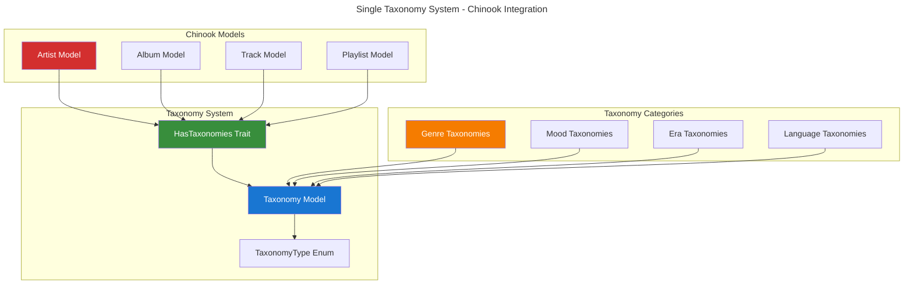

# ⚠️ DEPRECATED: Spatie Tags Implementation Guide

> **🚨 IMPORTANT NOTICE - DEPRECATED PACKAGE**
>
> This guide has been **DEPRECATED** as of 2025-07-10. The Chinook project has adopted a **single taxonomy system** approach using `aliziodev/laravel-taxonomy` package instead of `spatie/laravel-tags`.
>
> **✅ RECOMMENDED ALTERNATIVE:** [Aliziodev Laravel Taxonomy Guide](110-aliziodev-laravel-taxonomy-guide.md)

## 🔄 Migration Notice

### Why This Change?

The Chinook project stakeholders have approved a **greenfield single taxonomy system** implementation that provides:

- **Unified Categorization**: Single taxonomy table for all categorization needs
- **Type-Based Organization**: Genre, mood, style, era, instrument taxonomies
- **Genre Preservation**: Genre compatibility layer for data export/import
- **Performance Optimization**: Streamlined queries without dual system overhead
- **Consistency**: Eliminates confusion between multiple categorization approaches

### 📋 Migration Path

If you were using `spatie/laravel-tags` in your Chinook implementation, please follow these steps:

1. **Review the New System**: Read the [Aliziodev Laravel Taxonomy Guide](110-aliziodev-laravel-taxonomy-guide.md)
2. **Update Package Dependencies**: Replace `spatie/laravel-tags` with `aliziodev/laravel-taxonomy`
3. **Update Model Implementations**: Remove `HasTags` trait and use `HasTaxonomy` instead
4. **Migrate Data**: Use the taxonomy migration tools to transfer existing tag data
5. **Update Queries**: Replace tag-based queries with taxonomy equivalents

### 🔄 Package Replacement Mapping

| **Old (spatie/laravel-tags)** | **New (aliziodev/laravel-taxonomy)** |
|--------------------------------|---------------------------------------|
| `composer require spatie/laravel-tags` | `composer require aliziodev/laravel-taxonomy` |
| `use Spatie\Tags\HasTags;` | `use Aliziodev\LaravelTaxonomy\Traits\HasTaxonomy;` |
| `use HasTags;` | `use HasTaxonomy;` |
| `$model->attachTag('rock')` | `$model->attachTaxonomy($taxonomyId)` |
| `$model->attachTags(['rock', 'pop'])` | `$model->attachTaxonomies([$taxonomyIds])` |
| `$model->tags()` | `$model->taxonomies()` |
| `$model->withAnyTags(['rock'])` | `$model->whereHasTaxonomies(['rock'])` |

### 🏗️ New Taxonomy Architecture



## 🚀 Quick Start with New Taxonomy System

### 1. Install the New Package

```bash
# Install aliziodev/laravel-taxonomy package
composer require aliziodev/laravel-taxonomy

# Install using the preferred method
php artisan taxonomy:install

# Or manually publish and migrate
php artisan vendor:publish --provider="Aliziodev\LaravelTaxonomy\TaxonomyProvider"
php artisan migrate
```

### 2. Update Your Models

Replace the old HasTags trait with HasTaxonomy:

```php
<?php
// OLD: spatie/laravel-tags approach
use Spatie\Tags\HasTags;

class Artist extends Model
{
    use HasTags; // ❌ Remove this
}

// NEW: aliziodev/laravel-taxonomy approach
use Aliziodev\LaravelTaxonomy\Traits\HasTaxonomy;

class Artist extends Model
{
    use HasTaxonomy; // ✅ Use this instead
}
```

### 3. Update Method Calls

Replace old tag methods with taxonomy equivalents:

```php
<?php
// OLD: spatie/laravel-tags methods
$artist->attachTag('rock');
$artist->attachTags(['rock', 'alternative']);
$artist->tags();
$artist->withAnyTags(['rock']);

// NEW: aliziodev/laravel-taxonomy methods
$genreTaxonomy = Taxonomy::where('name', 'rock')->where('type', 'genre')->first();
$artist->attachTaxonomy($genreTaxonomy->id);
$artist->attachTaxonomies([$genreTaxonomy->id, $alternativeTaxonomy->id]);
$artist->taxonomies();
$artist->whereHasTaxonomies(['rock']);
```

## 📚 Complete Migration Example

### Before (spatie/laravel-tags)

```php
<?php
namespace App\Models;

use Illuminate\Database\Eloquent\Model;
use Spatie\Tags\HasTags; // ❌ OLD

class Artist extends Model
{
    use HasTags; // ❌ OLD

    public function addGenreTags(array $genres): self
    {
        $this->attachTags($genres, 'genre'); // ❌ OLD
        return $this;
    }
}
```

### After (aliziodev/laravel-taxonomy)

```php
<?php
namespace App\Models;

use Illuminate\Database\Eloquent\Model;
use Aliziodev\LaravelTaxonomy\Traits\HasTaxonomy; // ✅ NEW

class Artist extends Model
{
    use HasTaxonomy; // ✅ NEW

    public function addGenreTaxonomies(array $genreIds): self
    {
        $this->attachTaxonomies($genreIds); // ✅ NEW
        return $this;
    }
}
```

## 🔗 Additional Resources

### Documentation Links

- **[Aliziodev Laravel Taxonomy Guide](110-aliziodev-laravel-taxonomy-guide.md)** - Complete implementation guide
- **[Chinook Models Guide](../010-chinook-models-guide.md)** - Updated model implementations
- **[Performance Optimization Guide](../performance/100-triple-categorization-optimization.md)** - Single taxonomy performance

### Migration Support

If you need assistance migrating from `spatie/laravel-tags` to `aliziodev/laravel-taxonomy`, please:

1. Review the [taxonomy guide](110-aliziodev-laravel-taxonomy-guide.md) thoroughly
2. Test the migration in a development environment first
3. Use the provided mapping table above for method conversions
4. Ensure all model traits are updated correctly

### Key Benefits of the New System

- **Single Source of Truth**: One taxonomy system for all categorization
- **Better Performance**: Optimized queries without dual system overhead
- **Genre Preservation**: Maintains compatibility with existing Chinook genre data
- **Type Safety**: Laravel 12 modern syntax with proper type casting
- **Scalability**: Designed for enterprise-level music database requirements

---

## 📞 Support and Migration Assistance

### Need Help with Migration?

If you encounter issues during the migration from `spatie/laravel-tags` to `aliziodev/laravel-taxonomy`:

1. **Check the Documentation**: Review the [complete taxonomy guide](110-aliziodev-laravel-taxonomy-guide.md)
2. **Test Thoroughly**: Always test migrations in development environment first
3. **Backup Data**: Ensure you have proper backups before making changes
4. **Follow the Mapping**: Use the conversion table provided above

### Migration Checklist

- [ ] Install `aliziodev/laravel-taxonomy` package
- [ ] Remove `spatie/laravel-tags` from composer.json
- [ ] Update all model imports and traits
- [ ] Convert method calls to taxonomy equivalents
- [ ] Test all categorization functionality
- [ ] Update any custom tag-related code
- [ ] Verify data integrity after migration

---

## 🔗 Navigation

**Previous**: [Laravel Sanctum Guide](080-laravel-sanctum-guide.md) | **Next**: [Aliziodev Laravel Taxonomy Guide](110-aliziodev-laravel-taxonomy-guide.md)

**Related Documentation**:

- **[Aliziodev Laravel Taxonomy Guide](110-aliziodev-laravel-taxonomy-guide.md)** - ✅ **RECOMMENDED** Single taxonomy system
- **[Chinook Models Guide](../010-chinook-models-guide.md)** - Updated model implementations
- **[Packages Index](000-packages-index.md)** - All package guides

---

*This deprecation notice provides migration guidance from spatie/laravel-tags to the approved single taxonomy system using aliziodev/laravel-taxonomy for the Chinook music database with Laravel 12 modern patterns and WCAG 2.1 AA accessibility compliance.*
