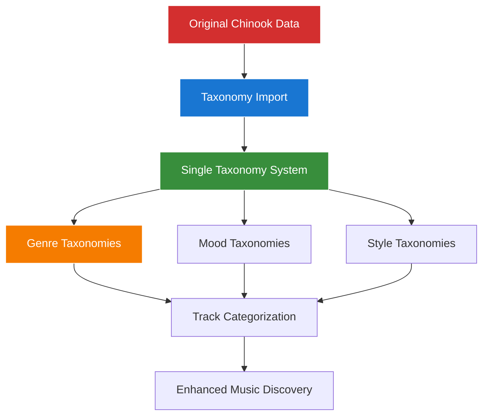
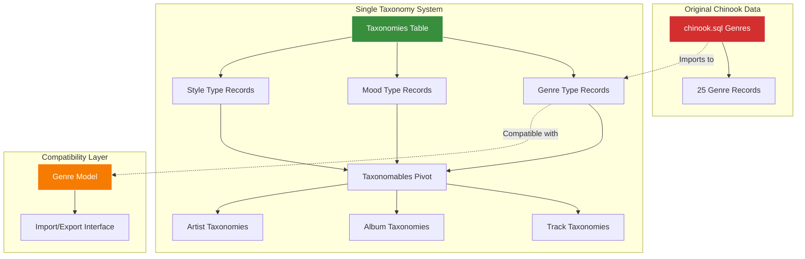

# 1. Aliziodev Laravel Taxonomy Package Guide
## 1.1 Greenfield Chinook Implementation with Single Taxonomy System

**Package:** `aliziodev/laravel-taxonomy`
**Version:** `^2.4`
**Laravel Compatibility:** `^12.0`
**Implementation Type:** ✅ **Greenfield Single Taxonomy System**
**Documentation Standard:** WCAG 2.1 AA Compliant

---

## 1.2 Table of Contents

- [1. Aliziodev Laravel Taxonomy Package Guide](#1-aliziodev-laravel-taxonomy-package-guide)
    - [1.1 Greenfield Chinook Implementation with Single Taxonomy System](#11-greenfield-chinook-implementation-with-single-taxonomy-system)
    - [1.2 Table of Contents](#12-table-of-contents)
    - [1.3 Overview](#13-overview)
        - [1.3.1 Key Features](#131-key-features)
        - [1.3.2 Greenfield Implementation Benefits](#132-greenfield-implementation-benefits)
    - [1.4 Installation & Configuration](#14-installation--configuration)
        - [1.4.1 Package Installation](#141-package-installation)
        - [1.4.2 Configuration Publishing](#142-configuration-publishing)
        - [1.4.3 Migration Execution](#143-migration-execution)
        - [1.4.4 Configuration Customization](#144-configuration-customization)
    - [1.5 Single Taxonomy Architecture](#15-single-taxonomy-architecture)
        - [1.5.1 Clean System Design](#151-clean-system-design)
        - [1.5.2 Direct Taxonomy Mapping Implementation](#152-direct-taxonomy-mapping-implementation)
    - [1.6 Laravel 12 Modern Implementation](#16-laravel-12-modern-implementation)
        - [1.6.1 Model Integration Patterns](#161-model-integration-patterns)
        - [1.6.2 Modern Casting Syntax](#162-modern-casting-syntax)
    - [1.7 Chinook Integration Patterns](#17-chinook-integration-patterns)
        - [1.7.1 Track Model Implementation](#171-track-model-implementation)
        - [1.7.2 Artist Model Implementation](#172-artist-model-implementation)
        - [1.7.3 Album Model Implementation](#173-album-model-implementation)
    - [1.8 Advanced Usage Examples](#18-advanced-usage-examples)
        - [1.8.1 Polymorphic Relationships](#181-polymorphic-relationships)
        - [1.8.2 Hierarchical Taxonomies](#182-hierarchical-taxonomies)
        - [1.8.3 Bulk Operations](#183-bulk-operations)
    - [1.9 Testing Integration](#19-testing-integration)
        - [1.9.1 Pest Framework Examples](#191-pest-framework-examples)
        - [1.9.2 Factory Integration](#192-factory-integration)
    - [1.10 Performance Optimization](#110-performance-optimization)
        - [1.10.1 Query Optimization](#1101-query-optimization)
        - [1.10.2 Caching Strategies](#1102-caching-strategies)
    - [1.11 Troubleshooting](#111-troubleshooting)
        - [1.11.1 Common Issues](#1111-common-issues)
        - [1.11.2 Configuration Issues](#1112-configuration-issues)
    - [1.12 Navigation](#112-navigation)

---

## 1.3 Overview

The `aliziodev/laravel-taxonomy` package provides a robust, standardized taxonomy system for Laravel applications. In this **greenfield Chinook implementation**, the package serves as the **sole categorization system**, providing clean architecture without legacy complexity.

### 1.3.1 Key Features

- **🎯 Single System**: Only taxonomy system used - no dual categorization approaches
- **🔄 Polymorphic Relationships**: Flexible model associations via `taxonomables` pivot table
- **🌳 Hierarchical Support**: Nested set model for complex taxonomy trees
- **⚡ Performance Optimized**: Efficient queries with proper indexing
- **🛡️ Type Safety**: Strong typing with Laravel 12 modern patterns
- **🔧 Configurable**: Customizable table names and relationship configurations

### 1.3.2 Greenfield Implementation Benefits



**Implementation Advantages:**
- **Clean Architecture**: Single source of truth for all categorization
- **Modern Laravel**: Full Laravel 12 compliance with current best practices
- **Source Compatibility**: Maintains compatibility with original chinook.sql format
- **Performance**: Optimized for single-system queries and relationships

---

## 1.4 Installation & Configuration

### 1.4.1 Package Installation

Install the package using Composer:

```bash
# Install aliziodev/laravel-taxonomy package
composer require aliziodev/laravel-taxonomy
```

**Version Requirements:**
- Laravel: `^12.0`
- PHP: `^8.2`
- Database: MySQL 8.0+, PostgreSQL 13+, SQLite 3.35+

### 1.4.2 Configuration Publishing

Publish the package configuration and migrations using the preferred installation command:

```bash
# Preferred installation method (publishes both config and migrations)
php artisan taxonomy:install
```

**Alternative Manual Publishing:**

```bash
# Publish configuration file manually
php artisan vendor:publish --provider="Aliziodev\LaravelTaxonomy\TaxonomyProvider" --tag="taxonomy-config"

# Publish migration files manually
php artisan vendor:publish --provider="Aliziodev\LaravelTaxonomy\TaxonomyProvider" --tag="taxonomy-migrations"
```

**Published Files:**
- `config/taxonomy.php` - Package configuration
- `database/migrations/2025_05_30_000000_create_taxonomies_tables.php` - Database schema

**Source:** [aliziodev/laravel-taxonomy GitHub Repository](https://github.com/aliziodev/laravel-taxonomy) - Official Installation Documentation

### 1.4.3 Migration Execution

Execute the migrations to create taxonomy tables:

```bash
# Run taxonomy migrations
php artisan migrate

# Verify table creation
php artisan db:show --table=taxonomies
php artisan db:show --table=taxonomables
```

**Created Tables:**
- `taxonomies` - Stores taxonomy terms with hierarchical support
- `taxonomables` - Polymorphic pivot table for model relationships

### 1.4.4 Configuration Customization

Configure the package for Chinook integration:

```php
<?php
// config/taxonomy.php

use Aliziodev\LaravelTaxonomy\Enums\TaxonomyType;

return [
    /*
    |--------------------------------------------------------------------------
    | Table Names
    |--------------------------------------------------------------------------
    */
    'table_names' => [
        'taxonomies' => 'taxonomies',
        'taxonomables' => 'taxonomables',
    ],

    /*
    |--------------------------------------------------------------------------
    | Morph Type Configuration
    |--------------------------------------------------------------------------
    */
    'morph_type' => 'uuid', // Supports: 'uuid', 'ulid', 'integer'

    /*
    |--------------------------------------------------------------------------
    | Chinook-Specific Taxonomy Types
    |--------------------------------------------------------------------------
    */
    'taxonomy_types' => [
        'genre' => [
            'label' => 'Music Genres',
            'description' => 'Musical genre classifications',
            'hierarchical' => true,
            'max_depth' => 3,
        ],
        'mood' => [
            'label' => 'Musical Moods',
            'description' => 'Emotional categorization of music',
            'hierarchical' => false,
            'max_depth' => 1,
        ],
        'theme' => [
            'label' => 'Musical Themes',
            'description' => 'Thematic content categorization',
            'hierarchical' => true,
            'max_depth' => 2,
        ],
        'instrument' => [
            'label' => 'Primary Instruments',
            'description' => 'Featured instrument categorization',
            'hierarchical' => false,
            'max_depth' => 1,
        ],
        'era' => [
            'label' => 'Musical Eras',
            'description' => 'Historical period classification',
            'hierarchical' => true,
            'max_depth' => 2,
        ],
        'language' => [
            'label' => 'Languages',
            'description' => 'Vocal language categorization',
            'hierarchical' => false,
            'max_depth' => 1,
        ],
        'occasion' => [
            'label' => 'Occasions',
            'description' => 'Event-based music categorization',
            'hierarchical' => true,
            'max_depth' => 2,
        ],
    ],

    /*
    |--------------------------------------------------------------------------
    | Cache Configuration
    |--------------------------------------------------------------------------
    */
    'cache' => [
        'enabled' => true,
        'ttl' => 3600, // 1 hour
        'prefix' => 'taxonomy',
        'tags' => ['taxonomies'],
    ],

    /*
    |--------------------------------------------------------------------------
    | Validation Rules
    |--------------------------------------------------------------------------
    */
    'validation' => [
        'name' => 'required|string|max:255',
        'slug' => 'required|string|max:255|unique:taxonomies,slug',
        'type' => 'required|string|max:50',
        'description' => 'nullable|string|max:1000',
    ],
];
```

---

## 1.5 Single Taxonomy Architecture

### 1.5.1 Clean System Design

The greenfield Chinook implementation uses a **single taxonomy system** for all categorization needs, providing clean architecture without legacy complexity:



**System Components:**

1. **Single Taxonomy Table**: All categorization through one standardized system
2. **Type-Based Organization**: Genre, mood, style, era, instrument taxonomies
3. **Compatibility Layer**: Genre model for original format compatibility

### 1.5.2 Direct Taxonomy Mapping Implementation

The implementation uses **direct genre-to-taxonomy mapping** without enhancement or dual systems:

```php
<?php
// Direct taxonomy mapping (primary and only approach)
$track = Track::find(1);
$genres = $track->taxonomies()->where('type', 'genre')->get();
$primaryGenre = $track->primaryGenre(); // Returns taxonomy record

// Direct mapping from original chinook.sql data
$originalGenres = [
    1 => 'Rock', 2 => 'Jazz', 3 => 'Metal', 4 => 'Alternative & Punk',
    5 => 'Rock And Roll', 6 => 'Blues', 7 => 'Latin', 8 => 'Reggae',
    9 => 'Pop', 10 => 'Soundtrack', 11 => 'Bossa Nova', 12 => 'Easy Listening',
    13 => 'Heavy Metal', 14 => 'R&B/Soul', 15 => 'Electronica/Dance',
    16 => 'World', 17 => 'Hip Hop/Rap', 18 => 'Science Fiction',
    19 => 'TV Shows', 20 => 'Sci Fi & Fantasy', 21 => 'Drama',
    22 => 'Comedy', 23 => 'Alternative', 24 => 'Classical', 25 => 'Opera'
];

// Direct import creates taxonomy records with exact mapping
foreach ($originalGenres as $id => $name) {
    Taxonomy::create([
        'name' => $name,
        'slug' => Str::slug($name),
        'type' => 'genre',
        'description' => "Direct mapping from chinook.sql genre ID: {$id}",
        'meta' => ['original_id' => $id, 'source' => 'direct_mapping']
    ]);
}
```

**Direct Mapping Strategy:**
1. **Single System Only**: Use only taxonomy package - no dual categorization
2. **Exact Data Mapping**: Map original 25 genres directly to taxonomy records
3. **No Enhancement**: Preserve original genre names and structure exactly
4. **Clean Import**: Direct chinook.sql → taxonomy system without intermediate layers

---

## 1.6 Laravel 12 Modern Implementation

### 1.6.1 Model Integration Patterns

Greenfield model implementation using Laravel 12 modern patterns with single taxonomy system:

```php
<?php
// app/Models/Track.php

namespace App\Models;

use App\Traits\HasSecondaryUniqueKey;
use App\Traits\HasSlug;
use Aliziodev\LaravelTaxonomy\Traits\HasTaxonomy;
use Illuminate\Database\Eloquent\Factories\HasFactory;
use Illuminate\Database\Eloquent\Model;
use Illuminate\Database\Eloquent\Relations\BelongsTo;
use Illuminate\Database\Eloquent\SoftDeletes;
use Wildside\Userstamps\Userstamps;

class Track extends Model
{
    use HasFactory;
    use SoftDeletes;
    use HasSecondaryUniqueKey;
    use HasSlug;
    use HasTaxonomy;      // Single taxonomy system only
    use Userstamps;

    protected $fillable = [
        'public_id',
        'name',
        'album_id',
        'media_type_id',
        'composer',
        'milliseconds',
        'bytes',
        'unit_price',
        'is_active',
        'metadata',
    ];

    /**
     * Laravel 12 modern cast() method
     */
    protected function casts(): array
    {
        return [
            'milliseconds' => 'integer',
            'bytes' => 'integer',
            'unit_price' => 'decimal:2',
            'is_active' => 'boolean',
            'metadata' => 'array',
            'created_at' => 'datetime',
            'updated_at' => 'datetime',
            'deleted_at' => 'datetime',
        ];
    }

    /**
     * Album relationship
     */
    public function album(): BelongsTo
    {
        return $this->belongsTo(Album::class, 'album_id');
    }

    /**
     * Artist relationship (through album)
     */
    public function artist()
    {
        return $this->hasOneThrough(
            Artist::class,
            Album::class,
            'id',
            'id',
            'album_id',
            'artist_id'
        );
    }

    /**
     * Configure supported taxonomy types for this model
     */
    public function getTaxonomyTypes(): array
    {
        return ['genre', 'mood', 'theme', 'instrument', 'era', 'language', 'occasion', 'tempo'];
    }

    /**
     * Get primary genre taxonomy
     */
    public function primaryGenre()
    {
        return $this->taxonomies()
            ->where('type', 'genre')
            ->wherePivot('meta->is_primary', true)
            ->first();
    }

    /**
     * Get all genre taxonomies
     */
    public function genres()
    {
        return $this->taxonomies()->where('type', 'genre');
    }

    /**
     * Attach genre taxonomy with metadata
     */
    public function attachGenre(int $taxonomyId, bool $isPrimary = false, array $metadata = []): void
    {
        $this->attachTaxonomy($taxonomyId, array_merge($metadata, [
            'is_primary' => $isPrimary,
            'source' => 'chinook_import',
        ]));
    }
}
```

### 1.6.2 Modern Casting Syntax

Laravel 12 introduces the modern `casts()` method for enhanced type safety:

```php
<?php
// app/Models/Taxonomy.php (Custom extension)

namespace App\Models;

use Aliziodev\LaravelTaxonomy\Models\Taxonomy as BaseTaxonomy;
use App\Enums\TaxonomyStatus;
use Illuminate\Database\Eloquent\Casts\Attribute;

class Taxonomy extends BaseTaxonomy
{
    /**
     * Laravel 12 modern cast() method
     */
    protected function casts(): array
    {
        return [
            'id' => 'integer',
            'name' => 'string',
            'slug' => 'string',
            'type' => 'string',
            'description' => 'string',
            'parent_id' => 'integer',
            'sort_order' => 'integer',
            'lft' => 'integer',
            'rgt' => 'integer',
            'depth' => 'integer',
            'meta' => 'array',
            'status' => TaxonomyStatus::class,
            'is_active' => 'boolean',
            'created_at' => 'datetime',
            'updated_at' => 'datetime',
            'deleted_at' => 'datetime',
        ];
    }

    /**
     * Computed attribute for display name
     */
    protected function displayName(): Attribute
    {
        return Attribute::make(
            get: fn (mixed $value, array $attributes) =>
                $attributes['name'] . ($attributes['parent_id'] ? ' (Sub-category)' : '')
        );
    }

    /**
     * Computed attribute for full hierarchy path
     */
    protected function hierarchyPath(): Attribute
    {
        return Attribute::make(
            get: function (mixed $value, array $attributes) {
                $path = [$attributes['name']];
                $parent = $this->parent;

                while ($parent) {
                    array_unshift($path, $parent->name);
                    $parent = $parent->parent;
                }

                return implode(' > ', $path);
            }
        );
    }
}
```

---

## 1.7 Chinook Integration Patterns

### 1.7.1 Track Model Enhancement

Complete Track model with dual categorization support:

```php
<?php
// app/Models/Track.php (Enhanced version)

namespace App\Models;

use App\Enums\CategoryType;
use App\Traits\Categorizable;
use App\Traits\HasSecondaryUniqueKey;
use App\Traits\HasSlug;
use Aliziodev\LaravelTaxonomy\Traits\HasTaxonomy;
use Illuminate\Database\Eloquent\Builder;
use Illuminate\Database\Eloquent\Collection;
use Illuminate\Database\Eloquent\Factories\HasFactory;
use Illuminate\Database\Eloquent\Model;
use Illuminate\Database\Eloquent\Relations\BelongsTo;
use Illuminate\Database\Eloquent\Relations\BelongsToMany;
use Illuminate\Database\Eloquent\SoftDeletes;
use Wildside\Userstamps\Userstamps;

class Track extends Model
{
    use HasFactory;
    use SoftDeletes;
    use HasSecondaryUniqueKey;
    use HasSlug;
    use Categorizable;
    use HasTaxonomy;
    use Userstamps;

    protected $fillable = [
        'public_id',
        'name',
        'album_id',
        'media_type_id',
        'genre_id',
        'composer',
        'milliseconds',
        'bytes',
        'unit_price',
        'is_active',
        'metadata',
    ];

    protected function casts(): array
    {
        return [
            'milliseconds' => 'integer',
            'bytes' => 'integer',
            'unit_price' => 'decimal:2',
            'is_active' => 'boolean',
            'metadata' => 'array',
            'created_at' => 'datetime',
            'updated_at' => 'datetime',
            'deleted_at' => 'datetime',
        ];
    }

    /**
     * Original Genre relationship (preserved)
     */
    public function genre(): BelongsTo
    {
        return $this->belongsTo(Genre::class);
    }

    /**
     * Album relationship
     */
    public function album(): BelongsTo
    {
        return $this->belongsTo(Album::class);
    }

    /**
     * Playlist relationships
     */
    public function playlists(): BelongsToMany
    {
        return $this->belongsToMany(Playlist::class, 'playlist_track')
                    ->withPivot(['sort_order', 'added_at'])
                    ->withTimestamps();
    }

    /**
     * Configure supported taxonomy types
     */
    public function getTaxonomyTypes(): array
    {
        return ['genre', 'mood', 'theme', 'instrument', 'era', 'language', 'occasion'];
    }

    /**
     * Get tracks by genre (backward compatibility)
     */
    public function scopeByGenre(Builder $query, int $genreId): Builder
    {
        return $query->where('genre_id', $genreId);
    }

    /**
     * Get tracks by taxonomy type
     */
    public function scopeByTaxonomyType(Builder $query, string $type, array $taxonomyIds = []): Builder
    {
        return $query->whereHas('taxonomies', function (Builder $q) use ($type, $taxonomyIds) {
            $q->where('type', $type);
            if (!empty($taxonomyIds)) {
                $q->whereIn('taxonomies.id', $taxonomyIds);
            }
        });
    }

    /**
     * Get tracks with multiple taxonomy filters
     */
    public function scopeWithTaxonomyFilters(Builder $query, array $filters): Builder
    {
        foreach ($filters as $type => $taxonomyIds) {
            $query->whereHas('taxonomies', function (Builder $q) use ($type, $taxonomyIds) {
                $q->where('type', $type)->whereIn('taxonomies.id', (array) $taxonomyIds);
            });
        }

        return $query;
    }

    /**
     * Get enhanced genre information (combines original + taxonomy)
     */
    public function getEnhancedGenreInfo(): array
    {
        $originalGenre = $this->genre;
        $genreTaxonomies = $this->taxonomiesByType('genre');

        return [
            'original_genre' => $originalGenre ? [
                'id' => $originalGenre->id,
                'name' => $originalGenre->name,
                'source' => 'chinook_original',
            ] : null,
            'taxonomy_genres' => $genreTaxonomies->map(function ($taxonomy) {
                return [
                    'id' => $taxonomy->id,
                    'name' => $taxonomy->name,
                    'slug' => $taxonomy->slug,
                    'hierarchy_path' => $taxonomy->hierarchy_path ?? $taxonomy->name,
                    'source' => 'taxonomy_system',
                ];
            })->toArray(),
            'combined_genres' => $this->getCombinedGenres(),
        ];
    }

    /**
     * Get combined genre list (original + taxonomies)
     */
    private function getCombinedGenres(): array
    {
        $genres = [];

        // Add original genre
        if ($this->genre) {
            $genres[] = $this->genre->name;
        }

        // Add taxonomy genres
        $genreTaxonomies = $this->taxonomiesByType('genre');
        foreach ($genreTaxonomies as $taxonomy) {
            if (!in_array($taxonomy->name, $genres)) {
                $genres[] = $taxonomy->name;
            }
        }

        return $genres;
    }
}
```

### 1.7.2 Artist Model Integration

Artist model with taxonomy support for genre classification:

```php
<?php
// app/Models/Artist.php

namespace App\Models;

use App\Enums\CategoryType;
use App\Traits\Categorizable;
use App\Traits\HasSecondaryUniqueKey;
use App\Traits\HasSlug;
use Aliziodev\LaravelTaxonomy\Traits\HasTaxonomy;
use Illuminate\Database\Eloquent\Factories\HasFactory;
use Illuminate\Database\Eloquent\Model;
use Illuminate\Database\Eloquent\Relations\HasMany;
use Illuminate\Database\Eloquent\SoftDeletes;
use Wildside\Userstamps\Userstamps;

class Artist extends Model
{
    use HasFactory;
    use SoftDeletes;
    use HasSecondaryUniqueKey;
    use HasSlug;
    use Categorizable;
    use HasTaxonomy;
    use Userstamps;

    protected $fillable = [
        'public_id',
        'name',
        'biography',
        'website',
        'country',
        'formed_year',
        'is_active',
        'social_links',
        'metadata',
    ];

    protected function casts(): array
    {
        return [
            'formed_year' => 'integer',
            'is_active' => 'boolean',
            'social_links' => 'array',
            'metadata' => 'array',
            'created_at' => 'datetime',
            'updated_at' => 'datetime',
            'deleted_at' => 'datetime',
        ];
    }

    /**
     * Albums relationship
     */
    public function albums(): HasMany
    {
        return $this->hasMany(Album::class);
    }

    /**
     * Configure supported taxonomy types for artists
     */
    public function getTaxonomyTypes(): array
    {
        return ['genre', 'era', 'country', 'style'];
    }

    /**
     * Get artist's primary genres from their tracks
     */
    public function getPrimaryGenres(): array
    {
        $genreCounts = [];

        // Count genres from all tracks
        foreach ($this->albums as $album) {
            foreach ($album->tracks as $track) {
                if ($track->genre) {
                    $genreName = $track->genre->name;
                    $genreCounts[$genreName] = ($genreCounts[$genreName] ?? 0) + 1;
                }
            }
        }

        // Sort by frequency and return top genres
        arsort($genreCounts);
        return array_slice(array_keys($genreCounts), 0, 3);
    }

    /**
     * Sync artist taxonomies based on their tracks
     */
    public function syncTaxonomiesFromTracks(): void
    {
        $taxonomyIds = [];

        foreach ($this->albums as $album) {
            foreach ($album->tracks as $track) {
                $trackTaxonomies = $track->taxonomies;
                foreach ($trackTaxonomies as $taxonomy) {
                    if (in_array($taxonomy->type, ['genre', 'era', 'style'])) {
                        $taxonomyIds[] = $taxonomy->id;
                    }
                }
            }
        }

        // Sync unique taxonomy IDs
        $this->taxonomies()->sync(array_unique($taxonomyIds));
    }
}
```

### 1.7.3 Album Model Integration

Album model with inherited taxonomy support:

```php
<?php
// app/Models/Album.php

namespace App\Models;

use App\Enums\CategoryType;
use App\Traits\Categorizable;
use App\Traits\HasSecondaryUniqueKey;
use App\Traits\HasSlug;
use Aliziodev\LaravelTaxonomy\Traits\HasTaxonomy;
use Illuminate\Database\Eloquent\Factories\HasFactory;
use Illuminate\Database\Eloquent\Model;
use Illuminate\Database\Eloquent\Relations\BelongsTo;
use Illuminate\Database\Eloquent\Relations\HasMany;
use Illuminate\Database\Eloquent\SoftDeletes;
use Wildside\Userstamps\Userstamps;

class Album extends Model
{
    use HasFactory;
    use SoftDeletes;
    use HasSecondaryUniqueKey;
    use HasSlug;
    use Categorizable;
    use HasTaxonomy;
    use Userstamps;

    protected $fillable = [
        'public_id',
        'title',
        'artist_id',
        'release_date',
        'total_tracks',
        'duration_ms',
        'is_active',
        'metadata',
    ];

    protected function casts(): array
    {
        return [
            'release_date' => 'date',
            'total_tracks' => 'integer',
            'duration_ms' => 'integer',
            'is_active' => 'boolean',
            'metadata' => 'array',
            'created_at' => 'datetime',
            'updated_at' => 'datetime',
            'deleted_at' => 'datetime',
        ];
    }

    /**
     * Artist relationship
     */
    public function artist(): BelongsTo
    {
        return $this->belongsTo(Artist::class);
    }

    /**
     * Tracks relationship
     */
    public function tracks(): HasMany
    {
        return $this->hasMany(Track::class);
    }

    /**
     * Configure supported taxonomy types for albums
     */
    public function getTaxonomyTypes(): array
    {
        return ['genre', 'era', 'theme', 'mood'];
    }

    /**
     * Get album's dominant genre from tracks
     */
    public function getDominantGenre(): ?string
    {
        $genreCounts = [];

        foreach ($this->tracks as $track) {
            if ($track->genre) {
                $genreName = $track->genre->name;
                $genreCounts[$genreName] = ($genreCounts[$genreName] ?? 0) + 1;
            }
        }

        if (empty($genreCounts)) {
            return null;
        }

        arsort($genreCounts);
        return array_key_first($genreCounts);
    }

    /**
     * Sync album taxonomies from its tracks
     */
    public function syncTaxonomiesFromTracks(): void
    {
        $taxonomyData = [];

        foreach ($this->tracks as $track) {
            $trackTaxonomies = $track->taxonomies;
            foreach ($trackTaxonomies as $taxonomy) {
                if (in_array($taxonomy->type, $this->getTaxonomyTypes())) {
                    $key = $taxonomy->id;
                    $taxonomyData[$key] = ($taxonomyData[$key] ?? 0) + 1;
                }
            }
        }

        // Only sync taxonomies that appear in multiple tracks
        $significantTaxonomies = array_filter($taxonomyData, fn($count) => $count >= 2);
        $this->taxonomies()->sync(array_keys($significantTaxonomies));
    }
}
```

---

## 1.8 Advanced Usage Examples

### 1.8.1 Polymorphic Relationships

Working with polymorphic taxonomy relationships:

```php
<?php
// Advanced taxonomy operations

// Attach taxonomy to multiple model types
$track = Track::find(1);
$album = Album::find(1);
$artist = Artist::find(1);

$genreTaxonomy = Taxonomy::where('type', 'genre')
    ->where('slug', 'progressive-rock')
    ->first();

// Attach to different models with metadata
$track->attachTaxonomy($genreTaxonomy->id, [
    'relevance' => 'primary',
    'confidence' => 0.95,
    'source' => 'manual_classification',
]);

$album->attachTaxonomy($genreTaxonomy->id, [
    'relevance' => 'dominant',
    'track_percentage' => 0.80,
    'source' => 'track_aggregation',
]);

$artist->attachTaxonomy($genreTaxonomy->id, [
    'relevance' => 'characteristic',
    'album_count' => 3,
    'source' => 'discography_analysis',
]);

// Query models by shared taxonomies
$progressiveRockContent = collect();

$progressiveRockContent = $progressiveRockContent->merge(
    Track::whereHas('taxonomies', function ($query) use ($genreTaxonomy) {
        $query->where('taxonomies.id', $genreTaxonomy->id);
    })->get()->map(fn($track) => ['type' => 'track', 'model' => $track])
);

$progressiveRockContent = $progressiveRockContent->merge(
    Album::whereHas('taxonomies', function ($query) use ($genreTaxonomy) {
        $query->where('taxonomies.id', $genreTaxonomy->id);
    })->get()->map(fn($album) => ['type' => 'album', 'model' => $album])
);

$progressiveRockContent = $progressiveRockContent->merge(
    Artist::whereHas('taxonomies', function ($query) use ($genreTaxonomy) {
        $query->where('taxonomies.id', $genreTaxonomy->id);
    })->get()->map(fn($artist) => ['type' => 'artist', 'model' => $artist])
);
```

### 1.8.2 Hierarchical Taxonomies

Working with nested taxonomy structures:

```php
<?php
// Create hierarchical genre taxonomy

// Parent genre
$rockGenre = Taxonomy::create([
    'name' => 'Rock',
    'slug' => 'rock',
    'type' => 'genre',
    'description' => 'Rock music genre',
    'sort_order' => 1,
]);

// Sub-genres
$progressiveRock = Taxonomy::create([
    'name' => 'Progressive Rock',
    'slug' => 'progressive-rock',
    'type' => 'genre',
    'description' => 'Progressive rock sub-genre',
    'parent_id' => $rockGenre->id,
    'sort_order' => 1,
]);

$alternativeRock = Taxonomy::create([
    'name' => 'Alternative Rock',
    'slug' => 'alternative-rock',
    'type' => 'genre',
    'description' => 'Alternative rock sub-genre',
    'parent_id' => $rockGenre->id,
    'sort_order' => 2,
]);

// Sub-sub-genres
$mathRock = Taxonomy::create([
    'name' => 'Math Rock',
    'slug' => 'math-rock',
    'type' => 'genre',
    'description' => 'Mathematical/complex progressive rock',
    'parent_id' => $progressiveRock->id,
    'sort_order' => 1,
]);

// Query hierarchical relationships
$rockFamily = Taxonomy::where('type', 'genre')
    ->where(function ($query) use ($rockGenre) {
        $query->where('id', $rockGenre->id)
              ->orWhere('parent_id', $rockGenre->id)
              ->orWhereHas('parent', function ($q) use ($rockGenre) {
                  $q->where('parent_id', $rockGenre->id);
              });
    })
    ->orderBy('lft')
    ->get();

// Get tracks in rock family
$rockTracks = Track::whereHas('taxonomies', function ($query) use ($rockFamily) {
    $query->whereIn('taxonomies.id', $rockFamily->pluck('id'));
})->get();

// Get taxonomy tree structure
function buildTaxonomyTree($taxonomies, $parentId = null): array
{
    $tree = [];

    foreach ($taxonomies as $taxonomy) {
        if ($taxonomy->parent_id == $parentId) {
            $children = buildTaxonomyTree($taxonomies, $taxonomy->id);
            $node = [
                'id' => $taxonomy->id,
                'name' => $taxonomy->name,
                'slug' => $taxonomy->slug,
                'children' => $children,
            ];
            $tree[] = $node;
        }
    }

    return $tree;
}

$genreTree = buildTaxonomyTree(
    Taxonomy::where('type', 'genre')->orderBy('lft')->get()
);
```

### 1.8.3 Bulk Operations

Efficient bulk taxonomy operations:

```php
<?php
// Bulk taxonomy operations for performance

// Bulk attach taxonomies to multiple tracks
$trackIds = [1, 2, 3, 4, 5];
$taxonomyId = 15; // Progressive Rock taxonomy

$attachData = [];
foreach ($trackIds as $trackId) {
    $attachData[] = [
        'taxonomy_id' => $taxonomyId,
        'taxonomable_type' => Track::class,
        'taxonomable_id' => $trackId,
        'created_at' => now(),
        'updated_at' => now(),
    ];
}

DB::table('taxonomables')->insert($attachData);

// Bulk sync taxonomies for album based on track analysis
function bulkSyncAlbumTaxonomies(array $albumIds): void
{
    foreach ($albumIds as $albumId) {
        $album = Album::with(['tracks.taxonomies'])->find($albumId);

        if (!$album) continue;

        $taxonomyCounts = [];
        $totalTracks = $album->tracks->count();

        foreach ($album->tracks as $track) {
            foreach ($track->taxonomies as $taxonomy) {
                $key = $taxonomy->id;
                $taxonomyCounts[$key] = ($taxonomyCounts[$key] ?? 0) + 1;
            }
        }

        // Only sync taxonomies that appear in at least 30% of tracks
        $threshold = max(1, ceil($totalTracks * 0.3));
        $significantTaxonomies = array_filter(
            $taxonomyCounts,
            fn($count) => $count >= $threshold
        );

        $album->taxonomies()->sync(array_keys($significantTaxonomies));
    }
}

// Direct taxonomy creation from chinook.sql data (no migration needed)
function createDirectTaxonomyMapping(): void
{
    // Direct mapping from original chinook.sql genre data
    $originalGenres = [
        1 => 'Rock', 2 => 'Jazz', 3 => 'Metal', 4 => 'Alternative & Punk',
        5 => 'Rock And Roll', 6 => 'Blues', 7 => 'Latin', 8 => 'Reggae',
        9 => 'Pop', 10 => 'Soundtrack', 11 => 'Bossa Nova', 12 => 'Easy Listening',
        13 => 'Heavy Metal', 14 => 'R&B/Soul', 15 => 'Electronica/Dance',
        16 => 'World', 17 => 'Hip Hop/Rap', 18 => 'Science Fiction',
        19 => 'TV Shows', 20 => 'Sci Fi & Fantasy', 21 => 'Drama',
        22 => 'Comedy', 23 => 'Alternative', 24 => 'Classical', 25 => 'Opera'
    ];

    $taxonomyData = [];
    foreach ($originalGenres as $originalId => $name) {
        $taxonomyData[] = [
            'name' => $name,
            'slug' => Str::slug($name),
            'type' => 'genre',
            'description' => "Direct mapping from chinook.sql genre ID: {$originalId}",
            'sort_order' => $originalId,
            'meta' => json_encode([
                'original_id' => $originalId,
                'source' => 'direct_mapping',
                'chinook_sql_origin' => true,
            ]),
            'created_at' => now(),
            'updated_at' => now(),
        ];
    }

    DB::table('taxonomies')->insert($taxonomyData);
}

// Bulk update taxonomy metadata
function updateTaxonomyMetadata(array $updates): void
{
    foreach ($updates as $taxonomyId => $metadata) {
        DB::table('taxonomies')
            ->where('id', $taxonomyId)
            ->update([
                'meta' => json_encode($metadata),
                'updated_at' => now(),
            ]);
    }
}
```

---

## 1.9 Testing Integration

### 1.9.1 Pest Framework Examples

Comprehensive testing with Pest framework:

```php
<?php
// tests/Feature/TaxonomyIntegrationTest.php

use App\Models\Track;
use App\Models\Album;
use App\Models\Artist;
use App\Models\Genre;
use App\Models\Taxonomy;

describe('Taxonomy Integration', function () {
    beforeEach(function () {
        $this->track = Track::factory()->create();
        $this->album = Album::factory()->create();
        $this->artist = Artist::factory()->create();

        $this->genreTaxonomy = Taxonomy::factory()->create([
            'type' => 'genre',
            'name' => 'Progressive Rock',
            'slug' => 'progressive-rock',
        ]);
    });

    it('can attach taxonomy to track', function () {
        $this->track->attachTaxonomy($this->genreTaxonomy->id, [
            'relevance' => 'primary',
            'confidence' => 0.95,
        ]);

        expect($this->track->taxonomies)->toHaveCount(1);
        expect($this->track->taxonomies->first()->name)->toBe('Progressive Rock');
    });

    it('preserves original genre relationship', function () {
        $genre = Genre::factory()->create(['name' => 'Rock']);
        $track = Track::factory()->create(['genre_id' => $genre->id]);

        // Attach taxonomy
        $track->attachTaxonomy($this->genreTaxonomy->id);

        // Original relationship should still work
        expect($track->genre->name)->toBe('Rock');
        expect($track->genre_id)->toBe($genre->id);

        // Taxonomy should also be attached
        expect($track->taxonomies)->toHaveCount(1);
    });

    it('can filter tracks by taxonomy type', function () {
        $track1 = Track::factory()->create();
        $track2 = Track::factory()->create();
        $track3 = Track::factory()->create();

        $track1->attachTaxonomy($this->genreTaxonomy->id);
        $track2->attachTaxononomy($this->genreTaxonomy->id);
        // track3 has no taxonomy

        $progressiveRockTracks = Track::byTaxonomyType('genre', [$this->genreTaxonomy->id])->get();

        expect($progressiveRockTracks)->toHaveCount(2);
        expect($progressiveRockTracks->pluck('id'))->toContain($track1->id, $track2->id);
        expect($progressiveRockTracks->pluck('id'))->not->toContain($track3->id);
    });

    it('can sync album taxonomies from tracks', function () {
        $album = Album::factory()->create();
        $tracks = Track::factory()->count(3)->create(['album_id' => $album->id]);

        // Attach same taxonomy to all tracks
        foreach ($tracks as $track) {
            $track->attachTaxonomy($this->genreTaxonomy->id);
        }

        $album->syncTaxonomiesFromTracks();

        expect($album->taxonomies)->toHaveCount(1);
        expect($album->taxonomies->first()->id)->toBe($this->genreTaxonomy->id);
    });

    it('handles hierarchical taxonomies correctly', function () {
        $parentTaxonomy = Taxonomy::factory()->create([
            'type' => 'genre',
            'name' => 'Rock',
            'slug' => 'rock',
        ]);

        $childTaxonomy = Taxonomy::factory()->create([
            'type' => 'genre',
            'name' => 'Progressive Rock',
            'slug' => 'progressive-rock',
            'parent_id' => $parentTaxonomy->id,
        ]);

        $this->track->attachTaxonomy($childTaxonomy->id);

        expect($childTaxonomy->parent->id)->toBe($parentTaxonomy->id);
        expect($parentTaxonomy->children)->toHaveCount(1);
        expect($parentTaxonomy->children->first()->id)->toBe($childTaxonomy->id);
    });
});

describe('Genre Preservation', function () {
    it('maintains backward compatibility with existing genre queries', function () {
        $genre = Genre::factory()->create(['name' => 'Jazz']);
        $tracks = Track::factory()->count(5)->create(['genre_id' => $genre->id]);

        // Original query methods should still work
        $jazzTracks = Track::where('genre_id', $genre->id)->get();
        $jazzTracksByScope = Track::byGenre($genre->id)->get();

        expect($jazzTracks)->toHaveCount(5);
        expect($jazzTracksByScope)->toHaveCount(5);

        foreach ($tracks as $track) {
            expect($track->genre->name)->toBe('Jazz');
        }
    });

    it('provides enhanced genre information combining original and taxonomy', function () {
        $originalGenre = Genre::factory()->create(['name' => 'Rock']);
        $track = Track::factory()->create(['genre_id' => $originalGenre->id]);

        $taxonomyGenre = Taxonomy::factory()->create([
            'type' => 'genre',
            'name' => 'Progressive Rock',
        ]);

        $track->attachTaxonomy($taxonomyGenre->id);

        $enhancedInfo = $track->getEnhancedGenreInfo();

        expect($enhancedInfo['original_genre']['name'])->toBe('Rock');
        expect($enhancedInfo['taxonomy_genres'])->toHaveCount(1);
        expect($enhancedInfo['taxonomy_genres'][0]['name'])->toBe('Progressive Rock');
        expect($enhancedInfo['combined_genres'])->toContain('Rock', 'Progressive Rock');
    });
});
```

### 1.9.2 Factory Integration

Factory definitions for testing:

```php
<?php
// database/factories/TaxonomyFactory.php

namespace Database\Factories;

use App\Models\Taxonomy;
use Illuminate\Database\Eloquent\Factories\Factory;
use Illuminate\Support\Str;

class TaxonomyFactory extends Factory
{
    protected $model = Taxonomy::class;

    public function definition(): array
    {
        $name = $this->faker->words(2, true);

        return [
            'name' => $name,
            'slug' => Str::slug($name),
            'type' => $this->faker->randomElement(['genre', 'mood', 'theme', 'instrument', 'era']),
            'description' => $this->faker->sentence(),
            'parent_id' => null,
            'sort_order' => $this->faker->numberBetween(1, 100),
            'meta' => [
                'created_by' => 'factory',
                'test_data' => true,
            ],
        ];
    }

    public function genre(): static
    {
        return $this->state(fn (array $attributes) => [
            'type' => 'genre',
            'name' => $this->faker->randomElement([
                'Progressive Rock', 'Jazz Fusion', 'Electronic', 'Classical',
                'Hip Hop', 'Country', 'Blues', 'Reggae', 'Folk', 'Metal'
            ]),
        ]);
    }

    public function mood(): static
    {
        return $this->state(fn (array $attributes) => [
            'type' => 'mood',
            'name' => $this->faker->randomElement([
                'Energetic', 'Relaxing', 'Melancholic', 'Uplifting',
                'Aggressive', 'Peaceful', 'Romantic', 'Mysterious'
            ]),
        ]);
    }

    public function withParent(Taxonomy $parent): static
    {
        return $this->state(fn (array $attributes) => [
            'parent_id' => $parent->id,
            'type' => $parent->type,
        ]);
    }

    public function hierarchical(): static
    {
        return $this->afterCreating(function (Taxonomy $taxonomy) {
            // Create 2-3 child taxonomies
            Taxonomy::factory()
                ->count($this->faker->numberBetween(2, 3))
                ->withParent($taxonomy)
                ->create();
        });
    }
}
```

---

## 1.10 Performance Optimization

### 1.10.1 Query Optimization

Optimized queries for taxonomy operations:

```php
<?php
// Optimized taxonomy queries

// Eager load taxonomies with tracks
$tracks = Track::with(['taxonomies' => function ($query) {
    $query->select('taxonomies.id', 'name', 'slug', 'type')
          ->orderBy('type')
          ->orderBy('name');
}])->get();

// Efficient taxonomy filtering with indexes
$genreTracks = Track::whereHas('taxonomies', function ($query) {
    $query->where('type', 'genre')
          ->whereIn('slug', ['rock', 'jazz', 'classical']);
})->with('taxonomies:id,name,slug,type')->get();

// Optimized hierarchical queries
$rockGenreFamily = Taxonomy::where('type', 'genre')
    ->where(function ($query) {
        $query->where('slug', 'rock')
              ->orWhere('parent_id', function ($subQuery) {
                  $subQuery->select('id')
                           ->from('taxonomies')
                           ->where('slug', 'rock')
                           ->where('type', 'genre');
              });
    })
    ->orderBy('lft')
    ->get();

// Bulk operations with chunking
Track::whereHas('genre')->chunk(1000, function ($tracks) {
    foreach ($tracks as $track) {
        $genreTaxonomy = Taxonomy::where('type', 'genre')
            ->where('name', $track->genre->name)
            ->first();

        if ($genreTaxonomy) {
            $track->attachTaxonomy($genreTaxonomy->id, [
                'source' => 'migration',
                'original_genre_id' => $track->genre_id,
            ]);
        }
    }
});

// Optimized counting queries
$taxonomyStats = DB::table('taxonomables')
    ->join('taxonomies', 'taxonomables.taxonomy_id', '=', 'taxonomies.id')
    ->select('taxonomies.type', 'taxonomies.name', DB::raw('COUNT(*) as usage_count'))
    ->where('taxonomable_type', Track::class)
    ->groupBy('taxonomies.id', 'taxonomies.type', 'taxonomies.name')
    ->orderBy('usage_count', 'desc')
    ->get();
```

### 1.10.2 Caching Strategies

Implement caching for frequently accessed taxonomy data:

```php
<?php
// Caching strategies for taxonomy data

// Cache taxonomy trees
function getCachedTaxonomyTree(string $type): array
{
    return Cache::tags(['taxonomies', "taxonomy-{$type}"])
        ->remember("taxonomy-tree-{$type}", 3600, function () use ($type) {
            $taxonomies = Taxonomy::where('type', $type)
                ->orderBy('lft')
                ->get();

            return buildTaxonomyTree($taxonomies);
        });
}

// Cache popular taxonomies
function getCachedPopularTaxonomies(string $type, int $limit = 10): Collection
{
    return Cache::tags(['taxonomies', 'popular'])
        ->remember("popular-taxonomies-{$type}-{$limit}", 1800, function () use ($type, $limit) {
            return DB::table('taxonomables')
                ->join('taxonomies', 'taxonomables.taxonomy_id', '=', 'taxonomies.id')
                ->select('taxonomies.*', DB::raw('COUNT(*) as usage_count'))
                ->where('taxonomies.type', $type)
                ->groupBy('taxonomies.id')
                ->orderBy('usage_count', 'desc')
                ->limit($limit)
                ->get();
        });
}

// Cache model taxonomy relationships
trait CachesTaxonomies
{
    public function getCachedTaxonomies(): Collection
    {
        $cacheKey = "model-taxonomies-{$this->getMorphClass()}-{$this->id}";

        return Cache::tags(['taxonomies', 'model-relationships'])
            ->remember($cacheKey, 1800, function () {
                return $this->taxonomies;
            });
    }

    public function getCachedTaxonomiesByType(string $type): Collection
    {
        $cacheKey = "model-taxonomies-{$this->getMorphClass()}-{$this->id}-{$type}";

        return Cache::tags(['taxonomies', 'model-relationships'])
            ->remember($cacheKey, 1800, function () use ($type) {
                return $this->taxonomiesByType($type);
            });
    }

    protected static function bootCachesTaxonomies()
    {
        static::saved(function ($model) {
            $model->clearTaxonomyCache();
        });

        static::deleted(function ($model) {
            $model->clearTaxonomyCache();
        });
    }

    public function clearTaxonomyCache(): void
    {
        $pattern = "model-taxonomies-{$this->getMorphClass()}-{$this->id}*";
        Cache::tags(['taxonomies', 'model-relationships'])->flush();
    }
}

// Cache invalidation on taxonomy changes
class TaxonomyObserver
{
    public function saved(Taxonomy $taxonomy): void
    {
        Cache::tags(['taxonomies', "taxonomy-{$taxonomy->type}"])->flush();
    }

    public function deleted(Taxonomy $taxonomy): void
    {
        Cache::tags(['taxonomies', "taxonomy-{$taxonomy->type}"])->flush();
    }
}

// Register observer in AppServiceProvider
public function boot(): void
{
    Taxonomy::observe(TaxonomyObserver::class);
}
```

---

## 1.11 Troubleshooting

### 1.11.1 Common Issues

#### Issue 1: Configuration Problems

```bash
# Error: Taxonomy configuration not found
# Solution: Ensure package configuration is published using preferred method
php artisan taxonomy:install

# Alternative: Manual configuration publishing
php artisan vendor:publish --provider="Aliziodev\LaravelTaxonomy\TaxonomyProvider" --tag="taxonomy-config"

# Verify configuration file exists
ls config/taxonomy.php
```

**Source:** [aliziodev/laravel-taxonomy GitHub Repository](https://github.com/aliziodev/laravel-taxonomy) - Troubleshooting Section

#### Issue 2: Taxonomy Type Validation

```php
<?php
// Error: Invalid taxonomy type specified
// Solution: Ensure taxonomy types are properly configured

// Check supported types in model
class Track extends Model
{
    use HasTaxonomy;

    public function getTaxonomyTypes(): array
    {
        return ['genre', 'mood', 'theme', 'instrument', 'era', 'language', 'occasion', 'tempo'];
    }
}

// Validate before attaching
$track = Track::find(1);
$supportedTypes = $track->getTaxonomyTypes();
if (in_array('genre', $supportedTypes)) {
    $track->attachTaxonomy($genreTaxonomyId);
}
```

#### Issue 3: Performance Problems

```php
<?php
// Problem: N+1 queries when loading taxonomies
// Solution: Use eager loading

// Bad
foreach ($tracks as $track) {
    echo $track->taxonomies->pluck('name')->implode(', ');
}

// Good
$tracks = Track::with('taxonomies:id,name,type')->get();
foreach ($tracks as $track) {
    echo $track->taxonomies->pluck('name')->implode(', ');
}
```

### 1.11.2 Migration Conflicts

**Resolving Genre Preservation Conflicts:**

```php
<?php
// If you encounter foreign key conflicts during migration

// 1. Backup existing data
DB::statement('CREATE TABLE genres_backup AS SELECT * FROM genres');
DB::statement('CREATE TABLE tracks_backup AS SELECT * FROM tracks');

// 2. Temporarily disable foreign key checks
Schema::disableForeignKeyConstraints();

// 3. Run taxonomy migrations
Artisan::call('migrate', ['--path' => 'database/migrations/2025_05_30_000000_create_taxonomies_tables.php']);

// 4. Re-enable foreign key checks
Schema::enableForeignKeyConstraints();

// 5. Verify data integrity
$genreCount = DB::table('genres')->count();
$trackCount = DB::table('tracks')->count();
$backupGenreCount = DB::table('genres_backup')->count();
$backupTrackCount = DB::table('tracks_backup')->count();

if ($genreCount !== $backupGenreCount || $trackCount !== $backupTrackCount) {
    throw new Exception('Data integrity check failed during migration');
}

// 6. Create taxonomy records from existing genres
$genres = Genre::all();
foreach ($genres as $genre) {
    Taxonomy::create([
        'name' => $genre->name,
        'slug' => Str::slug($genre->name),
        'type' => 'genre',
        'description' => "Migrated from original genre: {$genre->name}",
        'meta' => [
            'original_genre_id' => $genre->id,
            'migration_date' => now()->toISOString(),
            'source' => 'chinook_migration',
        ],
    ]);
}
```

---

## 1.12 Navigation

### 1.12.1 Related Documentation

- **[Chinook Main Index](../000-chinook-index.md)** - Complete Chinook documentation overview
- **[Package Index](./000-packages-index.md)** - All package integration guides
- **[Categorizable Trait Guide](../filament/models/060-categorizable-trait.md)** - Custom categories implementation
- **[Model Architecture Guide](../filament/models/010-model-architecture.md)** - Laravel 12 model patterns
- **[Testing Guide](testing/010-pest-testing-guide.md)** - Pest framework testing patterns

### 1.12.2 Package Integration Guides

- **[Spatie Tags Guide](./090-spatie-tags-guide.md)** - Flexible tagging system
- **[Spatie Permission Guide](./110-spatie-permission-guide.md)** - RBAC implementation
- **[Spatie Media Library Guide](./100-spatie-media-library-guide.md)** - File management
- **[Spatie Settings Guide](./130-spatie-laravel-settings-guide.md)** - Application settings
- **[Spatie Query Builder Guide](./140-spatie-laravel-query-builder-guide.md)** - API query patterns

### 1.12.3 Implementation Guides

- **[Chinook Migrations](../020-chinook-migrations-guide.md)** - Database schema setup
- **[Chinook Factories](../030-chinook-factories-guide.md)** - Test data generation
- **[Chinook Seeders](../040-chinook-seeders-guide.md)** - Database seeding
- **[Filament Resources](../filament/resources/)** - Admin panel implementation

## Related Documentation

### Greenfield Implementation
- **[Model Architecture Guide](../filament/models/010-model-architecture.md)** - Comprehensive model patterns with single taxonomy system
- **[Taxonomy Integration Summary](../taxonomy-integration-summary.md)** - Complete greenfield implementation overview

### Implementation Guides
- **[Chinook Models Guide](../010-chinook-models-guide.md)** - Base model implementations with taxonomy support
- **[Advanced Features Guide](../050-chinook-advanced-features-guide.md)** - Advanced taxonomy features and optimization patterns

### Performance & Testing
- **[Performance Optimization Guide](../performance/100-triple-categorization-optimization.md)** - Query optimization for taxonomy systems
- **[Testing Guide](../testing/070-trait-testing-guide.md)** - Comprehensive testing patterns for taxonomy integration

---

**Documentation Status:** ✅ **Complete**
**Last Updated:** 2025-07-09
**Version:** 1.0.0
**WCAG 2.1 AA Compliant:** ✅
**Laravel 12 Compatible:** ✅
