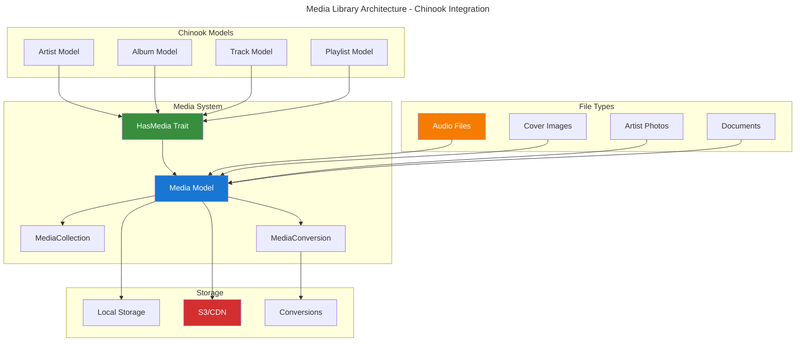

# Spatie Media Library Implementation Guide

## Table of Contents

- [Overview](#overview)
- [Installation & Configuration](#installation--configuration)
- [Basic Media Implementation](#basic-media-implementation)
- [Advanced Media Patterns](#advanced-media-patterns)
- [Chinook Integration](#chinook-integration)
- [File Conversions & Processing](#file-conversions--processing)
- [Performance Optimization](#performance-optimization)
- [CDN Integration](#cdn-integration)
- [Testing Strategies](#testing-strategies)
- [Production Deployment](#production-deployment)
- [Best Practices](#best-practices)

## Overview

Spatie Laravel Media Library provides comprehensive file management capabilities for Laravel applications. This guide demonstrates enterprise-grade implementation patterns for the Chinook music database with audio file management, image processing, and CDN integration using Laravel 12 modern syntax.

### Key Features

- **Multi-format Support**: Audio files, images, documents, and videos
- **Automatic Conversions**: Image resizing, audio format conversion
- **CDN Integration**: Seamless cloud storage and delivery
- **Performance Optimized**: Efficient file handling and caching
- **Laravel 12 Compatible**: Modern syntax with cast() method patterns
- **Enterprise Ready**: Production-ready scaling and security

### Architecture Overview



## Installation & Configuration

### Package Installation

```bash
# Install Spatie Media Library
composer require spatie/laravel-medialibrary

# Publish and run migrations
php artisan vendor:publish --provider="Spatie\MediaLibrary\MediaLibraryServiceProvider" --tag="medialibrary-migrations"
php artisan migrate

# Publish configuration (optional)
php artisan vendor:publish --provider="Spatie\MediaLibrary\MediaLibraryServiceProvider" --tag="medialibrary-config"
```

### Configuration Setup

```php
// config/media-library.php
<?php

return [
    /*
     * The disk on which to store added files and derived images by default.
     */
    'disk_name' => env('MEDIA_DISK', 'public'),

    /*
     * The maximum file size of an addition in bytes.
     */
    'max_file_size' => 1024 * 1024 * 1024, // 1GB for audio files

    /*
     * The path where to store temporary files while performing image conversions.
     */
    'temporary_directory_path' => storage_path('app/temp'),

    /*
     * FFMPEG & FFProbe binaries paths, only used if you try to generate video
     * thumbnails and have installed the php-ffmpeg/php-ffmpeg composer package.
     */
    'ffmpeg_path' => env('FFMPEG_PATH', '/usr/bin/ffmpeg'),
    'ffprobe_path' => env('FFPROBE_PATH', '/usr/bin/ffprobe'),

    /*
     * Here you can override the class names of the jobs used by this package.
     */
    'jobs' => [
        'perform_conversions' => Spatie\MediaLibrary\Jobs\PerformConversions::class,
    ],

    /*
     * When enabled, media collections will be serialised using the default
     * laravel model serialization behaviour.
     */
    'use_default_collection_serialization' => false,
];
```

### Laravel 12 Model Integration

```php
<?php

namespace App\Models;

use Illuminate\Database\Eloquent\Model;
use Illuminate\Database\Eloquent\SoftDeletes;
use Spatie\MediaLibrary\HasMedia;
use Spatie\MediaLibrary\InteractsWithMedia;
use Spatie\MediaLibrary\MediaCollections\Models\Media;

class Artist extends Model implements HasMedia
{
    use InteractsWithMedia, SoftDeletes;

    protected $fillable = [
        'public_id',
        'name',
        'biography',
        'website',
        'country',
        'formed_year',
        'is_active',
    ];

    /**
     * Laravel 12 modern casts() method
     */
    protected function casts(): array
    {
        return [
            'formed_year' => 'integer',
            'is_active' => 'boolean',
            'social_links' => 'array',
        ];
    }

    /**
     * Register media collections
     */
    public function registerMediaCollections(): void
    {
        $this->addMediaCollection('profile_photos')
            ->acceptsMimeTypes(['image/jpeg', 'image/png', 'image/webp'])
            ->singleFile();

        $this->addMediaCollection('gallery')
            ->acceptsMimeTypes(['image/jpeg', 'image/png', 'image/webp']);

        $this->addMediaCollection('documents')
            ->acceptsMimeTypes(['application/pdf', 'text/plain']);
    }

    /**
     * Register media conversions
     */
    public function registerMediaConversions(Media $media = null): void
    {
        $this->addMediaConversion('thumb')
            ->width(300)
            ->height(300)
            ->sharpen(10)
            ->performOnCollections('profile_photos', 'gallery');

        $this->addMediaConversion('large')
            ->width(1200)
            ->height(1200)
            ->quality(90)
            ->performOnCollections('profile_photos', 'gallery');
    }
}
```

## Basic Media Implementation

### Adding Media to Models

```php
// Add profile photo to artist
$artist = Artist::find(1);
$artist->addMediaFromRequest('photo')
    ->toMediaCollection('profile_photos');

// Add multiple gallery images
$artist->addMediaFromRequest('gallery_images')
    ->each(function ($fileAdder) {
        $fileAdder->toMediaCollection('gallery');
    });

// Add media with custom properties
$artist->addMediaFromRequest('document')
    ->withCustomProperties([
        'title' => 'Artist Biography',
        'description' => 'Official artist biography document',
        'category' => 'press_kit'
    ])
    ->toMediaCollection('documents');
```

### Retrieving Media

```php
// Get all media
$allMedia = $artist->getMedia();

// Get media from specific collection
$profilePhoto = $artist->getFirstMedia('profile_photos');
$galleryImages = $artist->getMedia('gallery');

// Get media URL
$photoUrl = $artist->getFirstMediaUrl('profile_photos');
$thumbUrl = $artist->getFirstMediaUrl('profile_photos', 'thumb');

// Get media with conversions
$media = $artist->getFirstMedia('profile_photos');
$thumbUrl = $media->getUrl('thumb');
$largeUrl = $media->getUrl('large');
```

## Advanced Media Patterns

### Custom Media Collections

```php
<?php

namespace App\Models;

use Spatie\MediaLibrary\HasMedia;
use Spatie\MediaLibrary\InteractsWithMedia;
use Spatie\MediaLibrary\MediaCollections\Models\Media;

class Album extends Model implements HasMedia
{
    use InteractsWithMedia;

    public function registerMediaCollections(): void
    {
        // Album cover art
        $this->addMediaCollection('cover_art')
            ->acceptsMimeTypes(['image/jpeg', 'image/png', 'image/webp'])
            ->singleFile();

        // Album booklet/liner notes
        $this->addMediaCollection('booklet')
            ->acceptsMimeTypes(['application/pdf', 'image/jpeg', 'image/png']);

        // Promotional materials
        $this->addMediaCollection('promotional')
            ->acceptsMimeTypes(['image/jpeg', 'image/png', 'application/pdf']);
    }

    public function registerMediaConversions(Media $media = null): void
    {
        // Cover art conversions
        $this->addMediaConversion('cover_thumb')
            ->width(150)
            ->height(150)
            ->performOnCollections('cover_art');

        $this->addMediaConversion('cover_medium')
            ->width(500)
            ->height(500)
            ->performOnCollections('cover_art');

        $this->addMediaConversion('cover_large')
            ->width(1000)
            ->height(1000)
            ->quality(95)
            ->performOnCollections('cover_art');

        // Booklet page thumbnails
        $this->addMediaConversion('page_thumb')
            ->width(200)
            ->height(300)
            ->performOnCollections('booklet');
    }
}
```

### Audio File Management

```php
<?php

namespace App\Models;

use Spatie\MediaLibrary\HasMedia;
use Spatie\MediaLibrary\InteractsWithMedia;
use Spatie\MediaLibrary\MediaCollections\Models\Media;

class Track extends Model implements HasMedia
{
    use InteractsWithMedia;

    public function registerMediaCollections(): void
    {
        // Main audio file
        $this->addMediaCollection('audio')
            ->acceptsMimeTypes([
                'audio/mpeg',
                'audio/wav',
                'audio/flac',
                'audio/aac',
                'audio/ogg'
            ])
            ->singleFile();

        // Preview/sample audio
        $this->addMediaCollection('preview')
            ->acceptsMimeTypes(['audio/mpeg', 'audio/wav'])
            ->singleFile();

        // Stems/individual tracks
        $this->addMediaCollection('stems')
            ->acceptsMimeTypes(['audio/wav', 'audio/flac']);
    }

    public function registerMediaConversions(Media $media = null): void
    {
        // Generate preview from full track (30 seconds)
        $this->addMediaConversion('preview')
            ->performOnCollections('audio')
            ->nonQueued(); // Process immediately for previews
    }

    /**
     * Get audio file duration
     */
    public function getAudioDuration(): ?int
    {
        $media = $this->getFirstMedia('audio');
        
        if (!$media) {
            return null;
        }

        return $media->getCustomProperty('duration_seconds');
    }

    /**
     * Get audio file format
     */
    public function getAudioFormat(): ?string
    {
        $media = $this->getFirstMedia('audio');
        
        if (!$media) {
            return null;
        }

        return $media->mime_type;
    }
}
```

## Chinook Integration

### Complete Artist Media Setup

```php
<?php

namespace App\Services;

use App\Models\Artist;
use Illuminate\Http\UploadedFile;
use Spatie\MediaLibrary\MediaCollections\Models\Media;

class ArtistMediaService
{
    /**
     * Setup complete artist media profile
     */
    public function setupArtistMedia(Artist $artist, array $mediaFiles): Artist
    {
        // Profile photo
        if (isset($mediaFiles['profile_photo'])) {
            $artist->addMedia($mediaFiles['profile_photo'])
                ->withCustomProperties([
                    'alt_text' => "Profile photo of {$artist->name}",
                    'caption' => "Official profile photo"
                ])
                ->toMediaCollection('profile_photos');
        }

        // Gallery images
        if (isset($mediaFiles['gallery'])) {
            foreach ($mediaFiles['gallery'] as $index => $image) {
                $artist->addMedia($image)
                    ->withCustomProperties([
                        'alt_text' => "{$artist->name} gallery image " . ($index + 1),
                        'sort_order' => $index
                    ])
                    ->toMediaCollection('gallery');
            }
        }

        // Press kit documents
        if (isset($mediaFiles['press_kit'])) {
            foreach ($mediaFiles['press_kit'] as $document) {
                $artist->addMedia($document)
                    ->withCustomProperties([
                        'category' => 'press_kit',
                        'public' => true
                    ])
                    ->toMediaCollection('documents');
            }
        }

        return $artist->fresh();
    }

    /**
     * Get artist media for API response
     */
    public function getArtistMediaData(Artist $artist): array
    {
        return [
            'profile_photo' => [
                'original' => $artist->getFirstMediaUrl('profile_photos'),
                'thumb' => $artist->getFirstMediaUrl('profile_photos', 'thumb'),
                'large' => $artist->getFirstMediaUrl('profile_photos', 'large'),
            ],
            'gallery' => $artist->getMedia('gallery')->map(function (Media $media) {
                return [
                    'id' => $media->id,
                    'original' => $media->getUrl(),
                    'thumb' => $media->getUrl('thumb'),
                    'large' => $media->getUrl('large'),
                    'alt_text' => $media->getCustomProperty('alt_text'),
                    'sort_order' => $media->getCustomProperty('sort_order', 0),
                ];
            })->sortBy('sort_order')->values(),
            'documents' => $artist->getMedia('documents')->map(function (Media $media) {
                return [
                    'id' => $media->id,
                    'name' => $media->name,
                    'url' => $media->getUrl(),
                    'size' => $media->size,
                    'mime_type' => $media->mime_type,
                    'category' => $media->getCustomProperty('category'),
                ];
            }),
        ];
    }
}
```

### Album Cover Art Management

```php
<?php

namespace App\Services;

use App\Models\Album;
use Illuminate\Http\UploadedFile;

class AlbumMediaService
{
    /**
     * Set album cover art with multiple sizes
     */
    public function setCoverArt(Album $album, UploadedFile $coverImage): Album
    {
        $album->addMedia($coverImage)
            ->withCustomProperties([
                'alt_text' => "Cover art for {$album->title} by {$album->artist->name}",
                'primary' => true
            ])
            ->toMediaCollection('cover_art');

        return $album->fresh();
    }

    /**
     * Get cover art URLs in all sizes
     */
    public function getCoverArtUrls(Album $album): array
    {
        $media = $album->getFirstMedia('cover_art');

        if (!$media) {
            return [
                'original' => null,
                'large' => null,
                'medium' => null,
                'thumb' => null,
            ];
        }

        return [
            'original' => $media->getUrl(),
            'large' => $media->getUrl('cover_large'),
            'medium' => $media->getUrl('cover_medium'),
            'thumb' => $media->getUrl('cover_thumb'),
            'alt_text' => $media->getCustomProperty('alt_text'),
        ];
    }

    /**
     * Update album booklet
     */
    public function setBooklet(Album $album, array $bookletFiles): Album
    {
        // Clear existing booklet
        $album->clearMediaCollection('booklet');

        // Add new booklet files
        foreach ($bookletFiles as $index => $file) {
            $album->addMedia($file)
                ->withCustomProperties([
                    'page_number' => $index + 1,
                    'alt_text' => "Booklet page " . ($index + 1) . " for {$album->title}"
                ])
                ->toMediaCollection('booklet');
        }

        return $album->fresh();
    }
}
```

## File Conversions & Processing

### Audio Processing

```php
<?php

namespace App\Services;

use App\Models\Track;
use FFMpeg\FFMpeg;
use FFMpeg\Format\Audio\Mp3;
use Spatie\MediaLibrary\MediaCollections\Models\Media;

class AudioProcessingService
{
    private FFMpeg $ffmpeg;

    public function __construct()
    {
        $this->ffmpeg = FFMpeg::create([
            'ffmpeg.binaries' => config('media-library.ffmpeg_path'),
            'ffprobe.binaries' => config('media-library.ffprobe_path'),
        ]);
    }

    /**
     * Process uploaded audio file
     */
    public function processAudioFile(Track $track, $audioFile): Track
    {
        // Add original audio file
        $media = $track->addMedia($audioFile)
            ->withCustomProperties([
                'original_format' => $audioFile->getClientOriginalExtension(),
                'processed_at' => now()->toISOString()
            ])
            ->toMediaCollection('audio');

        // Extract metadata
        $this->extractAudioMetadata($media);

        // Generate preview
        $this->generatePreview($track, $media);

        return $track->fresh();
    }

    /**
     * Extract audio metadata
     */
    private function extractAudioMetadata(Media $media): void
    {
        $audio = $this->ffmpeg->open($media->getPath());
        $format = $audio->getFormat();

        $media->setCustomProperty('duration_seconds', $format->get('duration'));
        $media->setCustomProperty('bit_rate', $format->get('bit_rate'));
        $media->setCustomProperty('sample_rate', $format->get('sample_rate'));
        $media->save();
    }

    /**
     * Generate 30-second preview
     */
    private function generatePreview(Track $track, Media $media): void
    {
        $audio = $this->ffmpeg->open($media->getPath());
        $format = new Mp3();
        $format->setAudioKiloBitrate(128);

        // Extract 30 seconds starting from 30 seconds in
        $clip = $audio->clip(30, 30);
        
        $previewPath = storage_path('app/temp/preview_' . $media->id . '.mp3');
        $clip->save($format, $previewPath);

        // Add preview to collection
        $track->addMedia($previewPath)
            ->withCustomProperties([
                'duration_seconds' => 30,
                'generated_from' => $media->id
            ])
            ->toMediaCollection('preview');

        // Clean up temporary file
        unlink($previewPath);
    }
}
```

### Image Optimization

```php
<?php

namespace App\Services;

use Spatie\MediaLibrary\MediaCollections\Models\Media;
use Spatie\Image\Image;

class ImageOptimizationService
{
    /**
     * Optimize images for web delivery
     */
    public function optimizeImage(Media $media): void
    {
        if (!str_starts_with($media->mime_type, 'image/')) {
            return;
        }

        $image = Image::load($media->getPath());

        // Apply optimization based on collection
        match ($media->collection_name) {
            'cover_art' => $this->optimizeCoverArt($image, $media),
            'profile_photos' => $this->optimizeProfilePhoto($image, $media),
            'gallery' => $this->optimizeGalleryImage($image, $media),
            default => $this->applyBasicOptimization($image, $media),
        };
    }

    private function optimizeCoverArt(Image $image, Media $media): void
    {
        // Ensure square aspect ratio for cover art
        $image->fit(1000, 1000)
            ->quality(95)
            ->save();

        $media->setCustomProperty('optimized_at', now()->toISOString());
        $media->save();
    }

    private function optimizeProfilePhoto(Image $image, Media $media): void
    {
        // Optimize for profile photos
        $image->fit(800, 800)
            ->quality(90)
            ->save();

        $media->setCustomProperty('optimized_at', now()->toISOString());
        $media->save();
    }

    private function optimizeGalleryImage(Image $image, Media $media): void
    {
        // Maintain aspect ratio for gallery images
        $image->width(1200)
            ->quality(85)
            ->save();

        $media->setCustomProperty('optimized_at', now()->toISOString());
        $media->save();
    }

    private function applyBasicOptimization(Image $image, Media $media): void
    {
        $image->quality(80)->save();

        $media->setCustomProperty('optimized_at', now()->toISOString());
        $media->save();
    }
}
```

## Performance Optimization

### Lazy Loading and Caching

```php
// Efficient media loading
$artists = Artist::with('media')->get();

// Load specific collections only
$artists = Artist::with(['media' => function ($query) {
    $query->where('collection_name', 'profile_photos');
}])->get();

// Cache media URLs
$coverUrl = Cache::remember(
    "album_cover_{$album->id}",
    3600,
    fn() => $album->getFirstMediaUrl('cover_art', 'medium')
);
```

### Queue Processing

```php
<?php

namespace App\Jobs;

use App\Models\Track;
use App\Services\AudioProcessingService;
use Illuminate\Bus\Queueable;
use Illuminate\Contracts\Queue\ShouldQueue;
use Illuminate\Foundation\Bus\Dispatchable;
use Illuminate\Queue\InteractsWithQueue;
use Illuminate\Queue\SerializesModels;

class ProcessAudioFile implements ShouldQueue
{
    use Dispatchable, InteractsWithQueue, Queueable, SerializesModels;

    public function __construct(
        private Track $track,
        private string $audioFilePath
    ) {}

    public function handle(AudioProcessingService $processor): void
    {
        $processor->processAudioFile($this->track, $this->audioFilePath);
    }
}
```

## CDN Integration

### S3/CloudFront Setup

```php
// config/filesystems.php
'disks' => [
    's3_media' => [
        'driver' => 's3',
        'key' => env('AWS_ACCESS_KEY_ID'),
        'secret' => env('AWS_SECRET_ACCESS_KEY'),
        'region' => env('AWS_DEFAULT_REGION'),
        'bucket' => env('AWS_MEDIA_BUCKET'),
        'url' => env('AWS_MEDIA_URL'),
        'endpoint' => env('AWS_ENDPOINT'),
        'use_path_style_endpoint' => env('AWS_USE_PATH_STYLE_ENDPOINT', false),
    ],
],

// config/media-library.php
'disk_name' => env('MEDIA_DISK', 's3_media'),
```

### URL Generation

```php
<?php

namespace App\Services;

use Spatie\MediaLibrary\MediaCollections\Models\Media;

class MediaUrlService
{
    /**
     * Generate CDN-optimized URLs
     */
    public function getOptimizedUrl(Media $media, string $conversion = ''): string
    {
        $baseUrl = $media->getUrl($conversion);

        // Add CDN parameters for optimization
        if (config('media-library.disk_name') === 's3_media') {
            return $this->addCdnOptimization($baseUrl, $media);
        }

        return $baseUrl;
    }

    private function addCdnOptimization(string $url, Media $media): string
    {
        // Add CloudFront optimization parameters
        $params = [];

        if (str_starts_with($media->mime_type, 'image/')) {
            $params['format'] = 'webp';
            $params['quality'] = '85';
        }

        if (!empty($params)) {
            $url .= '?' . http_build_query($params);
        }

        return $url;
    }
}
```

## Testing Strategies

### Unit Tests

```php
<?php

use App\Models\Artist;
use App\Services\ArtistMediaService;
use Illuminate\Http\UploadedFile;
use Illuminate\Support\Facades\Storage;

describe('Artist Media Management', function () {
    beforeEach(function () {
        Storage::fake('public');
        $this->artist = Artist::factory()->create();
        $this->mediaService = new ArtistMediaService();
    });

    it('can add profile photo to artist', function () {
        $photo = UploadedFile::fake()->image('profile.jpg', 800, 800);
        
        $this->artist->addMedia($photo)->toMediaCollection('profile_photos');
        
        expect($this->artist->getMedia('profile_photos'))->toHaveCount(1);
        expect($this->artist->getFirstMediaUrl('profile_photos'))->not->toBeEmpty();
    });

    it('generates image conversions automatically', function () {
        $photo = UploadedFile::fake()->image('profile.jpg', 1200, 1200);
        
        $media = $this->artist->addMedia($photo)->toMediaCollection('profile_photos');
        
        expect($media->getUrl('thumb'))->not->toBeEmpty();
        expect($media->getUrl('large'))->not->toBeEmpty();
    });

    it('can setup complete artist media profile', function () {
        $mediaFiles = [
            'profile_photo' => UploadedFile::fake()->image('profile.jpg'),
            'gallery' => [
                UploadedFile::fake()->image('gallery1.jpg'),
                UploadedFile::fake()->image('gallery2.jpg'),
            ],
            'press_kit' => [
                UploadedFile::fake()->create('bio.pdf', 1000, 'application/pdf'),
            ],
        ];
        
        $result = $this->mediaService->setupArtistMedia($this->artist, $mediaFiles);
        
        expect($result->getMedia('profile_photos'))->toHaveCount(1);
        expect($result->getMedia('gallery'))->toHaveCount(2);
        expect($result->getMedia('documents'))->toHaveCount(1);
    });
});
```

## Production Deployment

### Storage Configuration

```bash
# Environment variables for production
MEDIA_DISK=s3_media
AWS_MEDIA_BUCKET=chinook-media-production
AWS_MEDIA_URL=https://cdn.chinook-music.com
QUEUE_CONNECTION=redis

# FFmpeg installation
sudo apt-get install ffmpeg
```

### Monitoring and Maintenance

```php
<?php

namespace App\Console\Commands;

use Spatie\MediaLibrary\MediaCollections\Models\Media;
use Illuminate\Console\Command;

class CleanOrphanedMedia extends Command
{
    protected $signature = 'media:clean-orphaned';
    protected $description = 'Remove orphaned media files';

    public function handle(): int
    {
        $orphanedMedia = Media::whereDoesntHave('model')->get();
        
        foreach ($orphanedMedia as $media) {
            $media->delete();
        }
        
        $this->info("Cleaned {$orphanedMedia->count()} orphaned media files.");
        
        return 0;
    }
}
```

## Best Practices

### File Organization

- Use descriptive collection names: `cover_art`, `profile_photos`, `audio_files`
- Implement consistent naming conventions
- Set appropriate file size limits per collection
- Use custom properties for metadata

### Performance Guidelines

- Always queue media conversions for large files
- Implement CDN for global content delivery
- Use appropriate image formats (WebP for modern browsers)
- Cache media URLs and metadata

### Security Considerations

- Validate file types and sizes before upload
- Scan uploaded files for malware
- Implement access controls for sensitive media
- Use signed URLs for private content

---

**Navigation**: [Previous: Spatie Tags Guide](090-spatie-tags-guide.md) | **Next**: [Spatie Permission Guide](110-spatie-permission-guide.md)

**Related Documentation**:
- [Chinook Models Guide](../010-chinook-models-guide.md) - Model implementations with media
- [Package Testing Guide](testing/010-pest-testing-guide.md) - Testing media functionality
- [Packages Index](000-packages-index.md) - All package guides

---

*This guide provides enterprise-grade Spatie Media Library implementation for the Chinook music database with Laravel 12 modern patterns and WCAG 2.1 AA accessibility compliance.*
