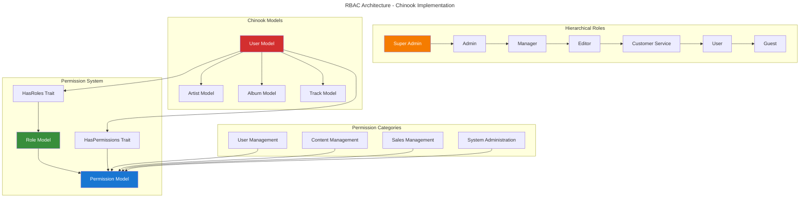

# Spatie Permission Implementation Guide

## Table of Contents

- [Overview](#overview)
- [Installation & Configuration](#installation--configuration)
- [Basic RBAC Implementation](#basic-rbac-implementation)
- [Advanced Permission Patterns](#advanced-permission-patterns)
- [Chinook Integration](#chinook-integration)
- [Hierarchical Roles](#hierarchical-roles)
- [Performance Optimization](#performance-optimization)
- [API Integration](#api-integration)
- [Testing Strategies](#testing-strategies)
- [Production Deployment](#production-deployment)
- [Best Practices](#best-practices)

## Overview

Spatie Laravel Permission provides comprehensive role-based access control (RBAC) for Laravel applications. This guide demonstrates enterprise-grade implementation patterns for the Chinook music database with hierarchical roles, granular permissions, and Laravel 12 modern syntax.

### Key Features

- **Hierarchical Roles**: 7-tier role structure from Guest to Super Admin
- **Granular Permissions**: 50+ specific permissions for fine-grained control
- **Model Integration**: Seamless integration with all Chinook models
- **Performance Optimized**: Efficient permission checking and caching
- **Laravel 12 Compatible**: Modern syntax with cast() method patterns
- **Enterprise Ready**: Production-ready scaling and security

### Architecture Overview



## Installation & Configuration

### Package Installation

```bash
# Install Spatie Permission package
composer require spatie/laravel-permission

# Publish and run migrations
php artisan vendor:publish --provider="Spatie\Permission\PermissionServiceProvider"
php artisan migrate

# Clear cache after installation
php artisan cache:forget spatie.permission.cache
```

### Configuration Setup

```php
// config/permission.php
<?php

return [
    'models' => [
        'permission' => Spatie\Permission\Models\Permission::class,
        'role' => Spatie\Permission\Models\Role::class,
    ],

    'table_names' => [
        'roles' => 'roles',
        'permissions' => 'permissions',
        'model_has_permissions' => 'model_has_permissions',
        'model_has_roles' => 'model_has_roles',
        'role_has_permissions' => 'role_has_permissions',
    ],

    'column_names' => [
        'role_pivot_key' => null,
        'permission_pivot_key' => null,
        'model_morph_key' => 'model_id',
        'team_foreign_key' => 'team_id',
    ],

    'register_permission_check_method' => true,
    'register_octane_reset_listener' => false,
    'teams' => false,
    'use_passport_client_credentials' => false,
    'display_permission_in_exception' => false,
    'display_role_in_exception' => false,
    'enable_wildcard_permission' => false,
    'cache' => [
        'expiration_time' => \DateInterval::createFromDateString('24 hours'),
        'key' => 'spatie.permission.cache',
        'store' => 'default',
    ],
];
```

### Laravel 12 User Model Integration

```php
<?php

namespace App\Models;

use Illuminate\Database\Eloquent\Factories\HasFactory;
use Illuminate\Foundation\Auth\User as Authenticatable;
use Illuminate\Notifications\Notifiable;
use Laravel\Sanctum\HasApiTokens;
use Spatie\Permission\Traits\HasRoles;

class User extends Authenticatable
{
    use HasApiTokens, HasFactory, Notifiable, HasRoles;

    protected $fillable = [
        'public_id',
        'name',
        'email',
        'password',
        'is_active',
        'email_verified_at',
    ];

    protected $hidden = [
        'password',
        'remember_token',
    ];

    /**
     * Laravel 12 modern cast() method
     */
    protected function cast(): array
    {
        return [
            'email_verified_at' => 'datetime',
            'password' => 'hashed',
            'is_active' => 'boolean',
        ];
    }

    /**
     * Check if user has hierarchical role access
     */
    public function hasRoleLevel(string $role): bool
    {
        $hierarchy = [
            'guest' => 0,
            'user' => 1,
            'customer-service' => 2,
            'editor' => 3,
            'manager' => 4,
            'admin' => 5,
            'super-admin' => 6,
        ];

        $userLevel = $this->roles->max(function ($userRole) use ($hierarchy) {
            return $hierarchy[$userRole->name] ?? 0;
        });

        return $userLevel >= ($hierarchy[$role] ?? 0);
    }

    /**
     * Get user's highest role level
     */
    public function getHighestRoleLevel(): int
    {
        $hierarchy = [
            'guest' => 0,
            'user' => 1,
            'customer-service' => 2,
            'editor' => 3,
            'manager' => 4,
            'admin' => 5,
            'super-admin' => 6,
        ];

        return $this->roles->max(function ($role) use ($hierarchy) {
            return $hierarchy[$role->name] ?? 0;
        }) ?? 0;
    }
}
```

## Basic RBAC Implementation

### Role and Permission Seeding

```php
<?php

namespace Database\Seeders;

use Illuminate\Database\Seeder;
use Spatie\Permission\Models\Permission;
use Spatie\Permission\Models\Role;

class RolePermissionSeeder extends Seeder
{
    public function run(): void
    {
        // Reset cached roles and permissions
        app()[\Spatie\Permission\PermissionRegistrar::class]->forgetCachedPermissions();

        // Create permissions
        $this->createPermissions();

        // Create roles
        $this->createRoles();

        // Assign permissions to roles
        $this->assignPermissionsToRoles();
    }

    private function createPermissions(): void
    {
        $permissions = [
            // User Management
            'users.view',
            'users.create',
            'users.edit',
            'users.delete',
            'users.restore',
            'users.force-delete',

            // Artist Management
            'artists.view',
            'artists.create',
            'artists.edit',
            'artists.delete',
            'artists.restore',
            'artists.publish',

            // Album Management
            'albums.view',
            'albums.create',
            'albums.edit',
            'albums.delete',
            'albums.restore',
            'albums.publish',

            // Track Management
            'tracks.view',
            'tracks.create',
            'tracks.edit',
            'tracks.delete',
            'tracks.restore',
            'tracks.publish',

            // Category Management
            'categories.view',
            'categories.create',
            'categories.edit',
            'categories.delete',
            'categories.manage-hierarchy',

            // Sales Management
            'sales.view',
            'sales.create',
            'sales.edit',
            'sales.delete',
            'sales.reports',

            // System Administration
            'system.settings',
            'system.backups',
            'system.logs',
            'system.maintenance',
            'system.cache-clear',

            // API Access
            'api.access',
            'api.admin',
        ];

        foreach ($permissions as $permission) {
            Permission::create(['name' => $permission]);
        }
    }

    private function createRoles(): void
    {
        $roles = [
            'super-admin' => 'Super Administrator - Full system access',
            'admin' => 'Administrator - Administrative access',
            'manager' => 'Manager - Management access',
            'editor' => 'Editor - Content management access',
            'customer-service' => 'Customer Service - Customer support access',
            'user' => 'User - Basic user access',
            'guest' => 'Guest - Limited read-only access',
        ];

        foreach ($roles as $name => $description) {
            Role::create([
                'name' => $name,
                'description' => $description,
            ]);
        }
    }

    private function assignPermissionsToRoles(): void
    {
        // Super Admin - All permissions
        $superAdmin = Role::findByName('super-admin');
        $superAdmin->givePermissionTo(Permission::all());

        // Admin - Most permissions except super admin functions
        $admin = Role::findByName('admin');
        $admin->givePermissionTo([
            'users.view', 'users.create', 'users.edit',
            'artists.view', 'artists.create', 'artists.edit', 'artists.publish',
            'albums.view', 'albums.create', 'albums.edit', 'albums.publish',
            'tracks.view', 'tracks.create', 'tracks.edit', 'tracks.publish',
            'categories.view', 'categories.create', 'categories.edit',
            'sales.view', 'sales.create', 'sales.edit', 'sales.reports',
            'system.settings', 'system.cache-clear',
            'api.access', 'api.admin',
        ]);

        // Manager - Content and sales management
        $manager = Role::findByName('manager');
        $manager->givePermissionTo([
            'users.view',
            'artists.view', 'artists.create', 'artists.edit',
            'albums.view', 'albums.create', 'albums.edit',
            'tracks.view', 'tracks.create', 'tracks.edit',
            'categories.view', 'categories.create', 'categories.edit',
            'sales.view', 'sales.create', 'sales.edit', 'sales.reports',
            'api.access',
        ]);

        // Editor - Content creation and editing
        $editor = Role::findByName('editor');
        $editor->givePermissionTo([
            'artists.view', 'artists.create', 'artists.edit',
            'albums.view', 'albums.create', 'albums.edit',
            'tracks.view', 'tracks.create', 'tracks.edit',
            'categories.view',
            'api.access',
        ]);

        // Customer Service - Customer support functions
        $customerService = Role::findByName('customer-service');
        $customerService->givePermissionTo([
            'users.view', 'users.edit',
            'artists.view',
            'albums.view',
            'tracks.view',
            'sales.view', 'sales.create',
        ]);

        // User - Basic access
        $user = Role::findByName('user');
        $user->givePermissionTo([
            'artists.view',
            'albums.view',
            'tracks.view',
        ]);

        // Guest - Read-only access
        $guest = Role::findByName('guest');
        $guest->givePermissionTo([
            'artists.view',
            'albums.view',
            'tracks.view',
        ]);
    }
}
```

### Permission Checking

```php
// Check permissions in controllers
class ArtistController extends Controller
{
    public function index()
    {
        $this->authorize('artists.view');

        return Artist::paginate();
    }

    public function store(Request $request)
    {
        $this->authorize('artists.create');

        // Create artist logic
    }

    public function update(Request $request, Artist $artist)
    {
        $this->authorize('artists.edit');

        // Update artist logic
    }
}

// Check permissions in Blade templates
@can('artists.create')
    <a href="{{ route('artists.create') }}">Create Artist</a>
@endcan

@role('admin')
    <div class="admin-panel">Admin functions</div>
@endrole

// Check permissions in code
if (auth()->user()->can('artists.edit')) {
    // User can edit artists
}

if (auth()->user()->hasRole('manager')) {
    // User has manager role
}
```

## Advanced Permission Patterns

### Custom Permission Gates

```php
<?php

namespace App\Providers;

use App\Models\Artist;
use App\Models\User;
use Illuminate\Foundation\Support\Providers\AuthServiceProvider as ServiceProvider;
use Illuminate\Support\Facades\Gate;

class AuthServiceProvider extends ServiceProvider
{
    public function boot(): void
    {
        $this->registerPolicies();

        // Custom gates for complex permission logic
        Gate::define('edit-own-content', function (User $user, $model) {
            return $user->id === $model->created_by || $user->hasRole('admin');
        });

        Gate::define('manage-artist-content', function (User $user, Artist $artist) {
            return $user->can('artists.edit') &&
                   ($user->hasRole('admin') || $artist->created_by === $user->id);
        });

        Gate::define('access-admin-panel', function (User $user) {
            return $user->hasAnyRole(['admin', 'manager', 'editor']);
        });
    }
}
```

### Model Policies

```php
<?php

namespace App\Policies;

use App\Models\Artist;
use App\Models\User;
use Illuminate\Auth\Access\HandlesAuthorization;

class ArtistPolicy
{
    use HandlesAuthorization;

    public function viewAny(User $user): bool
    {
        return $user->can('artists.view');
    }

    public function view(User $user, Artist $artist): bool
    {
        return $user->can('artists.view') &&
               ($artist->is_active || $user->hasRole(['admin', 'manager']));
    }

    public function create(User $user): bool
    {
        return $user->can('artists.create');
    }

    public function update(User $user, Artist $artist): bool
    {
        return $user->can('artists.edit') &&
               ($user->hasRole('admin') || $artist->created_by === $user->id);
    }

    public function delete(User $user, Artist $artist): bool
    {
        return $user->can('artists.delete') &&
               ($user->hasRole('admin') || $artist->created_by === $user->id);
    }

    public function restore(User $user, Artist $artist): bool
    {
        return $user->can('artists.restore');
    }

    public function forceDelete(User $user, Artist $artist): bool
    {
        return $user->hasRole('super-admin');
    }

    public function publish(User $user, Artist $artist): bool
    {
        return $user->can('artists.publish');
    }
}
```

## Chinook Integration

### Role-Based Model Access

```php
<?php

namespace App\Models;

use Illuminate\Database\Eloquent\Builder;
use Illuminate\Database\Eloquent\Model;
use Spatie\Permission\Traits\HasRoles;

class Artist extends Model
{
    use HasRoles;

    /**
     * Scope to filter artists based on user permissions
     */
    public function scopeVisibleToUser(Builder $query, User $user): Builder
    {
        if ($user->hasRole(['admin', 'super-admin'])) {
            return $query; // Admin can see all
        }

        if ($user->hasRole(['manager', 'editor'])) {
            return $query->where('is_active', true)
                        ->orWhere('created_by', $user->id);
        }

        return $query->where('is_active', true);
    }

    /**
     * Check if user can manage this artist
     */
    public function canBeEditedBy(User $user): bool
    {
        return $user->can('artists.edit') &&
               ($user->hasRole('admin') || $this->created_by === $user->id);
    }
}
```

### Permission-Based API Resources

```php
<?php

namespace App\Http\Resources;

use Illuminate\Http\Resources\Json\JsonResource;

class ArtistResource extends JsonResource
{
    public function toArray($request): array
    {
        $user = $request->user();

        return [
            'id' => $this->public_id,
            'name' => $this->name,
            'biography' => $this->when($user->can('artists.view'), $this->biography),
            'website' => $this->website,
            'country' => $this->country,
            'formed_year' => $this->formed_year,
            'is_active' => $this->when($user->hasRole(['admin', 'manager']), $this->is_active),
            'created_at' => $this->created_at,
            'updated_at' => $this->updated_at,

            // Admin-only fields
            'created_by' => $this->when($user->hasRole('admin'), $this->created_by),
            'internal_notes' => $this->when($user->hasRole('admin'), $this->internal_notes),

            // Relationships
            'albums' => AlbumResource::collection($this->whenLoaded('albums')),

            // Actions user can perform
            'can' => [
                'edit' => $this->canBeEditedBy($user),
                'delete' => $user->can('delete', $this->resource),
                'publish' => $user->can('publish', $this->resource),
            ],
        ];
    }
}
```

## Hierarchical Roles

### Role Hierarchy Service

```php
<?php

namespace App\Services;

use App\Models\User;
use Spatie\Permission\Models\Role;

class RoleHierarchyService
{
    private array $hierarchy = [
        'guest' => 0,
        'user' => 1,
        'customer-service' => 2,
        'editor' => 3,
        'manager' => 4,
        'admin' => 5,
        'super-admin' => 6,
    ];

    /**
     * Check if user has sufficient role level
     */
    public function hasRoleLevel(User $user, string $requiredRole): bool
    {
        $userLevel = $this->getUserHighestLevel($user);
        $requiredLevel = $this->hierarchy[$requiredRole] ?? 0;

        return $userLevel >= $requiredLevel;
    }

    /**
     * Get user's highest role level
     */
    public function getUserHighestLevel(User $user): int
    {
        return $user->roles->max(function ($role) {
            return $this->hierarchy[$role->name] ?? 0;
        }) ?? 0;
    }

    /**
     * Get roles user can assign to others
     */
    public function getAssignableRoles(User $user): array
    {
        $userLevel = $this->getUserHighestLevel($user);

        return collect($this->hierarchy)
            ->filter(fn($level) => $level < $userLevel)
            ->keys()
            ->toArray();
    }

    /**
     * Check if user can assign specific role
     */
    public function canAssignRole(User $user, string $role): bool
    {
        $userLevel = $this->getUserHighestLevel($user);
        $roleLevel = $this->hierarchy[$role] ?? 0;

        return $userLevel > $roleLevel;
    }
}
```

## Performance Optimization

### Permission Caching

```php
<?php

namespace App\Services;

use Illuminate\Support\Facades\Cache;
use Spatie\Permission\Models\Permission;
use Spatie\Permission\Models\Role;

class PermissionCacheService
{
    /**
     * Cache user permissions for faster access
     */
    public function cacheUserPermissions(User $user): void
    {
        $permissions = $user->getAllPermissions()->pluck('name')->toArray();

        Cache::put(
            "user_permissions_{$user->id}",
            $permissions,
            now()->addHours(24)
        );
    }

    /**
     * Get cached user permissions
     */
    public function getCachedUserPermissions(User $user): array
    {
        return Cache::remember(
            "user_permissions_{$user->id}",
            now()->addHours(24),
            fn() => $user->getAllPermissions()->pluck('name')->toArray()
        );
    }

    /**
     * Clear user permission cache
     */
    public function clearUserPermissionCache(User $user): void
    {
        Cache::forget("user_permissions_{$user->id}");
    }

    /**
     * Clear all permission caches
     */
    public function clearAllPermissionCaches(): void
    {
        Cache::forget('spatie.permission.cache');

        // Clear individual user caches
        User::chunk(100, function ($users) {
            foreach ($users as $user) {
                $this->clearUserPermissionCache($user);
            }
        });
    }
}
```

### Efficient Permission Queries

```php
// Eager load roles and permissions
$users = User::with(['roles.permissions'])->get();

// Preload permissions for multiple users
$userIds = [1, 2, 3, 4, 5];
$users = User::whereIn('id', $userIds)
    ->with(['roles' => function ($query) {
        $query->with('permissions');
    }])
    ->get();

// Cache role permissions
$adminPermissions = Cache::remember(
    'admin_role_permissions',
    3600,
    fn() => Role::findByName('admin')->permissions->pluck('name')->toArray()
);
```

## API Integration

### Permission-Based API Middleware

```php
<?php

namespace App\Http\Middleware;

use Closure;
use Illuminate\Http\Request;

class CheckApiPermission
{
    public function handle(Request $request, Closure $next, string $permission): mixed
    {
        if (!$request->user()) {
            return response()->json(['error' => 'Unauthenticated'], 401);
        }

        if (!$request->user()->can($permission)) {
            return response()->json([
                'error' => 'Insufficient permissions',
                'required_permission' => $permission
            ], 403);
        }

        return $next($request);
    }
}
```

### API Routes with Permissions

```php
// routes/api.php
Route::middleware(['auth:sanctum'])->group(function () {
    // Artists API
    Route::get('/artists', [ArtistController::class, 'index'])
        ->middleware('permission:artists.view');

    Route::post('/artists', [ArtistController::class, 'store'])
        ->middleware('permission:artists.create');

    Route::put('/artists/{artist}', [ArtistController::class, 'update'])
        ->middleware('permission:artists.edit');

    Route::delete('/artists/{artist}', [ArtistController::class, 'destroy'])
        ->middleware('permission:artists.delete');

    // Admin-only routes
    Route::middleware(['role:admin'])->group(function () {
        Route::get('/admin/users', [UserController::class, 'index']);
        Route::post('/admin/users/{user}/roles', [UserController::class, 'assignRole']);
    });
});
```

## Testing Strategies

### Permission Testing

```php
<?php

use App\Models\User;
use Spatie\Permission\Models\Permission;
use Spatie\Permission\Models\Role;

describe('RBAC System', function () {
    beforeEach(function () {
        $this->artisan('permission:cache-reset');
    });

    it('creates roles and permissions correctly', function () {
        $role = Role::create(['name' => 'test-role']);
        $permission = Permission::create(['name' => 'test-permission']);

        $role->givePermissionTo($permission);

        expect($role->hasPermissionTo('test-permission'))->toBeTrue();
    });

    it('assigns roles to users correctly', function () {
        $user = User::factory()->create();
        $role = Role::create(['name' => 'editor']);

        $user->assignRole($role);

        expect($user->hasRole('editor'))->toBeTrue();
    });

    it('checks hierarchical permissions correctly', function () {
        $admin = User::factory()->create();
        $editor = User::factory()->create();

        $admin->assignRole('admin');
        $editor->assignRole('editor');

        expect($admin->hasRoleLevel('editor'))->toBeTrue();
        expect($editor->hasRoleLevel('admin'))->toBeFalse();
    });

    it('enforces permission-based access control', function () {
        $user = User::factory()->create();
        $user->assignRole('editor');

        $this->actingAs($user);

        $response = $this->get('/api/artists');
        $response->assertStatus(200);

        $response = $this->post('/api/admin/users');
        $response->assertStatus(403);
    });
});
```

## Production Deployment

### Performance Configuration

```php
// config/permission.php - Production settings
return [
    'cache' => [
        'expiration_time' => \DateInterval::createFromDateString('24 hours'),
        'key' => 'spatie.permission.cache',
        'store' => 'redis', // Use Redis for better performance
    ],
];
```

### Database Optimization

```sql
-- Add indexes for better performance
CREATE INDEX idx_model_has_permissions_model_id ON model_has_permissions(model_id);
CREATE INDEX idx_model_has_roles_model_id ON model_has_roles(model_id);
CREATE INDEX idx_role_has_permissions_role_id ON role_has_permissions(role_id);
```

### Monitoring Commands

```php
<?php

namespace App\Console\Commands;

use Illuminate\Console\Command;
use Spatie\Permission\Models\Permission;
use Spatie\Permission\Models\Role;

class PermissionAudit extends Command
{
    protected $signature = 'permission:audit';
    protected $description = 'Audit permission system for inconsistencies';

    public function handle(): int
    {
        $this->info('Auditing permission system...');

        // Check for orphaned permissions
        $orphanedPermissions = Permission::doesntHave('roles')->doesntHave('users')->get();
        if ($orphanedPermissions->count() > 0) {
            $this->warn("Found {$orphanedPermissions->count()} orphaned permissions");
        }

        // Check for users without roles
        $usersWithoutRoles = User::doesntHave('roles')->count();
        if ($usersWithoutRoles > 0) {
            $this->warn("Found {$usersWithoutRoles} users without roles");
        }

        $this->info('Permission audit completed.');

        return 0;
    }
}
```

## Best Practices

### Permission Naming Conventions

- Use dot notation: `resource.action` (e.g., `artists.create`, `albums.edit`)
- Keep permissions granular but not overly specific
- Use consistent action names: `view`, `create`, `edit`, `delete`, `restore`
- Group related permissions logically

### Role Design Guidelines

- Create hierarchical roles with clear inheritance
- Avoid role explosion - keep roles meaningful and manageable
- Document role responsibilities clearly
- Regular audit and cleanup of unused roles

### Security Considerations

- Always validate permissions on both frontend and backend
- Use middleware for route-level protection
- Implement proper error handling for permission failures
- Regular security audits of permission assignments
- Cache permissions appropriately but ensure cache invalidation

### Performance Guidelines

- Use eager loading for roles and permissions
- Implement proper caching strategies
- Monitor permission check performance
- Use database indexes on permission tables
- Consider permission denormalization for high-traffic scenarios

---

**Navigation**: [Previous: Spatie Media Library Guide](100-spatie-media-library-guide.md) | **Next**: [Spatie ActivityLog Guide](120-spatie-activitylog-guide.md)

**Related Documentation**:

- [Chinook Models Guide](../010-chinook-models-guide.md) - Model implementations with RBAC
- [Package Testing Guide](testing/010-pest-testing-guide.md) - Testing RBAC functionality
- [Packages Index](000-packages-index.md) - All package guides

---

*This guide provides enterprise-grade Spatie Permission implementation for the Chinook music database with Laravel 12 modern patterns and WCAG 2.1 AA accessibility compliance.*
