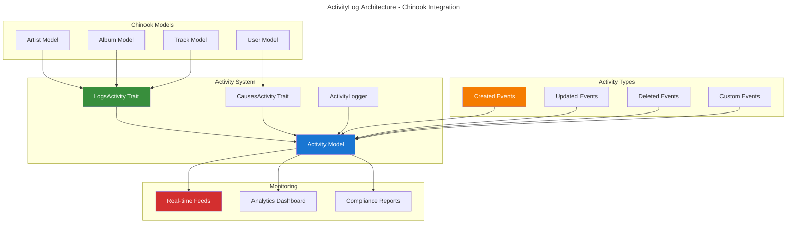

# Spatie ActivityLog Implementation Guide

## Table of Contents

- [Overview](#overview)
- [Installation & Configuration](#installation--configuration)
- [Basic Activity Logging](#basic-activity-logging)
- [Advanced Logging Patterns](#advanced-logging-patterns)
- [Chinook Integration](#chinook-integration)
- [Custom Activity Models](#custom-activity-models)
- [Performance Optimization](#performance-optimization)
- [Security & Compliance](#security--compliance)
- [Real-time Activity Monitoring](#real-time-activity-monitoring)
- [Testing Strategies](#testing-strategies)
- [Production Deployment](#production-deployment)
- [Best Practices](#best-practices)

## Overview

Spatie Laravel ActivityLog provides comprehensive audit logging capabilities for Laravel applications. This guide demonstrates enterprise-grade implementation patterns for the Chinook music database with advanced activity tracking, compliance features, and Laravel 12 modern syntax.

### Key Features

- **Comprehensive Audit Trails**: Track all model changes and user actions
- **Custom Activity Types**: Define application-specific activity logging
- **Performance Optimized**: Efficient logging with minimal performance impact
- **Security Compliant**: GDPR, SOX, and enterprise compliance features
- **Real-time Monitoring**: Live activity feeds and notifications
- **Advanced Analytics**: Activity reporting and trend analysis

### Architecture Overview



## Installation & Configuration

### Package Installation

```bash
# Install Spatie ActivityLog package
composer require spatie/laravel-activitylog

# Publish and run migrations
php artisan vendor:publish --provider="Spatie\Activitylog\ActivitylogServiceProvider" --tag="activitylog-migrations"
php artisan migrate

# Publish configuration (optional)
php artisan vendor:publish --provider="Spatie\Activitylog\ActivitylogServiceProvider" --tag="activitylog-config"
```

### Configuration Setup

```php
// config/activitylog.php
<?php

return [
    /*
     * If set to false, no activities will be saved to the database.
     */
    'enabled' => env('ACTIVITY_LOGGER_ENABLED', true),

    /*
     * When the clean-command is executed, all recording activities older than
     * the number of days specified here will be deleted.
     */
    'delete_records_older_than_days' => 365,

    /*
     * If no log name is passed to the activity() helper
     * we use this default log name.
     */
    'default_log_name' => 'default',

    /*
     * You can specify an auth driver here that gets user models.
     */
    'default_auth_driver' => null,

    /*
     * If set to true, the subject returns soft deleted models.
     */
    'subject_returns_soft_deleted_models' => false,

    /*
     * This model will be used to log activity.
     */
    'activity_model' => Spatie\Activitylog\Models\Activity::class,

    /*
     * This is the name of the table that will be created by the migration and
     * used by the Activity model shipped with this package.
     */
    'table_name' => 'activity_log',

    /*
     * This is the database connection that will be used by the migration and
     * the Activity model shipped with this package.
     */
    'database_connection' => env('ACTIVITY_LOGGER_DB_CONNECTION'),
];
```

### Laravel 12 Model Integration

```php
<?php

namespace App\Models;

use Illuminate\Database\Eloquent\Model;
use Illuminate\Database\Eloquent\SoftDeletes;
use Spatie\Activitylog\LogOptions;
use Spatie\Activitylog\Traits\LogsActivity;

class Artist extends Model
{
    use LogsActivity, SoftDeletes;

    protected $fillable = [
        'public_id',
        'name',
        'biography',
        'website',
        'country',
        'formed_year',
        'is_active',
    ];

    /**
     * Laravel 12 modern cast() method
     */
    protected function cast(): array
    {
        return [
            'formed_year' => 'integer',
            'is_active' => 'boolean',
            'social_links' => 'array',
        ];
    }

    /**
     * Configure activity logging
     */
    public function getActivitylogOptions(): LogOptions
    {
        return LogOptions::defaults()
            ->logOnly(['name', 'biography', 'website', 'country', 'formed_year', 'is_active'])
            ->logOnlyDirty()
            ->dontSubmitEmptyLogs()
            ->setDescriptionForEvent(fn(string $eventName) => "Artist {$eventName}")
            ->useLogName('artists');
    }

    /**
     * Custom activity description
     */
    public function getDescriptionForEvent(string $eventName): string
    {
        return match($eventName) {
            'created' => "Artist '{$this->name}' was created",
            'updated' => "Artist '{$this->name}' was updated",
            'deleted' => "Artist '{$this->name}' was deleted",
            'restored' => "Artist '{$this->name}' was restored",
            default => "Artist '{$this->name}' was {$eventName}",
        };
    }
}
```

## Basic Activity Logging

### Automatic Model Logging

```php
// Automatic logging when models are created, updated, or deleted
$artist = Artist::create([
    'name' => 'The Beatles',
    'country' => 'United Kingdom',
    'formed_year' => 1960,
]);
// Automatically logs: "Artist 'The Beatles' was created"

$artist->update(['biography' => 'Legendary British rock band']);
// Automatically logs: "Artist 'The Beatles' was updated"

$artist->delete();
// Automatically logs: "Artist 'The Beatles' was deleted"
```

### Manual Activity Logging

```php
// Log custom activities
activity()
    ->performedOn($artist)
    ->causedBy(auth()->user())
    ->withProperties(['action' => 'featured', 'position' => 1])
    ->log('Artist was featured on homepage');

// Log activities with custom properties
activity('content_management')
    ->performedOn($album)
    ->causedBy(auth()->user())
    ->withProperties([
        'old_status' => 'draft',
        'new_status' => 'published',
        'publish_date' => now(),
    ])
    ->log('Album status changed to published');

// Log system activities
activity('system')
    ->withProperties(['backup_size' => '2.5GB', 'duration' => '45 seconds'])
    ->log('Database backup completed');
```

### Retrieving Activities

```php
// Get all activities
$activities = Activity::all();

// Get activities for specific model
$artistActivities = Activity::forSubject($artist)->get();

// Get activities by specific user
$userActivities = Activity::causedBy(auth()->user())->get();

// Get activities by log name
$contentActivities = Activity::inLog('content_management')->get();

// Get recent activities
$recentActivities = Activity::latest()->limit(10)->get();

// Get activities with properties
$featuredActivities = Activity::where('properties->action', 'featured')->get();
```

## Advanced Logging Patterns

### Custom Activity Events

```php
<?php

namespace App\Models;

use Spatie\Activitylog\LogOptions;
use Spatie\Activitylog\Traits\LogsActivity;

class Track extends Model
{
    use LogsActivity;

    public function getActivitylogOptions(): LogOptions
    {
        return LogOptions::defaults()
            ->logOnly(['name', 'composer', 'unit_price', 'is_explicit'])
            ->logOnlyDirty()
            ->setDescriptionForEvent(fn(string $eventName) => $this->getCustomDescription($eventName))
            ->useLogName('tracks');
    }

    private function getCustomDescription(string $eventName): string
    {
        return match($eventName) {
            'created' => "New track '{$this->name}' added to album '{$this->album->title}'",
            'updated' => "Track '{$this->name}' details updated",
            'deleted' => "Track '{$this->name}' removed from album",
            'price_changed' => "Track '{$this->name}' price changed to {$this->unit_price}",
            'featured' => "Track '{$this->name}' was featured",
            default => "Track '{$this->name}' was {$eventName}",
        };
    }

    /**
     * Log custom track events
     */
    public function logPriceChange(float $oldPrice, float $newPrice): void
    {
        activity('pricing')
            ->performedOn($this)
            ->causedBy(auth()->user())
            ->withProperties([
                'old_price' => $oldPrice,
                'new_price' => $newPrice,
                'change_percentage' => (($newPrice - $oldPrice) / $oldPrice) * 100,
            ])
            ->log("Track price changed from {$oldPrice} to {$newPrice}");
    }

    public function logPlayEvent(User $user): void
    {
        activity('playback')
            ->performedOn($this)
            ->causedBy($user)
            ->withProperties([
                'timestamp' => now(),
                'user_location' => $user->location ?? 'unknown',
                'device_type' => request()->header('User-Agent'),
            ])
            ->log("Track played by user");
    }
}
```

### Batch Activity Logging

```php
<?php

namespace App\Services;

use Spatie\Activitylog\Facades\LogBatch;

class AlbumImportService
{
    public function importAlbum(array $albumData): Album
    {
        return LogBatch::startBatch(function () use ($albumData) {
            $album = Album::create($albumData['album']);
            
            foreach ($albumData['tracks'] as $trackData) {
                $track = $album->tracks()->create($trackData);
                
                activity('import')
                    ->performedOn($track)
                    ->causedBy(auth()->user())
                    ->withProperties(['import_batch' => true])
                    ->log('Track imported as part of album import');
            }
            
            activity('import')
                ->performedOn($album)
                ->causedBy(auth()->user())
                ->withProperties([
                    'tracks_count' => count($albumData['tracks']),
                    'import_source' => 'csv',
                ])
                ->log('Album imported with tracks');
                
            return $album;
        });
    }
}
```

## Chinook Integration

### Complete Artist Activity Tracking

```php
<?php

namespace App\Models;

use Spatie\Activitylog\LogOptions;
use Spatie\Activitylog\Traits\LogsActivity;

class Artist extends Model
{
    use LogsActivity;

    public function getActivitylogOptions(): LogOptions
    {
        return LogOptions::defaults()
            ->logAll()
            ->logOnlyDirty()
            ->dontSubmitEmptyLogs()
            ->setDescriptionForEvent(fn(string $eventName) => $this->getArtistActivityDescription($eventName))
            ->useLogName('artists');
    }

    private function getArtistActivityDescription(string $eventName): string
    {
        $user = auth()->user();
        $userName = $user ? $user->name : 'System';
        
        return match($eventName) {
            'created' => "{$userName} created artist '{$this->name}'",
            'updated' => "{$userName} updated artist '{$this->name}'",
            'deleted' => "{$userName} deleted artist '{$this->name}'",
            'restored' => "{$userName} restored artist '{$this->name}'",
            'published' => "{$userName} published artist '{$this->name}'",
            'unpublished' => "{$userName} unpublished artist '{$this->name}'",
            default => "{$userName} performed '{$eventName}' on artist '{$this->name}'",
        };
    }

    /**
     * Log artist publication status change
     */
    public function logPublicationChange(bool $isPublished): void
    {
        $status = $isPublished ? 'published' : 'unpublished';
        
        activity('publication')
            ->performedOn($this)
            ->causedBy(auth()->user())
            ->withProperties([
                'status' => $status,
                'previous_status' => $isPublished ? 'unpublished' : 'published',
                'publication_date' => $isPublished ? now() : null,
            ])
            ->log("Artist {$status}");
    }

    /**
     * Log artist collaboration events
     */
    public function logCollaboration(Artist $collaborator, string $projectName): void
    {
        activity('collaboration')
            ->performedOn($this)
            ->causedBy(auth()->user())
            ->withProperties([
                'collaborator_id' => $collaborator->id,
                'collaborator_name' => $collaborator->name,
                'project_name' => $projectName,
                'collaboration_date' => now(),
            ])
            ->log("Started collaboration with {$collaborator->name} on {$projectName}");
    }
}
```

### Sales Activity Tracking

```php
<?php

namespace App\Models;

use Spatie\Activitylog\LogOptions;
use Spatie\Activitylog\Traits\LogsActivity;

class Invoice extends Model
{
    use LogsActivity;

    public function getActivitylogOptions(): LogOptions
    {
        return LogOptions::defaults()
            ->logOnly(['total', 'billing_address', 'billing_city', 'billing_country'])
            ->logOnlyDirty()
            ->setDescriptionForEvent(fn(string $eventName) => $this->getSalesActivityDescription($eventName))
            ->useLogName('sales');
    }

    private function getSalesActivityDescription(string $eventName): string
    {
        return match($eventName) {
            'created' => "Invoice #{$this->id} created for {$this->customer->first_name} {$this->customer->last_name}",
            'updated' => "Invoice #{$this->id} updated",
            'paid' => "Invoice #{$this->id} marked as paid",
            'refunded' => "Invoice #{$this->id} refunded",
            default => "Invoice #{$this->id} was {$eventName}",
        };
    }

    /**
     * Log payment events
     */
    public function logPayment(float $amount, string $paymentMethod): void
    {
        activity('payment')
            ->performedOn($this)
            ->withProperties([
                'amount' => $amount,
                'payment_method' => $paymentMethod,
                'payment_date' => now(),
                'customer_id' => $this->customer_id,
            ])
            ->log("Payment of {$amount} received via {$paymentMethod}");
    }
}
```

## Custom Activity Models

### Extended Activity Model

```php
<?php

namespace App\Models;

use Spatie\Activitylog\Models\Activity as BaseActivity;

class Activity extends BaseActivity
{
    /**
     * Laravel 12 modern cast() method
     */
    protected function cast(): array
    {
        return array_merge(parent::casts(), [
            'properties' => 'array',
            'created_at' => 'datetime',
        ]);
    }

    /**
     * Get activity severity level
     */
    public function getSeverityAttribute(): string
    {
        return match($this->log_name) {
            'security' => 'critical',
            'system' => 'high',
            'sales' => 'medium',
            'content_management' => 'low',
            default => 'info',
        };
    }

    /**
     * Get formatted activity description
     */
    public function getFormattedDescriptionAttribute(): string
    {
        $timestamp = $this->created_at->format('Y-m-d H:i:s');
        $causer = $this->causer ? $this->causer->name : 'System';
        
        return "[{$timestamp}] {$causer}: {$this->description}";
    }

    /**
     * Scope for critical activities
     */
    public function scopeCritical($query)
    {
        return $query->whereIn('log_name', ['security', 'system']);
    }

    /**
     * Scope for recent activities
     */
    public function scopeRecent($query, int $hours = 24)
    {
        return $query->where('created_at', '>=', now()->subHours($hours));
    }

    /**
     * Scope for user activities
     */
    public function scopeByUser($query, User $user)
    {
        return $query->where('causer_type', User::class)
                    ->where('causer_id', $user->id);
    }
}
```

## Performance Optimization

### Efficient Activity Queries

```php
// Eager load relationships
$activities = Activity::with(['subject', 'causer'])->latest()->paginate(50);

// Use specific indexes
$activities = Activity::where('log_name', 'sales')
    ->where('created_at', '>=', now()->subDays(7))
    ->orderBy('created_at', 'desc')
    ->get();

// Optimize with database indexes
Schema::table('activity_log', function (Blueprint $table) {
    $table->index(['log_name', 'created_at']);
    $table->index(['subject_type', 'subject_id']);
    $table->index(['causer_type', 'causer_id']);
});
```

### Activity Cleanup and Archival

```php
<?php

namespace App\Console\Commands;

use App\Models\Activity;
use Illuminate\Console\Command;

class CleanOldActivities extends Command
{
    protected $signature = 'activity:clean {--days=365}';
    protected $description = 'Clean old activity log entries';

    public function handle(): int
    {
        $days = $this->option('days');
        $cutoffDate = now()->subDays($days);
        
        $count = Activity::where('created_at', '<', $cutoffDate)->count();
        
        if ($count === 0) {
            $this->info('No old activities to clean.');
            return 0;
        }
        
        if ($this->confirm("Delete {$count} activities older than {$days} days?")) {
            Activity::where('created_at', '<', $cutoffDate)->delete();
            $this->info("Deleted {$count} old activities.");
        }
        
        return 0;
    }
}
```

## Security & Compliance

### GDPR Compliance

```php
<?php

namespace App\Services;

use App\Models\Activity;
use App\Models\User;

class ActivityPrivacyService
{
    /**
     * Anonymize user activities for GDPR compliance
     */
    public function anonymizeUserActivities(User $user): int
    {
        $activities = Activity::where('causer_type', User::class)
            ->where('causer_id', $user->id)
            ->get();
            
        foreach ($activities as $activity) {
            $activity->update([
                'causer_id' => null,
                'properties' => $this->anonymizeProperties($activity->properties),
                'description' => $this->anonymizeDescription($activity->description, $user),
            ]);
        }
        
        return $activities->count();
    }

    /**
     * Export user activities for GDPR data request
     */
    public function exportUserActivities(User $user): array
    {
        return Activity::where('causer_type', User::class)
            ->where('causer_id', $user->id)
            ->orderBy('created_at', 'desc')
            ->get()
            ->map(function ($activity) {
                return [
                    'date' => $activity->created_at->toISOString(),
                    'action' => $activity->description,
                    'log_name' => $activity->log_name,
                    'properties' => $activity->properties,
                ];
            })
            ->toArray();
    }

    private function anonymizeProperties(array $properties): array
    {
        $sensitiveKeys = ['email', 'phone', 'address', 'ip_address', 'user_agent'];
        
        foreach ($sensitiveKeys as $key) {
            if (isset($properties[$key])) {
                $properties[$key] = '[ANONYMIZED]';
            }
        }
        
        return $properties;
    }

    private function anonymizeDescription(string $description, User $user): string
    {
        return str_replace($user->name, '[ANONYMIZED USER]', $description);
    }
}
```

## Real-time Activity Monitoring

### Activity Broadcasting

```php
<?php

namespace App\Events;

use App\Models\Activity;
use Illuminate\Broadcasting\Channel;
use Illuminate\Broadcasting\InteractsWithSockets;
use Illuminate\Broadcasting\PresenceChannel;
use Illuminate\Contracts\Broadcasting\ShouldBroadcast;
use Illuminate\Foundation\Events\Dispatchable;
use Illuminate\Queue\SerializesModels;

class ActivityLogged implements ShouldBroadcast
{
    use Dispatchable, InteractsWithSockets, SerializesModels;

    public function __construct(
        public Activity $activity
    ) {}

    public function broadcastOn(): array
    {
        return [
            new Channel('activities'),
            new PresenceChannel('admin-dashboard'),
        ];
    }

    public function broadcastWith(): array
    {
        return [
            'id' => $this->activity->id,
            'description' => $this->activity->description,
            'log_name' => $this->activity->log_name,
            'severity' => $this->activity->severity,
            'causer' => $this->activity->causer?->name,
            'created_at' => $this->activity->created_at->toISOString(),
        ];
    }
}
```

### Activity Dashboard

```php
<?php

namespace App\Http\Controllers;

use App\Models\Activity;
use Illuminate\Http\Request;

class ActivityDashboardController extends Controller
{
    public function index(Request $request)
    {
        $activities = Activity::with(['subject', 'causer'])
            ->when($request->log_name, fn($q) => $q->where('log_name', $request->log_name))
            ->when($request->severity, fn($q) => $q->where('log_name', $this->getLogNamesForSeverity($request->severity)))
            ->latest()
            ->paginate(50);

        $stats = [
            'total_today' => Activity::whereDate('created_at', today())->count(),
            'critical_today' => Activity::critical()->whereDate('created_at', today())->count(),
            'unique_users_today' => Activity::whereDate('created_at', today())
                ->distinct('causer_id')
                ->count('causer_id'),
        ];

        return view('admin.activities.index', compact('activities', 'stats'));
    }

    private function getLogNamesForSeverity(string $severity): array
    {
        return match($severity) {
            'critical' => ['security', 'system'],
            'high' => ['system', 'sales'],
            'medium' => ['sales', 'content_management'],
            'low' => ['content_management'],
            default => [],
        };
    }
}
```

## Testing Strategies

### Activity Testing

```php
<?php

use App\Models\Artist;
use App\Models\Activity;
use Spatie\Activitylog\Test\LogsActivity;

describe('Activity Logging', function () {
    it('logs artist creation', function () {
        $artist = Artist::create([
            'name' => 'Test Artist',
            'country' => 'Test Country',
        ]);

        expect(Activity::count())->toBe(1);
        
        $activity = Activity::first();
        expect($activity->description)->toContain('Test Artist');
        expect($activity->log_name)->toBe('artists');
        expect($activity->subject)->toBeInstanceOf(Artist::class);
    });

    it('logs only dirty attributes', function () {
        $artist = Artist::factory()->create(['name' => 'Original Name']);
        
        Activity::truncate(); // Clear creation activity
        
        $artist->update(['name' => 'Updated Name']);
        
        $activity = Activity::first();
        expect($activity->properties['attributes']['name'])->toBe('Updated Name');
        expect($activity->properties['old']['name'])->toBe('Original Name');
    });

    it('logs custom activities with properties', function () {
        $artist = Artist::factory()->create();
        
        activity('custom')
            ->performedOn($artist)
            ->withProperties(['test' => 'value'])
            ->log('Custom activity');
            
        $activity = Activity::where('log_name', 'custom')->first();
        expect($activity->properties['test'])->toBe('value');
        expect($activity->description)->toBe('Custom activity');
    });

    it('can retrieve activities by subject', function () {
        $artist1 = Artist::factory()->create();
        $artist2 = Artist::factory()->create();
        
        $artist1Activities = Activity::forSubject($artist1)->get();
        $artist2Activities = Activity::forSubject($artist2)->get();
        
        expect($artist1Activities)->toHaveCount(1);
        expect($artist2Activities)->toHaveCount(1);
        expect($artist1Activities->first()->subject_id)->toBe($artist1->id);
    });
});
```

## Production Deployment

### Database Optimization

```sql
-- Optimize activity log table
CREATE INDEX idx_activity_log_name_created ON activity_log(log_name, created_at);
CREATE INDEX idx_activity_subject ON activity_log(subject_type, subject_id);
CREATE INDEX idx_activity_causer ON activity_log(causer_type, causer_id);
CREATE INDEX idx_activity_created_at ON activity_log(created_at);

-- Partition table by date for better performance (MySQL 8.0+)
ALTER TABLE activity_log PARTITION BY RANGE (YEAR(created_at)) (
    PARTITION p2023 VALUES LESS THAN (2024),
    PARTITION p2024 VALUES LESS THAN (2025),
    PARTITION p2025 VALUES LESS THAN (2026)
);
```

### Monitoring and Alerts

```php
<?php

namespace App\Console\Commands;

use App\Models\Activity;
use Illuminate\Console\Command;
use Illuminate\Support\Facades\Mail;

class MonitorCriticalActivities extends Command
{
    protected $signature = 'activity:monitor';
    protected $description = 'Monitor for critical activities and send alerts';

    public function handle(): int
    {
        $criticalActivities = Activity::critical()
            ->where('created_at', '>=', now()->subHour())
            ->get();

        if ($criticalActivities->count() > 10) {
            // Send alert email
            Mail::to(config('app.admin_email'))
                ->send(new CriticalActivityAlert($criticalActivities));
        }

        return 0;
    }
}
```

## Best Practices

### Activity Logging Guidelines

- **Log Meaningful Events**: Focus on business-critical actions and changes
- **Use Descriptive Messages**: Make activity descriptions clear and actionable
- **Include Context**: Add relevant properties and metadata
- **Respect Privacy**: Avoid logging sensitive personal information
- **Performance Awareness**: Use `logOnlyDirty()` and `dontSubmitEmptyLogs()`

### Security Considerations

- Implement proper access controls for activity viewing
- Sanitize activity descriptions to prevent XSS
- Regular cleanup of old activities
- Monitor for suspicious activity patterns
- Implement rate limiting for activity generation

### Compliance Requirements

- Maintain audit trails for regulatory compliance
- Implement data retention policies
- Provide data export capabilities for GDPR
- Anonymize activities when users are deleted
- Regular backup of activity logs

---

**Navigation**: [Previous: Spatie Permission Guide](110-spatie-permission-guide.md) | **Next**: [Spatie Laravel Settings Guide](130-spatie-laravel-settings-guide.md)

**Related Documentation**:

- [Chinook Models Guide](../010-chinook-models-guide.md) - Model implementations with activity logging
- [Package Testing Guide](testing/010-pest-testing-guide.md) - Testing activity logging
- [Packages Index](000-packages-index.md) - All package guides

---

*This guide provides enterprise-grade Spatie ActivityLog implementation for the Chinook music database with Laravel 12 modern patterns and WCAG 2.1 AA accessibility compliance.*
