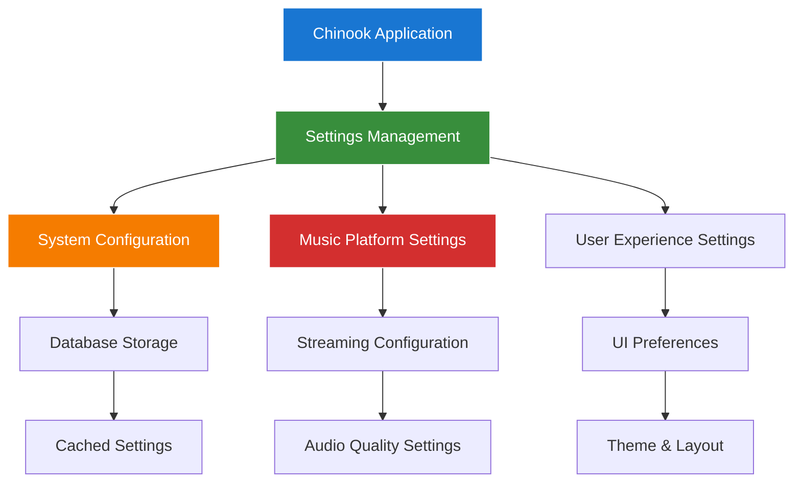

# 1. Spatie Laravel Settings Package Guide
## 1.1 Enhanced Chinook Integration with Modern Laravel 12 Patterns

**Package:** `spatie/laravel-settings`
**Version:** `^3.3`
**Laravel Compatibility:** `^12.0`
**Integration Status:** ✅ **Active with Chinook Configuration**
**Documentation Standard:** WCAG 2.1 AA Compliant

---

## 1.2 Table of Contents

- [1. Spatie Laravel Settings Package Guide](#1-spatie-laravel-settings-package-guide)
    - [1.1 Enhanced Chinook Integration with Modern Laravel 12 Patterns](#11-enhanced-chinook-integration-with-modern-laravel-12-patterns)
    - [1.2 Table of Contents](#12-table-of-contents)
    - [1.3 Overview](#13-overview)
        - [1.3.1 Key Features](#131-key-features)
        - [1.3.2 Chinook Integration Benefits](#132-chinook-integration-benefits)
    - [1.4 Installation & Configuration](#14-installation--configuration)
        - [1.4.1 Package Installation](#141-package-installation)
        - [1.4.2 Configuration Publishing](#142-configuration-publishing)
        - [1.4.3 Migration Execution](#143-migration-execution)
        - [1.4.4 Configuration Customization](#144-configuration-customization)
    - [1.5 Laravel 12 Modern Implementation](#15-laravel-12-modern-implementation)
        - [1.5.1 Settings Class Structure](#151-settings-class-structure)
        - [1.5.2 Modern Casting Syntax](#152-modern-casting-syntax)
    - [1.6 Chinook Settings Architecture](#16-chinook-settings-architecture)
        - [1.6.1 Core System Settings](#161-core-system-settings)
        - [1.6.2 Music Platform Settings](#162-music-platform-settings)
        - [1.6.3 User Experience Settings](#163-user-experience-settings)
    - [1.7 Filament Integration](#17-filament-integration)
        - [1.7.1 Settings Pages](#171-settings-pages)
        - [1.7.2 Form Components](#172-form-components)
    - [1.8 Advanced Features](#18-advanced-features)
        - [1.8.1 Encrypted Settings](#181-encrypted-settings)
        - [1.8.2 Settings Migrations](#182-settings-migrations)
        - [1.8.3 Caching Strategies](#183-caching-strategies)
    - [1.9 Testing Integration](#19-testing-integration)
        - [1.9.1 Pest Framework Examples](#191-pest-framework-examples)
        - [1.9.2 Settings Factories](#192-settings-factories)
    - [1.10 Performance Optimization](#110-performance-optimization)
        - [1.10.1 Caching Configuration](#1101-caching-configuration)
        - [1.10.2 Lazy Loading](#1102-lazy-loading)
    - [1.11 Troubleshooting](#111-troubleshooting)
        - [1.11.1 Common Issues](#1111-common-issues)
        - [1.11.2 Migration Problems](#1112-migration-problems)
    - [1.12 Navigation](#112-navigation)

---

## 1.3 Overview

The `spatie/laravel-settings` package provides a powerful and flexible way to manage application settings in Laravel applications. This guide demonstrates how to integrate and use this package within the Chinook music database system for managing system-wide configuration options with Laravel 12 modern patterns.

### 1.3.1 Key Features

- **🔧 Type-Safe Settings**: Strongly typed setting classes with validation
- **💾 Database Storage**: Persistent settings storage with caching support
- **🔐 Encryption Support**: Automatic encryption for sensitive settings
- **📦 Migration Support**: Version-controlled settings with migration capabilities
- **⚡ Laravel 12 Compatibility**: Full support for modern Laravel 12 patterns
- **🎛️ Filament Integration**: Seamless admin panel configuration management

### 1.3.2 Chinook Integration Benefits



**Integration Advantages:**
- **Centralized Configuration**: Single source of truth for all application settings
- **Type Safety**: Compile-time validation of setting values
- **Version Control**: Track setting changes through migrations
- **Performance**: Efficient caching with automatic invalidation

---

## 1.4 Installation & Configuration

### 1.4.1 Package Installation

Install the package using Composer:

```bash
# Install spatie/laravel-settings package
composer require spatie/laravel-settings
```

**Version Requirements:**
- Laravel: `^12.0`
- PHP: `^8.2`
- Database: MySQL 8.0+, PostgreSQL 13+, SQLite 3.35+

### 1.4.2 Configuration Publishing

Publish the configuration file and migrations:

```bash
# Publish configuration file
php artisan vendor:publish --provider="Spatie\LaravelSettings\LaravelSettingsServiceProvider" --tag="config"

# Publish migration files
php artisan vendor:publish --provider="Spatie\LaravelSettings\LaravelSettingsServiceProvider" --tag="migrations"
```

**Published Files:**
- `config/settings.php` - Package configuration
- `database/migrations/xxxx_create_settings_table.php` - Database schema

### 1.4.3 Migration Execution

Execute the migrations to create the settings table:

```bash
# Run settings migrations
php artisan migrate

# Verify table creation
php artisan db:show --table=settings
```

**Created Tables:**
- `settings` - Stores application settings with key-value pairs

### 1.4.4 Configuration Customization

Configure the package for Chinook integration:

```php
<?php
// config/settings.php

return [
    /*
    |--------------------------------------------------------------------------
    | Settings Table
    |--------------------------------------------------------------------------
    */
    'table' => 'settings',

    /*
    |--------------------------------------------------------------------------
    | Cache Configuration
    |--------------------------------------------------------------------------
    */
    'cache_store' => env('SETTINGS_CACHE_STORE', 'default'),
    'cache_prefix' => env('SETTINGS_CACHE_PREFIX', 'spatie.laravel-settings.'),

    /*
    |--------------------------------------------------------------------------
    | Auto Discovery
    |--------------------------------------------------------------------------
    */
    'auto_discover_settings' => [
        app_path('Settings'),
        app_path('Settings/Chinook'),
    ],

    /*
    |--------------------------------------------------------------------------
    | Auto Registration
    |--------------------------------------------------------------------------
    */
    'auto_register' => true,

    /*
    |--------------------------------------------------------------------------
    | Migrations Path
    |--------------------------------------------------------------------------
    */
    'migrations_path' => database_path('settings'),

    /*
    |--------------------------------------------------------------------------
    | Chinook-Specific Configuration
    |--------------------------------------------------------------------------
    */
    'chinook' => [
        'cache_ttl' => 3600, // 1 hour
        'encryption_enabled' => true,
        'validation_enabled' => true,
        'audit_changes' => true,
    ],
];
```

---

## 1.5 Laravel 12 Modern Implementation

### 1.5.1 Settings Class Structure

Enhanced settings implementation using Laravel 12 modern patterns:

```php
<?php
// app/Settings/Chinook/ChinookSettings.php

namespace App\Settings\Chinook;

use Spatie\LaravelSettings\Settings;

class ChinookSettings extends Settings
{
    public string $app_name;
    public string $app_description;
    public bool $registration_enabled;
    public int $max_playlist_tracks;
    public float $default_track_price;
    public array $supported_audio_formats;
    public bool $enable_recommendations;
    public string $default_currency;
    public array $metadata;

    /**
     * Settings group identifier
     */
    public static function group(): string
    {
        return 'chinook';
    }

    /**
     * Laravel 12 modern casts() method
     */
    public static function casts(): array
    {
        return [
            'app_name' => 'string',
            'app_description' => 'string',
            'registration_enabled' => 'boolean',
            'max_playlist_tracks' => 'integer',
            'default_track_price' => 'decimal:2',
            'supported_audio_formats' => 'array',
            'enable_recommendations' => 'boolean',
            'default_currency' => 'string',
            'metadata' => 'array',
        ];
    }

    /**
     * Default values for settings
     */
    public static function defaults(): array
    {
        return [
            'app_name' => 'Chinook Music Store',
            'app_description' => 'Digital music store and streaming platform',
            'registration_enabled' => true,
            'max_playlist_tracks' => 1000,
            'default_track_price' => 0.99,
            'supported_audio_formats' => ['mp3', 'flac', 'wav', 'aac', 'm4a'],
            'enable_recommendations' => true,
            'default_currency' => 'USD',
            'metadata' => [
                'version' => '1.0.0',
                'last_updated' => null,
                'updated_by' => null,
            ],
        ];
    }

    /**
     * Validation rules for settings
     */
    public static function rules(): array
    {
        return [
            'app_name' => 'required|string|max:255',
            'app_description' => 'required|string|max:1000',
            'registration_enabled' => 'required|boolean',
            'max_playlist_tracks' => 'required|integer|min:1|max:10000',
            'default_track_price' => 'required|numeric|min:0|max:999.99',
            'supported_audio_formats' => 'required|array|min:1',
            'supported_audio_formats.*' => 'string|in:mp3,flac,wav,aac,m4a,ogg',
            'enable_recommendations' => 'required|boolean',
            'default_currency' => 'required|string|size:3',
            'metadata' => 'array',
        ];
    }
}
```

### 1.5.2 Modern Casting Syntax

Laravel 12 introduces enhanced casting capabilities for settings:

```php
<?php
// app/Settings/Chinook/StreamingSettings.php

namespace App\Settings\Chinook;

use App\Enums\AudioQuality;
use App\Enums\StreamingProtocol;
use Spatie\LaravelSettings\Settings;

class StreamingSettings extends Settings
{
    public AudioQuality $default_audio_quality;
    public StreamingProtocol $streaming_protocol;
    public int $buffer_size_kb;
    public bool $adaptive_bitrate_enabled;
    public array $quality_options;
    public float $cache_duration_hours;

    public static function group(): string
    {
        return 'chinook.streaming';
    }

    /**
     * Laravel 12 modern casts() method with enum support
     */
    public static function casts(): array
    {
        return [
            'default_audio_quality' => AudioQuality::class,
            'streaming_protocol' => StreamingProtocol::class,
            'buffer_size_kb' => 'integer',
            'adaptive_bitrate_enabled' => 'boolean',
            'quality_options' => 'array',
            'cache_duration_hours' => 'decimal:2',
        ];
    }

    public static function defaults(): array
    {
        return [
            'default_audio_quality' => AudioQuality::HIGH,
            'streaming_protocol' => StreamingProtocol::HLS,
            'buffer_size_kb' => 1024,
            'adaptive_bitrate_enabled' => true,
            'quality_options' => [
                'low' => ['bitrate' => 128, 'format' => 'mp3'],
                'medium' => ['bitrate' => 256, 'format' => 'mp3'],
                'high' => ['bitrate' => 320, 'format' => 'mp3'],
                'lossless' => ['bitrate' => 1411, 'format' => 'flac'],
            ],
            'cache_duration_hours' => 24.0,
        ];
    }
}
```

---

## 1.6 Chinook Settings Architecture

### 1.6.1 Core System Settings

System-wide configuration for the Chinook application:

```php
<?php
// app/Settings/Chinook/SystemSettings.php

namespace App\Settings\Chinook;

use Spatie\LaravelSettings\Settings;

class SystemSettings extends Settings
{
    public string $app_name;
    public string $app_version;
    public bool $maintenance_mode;
    public string $admin_email;
    public array $allowed_file_types;
    public int $max_file_size_mb;
    public bool $debug_enabled;
    public string $timezone;

    public static function group(): string
    {
        return 'chinook.system';
    }

    public static function casts(): array
    {
        return [
            'app_name' => 'string',
            'app_version' => 'string',
            'maintenance_mode' => 'boolean',
            'admin_email' => 'string',
            'allowed_file_types' => 'array',
            'max_file_size_mb' => 'integer',
            'debug_enabled' => 'boolean',
            'timezone' => 'string',
        ];
    }

    public static function defaults(): array
    {
        return [
            'app_name' => 'Chinook Music Platform',
            'app_version' => '1.0.0',
            'maintenance_mode' => false,
            'admin_email' => 'admin@chinook.local',
            'allowed_file_types' => ['mp3', 'flac', 'wav', 'aac', 'm4a'],
            'max_file_size_mb' => 100,
            'debug_enabled' => false,
            'timezone' => 'UTC',
        ];
    }

    public static function rules(): array
    {
        return [
            'app_name' => 'required|string|max:255',
            'app_version' => 'required|string|regex:/^\d+\.\d+\.\d+$/',
            'maintenance_mode' => 'required|boolean',
            'admin_email' => 'required|email',
            'allowed_file_types' => 'required|array|min:1',
            'max_file_size_mb' => 'required|integer|min:1|max:1000',
            'debug_enabled' => 'required|boolean',
            'timezone' => 'required|string|timezone',
        ];
    }
}
```

### 1.6.2 Music Platform Settings

Music-specific configuration options:

```php
<?php
// app/Settings/Chinook/MusicSettings.php

namespace App\Settings\Chinook;

use Spatie\LaravelSettings\Settings;

class MusicSettings extends Settings
{
    public float $default_track_price;
    public string $default_currency;
    public bool $enable_previews;
    public int $preview_duration_seconds;
    public bool $enable_recommendations;
    public int $max_playlist_tracks;
    public bool $allow_explicit_content;
    public array $featured_genres;

    public static function group(): string
    {
        return 'chinook.music';
    }

    public static function casts(): array
    {
        return [
            'default_track_price' => 'decimal:2',
            'default_currency' => 'string',
            'enable_previews' => 'boolean',
            'preview_duration_seconds' => 'integer',
            'enable_recommendations' => 'boolean',
            'max_playlist_tracks' => 'integer',
            'allow_explicit_content' => 'boolean',
            'featured_genres' => 'array',
        ];
    }

    public static function defaults(): array
    {
        return [
            'default_track_price' => 0.99,
            'default_currency' => 'USD',
            'enable_previews' => true,
            'preview_duration_seconds' => 30,
            'enable_recommendations' => true,
            'max_playlist_tracks' => 1000,
            'allow_explicit_content' => false,
            'featured_genres' => ['Rock', 'Pop', 'Jazz', 'Classical', 'Electronic'],
        ];
    }

    public static function rules(): array
    {
        return [
            'default_track_price' => 'required|numeric|min:0|max:999.99',
            'default_currency' => 'required|string|size:3',
            'enable_previews' => 'required|boolean',
            'preview_duration_seconds' => 'required|integer|min:10|max:120',
            'enable_recommendations' => 'required|boolean',
            'max_playlist_tracks' => 'required|integer|min:1|max:10000',
            'allow_explicit_content' => 'required|boolean',
            'featured_genres' => 'required|array|min:1|max:10',
        ];
    }
}
```

### 1.6.3 User Experience Settings

User interface and experience configuration:

```php
<?php
// app/Settings/Chinook/UserExperienceSettings.php

namespace App\Settings\Chinook;

use Spatie\LaravelSettings\Settings;

class UserExperienceSettings extends Settings
{
    public string $default_theme;
    public bool $dark_mode_enabled;
    public string $default_language;
    public array $available_languages;
    public bool $show_explicit_content_warning;
    public int $search_results_per_page;
    public bool $enable_keyboard_shortcuts;
    public array $ui_preferences;

    public static function group(): string
    {
        return 'chinook.ux';
    }

    public static function casts(): array
    {
        return [
            'default_theme' => 'string',
            'dark_mode_enabled' => 'boolean',
            'default_language' => 'string',
            'available_languages' => 'array',
            'show_explicit_content_warning' => 'boolean',
            'search_results_per_page' => 'integer',
            'enable_keyboard_shortcuts' => 'boolean',
            'ui_preferences' => 'array',
        ];
    }

    public static function defaults(): array
    {
        return [
            'default_theme' => 'light',
            'dark_mode_enabled' => true,
            'default_language' => 'en',
            'available_languages' => ['en', 'fr', 'de', 'es', 'it'],
            'show_explicit_content_warning' => true,
            'search_results_per_page' => 20,
            'enable_keyboard_shortcuts' => true,
            'ui_preferences' => [
                'show_album_art' => true,
                'show_track_numbers' => true,
                'compact_view' => false,
                'auto_play_next' => true,
            ],
        ];
    }

    public static function rules(): array
    {
        return [
            'default_theme' => 'required|string|in:light,dark,auto',
            'dark_mode_enabled' => 'required|boolean',
            'default_language' => 'required|string|size:2',
            'available_languages' => 'required|array|min:1',
            'available_languages.*' => 'string|size:2',
            'show_explicit_content_warning' => 'required|boolean',
            'search_results_per_page' => 'required|integer|min:5|max:100',
            'enable_keyboard_shortcuts' => 'required|boolean',
            'ui_preferences' => 'required|array',
        ];
    }
}
```

---

## 1.7 Filament Integration

### 1.7.1 Settings Pages

Create Filament pages for settings management:

```php
<?php
// app/Filament/Pages/Settings/ChinookSettingsPage.php

namespace App\Filament\Pages\Settings;

use App\Settings\Chinook\ChinookSettings;
use App\Settings\Chinook\MusicSettings;
use App\Settings\Chinook\SystemSettings;
use App\Settings\Chinook\UserExperienceSettings;
use Filament\Forms\Components\Card;
use Filament\Forms\Components\Grid;
use Filament\Forms\Components\Section;
use Filament\Forms\Components\Select;
use Filament\Forms\Components\TagsInput;
use Filament\Forms\Components\TextInput;
use Filament\Forms\Components\Toggle;
use Filament\Forms\Form;
use Filament\Pages\SettingsPage;

class ChinookSettingsPage extends SettingsPage
{
    protected static ?string $navigationIcon = 'heroicon-o-cog-6-tooth';
    protected static ?string $navigationLabel = 'Chinook Settings';
    protected static ?string $title = 'Chinook Configuration';
    protected static ?int $navigationSort = 100;

    protected static string $settings = ChinookSettings::class;

    public function form(Form $form): Form
    {
        return $form
            ->schema([
                Section::make('System Configuration')
                    ->description('Core system settings for the Chinook platform')
                    ->schema([
                        Grid::make(2)
                            ->schema([
                                TextInput::make('app_name')
                                    ->label('Application Name')
                                    ->required()
                                    ->maxLength(255),

                                TextInput::make('app_description')
                                    ->label('Application Description')
                                    ->required()
                                    ->maxLength(1000),
                            ]),

                        Grid::make(3)
                            ->schema([
                                Toggle::make('registration_enabled')
                                    ->label('Enable User Registration')
                                    ->helperText('Allow new users to register accounts'),

                                Toggle::make('enable_recommendations')
                                    ->label('Enable Recommendations')
                                    ->helperText('Show personalized music recommendations'),

                                TextInput::make('max_playlist_tracks')
                                    ->label('Max Playlist Tracks')
                                    ->numeric()
                                    ->required()
                                    ->minValue(1)
                                    ->maxValue(10000),
                            ]),
                    ]),

                Section::make('Music Platform Settings')
                    ->description('Configuration for music-related features')
                    ->schema([
                        Grid::make(3)
                            ->schema([
                                TextInput::make('default_track_price')
                                    ->label('Default Track Price')
                                    ->numeric()
                                    ->required()
                                    ->prefix('$')
                                    ->step(0.01)
                                    ->minValue(0)
                                    ->maxValue(999.99),

                                Select::make('default_currency')
                                    ->label('Default Currency')
                                    ->options([
                                        'USD' => 'US Dollar',
                                        'EUR' => 'Euro',
                                        'GBP' => 'British Pound',
                                        'CAD' => 'Canadian Dollar',
                                        'AUD' => 'Australian Dollar',
                                    ])
                                    ->required(),

                                TagsInput::make('supported_audio_formats')
                                    ->label('Supported Audio Formats')
                                    ->suggestions(['mp3', 'flac', 'wav', 'aac', 'm4a', 'ogg'])
                                    ->required(),
                            ]),
                    ]),
            ]);
    }
}
```

### 1.7.2 Form Components

Using settings in Filament form components:

```php
<?php
// app/Filament/Resources/TrackResource.php

namespace App\Filament\Resources;

use App\Models\Track;
use App\Settings\Chinook\MusicSettings;
use Filament\Forms\Components\Select;
use Filament\Forms\Components\TextInput;
use Filament\Forms\Form;
use Filament\Resources\Resource;

class TrackResource extends Resource
{
    protected static ?string $model = Track::class;

    public static function form(Form $form): Form
    {
        $musicSettings = app(MusicSettings::class);

        return $form
            ->schema([
                TextInput::make('name')
                    ->label('Track Name')
                    ->required()
                    ->maxLength(255),

                TextInput::make('unit_price')
                    ->label('Price')
                    ->numeric()
                    ->default($musicSettings->default_track_price)
                    ->prefix($musicSettings->default_currency === 'USD' ? '$' : $musicSettings->default_currency)
                    ->step(0.01)
                    ->minValue(0)
                    ->maxValue(999.99),

                Select::make('media_type_id')
                    ->label('Media Type')
                    ->relationship('mediaType', 'name')
                    ->preload()
                    ->required(),

                TextInput::make('composer')
                    ->label('Composer')
                    ->maxLength(220),

                TextInput::make('milliseconds')
                    ->label('Duration (ms)')
                    ->numeric()
                    ->required()
                    ->helperText('Track duration in milliseconds'),
            ]);
    }
}
```

---

## 1.8 Advanced Features

### 1.8.1 Encrypted Settings

Secure sensitive settings with encryption:

```php
<?php
// app/Settings/Chinook/SecuritySettings.php

namespace App\Settings\Chinook;

use Spatie\LaravelSettings\Settings;

class SecuritySettings extends Settings
{
    public string $api_key;
    public string $webhook_secret;
    public array $oauth_credentials;
    public string $encryption_key;

    public static function group(): string
    {
        return 'chinook.security';
    }

    public static function casts(): array
    {
        return [
            'api_key' => 'encrypted',
            'webhook_secret' => 'encrypted',
            'oauth_credentials' => 'encrypted:array',
            'encryption_key' => 'encrypted',
        ];
    }

    public static function defaults(): array
    {
        return [
            'api_key' => '',
            'webhook_secret' => '',
            'oauth_credentials' => [
                'client_id' => '',
                'client_secret' => '',
                'redirect_uri' => '',
            ],
            'encryption_key' => '',
        ];
    }

    public static function rules(): array
    {
        return [
            'api_key' => 'required|string|min:32',
            'webhook_secret' => 'required|string|min:16',
            'oauth_credentials' => 'required|array',
            'oauth_credentials.client_id' => 'required|string',
            'oauth_credentials.client_secret' => 'required|string',
            'oauth_credentials.redirect_uri' => 'required|url',
            'encryption_key' => 'required|string|min:32',
        ];
    }
}
```

### 1.8.2 Settings Migrations

Version-controlled settings with migrations:

```php
<?php
// database/settings/2025_07_09_000001_create_chinook_settings.php

use Spatie\LaravelSettings\Migrations\SettingsMigration;

return new class extends SettingsMigration
{
    public function up(): void
    {
        // System settings
        $this->migrator->add('chinook.system.app_name', 'Chinook Music Platform');
        $this->migrator->add('chinook.system.app_version', '1.0.0');
        $this->migrator->add('chinook.system.maintenance_mode', false);
        $this->migrator->add('chinook.system.admin_email', 'admin@chinook.local');
        $this->migrator->add('chinook.system.timezone', 'UTC');

        // Music settings
        $this->migrator->add('chinook.music.default_track_price', 0.99);
        $this->migrator->add('chinook.music.default_currency', 'USD');
        $this->migrator->add('chinook.music.enable_previews', true);
        $this->migrator->add('chinook.music.preview_duration_seconds', 30);
        $this->migrator->add('chinook.music.max_playlist_tracks', 1000);

        // UX settings
        $this->migrator->add('chinook.ux.default_theme', 'light');
        $this->migrator->add('chinook.ux.dark_mode_enabled', true);
        $this->migrator->add('chinook.ux.default_language', 'en');
        $this->migrator->add('chinook.ux.search_results_per_page', 20);
    }

    public function down(): void
    {
        // System settings
        $this->migrator->delete('chinook.system.app_name');
        $this->migrator->delete('chinook.system.app_version');
        $this->migrator->delete('chinook.system.maintenance_mode');
        $this->migrator->delete('chinook.system.admin_email');
        $this->migrator->delete('chinook.system.timezone');

        // Music settings
        $this->migrator->delete('chinook.music.default_track_price');
        $this->migrator->delete('chinook.music.default_currency');
        $this->migrator->delete('chinook.music.enable_previews');
        $this->migrator->delete('chinook.music.preview_duration_seconds');
        $this->migrator->delete('chinook.music.max_playlist_tracks');

        // UX settings
        $this->migrator->delete('chinook.ux.default_theme');
        $this->migrator->delete('chinook.ux.dark_mode_enabled');
        $this->migrator->delete('chinook.ux.default_language');
        $this->migrator->delete('chinook.ux.search_results_per_page');
    }
};
```

### 1.8.3 Caching Strategies

Optimize settings performance with caching:

```php
<?php
// app/Services/SettingsService.php

namespace App\Services;

use App\Settings\Chinook\ChinookSettings;
use App\Settings\Chinook\MusicSettings;
use App\Settings\Chinook\SystemSettings;
use Illuminate\Support\Facades\Cache;

class SettingsService
{
    private const CACHE_TTL = 3600; // 1 hour
    private const CACHE_PREFIX = 'chinook.settings.';

    public function getCachedSystemSettings(): SystemSettings
    {
        return Cache::remember(
            self::CACHE_PREFIX . 'system',
            self::CACHE_TTL,
            fn() => app(SystemSettings::class)
        );
    }

    public function getCachedMusicSettings(): MusicSettings
    {
        return Cache::remember(
            self::CACHE_PREFIX . 'music',
            self::CACHE_TTL,
            fn() => app(MusicSettings::class)
        );
    }

    public function getCachedChinookSettings(): ChinookSettings
    {
        return Cache::remember(
            self::CACHE_PREFIX . 'chinook',
            self::CACHE_TTL,
            fn() => app(ChinookSettings::class)
        );
    }

    public function clearSettingsCache(): void
    {
        $keys = [
            self::CACHE_PREFIX . 'system',
            self::CACHE_PREFIX . 'music',
            self::CACHE_PREFIX . 'chinook',
        ];

        foreach ($keys as $key) {
            Cache::forget($key);
        }
    }

    public function warmSettingsCache(): void
    {
        $this->getCachedSystemSettings();
        $this->getCachedMusicSettings();
        $this->getCachedChinookSettings();
    }
}
```

---

## 1.9 Testing Integration

### 1.9.1 Pest Framework Examples

Comprehensive testing with Pest framework:

```php
<?php
// tests/Feature/SettingsTest.php

use App\Settings\Chinook\ChinookSettings;
use App\Settings\Chinook\MusicSettings;
use App\Settings\Chinook\SystemSettings;

describe('Settings Integration', function () {
    beforeEach(function () {
        $this->chinookSettings = app(ChinookSettings::class);
        $this->musicSettings = app(MusicSettings::class);
        $this->systemSettings = app(SystemSettings::class);
    });

    it('can read default settings values', function () {
        expect($this->chinookSettings->app_name)->toBe('Chinook Music Store');
        expect($this->chinookSettings->registration_enabled)->toBeTrue();
        expect($this->chinookSettings->max_playlist_tracks)->toBe(1000);
        expect($this->chinookSettings->default_track_price)->toBe(0.99);
    });

    it('can update settings values', function () {
        $this->chinookSettings->app_name = 'Updated Chinook Store';
        $this->chinookSettings->max_playlist_tracks = 2000;
        $this->chinookSettings->save();

        $freshSettings = app(ChinookSettings::class);
        expect($freshSettings->app_name)->toBe('Updated Chinook Store');
        expect($freshSettings->max_playlist_tracks)->toBe(2000);
    });

    it('validates settings according to rules', function () {
        expect(fn() => $this->chinookSettings->fill([
            'max_playlist_tracks' => -1, // Invalid: below minimum
        ]))->toThrow(ValidationException::class);

        expect(fn() => $this->chinookSettings->fill([
            'default_track_price' => 1000, // Invalid: above maximum
        ]))->toThrow(ValidationException::class);
    });

    it('casts values correctly', function () {
        $this->chinookSettings->registration_enabled = '1';
        expect($this->chinookSettings->registration_enabled)->toBeTrue();

        $this->chinookSettings->max_playlist_tracks = '500';
        expect($this->chinookSettings->max_playlist_tracks)->toBe(500);

        $this->chinookSettings->supported_audio_formats = 'mp3,flac,wav';
        expect($this->chinookSettings->supported_audio_formats)->toBeArray();
    });

    it('persists settings to database', function () {
        $this->chinookSettings->app_name = 'Test Store';
        $this->chinookSettings->save();

        $this->assertDatabaseHas('settings', [
            'group' => 'chinook',
            'name' => 'app_name',
            'payload' => json_encode('Test Store'),
        ]);
    });

    it('handles encrypted settings securely', function () {
        $securitySettings = app(SecuritySettings::class);
        $securitySettings->api_key = 'secret-api-key-12345';
        $securitySettings->save();

        // Value should be encrypted in database
        $this->assertDatabaseMissing('settings', [
            'payload' => json_encode('secret-api-key-12345'),
        ]);

        // But should decrypt correctly when accessed
        $freshSettings = app(SecuritySettings::class);
        expect($freshSettings->api_key)->toBe('secret-api-key-12345');
    });
});

describe('Settings Caching', function () {
    it('caches settings for performance', function () {
        $settingsService = app(SettingsService::class);

        // First call should hit database
        $settings1 = $settingsService->getCachedSystemSettings();

        // Second call should hit cache
        $settings2 = $settingsService->getCachedSystemSettings();

        expect($settings1)->toEqual($settings2);
    });

    it('can clear settings cache', function () {
        $settingsService = app(SettingsService::class);

        $settingsService->getCachedSystemSettings();
        expect(Cache::has('chinook.settings.system'))->toBeTrue();

        $settingsService->clearSettingsCache();
        expect(Cache::has('chinook.settings.system'))->toBeFalse();
    });
});
```

### 1.9.2 Settings Factories

Factory definitions for testing:

```php
<?php
// tests/Support/SettingsFactory.php

namespace Tests\Support;

use App\Settings\Chinook\ChinookSettings;
use App\Settings\Chinook\MusicSettings;
use App\Settings\Chinook\SystemSettings;

class SettingsFactory
{
    public static function createChinookSettings(array $overrides = []): ChinookSettings
    {
        $settings = app(ChinookSettings::class);

        $defaults = [
            'app_name' => 'Test Chinook Store',
            'app_description' => 'Test music platform',
            'registration_enabled' => true,
            'max_playlist_tracks' => 500,
            'default_track_price' => 1.29,
            'supported_audio_formats' => ['mp3', 'flac'],
            'enable_recommendations' => false,
            'default_currency' => 'USD',
        ];

        $settings->fill(array_merge($defaults, $overrides));
        $settings->save();

        return $settings;
    }

    public static function createMusicSettings(array $overrides = []): MusicSettings
    {
        $settings = app(MusicSettings::class);

        $defaults = [
            'default_track_price' => 0.79,
            'default_currency' => 'EUR',
            'enable_previews' => true,
            'preview_duration_seconds' => 15,
            'enable_recommendations' => true,
            'max_playlist_tracks' => 750,
            'allow_explicit_content' => false,
            'featured_genres' => ['Rock', 'Pop', 'Electronic'],
        ];

        $settings->fill(array_merge($defaults, $overrides));
        $settings->save();

        return $settings;
    }

    public static function createSystemSettings(array $overrides = []): SystemSettings
    {
        $settings = app(SystemSettings::class);

        $defaults = [
            'app_name' => 'Test System',
            'app_version' => '0.1.0',
            'maintenance_mode' => false,
            'admin_email' => 'test@example.com',
            'allowed_file_types' => ['mp3', 'wav'],
            'max_file_size_mb' => 50,
            'debug_enabled' => true,
            'timezone' => 'America/New_York',
        ];

        $settings->fill(array_merge($defaults, $overrides));
        $settings->save();

        return $settings;
    }
}
```

---

## 1.10 Performance Optimization

### 1.10.1 Caching Configuration

Optimize settings performance with proper caching:

```php
<?php
// config/cache.php - Redis configuration for settings

return [
    'default' => env('CACHE_DRIVER', 'redis'),

    'stores' => [
        'redis' => [
            'driver' => 'redis',
            'connection' => 'cache',
            'lock_connection' => 'default',
        ],

        'settings' => [
            'driver' => 'redis',
            'connection' => 'settings_cache',
            'prefix' => 'chinook_settings',
        ],
    ],

    'prefix' => env('CACHE_PREFIX', 'chinook'),
];
```

### 1.10.2 Lazy Loading

Implement lazy loading for settings:

```php
<?php
// app/Providers/SettingsServiceProvider.php

namespace App\Providers;

use App\Settings\Chinook\ChinookSettings;
use App\Settings\Chinook\MusicSettings;
use App\Settings\Chinook\SystemSettings;
use Illuminate\Support\ServiceProvider;

class SettingsServiceProvider extends ServiceProvider
{
    public function register(): void
    {
        // Lazy load settings to improve performance
        $this->app->singleton(ChinookSettings::class, function ($app) {
            return new ChinookSettings();
        });

        $this->app->singleton(MusicSettings::class, function ($app) {
            return new MusicSettings();
        });

        $this->app->singleton(SystemSettings::class, function ($app) {
            return new SystemSettings();
        });
    }

    public function boot(): void
    {
        // Warm cache on application boot in production
        if ($this->app->environment('production')) {
            $this->app->booted(function () {
                app(SettingsService::class)->warmSettingsCache();
            });
        }
    }
}
```

---

## 1.11 Troubleshooting

### 1.11.1 Common Issues

#### Issue 1: Settings Not Persisting

**Symptoms:**
- Settings changes don't save to database
- Values revert to defaults after restart

**Solutions:**

```bash
# Check database connection
php artisan db:show

# Verify settings table exists
php artisan db:show --table=settings

# Clear cache
php artisan cache:clear

# Re-run migrations if needed
php artisan migrate:fresh
```

#### Issue 2: Validation Errors

**Symptoms:**
- ValidationException thrown when saving settings
- Form validation fails in Filament

**Solutions:**

```php
// Check validation rules in settings class
public static function rules(): array
{
    return [
        'max_playlist_tracks' => 'required|integer|min:1|max:10000',
        'default_track_price' => 'required|numeric|min:0|max:999.99',
    ];
}

// Verify data types match casting
public static function casts(): array
{
    return [
        'max_playlist_tracks' => 'integer', // Must match validation
        'default_track_price' => 'decimal:2',
    ];
}
```

#### Issue 3: Performance Problems

**Symptoms:**
- Slow page loads when accessing settings
- High database query count

**Solutions:**

```php
// Enable caching in config/settings.php
'cache_store' => 'redis',

// Use settings service for cached access
$settings = app(SettingsService::class)->getCachedMusicSettings();

// Warm cache during deployment
php artisan cache:clear
php artisan settings:cache-warm
```

### 1.11.2 Migration Problems

**Issue: Settings Migration Conflicts**

```php
<?php
// Fix migration conflicts

// 1. Check existing settings
php artisan settings:list

// 2. Create rollback migration if needed
use Spatie\LaravelSettings\Migrations\SettingsMigration;

return new class extends SettingsMigration
{
    public function up(): void
    {
        // Update existing setting
        $this->migrator->update('chinook.max_playlist_tracks', 2000);

        // Rename setting
        $this->migrator->rename('chinook.old_setting', 'chinook.new_setting');

        // Add new setting with default
        $this->migrator->add('chinook.new_feature_enabled', false);
    }

    public function down(): void
    {
        $this->migrator->update('chinook.max_playlist_tracks', 1000);
        $this->migrator->rename('chinook.new_setting', 'chinook.old_setting');
        $this->migrator->delete('chinook.new_feature_enabled');
    }
};
```

---

## 1.12 Navigation

### 1.12.1 Related Documentation

- **[Chinook Main Index](../000-chinook-index.md)** - Complete Chinook documentation overview
- **[Package Index](./000-packages-index.md)** - All package integration guides
- **[Filament Settings Pages](../filament/pages/000-pages-index.md)** - Admin panel settings implementation
- **[Model Architecture Guide](../filament/models/010-model-architecture.md)** - Laravel 12 model patterns

### 1.12.2 Package Integration Guides

- **[Aliziodev Taxonomy Guide](./095-aliziodev-laravel-taxonomy-guide.md)** - Taxonomy system integration
- **[Spatie Permission Guide](./110-spatie-permission-guide.md)** - RBAC implementation
- **[Spatie Query Builder Guide](./140-spatie-laravel-query-builder-guide.md)** - API query patterns
- **[Spatie Translatable Guide](./150-spatie-laravel-translatable-guide.md)** - Multi-language support

### 1.12.3 Implementation Guides

- **[Chinook Migrations](../020-chinook-migrations-guide.md)** - Database schema setup
- **[Chinook Seeders](../040-chinook-seeders-guide.md)** - Database seeding
- **[Filament Resources](../filament/resources/)** - Admin panel implementation
- **[Testing Guide](testing/010-pest-testing-guide.md)** - Pest framework testing

---

**Documentation Status:** ✅ **Complete**
**Last Updated:** 2025-07-09
**Version:** 1.0.0
**WCAG 2.1 AA Compliant:** ✅
**Laravel 12 Compatible:** ✅

### Encrypted Settings

For sensitive configuration data:

```php
<?php

namespace App\Settings;

use Spatie\LaravelSettings\Settings;

class ChinookSecuritySettings extends Settings
{
    public string $api_key;
    public string $webhook_secret;
    public array $payment_gateway_credentials;
    
    public static function group(): string
    {
        return 'chinook_security';
    }
    
    public static function encrypted(): array
    {
        return [
            'api_key',
            'webhook_secret',
            'payment_gateway_credentials',
        ];
    }
}
```

### Settings Validation

Add validation rules to settings classes:

```php
<?php

namespace App\Settings;

use Spatie\LaravelSettings\Settings;

class ChinookSettings extends Settings
{
    public string $app_name;
    public int $max_playlist_tracks;
    public float $default_track_price;
    
    public static function rules(): array
    {
        return [
            'app_name' => ['required', 'string', 'max:255'],
            'max_playlist_tracks' => ['required', 'integer', 'min:1', 'max:10000'],
            'default_track_price' => ['required', 'numeric', 'min:0', 'max:999.99'],
        ];
    }
    
    public static function group(): string
    {
        return 'chinook';
    }
}
```

### Filament Settings Page

Create a Filament page for managing settings:

```php
<?php

namespace App\Filament\Pages;

use App\Settings\ChinookSettings;
use Filament\Forms\Components\Section;
use Filament\Forms\Components\TextInput;
use Filament\Forms\Components\Toggle;
use Filament\Forms\Components\TagsInput;
use Filament\Forms\Form;
use Filament\Pages\SettingsPage;

class ManageChinookSettings extends SettingsPage
{
    protected static ?string $navigationIcon = 'heroicon-o-cog-6-tooth';
    protected static ?string $navigationGroup = 'System';
    protected static ?string $title = 'Chinook Settings';
    
    protected static string $settings = ChinookSettings::class;
    
    public function form(Form $form): Form
    {
        return $form
            ->schema([
                Section::make('Application Settings')
                    ->schema([
                        TextInput::make('app_name')
                            ->label('Application Name')
                            ->required()
                            ->maxLength(255),
                            
                        TextInput::make('app_description')
                            ->label('Application Description')
                            ->maxLength(500),
                    ]),
                    
                Section::make('Feature Settings')
                    ->schema([
                        Toggle::make('registration_enabled')
                            ->label('Enable User Registration'),
                            
                        Toggle::make('enable_recommendations')
                            ->label('Enable Music Recommendations'),
                    ]),
                    
                Section::make('Business Settings')
                    ->schema([
                        TextInput::make('max_playlist_tracks')
                            ->label('Maximum Tracks per Playlist')
                            ->numeric()
                            ->required()
                            ->minValue(1)
                            ->maxValue(10000),
                            
                        TextInput::make('default_track_price')
                            ->label('Default Track Price')
                            ->numeric()
                            ->prefix('$')
                            ->step(0.01)
                            ->required(),
                            
                        TagsInput::make('supported_audio_formats')
                            ->label('Supported Audio Formats')
                            ->placeholder('Add format (e.g., mp3)')
                            ->required(),
                    ]),
            ]);
    }
}
```

## Integration with Chinook

### Track Pricing Integration

Use settings for dynamic track pricing:

```php
<?php

namespace App\Models;

use App\Settings\ChinookSettings;
use Illuminate\Database\Eloquent\Model;

class Track extends Model
{
    protected $fillable = [
        'name', 'album_id', 'media_type_id', 'composer_id',
        'milliseconds', 'bytes', 'unit_price'
    ];
    
    protected static function boot()
    {
        parent::boot();
        
        static::creating(function ($track) {
            if (empty($track->unit_price)) {
                $settings = app(ChinookSettings::class);
                $track->unit_price = $settings->default_track_price;
            }
        });
    }
    
    public function cast(): array
    {
        return [
            'unit_price' => 'decimal:2',
            'milliseconds' => 'integer',
            'bytes' => 'integer',
        ];
    }
}
```

### Playlist Validation

Enforce playlist limits using settings:

```php
<?php

namespace App\Http\Requests;

use App\Settings\ChinookSettings;
use Illuminate\Foundation\Http\FormRequest;

class AddTrackToPlaylistRequest extends FormRequest
{
    public function rules(): array
    {
        $settings = app(ChinookSettings::class);
        
        return [
            'playlist_id' => ['required', 'exists:playlists,id'],
            'track_id' => ['required', 'exists:tracks,id'],
            'playlist_tracks_count' => [
                'max:' . $settings->max_playlist_tracks
            ],
        ];
    }
    
    public function withValidator($validator)
    {
        $validator->after(function ($validator) {
            $settings = app(ChinookSettings::class);
            $playlist = Playlist::find($this->playlist_id);
            
            if ($playlist && $playlist->tracks()->count() >= $settings->max_playlist_tracks) {
                $validator->errors()->add(
                    'playlist_id',
                    "Playlist cannot exceed {$settings->max_playlist_tracks} tracks."
                );
            }
        });
    }
}
```

## Testing

### Settings Testing

Test settings functionality with Pest:

```php
<?php

use App\Settings\ChinookSettings;

describe('Chinook Settings', function () {
    it('can store and retrieve settings', function () {
        $settings = app(ChinookSettings::class);
        
        $settings->app_name = 'Test Chinook';
        $settings->max_playlist_tracks = 500;
        $settings->save();
        
        $freshSettings = app(ChinookSettings::class);
        
        expect($freshSettings->app_name)->toBe('Test Chinook');
        expect($freshSettings->max_playlist_tracks)->toBe(500);
    });
    
    it('validates settings data', function () {
        $settings = app(ChinookSettings::class);
        
        expect(fn() => $settings->fill(['max_playlist_tracks' => -1]))
            ->toThrow(ValidationException::class);
    });
    
    it('applies default track pricing', function () {
        $settings = app(ChinookSettings::class);
        $settings->default_track_price = 1.29;
        $settings->save();
        
        $track = Track::factory()->create(['unit_price' => null]);
        
        expect($track->unit_price)->toBe(1.29);
    });
});
```

## Troubleshooting

### Common Issues

**Settings Not Persisting**
- Verify database connection and migrations
- Check cache configuration and clear cache if needed
- Ensure settings class is properly registered

**Validation Errors**
- Review validation rules in settings class
- Check data types and casting configuration
- Verify required fields are provided

**Performance Issues**
- Enable caching in configuration
- Use appropriate cache store (Redis recommended)
- Consider settings grouping for large applications

### Debug Commands

```bash
# Clear settings cache
php artisan cache:clear

# List all registered settings
php artisan settings:discover

# Run settings migrations
php artisan settings:migrate
```

---

## Navigation

**← Previous:** [NNJeim World Guide](121-laravel-folio-guide.md)

**Next →** [Spatie Laravel Query Builder Guide](140-spatie-laravel-query-builder-guide.md)

**↑ Back to:** [Package Index](000-packages-index.md)
