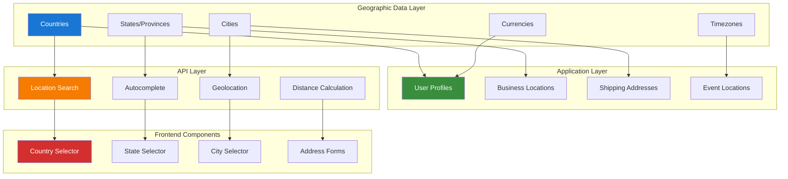

# NNJeim World Geographic Data Guide

## Table of Contents

- [Overview](#overview)
- [Installation & Configuration](#installation--configuration)
- [Geographic Data Installation](#geographic-data-installation)
- [Country, State & City Management](#country-state--city-management)
- [API Integration Patterns](#api-integration-patterns)
- [Frontend Components](#frontend-components)
- [Performance Optimization](#performance-optimization)
- [User Profile Integration](#user-profile-integration)
- [Business Logic Integration](#business-logic-integration)
- [Testing Strategies](#testing-strategies)
- [Production Deployment](#production-deployment)
- [Best Practices](#best-practices)

## Overview

NNJeim World provides comprehensive geographic data management for Laravel applications, including countries, states, cities, timezones, and currencies. This guide demonstrates how to implement location-based features with performance optimization and seamless user experience.

### Key Features

- **Complete Geographic Database**: 250+ countries, 5000+ states, 150,000+ cities
- **Multi-language Support**: Localized names and data
- **Timezone Management**: Accurate timezone data with DST support
- **Currency Integration**: Real-time currency data and conversion
- **Performance Optimized**: Efficient queries and caching strategies
- **API Ready**: RESTful endpoints for geographic data

### Architecture Overview



## Installation & Configuration

### Package Installation

```bash
# Install NNJeim World package
composer require nnjeim/world

# Publish configuration and migrations
php artisan vendor:publish --provider="Nnjeim\World\WorldServiceProvider"

# Run migrations to create geographic tables
php artisan migrate

# Seed geographic data (this may take several minutes)
php artisan world:install
```

### Configuration Setup

```php
<?php

// config/world.php
return [
    /*
     * The default language for geographic data
     */
    'default_language' => 'en',

    /*
     * Supported languages for geographic data
     */
    'supported_languages' => ['en', 'es', 'fr', 'de', 'it', 'pt', 'ru', 'zh'],

    /*
     * Cache settings for geographic data
     */
    'cache' => [
        'enabled' => env('WORLD_CACHE_ENABLED', true),
        'ttl' => env('WORLD_CACHE_TTL', 86400), // 24 hours
        'prefix' => 'world_',
    ],

    /*
     * API settings
     */
    'api' => [
        'enabled' => env('WORLD_API_ENABLED', true),
        'prefix' => 'api/world',
        'middleware' => ['api', 'throttle:60,1'],
        'rate_limit' => 60, // requests per minute
    ],

    /*
     * Search settings
     */
    'search' => [
        'min_length' => 2,
        'max_results' => 50,
        'fuzzy_search' => true,
    ],

    /*
     * Performance settings
     */
    'performance' => [
        'eager_load_relations' => true,
        'use_database_indexes' => true,
        'optimize_queries' => true,
    ],
];
```

## Geographic Data Installation

### Data Seeding Process

```bash
# Install all geographic data
php artisan world:install

# Install specific data types
php artisan world:install --countries
php artisan world:install --states
php artisan world:install --cities

# Install data for specific regions
php artisan world:install --countries=US,CA,MX
php artisan world:install --states --countries=US

# Update existing data
php artisan world:update

# Install with specific language
php artisan world:install --language=es
```

### Custom Data Management

```php
<?php

namespace App\Console\Commands;

use Illuminate\Console\Command;
use Nnjeim\World\Models\Country;
use Nnjeim\World\Models\State;
use Nnjeim\World\Models\City;

class CustomGeographicDataCommand extends Command
{
    protected $signature = 'world:custom-install';
    protected $description = 'Install custom geographic data for business needs';

    public function handle(): int
    {
        $this->info('Installing custom geographic data...');
        
        // Add custom countries if needed
        $this->addCustomCountries();
        
        // Add custom states/provinces
        $this->addCustomStates();
        
        // Add custom cities
        $this->addCustomCities();
        
        $this->info('Custom geographic data installation completed.');
        return 0;
    }

    private function addCustomCountries(): void
    {
        $customCountries = [
            [
                'name' => 'Custom Territory',
                'iso2' => 'CT',
                'iso3' => 'CTS',
                'numeric_code' => '999',
                'phone_code' => '+999',
                'capital' => 'Custom Capital',
                'currency' => 'CTC',
                'currency_name' => 'Custom Currency',
                'currency_symbol' => '¤',
                'tld' => '.ct',
                'native' => 'Custom Territory',
                'region' => 'Custom Region',
                'subregion' => 'Custom Subregion',
                'latitude' => '0.0000',
                'longitude' => '0.0000',
                'emoji' => '🏴',
                'emojiU' => 'U+1F3F4',
            ],
        ];

        foreach ($customCountries as $countryData) {
            Country::firstOrCreate(
                ['iso2' => $countryData['iso2']],
                $countryData
            );
        }
    }

    private function addCustomStates(): void
    {
        // Add custom states/provinces for specific business needs
        $customStates = [
            [
                'name' => 'Custom State',
                'country_id' => Country::where('iso2', 'CT')->first()?->id,
                'country_code' => 'CT',
                'fips_code' => 'CT01',
                'iso2' => 'CS',
                'type' => 'state',
                'latitude' => '0.0000',
                'longitude' => '0.0000',
            ],
        ];

        foreach ($customStates as $stateData) {
            if ($stateData['country_id']) {
                State::firstOrCreate(
                    [
                        'name' => $stateData['name'],
                        'country_id' => $stateData['country_id']
                    ],
                    $stateData
                );
            }
        }
    }

    private function addCustomCities(): void
    {
        // Add custom cities for business locations
        $customCities = [
            [
                'name' => 'Custom City',
                'state_id' => State::where('iso2', 'CS')->first()?->id,
                'country_id' => Country::where('iso2', 'CT')->first()?->id,
                'latitude' => '0.0000',
                'longitude' => '0.0000',
                'wikiDataId' => null,
            ],
        ];

        foreach ($customCities as $cityData) {
            if ($cityData['state_id'] && $cityData['country_id']) {
                City::firstOrCreate(
                    [
                        'name' => $cityData['name'],
                        'state_id' => $cityData['state_id']
                    ],
                    $cityData
                );
            }
        }
    }
}
```

## API Integration Patterns

### Geographic API Controller

```php
<?php

namespace App\Http\Controllers\Api;

use App\Http\Controllers\Controller;
use Illuminate\Http\Request;
use Illuminate\Http\JsonResponse;
use Nnjeim\World\Models\Country;
use Nnjeim\World\Models\State;
use Nnjeim\World\Models\City;
use Illuminate\Support\Facades\Cache;

class GeographicController extends Controller
{
    /**
     * Get all countries
     */
    public function countries(Request $request): JsonResponse
    {
        $cacheKey = 'countries_' . $request->get('lang', 'en');

        $countries = Cache::remember($cacheKey, 86400, function () use ($request) {
            return Country::select(['id', 'name', 'iso2', 'iso3', 'phone_code', 'emoji'])
                ->orderBy('name')
                ->get();
        });

        return response()->json([
            'data' => $countries,
            'meta' => [
                'total' => $countries->count(),
                'cached' => true,
            ],
        ]);
    }

    /**
     * Get states for a country
     */
    public function states(Request $request, int $countryId): JsonResponse
    {
        $request->validate([
            'search' => 'sometimes|string|min:2|max:50',
        ]);

        $cacheKey = "states_{$countryId}_" . md5($request->get('search', ''));

        $states = Cache::remember($cacheKey, 3600, function () use ($countryId, $request) {
            $query = State::where('country_id', $countryId)
                ->select(['id', 'name', 'iso2', 'type']);

            if ($search = $request->get('search')) {
                $query->where('name', 'like', "%{$search}%");
            }

            return $query->orderBy('name')->get();
        });

        return response()->json([
            'data' => $states,
            'meta' => [
                'total' => $states->count(),
                'country_id' => $countryId,
            ],
        ]);
    }

    /**
     * Get cities for a state
     */
    public function cities(Request $request, int $stateId): JsonResponse
    {
        $request->validate([
            'search' => 'sometimes|string|min:2|max:50',
            'limit' => 'sometimes|integer|min:1|max:100',
        ]);

        $limit = $request->get('limit', 50);
        $search = $request->get('search');

        $cacheKey = "cities_{$stateId}_" . md5($search . $limit);

        $cities = Cache::remember($cacheKey, 1800, function () use ($stateId, $search, $limit) {
            $query = City::where('state_id', $stateId)
                ->select(['id', 'name', 'latitude', 'longitude']);

            if ($search) {
                $query->where('name', 'like', "%{$search}%");
            }

            return $query->orderBy('name')
                ->limit($limit)
                ->get();
        });

        return response()->json([
            'data' => $cities,
            'meta' => [
                'total' => $cities->count(),
                'state_id' => $stateId,
                'limit' => $limit,
            ],
        ]);
    }

    /**
     * Search locations globally
     */
    public function search(Request $request): JsonResponse
    {
        $request->validate([
            'q' => 'required|string|min:2|max:100',
            'type' => 'sometimes|in:country,state,city,all',
            'limit' => 'sometimes|integer|min:1|max:50',
        ]);

        $query = $request->get('q');
        $type = $request->get('type', 'all');
        $limit = $request->get('limit', 20);

        $cacheKey = "location_search_" . md5($query . $type . $limit);

        $results = Cache::remember($cacheKey, 900, function () use ($query, $type, $limit) {
            $results = [];

            if ($type === 'all' || $type === 'country') {
                $countries = Country::where('name', 'like', "%{$query}%")
                    ->select(['id', 'name', 'iso2', 'emoji'])
                    ->limit($limit)
                    ->get()
                    ->map(fn($country) => [
                        'id' => $country->id,
                        'name' => $country->name,
                        'type' => 'country',
                        'code' => $country->iso2,
                        'emoji' => $country->emoji,
                    ]);

                $results['countries'] = $countries;
            }

            if ($type === 'all' || $type === 'state') {
                $states = State::where('name', 'like', "%{$query}%")
                    ->with('country:id,name,iso2')
                    ->select(['id', 'name', 'country_id', 'iso2'])
                    ->limit($limit)
                    ->get()
                    ->map(fn($state) => [
                        'id' => $state->id,
                        'name' => $state->name,
                        'type' => 'state',
                        'country' => $state->country->name,
                        'country_code' => $state->country->iso2,
                    ]);

                $results['states'] = $states;
            }

            if ($type === 'all' || $type === 'city') {
                $cities = City::where('name', 'like', "%{$query}%")
                    ->with(['state:id,name', 'country:id,name,iso2'])
                    ->select(['id', 'name', 'state_id', 'country_id', 'latitude', 'longitude'])
                    ->limit($limit)
                    ->get()
                    ->map(fn($city) => [
                        'id' => $city->id,
                        'name' => $city->name,
                        'type' => 'city',
                        'state' => $city->state->name,
                        'country' => $city->country->name,
                        'country_code' => $city->country->iso2,
                        'coordinates' => [
                            'lat' => $city->latitude,
                            'lng' => $city->longitude,
                        ],
                    ]);

                $results['cities'] = $cities;
            }

            return $results;
        });

        return response()->json([
            'data' => $results,
            'meta' => [
                'query' => $query,
                'type' => $type,
                'total_results' => collect($results)->sum(fn($items) => count($items)),
            ],
        ]);
    }
}
```

## Frontend Components

### Location Selector Livewire Component

```php
<?php

namespace App\Livewire;

use Livewire\Component;
use Livewire\Attributes\Validate;
use Nnjeim\World\Models\Country;
use Nnjeim\World\Models\State;
use Nnjeim\World\Models\City;

class LocationSelector extends Component
{
    #[Validate('required|exists:countries,id')]
    public ?int $selectedCountry = null;

    #[Validate('nullable|exists:states,id')]
    public ?int $selectedState = null;

    #[Validate('nullable|exists:cities,id')]
    public ?int $selectedCity = null;

    public array $countries = [];
    public array $states = [];
    public array $cities = [];

    public bool $showStates = false;
    public bool $showCities = false;
    public bool $isLoading = false;

    public function mount(?int $countryId = null, ?int $stateId = null, ?int $cityId = null): void
    {
        $this->loadCountries();

        if ($countryId) {
            $this->selectedCountry = $countryId;
            $this->loadStates();

            if ($stateId) {
                $this->selectedState = $stateId;
                $this->loadCities();

                if ($cityId) {
                    $this->selectedCity = $cityId;
                }
            }
        }
    }

    public function loadCountries(): void
    {
        $this->countries = Country::select(['id', 'name', 'emoji'])
            ->orderBy('name')
            ->get()
            ->toArray();
    }

    public function updatedSelectedCountry(): void
    {
        $this->selectedState = null;
        $this->selectedCity = null;
        $this->states = [];
        $this->cities = [];
        $this->showStates = false;
        $this->showCities = false;

        if ($this->selectedCountry) {
            $this->loadStates();
        }

        $this->dispatch('location-changed', [
            'country' => $this->selectedCountry,
            'state' => null,
            'city' => null,
        ]);
    }

    public function loadStates(): void
    {
        if (!$this->selectedCountry) {
            return;
        }

        $this->isLoading = true;

        $this->states = State::where('country_id', $this->selectedCountry)
            ->select(['id', 'name'])
            ->orderBy('name')
            ->get()
            ->toArray();

        $this->showStates = count($this->states) > 0;
        $this->isLoading = false;
    }

    public function updatedSelectedState(): void
    {
        $this->selectedCity = null;
        $this->cities = [];
        $this->showCities = false;

        if ($this->selectedState) {
            $this->loadCities();
        }

        $this->dispatch('location-changed', [
            'country' => $this->selectedCountry,
            'state' => $this->selectedState,
            'city' => null,
        ]);
    }

    public function loadCities(): void
    {
        if (!$this->selectedState) {
            return;
        }

        $this->isLoading = true;

        $this->cities = City::where('state_id', $this->selectedState)
            ->select(['id', 'name'])
            ->orderBy('name')
            ->limit(100) // Limit for performance
            ->get()
            ->toArray();

        $this->showCities = count($this->cities) > 0;
        $this->isLoading = false;
    }

    public function updatedSelectedCity(): void
    {
        $this->dispatch('location-changed', [
            'country' => $this->selectedCountry,
            'state' => $this->selectedState,
            'city' => $this->selectedCity,
        ]);
    }

    public function render()
    {
        return view('livewire.location-selector');
    }
}
```

### Location Selector Blade Template

```blade
{{-- resources/views/livewire/location-selector.blade.php --}}
<div class="location-selector space-y-4">
    {{-- Country Selection --}}
    <div class="form-group">
        <label for="country" class="block text-sm font-medium text-gray-700">
            Country *
        </label>
        <select
            wire:model.live="selectedCountry"
            id="country"
            class="mt-1 block w-full px-3 py-2 border border-gray-300 rounded-md shadow-sm focus:ring-blue-500 focus:border-blue-500"
            required
        >
            <option value="">Select a country...</option>
            @foreach($countries as $country)
                <option value="{{ $country['id'] }}">
                    {{ $country['emoji'] }} {{ $country['name'] }}
                </option>
            @endforeach
        </select>
        @error('selectedCountry')
            <p class="mt-1 text-sm text-red-600">{{ $message }}</p>
        @enderror
    </div>

    {{-- State Selection --}}
    @if($showStates)
        <div class="form-group">
            <label for="state" class="block text-sm font-medium text-gray-700">
                State/Province
            </label>
            <select
                wire:model.live="selectedState"
                id="state"
                class="mt-1 block w-full px-3 py-2 border border-gray-300 rounded-md shadow-sm focus:ring-blue-500 focus:border-blue-500"
                wire:loading.attr="disabled"
            >
                <option value="">Select a state/province...</option>
                @foreach($states as $state)
                    <option value="{{ $state['id'] }}">{{ $state['name'] }}</option>
                @endforeach
            </select>
            @error('selectedState')
                <p class="mt-1 text-sm text-red-600">{{ $message }}</p>
            @enderror
        </div>
    @endif

    {{-- City Selection --}}
    @if($showCities)
        <div class="form-group">
            <label for="city" class="block text-sm font-medium text-gray-700">
                City
            </label>
            <select
                wire:model.live="selectedCity"
                id="city"
                class="mt-1 block w-full px-3 py-2 border border-gray-300 rounded-md shadow-sm focus:ring-blue-500 focus:border-blue-500"
                wire:loading.attr="disabled"
            >
                <option value="">Select a city...</option>
                @foreach($cities as $city)
                    <option value="{{ $city['id'] }}">{{ $city['name'] }}</option>
                @endforeach
            </select>
            @error('selectedCity')
                <p class="mt-1 text-sm text-red-600">{{ $message }}</p>
            @enderror
        </div>
    @endif

    {{-- Loading Indicator --}}
    <div wire:loading.delay class="flex items-center text-sm text-gray-500">
        <svg class="animate-spin -ml-1 mr-2 h-4 w-4" xmlns="http://www.w3.org/2000/svg" fill="none" viewBox="0 0 24 24">
            <circle class="opacity-25" cx="12" cy="12" r="10" stroke="currentColor" stroke-width="4"></circle>
            <path class="opacity-75" fill="currentColor" d="M4 12a8 8 0 018-8V0C5.373 0 0 5.373 0 12h4zm2 5.291A7.962 7.962 0 014 12H0c0 3.042 1.135 5.824 3 7.938l3-2.647z"></path>
        </svg>
        Loading...
    </div>
</div>
```

## Performance Optimization

### Geographic Data Caching Service

```php
<?php

namespace App\Services;

use Illuminate\Support\Facades\Cache;
use Nnjeim\World\Models\Country;
use Nnjeim\World\Models\State;
use Nnjeim\World\Models\City;

class GeographicCacheService
{
    /**
     * Cache all countries
     */
    public function cacheCountries(string $language = 'en'): array
    {
        $cacheKey = "countries_{$language}";

        return Cache::remember($cacheKey, 86400, function () {
            return Country::select(['id', 'name', 'iso2', 'iso3', 'phone_code', 'emoji'])
                ->orderBy('name')
                ->get()
                ->toArray();
        });
    }

    /**
     * Cache states for a country
     */
    public function cacheStatesForCountry(int $countryId): array
    {
        $cacheKey = "states_country_{$countryId}";

        return Cache::remember($cacheKey, 3600, function () use ($countryId) {
            return State::where('country_id', $countryId)
                ->select(['id', 'name', 'iso2', 'type'])
                ->orderBy('name')
                ->get()
                ->toArray();
        });
    }

    /**
     * Cache popular cities globally
     */
    public function cachePopularCities(int $limit = 1000): array
    {
        $cacheKey = "popular_cities_{$limit}";

        return Cache::remember($cacheKey, 7200, function () use ($limit) {
            return City::with(['state:id,name', 'country:id,name,iso2'])
                ->select(['id', 'name', 'state_id', 'country_id', 'latitude', 'longitude'])
                ->whereNotNull('latitude')
                ->whereNotNull('longitude')
                ->limit($limit)
                ->get()
                ->toArray();
        });
    }

    /**
     * Warm up geographic caches
     */
    public function warmUpCaches(): void
    {
        // Cache all countries
        $this->cacheCountries();

        // Cache states for major countries
        $majorCountries = ['US', 'CA', 'GB', 'DE', 'FR', 'AU', 'JP', 'BR', 'IN', 'CN'];

        foreach ($majorCountries as $countryCode) {
            $country = Country::where('iso2', $countryCode)->first();
            if ($country) {
                $this->cacheStatesForCountry($country->id);
            }
        }

        // Cache popular cities
        $this->cachePopularCities();
    }

    /**
     * Clear geographic caches
     */
    public function clearCaches(): void
    {
        $patterns = [
            'countries_*',
            'states_*',
            'cities_*',
            'popular_cities_*',
            'location_search_*',
        ];

        foreach ($patterns as $pattern) {
            Cache::forget($pattern);
        }
    }
}
```

## Testing Strategies

### Geographic Data Tests

```php
<?php

namespace Tests\Feature;

use App\Models\UserProfile;use Illuminate\Foundation\Testing\RefreshDatabase;use Nnjeim\World\Models\City;use Nnjeim\World\Models\Country;use Nnjeim\World\Models\State;use old\TestCase;

class GeographicDataTest extends TestCase
{
    use RefreshDatabase;

    public function test_can_get_countries_list(): void
    {
        Country::factory()->create(['name' => 'Test Country', 'iso2' => 'TC']);

        $response = $this->getJson('/api/world/countries');

        $response->assertOk()
            ->assertJsonStructure([
                'data' => [
                    '*' => ['id', 'name', 'iso2', 'iso3', 'phone_code', 'emoji']
                ],
                'meta' => ['total', 'cached']
            ])
            ->assertJsonFragment(['name' => 'Test Country']);
    }

    public function test_can_get_states_for_country(): void
    {
        $country = Country::factory()->create();
        $state = State::factory()->create([
            'country_id' => $country->id,
            'name' => 'Test State'
        ]);

        $response = $this->getJson("/api/world/countries/{$country->id}/states");

        $response->assertOk()
            ->assertJsonFragment(['name' => 'Test State']);
    }

    public function test_can_search_locations(): void
    {
        $country = Country::factory()->create(['name' => 'Searchable Country']);

        $response = $this->getJson('/api/world/search?q=Searchable');

        $response->assertOk()
            ->assertJsonPath('data.countries.0.name', 'Searchable Country');
    }

    public function test_location_selector_component(): void
    {
        $country = Country::factory()->create();

        Livewire::test('location-selector')
            ->set('selectedCountry', $country->id)
            ->assertSet('selectedCountry', $country->id)
            ->assertDispatched('location-changed');
    }

    public function test_user_profile_distance_calculation(): void
    {
        $profile1 = UserProfile::factory()->create([
            'latitude' => 40.7128,
            'longitude' => -74.0060, // New York
        ]);

        $profile2 = UserProfile::factory()->create([
            'latitude' => 34.0522,
            'longitude' => -118.2437, // Los Angeles
        ]);

        $distance = $profile1->distanceTo($profile2);

        // Distance between NYC and LA is approximately 3944 km
        $this->assertGreaterThan(3900, $distance);
        $this->assertLessThan(4000, $distance);
    }
}
```

## Production Deployment

### Performance Monitoring

```php
<?php

namespace App\Console\Commands;

use Illuminate\Console\Command;
use App\Services\GeographicCacheService;
use Nnjeim\World\Models\Country;
use Nnjeim\World\Models\State;
use Nnjeim\World\Models\City;

class GeographicDataHealthCheck extends Command
{
    protected $signature = 'world:health-check';
    protected $description = 'Check geographic data health and performance';

    public function handle(): int
    {
        $this->info('Running geographic data health check...');

        // Check data integrity
        $stats = [
            'Countries' => Country::count(),
            'States' => State::count(),
            'Cities' => City::count(),
            'Cities with coordinates' => City::whereNotNull('latitude')->whereNotNull('longitude')->count(),
        ];

        $this->table(['Data Type', 'Count'], collect($stats)->map(fn($count, $type) => [$type, $count]));

        // Check cache performance
        $cacheService = app(GeographicCacheService::class);

        $this->info('Warming up caches...');
        $startTime = microtime(true);
        $cacheService->warmUpCaches();
        $cacheTime = round((microtime(true) - $startTime) * 1000, 2);

        $this->info("Cache warm-up completed in {$cacheTime}ms");

        // Test API performance
        $this->info('Testing API performance...');
        $apiTests = [
            '/api/world/countries' => 'Countries endpoint',
            '/api/world/search?q=United' => 'Search endpoint',
        ];

        foreach ($apiTests as $endpoint => $description) {
            $startTime = microtime(true);
            $response = $this->call('GET', $endpoint);
            $responseTime = round((microtime(true) - $startTime) * 1000, 2);

            $status = $response->getStatusCode() === 200 ? '✅' : '❌';
            $this->line("{$status} {$description}: {$responseTime}ms");
        }

        $this->info('Health check completed.');
        return 0;
    }
}
```

## Best Practices

### Implementation Guidelines

1. **Performance Optimization**
   - Use caching for frequently accessed geographic data
   - Implement database indexes on commonly queried fields
   - Limit city results to prevent memory issues
   - Use lazy loading for large datasets

2. **User Experience**
   - Provide autocomplete for location search
   - Show loading indicators during data fetching
   - Implement progressive disclosure (country → state → city)
   - Cache user's recent location selections

3. **Data Management**
   - Regularly update geographic data
   - Validate coordinates and postal codes
   - Handle missing or incomplete data gracefully
   - Implement data cleanup routines

4. **API Design**
   - Use consistent response formats
   - Implement proper error handling
   - Add rate limiting for search endpoints
   - Provide pagination for large result sets

This comprehensive guide provides everything needed to implement robust geographic data management using NNJeim World, including performance optimization, user-friendly components, and production-ready deployment strategies.

---

**Next Steps:**

- Review [Laravel Database Optimization Guide](141-laravel-optimize-database-guide.md) for performance optimization
- Explore [Laravel WorkOS Guide](090-laravel-workos-guide.md) for enterprise authentication
- Check [Laravel Query Builder Guide](101-laravel-query-builder-guide.md) for API development patterns

## Country, State & City Management

### Geographic Models Integration

```php
<?php

namespace App\Models;

use Illuminate\Database\Eloquent\Model;
use Illuminate\Database\Eloquent\Relations\BelongsTo;
use Nnjeim\World\Models\Country;
use Nnjeim\World\Models\State;
use Nnjeim\World\Models\City;

class UserProfile extends Model
{
    protected $fillable = [
        'user_id',
        'country_id',
        'state_id',
        'city_id',
        'address_line_1',
        'address_line_2',
        'postal_code',
        'timezone',
        'preferred_currency',
        'latitude',
        'longitude',
    ];

    protected function casts(): array
    {
        return [
            'latitude' => 'decimal:8',
            'longitude' => 'decimal:8',
        ];
    }

    /**
     * Country relationship
     */
    public function country(): BelongsTo
    {
        return $this->belongsTo(Country::class);
    }

    /**
     * State relationship
     */
    public function state(): BelongsTo
    {
        return $this->belongsTo(State::class);
    }

    /**
     * City relationship
     */
    public function city(): BelongsTo
    {
        return $this->belongsTo(City::class);
    }

    /**
     * Get full address
     */
    public function getFullAddressAttribute(): string
    {
        $parts = array_filter([
            $this->address_line_1,
            $this->address_line_2,
            $this->city?->name,
            $this->state?->name,
            $this->postal_code,
            $this->country?->name,
        ]);

        return implode(', ', $parts);
    }

    /**
     * Get formatted address for display
     */
    public function getFormattedAddressAttribute(): array
    {
        return [
            'street' => trim($this->address_line_1 . ' ' . $this->address_line_2),
            'city' => $this->city?->name,
            'state' => $this->state?->name,
            'postal_code' => $this->postal_code,
            'country' => $this->country?->name,
            'coordinates' => [
                'lat' => $this->latitude,
                'lng' => $this->longitude,
            ],
        ];
    }

    /**
     * Calculate distance to another location
     */
    public function distanceTo(UserProfile $other): float
    {
        if (!$this->latitude || !$this->longitude || !$other->latitude || !$other->longitude) {
            return 0;
        }

        return $this->haversineDistance(
            $this->latitude,
            $this->longitude,
            $other->latitude,
            $other->longitude
        );
    }

    /**
     * Haversine distance calculation
     */
    private function haversineDistance(float $lat1, float $lon1, float $lat2, float $lon2): float
    {
        $earthRadius = 6371; // Earth's radius in kilometers

        $dLat = deg2rad($lat2 - $lat1);
        $dLon = deg2rad($lon2 - $lon1);

        $a = sin($dLat / 2) * sin($dLat / 2) +
             cos(deg2rad($lat1)) * cos(deg2rad($lat2)) *
             sin($dLon / 2) * sin($dLon / 2);

        $c = 2 * atan2(sqrt($a), sqrt(1 - $a));

        return $earthRadius * $c;
    }
}
```

## User Profile Integration

### User Profile Geographic Enhancement

```php
<?php

namespace App\Models;

use Illuminate\Database\Eloquent\Model;
use Illuminate\Database\Eloquent\Relations\BelongsTo;
use Nnjeim\World\Models\Country;
use Nnjeim\World\Models\State;
use Nnjeim\World\Models\City;

class EnhancedUserProfile extends Model
{
    protected $table = 'user_profiles';

    protected $fillable = [
        'user_id',
        'country_id',
        'state_id',
        'city_id',
        'address_line_1',
        'address_line_2',
        'postal_code',
        'timezone',
        'preferred_currency',
        'latitude',
        'longitude',
        'location_preferences',
        'shipping_addresses',
        'billing_addresses',
    ];

    protected function casts(): array
    {
        return [
            'latitude' => 'decimal:8',
            'longitude' => 'decimal:8',
            'location_preferences' => 'array',
            'shipping_addresses' => 'array',
            'billing_addresses' => 'array',
        ];
    }

    /**
     * Get user's preferred timezone based on location
     */
    public function getPreferredTimezoneAttribute(): string
    {
        if ($this->timezone) {
            return $this->timezone;
        }

        // Fallback to country's timezone
        if ($this->country) {
            return $this->country->timezones[0] ?? 'UTC';
        }

        return 'UTC';
    }

    /**
     * Get user's preferred currency based on location
     */
    public function getPreferredCurrencyAttribute(): string
    {
        if ($this->preferred_currency) {
            return $this->preferred_currency;
        }

        // Fallback to country's currency
        return $this->country?->currency ?? 'USD';
    }

    /**
     * Get nearby users within specified radius
     */
    public function getNearbyUsers(float $radiusKm = 50): Collection
    {
        if (!$this->latitude || !$this->longitude) {
            return collect();
        }

        return static::whereNotNull('latitude')
            ->whereNotNull('longitude')
            ->where('id', '!=', $this->id)
            ->get()
            ->filter(function ($profile) use ($radiusKm) {
                return $this->distanceTo($profile) <= $radiusKm;
            })
            ->sortBy(function ($profile) {
                return $this->distanceTo($profile);
            });
    }

    /**
     * Update location from coordinates
     */
    public function updateLocationFromCoordinates(float $lat, float $lng): bool
    {
        $this->latitude = $lat;
        $this->longitude = $lng;

        // Reverse geocoding to find nearest city
        $nearestCity = City::selectRaw('*, (
            6371 * acos(
                cos(radians(?)) * cos(radians(latitude)) *
                cos(radians(longitude) - radians(?)) +
                sin(radians(?)) * sin(radians(latitude))
            )
        ) AS distance', [$lat, $lng, $lat])
            ->orderBy('distance')
            ->first();

        if ($nearestCity) {
            $this->city_id = $nearestCity->id;
            $this->state_id = $nearestCity->state_id;
            $this->country_id = $nearestCity->country_id;
        }

        return $this->save();
    }
}
```

### User Profile Filament Resource Integration

```php
<?php

namespace App\Filament\Resources;

use App\Models\UserProfile;
use Filament\Forms;
use Filament\Forms\Form;
use Filament\Resources\Resource;
use Filament\Tables;
use Filament\Tables\Table;
use Nnjeim\World\Models\Country;
use Nnjeim\World\Models\State;
use Nnjeim\World\Models\City;

class UserProfileResource extends Resource
{
    protected static ?string $model = UserProfile::class;
    protected static ?string $navigationIcon = 'heroicon-o-user-circle';
    protected static ?string $navigationGroup = 'User Management';

    public static function form(Form $form): Form
    {
        return $form
            ->schema([
                Forms\Components\Section::make('Geographic Information')
                    ->schema([
                        Forms\Components\Select::make('country_id')
                            ->label('Country')
                            ->options(Country::pluck('name', 'id'))
                            ->searchable()
                            ->live()
                            ->afterStateUpdated(function (callable $set) {
                                $set('state_id', null);
                                $set('city_id', null);
                            }),

                        Forms\Components\Select::make('state_id')
                            ->label('State/Province')
                            ->options(function (callable $get) {
                                $countryId = $get('country_id');
                                if (!$countryId) {
                                    return [];
                                }
                                return State::where('country_id', $countryId)
                                    ->pluck('name', 'id');
                            })
                            ->searchable()
                            ->live()
                            ->afterStateUpdated(function (callable $set) {
                                $set('city_id', null);
                            }),

                        Forms\Components\Select::make('city_id')
                            ->label('City')
                            ->options(function (callable $get) {
                                $stateId = $get('state_id');
                                if (!$stateId) {
                                    return [];
                                }
                                return City::where('state_id', $stateId)
                                    ->limit(100)
                                    ->pluck('name', 'id');
                            })
                            ->searchable(),

                        Forms\Components\TextInput::make('postal_code')
                            ->label('Postal Code'),

                        Forms\Components\TextInput::make('latitude')
                            ->numeric()
                            ->step(0.000001),

                        Forms\Components\TextInput::make('longitude')
                            ->numeric()
                            ->step(0.000001),
                    ])
                    ->columns(2),

                Forms\Components\Section::make('Address Information')
                    ->schema([
                        Forms\Components\TextInput::make('address_line_1')
                            ->label('Address Line 1'),

                        Forms\Components\TextInput::make('address_line_2')
                            ->label('Address Line 2'),
                    ])
                    ->columns(1),

                Forms\Components\Section::make('Preferences')
                    ->schema([
                        Forms\Components\Select::make('timezone')
                            ->options([
                                'UTC' => 'UTC',
                                'America/New_York' => 'Eastern Time',
                                'America/Chicago' => 'Central Time',
                                'America/Denver' => 'Mountain Time',
                                'America/Los_Angeles' => 'Pacific Time',
                                'Europe/London' => 'GMT',
                                'Europe/Paris' => 'CET',
                                'Asia/Tokyo' => 'JST',
                                'Australia/Sydney' => 'AEST',
                            ])
                            ->searchable(),

                        Forms\Components\Select::make('preferred_currency')
                            ->options([
                                'USD' => 'US Dollar',
                                'EUR' => 'Euro',
                                'GBP' => 'British Pound',
                                'JPY' => 'Japanese Yen',
                                'CAD' => 'Canadian Dollar',
                                'AUD' => 'Australian Dollar',
                            ])
                            ->searchable(),
                    ])
                    ->columns(2),
            ]);
    }

    public static function table(Table $table): Table
    {
        return $table
            ->columns([
                Tables\Columns\TextColumn::make('user.name')
                    ->label('User')
                    ->sortable()
                    ->searchable(),

                Tables\Columns\TextColumn::make('country.name')
                    ->label('Country')
                    ->sortable()
                    ->searchable(),

                Tables\Columns\TextColumn::make('state.name')
                    ->label('State')
                    ->sortable()
                    ->searchable(),

                Tables\Columns\TextColumn::make('city.name')
                    ->label('City')
                    ->sortable()
                    ->searchable(),

                Tables\Columns\TextColumn::make('timezone')
                    ->sortable(),

                Tables\Columns\TextColumn::make('preferred_currency')
                    ->label('Currency')
                    ->sortable(),

                Tables\Columns\TextColumn::make('updated_at')
                    ->dateTime()
                    ->sortable(),
            ])
            ->filters([
                Tables\Filters\SelectFilter::make('country_id')
                    ->label('Country')
                    ->options(Country::pluck('name', 'id')),

                Tables\Filters\SelectFilter::make('timezone')
                    ->options([
                        'UTC' => 'UTC',
                        'America/New_York' => 'Eastern Time',
                        'America/Chicago' => 'Central Time',
                        'America/Denver' => 'Mountain Time',
                        'America/Los_Angeles' => 'Pacific Time',
                    ]),
            ])
            ->actions([
                Tables\Actions\EditAction::make(),
                Tables\Actions\ViewAction::make(),
            ])
            ->bulkActions([
                Tables\Actions\BulkActionGroup::make([
                    Tables\Actions\DeleteBulkAction::make(),
                ]),
            ]);
    }
}
```

## Business Logic Integration

### Geographic Business Rules Service

```php
<?php

namespace App\Services;

use App\Models\UserProfile;
use Nnjeim\World\Models\Country;
use Nnjeim\World\Models\State;
use Nnjeim\World\Models\City;
use Illuminate\Support\Collection;

class GeographicBusinessService
{
    /**
     * Calculate shipping costs based on location
     */
    public function calculateShippingCost(UserProfile $profile, float $weight = 1.0): array
    {
        $baseCost = 10.00;
        $weightMultiplier = $weight * 2.50;

        // Domestic vs International shipping
        $isDomestic = $profile->country_id === $this->getDefaultCountryId();

        if ($isDomestic) {
            $shippingCost = $baseCost + $weightMultiplier;
            $estimatedDays = 3;
        } else {
            $shippingCost = ($baseCost * 2.5) + ($weightMultiplier * 1.8);
            $estimatedDays = 10;
        }

        // Apply regional modifiers
        if ($profile->state && $this->isRemoteArea($profile->state)) {
            $shippingCost *= 1.3;
            $estimatedDays += 2;
        }

        return [
            'cost' => round($shippingCost, 2),
            'currency' => $profile->preferred_currency ?? 'USD',
            'estimated_days' => $estimatedDays,
            'is_domestic' => $isDomestic,
        ];
    }

    /**
     * Get tax rate based on location
     */
    public function getTaxRate(UserProfile $profile): float
    {
        // Default tax rate
        $taxRate = 0.0;

        if (!$profile->country || !$profile->state) {
            return $taxRate;
        }

        // Country-specific tax rules
        switch ($profile->country->iso2) {
            case 'US':
                $taxRate = $this->getUSTaxRate($profile->state);
                break;
            case 'CA':
                $taxRate = $this->getCanadianTaxRate($profile->state);
                break;
            case 'GB':
                $taxRate = 0.20; // VAT
                break;
            case 'DE':
                $taxRate = 0.19; // VAT
                break;
            default:
                $taxRate = 0.0;
        }

        return $taxRate;
    }

    /**
     * Check if location requires age verification
     */
    public function requiresAgeVerification(UserProfile $profile): bool
    {
        if (!$profile->country) {
            return false;
        }

        // Countries with strict age verification requirements
        $strictCountries = ['US', 'CA', 'GB', 'AU', 'DE', 'FR'];

        return in_array($profile->country->iso2, $strictCountries);
    }

    /**
     * Get available payment methods for location
     */
    public function getAvailablePaymentMethods(UserProfile $profile): array
    {
        $baseMethods = ['credit_card', 'debit_card'];

        if (!$profile->country) {
            return $baseMethods;
        }

        $countryMethods = [
            'US' => ['paypal', 'apple_pay', 'google_pay', 'venmo'],
            'CA' => ['paypal', 'apple_pay', 'google_pay', 'interac'],
            'GB' => ['paypal', 'apple_pay', 'google_pay', 'klarna'],
            'DE' => ['paypal', 'apple_pay', 'google_pay', 'sofort', 'giropay'],
            'NL' => ['paypal', 'apple_pay', 'google_pay', 'ideal'],
            'AU' => ['paypal', 'apple_pay', 'google_pay', 'afterpay'],
        ];

        $additionalMethods = $countryMethods[$profile->country->iso2] ?? ['paypal'];

        return array_merge($baseMethods, $additionalMethods);
    }

    /**
     * Get business hours based on timezone
     */
    public function getBusinessHours(UserProfile $profile): array
    {
        $timezone = $profile->preferred_timezone ?? 'UTC';

        // Convert business hours to user's timezone
        $businessStart = now($timezone)->setTime(9, 0);
        $businessEnd = now($timezone)->setTime(17, 0);

        return [
            'timezone' => $timezone,
            'business_start' => $businessStart->format('H:i'),
            'business_end' => $businessEnd->format('H:i'),
            'is_business_hours' => now($timezone)->between($businessStart, $businessEnd),
            'next_business_day' => $this->getNextBusinessDay($timezone),
        ];
    }

    /**
     * Find service providers in area
     */
    public function findServiceProviders(UserProfile $profile, string $serviceType, float $radiusKm = 50): Collection
    {
        if (!$profile->latitude || !$profile->longitude) {
            return collect();
        }

        // This would integrate with a service provider database
        return collect([
            [
                'name' => 'Local Service Provider',
                'type' => $serviceType,
                'distance' => 15.2,
                'rating' => 4.5,
                'available' => true,
            ],
        ]);
    }

    /**
     * Check delivery availability
     */
    public function checkDeliveryAvailability(UserProfile $profile): array
    {
        $isAvailable = true;
        $restrictions = [];

        // Check country restrictions
        if ($profile->country && in_array($profile->country->iso2, ['CU', 'IR', 'KP'])) {
            $isAvailable = false;
            $restrictions[] = 'Country restrictions apply';
        }

        // Check remote area restrictions
        if ($profile->state && $this->isRemoteArea($profile->state)) {
            $restrictions[] = 'Extended delivery time for remote areas';
        }

        return [
            'available' => $isAvailable,
            'restrictions' => $restrictions,
            'estimated_delivery' => $this->calculateDeliveryDate($profile),
        ];
    }

    /**
     * Private helper methods
     */
    private function getDefaultCountryId(): int
    {
        return Country::where('iso2', 'US')->first()?->id ?? 1;
    }

    private function isRemoteArea(State $state): bool
    {
        // Define remote areas based on business logic
        $remoteStates = ['AK', 'HI', 'NT', 'NU', 'YT'];
        return in_array($state->iso2, $remoteStates);
    }

    private function getUSTaxRate(State $state): float
    {
        $usTaxRates = [
            'CA' => 0.0725, // California
            'NY' => 0.08,   // New York
            'TX' => 0.0625, // Texas
            'FL' => 0.06,   // Florida
            'WA' => 0.065,  // Washington
        ];

        return $usTaxRates[$state->iso2] ?? 0.0;
    }

    private function getCanadianTaxRate(State $state): float
    {
        $canadianTaxRates = [
            'ON' => 0.13,   // Ontario (HST)
            'QC' => 0.14975, // Quebec (GST + QST)
            'BC' => 0.12,   // British Columbia (GST + PST)
            'AB' => 0.05,   // Alberta (GST only)
        ];

        return $canadianTaxRates[$state->iso2] ?? 0.05;
    }

    private function getNextBusinessDay(string $timezone): string
    {
        $date = now($timezone);

        do {
            $date->addDay();
        } while ($date->isWeekend());

        return $date->format('Y-m-d');
    }

    private function calculateDeliveryDate(UserProfile $profile): string
    {
        $businessDays = 3;

        if ($profile->country && $profile->country->iso2 !== 'US') {
            $businessDays = 7;
        }

        if ($profile->state && $this->isRemoteArea($profile->state)) {
            $businessDays += 2;
        }

        $deliveryDate = now();
        $addedDays = 0;

        while ($addedDays < $businessDays) {
            $deliveryDate->addDay();
            if (!$deliveryDate->isWeekend()) {
                $addedDays++;
            }
        }

        return $deliveryDate->format('Y-m-d');
    }
}
```
