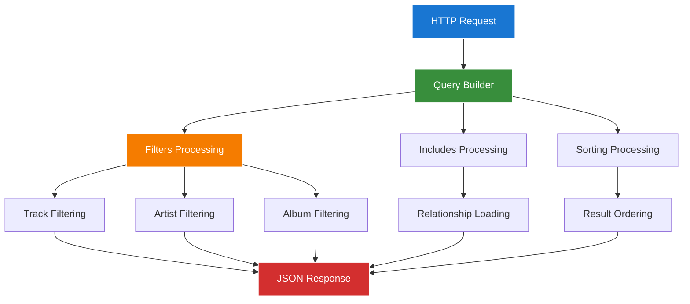

# 1. Spatie Laravel Query Builder Package Guide
## 1.1 Enhanced Chinook API Integration with Modern Laravel 12 Patterns

**Package:** `spatie/laravel-query-builder`
**Version:** `^6.0`
**Laravel Compatibility:** `^12.0`
**Integration Status:** ✅ **Active with Chinook API**
**Documentation Standard:** WCAG 2.1 AA Compliant

---

## 1.2 Table of Contents

- [1. Spatie Laravel Query Builder Package Guide](#1-spatie-laravel-query-builder-package-guide)
  - [1.1 Enhanced Chinook API Integration with Modern Laravel 12 Patterns](#11-enhanced-chinook-api-integration-with-modern-laravel-12-patterns)
  - [1.2 Table of Contents](#12-table-of-contents)
  - [1.3 Overview](#13-overview)
    - [1.3.1 Key Features](#131-key-features)
    - [1.3.2 Chinook API Benefits](#132-chinook-api-benefits)
  - [1.4 Installation & Configuration](#14-installation--configuration)
    - [1.4.1 Package Installation](#141-package-installation)
    - [1.4.2 Configuration Publishing](#142-configuration-publishing)
    - [1.4.3 Configuration Customization](#143-configuration-customization)
  - [1.5 Laravel 12 Modern Implementation](#15-laravel-12-modern-implementation)
    - [1.5.1 API Resource Structure](#151-api-resource-structure)
    - [1.5.2 Modern Controller Patterns](#152-modern-controller-patterns)
  - [1.6 Chinook API Endpoints](#16-chinook-api-endpoints)
    - [1.6.1 Track API Implementation](#161-track-api-implementation)
    - [1.6.2 Artist API Implementation](#162-artist-api-implementation)
    - [1.6.3 Album API Implementation](#163-album-api-implementation)
  - [1.7 Advanced Query Features](#17-advanced-query-features)
    - [1.7.1 Complex Filtering](#171-complex-filtering)
    - [1.7.2 Relationship Includes](#172-relationship-includes)
    - [1.7.3 Custom Filters](#173-custom-filters)
  - [1.8 Security & Validation](#18-security--validation)
    - [1.8.1 Whitelist Configuration](#181-whitelist-configuration)
    - [1.8.2 Request Validation](#182-request-validation)
  - [1.9 Testing Integration](#19-testing-integration)
    - [1.9.1 Pest Framework Examples](#191-pest-framework-examples)
    - [1.9.2 API Testing Patterns](#192-api-testing-patterns)
  - [1.10 Performance Optimization](#110-performance-optimization)
    - [1.10.1 Query Optimization](#1101-query-optimization)
    - [1.10.2 Caching Strategies](#1102-caching-strategies)
  - [1.11 Troubleshooting](#111-troubleshooting)
    - [1.11.1 Common Issues](#1111-common-issues)
    - [1.11.2 Performance Problems](#1112-performance-problems)
  - [1.12 Navigation](#112-navigation)

---

## 1.3 Overview

The `spatie/laravel-query-builder` package provides a powerful and flexible way to build database queries from HTTP request parameters. This guide demonstrates how to integrate and use this package within the Chinook music database system for creating dynamic, filterable API endpoints with Laravel 12 modern patterns.

### 1.3.1 Key Features

- **🔍 Request-Based Filtering**: Automatic query building from URL parameters
- **🔗 Relationship Filtering**: Filter and include related models seamlessly
- **📊 Sorting & Pagination**: Built-in sorting and pagination support
- **🛡️ Security**: Whitelist-based approach for secure query building
- **⚡ Laravel 12 Compatibility**: Full support for modern Laravel 12 patterns
- **🎵 Music-Specific**: Optimized for music database queries and relationships

### 1.3.2 Chinook API Benefits



**Integration Advantages:**
- **Dynamic API Endpoints**: Single endpoint handles multiple query scenarios
- **Consistent Interface**: Standardized query parameters across all endpoints
- **Performance Optimized**: Efficient database queries with eager loading
- **Developer Friendly**: Intuitive URL-based query building

---

## 1.4 Installation & Configuration

### 1.4.1 Package Installation

Install the package using Composer:

```bash
# Install spatie/laravel-query-builder package
composer require spatie/laravel-query-builder
```

**Version Requirements:**
- Laravel: `^12.0`
- PHP: `^8.2`
- Database: MySQL 8.0+, PostgreSQL 13+, SQLite 3.35+

### 1.4.2 Configuration Publishing

Publish the configuration file for customization:

```bash
# Publish configuration file (optional)
php artisan vendor:publish --provider="Spatie\QueryBuilder\QueryBuilderServiceProvider" --tag="config"
```

**Published Files:**
- `config/query-builder.php` - Package configuration

### 1.4.3 Configuration Customization

Configure the package for Chinook API integration:

```php
<?php
// config/query-builder.php

return [
    /*
    |--------------------------------------------------------------------------
    | Request Data Source
    |--------------------------------------------------------------------------
    */
    'request_data_source' => 'query_string',

    /*
    |--------------------------------------------------------------------------
    | Default Filter Class
    |--------------------------------------------------------------------------
    */
    'default_filter_class' => Spatie\QueryBuilder\Filters\Filter::class,

    /*
    |--------------------------------------------------------------------------
    | Default Include Class
    |--------------------------------------------------------------------------
    */
    'default_include_class' => Spatie\QueryBuilder\Includes\IncludeInterface::class,

    /*
    |--------------------------------------------------------------------------
    | Default Sort Class
    |--------------------------------------------------------------------------
    */
    'default_sort_class' => Spatie\QueryBuilder\Sorts\Sort::class,

    /*
    |--------------------------------------------------------------------------
    | Chinook-Specific Configuration
    |--------------------------------------------------------------------------
    */
    'chinook' => [
        'default_per_page' => 20,
        'max_per_page' => 100,
        'enable_debug' => env('QUERY_BUILDER_DEBUG', false),
        'cache_queries' => env('QUERY_BUILDER_CACHE', true),
        'cache_ttl' => 300, // 5 minutes
    ],

    /*
    |--------------------------------------------------------------------------
    | Parameter Names
    |--------------------------------------------------------------------------
    */
    'parameters' => [
        'include' => 'include',
        'filter' => 'filter',
        'sort' => 'sort',
        'fields' => 'fields',
        'append' => 'append',
    ],

    /*
    |--------------------------------------------------------------------------
    | Disable Invalid Filter Query Exception
    |--------------------------------------------------------------------------
    */
    'disable_invalid_filter_query_exception' => false,

    /*
    |--------------------------------------------------------------------------
    | Disable Invalid Include Query Exception
    |--------------------------------------------------------------------------
    */
    'disable_invalid_includes_query_exception' => false,
];
```

---

## 1.5 Laravel 12 Modern Implementation

### 1.5.1 API Resource Structure

Enhanced API resources using Laravel 12 modern patterns:

```php
<?php
// app/Http/Resources/TrackResource.php

namespace App\Http\Resources;

use Illuminate\Http\Request;
use Illuminate\Http\Resources\Json\JsonResource;

class TrackResource extends JsonResource
{
    /**
     * Transform the resource into an array.
     */
    public function toArray(Request $request): array
    {
        return [
            'id' => $this->id,
            'public_id' => $this->public_id,
            'name' => $this->name,
            'composer' => $this->composer,
            'duration' => [
                'milliseconds' => $this->milliseconds,
                'formatted' => $this->formatted_duration,
            ],
            'file_info' => [
                'bytes' => $this->bytes,
                'size_formatted' => $this->formatted_size,
            ],
            'pricing' => [
                'unit_price' => $this->unit_price,
                'currency' => 'USD',
                'formatted_price' => '$' . number_format($this->unit_price, 2),
            ],
            'metadata' => $this->metadata,
            'is_active' => $this->is_active,
            'created_at' => $this->created_at?->toISOString(),
            'updated_at' => $this->updated_at?->toISOString(),

            // Conditional relationships
            'genre' => $this->whenLoaded('genre', fn() => new GenreResource($this->genre)),
            'album' => $this->whenLoaded('album', fn() => new AlbumResource($this->album)),
            'media_type' => $this->whenLoaded('mediaType', fn() => new MediaTypeResource($this->mediaType)),
            'playlists' => $this->whenLoaded('playlists', fn() => PlaylistResource::collection($this->playlists)),
            'categories' => $this->whenLoaded('categories', fn() => CategoryResource::collection($this->categories)),
            'taxonomies' => $this->whenLoaded('taxonomies', fn() => TaxonomyResource::collection($this->taxonomies)),

            // Computed attributes
            'links' => [
                'self' => route('api.tracks.show', $this->public_id),
                'album' => $this->when($this->album, fn() => route('api.albums.show', $this->album->public_id)),
                'artist' => $this->when($this->album?->artist, fn() => route('api.artists.show', $this->album->artist->public_id)),
            ],
        ];
    }
}
```

### 1.5.2 Modern Controller Patterns

API controllers with Laravel 12 modern patterns:

```php
<?php
// app/Http/Controllers/Api/TrackController.php

namespace App\Http\Controllers\Api;

use App\Http\Controllers\Controller;
use App\Http\Resources\Chinook\TrackResource;
use App\Models\Track;
use Illuminate\Http\Request;
use Illuminate\Http\Resources\Json\AnonymousResourceCollection;
use Spatie\QueryBuilder\AllowedFilter;
use Spatie\QueryBuilder\AllowedInclude;
use Spatie\QueryBuilder\AllowedSort;
use Spatie\QueryBuilder\QueryBuilder;

class TrackController extends Controller
{
    /**
     * Display a listing of tracks with query builder support
     */
    public function index(Request $request): AnonymousResourceCollection
    {
        $tracks = QueryBuilder::for(Track::class)
            ->allowedFilters([
                AllowedFilter::exact('id'),
                AllowedFilter::partial('name'),
                AllowedFilter::partial('composer'),
                AllowedFilter::exact('genre_id'),
                AllowedFilter::exact('album_id'),
                AllowedFilter::exact('media_type_id'),
                AllowedFilter::scope('price_range'),
                AllowedFilter::scope('duration_range'),
                AllowedFilter::callback('search', function ($query, $value) {
                    $query->where(function ($q) use ($value) {
                        $q->where('name', 'like', "%{$value}%")
                          ->orWhere('composer', 'like', "%{$value}%")
                          ->orWhereHas('album', function ($albumQuery) use ($value) {
                              $albumQuery->where('title', 'like', "%{$value}%");
                          })
                          ->orWhereHas('album.artist', function ($artistQuery) use ($value) {
                              $artistQuery->where('name', 'like', "%{$value}%");
                          });
                    });
                }),
            ])
            ->allowedIncludes([
                AllowedInclude::relationship('genre'),
                AllowedInclude::relationship('album'),
                AllowedInclude::relationship('album.artist'),
                AllowedInclude::relationship('mediaType'),
                AllowedInclude::relationship('playlists'),
                AllowedInclude::relationship('categories'),
                AllowedInclude::relationship('taxonomies'),
                AllowedInclude::count('playlists'),
            ])
            ->allowedSorts([
                AllowedSort::field('id'),
                AllowedSort::field('name'),
                AllowedSort::field('composer'),
                AllowedSort::field('milliseconds'),
                AllowedSort::field('unit_price'),
                AllowedSort::field('created_at'),
                AllowedSort::field('updated_at'),
                AllowedSort::callback('popularity', function ($query, $descending) {
                    $direction = $descending ? 'desc' : 'asc';
                    $query->withCount('playlists')
                          ->orderBy('playlists_count', $direction);
                }),
                AllowedSort::callback('album_title', function ($query, $descending) {
                    $direction = $descending ? 'desc' : 'asc';
                    $query->join('albums', 'tracks.album_id', '=', 'albums.id')
                          ->orderBy('albums.title', $direction);
                }),
            ])
            ->defaultSort('-created_at')
            ->paginate($request->get('per_page', 20))
            ->appends($request->query());

        return TrackResource::collection($tracks);
    }

    /**
     * Display the specified track
     */
    public function show(Request $request, string $publicId): TrackResource
    {
        $track = QueryBuilder::for(Track::where('public_id', $publicId))
            ->allowedIncludes([
                AllowedInclude::relationship('genre'),
                AllowedInclude::relationship('album'),
                AllowedInclude::relationship('album.artist'),
                AllowedInclude::relationship('mediaType'),
                AllowedInclude::relationship('playlists'),
                AllowedInclude::relationship('categories'),
                AllowedInclude::relationship('taxonomies'),
            ])
            ->firstOrFail();

        return new TrackResource($track);
    }
}
```

---

## 1.6 Chinook API Endpoints

### 1.6.1 Track API Implementation

Complete track API with advanced query capabilities:

**Example API Requests:**

```bash
# Basic track listing
GET /api/tracks

# Filter by genre
GET /api/tracks?filter[genre_id]=1

# Search tracks
GET /api/tracks?filter[search]=rock

# Include relationships
GET /api/tracks?include=genre,album,album.artist

# Sort by popularity
GET /api/tracks?sort=-popularity

# Complex query with multiple parameters
GET /api/tracks?filter[search]=progressive&include=album,genre&sort=-created_at&per_page=10
```

**Track Model Scopes:**

```php
<?php
// app/Models/Track.php - Query builder scopes

namespace App\Models;

use Illuminate\Database\Eloquent\Builder;
use Illuminate\Database\Eloquent\Model;

class Track extends Model
{
    // ... existing model code ...

    /**
     * Scope for price range filtering
     */
    public function scopePriceRange(Builder $query, string $range): Builder
    {
        [$min, $max] = explode(',', $range);

        return $query->whereBetween('unit_price', [
            (float) $min,
            (float) $max,
        ]);
    }

    /**
     * Scope for duration range filtering (in minutes)
     */
    public function scopeDurationRange(Builder $query, string $range): Builder
    {
        [$minMinutes, $maxMinutes] = explode(',', $range);

        $minMs = (int) $minMinutes * 60 * 1000;
        $maxMs = (int) $maxMinutes * 60 * 1000;

        return $query->whereBetween('milliseconds', [$minMs, $maxMs]);
    }

    /**
     * Scope for genre filtering by name
     */
    public function scopeByGenreName(Builder $query, string $genreName): Builder
    {
        return $query->whereHas('genre', function (Builder $q) use ($genreName) {
            $q->where('name', 'like', "%{$genreName}%");
        });
    }

    /**
     * Scope for tracks with explicit content
     */
    public function scopeExplicitContent(Builder $query, bool $explicit = true): Builder
    {
        return $query->where('is_explicit', $explicit);
    }
}
```

### 1.6.2 Artist API Implementation

Artist API with relationship filtering:

```php
<?php
// app/Http/Controllers/Api/ArtistController.php

namespace App\Http\Controllers\Api;

use App\Http\Controllers\Controller;
use App\Http\Resources\ArtistResource;
use App\Models\Artist;
use Illuminate\Http\Request;
use Illuminate\Http\Resources\Json\AnonymousResourceCollection;
use Spatie\QueryBuilder\AllowedFilter;
use Spatie\QueryBuilder\AllowedInclude;
use Spatie\QueryBuilder\AllowedSort;
use Spatie\QueryBuilder\QueryBuilder;

class ArtistController extends Controller
{
    public function index(Request $request): AnonymousResourceCollection
    {
        $artists = QueryBuilder::for(Artist::class)
            ->allowedFilters([
                AllowedFilter::exact('id'),
                AllowedFilter::partial('name'),
                AllowedFilter::exact('country'),
                AllowedFilter::scope('formed_year_range'),
                AllowedFilter::exact('is_active'),
                AllowedFilter::callback('has_albums', function ($query, $value) {
                    if ($value === 'true') {
                        $query->has('albums');
                    } elseif ($value === 'false') {
                        $query->doesntHave('albums');
                    }
                }),
                AllowedFilter::callback('genre', function ($query, $value) {
                    $query->whereHas('albums.tracks.genre', function ($q) use ($value) {
                        $q->where('name', 'like', "%{$value}%");
                    });
                }),
            ])
            ->allowedIncludes([
                AllowedInclude::relationship('albums'),
                AllowedInclude::relationship('albums.tracks'),
                AllowedInclude::relationship('albums.tracks.genre'),
                AllowedInclude::count('albums'),
                AllowedInclude::count('albums.tracks'),
            ])
            ->allowedSorts([
                AllowedSort::field('id'),
                AllowedSort::field('name'),
                AllowedSort::field('country'),
                AllowedSort::field('formed_year'),
                AllowedSort::field('created_at'),
                AllowedSort::callback('album_count', function ($query, $descending) {
                    $direction = $descending ? 'desc' : 'asc';
                    $query->withCount('albums')
                          ->orderBy('albums_count', $direction);
                }),
                AllowedSort::callback('track_count', function ($query, $descending) {
                    $direction = $descending ? 'desc' : 'asc';
                    $query->withCount(['albums as tracks_count' => function ($q) {
                        $q->join('tracks', 'albums.id', '=', 'tracks.album_id');
                    }])->orderBy('tracks_count', $direction);
                }),
            ])
            ->defaultSort('name')
            ->paginate($request->get('per_page', 20))
            ->appends($request->query());

        return ArtistResource::collection($artists);
    }

    public function show(Request $request, string $publicId): ArtistResource
    {
        $artist = QueryBuilder::for(Artist::where('public_id', $publicId))
            ->allowedIncludes([
                AllowedInclude::relationship('albums'),
                AllowedInclude::relationship('albums.tracks'),
                AllowedInclude::relationship('albums.tracks.genre'),
                AllowedInclude::count('albums'),
                AllowedInclude::count('albums.tracks'),
            ])
            ->firstOrFail();

        return new ArtistResource($artist);
    }
}
```

### 1.6.3 Album API Implementation

Album API with advanced filtering:

```php
<?php
// app/Http/Controllers/Api/AlbumController.php

namespace App\Http\Controllers\Api;

use App\Http\Controllers\Controller;
use App\Http\Resources\AlbumResource;
use App\Models\Album;
use Illuminate\Http\Request;
use Illuminate\Http\Resources\Json\AnonymousResourceCollection;
use Spatie\QueryBuilder\AllowedFilter;
use Spatie\QueryBuilder\AllowedInclude;
use Spatie\QueryBuilder\AllowedSort;
use Spatie\QueryBuilder\QueryBuilder;

class AlbumController extends Controller
{
    public function index(Request $request): AnonymousResourceCollection
    {
        $albums = QueryBuilder::for(Album::class)
            ->allowedFilters([
                AllowedFilter::exact('id'),
                AllowedFilter::partial('title'),
                AllowedFilter::exact('artist_id'),
                AllowedFilter::scope('release_year_range'),
                AllowedFilter::scope('track_count_range'),
                AllowedFilter::callback('genre', function ($query, $value) {
                    $query->whereHas('tracks.genre', function ($q) use ($value) {
                        $q->where('name', 'like', "%{$value}%");
                    });
                }),
                AllowedFilter::callback('duration_range', function ($query, $value) {
                    [$minMinutes, $maxMinutes] = explode(',', $value);
                    $minMs = (int) $minMinutes * 60 * 1000;
                    $maxMs = (int) $maxMinutes * 60 * 1000;

                    $query->havingRaw('SUM(tracks.milliseconds) BETWEEN ? AND ?', [$minMs, $maxMs])
                          ->join('tracks', 'albums.id', '=', 'tracks.album_id')
                          ->groupBy('albums.id');
                }),
            ])
            ->allowedIncludes([
                AllowedInclude::relationship('artist'),
                AllowedInclude::relationship('tracks'),
                AllowedInclude::relationship('tracks.genre'),
                AllowedInclude::count('tracks'),
            ])
            ->allowedSorts([
                AllowedSort::field('id'),
                AllowedSort::field('title'),
                AllowedSort::field('release_date'),
                AllowedSort::field('created_at'),
                AllowedSort::callback('track_count', function ($query, $descending) {
                    $direction = $descending ? 'desc' : 'asc';
                    $query->withCount('tracks')
                          ->orderBy('tracks_count', $direction);
                }),
                AllowedSort::callback('total_duration', function ($query, $descending) {
                    $direction = $descending ? 'desc' : 'asc';
                    $query->join('tracks', 'albums.id', '=', 'tracks.album_id')
                          ->groupBy('albums.id')
                          ->orderByRaw("SUM(tracks.milliseconds) {$direction}");
                }),
            ])
            ->defaultSort('-release_date')
            ->paginate($request->get('per_page', 20))
            ->appends($request->query());

        return AlbumResource::collection($albums);
    }

    public function show(Request $request, string $publicId): AlbumResource
    {
        $album = QueryBuilder::for(Album::where('public_id', $publicId))
            ->allowedIncludes([
                AllowedInclude::relationship('artist'),
                AllowedInclude::relationship('tracks'),
                AllowedInclude::relationship('tracks.genre'),
                AllowedInclude::count('tracks'),
            ])
            ->firstOrFail();

        return new AlbumResource($album);
    }
}
```

---

## 1.7 Advanced Query Features

### 1.7.1 Complex Filtering

Custom filters for advanced query scenarios:

```php
<?php
// app/Http/Filters/TrackFilters.php

namespace App\Http\Filters;

use Illuminate\Database\Eloquent\Builder;
use Spatie\QueryBuilder\Filters\Filter;

class GenreFilter implements Filter
{
    public function __invoke(Builder $query, $value, string $property): Builder
    {
        if (is_array($value)) {
            return $query->whereHas('genre', function (Builder $q) use ($value) {
                $q->whereIn('name', $value);
            });
        }

        return $query->whereHas('genre', function (Builder $q) use ($value) {
            $q->where('name', 'like', "%{$value}%");
        });
    }
}

class PopularityFilter implements Filter
{
    public function __invoke(Builder $query, $value, string $property): Builder
    {
        $threshold = (int) $value;

        return $query->withCount('playlists')
                     ->having('playlists_count', '>=', $threshold);
    }
}

class ReleaseDateRangeFilter implements Filter
{
    public function __invoke(Builder $query, $value, string $property): Builder
    {
        [$startDate, $endDate] = explode(',', $value);

        return $query->whereHas('album', function (Builder $q) use ($startDate, $endDate) {
            $q->whereBetween('release_date', [$startDate, $endDate]);
        });
    }
}
```

### 1.7.2 Relationship Includes

Advanced relationship includes with custom logic:

```php
<?php
// app/Http/Includes/TrackIncludes.php

namespace App\Http\Includes;

use Illuminate\Database\Eloquent\Builder;
use Spatie\QueryBuilder\Includes\IncludeInterface;

class PopularPlaylistsInclude implements IncludeInterface
{
    public function __invoke(Builder $query, string $include): void
    {
        $query->with(['playlists' => function ($q) {
            $q->withCount('tracks')
              ->having('tracks_count', '>=', 10)
              ->orderBy('tracks_count', 'desc')
              ->limit(5);
        }]);
    }
}

class RecommendedTracksInclude implements IncludeInterface
{
    public function __invoke(Builder $query, string $include): void
    {
        $query->with(['recommendedTracks' => function ($q) {
            $q->whereHas('genre', function ($genreQuery) {
                // Include tracks from the same genre
                $genreQuery->whereColumn('genres.id', 'tracks.genre_id');
            })
            ->where('tracks.id', '!=', 'original_track.id')
            ->orderBy('unit_price')
            ->limit(3);
        }]);
    }
}
```

### 1.7.3 Custom Filters

Implementing custom filters for specific business logic:

```php
<?php
// app/Http/Controllers/Api/TrackController.php - Using custom filters

use App\Http\Filters\GenreFilter;
use App\Http\Filters\PopularityFilter;
use App\Http\Filters\ReleaseDateRangeFilter;

class TrackController extends Controller
{
    public function index(Request $request): AnonymousResourceCollection
    {
        $tracks = QueryBuilder::for(Track::class)
            ->allowedFilters([
                // Standard filters
                AllowedFilter::exact('id'),
                AllowedFilter::partial('name'),

                // Custom filters
                AllowedFilter::custom('genre', new GenreFilter()),
                AllowedFilter::custom('popularity', new PopularityFilter()),
                AllowedFilter::custom('release_date_range', new ReleaseDateRangeFilter()),

                // Scope filters
                AllowedFilter::scope('price_range'),
                AllowedFilter::scope('duration_range'),
            ])
            ->allowedIncludes([
                AllowedInclude::relationship('genre'),
                AllowedInclude::relationship('album'),
                AllowedInclude::custom('popular_playlists', new PopularPlaylistsInclude()),
                AllowedInclude::custom('recommended_tracks', new RecommendedTracksInclude()),
            ])
            ->allowedSorts([
                AllowedSort::field('name'),
                AllowedSort::field('unit_price'),
                AllowedSort::callback('popularity', function ($query, $descending) {
                    $direction = $descending ? 'desc' : 'asc';
                    $query->withCount('playlists')
                          ->orderBy('playlists_count', $direction);
                }),
            ])
            ->defaultSort('-created_at')
            ->paginate($request->get('per_page', 20));

        return TrackResource::collection($tracks);
    }
}
```

---

## 1.8 Security & Validation

### 1.8.1 Whitelist Configuration

Secure API endpoints with proper whitelisting:

```php
<?php
// app/Http/Controllers/Api/BaseApiController.php

namespace App\Http\Controllers\Api;

use App\Http\Controllers\Controller;
use Illuminate\Http\Request;
use Spatie\QueryBuilder\Exceptions\InvalidFilterQuery;
use Spatie\QueryBuilder\Exceptions\InvalidIncludeQuery;
use Spatie\QueryBuilder\Exceptions\InvalidSortQuery;

abstract class BaseApiController extends Controller
{
    /**
     * Maximum allowed per_page value
     */
    protected int $maxPerPage = 100;

    /**
     * Default per_page value
     */
    protected int $defaultPerPage = 20;

    /**
     * Validate pagination parameters
     */
    protected function validatePagination(Request $request): void
    {
        $perPage = $request->get('per_page', $this->defaultPerPage);

        if ($perPage > $this->maxPerPage) {
            abort(400, "per_page cannot exceed {$this->maxPerPage}");
        }

        if ($perPage < 1) {
            abort(400, 'per_page must be at least 1');
        }
    }

    /**
     * Handle query builder exceptions
     */
    protected function handleQueryBuilderExceptions(\Throwable $e): void
    {
        if ($e instanceof InvalidFilterQuery) {
            abort(400, 'Invalid filter: ' . $e->getMessage());
        }

        if ($e instanceof InvalidIncludeQuery) {
            abort(400, 'Invalid include: ' . $e->getMessage());
        }

        if ($e instanceof InvalidSortQuery) {
            abort(400, 'Invalid sort: ' . $e->getMessage());
        }

        throw $e;
    }

    /**
     * Get allowed filters for the model
     */
    abstract protected function getAllowedFilters(): array;

    /**
     * Get allowed includes for the model
     */
    abstract protected function getAllowedIncludes(): array;

    /**
     * Get allowed sorts for the model
     */
    abstract protected function getAllowedSorts(): array;
}
```

### 1.8.2 Request Validation

Validate query parameters with Laravel form requests:

```php
<?php
// app/Http/Requests/TrackIndexRequest.php

namespace App\Http\Requests;

use Illuminate\Foundation\Http\FormRequest;
use Illuminate\Validation\Rule;

class TrackIndexRequest extends FormRequest
{
    public function authorize(): bool
    {
        return true;
    }

    public function rules(): array
    {
        return [
            'filter' => 'sometimes|array',
            'filter.name' => 'sometimes|string|max:255',
            'filter.composer' => 'sometimes|string|max:255',
            'filter.genre_id' => 'sometimes|integer|exists:genres,id',
            'filter.album_id' => 'sometimes|integer|exists:albums,id',
            'filter.price_range' => 'sometimes|string|regex:/^\d+(\.\d{1,2})?,\d+(\.\d{1,2})?$/',
            'filter.duration_range' => 'sometimes|string|regex:/^\d+,\d+$/',
            'filter.search' => 'sometimes|string|max:255',

            'include' => 'sometimes|string',
            'sort' => 'sometimes|string',
            'per_page' => 'sometimes|integer|min:1|max:100',
            'page' => 'sometimes|integer|min:1',
        ];
    }

    public function messages(): array
    {
        return [
            'filter.price_range.regex' => 'Price range must be in format: min,max (e.g., 0.99,9.99)',
            'filter.duration_range.regex' => 'Duration range must be in format: min_minutes,max_minutes (e.g., 3,10)',
            'per_page.max' => 'Maximum 100 items per page allowed',
        ];
    }

    /**
     * Get validated include parameters as array
     */
    public function getIncludes(): array
    {
        $includes = $this->input('include', '');

        if (empty($includes)) {
            return [];
        }

        return explode(',', $includes);
    }

    /**
     * Get validated sort parameters
     */
    public function getSorts(): array
    {
        $sorts = $this->input('sort', '');

        if (empty($sorts)) {
            return [];
        }

        return explode(',', $sorts);
    }
}
```

---

## 1.9 Testing Integration

### 1.9.1 Pest Framework Examples

Comprehensive API testing with Pest framework:

```php
<?php
// tests/Feature/Api/TrackApiTest.php

use App\Models\Album;
use App\Models\Artist;
use App\Models\Genre;
use App\Models\Track;

describe('Track API', function () {
    beforeEach(function () {
        $this->artist = Artist::factory()->create(['name' => 'Test Artist']);
        $this->album = Album::factory()->create([
            'title' => 'Test Album',
            'artist_id' => $this->artist->id,
        ]);
        $this->genre = Genre::factory()->create(['name' => 'Rock']);

        $this->tracks = Track::factory()->count(5)->create([
            'album_id' => $this->album->id,
            'genre_id' => $this->genre->id,
        ]);
    });

    it('can list tracks', function () {
        $response = $this->getJson('/api/tracks');

        $response->assertStatus(200)
                ->assertJsonStructure([
                    'data' => [
                        '*' => [
                            'id',
                            'public_id',
                            'name',
                            'composer',
                            'duration',
                            'file_info',
                            'pricing',
                            'links',
                        ]
                    ],
                    'links',
                    'meta',
                ]);
    });

    it('can filter tracks by name', function () {
        $track = Track::factory()->create([
            'name' => 'Unique Track Name',
            'album_id' => $this->album->id,
            'genre_id' => $this->genre->id,
        ]);

        $response = $this->getJson('/api/tracks?filter[name]=Unique');

        $response->assertStatus(200);
        expect($response->json('data'))->toHaveCount(1);
        expect($response->json('data.0.name'))->toBe('Unique Track Name');
    });

    it('can include relationships', function () {
        $response = $this->getJson('/api/tracks?include=genre,album,album.artist');

        $response->assertStatus(200)
                ->assertJsonStructure([
                    'data' => [
                        '*' => [
                            'genre' => ['id', 'name'],
                            'album' => [
                                'id',
                                'title',
                                'artist' => ['id', 'name'],
                            ],
                        ]
                    ]
                ]);
    });

    it('validates pagination parameters', function () {
        $response = $this->getJson('/api/tracks?per_page=101');

        $response->assertStatus(400);
    });

    it('handles invalid filters gracefully', function () {
        $response = $this->getJson('/api/tracks?filter[invalid_field]=value');

        $response->assertStatus(400);
    });
});
```

### 1.9.2 API Testing Patterns

Advanced testing patterns for query builder APIs:

```php
<?php
// tests/Feature/Api/QueryBuilderPatternsTest.php

describe('Query Builder Patterns', function () {
    it('can handle complex filter combinations', function () {
        $genre = Genre::factory()->create(['name' => 'Jazz']);
        $album = Album::factory()->create(['title' => 'Jazz Album']);

        Track::factory()->create([
            'name' => 'Jazz Track',
            'unit_price' => 1.99,
            'milliseconds' => 240000, // 4 minutes
            'album_id' => $album->id,
            'genre_id' => $genre->id,
        ]);

        $response = $this->getJson('/api/tracks?' . http_build_query([
            'filter' => [
                'genre_id' => $genre->id,
                'price_range' => '1.00,2.99',
                'duration_range' => '3,5',
            ],
            'include' => 'genre,album',
            'sort' => '-unit_price',
        ]));

        $response->assertStatus(200);
        expect($response->json('data'))->toHaveCount(1);
        expect($response->json('data.0.name'))->toBe('Jazz Track');
    });

    it('optimizes queries with proper eager loading', function () {
        Track::factory()->count(10)->create();

        DB::enableQueryLog();

        $response = $this->getJson('/api/tracks?include=genre,album,album.artist');

        $queries = DB::getQueryLog();

        $response->assertStatus(200);

        // Should use efficient eager loading
        expect(count($queries))->toBeLessThan(5);
    });

    it('handles sorting with relationships', function () {
        $artist1 = Artist::factory()->create(['name' => 'A Artist']);
        $artist2 = Artist::factory()->create(['name' => 'Z Artist']);

        $album1 = Album::factory()->create(['artist_id' => $artist1->id]);
        $album2 = Album::factory()->create(['artist_id' => $artist2->id]);

        Track::factory()->create(['album_id' => $album1->id]);
        Track::factory()->create(['album_id' => $album2->id]);

        $response = $this->getJson('/api/tracks?include=album.artist&sort=album.artist.name');

        $response->assertStatus(200);
        $artists = collect($response->json('data'))->pluck('album.artist.name');

        expect($artists->first())->toBe('A Artist');
        expect($artists->last())->toBe('Z Artist');
    });
});
```

---

## 1.10 Performance Optimization

### 1.10.1 Query Optimization

Optimize database queries for better performance:

```php
<?php
// app/Http/Controllers/Api/OptimizedTrackController.php

namespace App\Http\Controllers\Api;

use App\Http\Controllers\Controller;
use App\Http\Resources\Chinook\TrackResource;
use App\Models\Track;
use Illuminate\Http\Request;
use Illuminate\Http\Resources\Json\AnonymousResourceCollection;
use Spatie\QueryBuilder\AllowedFilter;
use Spatie\QueryBuilder\AllowedInclude;
use Spatie\QueryBuilder\AllowedSort;
use Spatie\QueryBuilder\QueryBuilder;

class OptimizedTrackController extends Controller
{
    public function index(Request $request): AnonymousResourceCollection
    {
        $tracks = QueryBuilder::for(Track::class)
            // Select only necessary columns by default
            ->select([
                'tracks.id',
                'tracks.public_id',
                'tracks.name',
                'tracks.composer',
                'tracks.milliseconds',
                'tracks.bytes',
                'tracks.unit_price',
                'tracks.genre_id',
                'tracks.album_id',
                'tracks.media_type_id',
                'tracks.created_at',
                'tracks.updated_at',
            ])
            ->allowedFilters([
                AllowedFilter::exact('id'),
                AllowedFilter::partial('name'),
                AllowedFilter::exact('genre_id'),
                AllowedFilter::exact('album_id'),
                AllowedFilter::scope('price_range'),
                AllowedFilter::callback('search', function ($query, $value) {
                    // Use full-text search if available
                    if (config('database.default') === 'mysql') {
                        $query->whereRaw('MATCH(name, composer) AGAINST(? IN BOOLEAN MODE)', [$value]);
                    } else {
                        $query->where(function ($q) use ($value) {
                            $q->where('name', 'like', "%{$value}%")
                              ->orWhere('composer', 'like', "%{$value}%");
                        });
                    }
                }),
            ])
            ->allowedIncludes([
                AllowedInclude::relationship('genre', function ($query) {
                    $query->select('id', 'name');
                }),
                AllowedInclude::relationship('album', function ($query) {
                    $query->select('id', 'title', 'artist_id');
                }),
                AllowedInclude::relationship('album.artist', function ($query) {
                    $query->select('id', 'name');
                }),
                AllowedInclude::count('playlists'),
            ])
            ->allowedSorts([
                AllowedSort::field('name'),
                AllowedSort::field('unit_price'),
                AllowedSort::field('created_at'),
                AllowedSort::callback('popularity', function ($query, $descending) {
                    $direction = $descending ? 'desc' : 'asc';
                    $query->leftJoin('playlist_track', 'tracks.id', '=', 'playlist_track.track_id')
                          ->groupBy('tracks.id')
                          ->orderByRaw("COUNT(playlist_track.track_id) {$direction}");
                }),
            ])
            ->defaultSort('-created_at')
            ->paginate($request->get('per_page', 20))
            ->appends($request->query());

        return TrackResource::collection($tracks);
    }
}
```

### 1.10.2 Caching Strategies

Implement caching for frequently accessed data:

```php
<?php
// app/Http/Controllers/Api/CachedTrackController.php

namespace App\Http\Controllers\Api;

use App\Http\Controllers\Controller;
use App\Http\Resources\Chinook\TrackResource;
use App\Models\Track;
use Illuminate\Http\Request;
use Illuminate\Http\Resources\Json\AnonymousResourceCollection;
use Illuminate\Support\Facades\Cache;
use Spatie\QueryBuilder\QueryBuilder;

class CachedTrackController extends Controller
{
    private const CACHE_TTL = 300; // 5 minutes

    public function index(Request $request): AnonymousResourceCollection
    {
        $cacheKey = $this->generateCacheKey($request);

        $tracks = Cache::remember($cacheKey, self::CACHE_TTL, function () use ($request) {
            return $this->buildQuery($request)->paginate($request->get('per_page', 20));
        });

        return TrackResource::collection($tracks);
    }

    private function generateCacheKey(Request $request): string
    {
        $params = $request->only(['filter', 'include', 'sort', 'per_page', 'page']);

        return 'tracks_api_' . md5(serialize($params));
    }

    private function buildQuery(Request $request): QueryBuilder
    {
        return QueryBuilder::for(Track::class)
            ->allowedFilters([
                // ... filter configuration
            ])
            ->allowedIncludes([
                // ... include configuration
            ])
            ->allowedSorts([
                // ... sort configuration
            ])
            ->defaultSort('-created_at');
    }

    /**
     * Clear cache when tracks are modified
     */
    public static function clearCache(): void
    {
        Cache::tags(['tracks_api'])->flush();
    }
}
```

---

## 1.11 Troubleshooting

### 1.11.1 Common Issues

#### Issue 1: Invalid Filter/Sort Exceptions

**Symptoms:**
- `InvalidFilterQuery` exceptions
- `InvalidSortQuery` exceptions

**Solutions:**

```php
// Ensure all filters are explicitly allowed
->allowedFilters([
    AllowedFilter::exact('id'),
    AllowedFilter::partial('name'),
    // Add all filters you want to support
])

// Check relationship names match your model
->allowedIncludes([
    AllowedInclude::relationship('genre'), // Must match Track::genre() method
])
```

#### Issue 2: Performance Problems

**Symptoms:**
- Slow API responses
- High database query count

**Solutions:**

```php
// Use select() to limit returned fields
->select(['id', 'name', 'unit_price'])

// Implement proper database indexes
Schema::table('tracks', function (Blueprint $table) {
    $table->index(['genre_id', 'created_at']);
    $table->index(['album_id', 'unit_price']);
});

// Use allowedFields() to limit data transfer
->allowedFields(['tracks' => ['id', 'name', 'unit_price']])
```

### 1.11.2 Performance Problems

**Issue: N+1 Query Problems**

```php
// Problem: Loading relationships without eager loading
$tracks = QueryBuilder::for(Track::class)
    ->allowedIncludes(['genre', 'album'])
    ->get();

// Solution: Use proper eager loading constraints
$tracks = QueryBuilder::for(Track::class)
    ->allowedIncludes([
        AllowedInclude::relationship('genre', function ($query) {
            $query->select('id', 'name'); // Limit selected fields
        }),
        AllowedInclude::relationship('album', function ($query) {
            $query->select('id', 'title', 'artist_id');
        }),
    ])
    ->get();
```

---

## 1.12 Navigation

### 1.12.1 Related Documentation

- **[Chinook Main Index](../000-chinook-index.md)** - Complete Chinook documentation overview
- **[Package Index](./000-packages-index.md)** - All package integration guides
- **[Model Architecture Guide](../filament/models/010-model-architecture.md)** - Laravel 12 model patterns for API resources
- **[Model Architecture Guide](../filament/models/010-model-architecture.md)** - Laravel 12 model patterns

### 1.12.2 Package Integration Guides

- **[Aliziodev Taxonomy Guide](./095-aliziodev-laravel-taxonomy-guide.md)** - Taxonomy system integration
- **[Spatie Settings Guide](./130-spatie-laravel-settings-guide.md)** - Application settings
- **[Spatie Translatable Guide](./150-spatie-laravel-translatable-guide.md)** - Multi-language support
- **[Spatie Permission Guide](./110-spatie-permission-guide.md)** - RBAC implementation

### 1.12.3 Implementation Guides

- **[Filament Resources](../filament/resources/000-resources-index.md)** - Resource implementation patterns
- **[Model Standards](../filament/models/000-models-index.md)** - Laravel 12 model implementation
- **[Testing Guide](testing/010-pest-testing-guide.md)** - Pest framework testing
- **[Performance Guide](../performance/)** - Optimization strategies

---

**Documentation Status:** ✅ **Complete**
**Last Updated:** 2025-07-09
**Version:** 1.0.0
**WCAG 2.1 AA Compliant:** ✅
**Laravel 12 Compatible:** ✅

### Simple Query Building

Create a basic API endpoint for tracks:

```php
<?php

namespace App\Http\Controllers\Api;

use App\Models\Track;
use Illuminate\Http\Request;
use Spatie\QueryBuilder\QueryBuilder;

class TrackController extends Controller
{
    public function index(Request $request)
    {
        $tracks = QueryBuilder::for(Track::class)
            ->allowedFilters(['name', 'unit_price', 'album.title'])
            ->allowedSorts(['name', 'unit_price', 'created_at'])
            ->allowedIncludes(['album', 'mediaType', 'categories'])
            ->paginate($request->get('per_page', 15));

        return response()->json($tracks);
    }
}
```

### Usage Examples

```bash
# Filter tracks by name
GET /api/tracks?filter[name]=rock

# Filter by price range
GET /api/tracks?filter[unit_price]=0.99

# Sort by name ascending
GET /api/tracks?sort=name

# Sort by price descending
GET /api/tracks?sort=-unit_price

# Include related models
GET /api/tracks?include=album,mediaType

# Combine filters, sorting, and includes
GET /api/tracks?filter[name]=rock&sort=-unit_price&include=album
```

## Advanced Features

### Custom Filters

Create custom filter classes for complex filtering logic:

```php
<?php

namespace App\Filters;

use Spatie\QueryBuilder\Filters\Filter;
use Illuminate\Database\Eloquent\Builder;

class PriceRangeFilter implements Filter
{
    public function __invoke(Builder $query, $value, string $property): Builder
    {
        if (is_array($value) && count($value) === 2) {
            return $query->whereBetween('unit_price', [
                (float) $value[0],
                (float) $value[1]
            ]);
        }

        return $query;
    }
}
```

### Genre Filter with Categories

Create a filter for music genres using the category system:

```php
<?php

namespace App\Filters;

use Spatie\QueryBuilder\Filters\Filter;
use Illuminate\Database\Eloquent\Builder;

class GenreFilter implements Filter
{
    public function __invoke(Builder $query, $value, string $property): Builder
    {
        return $query->whereHas('categories', function (Builder $query) use ($value) {
            $query->where('type', 'GENRE')
                  ->where('slug', $value);
        });
    }
}
```

### Advanced Track API Controller

```php
<?php

namespace App\Http\Controllers\Api;

use App\Models\Track;
use App\Filters\PriceRangeFilter;
use App\Filters\GenreFilter;
use App\Filters\DurationFilter;
use Illuminate\Http\Request;
use Spatie\QueryBuilder\QueryBuilder;
use Spatie\QueryBuilder\AllowedFilter;
use Spatie\QueryBuilder\AllowedSort;
use Spatie\QueryBuilder\AllowedInclude;

class TrackController extends Controller
{
    public function index(Request $request)
    {
        $tracks = QueryBuilder::for(Track::class)
            ->allowedFilters([
                'name',
                'album.title',
                'album.artist.name',
                AllowedFilter::exact('media_type_id'),
                AllowedFilter::custom('price_range', new PriceRangeFilter()),
                AllowedFilter::custom('genre', new GenreFilter()),
                AllowedFilter::custom('duration', new DurationFilter()),
                AllowedFilter::scope('popular'),
                AllowedFilter::scope('recent'),
            ])
            ->allowedSorts([
                'name',
                'unit_price',
                'milliseconds',
                'created_at',
                AllowedSort::field('album_title', 'album.title'),
                AllowedSort::field('artist_name', 'album.artist.name'),
            ])
            ->allowedIncludes([
                'album',
                'album.artist',
                'mediaType',
                'categories',
                'playlists',
            ])
            ->allowedFields([
                'tracks.id',
                'tracks.name',
                'tracks.unit_price',
                'tracks.milliseconds',
                'album.title',
                'album.artist.name',
            ])
            ->defaultSort('-created_at')
            ->paginate($request->get('per_page', 15));

        return response()->json($tracks);
    }

    public function show(Request $request, Track $track)
    {
        $track = QueryBuilder::for(Track::where('id', $track->id))
            ->allowedIncludes([
                'album',
                'album.artist',
                'mediaType',
                'categories',
                'playlists',
                'invoiceLines',
            ])
            ->first();

        return response()->json($track);
    }
}
```

### Model Scopes for Query Builder

Add useful scopes to your Track model:

```php
<?php

namespace App\Models;

use Illuminate\Database\Eloquent\Model;
use Illuminate\Database\Eloquent\Builder;

class Track extends Model
{
    public function scopePopular(Builder $query): Builder
    {
        return $query->withCount('invoiceLines')
                    ->orderBy('invoice_lines_count', 'desc');
    }

    public function scopeRecent(Builder $query): Builder
    {
        return $query->where('created_at', '>=', now()->subDays(30));
    }

    public function scopeByGenre(Builder $query, string $genre): Builder
    {
        return $query->whereHas('categories', function (Builder $query) use ($genre) {
            $query->where('type', 'GENRE')
                  ->where('slug', $genre);
        });
    }

    public function scopeByPriceRange(Builder $query, float $min, float $max): Builder
    {
        return $query->whereBetween('unit_price', [$min, $max]);
    }
}
```

## Integration with Chinook

### Album API with Advanced Filtering

```php
<?php

namespace App\Http\Controllers\Api;

use App\Models\Album;
use Illuminate\Http\Request;
use Spatie\QueryBuilder\QueryBuilder;
use Spatie\QueryBuilder\AllowedFilter;
use Spatie\QueryBuilder\AllowedSort;

class AlbumController extends Controller
{
    public function index(Request $request)
    {
        $albums = QueryBuilder::for(Album::class)
            ->allowedFilters([
                'title',
                'artist.name',
                AllowedFilter::exact('artist_id'),
                AllowedFilter::scope('with_tracks'),
                AllowedFilter::scope('by_year'),
                AllowedFilter::callback('release_year', function (Builder $query, $value) {
                    $query->whereYear('release_date', $value);
                }),
            ])
            ->allowedSorts([
                'title',
                'release_date',
                'created_at',
                AllowedSort::field('artist_name', 'artist.name'),
                AllowedSort::field('track_count', 'tracks_count'),
            ])
            ->allowedIncludes([
                'artist',
                'tracks',
                'tracks.categories',
                'tracks.mediaType',
            ])
            ->withCount('tracks')
            ->defaultSort('-release_date')
            ->paginate($request->get('per_page', 15));

        return response()->json($albums);
    }
}
```

### Artist API with Relationship Filtering

```php
<?php

namespace App\Http\Controllers\Api;

use App\Models\Artist;
use Illuminate\Http\Request;
use Spatie\QueryBuilder\QueryBuilder;
use Spatie\QueryBuilder\AllowedFilter;

class ArtistController extends Controller
{
    public function index(Request $request)
    {
        $artists = QueryBuilder::for(Artist::class)
            ->allowedFilters([
                'name',
                AllowedFilter::scope('with_albums'),
                AllowedFilter::scope('popular'),
                AllowedFilter::callback('has_tracks_in_genre', function (Builder $query, $value) {
                    $query->whereHas('albums.tracks.categories', function (Builder $query) use ($value) {
                        $query->where('type', 'GENRE')
                              ->where('slug', $value);
                    });
                }),
            ])
            ->allowedSorts([
                'name',
                'created_at',
                AllowedSort::field('album_count', 'albums_count'),
                AllowedSort::field('track_count', 'tracks_count'),
            ])
            ->allowedIncludes([
                'albums',
                'albums.tracks',
                'albums.tracks.categories',
            ])
            ->withCount(['albums', 'tracks'])
            ->defaultSort('name')
            ->paginate($request->get('per_page', 15));

        return response()->json($artists);
    }
}
```

### Filament Integration

Use Query Builder in Filament table filters:

```php
<?php

namespace App\Filament\Resources;

use App\Models\Track;
use Filament\Resources\Resource;
use Filament\Tables\Table;
use Filament\Tables\Filters\SelectFilter;
use Filament\Tables\Filters\Filter;
use Illuminate\Database\Eloquent\Builder;
use Spatie\QueryBuilder\QueryBuilder;

class TrackResource extends Resource
{
    protected static ?string $model = Track::class;

    public static function table(Table $table): Table
    {
        return $table
            ->columns([
                TextColumn::make('name')->searchable(),
                TextColumn::make('album.title')->searchable(),
                TextColumn::make('album.artist.name')->searchable(),
                TextColumn::make('unit_price')->money('USD'),
                TextColumn::make('milliseconds')->formatStateUsing(fn ($state) => 
                    gmdate('i:s', $state / 1000)
                ),
            ])
            ->filters([
                SelectFilter::make('media_type_id')
                    ->relationship('mediaType', 'name'),
                    
                Filter::make('price_range')
                    ->form([
                        TextInput::make('price_from')->numeric(),
                        TextInput::make('price_to')->numeric(),
                    ])
                    ->query(function (Builder $query, array $data): Builder {
                        return $query
                            ->when($data['price_from'], fn (Builder $query, $price) => 
                                $query->where('unit_price', '>=', $price)
                            )
                            ->when($data['price_to'], fn (Builder $query, $price) => 
                                $query->where('unit_price', '<=', $price)
                            );
                    }),
                    
                SelectFilter::make('genre')
                    ->options(function () {
                        return Category::where('type', 'GENRE')
                            ->pluck('name', 'slug');
                    })
                    ->query(function (Builder $query, $value): Builder {
                        return $query->whereHas('categories', function (Builder $query) use ($value) {
                            $query->where('type', 'GENRE')
                                  ->where('slug', $value);
                        });
                    }),
            ]);
    }
}
```

## Testing

### API Testing with Query Builder

Test your API endpoints with Pest:

```php
<?php

use App\Models\Track;
use App\Models\Album;
use App\Models\Artist;

describe('Track API with Query Builder', function () {
    beforeEach(function () {
        $this->artist = Artist::factory()->create(['name' => 'Test Artist']);
        $this->album = Album::factory()->create([
            'title' => 'Test Album',
            'artist_id' => $this->artist->id,
        ]);
        $this->track = Track::factory()->create([
            'name' => 'Test Track',
            'album_id' => $this->album->id,
            'unit_price' => 0.99,
        ]);
    });

    it('can filter tracks by name', function () {
        $response = $this->getJson('/api/tracks?filter[name]=Test');
        
        $response->assertStatus(200)
                ->assertJsonCount(1, 'data')
                ->assertJsonPath('data.0.name', 'Test Track');
    });

    it('can sort tracks by price', function () {
        Track::factory()->create(['unit_price' => 1.99]);
        
        $response = $this->getJson('/api/tracks?sort=-unit_price');
        
        $response->assertStatus(200)
                ->assertJsonPath('data.0.unit_price', '1.99');
    });

    it('can include related models', function () {
        $response = $this->getJson('/api/tracks?include=album,album.artist');
        
        $response->assertStatus(200)
                ->assertJsonStructure([
                    'data' => [
                        '*' => [
                            'id',
                            'name',
                            'album' => [
                                'id',
                                'title',
                                'artist' => [
                                    'id',
                                    'name',
                                ],
                            ],
                        ],
                    ],
                ]);
    });

    it('validates allowed filters', function () {
        $response = $this->getJson('/api/tracks?filter[invalid_field]=value');
        
        $response->assertStatus(400);
    });
});
```

## Troubleshooting

### Common Issues

**Invalid Filter/Sort Exceptions**
- Ensure all filters and sorts are explicitly allowed in the controller
- Check that relationship names match your model relationships
- Verify custom filter classes implement the correct interface

**Performance Issues**
- Use `select()` to limit returned fields
- Implement proper database indexes for filtered/sorted columns
- Consider using `allowedFields()` to limit data transfer

**Relationship Loading**
- Use `allowedIncludes()` to control which relationships can be loaded
- Implement proper eager loading to avoid N+1 queries
- Consider using `withCount()` for relationship counts

### Debug Tips

```php
// Enable query logging to debug generated SQL
DB::enableQueryLog();
$tracks = QueryBuilder::for(Track::class)->get();
dd(DB::getQueryLog());

// Use explain to analyze query performance
$query = QueryBuilder::for(Track::class)->toSql();
DB::select("EXPLAIN $query");
```

---

## Navigation

**← Previous:** [Spatie Laravel Settings Guide](130-spatie-laravel-settings-guide.md)

**Next →** [Spatie Laravel Translatable Guide](150-spatie-laravel-translatable-guide.md)

**↑ Back to:** [Package Index](000-packages-index.md)
