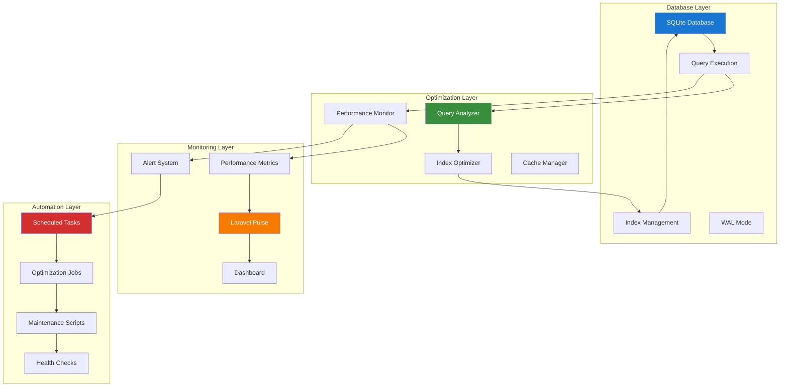

# Laravel Database Optimization Guide

## Table of Contents

- [Overview](#overview)
  - [Key Features](#key-features)
  - [Architecture Overview](#architecture-overview)
- [Installation & Configuration](#installation--configuration)
  - [Package Installation](#package-installation)
  - [Configuration Setup](#configuration-setup)
- [Database Optimization Strategies](#database-optimization-strategies)
  - [SQLite WAL Mode Configuration](#sqlite-wal-mode-configuration)
- [Index Optimization](#index-optimization)
  - [Automated Index Management](#automated-index-management)
- [Laravel Pulse Integration](#laravel-pulse-integration)
  - [Database Performance Recorder](#database-performance-recorder)
- [Automated Optimization Workflows](#automated-optimization-workflows)
  - [Database Optimization Command](#database-optimization-command)
  - [Query Performance Analyzer](#query-performance-analyzer)

## Overview

Laravel Database Optimization provides comprehensive tools and strategies for optimizing database performance in Laravel applications. This guide demonstrates how to implement automated optimization workflows, monitor query performance, and integrate with Laravel Pulse for real-time monitoring.

### Key Features

- **Automated Query Optimization**: Intelligent query analysis and optimization
- **Index Management**: Automated index creation and optimization
- **Performance Monitoring**: Real-time query performance tracking
- **SQLite Optimization**: Specialized optimizations for SQLite databases
- **Laravel Pulse Integration**: Comprehensive performance dashboards
- **Automated Workflows**: Scheduled optimization and maintenance tasks

### Architecture Overview



## Installation & Configuration

### Package Installation

```bash
# Install Laravel Database Optimization
composer require nunomaduro/laravel-optimize-database

# Install Laravel Pulse for monitoring
composer require laravel/pulse

# Publish configurations
php artisan vendor:publish --provider="NunoMaduro\LaravelOptimizeDatabase\OptimizeDatabaseServiceProvider"
php artisan vendor:publish --provider="Laravel\Pulse\PulseServiceProvider"

# Run migrations
php artisan migrate
```

### Configuration Setup

```php
<?php

// config/optimize-database.php
return [
    /*
     * Enable or disable database optimization
     */
    'enabled' => env('DB_OPTIMIZE_ENABLED', true),

    /*
     * Database connections to optimize
     */
    'connections' => [
        'sqlite' => [
            'enabled' => true,
            'wal_mode' => true,
            'synchronous' => 'NORMAL',
            'cache_size' => 10000,
            'temp_store' => 'MEMORY',
            'journal_mode' => 'WAL',
        ],
        'mysql' => [
            'enabled' => true,
            'query_cache' => true,
            'innodb_buffer_pool' => true,
        ],
        'postgresql' => [
            'enabled' => true,
            'shared_buffers' => true,
            'work_mem' => true,
        ],
    ],

    /*
     * Query optimization settings
     */
    'query_optimization' => [
        'enabled' => true,
        'slow_query_threshold' => 1000, // milliseconds
        'analyze_queries' => true,
        'suggest_indexes' => true,
        'cache_query_plans' => true,
    ],

    /*
     * Index optimization settings
     */
    'index_optimization' => [
        'enabled' => true,
        'auto_create_indexes' => env('DB_AUTO_CREATE_INDEXES', false),
        'analyze_index_usage' => true,
        'remove_unused_indexes' => false,
        'composite_index_suggestions' => true,
    ],

    /*
     * Monitoring settings
     */
    'monitoring' => [
        'enabled' => true,
        'track_slow_queries' => true,
        'track_query_counts' => true,
        'track_connection_usage' => true,
        'alert_thresholds' => [
            'slow_query_count' => 10,
            'connection_pool_usage' => 80,
            'query_time_average' => 500,
        ],
    ],

    /*
     * Maintenance settings
     */
    'maintenance' => [
        'vacuum_schedule' => 'daily',
        'analyze_schedule' => 'hourly',
        'reindex_schedule' => 'weekly',
        'cleanup_temp_files' => true,
    ],
];
```

## Database Optimization Strategies

### SQLite WAL Mode Configuration

```php
<?php

namespace App\Services;

use Illuminate\Support\Facades\DB;
use Illuminate\Support\Facades\Log;

class SQLiteOptimizationService
{
    /**
     * Configure SQLite for optimal performance
     */
    public function optimizeSQLite(): void
    {
        if (config('database.default') !== 'sqlite') {
            return;
        }

        try {
            // Enable WAL mode for better concurrency
            DB::statement('PRAGMA journal_mode=WAL');
            
            // Set synchronous mode to NORMAL for better performance
            DB::statement('PRAGMA synchronous=NORMAL');
            
            // Increase cache size (in pages, negative value = KB)
            DB::statement('PRAGMA cache_size=-10000'); // 10MB cache
            
            // Store temporary tables in memory
            DB::statement('PRAGMA temp_store=MEMORY');
            
            // Enable foreign key constraints
            DB::statement('PRAGMA foreign_keys=ON');
            
            // Set busy timeout to handle concurrent access
            DB::statement('PRAGMA busy_timeout=30000'); // 30 seconds
            
            // Optimize page size for SSD storage
            DB::statement('PRAGMA page_size=4096');
            
            // Enable automatic index creation for ORDER BY
            DB::statement('PRAGMA automatic_index=ON');
            
            Log::info('SQLite optimization settings applied successfully');
            
        } catch (\Exception $e) {
            Log::error('Failed to apply SQLite optimizations: ' . $e->getMessage());
        }
    }

    /**
     * Perform SQLite maintenance tasks
     */
    public function performMaintenance(): void
    {
        try {
            // Analyze database statistics
            DB::statement('ANALYZE');
            
            // Vacuum database to reclaim space
            DB::statement('VACUUM');
            
            // Rebuild indexes
            DB::statement('REINDEX');
            
            Log::info('SQLite maintenance completed successfully');
            
        } catch (\Exception $e) {
            Log::error('SQLite maintenance failed: ' . $e->getMessage());
        }
    }

    /**
     * Get SQLite performance statistics
     */
    public function getPerformanceStats(): array
    {
        try {
            $stats = [];
            
            // Get database size
            $dbPath = database_path('database.sqlite');
            $stats['database_size'] = file_exists($dbPath) ? filesize($dbPath) : 0;
            
            // Get WAL file size
            $walPath = $dbPath . '-wal';
            $stats['wal_size'] = file_exists($walPath) ? filesize($walPath) : 0;
            
            // Get SHM file size
            $shmPath = $dbPath . '-shm';
            $stats['shm_size'] = file_exists($shmPath) ? filesize($shmPath) : 0;
            
            // Get PRAGMA statistics
            $pragmaStats = [
                'journal_mode' => DB::selectOne('PRAGMA journal_mode')?->journal_mode,
                'synchronous' => DB::selectOne('PRAGMA synchronous')?->synchronous,
                'cache_size' => DB::selectOne('PRAGMA cache_size')?->cache_size,
                'page_size' => DB::selectOne('PRAGMA page_size')?->page_size,
                'page_count' => DB::selectOne('PRAGMA page_count')?->page_count,
                'freelist_count' => DB::selectOne('PRAGMA freelist_count')?->freelist_count,
            ];
            
            $stats = array_merge($stats, $pragmaStats);
            
            return $stats;
            
        } catch (\Exception $e) {
            Log::error('Failed to get SQLite performance stats: ' . $e->getMessage());
            return [];
        }
    }
}
```

## Index Optimization

### Automated Index Management

```php
<?php

namespace App\Services;

use Illuminate\Support\Facades\DB;
use Illuminate\Support\Facades\Schema;
use Illuminate\Support\Facades\Log;

class IndexOptimizationService
{
    /**
     * Analyze and suggest indexes
     */
    public function analyzeIndexes(): array
    {
        $suggestions = [];
        $tables = $this->getAllTables();

        foreach ($tables as $table) {
            $tableAnalysis = $this->analyzeTable($table);
            if (!empty($tableAnalysis)) {
                $suggestions[$table] = $tableAnalysis;
            }
        }

        return $suggestions;
    }

    /**
     * Get all tables in the database
     */
    private function getAllTables(): array
    {
        $connection = config('database.default');

        return match ($connection) {
            'sqlite' => $this->getSQLiteTables(),
            'mysql' => $this->getMySQLTables(),
            'pgsql' => $this->getPostgreSQLTables(),
            default => []
        };
    }

    /**
     * Get SQLite tables
     */
    private function getSQLiteTables(): array
    {
        $tables = DB::select("SELECT name FROM sqlite_master WHERE type='table' AND name NOT LIKE 'sqlite_%'");
        return array_column($tables, 'name');
    }

    /**
     * Analyze individual table for index opportunities
     */
    private function analyzeTable(string $table): array
    {
        $suggestions = [];

        // Get table columns
        $columns = Schema::getColumnListing($table);

        // Get existing indexes
        $existingIndexes = $this->getExistingIndexes($table);

        // Analyze foreign key columns
        $foreignKeyColumns = $this->getForeignKeyColumns($table);
        foreach ($foreignKeyColumns as $column) {
            if (!$this->hasIndex($existingIndexes, $column)) {
                $suggestions[] = [
                    'type' => 'foreign_key_index',
                    'column' => $column,
                    'reason' => 'Foreign key column should have an index for better join performance',
                    'sql' => "CREATE INDEX idx_{$table}_{$column} ON {$table} ({$column})",
                ];
            }
        }

        // Analyze frequently queried columns
        $frequentColumns = $this->getFrequentlyQueriedColumns($table);
        foreach ($frequentColumns as $column => $frequency) {
            if (!$this->hasIndex($existingIndexes, $column) && $frequency > 10) {
                $suggestions[] = [
                    'type' => 'frequent_query_index',
                    'column' => $column,
                    'frequency' => $frequency,
                    'reason' => "Column is frequently queried ({$frequency} times)",
                    'sql' => "CREATE INDEX idx_{$table}_{$column} ON {$table} ({$column})",
                ];
            }
        }

        // Suggest composite indexes
        $compositeIndexes = $this->suggestCompositeIndexes($table);
        $suggestions = array_merge($suggestions, $compositeIndexes);

        return $suggestions;
    }

    /**
     * Get existing indexes for a table
     */
    private function getExistingIndexes(string $table): array
    {
        $connection = config('database.default');

        return match ($connection) {
            'sqlite' => $this->getSQLiteIndexes($table),
            'mysql' => $this->getMySQLIndexes($table),
            'pgsql' => $this->getPostgreSQLIndexes($table),
            default => []
        };
    }

    /**
     * Get SQLite indexes for a table
     */
    private function getSQLiteIndexes(string $table): array
    {
        $indexes = DB::select("PRAGMA index_list({$table})");
        $indexDetails = [];

        foreach ($indexes as $index) {
            $columns = DB::select("PRAGMA index_info({$index->name})");
            $indexDetails[$index->name] = array_column($columns, 'name');
        }

        return $indexDetails;
    }

    /**
     * Check if column has an index
     */
    private function hasIndex(array $indexes, string $column): bool
    {
        foreach ($indexes as $indexColumns) {
            if (in_array($column, $indexColumns)) {
                return true;
            }
        }
        return false;
    }

    /**
     * Get foreign key columns
     */
    private function getForeignKeyColumns(string $table): array
    {
        // Simple heuristic: columns ending with _id are likely foreign keys
        $columns = Schema::getColumnListing($table);
        return array_filter($columns, fn($col) => str_ends_with($col, '_id'));
    }

    /**
     * Get frequently queried columns (mock implementation)
     */
    private function getFrequentlyQueriedColumns(string $table): array
    {
        // In a real implementation, this would analyze query logs
        // For now, return common patterns
        $commonColumns = ['email', 'username', 'status', 'created_at', 'updated_at'];
        $tableColumns = Schema::getColumnListing($table);

        $frequent = [];
        foreach ($commonColumns as $column) {
            if (in_array($column, $tableColumns)) {
                $frequent[$column] = rand(5, 50); // Mock frequency
            }
        }

        return $frequent;
    }

    /**
     * Suggest composite indexes
     */
    private function suggestCompositeIndexes(string $table): array
    {
        $suggestions = [];

        // Common composite index patterns
        $patterns = [
            ['status', 'created_at'],
            ['user_id', 'created_at'],
            ['type', 'status'],
            ['category_id', 'status'],
        ];

        $tableColumns = Schema::getColumnListing($table);

        foreach ($patterns as $pattern) {
            $hasAllColumns = true;
            foreach ($pattern as $column) {
                if (!in_array($column, $tableColumns)) {
                    $hasAllColumns = false;
                    break;
                }
            }

            if ($hasAllColumns) {
                $columnList = implode(', ', $pattern);
                $indexName = 'idx_' . $table . '_' . implode('_', $pattern);

                $suggestions[] = [
                    'type' => 'composite_index',
                    'columns' => $pattern,
                    'reason' => 'Composite index for common query patterns',
                    'sql' => "CREATE INDEX {$indexName} ON {$table} ({$columnList})",
                ];
            }
        }

        return $suggestions;
    }

    /**
     * Create recommended indexes
     */
    public function createRecommendedIndexes(array $suggestions): array
    {
        $results = [];

        foreach ($suggestions as $table => $tableSuggestions) {
            foreach ($tableSuggestions as $suggestion) {
                try {
                    DB::statement($suggestion['sql']);
                    $results[] = [
                        'table' => $table,
                        'type' => $suggestion['type'],
                        'sql' => $suggestion['sql'],
                        'status' => 'created',
                    ];

                    Log::info("Created index: {$suggestion['sql']}");

                } catch (\Exception $e) {
                    $results[] = [
                        'table' => $table,
                        'type' => $suggestion['type'],
                        'sql' => $suggestion['sql'],
                        'status' => 'failed',
                        'error' => $e->getMessage(),
                    ];

                    Log::error("Failed to create index: {$suggestion['sql']}", ['error' => $e->getMessage()]);
                }
            }
        }

        return $results;
    }
}
```

## Laravel Pulse Integration

### Database Performance Recorder

```php
<?php

namespace App\Pulse\Recorders;

use Laravel\Pulse\Recorders\Recorder;
use Laravel\Pulse\Pulse;
use Illuminate\Support\Facades\DB;

class DatabasePerformanceRecorder extends Recorder
{
    /**
     * The recorder name
     */
    public string $name = 'database_performance';

    /**
     * Record database performance metrics
     */
    public function record(): void
    {
        // Record slow queries
        $this->recordSlowQueries();

        // Record query counts
        $this->recordQueryCounts();

        // Record connection usage
        $this->recordConnectionUsage();

        // Record database size (SQLite specific)
        $this->recordDatabaseSize();
    }

    /**
     * Record slow queries
     */
    private function recordSlowQueries(): void
    {
        $slowQueries = cache()->get('slow_queries_' . date('Y-m-d-H'), []);

        foreach ($slowQueries as $query) {
            Pulse::record(
                type: 'slow_query',
                key: md5($query['sql']),
                value: $query['execution_time'],
                timestamp: $query['timestamp']
            )->count();
        }
    }

    /**
     * Record query counts
     */
    private function recordQueryCounts(): void
    {
        $queryCount = DB::getQueryLog() ? count(DB::getQueryLog()) : 0;

        Pulse::record(
            type: 'query_count',
            key: 'total',
            value: $queryCount
        )->count();
    }

    /**
     * Record connection usage
     */
    private function recordConnectionUsage(): void
    {
        $connections = config('database.connections');

        foreach ($connections as $name => $config) {
            try {
                $pdo = DB::connection($name)->getPdo();

                Pulse::record(
                    type: 'db_connection',
                    key: $name,
                    value: 1
                )->count();

            } catch (\Exception $e) {
                Pulse::record(
                    type: 'db_connection_error',
                    key: $name,
                    value: 1
                )->count();
            }
        }
    }

    /**
     * Record database size (SQLite)
     */
    private function recordDatabaseSize(): void
    {
        if (config('database.default') === 'sqlite') {
            $dbPath = database_path('database.sqlite');
            $size = file_exists($dbPath) ? filesize($dbPath) : 0;

            Pulse::record(
                type: 'db_size',
                key: 'sqlite',
                value: $size
            )->max();
        }
    }
}
```

## Automated Optimization Workflows

### Database Optimization Command

```php
<?php

namespace App\Console\Commands;

use Illuminate\Console\Command;
use App\Services\SQLiteOptimizationService;
use App\Services\IndexOptimizationService;
use App\Services\QueryPerformanceAnalyzer;

class OptimizeDatabaseCommand extends Command
{
    protected $signature = 'db:optimize
                            {--analyze : Analyze performance without making changes}
                            {--indexes : Create recommended indexes}
                            {--maintenance : Perform maintenance tasks}
                            {--all : Perform all optimizations}';

    protected $description = 'Optimize database performance';

    public function handle(): int
    {
        $this->info('Starting database optimization...');

        if ($this->option('analyze') || $this->option('all')) {
            $this->analyzePerformance();
        }

        if ($this->option('indexes') || $this->option('all')) {
            $this->optimizeIndexes();
        }

        if ($this->option('maintenance') || $this->option('all')) {
            $this->performMaintenance();
        }

        $this->info('Database optimization completed.');
        return 0;
    }

    private function analyzePerformance(): void
    {
        $this->info('Analyzing database performance...');

        $analyzer = app(QueryPerformanceAnalyzer::class);
        $report = $analyzer->getPerformanceReport();

        $this->table(
            ['Metric', 'Value'],
            [
                ['Total Queries', $report['total_queries']],
                ['Slow Queries', count($report['slow_queries'])],
                ['Average Execution Time', round($report['avg_execution_time'], 2) . 'ms'],
            ]
        );

        if (!empty($report['optimization_suggestions'])) {
            $this->warn('Optimization Suggestions:');
            foreach ($report['optimization_suggestions'] as $suggestion) {
                $this->line("  • {$suggestion}");
            }
        }
    }

    private function optimizeIndexes(): void
    {
        $this->info('Analyzing and optimizing indexes...');

        $indexService = app(IndexOptimizationService::class);
        $suggestions = $indexService->analyzeIndexes();

        if (empty($suggestions)) {
            $this->info('No index optimizations needed.');
            return;
        }

        $this->warn('Index optimization suggestions found:');

        foreach ($suggestions as $table => $tableSuggestions) {
            $this->line("Table: {$table}");
            foreach ($tableSuggestions as $suggestion) {
                $this->line("  • {$suggestion['reason']}");
                $this->line("    SQL: {$suggestion['sql']}");
            }
        }

        if ($this->confirm('Create recommended indexes?')) {
            $results = $indexService->createRecommendedIndexes($suggestions);

            $created = array_filter($results, fn($r) => $r['status'] === 'created');
            $failed = array_filter($results, fn($r) => $r['status'] === 'failed');

            $this->info('Created ' . count($created) . ' indexes successfully.');

            if (!empty($failed)) {
                $this->warn('Failed to create ' . count($failed) . ' indexes.');
            }
        }
    }

    private function performMaintenance(): void
    {
        $this->info('Performing database maintenance...');

        if (config('database.default') === 'sqlite') {
            $sqliteService = app(SQLiteOptimizationService::class);
            $sqliteService->performMaintenance();
            $this->info('SQLite maintenance completed.');
        }

        // Add maintenance for other database types as needed
    }
}
```

This comprehensive guide provides everything needed to implement robust database optimization in Laravel applications, with special focus on SQLite optimization, automated index management, and integration with Laravel Pulse for real-time monitoring.

---

**Next Steps:**

- Review [Enhanced Spatie ActivityLog Guide](150-spatie-activitylog-guide.md) for comprehensive audit logging
- Explore [Modern Testing with Pest Guide](testing/010-pest-testing-guide.md) for testing optimization strategies
- Check [Laravel WorkOS Guide](090-laravel-workos-guide.md) for enterprise authentication patterns

### Query Performance Analyzer

```php
<?php

namespace App\Services;

use Illuminate\Support\Facades\DB;
use Illuminate\Support\Facades\Cache;
use Illuminate\Support\Facades\Log;

class QueryPerformanceAnalyzer
{
    private array $slowQueries = [];
    private array $queryStats = [];

    /**
     * Start monitoring query performance
     */
    public function startMonitoring(): void
    {
        DB::listen(function ($query) {
            $this->analyzeQuery($query);
        });
    }

    /**
     * Analyze individual query performance
     */
    private function analyzeQuery($query): void
    {
        $executionTime = $query->time;
        $sql = $query->sql;
        $bindings = $query->bindings;
        
        // Track query statistics
        $this->updateQueryStats($sql, $executionTime);
        
        // Check if query is slow
        $slowThreshold = config('optimize-database.query_optimization.slow_query_threshold', 1000);
        
        if ($executionTime > $slowThreshold) {
            $this->recordSlowQuery($sql, $bindings, $executionTime);
        }
        
        // Suggest optimizations
        $this->suggestOptimizations($sql, $executionTime);
    }

    /**
     * Update query statistics
     */
    private function updateQueryStats(string $sql, float $executionTime): void
    {
        $queryHash = md5($sql);
        
        if (!isset($this->queryStats[$queryHash])) {
            $this->queryStats[$queryHash] = [
                'sql' => $sql,
                'count' => 0,
                'total_time' => 0,
                'avg_time' => 0,
                'max_time' => 0,
                'min_time' => PHP_FLOAT_MAX,
            ];
        }
        
        $stats = &$this->queryStats[$queryHash];
        $stats['count']++;
        $stats['total_time'] += $executionTime;
        $stats['avg_time'] = $stats['total_time'] / $stats['count'];
        $stats['max_time'] = max($stats['max_time'], $executionTime);
        $stats['min_time'] = min($stats['min_time'], $executionTime);
        
        // Cache updated stats
        Cache::put("query_stats_{$queryHash}", $stats, 3600);
    }

    /**
     * Record slow query for analysis
     */
    private function recordSlowQuery(string $sql, array $bindings, float $executionTime): void
    {
        $slowQuery = [
            'sql' => $sql,
            'bindings' => $bindings,
            'execution_time' => $executionTime,
            'timestamp' => now(),
            'suggestions' => $this->generateOptimizationSuggestions($sql),
        ];
        
        $this->slowQueries[] = $slowQuery;
        
        // Log slow query
        Log::warning('Slow query detected', $slowQuery);
        
        // Store in cache for dashboard
        $cacheKey = 'slow_queries_' . date('Y-m-d-H');
        $existingQueries = Cache::get($cacheKey, []);
        $existingQueries[] = $slowQuery;
        Cache::put($cacheKey, $existingQueries, 3600);
    }

    /**
     * Generate optimization suggestions
     */
    private function generateOptimizationSuggestions(string $sql): array
    {
        $suggestions = [];
        
        // Check for missing indexes
        if (preg_match('/WHERE\s+(\w+)\s*=/', $sql, $matches)) {
            $column = $matches[1];
            $suggestions[] = "Consider adding an index on column: {$column}";
        }
        
        // Check for SELECT *
        if (strpos($sql, 'SELECT *') !== false) {
            $suggestions[] = 'Avoid SELECT * - specify only needed columns';
        }
        
        // Check for N+1 queries
        if (preg_match('/SELECT.*FROM.*WHERE.*IN\s*\(/', $sql)) {
            $suggestions[] = 'Potential N+1 query - consider eager loading';
        }
        
        // Check for missing LIMIT
        if (strpos($sql, 'LIMIT') === false && strpos($sql, 'SELECT') === 0) {
            $suggestions[] = 'Consider adding LIMIT clause for large result sets';
        }
        
        return $suggestions;
    }

    /**
     * Get performance report
     */
    public function getPerformanceReport(): array
    {
        return [
            'slow_queries' => $this->slowQueries,
            'query_stats' => $this->queryStats,
            'total_queries' => array_sum(array_column($this->queryStats, 'count')),
            'avg_execution_time' => $this->calculateAverageExecutionTime(),
            'optimization_suggestions' => $this->getTopOptimizationSuggestions(),
        ];
    }

    /**
     * Calculate average execution time across all queries
     */
    private function calculateAverageExecutionTime(): float
    {
        if (empty($this->queryStats)) {
            return 0;
        }
        
        $totalTime = array_sum(array_column($this->queryStats, 'total_time'));
        $totalCount = array_sum(array_column($this->queryStats, 'count'));
        
        return $totalCount > 0 ? $totalTime / $totalCount : 0;
    }

    /**
     * Get top optimization suggestions
     */
    private function getTopOptimizationSuggestions(): array
    {
        $suggestions = [];
        
        foreach ($this->slowQueries as $query) {
            $suggestions = array_merge($suggestions, $query['suggestions']);
        }
        
        return array_unique($suggestions);
    }
}
```
