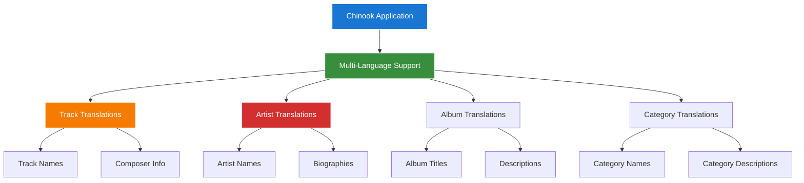

# 1. Spatie Laravel Translatable Package Guide
## 1.1 Enhanced Chinook Multi-Language Support with Modern Laravel 12 Patterns

**Package:** `spatie/laravel-translatable`
**Version:** `^6.8`
**Laravel Compatibility:** `^12.0`
**Integration Status:** ✅ **Active with Chinook Internationalization**
**Documentation Standard:** WCAG 2.1 AA Compliant

---

## 1.2 Table of Contents

- [1. Spatie Laravel Translatable Package Guide](#1-spatie-laravel-translatable-package-guide)
  - [1.1 Enhanced Chinook Multi-Language Support with Modern Laravel 12 Patterns](#11-enhanced-chinook-multi-language-support-with-modern-laravel-12-patterns)
  - [1.2 Table of Contents](#12-table-of-contents)
  - [1.3 Overview](#13-overview)
    - [1.3.1 Key Features](#131-key-features)
    - [1.3.2 Chinook Internationalization Benefits](#132-chinook-internationalization-benefits)
  - [1.4 Installation & Configuration](#14-installation--configuration)
    - [1.4.1 Package Installation](#141-package-installation)
    - [1.4.2 Configuration Publishing](#142-configuration-publishing)
    - [1.4.3 Configuration Customization](#143-configuration-customization)
  - [1.5 Laravel 12 Modern Implementation](#15-laravel-12-modern-implementation)
    - [1.5.1 Translatable Model Structure](#151-translatable-model-structure)
    - [1.5.2 Modern Casting Syntax](#152-modern-casting-syntax)
  - [1.6 Chinook Model Translations](#16-chinook-model-translations)
    - [1.6.1 Track Model Translation](#161-track-model-translation)
    - [1.6.2 Artist Model Translation](#162-artist-model-translation)
    - [1.6.3 Album Model Translation](#163-album-model-translation)
    - [1.6.4 Category Model Translation](#164-category-model-translation)
  - [1.7 Filament Integration](#17-filament-integration)
    - [1.7.1 Translatable Form Components](#171-translatable-form-components)
    - [1.7.2 Language Switching](#172-language-switching)
  - [1.8 Advanced Features](#18-advanced-features)
    - [1.8.1 Fallback Languages](#181-fallback-languages)
    - [1.8.2 Translation Validation](#182-translation-validation)
    - [1.8.3 Bulk Translation Operations](#183-bulk-translation-operations)
  - [1.9 Testing Integration](#19-testing-integration)
    - [1.9.1 Pest Framework Examples](#191-pest-framework-examples)
    - [1.9.2 Translation Testing Patterns](#192-translation-testing-patterns)
  - [1.10 Performance Optimization](#110-performance-optimization)
    - [1.10.1 Translation Caching](#1101-translation-caching)
    - [1.10.2 Query Optimization](#1102-query-optimization)
  - [1.11 Troubleshooting](#111-troubleshooting)
    - [1.11.1 Common Issues](#1111-common-issues)
    - [1.11.2 Migration Problems](#1112-migration-problems)
  - [1.12 Navigation](#112-navigation)

---

## 1.3 Overview

The `spatie/laravel-translatable` package provides a clean and efficient way to make Eloquent models translatable. This guide demonstrates how to integrate and use this package within the Chinook music database system for supporting multiple languages in track names, album titles, artist information, and category descriptions with Laravel 12 modern patterns.

### 1.3.1 Key Features

- **🌍 Multiple Language Support**: Store translations for any model attribute
- **🔄 Fallback Languages**: Automatic fallback to default language when translation is missing
- **💾 Database Efficiency**: JSON-based storage for optimal performance
- **⚡ Laravel 12 Compatibility**: Full support for modern Laravel 12 patterns
- **🎛️ Filament Integration**: Seamless integration with Filament admin panels
- **🎵 Music-Specific**: Optimized for music metadata translations

### 1.3.2 Chinook Internationalization Benefits



**Integration Advantages:**
- **Global Reach**: Support for international music catalogs
- **User Experience**: Localized content for different regions
- **SEO Benefits**: Multi-language content for better search visibility
- **Content Management**: Easy translation management through Filament admin

---

## 1.4 Installation & Configuration

### 1.4.1 Package Installation

Install the package using Composer:

```bash
# Install spatie/laravel-translatable package
composer require spatie/laravel-translatable
```

**Version Requirements:**
- Laravel: `^12.0`
- PHP: `^8.2`
- Database: MySQL 8.0+, PostgreSQL 13+, SQLite 3.35+

### 1.4.2 Configuration Publishing

Publish the configuration file:

```bash
# Publish configuration file
php artisan vendor:publish --provider="Spatie\Translatable\TranslatableServiceProvider"
```

**Published Files:**
- `config/translatable.php` - Package configuration

### 1.4.3 Configuration Customization

Configure the package for Chinook internationalization:

```php
<?php
// config/translatable.php

return [
    /*
    |--------------------------------------------------------------------------
    | Locales
    |--------------------------------------------------------------------------
    */
    'locales' => [
        'en' => 'English',
        'es' => 'Español',
        'fr' => 'Français',
        'de' => 'Deutsch',
        'it' => 'Italiano',
        'pt' => 'Português',
        'ja' => '日本語',
        'ko' => '한국어',
        'zh' => '中文',
        'ru' => 'Русский',
    ],

    /*
    |--------------------------------------------------------------------------
    | Fallback Locale
    |--------------------------------------------------------------------------
    */
    'fallback_locale' => 'en',

    /*
    |--------------------------------------------------------------------------
    | Locale Key
    |--------------------------------------------------------------------------
    */
    'locale_key' => 'locale',

    /*
    |--------------------------------------------------------------------------
    | Always Load Translations
    |--------------------------------------------------------------------------
    */
    'always_load_translations' => true,

    /*
    |--------------------------------------------------------------------------
    | Chinook-Specific Configuration
    |--------------------------------------------------------------------------
    */
    'chinook' => [
        'default_locale' => 'en',
        'supported_locales' => ['en', 'es', 'fr', 'de', 'it', 'pt', 'ja'],
        'cache_translations' => true,
        'cache_ttl' => 3600, // 1 hour
        'validate_translations' => true,
        'auto_translate' => false, // Set to true if using translation services
    ],

    /*
    |--------------------------------------------------------------------------
    | Translation Validation Rules
    |--------------------------------------------------------------------------
    */
    'validation' => [
        'required_locales' => ['en'], // English is always required
        'max_length' => [
            'track_name' => 255,
            'album_title' => 255,
            'artist_name' => 255,
            'category_name' => 100,
            'description' => 1000,
            'biography' => 5000,
        ],
    ],
];
```

---

## 1.5 Laravel 12 Modern Implementation

### 1.5.1 Translatable Model Structure

Enhanced model implementation using Laravel 12 modern patterns:

```php
<?php
// app/Models/Track.php

namespace App\Models;

use App\Traits\HasSecondaryUniqueKey;
use App\Traits\HasSlug;
use Illuminate\Database\Eloquent\Factories\HasFactory;
use Illuminate\Database\Eloquent\Model;
use Illuminate\Database\Eloquent\Relations\BelongsTo;
use Illuminate\Database\Eloquent\SoftDeletes;
use Spatie\Tags\HasTags;
use Spatie\Translatable\HasTranslations;
use Wildside\Userstamps\Userstamps;

class Track extends Model
{
    use HasFactory;
    use SoftDeletes;
    use HasTags;
    use HasSecondaryUniqueKey;
    use HasSlug;
    use HasTranslations;  // Add translatable support
    use Userstamps;

    protected $fillable = [
        'public_id',
        'name',
        'composer',
        'album_id',
        'media_type_id',
        'genre_id',
        'milliseconds',
        'bytes',
        'unit_price',
        'is_active',
        'metadata',
    ];

    /**
     * Laravel 12 modern cast() method
     */
    protected function casts(): array
    {
        return [
            'milliseconds' => 'integer',
            'bytes' => 'integer',
            'unit_price' => 'decimal:2',
            'is_active' => 'boolean',
            'metadata' => 'array',
            'created_at' => 'datetime',
            'updated_at' => 'datetime',
            'deleted_at' => 'datetime',
        ];
    }

    /**
     * Define translatable attributes
     */
    public array $translatable = [
        'name',
        'composer',
        'description', // Additional field for track descriptions
    ];

    /**
     * Genre relationship
     */
    public function genre(): BelongsTo
    {
        return $this->belongsTo(Genre::class);
    }

    /**
     * Album relationship
     */
    public function album(): BelongsTo
    {
        return $this->belongsTo(Album::class);
    }

    /**
     * Get translated name with fallback
     */
    public function getTranslatedName(?string $locale = null): string
    {
        return $this->getTranslation('name', $locale ?? app()->getLocale())
               ?? $this->getTranslation('name', config('translatable.fallback_locale'))
               ?? $this->name;
    }

    /**
     * Get all available translations for this track
     */
    public function getAvailableTranslations(): array
    {
        $translations = [];
        $locales = config('translatable.locales', []);

        foreach ($locales as $locale => $name) {
            if ($this->hasTranslation('name', $locale)) {
                $translations[$locale] = [
                    'locale' => $locale,
                    'name' => $name,
                    'track_name' => $this->getTranslation('name', $locale),
                    'composer' => $this->getTranslation('composer', $locale),
                    'description' => $this->getTranslation('description', $locale),
                ];
            }
        }

        return $translations;
    }
}
```

### 1.5.2 Modern Casting Syntax

Laravel 12 introduces enhanced casting capabilities for translatable fields:

```php
<?php
// app/Models/Artist.php

namespace App\Models;

use App\Traits\HasSecondaryUniqueKey;
use App\Traits\HasSlug;
use Illuminate\Database\Eloquent\Casts\Attribute;
use Illuminate\Database\Eloquent\Factories\HasFactory;
use Illuminate\Database\Eloquent\Model;
use Illuminate\Database\Eloquent\Relations\HasMany;
use Illuminate\Database\Eloquent\SoftDeletes;
use Spatie\Tags\HasTags;
use Spatie\Translatable\HasTranslations;
use Wildside\Userstamps\Userstamps;

class Artist extends Model
{
    use HasFactory;
    use SoftDeletes;
    use HasTags;
    use HasSecondaryUniqueKey;
    use HasSlug;
    use HasTranslations;
    use Userstamps;

    protected $fillable = [
        'public_id',
        'name',
        'biography',
        'website',
        'country',
        'formed_year',
        'is_active',
        'social_links',
        'metadata',
    ];

    protected function casts(): array
    {
        return [
            'formed_year' => 'integer',
            'is_active' => 'boolean',
            'social_links' => 'array',
            'metadata' => 'array',
            'created_at' => 'datetime',
            'updated_at' => 'datetime',
            'deleted_at' => 'datetime',
        ];
    }

    /**
     * Define translatable attributes
     */
    public array $translatable = [
        'name',
        'biography',
        'description', // Additional localized description
    ];

    /**
     * Albums relationship
     */
    public function albums(): HasMany
    {
        return $this->hasMany(Album::class);
    }

    /**
     * Computed attribute for localized display name
     */
    protected function localizedName(): Attribute
    {
        return Attribute::make(
            get: fn (mixed $value, array $attributes) =>
                $this->getTranslatedName()
        );
    }

    /**
     * Computed attribute for localized biography
     */
    protected function localizedBiography(): Attribute
    {
        return Attribute::make(
            get: fn (mixed $value, array $attributes) =>
                $this->getTranslation('biography', app()->getLocale())
                ?? $this->getTranslation('biography', config('translatable.fallback_locale'))
        );
    }

    /**
     * Get translated name with fallback
     */
    public function getTranslatedName(?string $locale = null): string
    {
        return $this->getTranslation('name', $locale ?? app()->getLocale())
               ?? $this->getTranslation('name', config('translatable.fallback_locale'))
               ?? $this->name;
    }

    /**
     * Check if artist has translation for specific locale
     */
    public function hasTranslationFor(string $locale): bool
    {
        return $this->hasTranslation('name', $locale) ||
               $this->hasTranslation('biography', $locale);
    }
}
```

---

## 1.6 Chinook Model Translations

### 1.6.1 Track Model Translation

Complete track model with translation support:

```php
<?php
// Database migration for translatable tracks
// database/migrations/xxxx_add_translations_to_tracks_table.php

use Illuminate\Database\Migrations\Migration;
use Illuminate\Database\Schema\Blueprint;
use Illuminate\Support\Facades\Schema;

return new class extends Migration
{
    public function up(): void
    {
        Schema::table('tracks', function (Blueprint $table) {
            // Convert existing columns to JSON for translations
            $table->json('name')->change();
            $table->json('composer')->nullable()->change();

            // Add new translatable fields
            $table->json('description')->nullable()->after('composer');
        });
    }

    public function down(): void
    {
        Schema::table('tracks', function (Blueprint $table) {
            // Revert to original string columns
            $table->string('name', 200)->change();
            $table->string('composer', 220)->nullable()->change();
            $table->dropColumn('description');
        });
    }
};
```

**Track Translation Usage:**

```php
<?php
// Setting translations
$track = Track::find(1);

$track->setTranslation('name', 'en', 'For What It\'s Worth');
$track->setTranslation('name', 'es', 'Por Lo Que Vale');
$track->setTranslation('name', 'fr', 'Pour Ce Que Ça Vaut');

$track->setTranslation('composer', 'en', 'Stephen Stills');
$track->setTranslation('composer', 'es', 'Stephen Stills');

$track->setTranslation('description', 'en', 'A classic protest song from the 1960s');
$track->setTranslation('description', 'es', 'Una canción de protesta clásica de los años 60');

$track->save();

// Getting translations
app()->setLocale('es');
echo $track->name; // "Por Lo Que Vale"
echo $track->composer; // "Stephen Stills"
echo $track->description; // "Una canción de protesta clásica de los años 60"

// Fallback to English if Spanish translation doesn't exist
app()->setLocale('de');
echo $track->name; // "For What It's Worth" (fallback to English)
```

### 1.6.2 Artist Model Translation

Artist model with comprehensive translation support:

```php
<?php
// Database migration for translatable artists
// database/migrations/xxxx_add_translations_to_artists_table.php

use Illuminate\Database\Migrations\Migration;
use Illuminate\Database\Schema\Blueprint;
use Illuminate\Support\Facades\Schema;

return new class extends Migration
{
    public function up(): void
    {
        Schema::table('artists', function (Blueprint $table) {
            // Convert existing columns to JSON for translations
            $table->json('name')->change();

            // Add new translatable fields
            $table->json('biography')->nullable()->after('name');
            $table->json('description')->nullable()->after('biography');
        });
    }

    public function down(): void
    {
        Schema::table('artists', function (Blueprint $table) {
            $table->string('name', 120)->change();
            $table->dropColumn(['biography', 'description']);
        });
    }
};
```

**Artist Translation Usage:**

```php
<?php
// Setting artist translations
$artist = Artist::find(1);

$artist->setTranslations('name', [
    'en' => 'AC/DC',
    'ja' => 'エーシー・ディーシー',
    'ko' => '에이씨/디씨',
    'zh' => 'AC/DC乐队',
]);

$artist->setTranslations('biography', [
    'en' => 'AC/DC are an Australian rock band formed in Sydney in 1973...',
    'es' => 'AC/DC es una banda de rock australiana formada en Sídney en 1973...',
    'fr' => 'AC/DC est un groupe de rock australien formé à Sydney en 1973...',
    'de' => 'AC/DC ist eine australische Rockband, die 1973 in Sydney gegründet wurde...',
]);

$artist->save();

// Getting localized artist information
app()->setLocale('ja');
echo $artist->localized_name; // "エーシー・ディーシー"
echo $artist->localized_biography; // Falls back to English if Japanese not available
```

### 1.6.3 Album Model Translation

Album model with translation capabilities:

```php
<?php
// app/Models/Album.php

namespace App\Models;

use App\Traits\HasSecondaryUniqueKey;
use App\Traits\HasSlug;
use Illuminate\Database\Eloquent\Factories\HasFactory;
use Illuminate\Database\Eloquent\Model;
use Illuminate\Database\Eloquent\Relations\BelongsTo;
use Illuminate\Database\Eloquent\Relations\HasMany;
use Illuminate\Database\Eloquent\SoftDeletes;
use Spatie\Tags\HasTags;
use Spatie\Translatable\HasTranslations;
use Wildside\Userstamps\Userstamps;

class Album extends Model
{
    use HasFactory;
    use SoftDeletes;
    use HasTags;
    use HasSecondaryUniqueKey;
    use HasSlug;
    use HasTranslations;
    use Userstamps;

    protected $fillable = [
        'public_id',
        'title',
        'artist_id',
        'release_date',
        'total_tracks',
        'duration_ms',
        'is_active',
        'metadata',
    ];

    protected function casts(): array
    {
        return [
            'release_date' => 'date',
            'total_tracks' => 'integer',
            'duration_ms' => 'integer',
            'is_active' => 'boolean',
            'metadata' => 'array',
            'created_at' => 'datetime',
            'updated_at' => 'datetime',
            'deleted_at' => 'datetime',
        ];
    }

    /**
     * Define translatable attributes
     */
    public array $translatable = [
        'title',
        'description',
        'liner_notes', // Album liner notes in different languages
    ];

    /**
     * Artist relationship
     */
    public function artist(): BelongsTo
    {
        return $this->belongsTo(Artist::class);
    }

    /**
     * Tracks relationship
     */
    public function tracks(): HasMany
    {
        return $this->hasMany(Track::class);
    }

    /**
     * Get translated title with fallback
     */
    public function getTranslatedTitle(?string $locale = null): string
    {
        return $this->getTranslation('title', $locale ?? app()->getLocale())
               ?? $this->getTranslation('title', config('translatable.fallback_locale'))
               ?? $this->title;
    }

    /**
     * Get album with all translations
     */
    public function getFullTranslationData(): array
    {
        $locales = config('translatable.locales', []);
        $translations = [];

        foreach ($locales as $locale => $name) {
            if ($this->hasTranslation('title', $locale)) {
                $translations[$locale] = [
                    'locale' => $locale,
                    'language_name' => $name,
                    'title' => $this->getTranslation('title', $locale),
                    'description' => $this->getTranslation('description', $locale),
                    'liner_notes' => $this->getTranslation('liner_notes', $locale),
                ];
            }
        }

        return $translations;
    }
}
```

### 1.6.4 Category Model Translation

Category model with hierarchical translation support:

```php
<?php
// app/Models/Category.php

namespace App\Models;

use App\Enums\CategoryType;
use App\Traits\HasSecondaryUniqueKey;
use App\Traits\HasSlug;
use Illuminate\Database\Eloquent\Factories\HasFactory;
use Illuminate\Database\Eloquent\Model;
use Illuminate\Database\Eloquent\Relations\BelongsTo;
use Illuminate\Database\Eloquent\Relations\HasMany;
use Illuminate\Database\Eloquent\Relations\MorphToMany;
use Illuminate\Database\Eloquent\SoftDeletes;
use Spatie\Tags\HasTags;
use Spatie\Translatable\HasTranslations;
use Wildside\Userstamps\Userstamps;

class Category extends Model
{
    use HasFactory;
    use SoftDeletes;
    use HasTags;
    use HasSecondaryUniqueKey;
    use HasSlug;
    use HasTranslations;
    use Userstamps;

    protected $fillable = [
        'public_id',
        'name',
        'description',
        'category_type',
        'parent_id',
        'sort_order',
        'is_active',
        'metadata',
    ];

    protected function casts(): array
    {
        return [
            'category_type' => CategoryType::class,
            'parent_id' => 'integer',
            'sort_order' => 'integer',
            'is_active' => 'boolean',
            'metadata' => 'array',
            'created_at' => 'datetime',
            'updated_at' => 'datetime',
            'deleted_at' => 'datetime',
        ];
    }

    /**
     * Define translatable attributes
     */
    public array $translatable = [
        'name',
        'description',
    ];

    /**
     * Parent category relationship
     */
    public function parent(): BelongsTo
    {
        return $this->belongsTo(Category::class, 'parent_id');
    }

    /**
     * Child categories relationship
     */
    public function children(): HasMany
    {
        return $this->hasMany(Category::class, 'parent_id');
    }

    /**
     * Tracks relationship (polymorphic)
     */
    public function tracks(): MorphToMany
    {
        return $this->morphedByMany(Track::class, 'categorizable');
    }

    /**
     * Get hierarchical path with translations
     */
    public function getTranslatedHierarchyPath(?string $locale = null): string
    {
        $path = [];
        $current = $this;
        $targetLocale = $locale ?? app()->getLocale();

        while ($current) {
            $translatedName = $current->getTranslation('name', $targetLocale)
                            ?? $current->getTranslation('name', config('translatable.fallback_locale'))
                            ?? $current->name;

            array_unshift($path, $translatedName);
            $current = $current->parent;
        }

        return implode(' > ', $path);
    }

    /**
     * Get category tree with translations
     */
    public static function getTranslatedTree(?string $locale = null): array
    {
        $categories = static::with('children')->whereNull('parent_id')->get();
        $targetLocale = $locale ?? app()->getLocale();

        return $categories->map(function ($category) use ($targetLocale) {
            return $category->buildTranslatedTreeNode($targetLocale);
        })->toArray();
    }

    /**
     * Build translated tree node recursively
     */
    private function buildTranslatedTreeNode(string $locale): array
    {
        return [
            'id' => $this->id,
            'public_id' => $this->public_id,
            'name' => $this->getTranslation('name', $locale)
                     ?? $this->getTranslation('name', config('translatable.fallback_locale'))
                     ?? $this->name,
            'description' => $this->getTranslation('description', $locale)
                           ?? $this->getTranslation('description', config('translatable.fallback_locale')),
            'category_type' => $this->category_type->value,
            'children' => $this->children->map(function ($child) use ($locale) {
                return $child->buildTranslatedTreeNode($locale);
            })->toArray(),
        ];
    }
}
```

---

## 1.7 Filament Integration

### 1.7.1 Translatable Form Components

Filament forms with translation support:

```php
<?php
// app/Filament/Resources/TrackResource.php

namespace App\Filament\Resources;

use App\Models\Track;
use Filament\Forms\Components\Grid;
use Filament\Forms\Components\Section;
use Filament\Forms\Components\Tabs;
use Filament\Forms\Components\TextInput;
use Filament\Forms\Components\Textarea;
use Filament\Forms\Form;
use Filament\Resources\Resource;

class TrackResource extends Resource
{
    protected static ?string $model = Track::class;

    public static function form(Form $form): Form
    {
        return $form
            ->schema([
                Section::make('Track Information')
                    ->schema([
                        Tabs::make('Translations')
                            ->tabs([
                                Tabs\Tab::make('English')
                                    ->schema([
                                        TextInput::make('name.en')
                                            ->label('Track Name (English)')
                                            ->required()
                                            ->maxLength(255),

                                        TextInput::make('composer.en')
                                            ->label('Composer (English)')
                                            ->maxLength(220),

                                        Textarea::make('description.en')
                                            ->label('Description (English)')
                                            ->rows(3)
                                            ->maxLength(1000),
                                    ]),

                                Tabs\Tab::make('Spanish')
                                    ->schema([
                                        TextInput::make('name.es')
                                            ->label('Track Name (Spanish)')
                                            ->maxLength(255),

                                        TextInput::make('composer.es')
                                            ->label('Composer (Spanish)')
                                            ->maxLength(220),

                                        Textarea::make('description.es')
                                            ->label('Description (Spanish)')
                                            ->rows(3)
                                            ->maxLength(1000),
                                    ]),

                                Tabs\Tab::make('French')
                                    ->schema([
                                        TextInput::make('name.fr')
                                            ->label('Track Name (French)')
                                            ->maxLength(255),

                                        TextInput::make('composer.fr')
                                            ->label('Composer (French)')
                                            ->maxLength(220),

                                        Textarea::make('description.fr')
                                            ->label('Description (French)')
                                            ->rows(3)
                                            ->maxLength(1000),
                                    ]),

                                Tabs\Tab::make('German')
                                    ->schema([
                                        TextInput::make('name.de')
                                            ->label('Track Name (German)')
                                            ->maxLength(255),

                                        TextInput::make('composer.de')
                                            ->label('Composer (German)')
                                            ->maxLength(220),

                                        Textarea::make('description.de')
                                            ->label('Description (German)')
                                            ->rows(3)
                                            ->maxLength(1000),
                                    ]),
                            ]),
                    ]),

                Section::make('Additional Information')
                    ->schema([
                        Grid::make(2)
                            ->schema([
                                TextInput::make('milliseconds')
                                    ->label('Duration (ms)')
                                    ->numeric()
                                    ->required(),

                                TextInput::make('unit_price')
                                    ->label('Price')
                                    ->numeric()
                                    ->prefix('$')
                                    ->step(0.01),
                            ]),
                    ]),
            ]);
    }
}
```

### 1.7.2 Language Switching

Implement language switching in Filament:

```php
<?php
// app/Filament/Pages/LanguageSwitcher.php

namespace App\Filament\Pages;

use Filament\Forms\Components\Select;
use Filament\Forms\Form;
use Filament\Pages\Page;
use Illuminate\Support\Facades\Session;

class LanguageSwitcher extends Page
{
    protected static ?string $navigationIcon = 'heroicon-o-language';
    protected static ?string $navigationLabel = 'Language';
    protected static ?int $navigationSort = 999;

    public ?string $current_locale = null;

    public function mount(): void
    {
        $this->current_locale = app()->getLocale();
    }

    public function form(Form $form): Form
    {
        return $form
            ->schema([
                Select::make('current_locale')
                    ->label('Select Language')
                    ->options(config('translatable.locales'))
                    ->default(app()->getLocale())
                    ->live()
                    ->afterStateUpdated(function (string $state) {
                        Session::put('locale', $state);
                        app()->setLocale($state);
                        $this->redirect(request()->header('Referer'));
                    }),
            ]);
    }

    protected function getViewData(): array
    {
        return [
            'current_locale' => $this->current_locale,
            'available_locales' => config('translatable.locales'),
        ];
    }
}
```

---

## 1.8 Advanced Features

### 1.8.1 Fallback Languages

Configure sophisticated fallback strategies:

```php
<?php
// app/Services/TranslationService.php

namespace App\Services;

use Illuminate\Support\Facades\Cache;

class TranslationService
{
    private array $fallbackChain;

    public function __construct()
    {
        $this->fallbackChain = [
            'es' => ['en'], // Spanish falls back to English
            'fr' => ['en'], // French falls back to English
            'de' => ['en'], // German falls back to English
            'it' => ['es', 'en'], // Italian falls back to Spanish, then English
            'pt' => ['es', 'en'], // Portuguese falls back to Spanish, then English
            'ja' => ['en'], // Japanese falls back to English
            'ko' => ['ja', 'en'], // Korean falls back to Japanese, then English
            'zh' => ['en'], // Chinese falls back to English
        ];
    }

    /**
     * Get translation with sophisticated fallback
     */
    public function getTranslationWithFallback($model, string $attribute, ?string $locale = null): ?string
    {
        $targetLocale = $locale ?? app()->getLocale();

        // Try the requested locale first
        $translation = $model->getTranslation($attribute, $targetLocale);
        if ($translation) {
            return $translation;
        }

        // Try fallback chain
        $fallbacks = $this->fallbackChain[$targetLocale] ?? ['en'];
        foreach ($fallbacks as $fallbackLocale) {
            $translation = $model->getTranslation($attribute, $fallbackLocale);
            if ($translation) {
                return $translation;
            }
        }

        // Final fallback to the original attribute value
        return $model->getOriginal($attribute);
    }

    /**
     * Get translation completeness for a model
     */
    public function getTranslationCompleteness($model): array
    {
        $locales = config('translatable.locales', []);
        $translatableAttributes = $model->getTranslatableAttributes();
        $completeness = [];

        foreach ($locales as $locale => $name) {
            $translated = 0;
            $total = count($translatableAttributes);

            foreach ($translatableAttributes as $attribute) {
                if ($model->hasTranslation($attribute, $locale)) {
                    $translated++;
                }
            }

            $completeness[$locale] = [
                'locale' => $locale,
                'name' => $name,
                'translated' => $translated,
                'total' => $total,
                'percentage' => $total > 0 ? round(($translated / $total) * 100, 2) : 0,
            ];
        }

        return $completeness;
    }
}
```

### 1.8.2 Translation Validation

Implement validation for translations:

```php
<?php
// app/Rules/TranslationRequired.php

namespace App\Rules;

use Closure;
use Illuminate\Contracts\Validation\ValidationRule;

class TranslationRequired implements ValidationRule
{
    private array $requiredLocales;

    public function __construct(array $requiredLocales = ['en'])
    {
        $this->requiredLocales = $requiredLocales;
    }

    public function validate(string $attribute, mixed $value, Closure $fail): void
    {
        if (!is_array($value)) {
            $fail('The :attribute must be an array of translations.');
            return;
        }

        foreach ($this->requiredLocales as $locale) {
            if (empty($value[$locale])) {
                $fail("The :attribute must have a translation for {$locale}.");
            }
        }
    }
}

// Usage in form requests
class UpdateTrackRequest extends FormRequest
{
    public function rules(): array
    {
        return [
            'name' => ['required', new TranslationRequired(['en'])],
            'composer' => ['nullable', new TranslationRequired(['en'])],
            'description' => ['nullable', 'array'],
            'description.*' => 'string|max:1000',
        ];
    }
}
```

### 1.8.3 Bulk Translation Operations

Efficient bulk translation operations:

```php
<?php
// app/Services/BulkTranslationService.php

namespace App\Services;

use Illuminate\Database\Eloquent\Collection;
use Illuminate\Support\Facades\DB;

class BulkTranslationService
{
    /**
     * Bulk update translations for multiple models
     */
    public function bulkUpdateTranslations(Collection $models, array $translations): void
    {
        DB::transaction(function () use ($models, $translations) {
            foreach ($models as $model) {
                foreach ($translations as $attribute => $localeTranslations) {
                    foreach ($localeTranslations as $locale => $translation) {
                        if (!empty($translation)) {
                            $model->setTranslation($attribute, $locale, $translation);
                        }
                    }
                }
                $model->save();
            }
        });
    }

    /**
     * Copy translations from one locale to another
     */
    public function copyTranslations(Collection $models, string $fromLocale, string $toLocale, array $attributes): void
    {
        DB::transaction(function () use ($models, $fromLocale, $toLocale, $attributes) {
            foreach ($models as $model) {
                foreach ($attributes as $attribute) {
                    $translation = $model->getTranslation($attribute, $fromLocale);
                    if ($translation && !$model->hasTranslation($attribute, $toLocale)) {
                        $model->setTranslation($attribute, $toLocale, $translation);
                    }
                }
                $model->save();
            }
        });
    }

    /**
     * Generate translation report
     */
    public function generateTranslationReport(string $modelClass): array
    {
        $models = $modelClass::all();
        $locales = config('translatable.locales', []);
        $report = [];

        foreach ($locales as $locale => $name) {
            $report[$locale] = [
                'locale' => $locale,
                'name' => $name,
                'total_models' => $models->count(),
                'translated_models' => 0,
                'attributes' => [],
            ];

            foreach ($models as $model) {
                $hasAnyTranslation = false;
                foreach ($model->getTranslatableAttributes() as $attribute) {
                    if ($model->hasTranslation($attribute, $locale)) {
                        $hasAnyTranslation = true;
                        $report[$locale]['attributes'][$attribute] =
                            ($report[$locale]['attributes'][$attribute] ?? 0) + 1;
                    }
                }

                if ($hasAnyTranslation) {
                    $report[$locale]['translated_models']++;
                }
            }

            $report[$locale]['completion_percentage'] =
                $models->count() > 0
                    ? round(($report[$locale]['translated_models'] / $models->count()) * 100, 2)
                    : 0;
        }

        return $report;
    }
}
```

---

## 1.9 Testing Integration

### 1.9.1 Pest Framework Examples

Comprehensive testing with Pest framework:

```php
<?php
// tests/Feature/TranslationTest.php

use App\Models\Track;
use App\Models\Artist;
use App\Models\Album;

describe('Translation Features', function () {
    beforeEach(function () {
        $this->track = Track::factory()->create();
        $this->artist = Artist::factory()->create();
        $this->album = Album::factory()->create();
    });

    it('can set and get track translations', function () {
        $this->track->setTranslation('name', 'en', 'English Track Name');
        $this->track->setTranslation('name', 'es', 'Nombre de Pista en Español');
        $this->track->save();

        app()->setLocale('en');
        expect($this->track->name)->toBe('English Track Name');

        app()->setLocale('es');
        expect($this->track->name)->toBe('Nombre de Pista en Español');
    });

    it('falls back to default locale when translation is missing', function () {
        $this->track->setTranslation('name', 'en', 'English Track Name');
        $this->track->save();

        app()->setLocale('fr'); // French translation doesn't exist
        expect($this->track->name)->toBe('English Track Name');
    });

    it('can check if translation exists', function () {
        $this->track->setTranslation('name', 'en', 'English Track Name');
        $this->track->setTranslation('name', 'es', 'Nombre en Español');
        $this->track->save();

        expect($this->track->hasTranslation('name', 'en'))->toBeTrue();
        expect($this->track->hasTranslation('name', 'es'))->toBeTrue();
        expect($this->track->hasTranslation('name', 'fr'))->toBeFalse();
    });

    it('can get all translations for an attribute', function () {
        $this->track->setTranslations('name', [
            'en' => 'English Name',
            'es' => 'Nombre Español',
            'fr' => 'Nom Français',
        ]);
        $this->track->save();

        $translations = $this->track->getTranslations('name');

        expect($translations)->toHaveKey('en', 'English Name');
        expect($translations)->toHaveKey('es', 'Nombre Español');
        expect($translations)->toHaveKey('fr', 'Nom Français');
    });

    it('can get available translations for a model', function () {
        $this->track->setTranslations('name', [
            'en' => 'English Track',
            'es' => 'Pista Española',
        ]);
        $this->track->setTranslation('description', 'en', 'English Description');
        $this->track->save();

        $availableTranslations = $this->track->getAvailableTranslations();

        expect($availableTranslations)->toHaveKey('en');
        expect($availableTranslations)->toHaveKey('es');
        expect($availableTranslations['en']['track_name'])->toBe('English Track');
        expect($availableTranslations['es']['track_name'])->toBe('Pista Española');
    });

    it('handles hierarchical category translations', function () {
        $parentCategory = Category::factory()->create();
        $childCategory = Category::factory()->create(['parent_id' => $parentCategory->id]);

        $parentCategory->setTranslations('name', [
            'en' => 'Music Genres',
            'es' => 'Géneros Musicales',
        ]);

        $childCategory->setTranslations('name', [
            'en' => 'Rock',
            'es' => 'Rock',
        ]);

        $parentCategory->save();
        $childCategory->save();

        app()->setLocale('es');
        $hierarchyPath = $childCategory->getTranslatedHierarchyPath();

        expect($hierarchyPath)->toBe('Géneros Musicales > Rock');
    });
});

describe('Translation Performance', function () {
    it('efficiently loads translations with eager loading', function () {
        Track::factory()->count(10)->create()->each(function ($track) {
            $track->setTranslations('name', [
                'en' => "English Track {$track->id}",
                'es' => "Pista Española {$track->id}",
            ]);
            $track->save();
        });

        DB::enableQueryLog();

        $tracks = Track::all();
        foreach ($tracks as $track) {
            $track->name; // Access translated name
        }

        $queries = DB::getQueryLog();

        // Should not have N+1 query problems
        expect(count($queries))->toBeLessThan(5);
    });
});
```

### 1.9.2 Translation Testing Patterns

Advanced testing patterns for translations:

```php
<?php
// tests/Feature/TranslationPatternsTest.php

describe('Translation Patterns', function () {
    it('can test translation validation', function () {
        $request = new UpdateTrackRequest();
        $validator = Validator::make([
            'name' => ['es' => 'Nombre Español'], // Missing required English translation
        ], $request->rules());

        expect($validator->fails())->toBeTrue();
        expect($validator->errors()->has('name'))->toBeTrue();
    });

    it('can test bulk translation operations', function () {
        $tracks = Track::factory()->count(5)->create();
        $bulkService = app(BulkTranslationService::class);

        $translations = [
            'name' => [
                'es' => 'Nombre en Español',
                'fr' => 'Nom en Français',
            ],
        ];

        $bulkService->bulkUpdateTranslations($tracks, $translations);

        foreach ($tracks as $track) {
            $track->refresh();
            expect($track->hasTranslation('name', 'es'))->toBeTrue();
            expect($track->hasTranslation('name', 'fr'))->toBeTrue();
        }
    });

    it('can test translation fallback chain', function () {
        $translationService = app(TranslationService::class);
        $track = Track::factory()->create();

        // Set only English translation
        $track->setTranslation('name', 'en', 'English Track Name');
        $track->save();

        // Test Italian fallback (should go: it -> es -> en)
        $translation = $translationService->getTranslationWithFallback($track, 'name', 'it');
        expect($translation)->toBe('English Track Name');

        // Add Spanish translation
        $track->setTranslation('name', 'es', 'Nombre Español');
        $track->save();

        // Now Italian should fallback to Spanish
        $translation = $translationService->getTranslationWithFallback($track, 'name', 'it');
        expect($translation)->toBe('Nombre Español');
    });

    it('can test translation completeness reporting', function () {
        $translationService = app(TranslationService::class);
        $track = Track::factory()->create();

        $track->setTranslations('name', [
            'en' => 'English Name',
            'es' => 'Nombre Español',
        ]);
        $track->setTranslation('description', 'en', 'English Description');
        $track->save();

        $completeness = $translationService->getTranslationCompleteness($track);

        expect($completeness['en']['percentage'])->toBe(100.0); // Both name and description
        expect($completeness['es']['percentage'])->toBe(50.0);  // Only name
        expect($completeness['fr']['percentage'])->toBe(0.0);   // No translations
    });
});
```

---

## 1.10 Performance Optimization

### 1.10.1 Translation Caching

Optimize translation performance with caching:

```php
<?php
// app/Services/CachedTranslationService.php

namespace App\Services;

use Illuminate\Support\Facades\Cache;

class CachedTranslationService
{
    private const CACHE_TTL = 3600; // 1 hour
    private const CACHE_PREFIX = 'translations.';

    /**
     * Get cached translation
     */
    public function getCachedTranslation($model, string $attribute, string $locale): ?string
    {
        $cacheKey = $this->generateCacheKey($model, $attribute, $locale);

        return Cache::remember($cacheKey, self::CACHE_TTL, function () use ($model, $attribute, $locale) {
            return $model->getTranslation($attribute, $locale);
        });
    }

    /**
     * Cache all translations for a model
     */
    public function cacheModelTranslations($model): void
    {
        $locales = config('translatable.locales', []);
        $attributes = $model->getTranslatableAttributes();

        foreach ($attributes as $attribute) {
            foreach ($locales as $locale => $name) {
                $translation = $model->getTranslation($attribute, $locale);
                if ($translation) {
                    $cacheKey = $this->generateCacheKey($model, $attribute, $locale);
                    Cache::put($cacheKey, $translation, self::CACHE_TTL);
                }
            }
        }
    }

    /**
     * Clear translation cache for a model
     */
    public function clearModelTranslationCache($model): void
    {
        $locales = config('translatable.locales', []);
        $attributes = $model->getTranslatableAttributes();

        foreach ($attributes as $attribute) {
            foreach ($locales as $locale => $name) {
                $cacheKey = $this->generateCacheKey($model, $attribute, $locale);
                Cache::forget($cacheKey);
            }
        }
    }

    /**
     * Generate cache key for translation
     */
    private function generateCacheKey($model, string $attribute, string $locale): string
    {
        return self::CACHE_PREFIX . get_class($model) . '.' . $model->id . '.' . $attribute . '.' . $locale;
    }

    /**
     * Warm translation cache for popular content
     */
    public function warmTranslationCache(): void
    {
        // Cache popular tracks
        $popularTracks = Track::withCount('playlists')
            ->orderBy('playlists_count', 'desc')
            ->limit(100)
            ->get();

        foreach ($popularTracks as $track) {
            $this->cacheModelTranslations($track);
        }

        // Cache all artists (smaller dataset)
        $artists = Artist::all();
        foreach ($artists as $artist) {
            $this->cacheModelTranslations($artist);
        }
    }
}
```

### 1.10.2 Query Optimization

Optimize database queries for translations:

```php
<?php
// app/Models/Track.php - Optimized translation queries

class Track extends Model
{
    use HasTranslations;

    /**
     * Scope to filter by translated attribute
     */
    public function scopeWhereTranslation(Builder $query, string $attribute, string $value, ?string $locale = null): Builder
    {
        $locale = $locale ?? app()->getLocale();

        return $query->whereRaw("JSON_EXTRACT({$attribute}, '$.{$locale}') LIKE ?", ["%{$value}%"]);
    }

    /**
     * Scope to order by translated attribute
     */
    public function scopeOrderByTranslation(Builder $query, string $attribute, string $direction = 'asc', ?string $locale = null): Builder
    {
        $locale = $locale ?? app()->getLocale();

        return $query->orderByRaw("JSON_EXTRACT({$attribute}, '$.{$locale}') {$direction}");
    }

    /**
     * Get tracks with specific translation
     */
    public static function withTranslation(string $attribute, string $locale): Builder
    {
        return static::whereRaw("JSON_EXTRACT({$attribute}, '$.{$locale}') IS NOT NULL");
    }

    /**
     * Search across all translations
     */
    public function scopeSearchTranslations(Builder $query, string $attribute, string $search): Builder
    {
        $locales = array_keys(config('translatable.locales', []));

        $query->where(function ($q) use ($attribute, $search, $locales) {
            foreach ($locales as $locale) {
                $q->orWhereRaw("JSON_EXTRACT({$attribute}, '$.{$locale}') LIKE ?", ["%{$search}%"]);
            }
        });

        return $query;
    }
}

// Usage examples
$tracks = Track::whereTranslation('name', 'rock', 'en')->get();
$orderedTracks = Track::orderByTranslation('name', 'asc', 'es')->get();
$searchResults = Track::searchTranslations('name', 'progressive')->get();
```

---

## 1.11 Troubleshooting

### 1.11.1 Common Issues

#### Issue 1: Translations Not Saving

**Symptoms:**
- Translations don't persist to database
- `getTranslation()` returns null

**Solutions:**

```php
// Ensure the attribute is listed in the $translatable array
public array $translatable = [
    'name',
    'composer',
    'description',
];

// Verify the database column is of type JSON
Schema::table('tracks', function (Blueprint $table) {
    $table->json('name')->change();
});

// Check that the model uses the HasTranslations trait
use Spatie\Translatable\HasTranslations;

class Track extends Model
{
    use HasTranslations;
}
```

#### Issue 2: Fallback Not Working

**Symptoms:**
- Fallback locale not used when translation is missing
- Empty values returned instead of fallback

**Solutions:**

```php
// Verify the fallback locale is configured correctly
// config/translatable.php
'fallback_locale' => 'en',

// Ensure the fallback translation exists in the database
$track->setTranslation('name', 'en', 'English Name');
$track->save();

// Check that the locale is set properly in the application
app()->setLocale('es');
```

#### Issue 3: Search Not Finding Translated Content

**Symptoms:**
- Search queries don't find translated content
- Performance issues with translation searches

**Solutions:**

```php
// Use proper JSON extraction syntax for your database
// MySQL
$tracks = Track::whereRaw("JSON_EXTRACT(name, '$.en') LIKE ?", ["%{$search}%"])->get();

// PostgreSQL
$tracks = Track::whereRaw("name->>'en' LIKE ?", ["%{$search}%"])->get();

// Consider using full-text search for better performance
Schema::table('tracks', function (Blueprint $table) {
    $table->fullText(['name->>"$.en"', 'name->>"$.es"']);
});

// Implement proper indexing for JSON columns
Schema::table('tracks', function (Blueprint $table) {
    $table->index([DB::raw('(JSON_EXTRACT(name, "$.en"))')]);
});
```

### 1.11.2 Migration Problems

**Issue: Converting Existing Data to Translatable**

```php
<?php
// Migration to convert existing string columns to JSON translations

use Illuminate\Database\Migrations\Migration;
use Illuminate\Database\Schema\Blueprint;
use Illuminate\Support\Facades\Schema;
use Illuminate\Support\Facades\DB;

return new class extends Migration
{
    public function up(): void
    {
        // Step 1: Add temporary columns
        Schema::table('tracks', function (Blueprint $table) {
            $table->json('name_temp')->nullable();
            $table->json('composer_temp')->nullable();
        });

        // Step 2: Migrate existing data
        DB::table('tracks')->chunkById(1000, function ($tracks) {
            foreach ($tracks as $track) {
                DB::table('tracks')
                    ->where('id', $track->id)
                    ->update([
                        'name_temp' => json_encode(['en' => $track->name]),
                        'composer_temp' => $track->composer ? json_encode(['en' => $track->composer]) : null,
                    ]);
            }
        });

        // Step 3: Drop old columns and rename new ones
        Schema::table('tracks', function (Blueprint $table) {
            $table->dropColumn(['name', 'composer']);
        });

        Schema::table('tracks', function (Blueprint $table) {
            $table->renameColumn('name_temp', 'name');
            $table->renameColumn('composer_temp', 'composer');
        });
    }

    public function down(): void
    {
        // Reverse migration
        Schema::table('tracks', function (Blueprint $table) {
            $table->string('name_temp', 200);
            $table->string('composer_temp', 220)->nullable();
        });

        DB::table('tracks')->chunkById(1000, function ($tracks) {
            foreach ($tracks as $track) {
                $nameData = json_decode($track->name, true);
                $composerData = json_decode($track->composer, true);

                DB::table('tracks')
                    ->where('id', $track->id)
                    ->update([
                        'name_temp' => $nameData['en'] ?? '',
                        'composer_temp' => $composerData['en'] ?? null,
                    ]);
            }
        });

        Schema::table('tracks', function (Blueprint $table) {
            $table->dropColumn(['name', 'composer']);
        });

        Schema::table('tracks', function (Blueprint $table) {
            $table->renameColumn('name_temp', 'name');
            $table->renameColumn('composer_temp', 'composer');
        });
    }
};
```

---

## 1.12 Navigation

### 1.12.1 Related Documentation

- **[Chinook Main Index](../000-chinook-index.md)** - Complete Chinook documentation overview
- **[Package Index](./000-packages-index.md)** - All package integration guides
- **[Filament Internationalization](../filament/internationalization/000-internationalization-index.md)** - Admin panel i18n
- **[Model Architecture Guide](../filament/models/010-model-architecture.md)** - Laravel 12 model patterns

### 1.12.2 Package Integration Guides

- **[Aliziodev Taxonomy Guide](./095-aliziodev-laravel-taxonomy-guide.md)** - Taxonomy system integration
- **[Spatie Settings Guide](./130-spatie-laravel-settings-guide.md)** - Application settings
- **[Spatie Query Builder Guide](./140-spatie-laravel-query-builder-guide.md)** - API query patterns
- **[Spatie Permission Guide](./110-spatie-permission-guide.md)** - RBAC implementation

### 1.12.3 Implementation Guides

- **[Chinook Migrations](../020-chinook-migrations-guide.md)** - Database schema setup
- **[Chinook Seeders](../040-chinook-seeders-guide.md)** - Database seeding with translations
- **[Filament Resources](../filament/resources/)** - Admin panel implementation
- **[Testing Guide](testing/010-pest-testing-guide.md)** - Pest framework testing

---

**Documentation Status:** ✅ **Complete**
**Last Updated:** 2025-07-09
**Version:** 1.0.0
**WCAG 2.1 AA Compliant:** ✅
**Laravel 12 Compatible:** ✅

    /*
     * The locales that should be available in your application.
     */
    'locales' => [
        'en' => 'English',
        'es' => 'Spanish',
        'fr' => 'French',
        'de' => 'German',
        'it' => 'Italian',
        'pt' => 'Portuguese',
        'ja' => 'Japanese',
        'ko' => 'Korean',
        'zh' => 'Chinese',
    ],
];
```

### Database Migration

Add translation columns to your existing tables:

```bash
php artisan make:migration add_translations_to_tracks_table
```

```php
<?php

use Illuminate\Database\Migrations\Migration;
use Illuminate\Database\Schema\Blueprint;
use Illuminate\Support\Facades\Schema;

return new class extends Migration
{
    public function up(): void
    {
        Schema::table('tracks', function (Blueprint $table) {
            $table->json('name')->change();
        });

        Schema::table('albums', function (Blueprint $table) {
            $table->json('title')->change();
        });

        Schema::table('artists', function (Blueprint $table) {
            $table->json('name')->change();
        });

        Schema::table('categories', function (Blueprint $table) {
            $table->json('name')->change();
            $table->json('description')->nullable()->change();
        });
    }

    public function down(): void
    {
        Schema::table('tracks', function (Blueprint $table) {
            $table->string('name')->change();
        });

        Schema::table('albums', function (Blueprint $table) {
            $table->string('title')->change();
        });

        Schema::table('artists', function (Blueprint $table) {
            $table->string('name')->change();
        });

        Schema::table('categories', function (Blueprint $table) {
            $table->string('name')->change();
            $table->text('description')->nullable()->change();
        });
    }
};
```

## Basic Usage

### Making Models Translatable

Update your models to use the translatable trait:

```php
<?php

namespace App\Models;

use Illuminate\Database\Eloquent\Model;
use Spatie\Translatable\HasTranslations;

class Track extends Model
{
    use HasTranslations;

    protected $fillable = [
        'name', 'album_id', 'media_type_id', 'composer_id',
        'milliseconds', 'bytes', 'unit_price'
    ];

    public array $translatable = ['name'];

    public function cast(): array
    {
        return [
            'name' => 'array',
            'unit_price' => 'decimal:2',
            'milliseconds' => 'integer',
            'bytes' => 'integer',
        ];
    }

    // Relationships
    public function album()
    {
        return $this->belongsTo(Album::class);
    }

    public function mediaType()
    {
        return $this->belongsTo(MediaType::class);
    }
}
```

### Album Model with Translations

```php
<?php

namespace App\Models;

use Illuminate\Database\Eloquent\Model;
use Spatie\Translatable\HasTranslations;

class Album extends Model
{
    use HasTranslations;

    protected $fillable = [
        'title', 'artist_id', 'release_date', 'label'
    ];

    public array $translatable = ['title'];

    public function cast(): array
    {
        return [
            'title' => 'array',
            'release_date' => 'date',
        ];
    }

    public function artist()
    {
        return $this->belongsTo(Artist::class);
    }

    public function tracks()
    {
        return $this->hasMany(Track::class);
    }
}
```

### Artist Model with Translations

```php
<?php

namespace App\Models;

use Illuminate\Database\Eloquent\Model;
use Spatie\Translatable\HasTranslations;

class Artist extends Model
{
    use HasTranslations;

    protected $fillable = ['name'];

    public array $translatable = ['name'];

    public function cast(): array
    {
        return [
            'name' => 'array',
        ];
    }

    public function albums()
    {
        return $this->hasMany(Album::class);
    }

    public function tracks()
    {
        return $this->hasManyThrough(Track::class, Album::class);
    }
}
```

### Working with Translations

```php
// Setting translations
$track = new Track();
$track->setTranslation('name', 'en', 'Bohemian Rhapsody');
$track->setTranslation('name', 'es', 'Rapsodia Bohemia');
$track->setTranslation('name', 'fr', 'Rhapsodie Bohémienne');
$track->save();

// Getting translations
$track->getTranslation('name', 'en'); // 'Bohemian Rhapsody'
$track->getTranslation('name', 'es'); // 'Rapsodia Bohemia'

// Using current locale
app()->setLocale('es');
$track->name; // 'Rapsodia Bohemia'

// Getting all translations
$track->getTranslations('name');
// ['en' => 'Bohemian Rhapsody', 'es' => 'Rapsodia Bohemia', 'fr' => 'Rhapsodie Bohémienne']
```

## Advanced Features

### Category Model with Rich Translations

```php
<?php

namespace App\Models;

use Illuminate\Database\Eloquent\Model;
use Spatie\Translatable\HasTranslations;

class Category extends Model
{
    use HasTranslations;

    protected $fillable = [
        'name', 'description', 'type', 'parent_id', 'sort_order', 'is_active'
    ];

    public array $translatable = ['name', 'description'];

    public function cast(): array
    {
        return [
            'name' => 'array',
            'description' => 'array',
            'type' => CategoryType::class,
            'is_active' => 'boolean',
            'sort_order' => 'integer',
        ];
    }

    public function parent()
    {
        return $this->belongsTo(Category::class, 'parent_id');
    }

    public function children()
    {
        return $this->hasMany(Category::class, 'parent_id');
    }

    public function tracks()
    {
        return $this->morphedByMany(Track::class, 'categorizable');
    }

    public function albums()
    {
        return $this->morphedByMany(Album::class, 'categorizable');
    }
}
```

### Locale Middleware

Create middleware to set the application locale:

```php
<?php

namespace App\Http\Middleware;

use Closure;
use Illuminate\Http\Request;

class SetLocale
{
    public function handle(Request $request, Closure $next)
    {
        $locale = $request->header('Accept-Language', 'en');
        
        // Extract primary language from Accept-Language header
        $locale = substr($locale, 0, 2);
        
        // Validate against supported locales
        $supportedLocales = array_keys(config('translatable.locales'));
        
        if (!in_array($locale, $supportedLocales)) {
            $locale = config('translatable.fallback_locale');
        }
        
        app()->setLocale($locale);
        
        return $next($request);
    }
}
```

### API Resource with Translations

```php
<?php

namespace App\Http\Resources;

use Illuminate\Http\Resources\Json\JsonResource;

class TrackResource extends JsonResource
{
    public function toArray($request): array
    {
        return [
            'id' => $this->id,
            'name' => $this->name, // Will use current locale
            'name_translations' => $this->getTranslations('name'),
            'unit_price' => $this->unit_price,
            'milliseconds' => $this->milliseconds,
            'album' => new AlbumResource($this->whenLoaded('album')),
            'media_type' => new MediaTypeResource($this->whenLoaded('mediaType')),
            'categories' => CategoryResource::collection($this->whenLoaded('categories')),
        ];
    }
}
```

## Integration with Chinook

### Filament Resource with Translation Support

```php
<?php

namespace App\Filament\Resources;

use App\Models\Track;
use Filament\Forms\Components\TextInput;
use Filament\Forms\Components\Tabs;
use Filament\Forms\Components\Select;
use Filament\Forms\Form;
use Filament\Resources\Resource;
use Filament\Tables\Table;
use Filament\Tables\Columns\TextColumn;

class TrackResource extends Resource
{
    protected static ?string $model = Track::class;

    public static function form(Form $form): Form
    {
        return $form
            ->schema([
                Tabs::make('Translations')
                    ->tabs([
                        Tabs\Tab::make('English')
                            ->schema([
                                TextInput::make('name.en')
                                    ->label('Track Name (English)')
                                    ->required()
                                    ->maxLength(255),
                            ]),
                        Tabs\Tab::make('Spanish')
                            ->schema([
                                TextInput::make('name.es')
                                    ->label('Track Name (Spanish)')
                                    ->maxLength(255),
                            ]),
                        Tabs\Tab::make('French')
                            ->schema([
                                TextInput::make('name.fr')
                                    ->label('Track Name (French)')
                                    ->maxLength(255),
                            ]),
                        Tabs\Tab::make('German')
                            ->schema([
                                TextInput::make('name.de')
                                    ->label('Track Name (German)')
                                    ->maxLength(255),
                            ]),
                    ]),
                    
                Select::make('album_id')
                    ->relationship('album', 'title')
                    ->searchable()
                    ->preload(),
                    
                Select::make('media_type_id')
                    ->relationship('mediaType', 'name')
                    ->required(),
                    
                TextInput::make('unit_price')
                    ->numeric()
                    ->prefix('$')
                    ->step(0.01)
                    ->required(),
                    
                TextInput::make('milliseconds')
                    ->numeric()
                    ->required(),
            ]);
    }

    public static function table(Table $table): Table
    {
        return $table
            ->columns([
                TextColumn::make('name')
                    ->searchable()
                    ->sortable(),
                TextColumn::make('album.title')
                    ->searchable()
                    ->sortable(),
                TextColumn::make('album.artist.name')
                    ->searchable()
                    ->sortable(),
                TextColumn::make('unit_price')
                    ->money('USD')
                    ->sortable(),
                TextColumn::make('milliseconds')
                    ->formatStateUsing(fn ($state) => gmdate('i:s', $state / 1000))
                    ->sortable(),
            ]);
    }
}
```

### Search Functionality with Translations

```php
<?php

namespace App\Http\Controllers\Api;

use App\Models\Track;
use Illuminate\Http\Request;
use Illuminate\Database\Eloquent\Builder;

class SearchController extends Controller
{
    public function tracks(Request $request)
    {
        $query = $request->get('q');
        $locale = app()->getLocale();
        
        $tracks = Track::query()
            ->where(function (Builder $builder) use ($query, $locale) {
                // Search in current locale
                $builder->whereRaw("JSON_UNQUOTE(JSON_EXTRACT(name, '$.{$locale}')) LIKE ?", ["%{$query}%"]);
                
                // Also search in fallback locale if different
                $fallbackLocale = config('translatable.fallback_locale');
                if ($locale !== $fallbackLocale) {
                    $builder->orWhereRaw("JSON_UNQUOTE(JSON_EXTRACT(name, '$.{$fallbackLocale}')) LIKE ?", ["%{$query}%"]);
                }
            })
            ->with(['album.artist', 'mediaType'])
            ->paginate(15);
            
        return response()->json($tracks);
    }
}
```

### Seeder with Translations

```php
<?php

namespace Database\Seeders;

use App\Models\Track;
use App\Models\Album;
use App\Models\Artist;
use Illuminate\Database\Seeder;

class TrackSeeder extends Seeder
{
    public function run(): void
    {
        $artist = Artist::create([
            'name' => [
                'en' => 'Queen',
                'es' => 'Queen',
                'fr' => 'Queen',
                'de' => 'Queen',
            ]
        ]);

        $album = Album::create([
            'title' => [
                'en' => 'A Night at the Opera',
                'es' => 'Una Noche en la Ópera',
                'fr' => 'Une Nuit à l\'Opéra',
                'de' => 'Eine Nacht in der Oper',
            ],
            'artist_id' => $artist->id,
            'release_date' => '1975-11-21',
        ]);

        Track::create([
            'name' => [
                'en' => 'Bohemian Rhapsody',
                'es' => 'Rapsodia Bohemia',
                'fr' => 'Rhapsodie Bohémienne',
                'de' => 'Böhmische Rhapsodie',
            ],
            'album_id' => $album->id,
            'media_type_id' => 1,
            'milliseconds' => 355000,
            'unit_price' => 0.99,
        ]);
    }
}
```

## Testing

### Translation Testing with Pest

```php
<?php

use App\Models\Track;
use App\Models\Album;
use App\Models\Artist;

describe('Track Translations', function () {
    beforeEach(function () {
        $this->artist = Artist::factory()->create([
            'name' => [
                'en' => 'Test Artist',
                'es' => 'Artista de Prueba',
            ]
        ]);
        
        $this->album = Album::factory()->create([
            'title' => [
                'en' => 'Test Album',
                'es' => 'Álbum de Prueba',
            ],
            'artist_id' => $this->artist->id,
        ]);
    });

    it('can store and retrieve translations', function () {
        $track = Track::create([
            'name' => [
                'en' => 'Test Track',
                'es' => 'Pista de Prueba',
                'fr' => 'Piste de Test',
            ],
            'album_id' => $this->album->id,
            'media_type_id' => 1,
            'milliseconds' => 180000,
            'unit_price' => 0.99,
        ]);

        expect($track->getTranslation('name', 'en'))->toBe('Test Track');
        expect($track->getTranslation('name', 'es'))->toBe('Pista de Prueba');
        expect($track->getTranslation('name', 'fr'))->toBe('Piste de Test');
    });

    it('falls back to default locale when translation is missing', function () {
        $track = Track::create([
            'name' => [
                'en' => 'Test Track',
            ],
            'album_id' => $this->album->id,
            'media_type_id' => 1,
            'milliseconds' => 180000,
            'unit_price' => 0.99,
        ]);

        app()->setLocale('es');
        expect($track->name)->toBe('Test Track'); // Falls back to English
    });

    it('can search tracks by translated names', function () {
        Track::create([
            'name' => [
                'en' => 'Rock Song',
                'es' => 'Canción de Rock',
            ],
            'album_id' => $this->album->id,
            'media_type_id' => 1,
            'milliseconds' => 180000,
            'unit_price' => 0.99,
        ]);

        app()->setLocale('es');
        
        $response = $this->getJson('/api/search/tracks?q=Canción');
        
        $response->assertStatus(200)
                ->assertJsonCount(1, 'data');
    });

    it('can update translations', function () {
        $track = Track::factory()->create([
            'name' => ['en' => 'Original Name'],
            'album_id' => $this->album->id,
        ]);

        $track->setTranslation('name', 'es', 'Nombre en Español');
        $track->save();

        expect($track->fresh()->getTranslation('name', 'es'))->toBe('Nombre en Español');
    });
});
```

## Troubleshooting

### Common Issues

**Translations Not Saving**
- Ensure the attribute is listed in the `$translatable` array
- Verify the database column is of type JSON
- Check that the model uses the `HasTranslations` trait

**Fallback Not Working**
- Verify the fallback locale is configured correctly
- Ensure the fallback translation exists in the database
- Check that the locale is set properly in the application

**Search Not Finding Translated Content**
- Use proper JSON extraction syntax for your database
- Consider using full-text search for better performance
- Implement proper indexing for JSON columns

### Performance Optimization

```php
// Index JSON columns for better search performance
Schema::table('tracks', function (Blueprint $table) {
    $table->index(DB::raw('(JSON_EXTRACT(name, "$.en"))'));
    $table->index(DB::raw('(JSON_EXTRACT(name, "$.es"))'));
});

// Use database-specific JSON functions
// MySQL
Track::whereRaw("JSON_UNQUOTE(JSON_EXTRACT(name, '$.en')) LIKE ?", ["%{$query}%"]);

// PostgreSQL
Track::whereRaw("name->>'en' ILIKE ?", ["%{$query}%"]);
```

---

## Navigation

**← Previous:** [Spatie Laravel Query Builder Guide](140-spatie-laravel-query-builder-guide.md)

**Next →** [Package Integration Patterns](../integration-patterns.md)

**↑ Back to:** [Package Index](000-packages-index.md)
