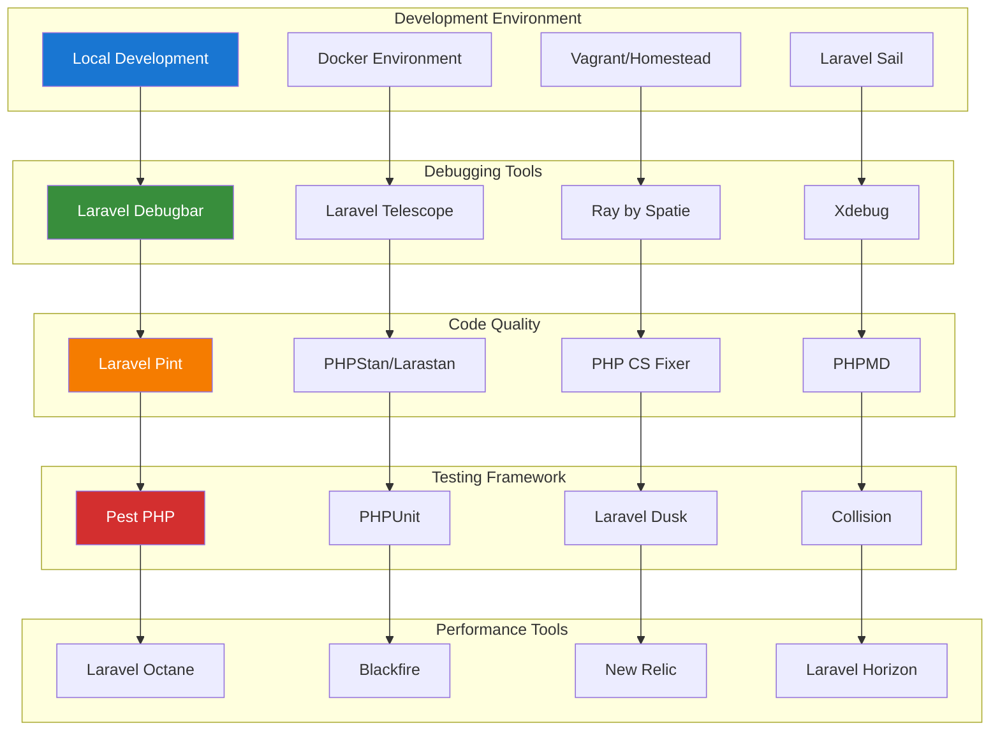

# Development Tools Index

## Table of Contents

- [Overview](#overview)
- [Development Environment Setup](#development-environment-setup)
- [Debugging Tools](#debugging-tools)
- [Code Quality Tools](#code-quality-tools)
- [Performance Analysis](#performance-analysis)
- [Testing Tools](#testing-tools)
- [Documentation Tools](#documentation-tools)
- [Deployment Tools](#deployment-tools)
- [Monitoring and Logging](#monitoring-and-logging)
- [Best Practices](#best-practices)

## Overview

This comprehensive development tools index provides guidance on setting up and using essential development tools for Laravel applications, focusing on productivity, code quality, and debugging capabilities.

### Tool Categories

- **Debugging**: Laravel Debugbar, Telescope, Ray
- **Code Quality**: PHP CS Fixer, Pint, PHPStan, Larastan
- **Testing**: Pest, PHPUnit, Dusk, Collision
- **Performance**: Blackfire, Xdebug, Laravel Octane
- **Documentation**: phpDocumentor, API Documentation
- **Deployment**: Deployer, Forge, Vapor
- **Monitoring**: Horizon, Pulse, New Relic

### Architecture Overview



## Development Environment Setup

### Laravel Sail Configuration

```yaml
# docker-compose.yml
version: '3'
services:
    laravel.test:
        build:
            context: ./vendor/laravel/sail/runtimes/8.2
            dockerfile: Dockerfile
            args:
                WWWGROUP: '${WWWGROUP}'
        image: sail-8.2/app
        extra_hosts:
            - 'host.docker.internal:host-gateway'
        ports:
            - '${APP_PORT:-80}:80'
            - '${VITE_PORT:-5173}:${VITE_PORT:-5173}'
        environment:
            WWWUSER: '${WWWUSER}'
            LARAVEL_SAIL: 1
            XDEBUG_MODE: '${SAIL_XDEBUG_MODE:-off}'
            XDEBUG_CONFIG: '${SAIL_XDEBUG_CONFIG:-client_host=host.docker.internal}'
        volumes:
            - '.:/var/www/html'
        networks:
            - sail
        depends_on:
            - mysql
            - redis
            - meilisearch
            - mailpit
            - selenium
    mysql:
        image: 'mysql/mysql-server:8.0'
        ports:
            - '${FORWARD_DB_PORT:-3306}:3306'
        environment:
            MYSQL_ROOT_PASSWORD: '${DB_PASSWORD}'
            MYSQL_ROOT_HOST: "%"
            MYSQL_DATABASE: '${DB_DATABASE}'
            MYSQL_USER: '${DB_USERNAME}'
            MYSQL_PASSWORD: '${DB_PASSWORD}'
            MYSQL_ALLOW_EMPTY_PASSWORD: 1
        volumes:
            - 'sail-mysql:/var/lib/mysql'
            - './vendor/laravel/sail/database/mysql/create-testing-database.sh:/docker-entrypoint-initdb.d/10-create-testing-database.sh'
        networks:
            - sail
        healthcheck:
            test: ["CMD", "mysqladmin", "ping", "-p${DB_PASSWORD}"]
            retries: 3
            timeout: 5s
    redis:
        image: 'redis:alpine'
        ports:
            - '${FORWARD_REDIS_PORT:-6379}:6379'
        volumes:
            - 'sail-redis:/data'
        networks:
            - sail
        healthcheck:
            test: ["CMD", "redis-cli", "ping"]
            retries: 3
            timeout: 5s
networks:
    sail:
        driver: bridge
volumes:
    sail-mysql:
        driver: local
    sail-redis:
        driver: local
```

### Environment Configuration

```bash
# .env.development
APP_NAME="Chinook Development"
APP_ENV=local
APP_KEY=base64:your-app-key-here
APP_DEBUG=true
APP_URL=http://localhost

# Database
DB_CONNECTION=mysql
DB_HOST=mysql
DB_PORT=3306
DB_DATABASE=chinook_dev
DB_USERNAME=sail
DB_PASSWORD=password

# Cache
CACHE_DRIVER=redis
QUEUE_CONNECTION=redis
SESSION_DRIVER=redis

# Development Tools
DEBUGBAR_ENABLED=true
TELESCOPE_ENABLED=true
RAY_ENABLED=true

# Testing
TESTING_DATABASE=chinook_testing
PEST_PARALLEL=true

# Performance
OCTANE_SERVER=swoole
OCTANE_HTTPS=false
```

## Debugging Tools

### Laravel Debugbar Setup

```bash
# Install Laravel Debugbar
composer require barryvdh/laravel-debugbar --dev

# Publish configuration
php artisan vendor:publish --provider="Barryvdh\Debugbar\ServiceProvider"
```

### Debugbar Configuration

```php
<?php

// config/debugbar.php
return [
    'enabled' => env('DEBUGBAR_ENABLED', null),
    'except' => [
        'telescope*',
        'horizon*',
    ],
    'storage' => [
        'enabled'    => true,
        'driver'     => 'file',
        'path'       => storage_path('debugbar'),
        'connection' => null,
        'provider'   => '',
        'hostname'   => '127.0.0.1',
        'port'       => 2304,
    ],
    'include_vendors' => true,
    'capture_ajax' => true,
    'add_ajax_timing' => false,
    'error_handler' => false,
    'clockwork' => false,
    'collectors' => [
        'phpinfo'         => true,
        'messages'        => true,
        'time'            => true,
        'memory'          => true,
        'exceptions'      => true,
        'log'             => true,
        'db'              => true,
        'views'           => true,
        'route'           => true,
        'auth'            => false,
        'gate'            => true,
        'session'         => true,
        'symfony_request' => true,
        'mail'            => true,
        'laravel'         => false,
        'events'          => false,
        'default_request' => false,
        'logs'            => false,
        'files'           => false,
        'config'          => false,
        'cache'           => false,
        'models'          => true,
        'livewire'        => true,
    ],
    'options' => [
        'auth' => [
            'show_name' => true,
        ],
        'db' => [
            'with_params'       => true,
            'backtrace'         => true,
            'backtrace_exclude_paths' => [],
            'timeline'          => false,
            'explain' => [
                'enabled' => false,
                'types' => ['SELECT'],
            ],
            'hints'             => true,
            'show_copy'         => false,
        ],
        'mail' => [
            'full_log' => false,
        ],
        'views' => [
            'timeline' => false,
            'data' => false,
        ],
        'route' => [
            'label' => true,
        ],
        'logs' => [
            'file' => null,
        ],
        'cache' => [
            'values' => true,
        ],
    ],
    'inject' => true,
    'route_prefix' => '_debugbar',
    'route_domain' => null,
    'theme' => env('DEBUGBAR_THEME', 'auto'),
];
```

## Code Quality Tools

### Laravel Pint Configuration

```json
{
    "preset": "laravel",
    "rules": {
        "simplified_null_return": true,
        "braces": {
            "position_after_control_structures": "same"
        },
        "concat_space": {
            "spacing": "one"
        },
        "method_chaining_indentation": true,
        "multiline_whitespace_before_semicolons": {
            "strategy": "no_multi_line"
        },
        "single_trait_insert_per_statement": true
    },
    "exclude": [
        "bootstrap",
        "storage",
        "vendor"
    ]
}
```

### PHPStan Configuration

```neon
# phpstan.neon
includes:
    - ./vendor/nunomaduro/larastan/extension.neon

parameters:
    paths:
        - app/
        - database/
        - routes/
        - tests/

    level: 8

    ignoreErrors:
        - '#PHPDoc tag @var#'
        - '#Unsafe usage of new static#'

    excludePaths:
        - ./*/*/FileToBeExcluded.php

    checkMissingIterableValueType: false
    checkGenericClassInNonGenericObjectType: false
    reportUnmatchedIgnoredErrors: false

    tmpDir: build/phpstan
    
    parallel:
        jobSize: 20
        maximumNumberOfProcesses: 32
        minimumNumberOfJobsPerProcess: 2
```

## Performance Analysis

### Blackfire Integration

```yaml
# .blackfire.yml
scenarios:
    "Homepage":
        - /
    "API Endpoints":
        - /api/albums
        - /api/tracks
        - /api/artists
    "Admin Panel":
        - /admin/login
        - /admin/dashboard
        - /admin/albums

builds:
    "Development":
        scenarios:
            - "Homepage"
            - "API Endpoints"
    "Production":
        scenarios:
            - "Homepage"
            - "API Endpoints"
            - "Admin Panel"
```

### Performance Monitoring Service

```php
<?php

namespace App\Services;

use Illuminate\Support\Facades\Log;
use Illuminate\Support\Facades\Cache;

class PerformanceMonitoringService
{
    /**
     * Monitor query performance
     */
    public function monitorQueries(): void
    {
        if (app()->environment('local')) {
            \DB::listen(function ($query) {
                if ($query->time > 1000) { // Queries taking more than 1 second
                    Log::warning('Slow query detected', [
                        'sql' => $query->sql,
                        'bindings' => $query->bindings,
                        'time' => $query->time,
                    ]);
                }
            });
        }
    }

    /**
     * Monitor memory usage
     */
    public function monitorMemory(): array
    {
        return [
            'current' => memory_get_usage(true),
            'peak' => memory_get_peak_usage(true),
            'limit' => ini_get('memory_limit'),
        ];
    }

    /**
     * Monitor cache hit rates
     */
    public function monitorCacheHitRate(): array
    {
        $hits = Cache::get('cache_hits', 0);
        $misses = Cache::get('cache_misses', 0);
        $total = $hits + $misses;
        
        return [
            'hits' => $hits,
            'misses' => $misses,
            'total' => $total,
            'hit_rate' => $total > 0 ? ($hits / $total) * 100 : 0,
        ];
    }
}
```

## Testing Tools

### Pest Configuration

```php
<?php

// tests/Pest.php
use Illuminate\Foundation\Testing\RefreshDatabase;use old\TestCase;

uses(TestCase::class, RefreshDatabase::class)->in('Feature');
uses(TestCase::class)->in('Unit');

expect()->extend('toBeOne', function () {
    return $this->toBe(1);
});

function something()
{
    return true;
}
```

### Custom Test Helpers

```php
<?php

namespace Tests\Helpers;

use App\Models\User;
use Illuminate\Database\Eloquent\Model;

class TestHelpers
{
    /**
     * Create authenticated user
     */
    public static function createAuthenticatedUser(array $attributes = []): User
    {
        $user = User::factory()->create($attributes);
        auth()->login($user);
        
        return $user;
    }

    /**
     * Assert model has specific attributes
     */
    public static function assertModelHasAttributes(Model $model, array $attributes): void
    {
        foreach ($attributes as $attribute => $value) {
            expect($model->getAttribute($attribute))->toBe($value);
        }
    }

    /**
     * Create test data for specific model
     */
    public static function createTestData(string $modelClass, int $count = 1): mixed
    {
        $factory = $modelClass::factory();
        
        return $count === 1 ? $factory->create() : $factory->count($count)->create();
    }
}
```

## Documentation Tools

### API Documentation Setup

```php
<?php

namespace App\Http\Controllers\Api;

use OpenApi\Annotations as OA;

/**
 * @OA\Info(
 *     title="Chinook API",
 *     version="1.0.0",
 *     description="Chinook Music Store API Documentation",
 *     @OA\Contact(
 *         email="api@chinook.com"
 *     ),
 *     @OA\License(
 *         name="MIT",
 *         url="https://opensource.org/licenses/MIT"
 *     )
 * )
 * @OA\Server(
 *     url="http://localhost:8000/api",
 *     description="Development Server"
 * )
 * @OA\Server(
 *     url="https://api.chinook.com",
 *     description="Production Server"
 * )
 */
class ApiController extends Controller
{
    /**
     * @OA\Get(
     *     path="/albums",
     *     summary="Get list of albums",
     *     tags={"Albums"},
     *     @OA\Parameter(
     *         name="page",
     *         in="query",
     *         description="Page number",
     *         required=false,
     *         @OA\Schema(type="integer")
     *     ),
     *     @OA\Response(
     *         response=200,
     *         description="Successful operation",
     *         @OA\JsonContent(
     *             @OA\Property(property="data", type="array", @OA\Items(ref="#/components/schemas/Album")),
     *             @OA\Property(property="meta", ref="#/components/schemas/PaginationMeta")
     *         )
     *     )
     * )
     */
    public function index()
    {
        // Implementation
    }
}
```

## Best Practices

### Development Workflow

1. **Environment Setup**
   - Use Laravel Sail for consistent development environments
   - Configure proper debugging tools
   - Set up code quality tools from the start
   - Implement automated testing

2. **Code Quality**
   - Use Laravel Pint for code formatting
   - Implement PHPStan for static analysis
   - Write comprehensive tests
   - Document APIs and complex logic

3. **Performance Monitoring**
   - Monitor database queries
   - Track memory usage
   - Implement caching strategies
   - Use profiling tools

4. **Debugging Strategy**
   - Use Laravel Debugbar for development
   - Implement comprehensive logging
   - Use Ray for advanced debugging
   - Set up proper error handling

## Deployment Tools

### Laravel Forge Integration

Laravel Forge provides seamless deployment and server management for Laravel applications.

```bash
# Deploy via Forge
forge deploy production

# Quick deployment script
forge deploy:quick production --branch=main
```

### Deployment Automation

```yaml
# .forge/deploy.sh
cd /home/forge/your-app

git pull origin main
composer install --no-dev --optimize-autoloader
npm ci && npm run build

php artisan migrate --force
php artisan config:cache
php artisan route:cache
php artisan view:cache
php artisan queue:restart

echo "Deployment completed successfully"
```

## Monitoring and Logging

### Application Monitoring

```php
<?php

namespace App\Services;

use Illuminate\Support\Facades\Log;

class MonitoringService
{
    public function logPerformanceMetrics(): void
    {
        Log::info('Performance Metrics', [
            'memory_usage' => memory_get_usage(true),
            'peak_memory' => memory_get_peak_usage(true),
            'execution_time' => microtime(true) - LARAVEL_START,
        ]);
    }

    public function logDatabaseMetrics(): void
    {
        $queries = \DB::getQueryLog();

        Log::info('Database Metrics', [
            'query_count' => count($queries),
            'slow_queries' => collect($queries)->where('time', '>', 1000)->count(),
        ]);
    }
}
```

### Error Tracking

```php
<?php

// config/logging.php
'channels' => [
    'stack' => [
        'driver' => 'stack',
        'channels' => ['single', 'bugsnag'],
        'ignore_exceptions' => false,
    ],

    'bugsnag' => [
        'driver' => 'bugsnag',
    ],
],
```

This comprehensive development tools index provides the foundation for a productive Laravel development environment with proper debugging, testing, and code quality tools.

---

**Next Steps:**

- Review [Development Debugging Tools Guide](010-debugbar-guide.md) for detailed debugging setup
- Explore [Code Quality and Formatting Guide](020-pint-code-quality-guide.md) for code quality tools
- Check [Modern Testing with Pest Guide](../testing/010-pest-testing-guide.md) for testing strategies
