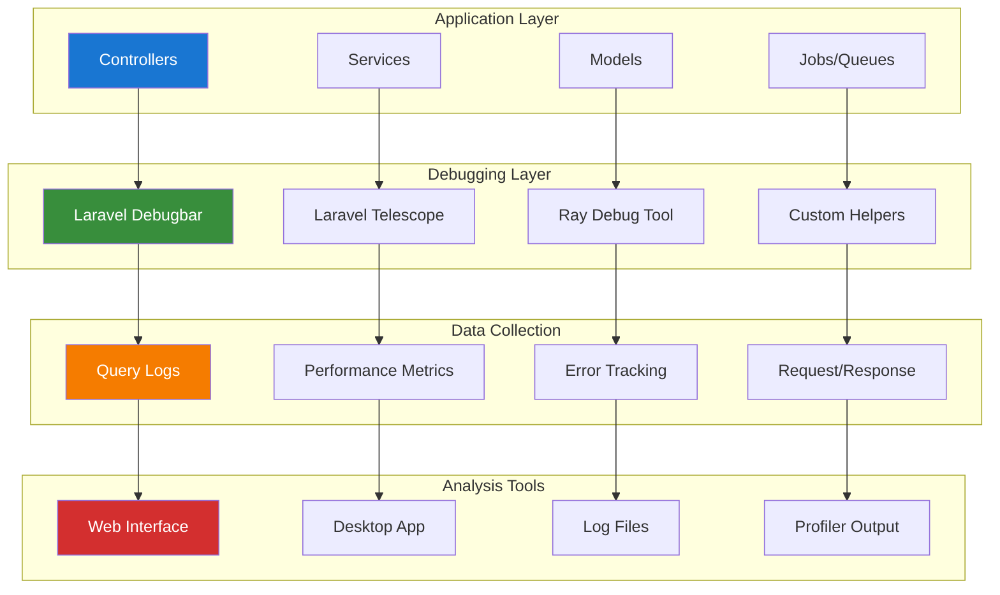

# Development Debugging Tools Guide

## Table of Contents

- [Overview](#overview)
- [Laravel Debugbar Setup](#laravel-debugbar-setup)
- [Laravel Telescope Integration](#laravel-telescope-integration)
- [Ray Debugging Tool](#ray-debugging-tool)
- [Xdebug Configuration](#xdebug-configuration)
- [Custom Debug Helpers](#custom-debug-helpers)
- [Performance Debugging](#performance-debugging)
- [Database Query Debugging](#database-query-debugging)
- [API Debugging](#api-debugging)
- [Best Practices](#best-practices)

## Overview

This guide provides comprehensive debugging tools and techniques for Laravel development, focusing on identifying performance issues, tracking database queries, and debugging application logic effectively.

### Debugging Tool Stack

- **Laravel Debugbar**: Web-based debugging toolbar
- **Laravel Telescope**: Application monitoring and debugging
- **Ray**: Advanced debugging tool by Spatie
- **Xdebug**: PHP debugging and profiling
- **Custom Helpers**: Application-specific debugging utilities

### Architecture Overview



## Laravel Debugbar Setup

### Installation and Configuration

```bash
# Install Laravel Debugbar
composer require barryvdh/laravel-debugbar --dev

# Publish configuration
php artisan vendor:publish --provider="Barryvdh\Debugbar\ServiceProvider"
```

### Enhanced Configuration

```php
<?php

// config/debugbar.php
return [
    'enabled' => env('DEBUGBAR_ENABLED', null),
    
    'except' => [
        'telescope*',
        'horizon*',
        'nova*',
        '_debugbar*',
    ],
    
    'storage' => [
        'enabled'    => true,
        'driver'     => 'file',
        'path'       => storage_path('debugbar'),
        'connection' => null,
    ],
    
    'include_vendors' => true,
    'capture_ajax' => true,
    'add_ajax_timing' => true,
    'error_handler' => false,
    
    'collectors' => [
        'phpinfo'         => true,
        'messages'        => true,
        'time'            => true,
        'memory'          => true,
        'exceptions'      => true,
        'log'             => true,
        'db'              => true,
        'views'           => true,
        'route'           => true,
        'auth'            => true,
        'gate'            => true,
        'session'         => true,
        'symfony_request' => true,
        'mail'            => true,
        'laravel'         => false,
        'events'          => true,
        'default_request' => false,
        'logs'            => false,
        'files'           => false,
        'config'          => false,
        'cache'           => true,
        'models'          => true,
        'livewire'        => true,
    ],
    
    'options' => [
        'db' => [
            'with_params'       => true,
            'backtrace'         => true,
            'backtrace_exclude_paths' => [
                base_path('vendor'),
            ],
            'timeline'          => true,
            'explain' => [
                'enabled' => true,
                'types' => ['SELECT'],
            ],
            'hints'             => true,
            'show_copy'         => true,
        ],
        'mail' => [
            'full_log' => true,
        ],
        'views' => [
            'timeline' => true,
            'data' => true,
        ],
        'route' => [
            'label' => true,
        ],
        'cache' => [
            'values' => true,
        ],
    ],
    
    'inject' => true,
    'route_prefix' => '_debugbar',
    'route_domain' => null,
    'theme' => env('DEBUGBAR_THEME', 'auto'),
];
```

### Custom Debugbar Messages

```php
<?php

namespace App\Services;

use Barryvdh\Debugbar\Facades\Debugbar;

class DebugService
{
    /**
     * Log debug information
     */
    public function debug(string $message, array $context = []): void
    {
        if (app()->environment('local') && config('debugbar.enabled')) {
            Debugbar::info($message, $context);
        }
    }

    /**
     * Log performance metrics
     */
    public function logPerformance(string $operation, float $startTime): void
    {
        $duration = microtime(true) - $startTime;
        
        Debugbar::addMessage("Performance: {$operation} took {$duration}s", 'performance');
        
        if ($duration > 1.0) {
            Debugbar::warning("Slow operation detected: {$operation}");
        }
    }

    /**
     * Log database query analysis
     */
    public function logQueryAnalysis(string $sql, array $bindings, float $time): void
    {
        $message = [
            'sql' => $sql,
            'bindings' => $bindings,
            'time' => $time,
            'formatted_time' => number_format($time, 2) . 'ms',
        ];
        
        if ($time > 100) {
            Debugbar::warning('Slow query detected', $message);
        } else {
            Debugbar::info('Query executed', $message);
        }
    }

    /**
     * Log memory usage
     */
    public function logMemoryUsage(string $checkpoint): void
    {
        $memory = [
            'checkpoint' => $checkpoint,
            'current' => memory_get_usage(true),
            'peak' => memory_get_peak_usage(true),
            'formatted_current' => $this->formatBytes(memory_get_usage(true)),
            'formatted_peak' => $this->formatBytes(memory_get_peak_usage(true)),
        ];
        
        Debugbar::addMessage($memory, 'memory');
    }

    private function formatBytes(int $bytes): string
    {
        $units = ['B', 'KB', 'MB', 'GB'];
        $bytes = max($bytes, 0);
        $pow = floor(($bytes ? log($bytes) : 0) / log(1024));
        $pow = min($pow, count($units) - 1);
        
        $bytes /= pow(1024, $pow);
        
        return round($bytes, 2) . ' ' . $units[$pow];
    }
}
```

## Laravel Telescope Integration

### Installation and Setup

```bash
# Install Laravel Telescope
composer require laravel/telescope --dev

# Publish assets and configuration
php artisan telescope:install

# Run migrations
php artisan migrate

# Publish configuration (optional)
php artisan vendor:publish --tag=telescope-config
```

### Enhanced Telescope Configuration

```php
<?php

// config/telescope.php
return [
    'enabled' => env('TELESCOPE_ENABLED', true),
    
    'domain' => env('TELESCOPE_DOMAIN'),
    'path' => env('TELESCOPE_PATH', 'telescope'),
    
    'driver' => env('TELESCOPE_DRIVER', 'database'),
    
    'storage' => [
        'database' => [
            'connection' => env('DB_CONNECTION', 'mysql'),
            'chunk' => 1000,
        ],
    ],
    
    'queue' => [
        'connection' => env('TELESCOPE_QUEUE_CONNECTION', 'redis'),
        'queue' => env('TELESCOPE_QUEUE', 'default'),
    ],
    
    'watchers' => [
        Watchers\BatchWatcher::class => env('TELESCOPE_BATCH_WATCHER', true),
        Watchers\CacheWatcher::class => [
            'enabled' => env('TELESCOPE_CACHE_WATCHER', true),
            'hidden' => [],
        ],
        Watchers\CommandWatcher::class => [
            'enabled' => env('TELESCOPE_COMMAND_WATCHER', true),
            'ignore' => [
                'telescope:prune',
                'horizon:*',
                'queue:*',
            ],
        ],
        Watchers\DumpWatcher::class => env('TELESCOPE_DUMP_WATCHER', true),
        Watchers\EventWatcher::class => [
            'enabled' => env('TELESCOPE_EVENT_WATCHER', true),
            'ignore' => [
                'Illuminate\Auth\Events\*',
                'Illuminate\Cache\Events\*',
                'Illuminate\Database\Events\*',
            ],
        ],
        Watchers\ExceptionWatcher::class => env('TELESCOPE_EXCEPTION_WATCHER', true),
        Watchers\JobWatcher::class => env('TELESCOPE_JOB_WATCHER', true),
        Watchers\LogWatcher::class => [
            'enabled' => env('TELESCOPE_LOG_WATCHER', true),
            'level' => 'error',
        ],
        Watchers\MailWatcher::class => env('TELESCOPE_MAIL_WATCHER', true),
        Watchers\ModelWatcher::class => [
            'enabled' => env('TELESCOPE_MODEL_WATCHER', true),
            'events' => ['eloquent.*'],
            'hydrations' => true,
        ],
        Watchers\NotificationWatcher::class => env('TELESCOPE_NOTIFICATION_WATCHER', true),
        Watchers\QueryWatcher::class => [
            'enabled' => env('TELESCOPE_QUERY_WATCHER', true),
            'ignore_packages' => true,
            'ignore_paths' => [],
            'slow' => 100,
        ],
        Watchers\RedisWatcher::class => env('TELESCOPE_REDIS_WATCHER', true),
        Watchers\RequestWatcher::class => [
            'enabled' => env('TELESCOPE_REQUEST_WATCHER', true),
            'size_limit' => env('TELESCOPE_RESPONSE_SIZE_LIMIT', 64),
            'ignore_http_methods' => [],
            'ignore_status_codes' => [],
        ],
        Watchers\ScheduleWatcher::class => env('TELESCOPE_SCHEDULE_WATCHER', true),
        Watchers\ViewWatcher::class => env('TELESCOPE_VIEW_WATCHER', true),
    ],
];
```

## Ray Debugging Tool

### Installation and Setup

```bash
# Install Ray
composer require spatie/laravel-ray --dev

# Publish configuration
php artisan vendor:publish --provider="Spatie\LaravelRay\RayServiceProvider"
```

### Ray Configuration

```php
<?php

// config/ray.php
return [
    'enable' => env('RAY_ENABLED', true),
    
    'host' => env('RAY_HOST', 'localhost'),
    'port' => env('RAY_PORT', 23517),
    
    'remote_path' => env('RAY_REMOTE_PATH'),
    'local_path' => env('RAY_LOCAL_PATH'),
    
    'always_send_raw_values' => false,
    
    'not_defined' => true,
];
```

### Advanced Ray Usage

```php
<?php

namespace App\Services;

use Spatie\Ray\Ray;

class RayDebugService
{
    /**
     * Debug complex data structures
     */
    public function debugData(mixed $data, string $label = ''): void
    {
        if (app()->environment('local')) {
            ray($data)->label($label ?: 'Debug Data');
        }
    }

    /**
     * Debug SQL queries with Ray
     */
    public function debugQueries(): void
    {
        if (app()->environment('local')) {
            ray()->showQueries();
        }
    }

    /**
     * Debug performance with Ray
     */
    public function debugPerformance(callable $callback, string $label = 'Performance'): mixed
    {
        if (app()->environment('local')) {
            $startTime = microtime(true);
            $result = $callback();
            $duration = microtime(true) - $startTime;
            
            ray()->measure($label, $duration);
            
            return $result;
        }
        
        return $callback();
    }

    /**
     * Debug model changes
     */
    public function debugModelChanges($model): void
    {
        if (app()->environment('local')) {
            ray($model->getDirty())->label('Model Changes');
            ray($model->getOriginal())->label('Original Values');
        }
    }

    /**
     * Debug API responses
     */
    public function debugApiResponse($response, string $endpoint = ''): void
    {
        if (app()->environment('local')) {
            ray([
                'endpoint' => $endpoint,
                'status' => $response->status(),
                'headers' => $response->headers(),
                'body' => $response->json(),
            ])->label('API Response');
        }
    }
}
```

## Xdebug Configuration

### PHP Configuration

```ini
; php.ini or .env configuration for Xdebug 3
[xdebug]
zend_extension=xdebug.so
xdebug.mode=debug,develop,coverage
xdebug.start_with_request=yes
xdebug.client_host=host.docker.internal
xdebug.client_port=9003
xdebug.log=/tmp/xdebug.log
xdebug.idekey=PHPSTORM
xdebug.max_nesting_level=512
```

### VS Code Configuration

```json
{
    "version": "0.2.0",
    "configurations": [
        {
            "name": "Listen for Xdebug",
            "type": "php",
            "request": "launch",
            "port": 9003,
            "pathMappings": {
                "/var/www/html": "${workspaceFolder}"
            },
            "ignore": [
                "**/vendor/**/*.php"
            ]
        }
    ]
}
```

## Custom Debug Helpers

### Debug Helper Service

```php
<?php

namespace App\Services;

use Illuminate\Support\Facades\Log;
use Illuminate\Support\Facades\DB;

class CustomDebugHelper
{
    /**
     * Debug with context
     */
    public function debugWithContext(mixed $data, array $context = []): void
    {
        if (app()->environment('local')) {
            $debugInfo = [
                'timestamp' => now()->toISOString(),
                'memory_usage' => memory_get_usage(true),
                'request_id' => request()->header('X-Request-ID'),
                'user_id' => auth()->id(),
                'context' => $context,
                'data' => $data,
            ];
            
            Log::debug('Custom Debug', $debugInfo);
            
            if (function_exists('ray')) {
                ray($debugInfo)->label('Debug Context');
            }
        }
    }

    /**
     * Debug SQL query execution plan
     */
    public function debugQueryPlan(string $sql, array $bindings = []): void
    {
        if (app()->environment('local')) {
            $explainQuery = "EXPLAIN " . $sql;
            $plan = DB::select($explainQuery, $bindings);
            
            ray([
                'sql' => $sql,
                'bindings' => $bindings,
                'execution_plan' => $plan,
            ])->label('Query Execution Plan');
        }
    }

    /**
     * Debug cache operations
     */
    public function debugCache(string $operation, string $key, mixed $value = null): void
    {
        if (app()->environment('local')) {
            $cacheInfo = [
                'operation' => $operation,
                'key' => $key,
                'value' => $value,
                'timestamp' => now()->toISOString(),
            ];
            
            ray($cacheInfo)->label('Cache Operation');
        }
    }

    /**
     * Debug request/response cycle
     */
    public function debugRequestResponse(): void
    {
        if (app()->environment('local')) {
            $requestInfo = [
                'method' => request()->method(),
                'url' => request()->fullUrl(),
                'headers' => request()->headers->all(),
                'parameters' => request()->all(),
                'ip' => request()->ip(),
                'user_agent' => request()->userAgent(),
            ];
            
            ray($requestInfo)->label('Request Information');
        }
    }
}
```

## Performance Debugging

### Performance Monitoring Middleware

```php
<?php

namespace App\Http\Middleware;

use Closure;
use Illuminate\Http\Request;
use Illuminate\Support\Facades\Log;

class PerformanceDebugMiddleware
{
    public function handle(Request $request, Closure $next)
    {
        $startTime = microtime(true);
        $startMemory = memory_get_usage(true);
        
        $response = $next($request);
        
        $endTime = microtime(true);
        $endMemory = memory_get_usage(true);
        
        $performanceData = [
            'url' => $request->fullUrl(),
            'method' => $request->method(),
            'execution_time' => round(($endTime - $startTime) * 1000, 2) . 'ms',
            'memory_usage' => $this->formatBytes($endMemory - $startMemory),
            'peak_memory' => $this->formatBytes(memory_get_peak_usage(true)),
            'status_code' => $response->getStatusCode(),
        ];
        
        if (app()->environment('local')) {
            Log::debug('Performance Debug', $performanceData);
            
            if (function_exists('ray')) {
                ray($performanceData)->label('Performance Metrics');
            }
        }
        
        return $response;
    }
    
    private function formatBytes(int $bytes): string
    {
        $units = ['B', 'KB', 'MB', 'GB'];
        $bytes = max($bytes, 0);
        $pow = floor(($bytes ? log($bytes) : 0) / log(1024));
        $pow = min($pow, count($units) - 1);
        
        $bytes /= pow(1024, $pow);
        
        return round($bytes, 2) . ' ' . $units[$pow];
    }
}
```

## Database Query Debugging

### Query Performance Analysis

```php
<?php

namespace App\Services;

use Illuminate\Support\Facades\DB;
use Illuminate\Support\Facades\Log;

class QueryDebugService
{
    public function enableQueryLogging(): void
    {
        if (app()->environment('local')) {
            DB::enableQueryLog();
        }
    }

    public function logSlowQueries(): void
    {
        if (app()->environment('local')) {
            DB::listen(function ($query) {
                if ($query->time > 1000) { // Queries taking more than 1 second
                    Log::warning('Slow Query Detected', [
                        'sql' => $query->sql,
                        'bindings' => $query->bindings,
                        'time' => $query->time . 'ms',
                        'connection' => $query->connectionName,
                    ]);

                    if (function_exists('ray')) {
                        ray([
                            'type' => 'slow_query',
                            'sql' => $query->sql,
                            'time' => $query->time,
                            'bindings' => $query->bindings,
                        ])->red();
                    }
                }
            });
        }
    }

    public function analyzeQueryPlan(string $sql, array $bindings = []): array
    {
        if (!app()->environment('local')) {
            return [];
        }

        try {
            $explainQuery = "EXPLAIN " . $sql;
            $plan = DB::select($explainQuery, $bindings);

            ray([
                'sql' => $sql,
                'bindings' => $bindings,
                'execution_plan' => $plan,
            ])->label('Query Execution Plan');

            return $plan;
        } catch (\Exception $e) {
            Log::error('Query plan analysis failed', [
                'sql' => $sql,
                'error' => $e->getMessage(),
            ]);

            return [];
        }
    }
}
```

## API Debugging

### API Request/Response Debugging

```php
<?php

namespace App\Http\Middleware;

use Closure;
use Illuminate\Http\Request;
use Illuminate\Support\Facades\Log;

class ApiDebugMiddleware
{
    public function handle(Request $request, Closure $next)
    {
        if (!app()->environment('local')) {
            return $next($request);
        }

        $startTime = microtime(true);

        // Log incoming request
        $this->logRequest($request);

        $response = $next($request);

        // Log outgoing response
        $this->logResponse($request, $response, $startTime);

        return $response;
    }

    private function logRequest(Request $request): void
    {
        $requestData = [
            'method' => $request->method(),
            'url' => $request->fullUrl(),
            'headers' => $this->sanitizeHeaders($request->headers->all()),
            'body' => $this->sanitizeBody($request->all()),
            'ip' => $request->ip(),
            'user_agent' => $request->userAgent(),
            'timestamp' => now()->toISOString(),
        ];

        Log::debug('API Request', $requestData);

        if (function_exists('ray')) {
            ray($requestData)->label('API Request')->blue();
        }
    }

    private function logResponse(Request $request, $response, float $startTime): void
    {
        $duration = round((microtime(true) - $startTime) * 1000, 2);

        $responseData = [
            'url' => $request->fullUrl(),
            'status_code' => $response->getStatusCode(),
            'duration' => $duration . 'ms',
            'headers' => $response->headers->all(),
            'size' => strlen($response->getContent()),
        ];

        // Only log response body for errors or if explicitly enabled
        if ($response->getStatusCode() >= 400 || config('app.debug_api_responses')) {
            $responseData['body'] = $this->sanitizeResponseBody($response->getContent());
        }

        Log::debug('API Response', $responseData);

        if (function_exists('ray')) {
            $color = $response->getStatusCode() >= 400 ? 'red' : 'green';
            ray($responseData)->label('API Response')->$color();
        }
    }

    private function sanitizeHeaders(array $headers): array
    {
        $sensitiveHeaders = ['authorization', 'cookie', 'x-api-key'];

        foreach ($sensitiveHeaders as $header) {
            if (isset($headers[$header])) {
                $headers[$header] = ['[REDACTED]'];
            }
        }

        return $headers;
    }

    private function sanitizeBody(array $body): array
    {
        $sensitiveFields = ['password', 'password_confirmation', 'token', 'secret'];

        foreach ($sensitiveFields as $field) {
            if (isset($body[$field])) {
                $body[$field] = '[REDACTED]';
            }
        }

        return $body;
    }

    private function sanitizeResponseBody(string $content): string
    {
        $data = json_decode($content, true);

        if (json_last_error() === JSON_ERROR_NONE && is_array($data)) {
            return json_encode($this->sanitizeBody($data));
        }

        return $content;
    }
}
```

## Best Practices

### Debugging Guidelines

1. **Environment-Specific Debugging**
   - Only enable debugging tools in development
   - Use environment variables for configuration
   - Implement proper security for debugging endpoints
   - Clean up debug code before production

2. **Performance Considerations**
   - Monitor the impact of debugging tools
   - Use selective debugging for specific issues
   - Implement proper logging levels
   - Regular cleanup of debug logs

3. **Security Best Practices**
   - Never expose sensitive data in debug output
   - Restrict access to debugging tools
   - Use proper authentication for debug interfaces
   - Sanitize debug information

4. **Debugging Workflow**
   - Start with Laravel Debugbar for general issues
   - Use Telescope for application monitoring
   - Use Ray for complex debugging scenarios
   - Use Xdebug for step-by-step debugging

This comprehensive debugging guide provides the tools and techniques needed for effective Laravel application debugging and performance analysis.

---

**Next Steps:**

- Review [Code Quality and Formatting Guide](020-pint-code-quality-guide.md) for code quality tools
- Explore [Enhanced Spatie ActivityLog Guide](../150-spatie-activitylog-guide.md) for activity logging
- Check [Modern Testing with Pest Guide](../testing/010-pest-testing-guide.md) for testing strategies
