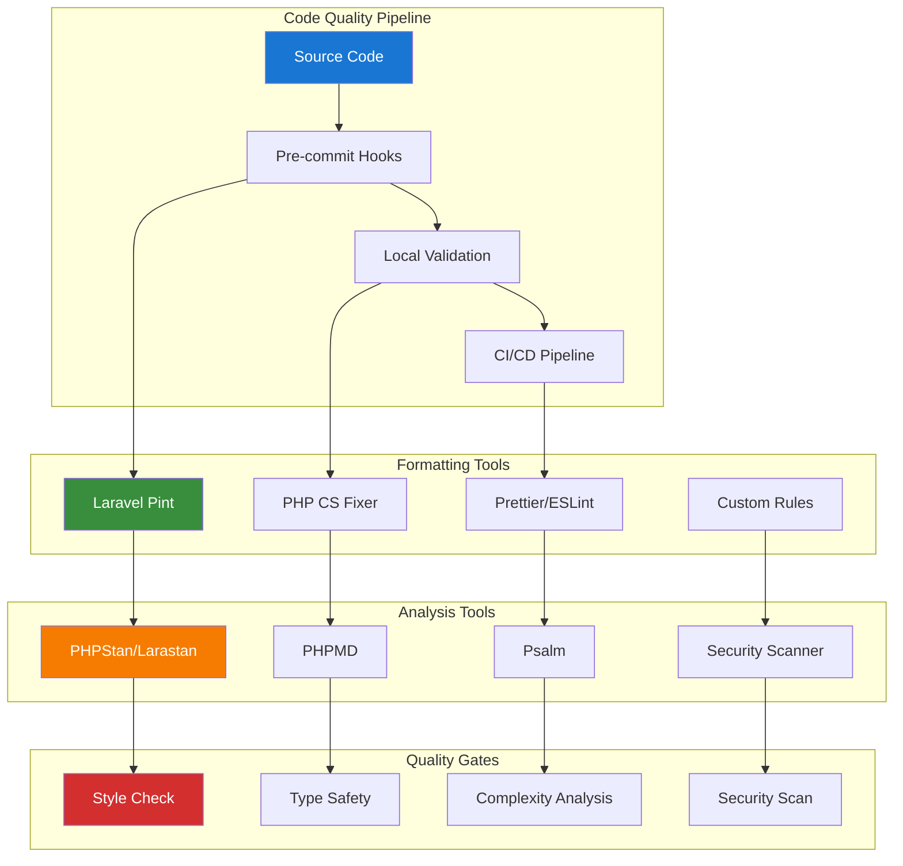

# Code Quality and Formatting Guide

## Table of Contents

- [Overview](#overview)
- [Laravel Pint Setup](#laravel-pint-setup)
- [PHPStan Configuration](#phpstan-configuration)
- [PHP CS Fixer Integration](#php-cs-fixer-integration)
- [Code Quality Automation](#code-quality-automation)
- [Pre-commit Hooks](#pre-commit-hooks)
- [CI/CD Integration](#cicd-integration)
- [Custom Rules](#custom-rules)
- [IDE Integration](#ide-integration)
- [Best Practices](#best-practices)

## Overview

This guide provides comprehensive code quality and formatting tools for Laravel applications, ensuring consistent code style, detecting potential issues, and maintaining high code quality standards.

### Code Quality Tool Stack

- **Laravel Pint**: Code formatting and style fixing
- **PHPStan/Larastan**: Static analysis and type checking
- **PHP CS Fixer**: Advanced code style fixing
- **PHPMD**: Mess detection and code complexity analysis
- **Psalm**: Advanced static analysis

### Architecture Overview



## Laravel Pint Setup

### Installation and Basic Configuration

```bash
# Laravel Pint is included with Laravel by default
# For standalone installation:
composer require laravel/pint --dev

# Run Pint
./vendor/bin/pint

# Run with specific preset
./vendor/bin/pint --preset laravel

# Test without making changes
./vendor/bin/pint --test

# Show diff of changes
./vendor/bin/pint --diff
```

### Advanced Pint Configuration

```json
{
    "preset": "laravel",
    "rules": {
        "simplified_null_return": true,
        "braces": {
            "position_after_control_structures": "same"
        },
        "concat_space": {
            "spacing": "one"
        },
        "method_chaining_indentation": true,
        "multiline_whitespace_before_semicolons": {
            "strategy": "no_multi_line"
        },
        "single_trait_insert_per_statement": true,
        "array_syntax": {
            "syntax": "short"
        },
        "binary_operator_spaces": {
            "default": "single_space"
        },
        "blank_line_after_namespace": true,
        "blank_line_after_opening_tag": true,
        "blank_line_before_statement": {
            "statements": ["return", "throw", "try"]
        },
        "cast_spaces": true,
        "class_attributes_separation": {
            "elements": {
                "method": "one",
                "property": "one"
            }
        },
        "clean_namespace": true,
        "compact_nullable_typehint": true,
        "declare_equal_normalize": true,
        "elseif": true,
        "encoding": true,
        "full_opening_tag": true,
        "function_declaration": true,
        "function_typehint_space": true,
        "heredoc_to_nowdoc": true,
        "include": true,
        "increment_style": true,
        "indentation_type": true,
        "linebreak_after_opening_tag": true,
        "line_ending": true,
        "lowercase_cast": true,
        "lowercase_constants": true,
        "lowercase_keywords": true,
        "magic_constant_casing": true,
        "magic_method_casing": true,
        "method_argument_space": {
            "on_multiline": "ensure_fully_multiline"
        },
        "native_function_casing": true,
        "no_alias_functions": true,
        "no_closing_tag": true,
        "no_empty_phpdoc": true,
        "no_empty_statement": true,
        "no_extra_blank_lines": {
            "tokens": [
                "extra",
                "throw",
                "use"
            ]
        },
        "no_leading_import_slash": true,
        "no_leading_namespace_whitespace": true,
        "no_mixed_echo_print": true,
        "no_multiline_whitespace_around_double_arrow": true,
        "no_short_bool_cast": true,
        "no_singleline_whitespace_before_semicolons": true,
        "no_spaces_after_function_name": true,
        "no_spaces_around_offset": true,
        "no_spaces_inside_parenthesis": true,
        "no_trailing_comma_in_list_call": true,
        "no_trailing_comma_in_singleline_array": true,
        "no_trailing_whitespace": true,
        "no_trailing_whitespace_in_comment": true,
        "no_unneeded_control_parentheses": true,
        "no_unused_imports": true,
        "no_whitespace_before_comma_in_array": true,
        "no_whitespace_in_blank_line": true,
        "normalize_index_brace": true,
        "object_operator_without_whitespace": true,
        "ordered_imports": {
            "sort_algorithm": "alpha"
        },
        "phpdoc_indent": true,
        "phpdoc_inline_tag_normalizer": true,
        "phpdoc_no_access": true,
        "phpdoc_no_package": true,
        "phpdoc_no_useless_inheritdoc": true,
        "phpdoc_scalar": true,
        "phpdoc_single_line_var_spacing": true,
        "phpdoc_summary": true,
        "phpdoc_to_comment": true,
        "phpdoc_trim": true,
        "phpdoc_types": true,
        "phpdoc_var_without_name": true,
        "return_type_declaration": true,
        "self_accessor": true,
        "short_scalar_cast": true,
        "single_blank_line_at_eof": true,
        "single_blank_line_before_namespace": true,
        "single_class_element_per_statement": true,
        "single_import_per_statement": true,
        "single_line_after_imports": true,
        "single_line_comment_style": {
            "comment_types": ["hash"]
        },
        "single_quote": true,
        "space_after_semicolon": {
            "remove_in_empty_for_expressions": true
        },
        "standardize_not_equals": true,
        "switch_case_semicolon_to_colon": true,
        "switch_case_space": true,
        "ternary_operator_spaces": true,
        "trailing_comma_in_multiline": true,
        "trim_array_spaces": true,
        "unary_operator_spaces": true,
        "visibility_required": true,
        "whitespace_after_comma_in_array": true
    },
    "exclude": [
        "bootstrap",
        "storage",
        "vendor",
        "node_modules",
        "public/build"
    ]
}
```

## PHPStan Configuration

### Installation and Setup

```bash
# Install PHPStan and Larastan
composer require --dev phpstan/phpstan
composer require --dev nunomaduro/larastan

# Create configuration file
touch phpstan.neon

# Run PHPStan
./vendor/bin/phpstan analyse

# Run with specific level
./vendor/bin/phpstan analyse --level=8

# Generate baseline
./vendor/bin/phpstan analyse --generate-baseline
```

### Advanced PHPStan Configuration

```neon
# phpstan.neon
includes:
    - ./vendor/nunomaduro/larastan/extension.neon

parameters:
    paths:
        - app/
        - database/
        - routes/
        - tests/

    level: 8

    ignoreErrors:
        - '#PHPDoc tag @var#'
        - '#Unsafe usage of new static#'
        - '#Call to an undefined method Illuminate\\Database\\Eloquent\\Builder#'

    excludePaths:
        - ./*/*/FileToBeExcluded.php
        - bootstrap/
        - storage/
        - vendor/

    checkMissingIterableValueType: false
    checkGenericClassInNonGenericObjectType: false
    reportUnmatchedIgnoredErrors: false

    tmpDir: build/phpstan
    
    parallel:
        jobSize: 20
        maximumNumberOfProcesses: 32
        minimumNumberOfJobsPerProcess: 2

    # Laravel-specific configuration
    laravel:
        container_xml_path: bootstrap/cache/container.xml
        
    # Custom rules
    customRulesetUsed: true
    
    # Bleeding edge features
    checkAlwaysTrueCheckTypeFunctionCall: true
    checkAlwaysTrueInstanceof: true
    checkAlwaysTrueStrictComparison: true
    checkExplicitMixedMissingReturn: true
    checkFunctionNameCase: true
    checkInternalClassCaseSensitivity: true
    checkMissingClosureNativeReturnTypehintRule: true
    checkMissingVarTagTypehint: true
    checkTooWideReturnTypesInProtectedAndPublicMethods: true
    checkUninitializedProperties: true
    checkDynamicProperties: true
```

### Custom PHPStan Rules

```php
<?php

namespace App\PHPStan\Rules;

use PhpParser\Node;
use PhpParser\Node\Expr\MethodCall;
use PHPStan\Analyser\Scope;
use PHPStan\Rules\Rule;
use PHPStan\Rules\RuleErrorBuilder;

/**
 * @implements Rule<MethodCall>
 */
class NoDirectDatabaseCallsRule implements Rule
{
    public function getNodeType(): string
    {
        return MethodCall::class;
    }

    public function processNode(Node $node, Scope $scope): array
    {
        if (!$node instanceof MethodCall) {
            return [];
        }

        // Check for direct DB facade calls in controllers
        if ($this->isControllerClass($scope) && $this->isDbFacadeCall($node)) {
            return [
                RuleErrorBuilder::message('Direct database calls should not be used in controllers. Use repositories or services instead.')
                    ->build(),
            ];
        }

        return [];
    }

    private function isControllerClass(Scope $scope): bool
    {
        $className = $scope->getClassReflection()?->getName();
        
        return $className && str_ends_with($className, 'Controller');
    }

    private function isDbFacadeCall(MethodCall $node): bool
    {
        return $node->var instanceof Node\Name && 
               $node->var->toString() === 'DB';
    }
}
```

## PHP CS Fixer Integration

### Installation and Configuration

```bash
# Install PHP CS Fixer
composer require --dev friendsofphp/php-cs-fixer

# Create configuration file
touch .php-cs-fixer.php

# Run PHP CS Fixer
./vendor/bin/php-cs-fixer fix

# Dry run
./vendor/bin/php-cs-fixer fix --dry-run --diff
```

### PHP CS Fixer Configuration

```php
<?php

// .php-cs-fixer.php
$finder = PhpCsFixer\Finder::create()
    ->in(__DIR__)
    ->exclude(['bootstrap', 'storage', 'vendor'])
    ->name('*.php')
    ->notName('*.blade.php')
    ->ignoreDotFiles(true)
    ->ignoreVCS(true);

return (new PhpCsFixer\Config())
    ->setRules([
        '@PSR12' => true,
        '@Symfony' => true,
        'array_syntax' => ['syntax' => 'short'],
        'ordered_imports' => ['sort_algorithm' => 'alpha'],
        'no_unused_imports' => true,
        'not_operator_with_successor_space' => true,
        'trailing_comma_in_multiline' => true,
        'phpdoc_scalar' => true,
        'unary_operator_spaces' => true,
        'binary_operator_spaces' => true,
        'blank_line_before_statement' => [
            'statements' => ['break', 'continue', 'declare', 'return', 'throw', 'try'],
        ],
        'phpdoc_single_line_var_spacing' => true,
        'phpdoc_var_without_name' => true,
        'method_argument_space' => [
            'on_multiline' => 'ensure_fully_multiline',
            'keep_multiple_spaces_after_comma' => true,
        ],
        'single_trait_insert_per_statement' => true,
    ])
    ->setFinder($finder)
    ->setUsingCache(true)
    ->setCacheFile(__DIR__.'/.php-cs-fixer.cache');
```

## Code Quality Automation

### Composer Scripts

```json
{
    "scripts": {
        "lint": [
            "./vendor/bin/pint --test",
            "./vendor/bin/phpstan analyse --no-progress",
            "./vendor/bin/php-cs-fixer fix --dry-run --diff"
        ],
        "lint:fix": [
            "./vendor/bin/pint",
            "./vendor/bin/php-cs-fixer fix"
        ],
        "test:quality": [
            "@lint",
            "./vendor/bin/pest --coverage"
        ],
        "quality:check": [
            "@lint",
            "./vendor/bin/phpmd app text cleancode,codesize,controversial,design,naming,unusedcode"
        ],
        "quality:fix": [
            "@lint:fix"
        ]
    }
}
```

### Makefile for Quality Commands

```makefile
# Makefile
.PHONY: lint lint-fix quality-check quality-fix test-quality

lint:
	./vendor/bin/pint --test
	./vendor/bin/phpstan analyse --no-progress
	./vendor/bin/php-cs-fixer fix --dry-run --diff

lint-fix:
	./vendor/bin/pint
	./vendor/bin/php-cs-fixer fix

quality-check: lint
	./vendor/bin/phpmd app text cleancode,codesize,controversial,design,naming,unusedcode

quality-fix: lint-fix

test-quality: lint
	./vendor/bin/pest --coverage

install-hooks:
	cp .githooks/pre-commit .git/hooks/pre-commit
	chmod +x .git/hooks/pre-commit
```

## Pre-commit Hooks

### Git Pre-commit Hook

```bash
#!/bin/sh
# .githooks/pre-commit

echo "Running pre-commit quality checks..."

# Check if vendor directory exists
if [ ! -d "vendor" ]; then
    echo "vendor directory not found. Please run 'composer install'"
    exit 1
fi

# Run Laravel Pint
echo "Running Laravel Pint..."
./vendor/bin/pint --test
if [ $? -ne 0 ]; then
    echo "Laravel Pint found style issues. Please run 'composer lint:fix' to fix them."
    exit 1
fi

# Run PHPStan
echo "Running PHPStan..."
./vendor/bin/phpstan analyse --no-progress --error-format=table
if [ $? -ne 0 ]; then
    echo "PHPStan found issues. Please fix them before committing."
    exit 1
fi

# Run tests
echo "Running tests..."
./vendor/bin/pest --stop-on-failure
if [ $? -ne 0 ]; then
    echo "Tests failed. Please fix them before committing."
    exit 1
fi

echo "All quality checks passed!"
exit 0
```

### Husky Integration (for Node.js projects)

```json
{
    "husky": {
        "hooks": {
            "pre-commit": "lint-staged"
        }
    },
    "lint-staged": {
        "*.php": [
            "./vendor/bin/pint",
            "./vendor/bin/phpstan analyse --no-progress",
            "git add"
        ]
    }
}
```

## CI/CD Integration

### GitHub Actions Workflow

```yaml
# .github/workflows/code-quality.yml
name: Code Quality

on:
  push:
    branches: [ main, develop ]
  pull_request:
    branches: [ main ]

jobs:
  code-quality:
    runs-on: ubuntu-latest

    steps:
    - uses: actions/checkout@v3

    - name: Setup PHP
      uses: shivammathur/setup-php@v2
      with:
        php-version: '8.2'
        extensions: mbstring, dom, fileinfo, mysql
        coverage: xdebug

    - name: Cache Composer packages
      id: composer-cache
      uses: actions/cache@v3
      with:
        path: vendor
        key: ${{ runner.os }}-php-${{ hashFiles('**/composer.lock') }}
        restore-keys: |
          ${{ runner.os }}-php-

    - name: Install dependencies
      run: composer install --prefer-dist --no-progress

    - name: Run Laravel Pint
      run: ./vendor/bin/pint --test

    - name: Run PHPStan
      run: ./vendor/bin/phpstan analyse --no-progress

    - name: Run PHP CS Fixer
      run: ./vendor/bin/php-cs-fixer fix --dry-run --diff

    - name: Run tests with coverage
      run: ./vendor/bin/pest --coverage --min=80

    - name: Upload coverage to Codecov
      uses: codecov/codecov-action@v3
      with:
        file: ./coverage.xml
        flags: unittests
        name: codecov-umbrella
```

## Custom Rules

### Creating Custom PHPStan Rules

```php
<?php

namespace App\PHPStan\Rules;

use PhpParser\Node;
use PhpParser\Node\Expr\MethodCall;
use PHPStan\Analyser\Scope;
use PHPStan\Rules\Rule;
use PHPStan\Rules\RuleErrorBuilder;

/**
 * @implements Rule<MethodCall>
 */
class NoDirectDatabaseCallsRule implements Rule
{
    public function getNodeType(): string
    {
        return MethodCall::class;
    }

    public function processNode(Node $node, Scope $scope): array
    {
        if (!$node instanceof MethodCall) {
            return [];
        }

        // Check for direct DB facade calls in controllers
        if ($this->isControllerClass($scope) && $this->isDbFacadeCall($node)) {
            return [
                RuleErrorBuilder::message('Direct database calls should not be used in controllers. Use repositories or services instead.')
                    ->build(),
            ];
        }

        return [];
    }

    private function isControllerClass(Scope $scope): bool
    {
        $className = $scope->getClassReflection()?->getName();

        return $className && str_ends_with($className, 'Controller');
    }

    private function isDbFacadeCall(MethodCall $node): bool
    {
        return $node->var instanceof Node\Name &&
               $node->var->toString() === 'DB';
    }
}
```

## IDE Integration

### VS Code Configuration

```json
{
    "php.validate.executablePath": "/usr/local/bin/php",
    "php.suggest.basic": false,
    "phpstan.enabled": true,
    "phpstan.path": "./vendor/bin/phpstan",
    "phpstan.configFile": "./phpstan.neon",
    "php-cs-fixer.executablePath": "./vendor/bin/php-cs-fixer",
    "php-cs-fixer.config": "./.php-cs-fixer.php",
    "php-cs-fixer.onsave": true,
    "editor.formatOnSave": true,
    "editor.codeActionsOnSave": {
        "source.fixAll": true
    }
}
```

## Best Practices

### Code Quality Guidelines

1. **Consistent Formatting**
   - Use Laravel Pint for automatic code formatting
   - Configure IDE to match Pint rules
   - Run formatting checks in CI/CD pipeline
   - Use pre-commit hooks to prevent style issues

2. **Static Analysis**
   - Run PHPStan at level 8 for maximum type safety
   - Create custom rules for project-specific requirements
   - Use baseline files for legacy code
   - Regular updates to analysis tools

3. **Automation Strategy**
   - Integrate quality checks into development workflow
   - Use composer scripts for common tasks
   - Implement pre-commit hooks
   - Set up CI/CD quality gates

4. **Team Collaboration**
   - Document coding standards
   - Provide clear error messages
   - Regular team training on tools
   - Consistent tool configuration across team

This comprehensive code quality guide ensures consistent, high-quality code across Laravel applications with automated formatting, static analysis, and quality enforcement.

---

**Next Steps:**

- Review [Development Debugging Tools Guide](010-debugbar-guide.md) for debugging setup
- Explore [Enhanced Spatie ActivityLog Guide](../150-spatie-activitylog-guide.md) for activity logging
- Check [Modern Testing with Pest Guide](../testing/010-pest-testing-guide.md) for testing strategies
